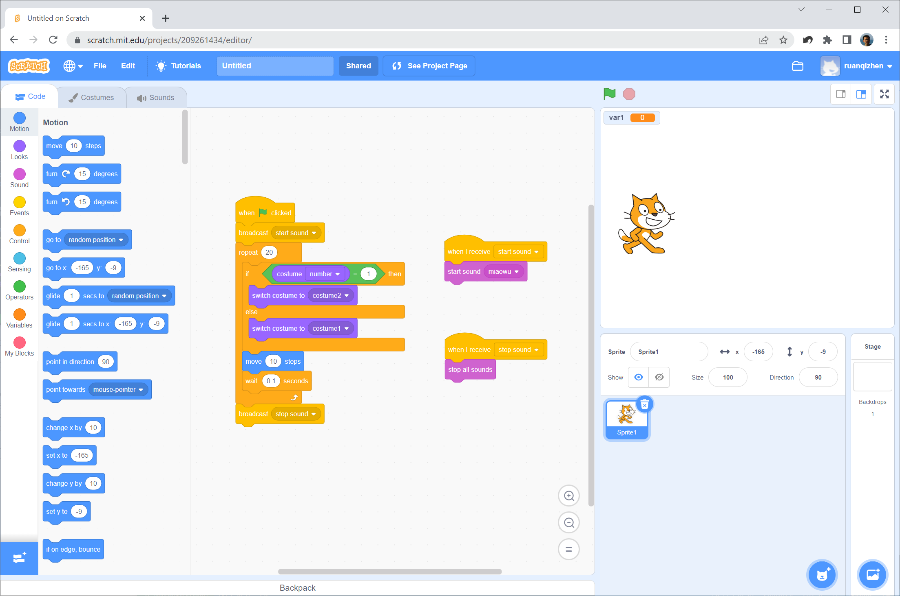

# Other Programming Languages

To truly master a programming language, it is rarely enough to study only that language. Confining your thinking to a single environment can limit your perspective; exploring alternative paradigms can open up new viewpoints. Learning other languages helped me appreciate the elegant design choices in LabVIEW, while also highlighting limitations I had previously overlooked. Throughout this book, I draw comparisons between LabVIEW and text-based languages like C/C++ to provide a deeper understanding of software architecture.

This section, although part of a book about LabVIEW, does not spotlight LabVIEW exclusively. Instead, we'll take a cursory look at some other programming languages, examining how they differ from LabVIEW and what their individual strengths and weaknesses are. Given the vast number of programming languages, I can only select a few particularly notable ones for brief analysis.

## Why Are There So Many Programming Languages?

It's a daunting task to count the exact number of programming languages in existence. Sometimes, computer science courses even require students to create a new programming language. Considering only those languages with formal specifications and widespread usage, there are easily thousands. So, why do we need so many programming languages? Couldn't we just maintain one or a few languages to handle all programming tasks?

This is because new requirements often demand new language features, and the cost of modifying an existing language is prohibitively high due to legacy constraints. Frequently, it is more economical and safer to design a new language than to overhaul an old one. Adding disruptive features to an existing language risks breaking backwards compatibility for millions of existing lines of code. Consequently, designers prefer to create new languages. For instance, despite C's dominance, the rise of the object-oriented paradigm led to the creation of C++ and Java.

Of course, active programming languages do not remain completely static. A living language is constantly evolving, but updates must carefully preserve backwards compatibility. For example, C++ has evolved significantly over the decades—introducing templates, the Standard Template Library (STL), and lambda functions. Modern C++ code looks very different from early C++ code. Early C++ development required significant effort to manage pointers and prevent memory leaks. Today, features like smart pointers handle memory automatically, allowing developers to focus on application logic. Despite these major shifts, old C++ programs can still compile with modern compilers because backwards compatibility was strictly maintained.

Occasionally, designers decide that fixing a fundamental flaw justifies breaking compatibility. The transition from Python 2 to Python 3 is a famous example. Python 3 cleaned up string/Unicode handling and changed the behavior of integer division. Even though these changes were well-intentioned, they split the community and took over a decade for the industry to fully migrate.

LabVIEW has historically updated its file format with every major annual release. While newer versions can load older VIs (backwards compatibility), older versions of LabVIEW cannot open VIs saved in newer versions (forwards compatibility), which is a common source of frustration. Furthermore, National Instruments (NI) has often been hesitant to make deep internal changes to avoid breaking existing user code. For instance, fully integrating Unicode support is technically simple, but doing so would break legacy applications that rely on local code pages, making NI very cautious about modifying the default text encoding.

Despite the proliferation of new programming languages, the vast majority tend to closely resemble an existing language. Among the most popular programming languages—C++, C#, Java, PHP, and JavaScript—all are influenced by C. These languages borrowed elements such as syntax, structure, keywords, and operators directly from C. This strategy primarily aims to reduce the learning curve for new languages. For example, because Java and C++ share much of their syntax, a programmer proficient in C++ will find learning Java significantly easier. They can bypass the numerous similarities between the two languages, focusing instead on their differences, thus smoothly transitioning to programming in the new language.

## The Lambda Calculus Programming Language

Let's start with a question for the reader: To what extent can a programming language be simplified?

Certain features in programming languages are clearly designed for the convenience of developers and are not strictly necessary. For example, support for object-oriented programming isn't required in an extremely minimalistic programming language. Likewise, many library functions, which exist to facilitate ease of use, could also be discarded. Is a loop structure essential? It appears that it too could be omitted, as any loop can be replaced by recursion. In the worst-case scenario, programmers could simply unroll loops into several more lines of code if they don't mind the additional hassle. But what about conditional structures? Is it possible for a programming language to function without if-else statements and still implement the needed logic? Surely basic operators like addition, subtraction, multiplication, and division are indispensable, right? Could programmers feasibly implement addition and subtraction functionalities in a language that lacks these operations?

These questions crossed my mind when I was first learning C. During one debugging session with some C code, I delved deeper and deeper into the called functions, eager to understand how a particular piece of data was being generated. Eventually, I hit a roadblock with a library function that the debugger couldn't step into. C programs often rely on many pre-compiled library functions, where programmers are familiar with the interfaces but not the implementation code. This approach is efficient but hindered my learning process. It led me to wonder: Is there a programming language out there that doesn't depend on any pre-compiled libraries, providing all functionalities directly in source code form for the programmer? This would surely simplify the learning process. Additionally, I speculated whether many of the keywords and operators also needed to be pre-compiled. What's the absolute minimal set of functionalities required by a programming language?

I found the answers I was looking for when I discovered $\lambda$-calculus (Lambda Calculus), developed by Alonzo Church in the 1930s. $\lambda$-calculus is the ultimate exemplar of programming language minimalism. While similar minimalist languages like SKI, Iota, and Jot exist, $\lambda$-calculus remains the most iconic and celebrated. Just how minimalist is $\lambda$-calculus? Its entire syntax can be described succinctly in a few lines:

- The allowed characters include lowercase letters, the English period (`.`), parentheses, and the Greek letter lambda (`\lambda`).
- **Variables:** A single lowercase letter (e.g., $x$, $y$, $z$).
- **Function definition (abstraction):** Written as $\lambda \langle \text{variable} \rangle . \langle \text{expression} \rangle$, such as $\lambda x.x$. This defines a function that takes a parameter $x$ and returns it—equivalent to the identity function $f(x) = x$.
- **Function application:** Written as $\langle \text{function} \rangle \langle \text{argument} \rangle$, such as $(\lambda x.x)a$. This represents passing the argument $a$ into the function $\lambda x.x$, which evaluates to $a$.
- A variable, a function definition, and a function application are collectively referred to as **lambda terms** (or expressions).
- Parentheses are used to group terms and define the order of operations.

This overview encapsulates the entirety of the programming language's syntax. In creating a compiler for this language, I realized that the most crucial part could be implemented in merely a dozen lines of code, making a compelling case for Lambda Calculus as one of the simplest programming languages in existence.

It's clear from observing the most basic operational rules of this programming language:

- $\lambda x.x$ and $\lambda y.y$ are equivalent, which we can express as $\lambda x.x \equiv \lambda y.y$ ($\alpha$-equivalence).
- $(\lambda x.x)a$ simplifies to $a$, written as $(\lambda x.x)a = a$ ($\beta$-reduction).
- $(\lambda x.y)a = y$.
- $(\lambda x.(\lambda y.x))a = \lambda y.a$.

You might have noticed, this programming language lacks loops, conditional structures, and even fundamental elements like numbers, addition, and subtraction. Indeed, the only functionality a programming language must provide is function calling. With function calls alone, all other operations can be implemented. Below, we introduce how to define and implement some basic programming functionalities in Lambda Calculus:

- Implementing functions with multiple arguments is done using a technique called **currying**. Since every function in $\lambda$-calculus takes exactly one argument, a multi-parameter function is represented as a nested chain of single-argument functions. For example, to represent a function $f(x, y, z)$, we write: $\lambda x.\lambda y.\lambda z.x\ y\ z$.
- Logical TRUE is defined as: $\text{TRUE} \equiv \lambda x.\lambda y.x$ (a function that takes two arguments and returns the first). For example:
  $$(\text{TRUE}\ a\ b) \equiv (\lambda x.\lambda y.x)\ a\ b = (\lambda y.a)\ b = a$$
- Logical FALSE is defined as: $\text{FALSE} \equiv \lambda x.\lambda y.y$ (a function that takes two arguments and returns the second). For example:
  $$(\text{FALSE}\ a\ b) \equiv (\lambda x.\lambda y.y)\ a\ b = (\lambda y.y)\ b = b$$
- For conditional logic, we define: $\text{IF} \equiv \lambda b.\lambda t.\lambda f.b\ t\ f$ (or simply the identity function $\lambda x.x$). Evaluating it:
  $$\text{IF}\ \text{TRUE}\ t\ f \equiv (\lambda x.x)\ \text{TRUE}\ t\ f = \text{TRUE}\ t\ f = t$$
  $$\text{IF}\ \text{FALSE}\ t\ f \equiv (\lambda x.x)\ \text{FALSE}\ t\ f = \text{FALSE}\ t\ f = f$$
- Using these definitions, logical operators are defined as:
  $$\text{AND} \equiv \lambda a.\lambda b.\text{IF}\ a\ b\ \text{FALSE}$$
  $$\text{OR} \equiv \lambda a.\lambda b.\text{IF}\ a\ \text{TRUE}\ b$$
  $$\text{NOT} \equiv \lambda a.\text{IF}\ a\ \text{FALSE}\ \text{TRUE}$$
- Defining numbers (Church Numerals):
  - Church defined natural numbers based on the Peano axioms:
    - $0$ is a natural number.
    - Every natural number $n$ has a successor $S(n)$.
  - In $\lambda$-calculus, numbers are represented by the number of times a function $f$ is applied to an argument $x$:
    $$\text{0} \equiv \lambda f.\lambda x.x \quad (\text{equivalent to FALSE})$$
    $$\text{1} \equiv \lambda f.\lambda x.f\ x$$
    $$\text{2} \equiv \lambda f.\lambda x.f\ (f\ x)$$
    $$\text{3} \equiv \lambda f.\lambda x.f\ (f\ (f\ x))$$
- The successor function $S$ is defined as: $\text{S} \equiv \lambda n.\lambda f.\lambda x.f\ ((n\ f)\ x)$. Applying this to $0$ yields $1$:
  $$\text{S}\ \text{0} \equiv (\lambda n.\lambda f.\lambda x.f\ ((n\ f)\ x))\ (\lambda f.\lambda x.x) = \lambda f.\lambda x.f\ ((\lambda f.\lambda x.x\ f)\ x) = \lambda f.\lambda x.f\ x \equiv 1$$
- Addition is defined as: $\text{ADD} \equiv \lambda a.\lambda b.(a\ \text{S})\ b$. This applies the successor function $S$ to $b$ exactly $a$ times:
  $$\text{ADD}\ 2\ 3 = (\lambda a.\lambda b.(a\ \text{S})\ b)\ 2\ 3 = (2\ \text{S})\ 3 = (\lambda x.\text{S}\ (\text{S}\ x))\ 3 = \text{S}\ (\text{S}\ 3) = \text{S}\ 4 = 5$$

These examples showcase some of Lambda Calculus's most basic functionalities. As a Turing complete language, it's capable of far more than this; essentially, anything other programming languages can accomplish, it can too. However, leveraging it means all functionalities must be manually implemented by the programmer, which is highly inefficient. Although Lambda Calculus may not be practical as a programming language, its status as a classical educational tool has profoundly influenced the development of subsequent programming languages. Functional programming, in particular, was inspired by it, and today, Lambda functions have become a standard feature in mainstream programming languages.

## The Scheme Programming Language

Scheme, a dialect of Lisp, was my first foray into the world of functional programming languages. Lisp, created in the late 1950s, is the second-oldest high-level programming language still in active use (after Fortran). Its logo features two lambda ($\lambda$) symbols, reflecting its roots in $\lambda$-calculus. Unlike C++ or Java, which have rigid language standards, Lisp was designed to be highly extensible, allowing programmers to define new language structures using macros. This extensibility led to many dialects. For instance, the Emacs text editor uses Emacs Lisp (Elisp). Today, while the original Lisp is mostly an academic reference, dialects like Clojure, Common Lisp, and Scheme are widely used.

In the 1970s, MIT researchers designed **Scheme**, a minimalist dialect of Lisp that pared the language down to its bare essentials (symbolically represented by a single $\lambda$ in its logo). Scheme became the teaching language for MIT's famous introductory computer science curriculum. Today, Scheme is standardized through the Revised^n Report on the Algorithmic Language Scheme (R^nRS). Racket is a popular modern descendant of Scheme, though developers often use "Scheme" and "Lisp" to refer to this family of languages.

Learning functional programming, with its radically different mindset from procedural and object-oriented programming, had a learning curve as steep as my first encounter with LabVIEW. In functional programming, functions are **first-class citizens**—treated just like integers or strings. They can be passed as arguments to other functions, nested inside structures, and returned as results.

A comprehensive explanation of Scheme programming would necessitate an entire book. Here, I can only touch upon some of Scheme's most elementary features. Let's illustrate with the quintessential "Hello World" program. In Scheme, the code to display "Hello, World!" is as follows: `(display "Hello, World!")`

In this example, `display` functions as a means to print text on the screen, with the following string serving as its argument. In Scheme, both data (such as lists) and program structures (including functions and conditional statements) must be wrapped in parentheses, making these surrounding parentheses essential.

Looking at this single line, the difference from the common procedural programming languages doesn't seem too vast. The use of operators shows a slight variation: in Scheme expressions, operators are treated as ordinary functions, with the function name preceding its parameters. Thus, to calculate "2+3", you would write: `(+ 2 3)`.

A more significant departure is observed in the handling of functions. Firstly, functions can be anonymous, similar to other data types. For instance, `2` is a literal value; `(lambda (x) (* x x))` is a literal function (an anonymous function). The `lambda` keyword defines a function, followed by its parameter list `(x)` and the function body `(* x x)` which calculates the square of `x`.

For convenience, functions can also be named. In Scheme, the `define` keyword assigns names to both data and functions. For example, `(define n 2)` names a piece of data "n" with the value 2; `(define square (lambda (x) (* x x)))` names a function "square". When defining functions, you can omit the `lambda` keyword for brevity, as seen in the alternative function definition `(define (square x) (* x x))`.

Let's say we have a group of squares with sides measuring 2, 3, 4, and 5, respectively. We can compile these measurements into a list, utilizing the `list` function in Scheme to create one: `(list 2 3 4 5)`. We can use the `map` function to apply the squaring function to the entire list. `map` takes a function as its first argument and a list as its second: `(map square (list 2 3 4 5))`, returning `(4 9 16 25)`. Here, the `square` function is passed as a parameter to the `map` function.

Anonymous functions can serve as parameters too. For instance, to calculate the perimeter of each square, one might write: `(map (lambda (x) (* x 4)) (list 2 3 4 5))`, which produces the result `(8 12 16 20)`.

The examples provided illustrate how the same `map` function can be employed to calculate not only the area of a group of squares but also their perimeters or other data points. In object-oriented programming paradigms, this kind of functionality, where calling the same method performs different operations, is typically achieved through polymorphism or dynamic binding. Conversely, in functional programming paradigms, this flexibility is realized by passing functions as arguments.

The concept of returning a function as a result might initially seem more complex than passing one as an argument. Consider the following line of code: `(define (call-twice f) (lambda (x) (f (f x))))`. This code defines a function named `call-twice` with a single parameter, `f`, which interestingly returns not data but another function: `(lambda (x) (f (f x)))`. This returned function can also accept a parameter, subsequently applying the function `f` twice in a nested call. Essentially, `call-twice` accepts another function as its input and yields a new function, whose function is to perform a nested invocation of the input function twice.

For example, passing the `square` function we defined earlier to `call-twice` generates a new function that calculates the square of a square. For instance, the execution of `((call-twice square) 3)` results in raising 3 to the fourth power, yielding 81. If the execution is `((call-twice (lambda (x) (* x 4))) 3)`, the outcome is `3*4*4 = 48`. You might want to mentally work through the result of the following program: `(map (call-twice square) (list 2 3 4 5))`.

Lambda functions are now supported by many mainstream programming languages, with their application similar to functions in Scheme. If you have encountered them in other languages, you'll find the examples mentioned above more accessible.

My most significant insight from studying Scheme was gaining a complete understanding of recursion. Scheme lacks loops, necessitating the use of recursion for all iterative processes. This was a striking contrast to early versions of LabVIEW, which did not support recursion (since all VI data spaces were statically allocated, preventing reentrant self-calls), forcing programmers to use While Loops or For Loops. Recursion requires careful management of the call stack, such as utilizing tail-call optimization to prevent stack overflow.

LabVIEW does not directly support functional programming. While you can call VIs dynamically using VI Server or use strictly-typed VI references to pass execution targets, LabVIEW lacks the ability to construct anonymous VIs dynamically at runtime, return functions from other functions, or perform closures.

## The Scratch Programming Language

It was in the early 2000s when I watched a lecture demonstrating a special version of LabVIEW designed specifically for children's education and for use with LEGO toys. Graphical programming, as it turns out, is more attractive to young children than text-based coding, which indeed pointed to a promising direction for LabVIEW. Unfortunately, LabVIEW was a pioneer that somehow missed the mark. Today, when mentioning graphical programming languages for children's education or toys, most people immediately think of Scratch or its various derivatives.

Scratch, developed by MIT in 2003, quickly became the dominant tool in children's education. It had several key advantages over LabVIEW in this market:

* **Open Source Ecosystem:** Scratch's open-source model allowed toy manufacturers and hardware developers to integrate it freely. NI's closed ecosystem meant that integrating LabVIEW with third-party hardware was expensive and legally complex. For low-margin toy companies, an open tool like Scratch was far more appealing. Today, LEGO, Xiaomi, and many other manufacturers use Scratch-based environments to program their educational robots.

* **Simplified Syntax:** Scratch eliminates syntactical barriers completely by using interlocking blocks that represent code structures. While LabVIEW is visual, tracing data wires, managing buffer allocations, and dealing with strictly-typed terminals can still be overwhelming for a child. Scratch hides these low-level complexities.

* **Modern Web Tech:** Scratch is built on web standards (originally Flash, now HTML5/JavaScript), allowing it to run directly in any web browser without installation. LabVIEW, on the other hand, is a heavy desktop application. NI's early web attempt relied on Microsoft Silverlight, which was eventually abandoned, delaying LabVIEW's web transition.

Scratch is accessible via a web interface, eliminating the need for software installation on computers. Users can simply navigate to its official webpage in a browser to begin programming:

The Scratch editor has three main panels:
- **Left (Block Palette):** Displays the available code blocks, similar to LabVIEW's **Functions Palette**.
- **Center (Scripts Area):** Where blocks are dragged and assembled, akin to LabVIEW's **Block Diagram**.
- **Right (Stage):** Displays the visual output, animations, and sprites, corresponding to LabVIEW's **Front Panel**.

Scratch, as a web-based programming language, has its limitations. Users can draw backgrounds or cartoon characters within the interface and even record sounds. The program is capable of responding to user interactions on the interface, controlling the movements of cartoon characters, and playing sounds, among other functions. The fundamental components of Scratch programs are colorful blocks, often referred to as "blocks" or "sprites." The programming approach in Scratch resembles building with blocks; stacking different blocks in a sequence to form a program. In the example program shown, the blocks are arranged into three groups, which run in parallel because they are not connected. Each block group begins with an event trigger. The large group on the left is the main program, which starts running upon a user clicking the green flag event, emitting some events (via the `broadcast` block) during its execution. The other two block groups are activated by these messages to either play or stop sounds. Besides broadcasting messages, the main program also executes a loop, `repeat 20`, within which it calls the `move` function to advance a little fox (illustrated in "costume") across the screen. The smaller block group on the right side enables the fox to make a "meow" sound simultaneously.

This program illustrates some stark differences between Scratch and LabVIEW:

- **Text-Based Visual Blocks:** Scratch is not entirely graphical; it is a text-based language wrapped in visual blocks. Programmers must read the text on each block to understand what it does. LabVIEW, conversely, uses purely graphical icons without text labels for functions, encouraging developers to create meaningful icons for their subVIs.
- **Uniform Block Layout:** Scratch blocks stack vertically in a single column layout, resulting in a highly uniform, though sometimes monotonous, look. LabVIEW's dataflow diagram allows 2D spatial layouts, allowing programmers to arrange wires and nodes freely (which can result in very clean, elegant designs—or highly unreadable 'spaghetti' code).
- **Data Flow vs. Control Flow:** LabVIEW uses wires to represent dataflow and sequence. Scratch has no wires; it relies on vertical stacking for control flow and uses global variables or messaging for data transfer.
- **Type Safety via Shapes:** LabVIEW uses color-coded wires to represent data types. Scratch uses different slot shapes (e.g., rounded slots for numbers/strings, pointed slots for boolean conditions) to ensure that only compatible blocks can fit together, enforcing compile-time type safety physically.
- **Hardware Integration:** LabVIEW uses a single unified compiler and library structure to support a massive range of industrial DAQ and control hardware. Scratch utilizes custom forks or extensions (like Scratch Link) to interact with microcontrollers, sensors, and robotics.

## The Python Programming Language

The languages we have discussed all have strong, distinct personalities. Often, the most popular tools in software engineering are those that offer a pragmatic balance—lacking extreme design dogmas but also lacking significant drawbacks. Python is a prime example of this pragmatism. It has become one of the most widely used languages in the world due to its readability and massive ecosystem. To explore Python in depth, I have written a dedicated companion book: [Exploring Python](https://py.qizhen.xyz/).
