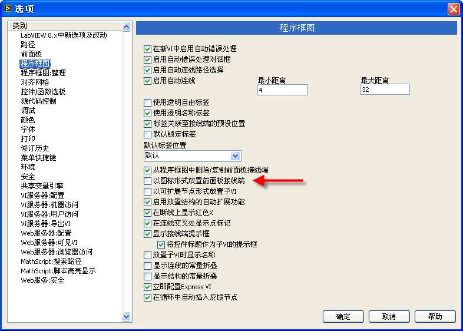
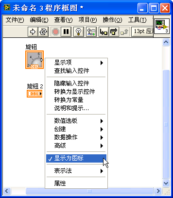
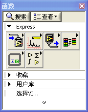
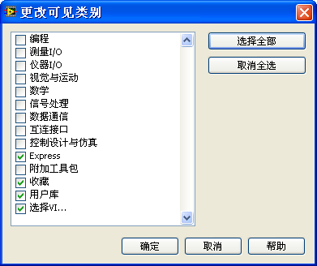
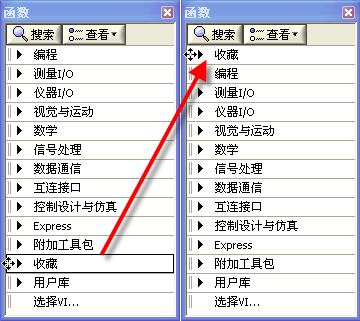
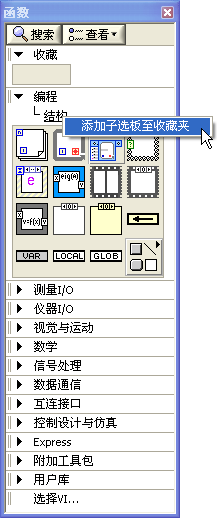
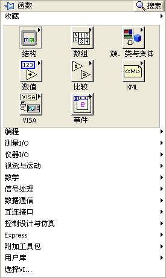
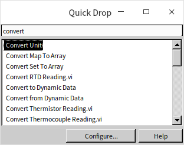
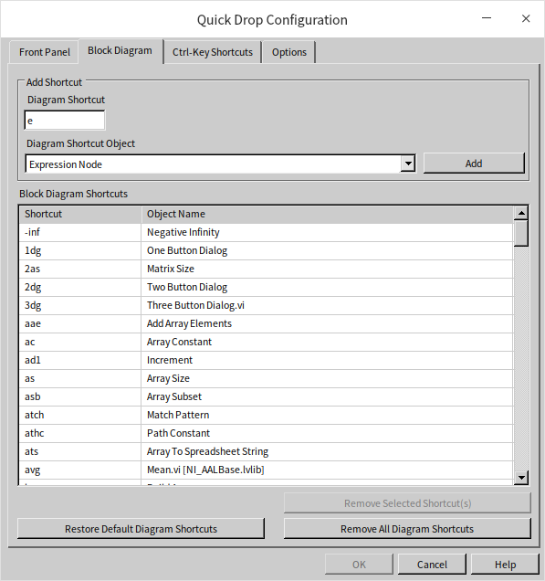
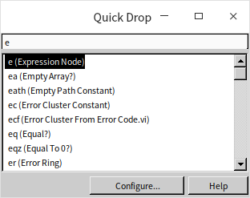

# Customizing the LabVIEW Environment

LabVIEW's default settings might not always align with your preferences. Fortunately, the IDE is highly customizable, allowing you to tailor it to your workflow and boost your programming efficiency.

## Environment Options

To explore and adjust settings, navigate to **Tools -> Options** in the LabVIEW menu. This opens the Options dialog:

This dialog contains a wide range of configurable settings. If you are unsure what a specific option does, click the **Help** button on the dialog for detailed explanations.

### Tuning the Block Diagram: Icon vs. Non-Icon Terminals

Configuring your environment is highly subjective; there is no one-size-fits-all setup. You should experiment with different settings to find a workflow that feels natural.

For example, a common tweak is changing how Front Panel terminals appear on the Block Diagram. By default, LabVIEW places them as large icons:

While these icons are colorful, they occupy a significant amount of space and quickly clutter the diagram. As a professional best practice, it is highly recommended to display terminals as small text nodes. To make this the default behavior, go to **Tools -> Options -> Block Diagram** and uncheck **Place front panel terminals as icons**.

You can configure many other details here, such as the blinking frequency of UI controls (discussed in [Local Variables and Properties](data_and_controls#implementing-blinking-controls-for-alerts)) or advanced compiler settings that we will cover later.

### Configuration Files (`LabVIEW.ini`)

LabVIEW saves these preferences in a configuration file. On Windows, this is `LabVIEW.ini`, located in the same directory as `LabVIEW.exe`. Once you are familiar with its syntax, you can edit this file directly to configure advanced settings. We will explore how to read and write configuration files programmatically in the [File I/O](pattern_file) chapter.

## Optimizing the Palettes

The Controls and Functions Palettes are your primary tools in LabVIEW, and customizing them can save you significant time. Since they share similar configuration menus, we will focus on the Functions Palette for this discussion.

### Pinning Palettes

If you are placing many functions, click the **thumbtack** icon in the top-left corner of the palette to pin it as a floating window. This keeps the palette visible above your windows so you don't have to right-click repeatedly. However, a floating palette can block your view of the code. If it gets in the way, close the window and rely on right-clicking the diagram to open a temporary palette instead.

### Customizing Visible Palette Categories

When you first open a palette, it may show only a few default categories, hiding others:

You can customize the visible categories to match your needs:

1. Pin the palette to make it a floating window.
2. Click the **Customize** button on the palette toolbar and select **Change Visible Palettes**.
3. In the dialog box, check the categories you want to see and uncheck those you rarely use to keep the menu clean:

Since LabVIEW expands the topmost category by default, placing your most-used category at the top of the list will save you extra clicks.

### Reordering Categories

To move a category within the palette, click the **Customize** button on the pinned palette and select **Change Visible Palettes**. You can also drag categories directly: hover your mouse over the double vertical lines to the left of a category name (like **Favorites**), and drag it to a new position. Moving **Favorites** to the top ensures it is the first menu that expands when you open the palette:

### Adding Items to Favorites

The **Favorites** category is highly customizable. You can add frequently used folders or individual functions to it. For example, to add the **Structures** subpalette:

1. Navigate to **Programming -> Structures**.
2. Right-click the **Structures** title bar in the palette and select **Add Subpalette to Favorites**:

Adding your most-used subpalettes to **Favorites** puts your daily tools right at your fingertips when you open the palette:

## Finding Functions and Controls

With thousands of functions available, searching is often faster than browsing menus.

### Palette Search

Click the **Search** button (magnifying glass) at the top of any palette:

Type your keyword in the search bar. You can drag and drop functions directly from the search results onto your diagram. Double-clicking a search result will navigate to its location on the palette, helping you learn where to find it next time.

### Quick Drop

For experienced developers, the fastest way to place items is **Quick Drop**.

Press **Ctrl+Space** to open the Quick Drop search bar. Type the name of the function you need and press Enter to place it:

*Note: The **Ctrl+Space** shortcut conflicts with the default Chinese input method toggle in Windows. If you use a Chinese input method, you should change this shortcut. Go to **Tools -> Options -> Environment**, scroll down to the **Keyboard Shortcuts** section, and map Quick Drop to an alternative like **Ctrl+Shift+Space** or **Ctrl+Alt+Space**.*

### Quick Drop Shortcuts

Quick Drop also supports powerful shortcuts for modifying existing code. Open Quick Drop (**Ctrl+Space**) and use the following keyboard combinations:

- **Ctrl+D:** Automatically creates and wires controls/indicators for all inputs and outputs of a selected function or subVI.
- **Ctrl+R:** Removes a selected node from the diagram and automatically reconnects the broken wires on either side of it.
- **Ctrl+T:** Moves the labels of all selected nodes to a standard position (such as above controls or below indicators).

Click the **Configure** button on the Quick Drop window to customize these shortcuts or add your own:

For instance, if you use the **Expression Node** frequently, you can assign it the custom shortcut `e`. Typing `e` in Quick Drop and pressing Enter will immediately place an Expression Node:

## The Tool Palette and Mouse Workflows

Unlike text-based programming, where the mouse is primarily used for text selection, graphical coding requires the mouse cursor to perform a variety of operations: positioning elements, resizing boxes, wiring terminals, painting objects, and placing debugging probes.

### Automatic Tool Selection

By default, LabVIEW uses **Automatic Tool Selection** to change the cursor tool dynamically based on where you hover:

- Hovering over the center of a node turns the cursor into the **Positioning Tool** (arrow) to select or drag elements.
- Hovering over a terminal changes it to the **Wiring Tool** (wire spool).
- Hovering over a control's value area switches it to the **Operating Tool** (finger pointer) to edit values.

While positioning the cursor takes some practice, leaving Auto-Tool enabled is the industry standard for development speed.

### Manual Tool Selection

If you find the automatic switching distracting, you can choose tools manually using the **Tool Palette**:

- Open the palette via **View -> Tools Palette**, or
- Hold **Shift** and right-click an empty area of the panel or diagram.

At the top of the palette is the **Automatic Tool Selection** button (wrench and screwdriver icon). Click it to disable Auto-Tool and click any tool below to lock the cursor to that function (e.g., lock to Wiring).

You can also toggle tools using keyboard shortcuts:

- Press the **spacebar** to toggle between the **Wiring** tool and the **Positioning** tool on the Block Diagram (or the **Operating** and **Positioning** tools on the Front Panel).
- Press the **Tab** key to cycle through the four most common tools: Operating, Positioning, Text Editing, and Wiring.
- During VI debugging, the **Tab** key cycles through the Operating, Breakpoint, and Probe tools.

## Practice Exercise

- Take some time to thoroughly explore all the function palettes available in LabVIEW. This exercise involves reviewing each palette to identify functions that you might use in future projects. As you navigate through these palettes, pay attention to the arrangement and accessibility of the functions. Consider if the current order of the palettes aligns with your workflow or if rearranging them could enhance your programming efficiency. 
