# Local Variables and Properties

## The Role of Controls and Variables

For developers familiar with text-based programming, variables are fundamental containers for storing data. When learning LabVIEW, however, you must adjust this mental model. LabVIEW does not have direct equivalents to traditional variables. Instead, it uses different graphical elements to hold and transfer data.

Programmers new to LabVIEW often mistake Front Panel controls for variables since both store data. However, treating controls as traditional variables violates LabVIEW's dataflow paradigm and can lead to inefficient, buggy code.

The primary purpose of controls and indicators is to facilitate input and output. They act as interactive UI elements on the Front Panel, and as parameter terminals on subVIs (equivalent to function arguments and return values in text-based languages).

What, then, is the closest equivalent to a variable in LabVIEW? The answer is **wires**. Data flows from node to node along these wires, which act as temporary data carriers that exist only as long as needed to pass data. This highlights the core difference in how LabVIEW manages memory: it prioritizes the flow and transformation of data over time, rather than the static storage locations typical of variables in text-based languages.

## Labels and Captions

In LabVIEW, controls have two text properties that are often confused: **Labels** and **Captions**.

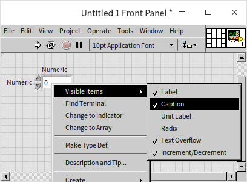

While both provide a descriptive name for a control, they serve very different purposes:

- **Labels** act as unique identifiers for controls. They are used to identify terminals on the Block Diagram and must remain static during execution. Labels must be unique within a VI and should never be left blank.
- **Captions** are purely cosmetic. They are designed for user interface display and can be changed dynamically at runtime. Captions do not have to be unique and are highly useful for UI localization (multilingual support). You can also hide the caption text, displaying only the control.

When you place a new control on the Front Panel, it has a Label but no Caption by default. To display a Caption, right-click the control and select **Visible Items -> Caption**.

For effective use of Labels and Captions in your VIs, consider the following recommendations:

| VI Type | Label Usage | Caption Usage |
| :--- | :--- | :--- |
| **Low-Level SubVIs** | Visible (acts as a code identifier on the Block Diagram). | Default (usually empty). |
| **User Interface VIs** | Hidden; keep in English to simplify international development. | Visible; localized into the target user language. |
| **API VIs** | Visible; keep in English (avoid showing default values here). | Visible; localized. Include default values and units in parentheses (e.g., `Timeout (ms: 1000)`). |

Only the Caption property can be modified dynamically while a VI is running. If you see a control that has different names on the Front Panel and the Block Diagram, it means the Front Panel is showing the Caption while the Block Diagram is showing the Label.

## Default Values

In text-based languages like C++, you cannot run a standalone function or method without a calling context. To test a sub-function, you have to set up a project, write a `main()` function, initialize the inputs, pass them to the sub-function, and compile the code. This makes unit testing tedious.

In contrast, every LabVIEW VI can be run independently as a standalone program. This makes testing and debugging extremely convenient.

Every control in LabVIEW has a default value (e.g., numeric controls default to `0`). If you run a VI standalone, it uses the current values on the Front Panel. When you close and reopen a VI, all controls revert to their default values. If you want to change a control's default value (for instance, setting a numeric control to default to `0.5` instead of `0`), set the control to `0.5`, right-click it, and select **Data Operations -> Make Current Value Default**.

When a VI is called as a subVI, its Front Panel controls act as input parameters. If the calling VI does not wire a value to a subVI terminal, the subVI automatically uses its control's default value. This allows you to omit optional parameters, making your block diagrams much cleaner. It is best practice to document default values in the terminal's description or label so users know they are optional.

For example, the Context Help for the **Open Config Data.vi** shows that the **Create File if Necessary** input has a default value of `True` (indicated by parentheses: `(True)`). If you want it to create the file, you can leave the input terminal unwired, and LabVIEW will automatically pass `True` during execution:

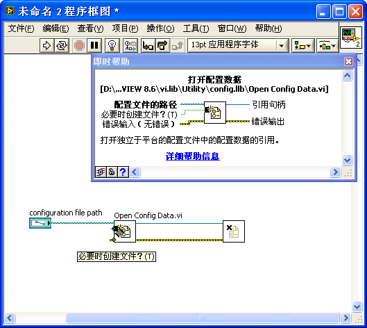

## Local Variables

### Creating Local Variables

You can create a local variable for any control or indicator. Right-click the object (or its terminal on the Block Diagram) and select **Create -> Local Variable**:

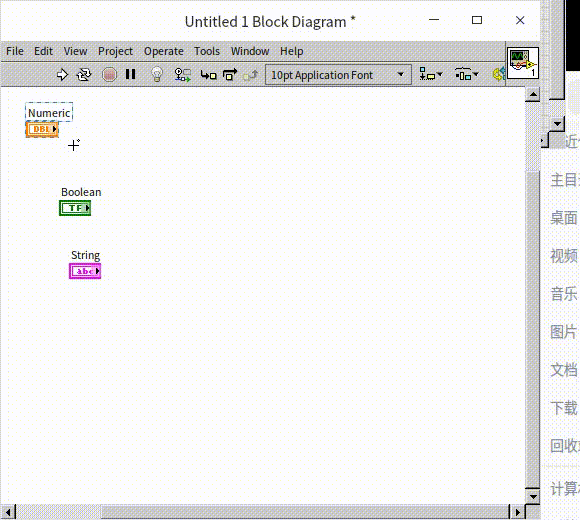

A local variable is represented on the Block Diagram as a node with a small house icon displaying the control's label. This node acts as a reference pointing to the control: reading from the local variable retrieves the current value of the control, and writing to it updates the control's value. You can change which control a local variable points to by clicking the node and selecting a different control from the list.

Unlike control terminals (which have fixed directions: controls are output-only, indicators are input-only), local variables can be used for both reading and writing. Right-click a local variable and select **Change to Read** or **Change to Write** to change its data direction.

While local variables are extremely flexible, programmers coming from text-based backgrounds often overuse them. In LabVIEW, you should pass data using wires whenever possible. Overusing local variables bypasses the dataflow paradigm, making code harder to read, creating memory overhead, and causing race conditions (which we will discuss in [The Challenges of LabVIEW](appendix_problem)). Local variables should be used selectively for UI control and multi-threaded synchronization.

### Interacting with Controls

Sometimes you need to write data back to an input control or read data from an output indicator. For example, consider a program that monitors text input: if a user types a string of 4 characters or fewer, it displays normally; if they type a 5th character, the input control is immediately cleared. 

Because an input terminal is an output port on the Block Diagram, you cannot wire data *into* it. Instead, you must write to a local variable of the input control to clear its value:

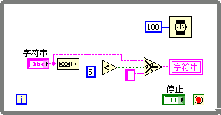

*Note: For this program to feel responsive, you must right-click the Front Panel string control and select **Update Value While Typing** so that it updates the Block Diagram immediately with every keystroke rather than waiting until the user presses Enter or clicks outside the box.*

### Asynchronous Data Sharing (Multithreading) {#data-sharing-across-multiple-threads}

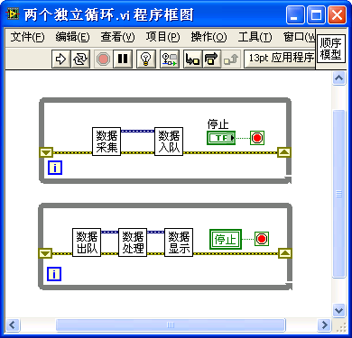

The Block Diagram above features two independent loops. Because there are no wires connecting them, LabVIEW runs them in parallel using different threads. Our goal is for both loops to run concurrently and stop at the same time when the user clicks the **Stop** button.

Since there is only one physical **Stop** terminal on the diagram, we link it to the stop condition of the top loop, and create a local variable of the **Stop** control to wire to the stop condition of the bottom loop. When the user clicks the Stop button, both loops read the `True` value (one from the terminal, one from the local variable) and stop.

What happens if we try to stop both loops using a direct wire instead of a local variable, like this?

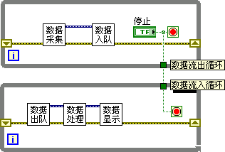

In LabVIEW, a loop cannot output data until it has fully finished executing. In the diagram above, the wire carrying the Stop value must exit the top loop before it can enter the bottom loop. This introduces a sequential dependency: the top loop runs first, while the bottom loop waits. When you click **Stop**, the top loop exits, the wire finally passes the `True` value to the bottom loop, and the bottom loop starts and immediately stops after a single iteration. The two loops fail to run in parallel. Using a local variable is essential here to break this sequential wire dependency.

## Property Nodes and Invoke Nodes

### Property Nodes

Property Nodes let you programmatically modify or query control settings (such as visibility, size, color, or key focus) at runtime.

To create a Property Node, right-click a control or its terminal and select **Create -> Property Node**. This opens a list of available properties. The properties for a numeric control are shown below:

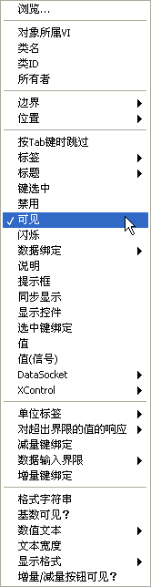

Because there are hundreds of properties, use the **Context Help** window (**Ctrl+H**) to read explanations when hovering over them. 

The properties menu is structured hierarchically:

- The top levels contain general properties shared by all objects (such as the parent VI).
- The next sections contain properties common to all Front Panel controls (such as position, size, and visibility).
- The bottom sections contain properties specific to the data type (such as numeric format or unit labels).

To see this type hierarchy clearly, place a **Class Specifier Constant** on the Block Diagram (located in the Functions Palette under **Programming -> Application Control**). Clicking it displays the inheritance hierarchy of LabVIEW objects:

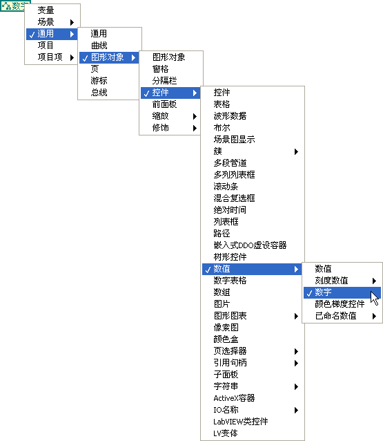

We will cover this inheritance structure in [The Hierarchy of Object Classes](vi_server_for_ui#object-class-hierarchy).

Properties can be read-only, write-only, or read/write. You can change a property's direction by right-clicking it and selecting **Change to Read** or **Change to Write**. *Note: Some properties (such as labels) can only be written when the VI is in edit mode; attempting to write to them while the VI is running will return an error.*

A single Property Node can get or set multiple properties. Drag the bottom edge of the node to expand it and select additional properties:

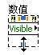

LabVIEW executes stacked properties sequentially from top to bottom. If setting a property near the top fails, the node halts immediately, and the remaining properties below it are ignored.

*Note: Property Nodes have a **Value** property, but using it to pass data is much slower than using wires or local variables. If you only need to pass data, avoid using the Value property node. However, the **Value (Signaling)** property is useful because writing to it programmatically triggers a "Value Change" event, which we will discuss in [Event Structures](pattern_ui).*

By default, Property Nodes display short names (English abbreviations). You can display long names (localized descriptions) by right-clicking the node and checking **Name Format -> Long Names**:

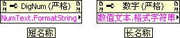

### Implicit vs. Explicit Control Association

When you copy and paste a Property Node (`Ctrl+C` / `Ctrl+V`), the copy loses its connection to the control and becomes an **unassociated Property Node** (indicated by an empty top terminal). This is called an **explicit Property Node**, and it requires a control reference wired to its input. We will discuss these in [Dynamic Interface Adjustments](vi_server_for_ui).

To copy a Property Node while maintaining its connection (an **implicit Property Node**), hold the **Ctrl** key and drag the node with your mouse. This Ctrl-drag shortcut works for copying any object in LabVIEW:

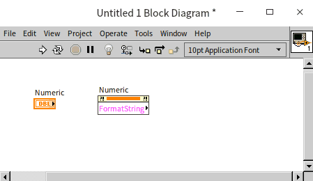

You can also disconnect a node from its control by right-clicking it and selecting **Disconnect From Control**:

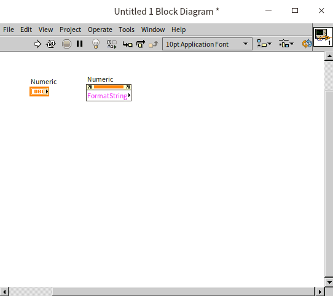

### Invoke Nodes

While Property Nodes represent attributes (nouns), **Invoke Nodes** represent methods (verbs). They are used to perform actions on controls, such as flashing an element, reinitializing it to its default value, or finding its bounds. Each Invoke Node executes one method:

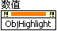

For example, the **Reinitialize to Default** method resets a control to its default value, and **Highlight Object** flashes the control to draw the user's attention.

We will explore property and invoke nodes extensively throughout the book to build dynamic, responsive user interfaces.

### Example: Animating Controls

You can dynamically move or resize controls during execution by modifying their **Position** and **Bounds** properties. For example, the program below updates the **Position** property of a Stop button inside a loop to make it move in a circle on the Front Panel:

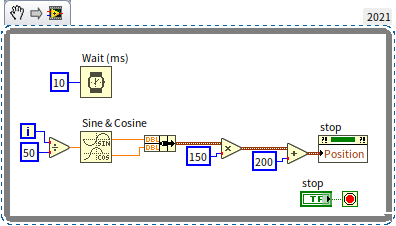

When run, the button animates smoothly:

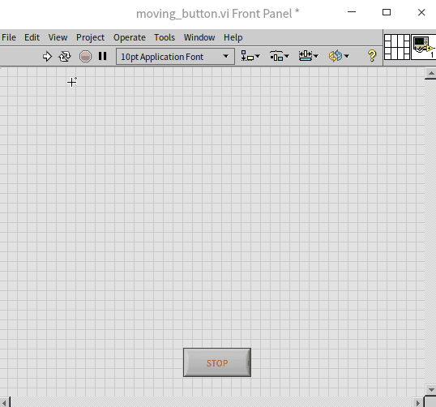

Try building this and clicking the moving Stop button!

In complex user interfaces, you often need to show or hide controls depending on the program's state. The standard way to do this is by writing to the **Visible** property node.

*Alternative tip: Some developers find editing completely hidden controls difficult during development. Instead of setting Visibility to False, they write to the **Position** property to move the control off-screen (e.g., setting the horizontal position to `-2000`). While this keeps the control accessible in edit mode by scrolling, be aware that positioning controls far off-screen can sometimes cause Front Panel scrollbars to behave erratically.*

These position and size properties apply to all UI elements, including static decorations. We will cover UI layout and alignment techniques in the [Interface Design](ui__) chapter.

### Example: Modifying Captions at Runtime

**Goal:** Build a user interface with a single numeric control that can accept either a length (in meters) or a weight (in kilograms), depending on the selection of a radio button.

To do this, we must change the caption of the numeric control dynamically. The caption itself is an object containing sub-properties like position, font, and visibility. To change the text, we navigate the hierarchy to **Caption -> Text**:

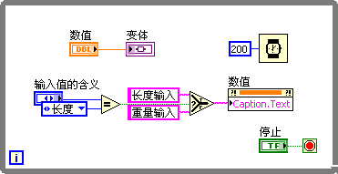

The resulting UI updates the text box label dynamically:

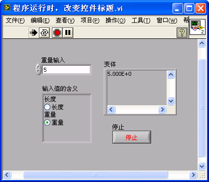

What if we tried to modify the **Label** of the control instead?

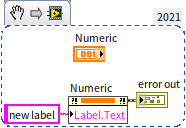

Running this returns an error: *"This property is writable only when the VI is in edit mode."* In LabVIEW, a running VI cannot modify its own control labels because labels act as compilation identifiers.

However, a running VI *can* modify the labels of controls in *other* VIs (which we will explore in [Changing Interface During Runtime](vi_server_for_ui)). But for modifying text on your own active UI, always use the **Caption** property.

### Example: Styling Text Dynamically

**Goal:** Display the sentence *"LabVIEW is very useful!"* in a string indicator, but make the words *"very useful"* bold, red, and larger.

To style a specific substring inside a string indicator, we first use a Property Node to select the characters by index, then apply font styles to that selection. We can combine these steps in a single Property Node:

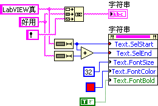

*Note: The red color constant is located in the Functions Palette under **Programming -> Graphics and Sound -> Picture Functions**. The corresponding terminal for the font properties can be configured by right-clicking the node.*

When run, only the selected characters are styled:

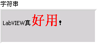

### Example: Alerting Users with Blinking Elements {#implementing-blinking-controls-for-alerts}

**Goal:** Create a safety warning that flashes when a sensor value exceeds a critical threshold.

We can trigger a visual alert by writing a Boolean `True` to a control's **Blinking** property. In the program below, we poll a Knob control. If its value exceeds `6.1`, we turn on the **Blinking** property for both the Knob and the Stop button:

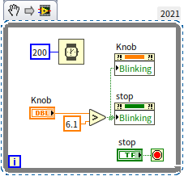

When the threshold is crossed, the controls flash to alert the operator:

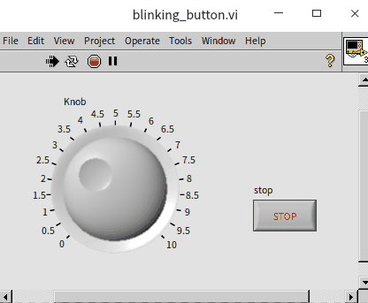

You can customize the flashing speed of controls. In the LabVIEW menu, select **Tools -> Options**. Under the **Front Panel** category, adjust the **Blink Delay of Front Panel Controls** (which defaults to `1000` ms). Setting this to `300` ms will make controls blink much faster for high-priority alerts:

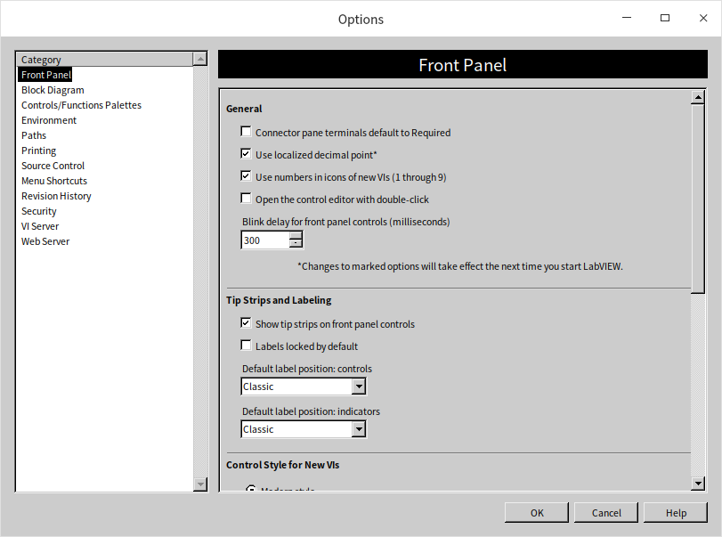

### Example: Disabling Specific Options in Enums

**Goal:** Disable specific options in a drop-down Enum control dynamically based on the program state.

To disable menu options, use the **Disabled Items[]** property of the Enum control. This property accepts an array of integers representing the 0-indexed values of the options you want to disable.

For example, to disable the second option (index `1`), wire an array containing the number `1` to the **Disabled Items[]** property:

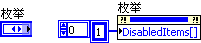

When the user clicks the Enum drop-down menu, the disabled option will be greyed out and unselectable:

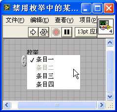

## Advanced Controls: Lists, Tables, and Trees {#lists-tables-and-trees}

For managing complex structured data, LabVIEW provides **Listbox**, **Table**, and **Tree** controls under the **Lists, Tables, and Trees** subpalette:

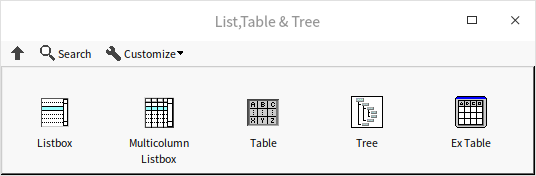

Unlike simple controls (like Boolean buttons or Numeric inputs) which map to a single data type, these advanced controls manage multiple types of data at once.

For instance, a standard Listbox requires:

1. **Item Text:** A 1D array of strings representing the items in the list.
2. **Selection Data:** An integer representing the index of the selected item (or an array of integers if multi-selection is enabled).

In LabVIEW, the selection index is the control's primary value (wired directly to its terminal). The item text, however, must be updated via a **Property Node** (specifically the **ItemNames** property). Working with these advanced controls therefore requires a combination of terminal wiring and property nodes.

### Listbox Basics

A Listbox behaves similarly to [Enum and Ring controls](data_custom_control#comparison-between-enum-controls-and-ring-controls), but instead of hiding options in a drop-down menu, it displays them in a scrollable list. It also supports multi-selection, which you can enable by right-clicking the control and choosing **Selection Mode**.

You can display icons or symbols next to items in a Listbox or Tree control. Right-click the control and select **Visible Items -> Symbol** to show the icon column:

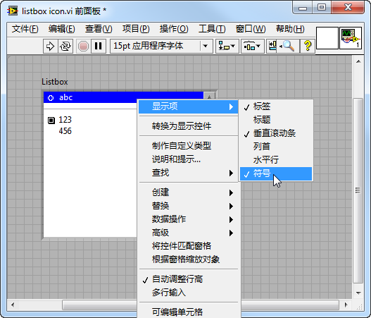

By default, these icons are blank. You can set them manually by right-clicking an item and choosing **Item Symbol**, or programmatically using the **Item Symbol** property. LabVIEW includes about forty built-in symbols:

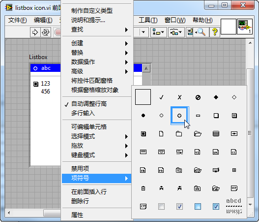

*Tip: The last symbol in the list (a horizontal dashed line) acts as a visual divider. You can use it to separate sections in your list box to improve readability.*

### Example: File Explorer with Listbox Icons

**Goal:** Create a simple file browser that lists all folders and files inside a directory and shows corresponding icons.

We will use a Listbox control to display folders and files:

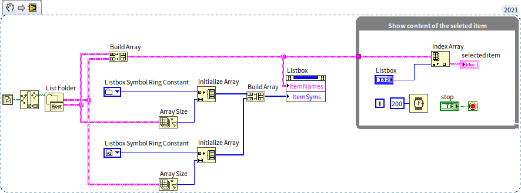

The Block Diagram has two distinct sections:

1. **Reading the Directory:** Before the loop starts, we call **List Folder** (located in the Functions Palette under **Programming -> File -> Advanced File**). This returns separate arrays of folder names and file names. We merge these arrays and write them to the Listbox's **ItemNames** property.
2. **Setting Icons:** We iterate through the list and assign a folder icon to directories and a VI icon to `.vi` files. To do this, we write index integers to the **Item Symbol** property of each row. We select these index integers using the **Listbox Symbol Ring** constant (found under **Programming -> Dialog & User Interface**).
3. **Handling Selection:** Inside the While Loop, we poll the Listbox value (which returns the selected row index) and use it to retrieve and display the selected item name:

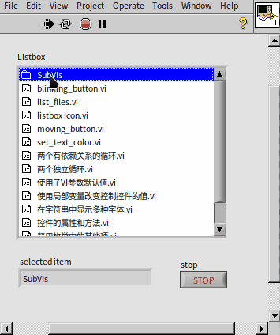

### Customizing Listbox Symbols

If the default icons are not sufficient, you can import custom PNG or BMP images to use as icons in Listbox controls.

To import a custom icon, use the **Custom Item Symbol -> Set to Custom Symbol** Invoke Node. It takes two inputs:

- **Index:** A unique ID for the symbol. Use a value of `100` or higher to avoid conflicts with LabVIEW's default icons.
- **Image Data:** A 2D color array representing the icon.

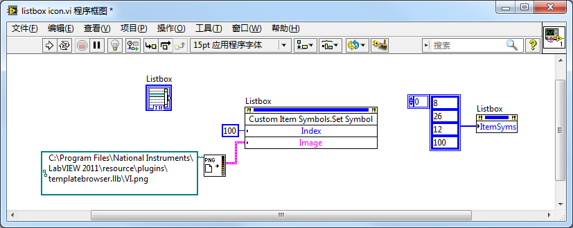

In this program, we read `VI.png` using **Read PNG File.vi** (located in the Functions Palette under **Programming -> Graphics and Sound -> Graphics Formats**), convert the image data, and register it with the Listbox. We can then apply our custom symbol to any row:

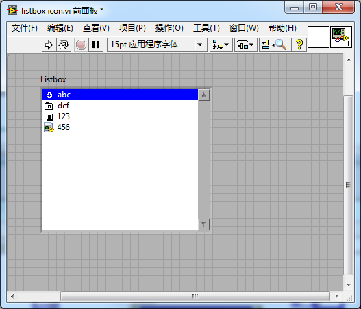

### Drag-and-Drop with Listbox Controls

Listbox and Tree controls support drag-and-drop interactions natively. To enable this, right-click the control on the Front Panel and check **Allow Drag** and/or **Allow Drop**:

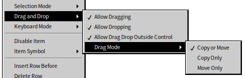

For example, we can place two Listbox controls on a panel:

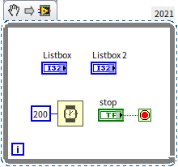

When run, users can drag items directly between the two lists without any additional backend code:

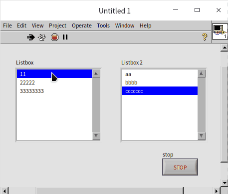

For complex workflows (e.g., validating files before dropping them, or moving items instead of copying them), you can customize drag-and-drop behavior using Event Structures. We will cover this in [Event Structures and Program Interfaces](pattern_ui).

### Example: Formatting a Multicolumn Listbox

A **Multicolumn Listbox** acts as a 2D grid, making it ideal for displaying spreadsheets, reports, or test logs:

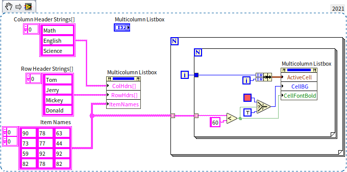

In this program, we write to the **Column Header Strings** and **ItemNames** properties to initialize the table headers and cell text. Then, we use a nested loop to check each test score. If a score falls below `60`, we change its cell background to red:

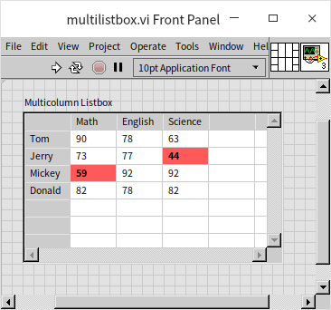

Notice that we write to **Active Cell** first, and then to **Cell Background Color** in the *same* Property Node. Because Property Nodes execute sequentially from top to bottom, this guarantees LabVIEW will select the correct cell before changing its color. If you split these into two separate Property Nodes running in parallel, you would create a race condition where LabVIEW might apply the color before selecting the cell, highlighting the wrong data.

LabVIEW also offers a **Table** control, which behaves similarly to a Multicolumn Listbox but has a simpler interface. For example, we can use a Table control to display zebra-striped rows to improve readability:

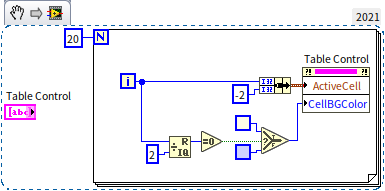

In this configuration, we set the column index of the **Active Cell** to `-2` to select the entire row (in LabVIEW tables, `-1` means no selection, and `-2` or less selects the entire row or column). The resulting UI displays alternating rows:

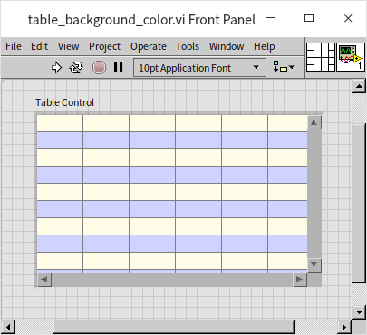

The data type of a Table control is simply a 2D array of strings. You can write data to its terminal directly, which is faster than using property nodes. For basic 2D data display, a Table is the most efficient choice. However, if you need advanced user interactions—such as drag-and-drop reordering or cell-specific formatting—use a Multicolumn Listbox instead.

### Example: Capturing Control Screenshots Programmatically

In applications that generate automated PDF or HTML reports, you often need to save screenshots of graphs, charts, or tables. LabVIEW provides the **Get Image** method on Invoke Nodes to capture a control's visual state:

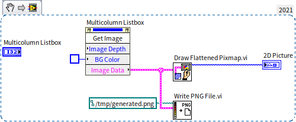

Since report document backgrounds are usually white, it is best to set the **Image Background Color** input of the method to white to prevent grey borders in your report.

We pass the output of **Get Image** to **Draw Flattened Pixmap.vi** to render it inside a **2D Picture** control on our Front Panel, and call **Write PNG File.vi** to save it as an image file on disk:

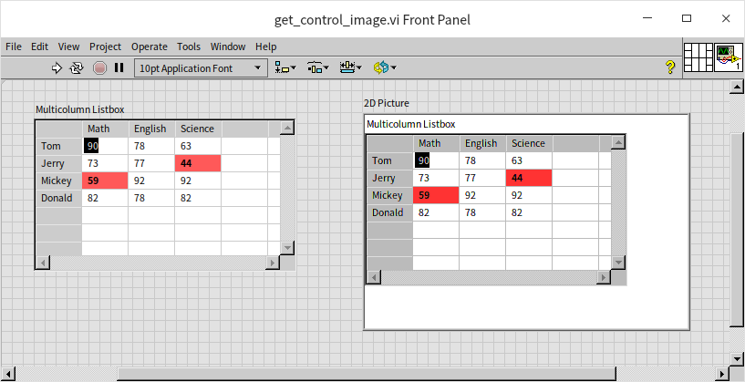

These graphics utility VIs are located in the Functions Palette under **Programming -> Graphics and Sound**.

## Practice Exercise

- Create a VI where the front panel displays text (e.g., "LabVIEW") along with a control for color selection. When the VI runs, the text color on the front panel should change to match the color selected by the user.d by the user.
