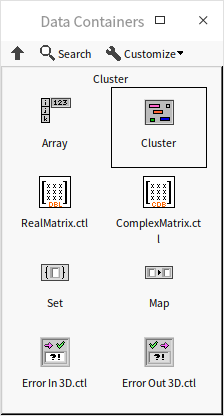
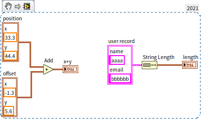
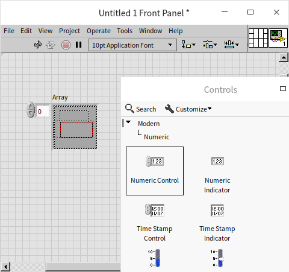
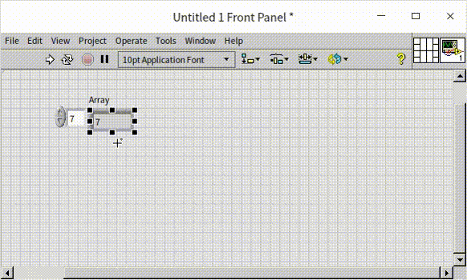
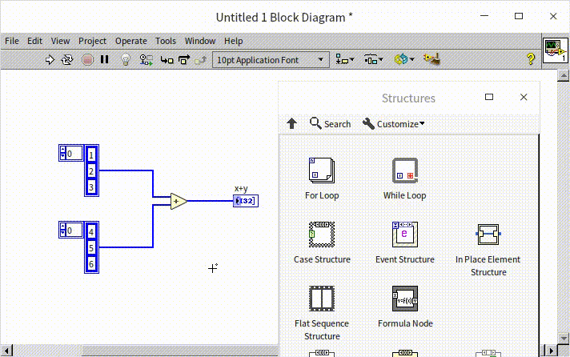
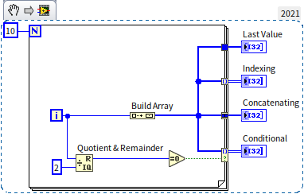
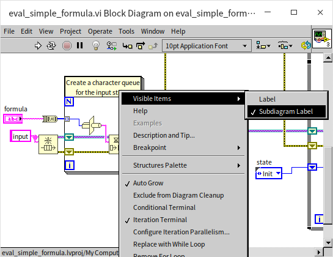
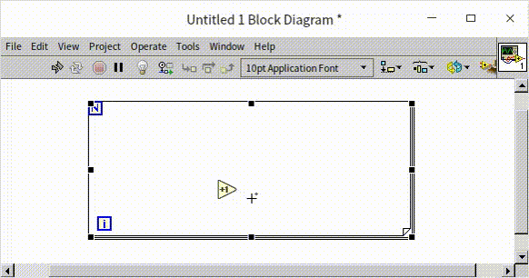
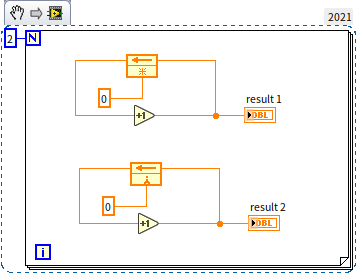
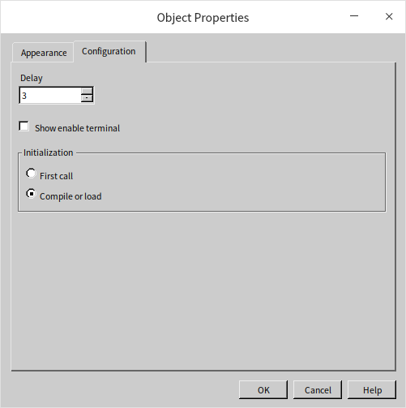

# Array and Loop

## Cluster

### Cluster Control

A Cluster is a composite data type in LabVIEW, distinct from simpler data types like Numeric or Boolean. It allows for the organization of multiple different types of data into a single entity. Clusters are analogous to structs in the C language or tuples in Python.

Cluster controls differ notably from simple data type controls. When added to the front panel, a cluster initially appears as an empty container and is not immediately functional. To make it useful, you need to add other data as its "elements" by dragging and dropping controls into the cluster control. The following image shows a cluster with various elements already placed inside:

Clusters support nesting, meaning one cluster can be an element within another cluster. Creating cluster constants follows a process similar to that of creating controls.

The physical arrangement of element controls within the cluster control on the front panel does not necessarily reflect the logical sequence of the element data in the cluster. In the block diagram, it's the order of the element data that matters, the placement of controls on the front panel becomes irrelevant. For clusters with many elements, random placement is not advisable. Instead, you can let the cluster automatically organize its internal elements. Right-click the cluster and select "Auto-size -> Vertical Fit" from the shortcut menu. This automatic arrangement ensures that the control positions in the cluster correspond to the order of the element data, reducing potential confusion and eliminating the need for manual adjustments when the number of elements changes.

Moving controls within a cluster using the mouse won't alter the data order of the elements. To adjust the element order, select "Reorder Controls in Cluster" from the cluster's right-click menu. Then, click each control in the desired sequence to reset the element data order:

This approach to managing clusters enhances the clarity and functionality of your LabVIEW program, especially when dealing with complex data structures.

### Cluster Data

In LabVIEW programming, handling cluster data often involves extracting and processing each element individually. The process of separating elements from a cluster is known as "unbundling," while grouping element data back into a cluster is termed "bundling." There are two main methods for both bundling and unbundling: the standard "Bundle"/"Unbundle" and the more flexible "Bundle by Name"/"Unbundle by Name."

Both methods can compile several simple data into a cluster or disassemble a cluster into its constituent elements. "Bundle by Name" and "Unbundle by Name" offer adjustable length, allowing users to select specific elements for bundling or unbundling, as well as to customize their order. The standard "Bundle" and "Unbundle" are more rigid; they bundle or unbundle all elements in a cluster every time, and the data order is fixed, following the logical sequence of the elements.

In your programs, it's generally preferable to use "Bundle by Name" and "Unbundle by Name" over the standard "Bundle" and "Unbundle." The former methods enhance readability by displaying element names and reduce the risk of errors that might arise from the inconsistent ordering of elements in different clusters:

A common example of clusters in LabVIEW is the "error in" and "error out" clusters:

Error clusters are a staple in most VIs and form the core of LabVIEW's [error handling mechanism](pattern_error_handling). An error cluster typically comprises a Boolean data type (indicating an error when true), a numeric data type (representing the error code), and a string data type (for the error message). These clusters are instrumental in effectively managing and signaling errors throughout a LabVIEW program.

Clusters in LabVIEW are particularly useful when certain data elements are closely related and processed together. For instance, the trio of "status", "code", and "source" for error handlings can be effectively bundled into a cluster. This approach simplifies data transfer between different nodes, as it requires only a single data line, contributing to a cleaner and more organized program. However, using clusters also introduces additional steps of unbundling and bundling when processing data. Moreover, it's generally advisable not to use clusters in a program's user interface, as they don't facilitate the layout adjustment of controls.

While processing cluster data often necessitates unbundling and bundling, there are scenarios where LabVIEW's built-in functions allow for direct operations on clusters. This is particularly efficient when all elements within a cluster are of the same data type. Consider the following program:

In this example, the cluster on the left contains two elements, x and y, representing the coordinates of a point on a plane. The movement of this point can be represented by a cluster of the same type. Thus, by adding two cluster together, the new coordinates of the point can be determined. On the right side, the cluster contains two [string](data_string) elements. The "String Length" function can be applied to calculate the length of each string, with the result being another cluster containing two numerical elements representing the lengths of the original strings.

However, in most real-world applications, clusters typically comprise elements of different data types. Consequently, performing the same operation on each element of the cluster is relatively rare. Clusters are more often used for organizing and managing related data elements rather than for conducting uniform operations across all elements.

## Array

### Array Data

An array is a composite data type, similar to a cluster, but with a key difference: all elements in an array must be of the same data type. Creating an array control (or constant) is akin to creating a cluster control. You start by dragging an array control, which initially appears as an empty shell, onto the front panel. Then, another control is dragged into this array shell:

While an array mandates uniformity in element data types, it can contain a large number of elements — in theory, up to $2^{31}－1$ elements per dimension. Each array control displays a number in its upper left corner, indicating the index of the currently visible element. Array indexing starts at 0, with subsequent elements indexed incrementally.

In scenarios where viewing all or multiple array elements on the interface is necessary, array control can also display several elements simultaneously. This can be achieved by dragging the borders of the array control to expand its view horizontally or vertically, revealing multiple elements. For arrays with a high element count, navigating each element by changing the index can be cumbersome. A practical alternative is to enable a horizontal or vertical scrollbar (accessible via the right-click menu of the array), allowing for swift navigation to the desired element:

A one-dimensional array, which can represent data like a curve, is formed by a row or column of data. By dragging the index box of the array control and adding another index, you can convert the array from one-dimensional to two-dimensional. A two-dimensional array, consisting of rows and columns, can represent multiple curves, a data table, or a planar dataset. Similarly, adding more indexes allows for the creation of three-dimensional arrays and beyond.

In LabVIEW, nearly any data type can serve as an array element, except for arrays themselves; an array cannot be an element within another array. In practice, it’s recommended to use multi-dimensional arrays over arrays of arrays. When an array must be an element of another array, consider incorporating the array into a cluster first. This cluster can then be used as an element in another array, as shown here:

### Calculating

LabVIEW offers a variety of functions tailored for array operations. These include determining array length, indexing, sorting, and summing array values. Additionally, functions initially designed for numerical and Boolean data types can also be applied to arrays of those respective types. For instance, basic arithmetic operations like addition, subtraction, multiplication, and division, as well as Boolean operations like AND and NOT, can be performed on numerical and Boolean arrays, respectively.

Consider the operation of addition. When a value is added to an array in LabVIEW, it is effectively added to each element within the array. Similarly, adding two arrays together results in a new array formed by adding corresponding elements from the input arrays. It's important to note that if the input arrays vary in length, the length of the resultant array will match that of the shorter input array:

When working with arrays in programming, careful attention must be paid to the array length, especially to avoid issues with empty input arrays. Sometimes, specific handling of empty input arrays is necessary to prevent errors in the program. This careful management ensures that array operations are executed correctly and efficiently, maintaining the integrity of the data and the functionality of the program.

### Comparing

In LabVIEW, standard comparison functions such as "Equals?" and "Greater than?" can be applied to arrays. When using these functions for array (or cluster) comparisons, you have the option to choose between "Compare Elements" and "Compare Sets," accessible through the right-click menu.

"Compare Elements" performs a separate comparison for each corresponding element in two arrays. The outcome of this comparison is a Boolean array of the same length, with each element indicating the result of the individual comparison. On the other hand, "Compare Sets" considers the entire array as a single entity. In this mode, two arrays are deemed equal (resulting in "true") only if they have the same length and all corresponding elements are identical. Otherwise, the result is "false". The image below demonstrates an array comparison:

The result of this operation is shown here:

This flexibility in comparison methods allows for precise and context-appropriate analysis of array data, whether you need to evaluate individual elements or assess the arrays as complete sets.

### Indexing Elements

Indexing, or accessing specific elements within an array, is a fundamental operation in array manipulation. The "Index Array" function in LabVIEW allows you to retrieve the value of an element at a specified position. The "index" parameter within this function specifies which element is to be accessed. If the "index" parameter is left empty, it defaults to 0, indicating the retrieval of the first element in the array.

For accessing multiple elements simultaneously, there's no need to use several "Index Array" functions. Instead, you can expand the "Index Array" function to include multiple "index" parameters. This is done by clicking and dragging the middle of the function's lower border to lengthen (or shorten) it. Each of these parameters can be set to different values. If all "indexes" are empty, the default sequence is 0, 1, 2, and so on, thus the function outputs the first, second, third... elements in order. If an "index" is left empty after a specified index, the corresponding output will be the element at the position of the last non-empty "index" + 1, + 2, and so on. Consider the following example:

   Index results: 

In the case of multi-dimensional arrays, you can either index a specific element or an entire dimension. For instance, to index an element in a two-dimensional array, two position values are required for the "index" parameter, each representing a position in one of the two dimensions. To index all elements of a particular row or column, only the row or column index needs to be specified:

Index results:

### Merging Arrays

The "Build Array" function in LabVIEW is versatile, allowing you to add individual elements to an array or to merge multiple arrays together. When the inputs to the "Build Array" function include a non-array data type and a one-dimensional array of the same type, the function will append the non-array data to the array. If the inputs are two one-dimensional arrays of the same type, the "Build Array" function, by default, merges them into a single two-dimensional array.

However, you can modify this behavior to concatenate the two input arrays into a new one-dimensional array. This is done by selecting "Concatenate Inputs" from the right-click menu on the input terminal of the "Build Array" function:

Merge Result：

Like the array indexing function, the "Build Array" function can also be extended to accommodate multiple input data points. This extension enhances the function's flexibility, making it suitable for a range of array manipulation tasks, from simple element addition to complex array merging.

### Utilizing Advanced Controls for Array Data

LabVIEW has several complex controls where the underlying data type is an array, such as chart and table controls. These allow for a more enriched representation of array data, often making it more intuitive than simply presenting abstract numerical values.

Take, for instance, the program below which generates a two-dimensional array using a sine function:

Beyond the standard array control, we can also employ a table to display all the data in the array. This method offers a clear and precise view of each element’s value:

While a table efficiently displays individual data values, it may not effectively convey the overall trend or pattern of the data. To visualize these aspects, an intensity graph can be used as the output control. This approach allows for an immediate, visual understanding of how data values change and interact:

LabVIEW offers a diverse range of data display methods, each suited to different types of data interpretation and analysis. These methods and their applications are explored in greater detail in the section on [Graphical Representation of Data](data_graph). This diversity ensures that users can choose the most effective way to represent and analyze their data, whether it’s through numerical arrays, tables, or graphical displays.

## for Loop

Array operations in practical applications often require loop structures, as it's common to perform similar operations on each element within an array. Before delving deeper into arrays, it's essential to understand LabVIEW's loop structures. LabVIEW offers two primary types of loops: the for loop and the while loop.

The for loop structure is designed for executing a block of code a specified number of times, mirroring the for loop found in most textual programming languages. In LabVIEW, these structures are available under "Programming -> Structure" in the function palette. Structures differ from functions and sub-VIs in appearance; functions and sub-VIs are typically small squares or similar polygons with terminals on the edges, while structures are variable-sized rectangular frames that contain the program code. To use a for loop, you can either place it on a blank space on the block diagram or select an area with existing code and enclose it within the for loop:

In the image below, the for loop structure is displayed. The 'N' in the upper left corner represents the total number of iterations, which is an external input to the loop structure. The 'i' in the lower left corner indicates the current iteration count. In LabVIEW, the iteration count of a for loop always starts at 0 and increments by 1 with each iteration. Hence, 'i' is 0 for the first iteration, 1 for the second, and so on.

The code within the loop is executed repeatedly, once for each iteration. This code might need to interact with data outside the loop structure, requiring inputs and outputs to be managed through tunnels, shift registers, or feedback nodes. Understanding how to effectively use these tools is crucial for managing data flow in and out of the loop, allowing for efficient processing of array elements or other repetitive tasks in LabVIEW.

### Input Tunnel

In LabVIEW, when you connect terminals inside and outside a loop structure, and the data wire crosses the loop's frame, a small rectangle (solid or hollow) appears on the frame, matching the color of the data line. This rectangle is known as a tunnel and serves the crucial function of transferring data into and out of the structure. Similar tunnels are also present in other structures, performing analogous roles. Tunnels are categorized based on the direction of data flow: input tunnels and output tunnels. Input tunnels have their input end outside the structure and their output end inside, while output tunnels have the reverse arrangement.

When a single data item enters a loop, the tunnel manifests as a small solid rectangle, and this same data is accessed in each iteration of the loop. However, when the input data is an array, the loop can handle it uniquely by making the tunnel indexable. An indexable tunnel, indicated by a hollow rectangle, sequentially extracts an element from the array outside the structure with each iteration. This effectively combines the functions of tunneling and array indexing. You can toggle the indexing function on or off by right-clicking the tunnel and selecting "Disable Indexing" or "Enable Indexing."

In a for loop using an indexed tunnel, there's no need to specify the total number of iterations (the 'N' value). Instead, the number of iterations automatically corresponds to the length of the input array, ensuring that the loop processes each element of the array.

The program depicted in the image above demonstrates how input arrays can be passed into a loop structure using both non-indexed and indexed methods. Due to the presence of the indexed tunnel, there's no need to set a specific loop count. The program produces four outputs: "Number of Loops", "Array Length", "Element", and "Element 2". Upon running the program, the values for "Number of Loops" and "Array Length" remain consistent throughout each iteration. Similarly, "Element" and "Element 2" also yield the same values. Here, "Element" is indexed using the "Index Array" function, while "Element 2" is automatically indexed through the Index Tunnel.

In scenarios where multiple indexed input tunnels are used, and the arrays connected to them have varying lengths, the number of loop iterations is determined by the length of the shortest array. If an 'N' value (loop count value) is also provided, the actual loop count will be the lesser of this 'N' value and the lengths of the arrays.

If an indexed input tunnel is connected to an empty array, the loop will iterate zero times. This situation might occasionally occur during program debugging. Despite a clear 'N' value, the loop might not iterate, or the iteration count could be incorrect. In such cases, it's necessary to check if there's an indexed input tunnel in the loop structure and the length of the array connected to it.

When connecting a multi-dimensional array to an indexed input tunnel, the array's dimensionality reduces by one with each pass through the tunnel. For processing a two-dimensional array, a two-level nested loop structure can be utilized to access each element:

  The results: 

### Output Tunnel

Output tunnels in LabVIEW loop structures play a crucial role in data handling. Each iteration within the loop sends data to the tunnel, but the output tunnel itself produces a single output value. This process essentially consolidates multiple pieces of input data into one output. The output tunnel offers several modes for merging data, accessible via its right-click menu:

- **Last Value Mode:** Represented by a solid square icon, this mode outputs only the data passed to the tunnel during the final iteration of the loop.
- **Indexing Mode:** Indicated by a hollow square icon, this mode compiles the data from each iteration into an array, with each iteration's data forming an array element. If the input data is already an array, the output will be an array with an added dimension.
- **Concatenating Mode:** Shown as a square with horizontal stripes, this mode is applicable when the input data is an array. It differs from Indexing in that the output array retains the same dimensions as the input array but increases in length. Data from each iteration is appended to the output array.

In addition to these modes, an output tunnel can also include a conditional input. This adds an extra terminal with a question mark icon, where a Boolean value can be entered. If the value is "true," the input data is included in the output; if "false," the input data is disregarded.

Consider the following example program:

In this program, the iteration number (an integer from 0 to 9) is converted into a one-dimensional array with a single element using the "Build Array" function. This data is then passed through all output tunnels in each loop iteration. The program includes four output tunnels, each employing a different mode: Last Value, Indexing, Concatenating, and Indexing+Conditional. The Last Value tunnel outputs only the data from the last iteration (a one-dimensional array with the number 9). The Indexing tunnel's output is a two-dimensional array, with each row corresponding to an iteration's data. The Concatenating tunnel outputs a one-dimensional array containing all iteration data. Finally, in the Indexing+Conditional example, as the conditional input is true for even 'i' values, the output is a two-dimensional array containing only the even numbers.

The program's output results are as follows:

### Exmaples of for Loop Applications

Let's examine two practical examples of for loop applications:

- **Program 1: Displaying VI Filenames with a Progress Bar**

This program aims to list all VIs in a specified path and display their filenames on the front panel. Additionally, it features a progress bar to indicate the proportion of files displayed.

The code for this program is shown below. It can serve as a reference for incorporating a progress bar into your projects.

In the above program, "Recursive File List.vi" is a built-in LabVIEW function found under "Programming -> File I/O -> Advanced File Functions -> Recursive File List". It outputs the contents of a specified folder. The "Split Path" function, located in "Programming -> File I/O -> Split Path", outputs file or folder names. The concept of "path" data will be detailed in the section [String and Path Data](data_string).

The program lists all VIs in a folder and uses a loop to iteratively display each VI's filename. The progress bar control's scale range is set from 0 to 1. By passing the value of i/N to the progress bar, it accurately reflects the program's current progress:

- **Program 2: Determining the Value of "Output Integer"**

Consider the following program and guess the value of "Output Integer":

"Output Integer" might be either 33 or 0. This scenario illustrates a common pitfall in using the for loop structure. Although "Input Integer" and "Output Integer" appear directly connected in the block diagram, implying that "Output Integer" should mirror "Input Integer," it's crucial to consider that if the input "array" is empty, the loop won't iterate at all. Consequently, the output tunnel connected to "Output Integer" will not receive any data and will default to a value of 0.

### Shift Register

While tunnels are responsible for transferring data into and out of loop structures, shift registers are the mechanism used for passing data between different iterations within a loop. To add a shift register, right-click the border of the loop structure and select "Add Shift Register". A pair of shift registers will appear on opposite sides of the loop structure. At the end of each iteration, data is passed into the right-hand shift register, and at the start of the next iteration, it flows out from the left-hand register:

Those familiar with text-based programming languages might initially think to create a variable to transfer data within loops in LabVIEW. However, this approach contradicts LabVIEW's dataflow paradigm. In LabVIEW, when faced with the need to transfer data across loop iterations, the first consideration should be to use a shift register instead of a variable.

Data passed through a shift register retains its type and value. The unique aspect of shift registers is that they share the same memory between the terminals at either end of the loop structure. Hence, data generated in the last iteration and passed into the right side of the shift register can be accessed in the next iteration from the left side. Although a shift register pair consists of left and right components, the data within them is the same. This contrasts with tunnels, where input tunnels are distinct and independent from output tunnels.

To illustrate the use of shift registers, let's modify "[Program 2](data_array#exmaples-of-for-loop-applications)" from the previous example. Instead of using separate input and output tunnels, we can implement a shift register. By right-clicking on the tunnel node and selecting "Replace with Shift Register", we can seamlessly integrate this data transfer mechanism:

The improved program, as shown below, demonstrates how to effectively use a shift register in a LabVIEW loop:

Upon executing this enhanced program, the value of "Output Integer" is consistently determined to be 33. This outcome is ensured by the shift register, even if no iterations of the loop are executed. Since the left and right sides of the shift register store identical data, the value remains 33 as it flows out from the right side.

A common oversight in loop structures is the failure to assign an initial value to the shift register. It's crucial to provide an initial value at the left end of the shift register outside the loop, except in cases where the program design explicitly does not require an initial value.

Consider the program below, which utilizes an uninitialized shift register:

Running this VI multiple times reveals that the "Output Value" changes with each execution. This variability highlights the importance of assigning an initial value to the shift register.

Shift registers can have multiple left terminals:

By dragging the left terminal, you can create the necessary number of terminals. Each additional terminal represents the output from the last but one, the last but two iterations, and so on. It's essential to connect initial values to these left terminals as well. If the number of iterations is fewer than the number of registers, or if the iteration hasn't started, the output from the left terminals (whose data haven't been updated) will be their initial values.

Beyond transferring data between iterations, shift registers serve other functions as well, notably in program memory optimization and in the implementation of functional global variables. These applications will be explored in more detail in the chapters [Memory Optimization](optimization_memory) and [Global Variables](pattern_global_data)。

### Stop Condition

You can introduce a mechanism to prematurely stop a for loop by creating a conditional terminal. This is akin to the "break" statement in C or Python language, which is used to exit a loop. To add this feature, right-click on the for loop structure and select "Conditional Terminal":

There are situations where the desired result is achieved before completing all iterations of the loop, rendering further iterations unnecessary. For instance, the program shown above is designed to check whether the input "array" contains an element that matches the given "string". If such an element is found, a "true" value is passed to the conditional terminal to halt the loop.

The conditional terminal operates in two modes, depending on how it is configured. It can either halt the loop upon receiving a "true" value, indicated by a red circle , or stop when a "false" value is received, denoted by a green circular arrow . This functionality mirrors that of the while loop.

:::tip

If the code within the loop structure is complex, it's beneficial to include a descriptive text annotation. This helps others (or yourself) to more efficiently understand the purpose and functionality of the code in future reviews. To add a textual description, select "Visible Items -> Subdiagram Label" from the right-click menu of the structure:

:::

## while Loop

The while loop functions similarly to the for loop, repetitively executing code within its structure. Unlike the for loop, the while loop does not predetermine the number of iterations. Instead, it decides whether to proceed to the next iteration based on the data fed into the "conditional terminal" after each loop execution. This is analogous to the do...while... loop in textual programming languages. If a program's logic involves executing a loop first and then deciding whether to continue, a while loop should be considered.

Since a while loop always performs at least one iteration, the issue encountered in "[Program 2](data_array#exmaples-of-for-loop-applications)" (from earlier examples) would not occur with a while loop. Even a single iteration would suffice to transfer data from the input to the output tunnel, ensuring that the value of "Output Integer" remains 33.

The methods for transferring data in a loop structure, such as tunnels, shift registers, and feedback nodes, used in the for loop are also applicable to the while loop. However, special attention is needed when using indexed tunnels in a while loop. The iteration count in a while loop is determined solely by the "conditional terminal" and is not influenced by the length of the array connected to the indexed tunnel. Therefore, the number of iterations in a while loop can exceed the length of the input array, which may result in default values being used for elements beyond the array's scope. Additionally, connecting array data to a for loop automatically creates an indexed tunnel, whereas connecting it to a while loop by default creates a standard tunnel.

When it comes to efficiency in output indexed tunneling, while loops are slightly less efficient than for loops. Consider the program below, which constructs arrays in both loop structures using output indexed tunnels:

Both loops produce arrays of the same size. In a for loop, LabVIEW preallocates the necessary memory for "Array 1" since the array size (100) is known before the loop runs. However, in a while loop, the iteration count is unknown beforehand, so LabVIEW cannot preallocate memory for "Array 2". It must continuously adjust the memory allocation during the loop, which can reduce efficiency.

Thus, for scenarios where the number of iterations is known or can be determined, a for loop is generally more suitable and efficient.

## Feedback Node

### Basic Usage

In loop structures, a feedback node is a convenient tool to pass data from one iteration to the next, as illustrated below:

A feedback node can be interchanged with a shift register using the right-click menu of the shift register. When establishing connections within a loop structure, if a data flow loop is created, LabVIEW automatically inserts a feedback node into the loop. For instance, in the following animation, the output data of the "+1" function is looped back to its input, forming a data flow loop, and LabVIEW adds a feedback node:

Below the feedback node is a terminal marked with a "❇" symbol, which is used to set the node's initial value. Feedback nodes, like shift registers, require an initial value. The "Move Initializer One Loop Out" option in the right-click menu can be used to position the initialization terminal at the left border of the loop structure. However, for clarity, it's often better to keep the initialization value close to the feedback node.

There are two initialization options for feedback nodes found in the right-click menu: "Initialize On Compile Or Load" and "Initialize On First Call". Choosing "Initialize On Compile Or Load" changes the feedback node icon to a "❇" symbol, indicating that the node is initialized only once after being loaded into memory or recompiled and not reinitialized on subsequent runs. Selecting "Initialize On First Call" changes the icon to a "∧" symbol, meaning the node is initialized each time the VI is started.

For instance, consider the following program:

Upon the first execution of this VI, both "result 1" and "result 2" output the value 2, corresponding to the loop iteration count. However, if you rerun this VI, the value of "result 1" will increase to 4, while "result 2" remains at 2. With each subsequent execution, "result 1" will increase by 2 from its previous run, whereas "result 2" will consistently output 2.

### Advanced Features

Feedback nodes share the same function and essence as shift registers in LabVIEW, with the primary difference being aesthetic and structural. Feedback nodes do not require data wires extending from the loop’s border, allowing for a more concise and visually appealing program design. This is particularly intuitive for engineers familiar with feedback concepts in control or electronics. However, due to their reliance on loop structures and the absence of connecting data lines, feedback nodes can sometimes lead to logical errors if not used carefully. Furthermore, they may cause reverse data flow in some connections. If this results in overly complex or unclear program structures, shift registers might be a better choice.

Without external context, the behavior of an isolated feedback node in a program can be ambiguous:

The initial state of the feedback node and the number of times the program has run are essential to understanding its behavior. For instance, in the following single-loop program, it can be inferred that the result is 5, given a known initial state:

In a multi-level nested loop, the feedback node is engaged by each loop level it resides in, akin to having a series of connected shift registers at each loop level. Therefore, the result of the program below is 25:

It’s crucial to remember that a feedback node can exist in a different VI from its encompassing loop structure. The output value may vary depending on whether the VI is run as a subVI or in conjunction with upper-level loop structures.

Feedback nodes also come with an enable input, which can be made visible by right-clicking the node and selecting "Show Enable Terminal." This input determines the node's functionality in each iteration: when true, the feedback node operates normally; when false, it maintains the data from the previous iteration without updating. This feature allows for precise control over the data flow through the feedback node. Using the context provided, readers can deduce the outcome of the program shown here:

In the above program, the feedback node is active only when 'i' is an even number. The program's function is to count the even numbers among the five integers from 0 to 4, resulting in a count of 3.

Besides returning the data from the last iteration, shift registers can also return data from the last 'n' iterations. Feedback nodes offer a similar feature, though the implementation differs slightly. By right-clicking the feedback node and accessing its properties, you can configure the number of delays:

For instance, if the delay is set to three iterations, the feedback node will cycle back the data every three iterations. Consider the program below:

Here, the result control outputs 1, 1, 1, 2, 2, across five iterations, with the final output being 2.

Now, let's examine a multi-level nested loop scenario:

The 'result' undergoes a total of 25 iterations. In this multi-layer nested loop, the delayed feedback node continues to return data every three iterations (counting each iteration of the innermost loop). The returned data across the iterations are: 1, 1, 1, 2, 2, 2, 3, 3, 3, 4, 4, 4, 5, 5, 5, 6, 6, 6, 7, 7, 7, 8, 8, 8, 9, resulting in a final output of 9.

Lastly, consider the program shown below. Can you determine its expected output?

 

This example serves as a cautionary illustration. While it may be complex and capable of performing the required functions, simplicity and clarity are paramount in programming. Avoiding overly complicated and confusing code, as shown here, is advisable. The best code is that which accomplishes its objectives in the most straightforward and understandable manner.

### Feedback Nodes Independent of Loops

Feedback nodes can function independently of loop structures, as illustrated in the figure below. This means that feedback nodes can establish their own shift registers without being part of a loop:

The above program acts as a counter. Each time the VI is run, the output increments by 1.

The program below demonstrates this counter subVI in action:

In this setup, the main VI includes two instances of "sub VI.vi" (it calls the same sub VI in two places). An important question arises: Do these two instances share a single shift register for their internal feedback nodes, or does each instance maintain its own? Running this program yields the following result:

The output indicates that both instances share the same shift register. This shared register applies even when the subVIs are called in separate loops, as shown in the following program:

The output of this arrangement is:

Distinct shift registers for each sub VI instance are created only when the sub VI is configured as [reentrant](pattern_reentrant_vi), which allows each instance to operate independently.

## Practice Questions

- **Sum Calculation VI:** Develop a VI using a loop structure to calculate the sum of all integers from 33 to 62. This exercise will help you practice implementing loops and basic arithmetic operations in LabVIEW, enhancing your understanding of iterative processes and data accumulation within a loop.

