# 数组和循环结构

## 簇

### 簇控件
簇（Cluster）和之前介绍的数值布尔等简单数据类型不太一样，它是一类复合数据类型，它可以把多个不同类型的数据组织在一起，变成一个新的数据类型。簇和 C 语言中的结构（struct）、Python 语言中的元组（tuple）比较相似。

簇控件和简单数据类型的控件也有明显区别，把它拖到前面板上，开始只是个空壳，不能使用。我们还要给簇添加其它一些数据类型作为它的“元素”，把其它控件拖入簇控件即可。下图是一个已经放置了一些元素的簇：

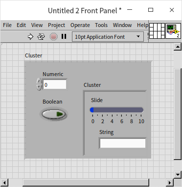

簇是可以嵌套的：一个簇可以是另一个簇的元素。簇的常量的创建方式与控件的创建方式是类似的。

簇控件中元素控件的摆放位置，与簇数据中元素数据的逻辑顺序位置不一定是对应的。在程序框图中，处理簇数据时，只有元素数据的顺序是有意义的，与控件的摆放位置就不再相关了。当簇中元素比较多的时候，最好不要把元素随意摆放，可以让簇自动排布内部的元素。在簇的快捷菜单中选择“自动选择大小 -\> 垂直排列”，这样，簇中元素个数变动时，不必再手动调整簇的外观。当选择自动排列时，簇中控件的位置顺序，就是簇中元素数据的顺序，这样保持一致，不容易产生混乱。用鼠标把一个控件挪动到另一控件上面，是不会改变元素的顺序的，如果需要调整簇中元素的顺序，需要在簇的右键菜单中选择“重新排序簇中控件”，然后按照想要的顺序，一次点击每个控件，即可重新设置元素数据的顺序：

### 簇数据运算

在程序中处理簇数据的时候，通常都需要把簇中每个元素拿出来单独处理。把簇中元素分拆出来的过程叫“松绑”；反过来把元素数据放置到簇中的过程叫“捆绑”。“捆绑”/“松绑”（“解除捆绑”）有两种方式：一般的 “捆绑”/“松绑”，以及“按名称捆绑”/“按名称松绑”。它们都可以把几个简单的数据包装成一个簇，或者把簇中的元素拆分出来。“按名称捆绑”和“按名称松绑”是长度可调的，用户可以用鼠标选择捆绑或松绑出哪几个元素，顺序也可自定义。“捆绑”和“松绑”限制比较死板，每次都会捆绑或松绑簇中所有的元素，数据的顺序也是固定的，就是按照元素数据的逻辑顺序排列。

在程序中应尽量使用“按名称捆绑”和“按名称松绑”，而不是直接“捆绑”“松绑”。“按名称捆绑”和“按名称松绑”由于显示了元素的名称，不仅可读性比较好，还可以避免前后两个簇中元素顺序不一致等引发的错误：

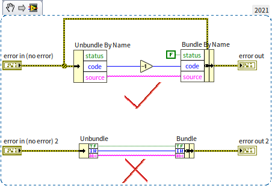

LabVIEW 中最常见的簇，是错误输入簇和错误输出簇：

在大多数 VI 中都能看到错误簇的身影，它构成了 LabVIEW 程序最基本的 [错误处理机制](pattern_error_handling)。错误簇由一个布尔类型数据（值为真时表示有错误）、一个数值型数据（错误代码）和一个字符串数据（错误信息）组成的。

如果某些数据之间的相关性非常高，总是在一起被处理（比如：“是否有错”、“错误代码”和“错误信息”这三个数据），那么它们就很适合被捆绑成一个簇，这样，在不同的节点之间传递数据时，只需要一根数据线，可以让程序变得更整洁。使用簇的缺点是在处理数据的时候常常会多出“松绑”“捆绑”这个步骤。另外，一般最好不要在程序的用户界面上使用簇，它不利用调整用户界面上控件的布局。

尽管多数时候，处理簇数据需要“松绑”“捆绑”，也有一些情况是可以使用 LabVIEW 自带的函数直接对簇进行运算的。尤其是当簇中所有元素都是同一数据类型时。比如下面的程序：

程序左面的簇包含两个元素： x, y，它们用于表示平面上一个点的坐标。在平面上移动一个点，走过的距离也可以使用同样类型的簇表示。因此我们可以把两个簇数据相加，得到这个点移动后坐标。程序右面的簇包含两个[字符串](data_string)类型的元素，因此可以使用“字符串长度”函数计算簇中每个元素的长度。运算结果仍然是一个簇，包含两个数值数据元素，分别表示原来簇中两个字符串的长度。

不过，在多数应用中，簇中的元素会拥有不同数据类型，所以需要对簇的每个元素都做同一运算的情况是比较少见的。

## 数组

### 数组数据

数组也是一种复合数据类型，与簇数据类型不同的是：一个数组中所有的元素的数据类型都必须是同一种。创建数组控件（或常量）与创建簇控件非常类似，首先把只有一个空壳的数组控件拖到前面板上，再把其它某个控件拖入数组控件即可：

数组元素的数据类型虽然是唯一的，但数据的个数可以是非常多的（理论上，每个维度可以最多包含 $2^{31}－1$ 个元素）。数组控件左上角有一个额外的数字显示，它表示的是当前显示的数组元素的索引，也就是第几个元素。数组元素索引是从 0 开始计算的，第一个元素的索引是 0；第二个元素的索引是 1，以此类推。

有些应用中，需要在界面上查看数组中所有的元素，最好在界面上多显示几个元素。这时候，可以横向或纵向拖动数组控件的边框，数组就会显示多个元素。如果数组中元素太多，通过改变索引的值来查看每个元素可能就不那么方便了，还可以在数组的右键菜单中选择显示横向或纵向的滚动条，然后拖动滚动条快速移动到需要查看的数据：

一行或者一列的数据构成了一维数组，比如，一条曲线就常常使用一维数组来表示。用鼠标拖动数组控件的索引框，可以把默认的一个索引变成两个，表示数组从一维变成了二维。二维数组同时具有行和列，可以表示多条曲线，或者一个表格、一个平面的数据。同理还可以继续增加索引数量，表示三维以及更多维度的数组。

LabVIEW 中几乎任何其它数据类型都可以作为数组元素的数据类型，但数组本身不能作为另一个数组的元素。实际应用中，应该尽量使用多维数组，而不是数组的数组。在一定要把数组作为其他数组元素的时候，可以考虑先把作为元素的数组放入一个簇，再把这个簇作为另一数组的元素：

### 数组数据的运算

LabVIEW 中有些函数是专门针对数组的，比如计算数组长度、索引、排序以及计算数组的和等等。也有一些函数，它们原本用于数值类型、布尔类型等数据的计算，但是也可以直接用于对相应数据类型的数组进行运算。比如，对数值型数据进行操作的加减乘除等运算，也可以用于数值型数组；对布尔型数据进行的与或非等运算都可用于布尔型数组。

以加法为例，把一个数值和数组相加，相当于把数组中每个元素都加上这个数值。而两个数组相加，则相当于把两个数组中对应的元素相加，得到另一个数组。两输入数组元素个数不同时，结果数组长度等于两输入中长度较短的那个数组的长度：

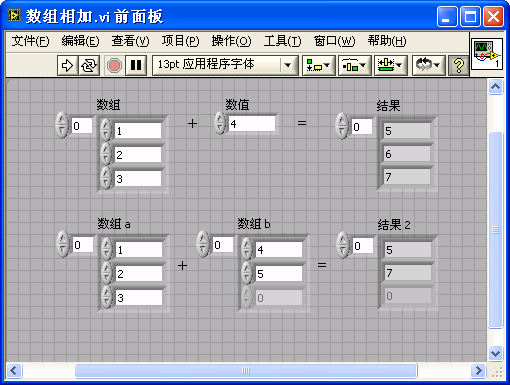

对数组进行编程运算时，需要注意数组长度是否正确，尤其注意输入的数组是否可能为空。有时程序需要对输入的空数组进行特殊处理以避免出错。

### 数组数据的比较

比较函数，如 "等于？"、"大于？" 等函数也可以用于数组的比较。这些比较函数用于比较数组（或者用于比较两个簇数据）时，可以在右键菜单中选择“比较元素”，或“比较集合”。“比较元素”的意思是对两个数组中对应的每一个元素分别进行对比，比较的结果构成了一个同长度的布尔型数组。“比较集合”则是把数组整体作为一个整体，同另一个数组相比较，如果两个数组长度相同，每个对应元素也相同，则结果为“真”，否则为“假”。下图中的代码是对数组进行比较：

其运行结果为：

### 数组索引

通过索引拿到数组中某个元素的数据是最为常用数组操作之一。使用“索引数组”函数，可以得到数组中某个位置上的元素的值。“索引数组”函数的“索引”参数用于表明需要得到数组中的第几个元素。但是 “索引”参数也可以为空，即在缺省情况下，相当于输入为 0，表示需要得到数组的第一个元素。

需要索引多个数组元素时，并不需要使用多个“索引数组”函数，而是可以把“索引数组”函数拉长。把鼠标移到“索引数组”函数下边框中间的位置，按住鼠标左键即可将其图标拉长（或缩短），左侧出现多个“索引”参数。每个参数都可以设置不同的值。若输入“索引”均为空，其缺省值依次为 0、1、2、......，即输出依次为数组的第一个，第二个，第三个...... 元素。若输入“索引”在某一项索引后为空，则对应空索引的输出依次为非“空”的那一项 + 1、+2、......。比如下面的程序：

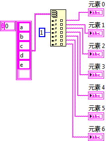   运行结果： 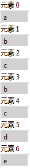

索引多维数组的时候，可以索引某个元素，也可以索引某个维度。比如需要索引二维数组某个元素时，就要求“索引”参数输入两个位置信息，分别表示在两个维度上的位置；而需要索引某行或某列的所有元素时，只需输入行或列的位置信息即可：

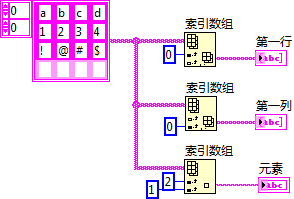

运行结果：

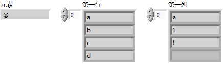

### 数组合并

使用“创建数组”函数可以把元素添加到一个数组中，或者把几个数组合并。当创建数组函数的输入为一个非数组类型数据，和一个这个类型的一维数组时，创建数组函数会把非数组数据添加到数组中去。如果两个输入数据是类型相同的一维数组，默认情况下，创建数组函数会把它们合并成一个二维数组。但是选择创建数组函数输入端右键菜单的“连接输入”，可以把两个输入的数组首尾相连，合成一个新的一维数组：

运行结果：

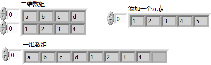

创建数组函数和数组索引函数一样，可以通过拉伸支持多个输入数据。

### 其它类型的数组控件

LabVIEW 中有些比较复杂的控件的数据类型也是数组，例如图表控件。这就使得数组数据可以有更丰富的表达方式。在某些情况下，以曲线或图形表达出来的数据比抽象的阿拉伯数字更加直观。

比如，先使用下图中的程序生成一个二维数组的数据：

除了使用默认的数组控件，我们也可以使用表格作为输出控件，显示出数组中所有的数据：

使用表格虽然能够精确地显示出每一元素的数值，但并不能直观的观察数据整体的变化的规律。因此，我们还可以使用强度图作为输出控件，这样，一眼就可看出数据变化的规律了：

LabVIEW 提供了多种多样的展示数据的方法，本书将在[图形化显示数据](data_graph)一节做更详细的介绍。

## for 循环

在实际应用中，数组的操作是离不开循环的。再多数情况下，我们都需要使用循环对数组中的每个元素做类似的操作。所以在继续深入讨论数组之前，我们要先介绍一下 LabVIEW 中的循环结构。LabVIEW 中有两个相似的循环结构：for 循环结构和 while 循环结构。

for 循环结构用于把结构体内的代码重复执行一定次数。这与大多数文本编程语言中的 for 循环都非常类似。LabVIEW 中常用的结构都在函数选板“编程 -> 结构”中。结构与函数和子 VI 等在外观上就有明显的不同：函数和子 VI 通常是一个小方块或者是大小相仿的其它形状的多边形，方块的边缘带有接线端；而结构通常是一个大小可变的矩形边框，在边框的内部是可以添加程序代码的。从函数选板上选择了 for 循环之后，可以把它放在程序框图的空白之处，也可以点住并拖动鼠标选定一块带有代码的区域，把这一块代码直接放置在新添加的 for 循环之内：

下图是一个 for 循环结构。左上角的 N 表示循环迭代的总次数，由外部提供给循环结构；左下角 i 是当前迭代的次数。LabVIEW 中的 for 循环迭代计数只能从 0 开始，每迭代一次增加 1，即循环第一次迭代 i 为 0，第二次迭代 i 为 1，依此类推。

循环结构之内的代码，就是会被多次执行的代码，循环每迭代一次，就执行一次。循环之内的代码可能会需要从循环结构之外得到一些输入数据，同时运行结果可能也需要输出到循环结构之外。数据需要通过隧道、移位寄存器或者反馈节点流入流出循环结构。

### 输入隧道

把分别位于循环结构内外的两个接线端连线时，数据线通过循环结构边框时，会在边框上形成一个颜色与数据线相同的小矩形（有实心的，也有空心的）。这个小矩形叫做隧道，负责把数据传进或传出结构。在其它结构中，也都有隧道，它们的功能十分类似。根据数据进出结构的方向，隧道可以分为输入隧道和输出隧道：输入隧道的输入端在结构外侧，输出端在结构内侧；输出隧道的输入端在结构内侧，输出端在结构外侧。

如果是单个数据进入循环结构，隧道会是一个实心小矩形，循环每次迭代都会读入同一个输入数据。如果输入的数据是一个数组，循环结构可以使用一种独特的方式，让隧道具备索引功能。开启了索引功能的隧道，每次循环迭代依次取出结构外数组的一个元素。这相当于把隧道和索引数组的功能结合起来了。索引隧道的外观是一个空心的小矩形。在隧道的右键菜单中，可以选择“禁用索引”或“启用索引”，以禁用或启用隧道的索引功能。

使用了索引隧道的 for 循环结构，可以不用提供循环次数，即不必输入 N 值，循环迭代次数由输入数组的长度决定。迭代次数即数组长度。这样，循环结构恰好能够处理完输入数组的每一个元素。

上图中的程序，输入数组分别使用非索引和索引的方式传入循环结构。因为有索引隧道的存在，所以它不需要设置 N 的值。程序四个输出：“循环次数”、“数组长度”、“元素”和“元素 2”。运行该程序，每次迭代过程中，“循环次数”和“数组长度”的值是相同的，“元素”和“元素 2”的值也是相同的。其中“元素”是使用“索引数组”函数进行索引的，而“元素 2”是通过索引隧道自动索引的。

如果同时有多个索引输入隧道，与他们相连的数组长度不一致，则循环迭代次数为这几个数组中，长度最短的那个数组的长度。如果同时也为数组提供循环次数值，即输入一个 N 值，那么，循环的次数为这几个数组的长度和 N 值中最小的一个。

通过索引输入隧道连接的输入数组如果是个空数组，则循环迭代次数为 0。在调试程序的过程中，有候会出现这种情况，明明提供了 N 的值，循环却没有迭代或迭代次数不对，此时就需要查看一下，循环结构是否有索引输入隧道，与它们相连的数组的长度是多少。

如果与索引输入隧道相连的是一个多维数组，每通过一次索引输入隧道，数组会降低一维。对于二维数组，使用两层嵌套的循环结构，即可得到它的每一个元素：

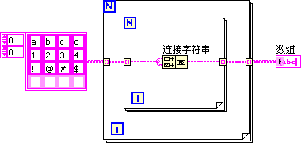 

### 输出隧道

对于循环结构的输出隧道来说，它的输入端在循环结构之内，也就是说每次循环迭代都会传递给隧道一个数据；而隧道的输出端只有一个值。因此，循环结构的输出隧道要负责把输入的多个数据合并整理成为一个单个的数据，传递出去。我们可以给输出隧道设置不同的数据合并方式，在它的右键菜单上可以看到，它有三种模式：
* Last Value: 图标是一个实心方块。这种模式只输出最后一次循环迭代传递给隧道的数据。
* Indexing: 图标是一个空心方块。与输入隧道的索引模式先对应，把每一次循环迭代传递给隧道的数据作为数组元素，合并成一个数组传递出去。如果输入的数据已经是数组了，那么就会把输入数组增加一个维度输出。
* Concatening: 图标是一个带横条纹的方块。这种模式只能应用于隧道的输入端数据的类型是数组类型的情况。与 Indexing 不同的是，输出的数组与输入数组维度相同，但是长度增加了。每一次循环迭代传递给隧道的数组，会被追加到输出数组的后面。

除了以上的三种模式，还可以为输出隧道添加一个条件输入（Conditional），具有条件输入的隧道会多一个图标为问号的接线端。可以输入一个布尔值，如果输入的值为“真”，则输入数据会被保留；如果输入值为“假”，则输入数据会被忽略，不会出现在隧道的输出端。

比如，下图中的这段程序：

程序中，首先把迭代的序号，一个 0 到 9 的整数，使用“Build Array”函数包装成一个只有一个元素的一维数组。循环每次迭代，都会把这个一维数组数据传递给所有的输出隧道。示例程序中放置了 4 个输出隧道，分别使用了不同的模式，从上至下分别是 Last Value、Indexing、Concatening 和 Indexing+Conditional。Last Value 隧道只会输出最后一次迭代产生的数据，一个只有数字 9 的一维数组；Indexing 隧道的输出是一个二维数组，每一行是循环迭代一次产生的数据；Concatening 隧道输出的仍然是一维数组，但是它包含了所有迭代产生的数据；最后一个示例，由于条件输入在 i 为偶数的时候是真，所以它输出的数据是一个二维数组但只会包含偶数数值。

程序的运行结果如下：

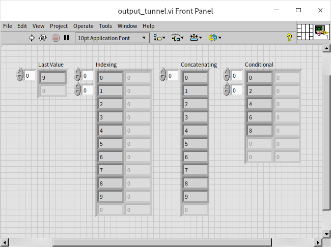

### 应用实例

下面，分析两个 for 循环的应用实例：

**程序 1:** 编写一个程序，程序列出某一路径下的所有 VI，再把这些 VI 的文件名在程序前面板上一一显示出来。同时前面板上有一进度条，可以表明已显示了总数的多少。

下图是程序的代码，在需要给程序添加进度条时，可以参考本例的思路。

在上图的程序中，Recursive File List.vi 是 LabVIEW 自带的函数，位于“编程 -> 文件 I/0-> 高级文件函数 -> 递归文件列表”选板，它用于输出指定文件夹中的内容。拆分路径函数位于“编程 -> 文件 I/O-> 拆分路径”，用于输出文件或文件夹名。本书在 [字符串和路径数据](data_string) 还会对“路径”数据做详细介绍。

该程序首先列出一个文件夹下的所有 VI，然后利用循环结构迭代显示每一 VI 的文件名。程序中的进度条控件的标尺刻度范围被设置为 0～1。这样，只要把 i/N 的值传递给进度条，进度条即可显示出当前程序的大致进度，如下图所示：

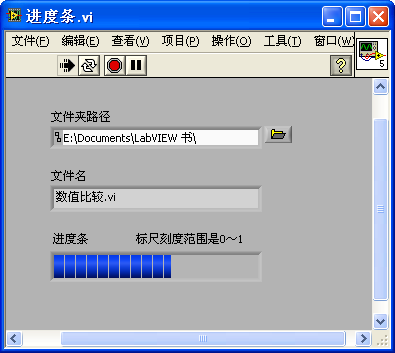

**程序 2：** 判断一下，下图程序中“输出整数”的值是多少？

“输出整数”可能是 33 也可能是 0。这是使用 for 循环结构时最容易出现的错误之一。虽然从程序框图上看，“输入整数”和“输出整数”是连接在一起的，“输入整数”的值应该与“输入整数”相同。但要考虑到，假如输入“数组”为空数组，则循环一次也不会迭代，与“输出整数”相连的循环结构输出隧道得不到任何数据，只能返回一个默认值 0。

### 移位寄存器

隧道负责在循环结构内外传递数据。当循环的不同迭代间需要有数据传递时，需要使用另一种机制：移位寄存器。在循环结构边框的鼠标右键菜单中选择“添加移位寄存器”即可为循环结构添加一对移位寄存器。一对移位寄存器由两部分组成，分别位于循环结构的左右两侧。一次迭代结束时，数据流入循环结构右侧的移位寄存器；在下一迭代开始时，该数据会从同一移位寄存器的左侧端流出：

有文本编程语言经验的用户，刚开始接触 LabVIEW 时，遇到需要传递数据的情况，往往会先考虑创建一个变量，用变量来传递数据。在使用循环语句时，更是如此。这实际上是与 LabVIEW 的数据流驱动相违背的。使用 LabVIEW 的时候，需要转换思路，凡是循环内需要使用变量的地方，首先应考虑使用移位寄存器。

通过移位寄存器传入传出数据，数据的类型和值都不会发生变化。移位寄存器的特殊之处在于，在循环结构两端的接线端是强制使用同一内存的。因此，上一次迭代执行产生的某个数据，传给移位寄存器右侧的接线端，如果下一次迭代运行需要用到这个数据，从移位寄存器左侧的接线端引出就可以了。也就是说，尽管一对移位寄存器总是包含左右两部分，但这两部分中的数据是同一份；而隧道则有输入隧道和输出隧道之分，某个输入隧道是与其它输出隧道毫无关系的独立节点。

我们把上文“程序 2”中的程序做一些改进，用一个移位寄存器来替换程序中原本不相关的输入输出两个隧道。在隧道节点处，点击鼠标右键，选择 "替换为移位寄存器"：

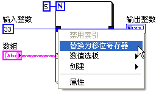

改进后的程序：

执行改进后的程序，“输出整数”的值会确定是 33。即便一次循环迭代都没有执行，数据从移位寄存器左侧流入，移位寄存器左右两侧保存的是同一份数据，所以从移位寄存器右侧流出时还是 33。

使用循环结构的一个常见错误是忘记给移位寄存器赋一个初始值。因此，使用移位寄存器时要切记：在循环结构外，给移位寄存器左侧端传入一个初始值，除非能够确定程序的确不需要给移位寄存器赋初值。

运行下图中的程序：

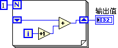

我们会发现“输出值”取决于运行这个 VI 的次数。每次运行该 VI，“输出值”都会发生变化。这就是必须给移位寄存器赋初始值的原因。

移位寄存器的左侧接线端可以多于一个：

用鼠标可以把左侧接线端拖拽出所需要的个数来。多出来的接线端从上到下分别为上两次、三次...... 迭代输出的数据。同样不要忘记给左侧的这些移位寄存器连接一个初始值。如果迭代次数少于寄存器个数，或迭代还未开始，从左侧数据尚未更新的接线端出来的数据就是它们的初始值。

移位寄存器除了在迭代间传递数据之外，还附带有其他一些功能。其中最主要有两点：一是帮助程序内存优化；二是用于功能全局变量中。本书将在 [内存优化](optimization_memory) 和 [全局变量](pattern_global_data) 章节中深入讨论这两点应用。

### 结束条件

在 for 循环结构的右键菜单中选择“条件接线端”，可以为 for 循环创建一个接收停止循环命令的接线端。它类似于 C 语言中跳出循环的 break 语句：

有时候，循环尚未完成全部迭代，就已经得到所需答案，那么循环也没必要再继续。比如上图中的程序，用于查找“数组”中是否有元素与“字符串”的值相同。如果找到，则传“真”值给条件接线端，停止循环运行。

条件接线端有两种停止模式，即可以接收“真”值，让循环停止运行；也可以接收“假”值，让循环停止运行。当条件接线端显示为一个红色圆形 时，表示收到“真”值，停止循环运行。鼠标单击条件接线端，使其变成绿色环形箭头，则表示在收到“假”值时，停止循环运行。这一点与 while 循环是相同的。

:::tip

如果结构内的代码比较复杂，最好添加一段文字用来说明结构内代码个功能，帮助别人或自己将来更有效率的阅读代码。在结构的右键菜单中选择“可见项目 -> 子程序框图标签”，可以为结构添加一段文字说明：

:::

## while 循环结构

while 循环的功能与 for 循环类似，用于把循环结构体内的代码重复执行一定次数。与 for 循环不同的是，while 循环在运行前不能确定循环的次数，只能在循环开始执行后，再根据传入“条件接线端”的数据判断是否执行下一迭代。这与文本语言中的 do... while... 循环语句类似。如果程序的逻辑是先执行循环，再判断是否停止循环，则应当首先考虑使用 while 循环。

由于 while 循环至少会执行迭代一次，所以上文“程序 2”中的程序如果使用 while 循环，是不会出错的。循环只要迭代一次，即可把输入隧道的数据传递至输出隧道，这样就可以保证“输出整数”的值为 33。

for 循环结构中使用的数据传递方式（隧道、移位寄存器和反馈节点）及其使用方法，也适用于 while 循环结构。但在使用索引隧道时需要注意，while 循环的迭代次数只受控于传入“条件接线端” 的数据，而不受连接索引隧道的数组长度的影响。因此，while 循环的迭代次数可以超过输入数组的长度，此时是无法从数组中得到有效元素的数据的，输入隧道只能使用默认值。另外，把数组数据连线到 for 循环结构内部，LabVIEW 会自动为其创建一个索引隧道；而连接数组到 while 循环结构内部，则默认为其创建一个普通隧道。

使用输出索引隧道时，while 循环的效率比 for 循环稍差。比如下图中的程序，分别在两种循环结构中通过输出索引隧道构造一个数组：

这两种循环所产生的数组大小是相同的。如果使用的是 for 循环，LabVIEW 在循环运行之前，就已经知道数组的大小是 100，因此 LabVIEW 可以预先为 Array1 分配一个大小为 100 的数据存储空间。但是对于 while 循环，由于循环次数不能在循环运行前确定，LabVIEW 无法事先就为 Array2 分配合适的内存空间，而是在 while 循环的过程中不断调整 Array2 数据空间的大小，这些额外工作使得 while 循环效率降低。

因此，在可以确定循环次数的情形下，更适合使用 for 循环。

## 反馈节点

### 反馈节点的基本用法

在循环结构框图中，如果单纯为了让下一次迭代使用上次迭代的数据，也可以使用如下图所示的反馈节点。

通过移位寄存器的右键菜单，可以把一个移位寄存器替换为反馈节点；反之亦然。在给循环结构内的某一个节点的接线端连线时，如果数据流出现了一个环，LabVIEW 就会自动创建出一个反馈节点插在这个环中。下图所示，把“+1”函数的输出数据再引回到它的输入端，形成了数据流的环，LabVIEW 就会自动在这个环上插入一个反馈节点：

反馈节点的下侧“米”字符号出还有个接线端，用于设置它的初始值。反馈节点在本质上非常类似于移位寄存器，也需要有初始值。在移位寄存器的右键菜单上选择“Move Initializer One Loop Out”，可以把这个初始化接线端挪到循环结构的左边框上。不过，多数时候，把初始化值与反馈节点放在一起，程序可读性会更好。

在移位寄存器的右键菜单上可以发现，反馈节点的初始化有两种方式：“Initialize On Compile Or Load”和“Initialize On First Call”。选择“Initialize On Compile Or Load”，反馈节点的图标会变成“米”字符号，它表示这个反馈节点只在被装入内存或者被重新编译后初始化一次，之后再运行并不会初始化；选择“Initialize On First Call”，反馈节点的图标会变成“人”字符号，它表示每次启动运行 VI，反馈节点都会被初始化。比如运行下面的程序：

第一次运行这个 VI，“result 1”和“result 2”的输出结果都是 2，因为循环迭代次数是 2。但是再运行这个 VI 一次“result 1”的值会变成 4；“result 2”的值依然是 2。之后每次运行这个 VI “result 1”的值都会比上一次运行增加 2；而“result 2”的值则始终是 2。

### 反馈节点的使用

反馈节点和移位寄存器的功能与本质是完全相同的。反馈节点的优点在于它不需要从循环的边框上连接数据线。因此，可以把程序写得更简洁美观。尤其是熟悉反馈概念的控制或电子专业的工程师们，可以直观地理解这一节点的用途。由于反馈节点实际依赖于循环结构，而它们之间又没有数据线相连，使用反馈节点时，一不小心就可能把逻辑关系弄错。另外，反馈节点也会导致某些连线上数据的逆向流动。如果逆向数据线过长，不利于阅读程序，就不如使用移位寄存器了。

脱离了外部的程序，单看某个返回节点这一段程序是无法判断运行结果的，比如下面这段程序：

因为我们既不知道反馈节点的初始状态，也不知道它运行了多少次，也就无法判断其运行结果。只有给定了这两个条件，才能推算出程序的运行结果。比如下图中的程序，可以判断运行结果是 5：

在多层嵌套循环中，反馈节点会被包含它的每一层循环结构调用。它相当于在包含它的每一层循环结构上都建立了一对移位寄存器，然后把它们串联起来。因此，下图中的程序运行的结果是 25。

特别值得注意的是，反馈节点与包含它的循环结构不一定位于同一个 VI 中。比如上图中的程序，在它作为子 VI 的时候，运行调用它的主 VI，result 输出的值可能不是 25。这很可能是因为这个子 VI 的某个上层 VI 中也有循环结构，而这个循环结构能够影响它所包含的子 VI 中的反馈节点。

反馈节点还有个启用输入端，右键点击反馈节点，选择“显示启用接线端”可以显示出这个输入端。它的输入为真时，反馈节点正常工作；输入为假时，反馈节点则在这一次迭代中不工作，继续保持上一次迭代时的数据。读者可以根据前文的描述，判断一下下图中程序的运行结果：

在上图程序中，反馈节点只有在 i 为偶数时才工作，因此程序的功能是在统计 0~4 这五个整数中有几个偶数，结果为 3。

移位寄存器除了可以返回上一次迭代的数据，还可以返回上 n 次的迭代数据。反馈节点也有类似功能（并不完全相同）。右键点击反馈节点，打开它的属性配置对话框，在配置中可以选择延时的次数: 

比如设置延迟 3 次，那么反馈节点每 3 次迭代才把数据反馈一次。比如下图的程序：

result 控件在程序的 5 次迭代中分别返回值 1、1、1、2、2，其最终运行结果是 2。

再来考虑一下下图中的多层嵌套循环的情况：

result 总共经历 25 次迭代。在这个多层嵌套的循环中，带延迟的反馈节点依然是每隔 3 次迭代（最里层循环的迭代）返回一次反馈数据。每次迭代返回的数据分别是：1、1、1、2、2、2、3、3、3、4、4、4、5、5、5、6、6、6、7、7、7、8、8、8、9。也就是最终结果为 9。

最后，读者可以分析一下下图中的程序的运行结果应该是多少？

 

读者可能已经发现了，直接估算上图所示程序的运行结果是非常困难的，本书在这里是想把它作为一个反例。在能够完成所需功能的前提下，程序越简单易懂越好。所以应该尽量避免上图这种容易让人迷惑的代码。

### 在子 VI 中直接使用反馈节点

如下图所示，在子 VI 中，反馈节点也可以脱离循环结构单独存在。也就是说反馈节点可以建立自己的移位寄存器，而不需要循环结构：

上图中的程序可以被看做是一个计数器，程序运行后，这个 VI 每被调用一次，输出就会增加 1。

下图中的程序用于测试这个计数器子 VI：

上图程序中，主 VI 放置了两个“子 VI.vi”的实例（或者说在两处调用了同一个子 VI）。那么，两个“子 VI.vi”的实例，它们内部的反馈节点是共享一个移位寄存器，还是每个实例单独使用自己的移位寄存器呢？运行这个程序，结果如下图所示：

从这一运行结果可以看出，它们分享了同一个移位寄存器。即使子 VI 在不同的循环中被调用，它们也都是共用同一个移位寄存器的比如下图中的程序：

其运行结果为：

只有把子 VI 设置成为每个实例都生成副本的 [可重入运行方式](pattern_reentrant_vi) 时，不同的子 VI 实例才具有独立的移位寄存器。

## 练习

* 编写一个 VI，利用循环结构计算从 33 到 62 之间所有整数的和。

