# Array and Loop

## Cluster {#cluster}

### Cluster Controls

A **Cluster** is a composite data type in LabVIEW. Unlike arrays, which mandate uniform elements, a cluster can group multiple, diverse data types into a single entity. This is analogous to a `struct` in C/C++ or a named tuple in Python.

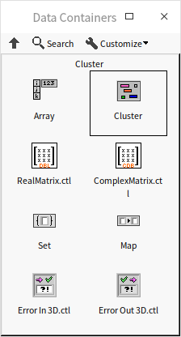

Unlike simple controls, placing a Cluster on the Front Panel initially displays a blank, empty container shell. To define its data structure, you must drag and drop other controls (such as numerics, Booleans, or strings) inside it. The image below shows a populated cluster control containing several elements:

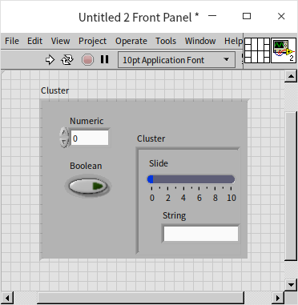

Clusters can be nested (a cluster can contain another cluster). Creating a cluster constant on the Block Diagram follows the same process.

The visual arrangement of controls inside a cluster on the Front Panel does not dictate the logical memory layout or terminal sequence of the elements on the Block Diagram. For clusters containing many elements, manual alignment is tedious. You can auto-align them by right-clicking the cluster border and selecting **Autosizing -> Arrange Vertically** (or **Arrange Horizontally**). This arranges the elements sequentially according to their logical data order.

Simply dragging controls around inside the cluster container does not alter their logical index. To change the logical sequence, right-click the cluster border and select **Reorder Controls in Cluster...**. This displays black index badges on each control; you click the controls in the desired order to assign their new logical index numbers:

Properly managing cluster order ensures consistent data matching when wiring clusters across subVIs.

### Bundling and Unbundling Cluster Data

Handling cluster data involves extracting elements for processing (**unbundling**) or grouping elements back into a cluster (**bundling**). LabVIEW provides two pairs of nodes for these tasks: the positional **Bundle / Unbundle** and the name-based **Bundle By Name / Unbundle By Name**.

The standard **Bundle** and **Unbundle** nodes are positional and rigid. They process all cluster elements based strictly on their logical index sequence. If you add or reorder elements in the cluster, standard bundle nodes can break or mismatch data.

In contrast, **Bundle By Name** and **Unbundle By Name** allow you to expand the node and select specific elements by name. They are much more flexible, as you only expose the specific variables you need to read or update, and the node automatically handles logical ordering under the hood.

In professional code, **always prefer Bundle By Name and Unbundle By Name** over the standard positional nodes. They make the Block Diagram much more self-documenting and prevent bugs caused by index shifting:

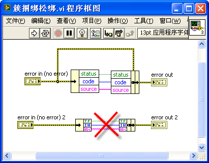

A classic example of clusters is the standard LabVIEW **Error Cluster**:

Error clusters are central to [error handling](pattern_error_handling) in LabVIEW. An error cluster contains a Boolean `status` (True indicates an error), an I32 `code` (the numeric error identifier), and a string `source` (where the error occurred). Grouping these variables simplifies error propagation across VIs.

By grouping related parameters into clusters, you simplify the Block Diagram wiring, carrying multiple data channels on a single wire. This helps keep subVI icon terminals clean. However, clusters require extra bundling/unbundling steps, and using large clusters directly on Front Panel user interfaces can restrict layout flexibility.

You can sometimes perform math operations directly on clusters without unbundling them. This is called **cluster polymorphism**. For instance, if all elements in a cluster are compatible numeric types, you can perform basic operations directly on the cluster wire:

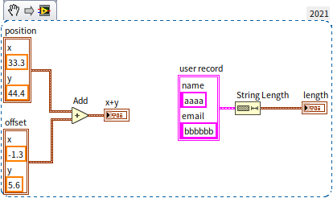

In the left example, adding two coordinates clusters (`x` and `y`) adds their elements correspondingly. In the right example, passing a cluster of strings directly to the **String Length** function outputs a cluster of integers containing the lengths of the respective strings.

Since real-world clusters usually group mixed data types, polymorphic operations are rare. Most of the time, you will use Bundle By Name and Unbundle By Name to read or modify specific fields.

## Array {#array}

### Array Controls

An **Array** is a collection of elements of the exact same data type. To create an array control or constant, place an empty **Array Shell** from the palette onto the Front Panel (or Block Diagram), and then drag a data control (numeric, Boolean, string, cluster) inside it to define the element type:

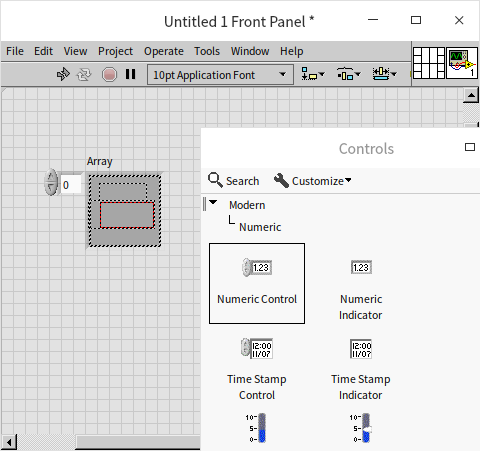

Arrays are index-based, starting at index `0`. The index display in the upper-left corner of the array control determines which element is currently visible at the top of the container.

To show multiple elements at once on the Front Panel, click and drag the outer border of the array shell to resize it. For large arrays, incrementing the index box manually is slow; instead, right-click the array border and enable a scrollbar for faster navigation:

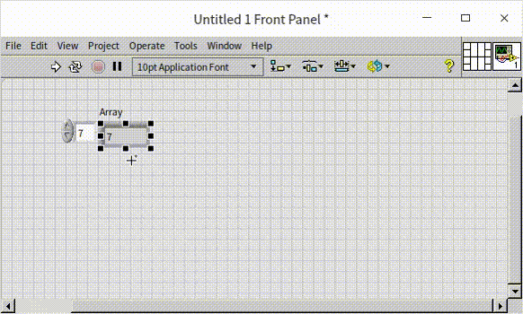

A single index field represents a one-dimensional (1D) array. To convert it to a two-dimensional (2D) array (rows and columns), hover over the index display box and drag its border downwards to add a second index box. You can continue adding indexes to construct multi-dimensional arrays.

You can build arrays out of almost any LabVIEW type. The only restriction is that **an array cannot contain an array directly**. If you need a jagged array (an array of arrays), you must wrap the inner array inside a cluster, and then build an array of those clusters:

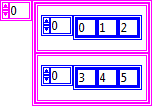

### Array Calculations

LabVIEW provides a rich set of functions for array operations under **Programming -> Array**. Common operations include finding the array size, indexing elements, sorting, and summing values.

Many scalar operations (like Add or AND) are polymorphic and can accept arrays. For example, adding a scalar constant to a numeric array adds that value to every element. Adding two arrays adds their corresponding elements. If the arrays have different lengths, the resulting array is truncated to match the shorter input array:

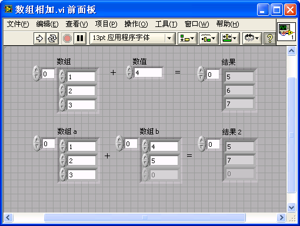

### Comparing Arrays

Standard comparison functions (like Equals? or Greater?) can compare arrays. By right-clicking a comparison node wired to arrays, you can choose between two modes under **Comparison Mode**:

- **Compare Elements**: Compares elements individually, returning a Boolean array of the same size.
- **Compare Aggregates**: Treats the entire array as a single object, returning a single Boolean value. The arrays are equal only if their dimensions match and all elements are identical:

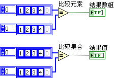

The execution result:

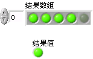

Before processing or indexing an array, use **Array Size** to find its element count. For a 1D array, it returns a scalar integer. For multi-dimensional arrays, it outputs a 1D array where each element represents the size of a dimension (e.g., number of rows or columns).

### Indexing Elements

Use the **Index Array** function to retrieve elements at specific positions. The `index` input is 0-indexed. If left unwired, it defaults to 0 (the first element).

To index multiple elements, drag the lower border of the **Index Array** node downwards to expose more output terminals. If you leave index inputs unwired, they default to sequential indices following the last wired index (e.g., if you wire index `2` to the first terminal and leave the next unwired, it automatically retrieves index `3`):

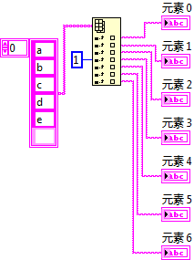  Index results: 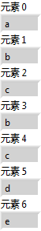

For multi-dimensional arrays, you can index a single scalar element by wiring all dimension indices, or extract entire sub-arrays (like an entire row or column) by leaving some dimension terminals unwired:

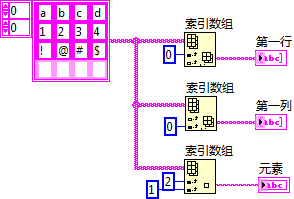

Index results:

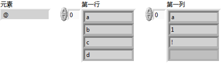

### Merging Arrays

The **Build Array** function adds elements to an array or merges arrays. If you wire a scalar and a 1D array, it appends the scalar to the array. If you wire two 1D arrays, it creates a 2D array by default.

To merge two 1D arrays into a single, longer 1D array, right-click the input terminal and check **Concatenate Inputs**:

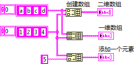

Merge result:

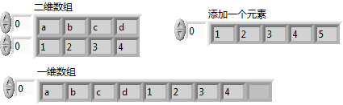

You can drag the border of the **Build Array** node to add more inputs.

### Specialized Array Display Controls

Several advanced LabVIEW UI controls are driven by array data under the hood, such as [charts](data_graph) and [table](data_and_controls#lists-tables-and-trees) controls. These display arrays in intuitive visual formats.

For example, you can write a VI to generate a 2D array of sine wave values:

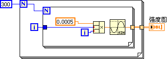

Instead of a standard array indicator, you can use a **Table** control to view the numbers in a grid:

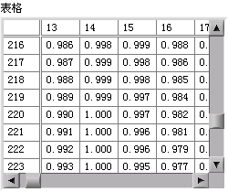

To visualize patterns, you can use an **Intensity Graph** indicator, which maps values to color gradients:

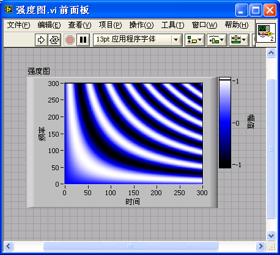

(See [Graphical Data Representation](data_graph) for more details).

## for Loop {#for-loop}

Array operations often require loop structures to process elements iteratively. LabVIEW provides two loop structures under **Programming -> Structures**: the **For Loop** and the **While Loop**.

Unlike functions, structures are resizable rectangular frames that enclose the code they execute:

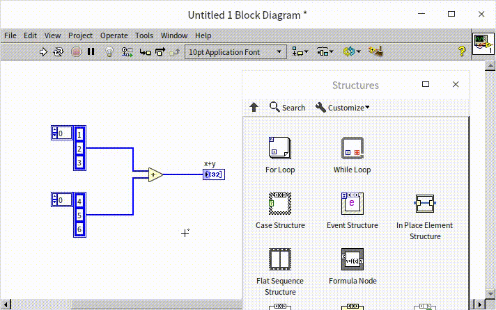

The **For Loop** repeats code a set number of times. The **loop count (N)** terminal at the upper-left defines the iterations. The **iteration (i)** terminal at the lower-left displays the current iteration count (0-indexed).

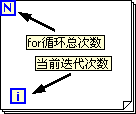

### Input Tunnels

When a wire crosses a structure border, LabVIEW creates a **tunnel** (a solid or hollow rectangle matching the wire's data type color).

If you wire an array to a loop border, LabVIEW enables **Auto-Indexing** by default (represented by a hollow tunnel). An auto-indexed tunnel feeds one element of the array into the loop per iteration, acting as an automatic loop count. If you use auto-indexing, you do not need to wire the `N` terminal—the loop automatically runs once for each element in the array. You can disable this by right-clicking the tunnel and selecting **Disable Indexing**.

If you wire multiple auto-indexed arrays of different sizes, the loop count defaults to the size of the smallest array. If you also wire the `N` terminal, the loop count is the smaller of `N` and the array sizes.

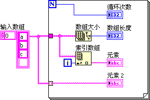

In the program above, because the array is auto-indexed, you do not need to specify `N`. We can compare manual indexing with `Index Array` to automatic indexing via the tunnel.

If an auto-indexed tunnel receives an empty array, the loop iterates zero times. This can be a troubleshooting trap: if your loop fails to execute, check if it is receiving an empty array through an auto-indexed tunnel.

Wiring a multi-dimensional array to an auto-indexed tunnel peels off one dimension per loop level. To process a 2D array element-by-element, nest two loops:

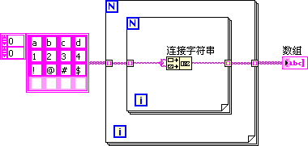  The results: 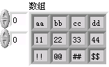

### Output Tunnels {#output-tunnel}

Each iteration sends data to the output tunnel. After the loop completes, the tunnel outputs the data based on its configuration (right-click the tunnel to choose):

- **Last Value**: (solid square) Outputs only the value from the last iteration.
- **Indexing**: (hollow square) Compiles values from all iterations into a new array.
- **Concatenating**: (striped square) Appends input arrays from each iteration into a single array of the same dimension.

You can also enable a **Conditional** terminal on the output tunnel (adds a `?` terminal). The tunnel only records values when a `True` Boolean is wired to it.

For example, this program demonstrates the different output modes:

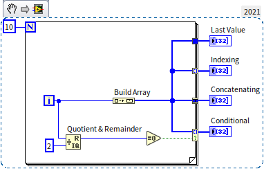

With these outputs:

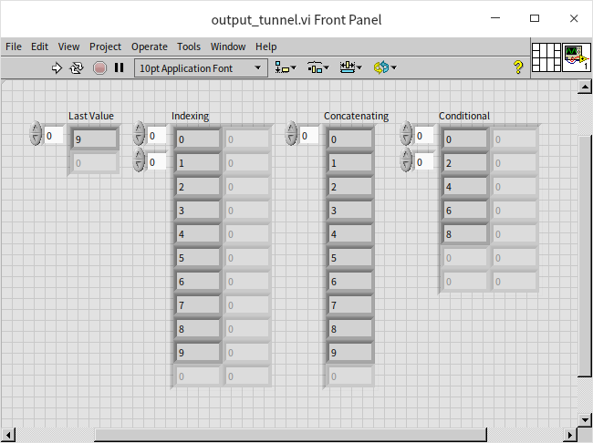

### Examples of For Loop Applications

- **Program 1: Displaying Filenames with a Progress Bar**
This program lists all VIs in a directory and displays their filenames along with a progress bar. The `Recursive File List.vi` lists the files, and the For Loop iterates through them. We divide the current iteration `i` by the total count `N` to drive a progress bar from 0.0 to 1.0:

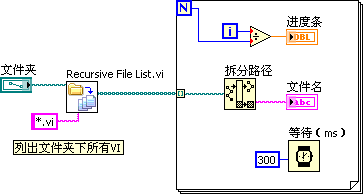

The Front Panel:

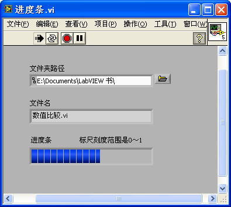

- **Program 2: The Empty Array Trap**
Consider this program and guess the output of 'Output Integer':

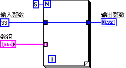

Because the input array is empty, the loop executes zero times. The output tunnel never receives data and simply returns its default value (`0`), rather than the input `33`. This is a classic For Loop bug.

### Shift Registers

While tunnels pass data into and out of loops, **Shift Registers** pass data between loop iterations. Right-click the loop border and select **Add Shift Register** to create a pair of terminals. The right terminal stores data at the end of an iteration, and the left terminal outputs that data at the start of the next iteration:

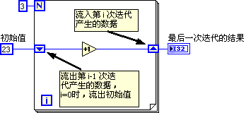

In LabVIEW dataflow, shift registers are the correct way to maintain state across loop iterations. Do not use local variables for this.

We can fix the bug in **Program 2** by replacing the tunnels with a shift register. Right-click the tunnel and select **Replace with Shift Register**:

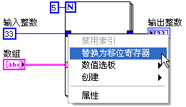

The improved program:

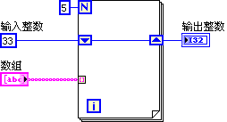

Now, if the loop runs zero times, the input value `33` passes straight through to the output.

Always initialize your shift registers by wiring an initial value to the left terminal outside the loop. If you leave a shift register uninitialized:

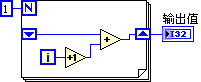

The VI will reuse the last in-memory value on subsequent runs, making the output unpredictable.

You can stack multiple left-hand terminals on a shift register by dragging its bottom border. This lets you access values from older iterations ($i-1$, $i-2$, etc.):

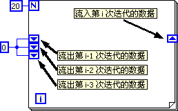

### Stop Conditions

You can add an early exit condition to a For Loop by right-clicking its border and selecting **Conditional Terminal** (similar to a `break` statement):

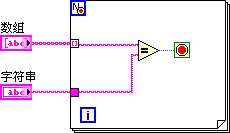

In the example above, the loop searches an array for a target string. If a match is found, it sends a `True` value to the stop terminal, exiting the loop early to save CPU cycles.

The stop terminal can be configured to **Stop if True** 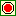 or **Continue if True** .

:::tip

If loop code is complex, right-click the loop border and select **Visible Items -> Subdiagram Label** to write descriptive annotations:

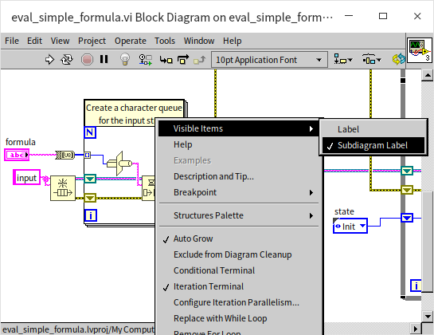

:::

## while Loop {#while-loop}

A **While Loop** executes code repeatedly until a condition terminal halts it. Unlike a For Loop, it does not require a predetermined iteration count. It is equivalent to a `do-while` loop in text-based languages, always executing at least once.

Because LabVIEW is dataflow-driven, the control used to stop the loop (like a 'Stop' button) must be placed **inside** the loop. If placed outside, the loop reads the button once before starting and can get stuck in an infinite loop.

While Loops support tunnels and shift registers. However, be careful with auto-indexing tunnels: because the loop count is driven by the stop condition and not the array size, iterating past the end of the array will output default values.

For loops are more memory-efficient than While Loops when building arrays via output indexing tunnels. In a For Loop, LabVIEW knows the array size in advance and preallocates memory. In a While Loop, LabVIEW must dynamically resize the memory buffer as iterations occur, which degrades performance:

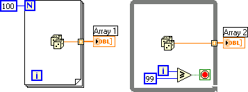

Thus, for scenarios where the iteration count is known beforehand, a For Loop is generally more efficient.

## Feedback Node {#feedback-node}

### Basic Usage

A **Feedback Node** is an alternative way to pass data between loop iterations, visually representing feedback loops:

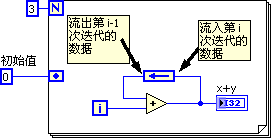

You can convert between a Feedback Node and a Shift Register by right-clicking them. If you wire a function's output back to its input, LabVIEW automatically inserts a Feedback Node:

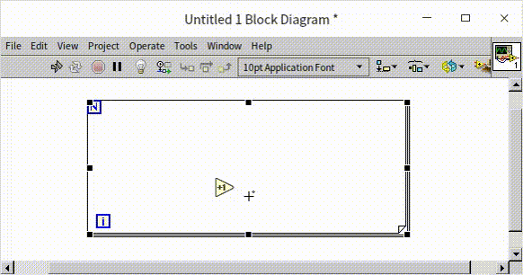

The initializer terminal `❇` sets the default value. You can right-click the node and select **Move Initializer One Loop Out** to place it on the loop border.

You can configure initialization behavior via the shortcut menu:
- **Initialize On Compile Or Load** (`❇` icon): Initialized only once when loaded, retaining state across VI runs.
- **Initialize On First Call** (`∧` icon): Re-initialized every time the VI runs.

For example:

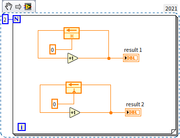

On the first run, both outputs are `2`. On subsequent runs, `result 1` increments continuously while `result 2` resets to `2`.

### Advanced Features

Feedback Nodes keep Block Diagrams clean by eliminating long wires running across structures. However, they can make dataflow direction ambiguous if not used carefully:

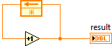

With known initial states, we can trace feedback values. In a single loop:

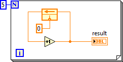

In nested loops, the feedback node is initialized based on its position. If placed in nested loops, it behaves like stacked shift registers:

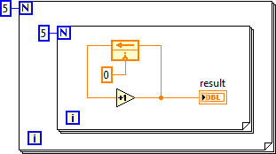

You can also show an **Enable Terminal** on the Feedback Node (via right-click) to update its value only when a condition is met:

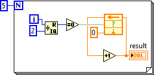

Here, the node only counts even iterations, returning `3`.

You can configure a feedback node to delay values by multiple iterations (right-click -> Properties -> Delays):

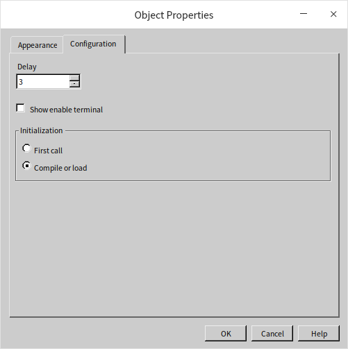

This cycles values every three iterations:

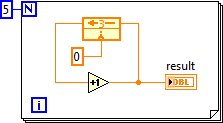

In a nested loop, this delay count increments on each inner loop run:

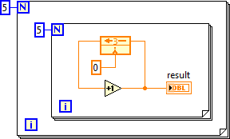

Avoid writing overly complex feedback paths that obscure dataflow:

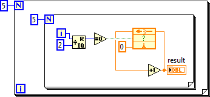

### Feedback Nodes Independent of Loops

Feedback Nodes can also be placed **outside** of loops to act as global state counters:

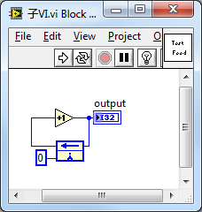

If you place this VI in two locations in a main program:

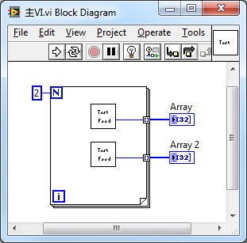

They will share the same internal feedback state:

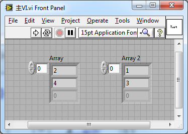

This applies even across separate loops:

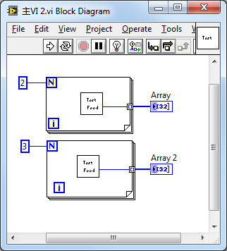

Yielding:

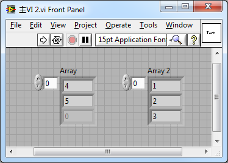

To separate their states, configure the subVI as **reentrant** (see [Reentrant VIs](pattern_reentrant_vi)).

However, using floating feedback nodes to maintain state is considered a poor design pattern. Because it hides the state from the visual dataflow, it makes code hard to debug and test. Instead, use a **Functional Global Variable (FGV)** (discussed in [Global Variables](pattern_global_data)).

## Practice Exercises

- **Sum Calculation VI**: Create a VI that calculates the sum of all integers from 33 to 62 using a For Loop and a Shift Register.
- **Array Search with Early Exit**: Create a VI that generates an array of 100 random numbers (0 to 10). Use a For Loop with Auto-Indexing to inspect elements. If it finds a number greater than 9.5, stop the loop immediately. Output the exit index and the total iterations performed.
