# Custom Control & Enum

## Enum {#enum}

Before delving into custom controls, let's explore one more important data type: the **Enum** (enumeration). An Enum represents a finite, predefined set of items. For example, the days of the week form an Enum with seven members: Sunday through Saturday.

In programming, Enums map textual labels to integer values. For instance, Sunday is mapped to `0`, Monday to `1`, and so on. While some languages permit arbitrary numeric values, LabVIEW enforces a strict definition: Enum values must be consecutive non-negative integers starting from `0`. This strictness ensures predictable behavior, particularly when indexing arrays or driving execution structures.

### Comparing Enum and Ring Controls {#comparison-between-enum-controls-and-ring-controls}

On the Front Panel, **Enum** controls look almost identical to **Ring** controls. Both display a dropdown list of options to the user, and both are located under **Ring & Enum** on the Controls palette:

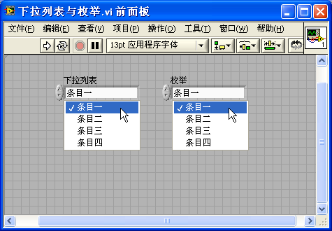

Despite their visual similarity, they belong to different data types: an Enum control uses the Enum type, whereas a Ring control is a Numeric type. This distinction leads to significant behavioral differences, summarized in the table below:

| Control Type | 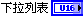 | 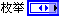 |
| ------------ | ---------------------------------------------------- | --------------------------------------------------- |
| **Data Type** | Numeric. Can be configured as any integer type (U8, I16, etc.) or floating-point type (DBL, SGL).   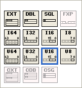 | Enum. Represented internally as an unsigned integer (U8, U16, or U32).   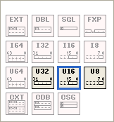 |
| **Setting Values** | Allows assigning arbitrary values to each item (e.g., '10V' = 10, '100V' = 100). | Values are strictly sequential, starting from 0 and incrementing by 1 (e.g., 'Low' = 0, 'Medium' = 1, 'High' = 2). |
| **Usage in Case Structures** | Operates like a standard number. Cases must be entered manually as numbers. The Case Structure does not know the text labels.   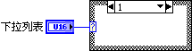 | Cases display the text labels of the Enum. You can right-click the Case Structure and select **Add Case for Every Value** to generate all branches automatically.   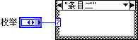 |
| **Dynamically Modifying Item Labels** | Labels can be modified dynamically at runtime using Property Nodes. | Labels are fixed at compile time and cannot be modified dynamically at runtime. |
| **Strictness of Type** | Weakly typed. Any Ring wire can connect to any other Ring control or numeric terminal directly, even if their item lists differ.   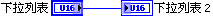  | Enums with distinct items represent different data types. Direct assignment between different Enums is not possible; conversion to a general numeric type is required before transitioning to another Enum type.   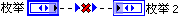   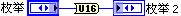  |

Key Takeaways:
- **Use Enums** when representing states, commands, or modes of operation (e.g., in a State Machine). Their integration with Case Structures makes the code self-documenting, and their strict type checking prevents wiring bugs.
- **Use Rings** when you want to present the user with a list of discrete physical values (e.g., select gain levels like '1x', '10x', '100x') but want the wire to carry the actual numeric value (e.g., `1`, `10`, `100`) directly to your math nodes, or when you need to change the options list dynamically during runtime.

### Radio Button Control

A **Radio Button** control also utilizes the Enum data type. Visually, it behaves like a cluster of mutually exclusive Boolean buttons (only one can be selected at a time). On the Block Diagram, however, the terminal is an Enum, outputting the index and label of the active button.

You can customize the layout and button count as needed:

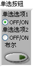 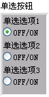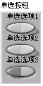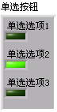

Radio buttons are great for keeping all options visible at a glance without requiring the user to open a dropdown. However, they consume more Front Panel space than dropdown-style Enum controls.

### Creating and Using an Enum Control

To demonstrate, let's build a simple program with a main VI (`enum_main.vi`) and a subVI (`enum_sub.vi`) to handle team selection ('Team A', 'Team B', 'Team C').

First, add an Enum control to the Front Panel of the main VI. To define its options, right-click the control and select **Edit Items**. Enter the team names in the list:

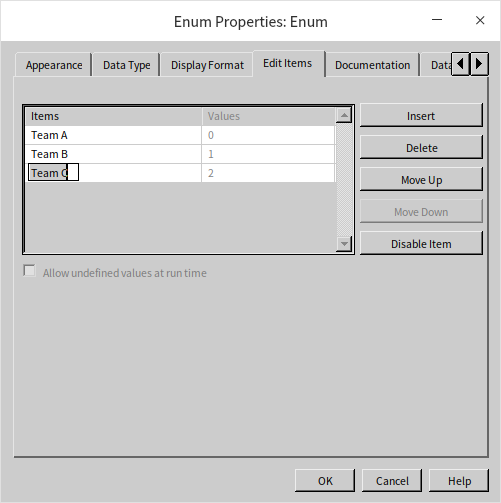

For the subVI (`enum_sub.vi`), copy the Enum control from `enum_main.vi` (`Ctrl+C` and `Ctrl+V` or drag-and-drop) to ensure they share the same structure:

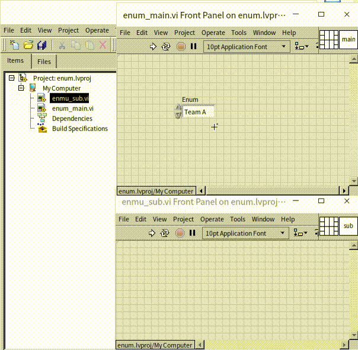

In the block diagram of `enum_sub.vi`, wire the Enum control to a Case Structure. Note how the Case Selector automatically displays the Enum labels rather than numbers:

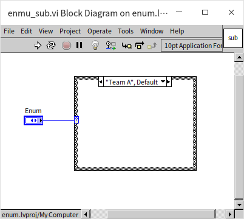

In `enum_main.vi`, we simply pass the Enum control to `enum_sub.vi`:

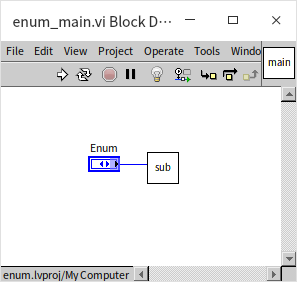

Now, suppose Team C is renamed to Team D. If you update the Enum items in `enum_main.vi`:

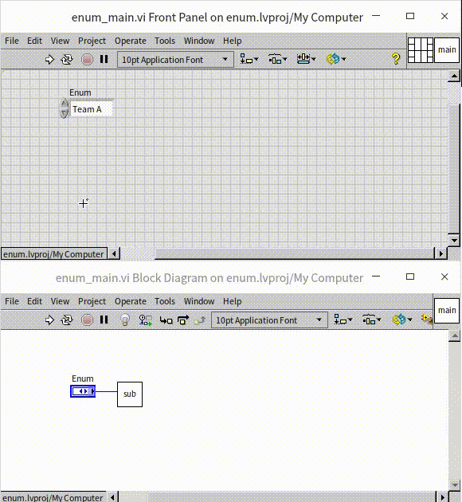

The wire connecting to `enum_sub.vi` immediately breaks. This is because the Enum in the subVI was not updated, so they are now treated as different, incompatible data types. While manually updating both controls is easy in a tiny project, doing so across dozens of VIs in a large application is extremely tedious.

To solve this synchronization problem, LabVIEW provides **Custom Controls** (.ctl files).

## Custom Control {#custom-control}

Files with the `.ctl` extension are custom controls in LabVIEW. When you open a `.ctl` file, you can choose from three definition modes in the toolbar dropdown: **Control**, **Type Definition** (Type Def.), and **Strict Type Definition** (Strict Type Def.):

Choose the definition form in the toolbar dropdown:

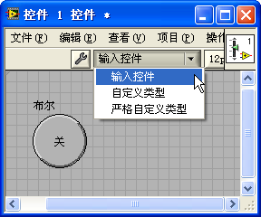

The **Control** mode is used solely for customizing a control's visual aesthetics. **Type Definition** and **Strict Type Definition** link the control's data structure across all VIs that reference it. Let's look at their differences.

### Creating a Custom Control

If the standard LabVIEW controls do not match your desired visual style, you can customize their appearance. This process involves editing the graphics of the control using custom image assets (like PNGs) to replace the default borders and buttons.

A custom control only changes the cosmetic appearance, not the underlying code behavior. If you need to build a control with entirely custom programmatic behavior, use **XControls** instead (discussed in [XControls](ui_xcontrol)).

For example, to build a circular browser-style 'Back Button' (with a left arrow ):

First, create a `.ctl` file. You can do this in two ways:
1. Select **File -> New -> Custom Control** from the menu. This opens a blank `.ctl` window where you can place a control template.
2. Right-click an existing control on a VI's Front Panel and select **Advanced -> Customize**:

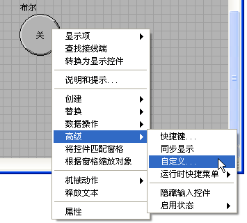

The `.ctl` editor looks like a Front Panel, but it can only contain **one** control. If you have zero or more than one control, the run arrow breaks, showing a warning on the toolbar:

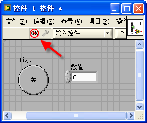

A `.ctl` file has no Block Diagram; it strictly defines appearance or data type.

### Components of a Custom Control

In the `.ctl` editor toolbar, you will see a button with a **Wrench** or **Tweezers** icon, which toggles between:
- **Edit Mode (Wrench)**: Lets you resize, recolor, and configure the control as you would on a normal Front Panel.
- **Customize Mode (Tweezers)**: Lets you deconstruct the control into its individual graphic components (backgrounds, borders, text, active states) and replace them individually.

In Customize Mode, each component has a white border. A simple button consists of a label, a button body, and Boolean text. A slider control is much more complex, consisting of a track, a thumb, scales, digital displays, and scroll buttons:

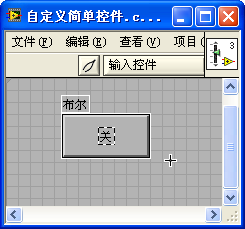 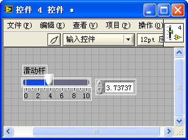

### Modifying Control Components

Imagine you want to replace a button's default graphics with a custom arrow image: .

In Customize Mode, right-click the component you want to modify (such as the button body) and select **Import from File...**:

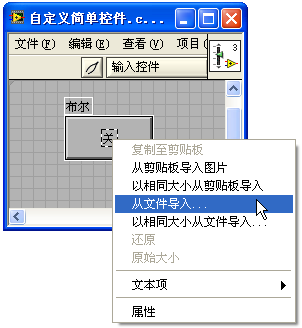

Select your custom image. The component is instantly replaced:

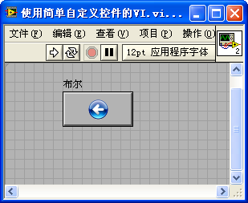

To create high-quality round or shaped buttons, use PNG files with transparency so the background doesn't show a square box.

For buttons, you should import different images for each state (True, False, Hover, etc.). Right-click the control body and use the **Picture Item** menu to switch states and import the corresponding graphics:

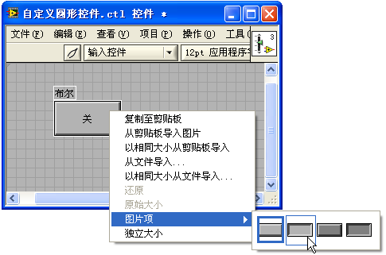
And import:
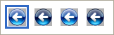

Set the mechanical action to **Latch When Released** or **Switch When Released** as needed. Here is how the custom button looks in an application:

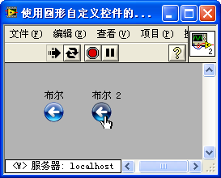

### Simple Animation

LabVIEW supports animated GIF files. You can import an animated GIF into custom control elements. For example, a color-changing square GIF  can replace a slider's thumb to create an animated slider:

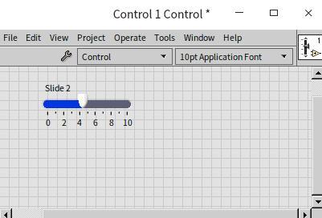

You can also drag GIF files directly onto the Front Panel to show decorative animations.

### Type Definition {#type-definition}

Controls defined in a `.ctl` file are called **Custom Controls**, while the controls placed on VIs that use them are **Instances**.

If you save a `.ctl` file in **Control** mode, the instances are completely unlinked. Dragging it onto a VI copies the control, but any subsequent changes to the `.ctl` file will *not* propagate to the VI.

If you save it as a **Type Definition (Type Def)**, the data type of all instances is linked to the `.ctl` file. If you update the data type in the `.ctl` file (e.g., adding an item to an Enum), all instances across all VIs in your project automatically update to match:

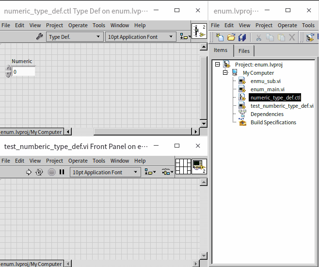

Note that standard Type Defs only synchronize the data type, not visual properties (like colors, sizes, or Ring label lists).

This is why Enums and Rings behave differently with Type Defs. For an Enum, the item string list is part of the data type; updating an Enum Type Def updates the item list on all instances. For a Ring control, the item list is a cosmetic property (the type is just numeric). To synchronize a Ring control's item list, you must use a **Strict Type Definition** instead.

### Strict Type Definition {#strict-type-definition}

A **Strict Type Definition** synchronizes almost everything: data type, colors, sizes, and item lists. Only properties unique to an instance (like the current value, default value, and label) can be set individually.

For clusters, Enums, and Rings, **always use Strict Type Definitions**. This ensures consistency across your entire application.

On the Block Diagram, constants linked to a Type Def show a small black 'dog-ear' triangle in their upper-left corner. Always ensure your constants display this triangle; this confirms they are linked to the Type Def and will update automatically when the `.ctl` changes. If you copy an Enum constant and lose this link, the wire will break on the next update because the types no longer match.

When a Strict Type Definition is updated, all instances update automatically, but you may need to update the Block Diagram logic (such as adding a case to a Case Structure if a new Enum state was added).

## Practice Exercises

- **Coordinate Type Def**: Create a Strict Type Definition (`coordinate.ctl`) containing a cluster with numeric elements `x` and `y` (representing 2D plane coordinates). Next, create a VI using this Type Def as its input control and wire it to an XY Graph.
- Once it is working, open `coordinate.ctl`, add a third numeric element `z` (making it a 3D coordinate), and save. Observe the Front Panel of your VI: the control updates automatically. Look at the Block Diagram: the wire connecting to the XY Graph is now broken because the type has changed from 2D to 3D, demonstrating how the Type Def enforces type safety across your project.
