# Graphical Representation

LabVIEW is renowned for its powerful graphical data display capabilities, offering an extensive range of controls and functions that simplify data visualization. The **Graph** palette on the Controls palette showcases a variety of options. Many of these controls are variations of the same underlying display engine, customized to show specific formats or bundled with helper code on the Block Diagram to format the inputs.

For example, a 2D graph can display Cartesian plots, polar plots, or even radar charts. Helper VIs compile and format the raw data to match the expected inputs of the control, ensuring accurate and visually appealing data representation.

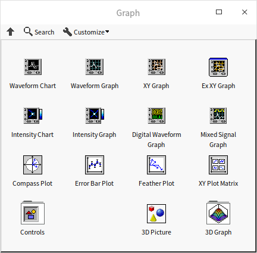

Most of these controls display 2D data, but LabVIEW also provides controls for 3D visualization.

## Waveform Chart and Waveform Graph

The two most common controls for displaying data curves over time are the **Waveform Chart** and the **Waveform Graph**. By default, these controls plot numeric data in a Cartesian coordinate system, with the X-axis representing time and the Y-axis representing the amplitude.

### Difference between Chart and Graph

While their functions are similar, they differ in how they manage and display data:

A **Waveform Chart** maintains an internal buffer (cache) of historical data. When you pass new data points to it, the chart appends them to its history and updates the display progressively, preserving older data points. Charts are ideal for slower, real-time data acquisition. For instance, if you acquire temperature readings once per second from a boiler, a Waveform Chart lets you see the trend build up over time.

In contrast, a **Waveform Graph** has no historical memory. It clears the screen and redraws the entire plot from scratch every time it receives a new dataset. Graphs are best suited for high-speed, batch data display. For example, if an analog-to-input card captures 1,000 vibration data points in a 10 ms burst, you should collect the entire array first and pass it to a Waveform Graph in one block.

Consequently, their terminal data types differ: a Waveform Chart terminal accepts a single scalar number (e.g., DBL) per iteration, while a Waveform Graph terminal expects an array of numbers (e.g., 1D array of DBL).

This means a Waveform Chart is typically placed *inside* a loop to plot values iteratively, whereas a Waveform Graph is placed *outside* the loop to render the completed array:

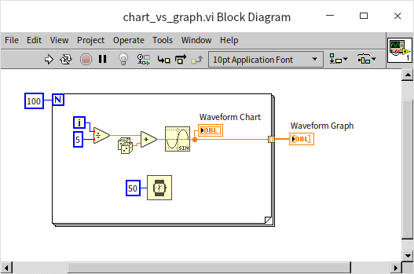

When executed, both display the same final curve. However, during execution, the chart updates progressively point-by-point, whereas the graph remains empty until the loop completes, at which point it renders the entire curve instantaneously:

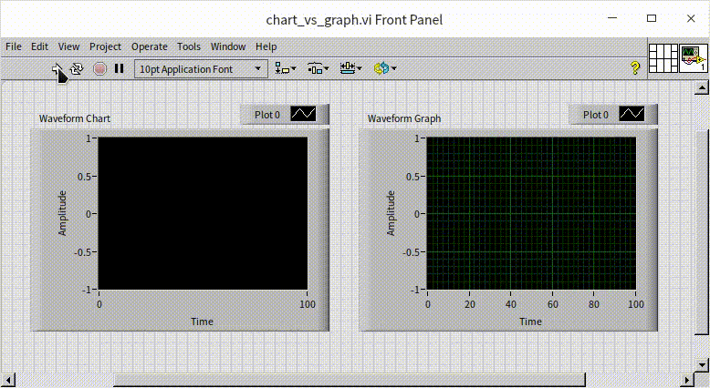

If you run the VI again, the Waveform Chart will append the new data to the old data. To start fresh each time, you can clear its historical buffer programmatically using a **History Data** Property Node. Create the Property Node, change its access mode to Write, and wire an empty array to it:

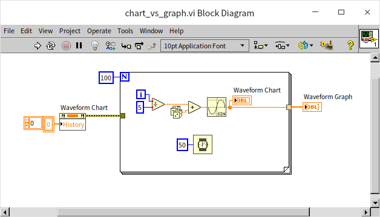

This property node allows you to clear history at the start of a run or load initial calibration data.

Waveform charts and graphs are highly polymorphic, accepting multiple data formats and adapting their behaviors automatically. For example, you can also pass a full array directly to a Waveform Chart. If you modify the previous program to wire the array output to both controls outside the loop, they will behave identically:

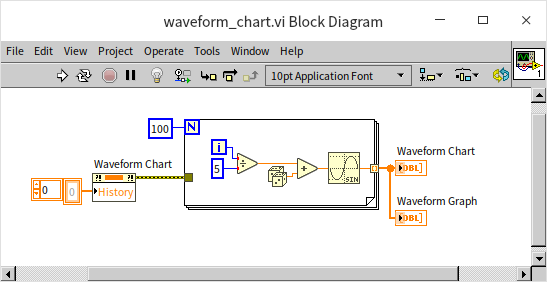

### Displaying Multiple Waveform Curves

To plot multiple curves simultaneously, you can pass a 2D array to these controls. However, charts and graphs interpret 2D arrays differently:

- **Waveform Graph**: Each **row** represents a separate curve (plot), and each **column** represents a data point along that plot.
- **Waveform Chart**: Each **column** represents a separate curve, and each **row** represents a single point in time across all curves.

The example below shows both controls displaying the same curves, but the chart's input is the transpose of the graph's input:

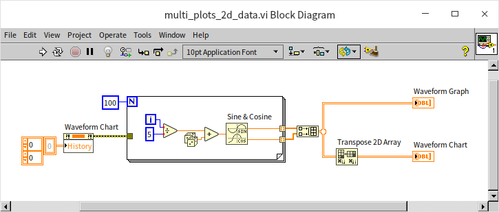

This difference aligns with their primary use cases: a graph displays pre-collected batches of signal traces, whereas a chart plots multiple channels progressively in real-time.

If your 2D array plots incorrectly, you can use the **Transpose 2D Array** function (under **Programming -> Array**) to swap the rows and columns before feeding the display control.

You can also use clusters to bundle multiple curves. For **Waveform Graphs**, each element in the cluster represents a separate curve. For **Waveform Charts**, each cluster represents a single multi-channel data point:

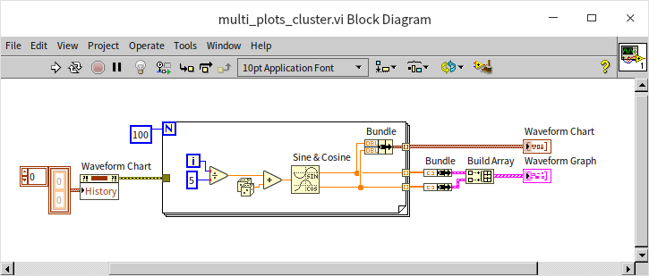

Waveform charts support two plot display modes:
- **Overlay Plots** (default): Superimposes all curves on a single plot area with a shared coordinate system.
- **Stack Plots**: Divides the chart into separate vertical sub-plots, one for each curve. This is useful when curves have widely different scales or offsets:

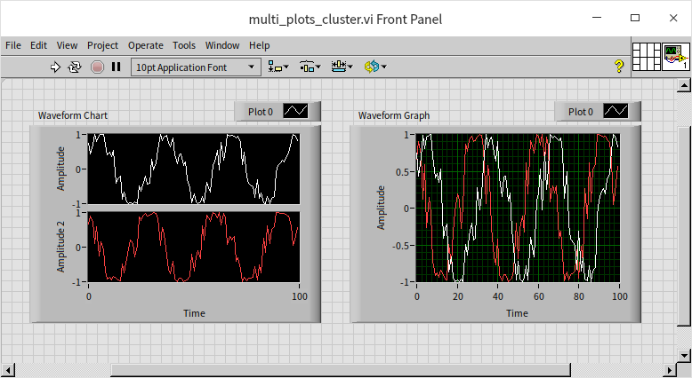

If curves have vastly different amplitudes, overlaying them can make the smaller signal look flat and illegible:

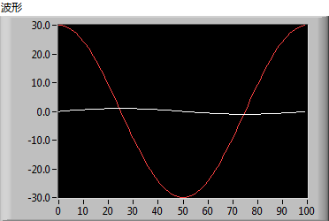

Stacking them resolves this issue. While Waveform Graphs do not have a built-in stack mode, you can achieve a similar effect in both charts and graphs by adding multiple Y-axes (scales) to a single overlay plot.

Right-click the Y-axis and select **Duplicate Scale** to create a secondary axis. You can then configure each plot to use a different axis through the graph properties or the plot legend context menu, letting you overlay signals with different scales cleanly:

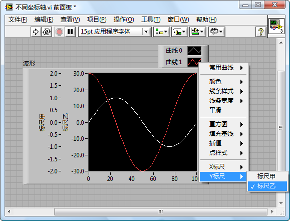

## Waveform Data Type

While arrays of numbers carry the y-values of a signal, they do not carry information about the starting time ($t_0$) or the sampling rate ($dt$). To associate a curve with actual time, LabVIEW uses the **Waveform** data type, which is a specialized cluster containing:

- **t0** (Timestamp): The start time of the signal.
- **dt** (Double): The time interval (seconds) between data points.
- **Y** (Array): The amplitude values.
- **attributes** (Variant): Metadata such as channel name or measurement units.

Waveform functions are located under **Programming -> Waveform** on the Functions palette. The program below builds a waveform using the current system time as $t_0$ and a sampling interval of 0.1 seconds:

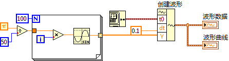

To display absolute timestamps on the X-axis of a Waveform Graph, configure the X-axis format. Right-click the X-axis, select **Format**, and choose **Absolute Time** (or define a custom format string in Advanced mode):

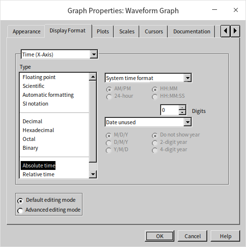

By default, the waveform graph ignores the timestamp of the waveform data and starts the plot at `0`. To use the actual timestamp, right-click the graph and uncheck **Ignore Waveform Timestamp on X-Axes**:

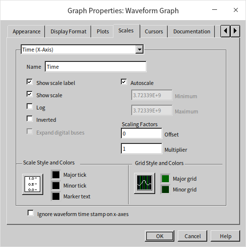

The graph now displays the absolute system time on the X-axis:

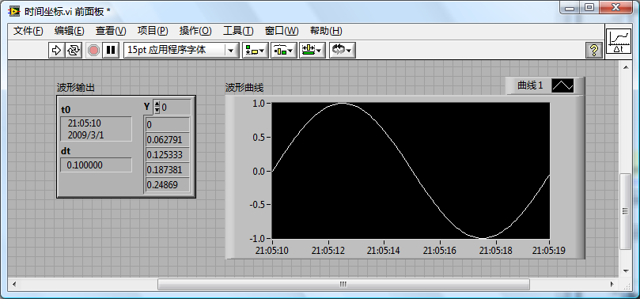

You can attach custom metadata using **Get Waveform Attribute** and **Set Waveform Attribute**. For instance, setting the `"NI_ChannelName"` attribute automatically updates the channel label in the graph legend:

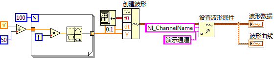

Resulting in:

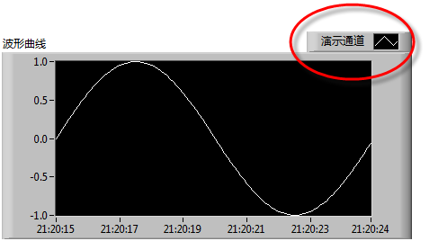

Both Waveform Charts and Waveform Graphs accept the Waveform data type directly, ensuring consistent rendering:

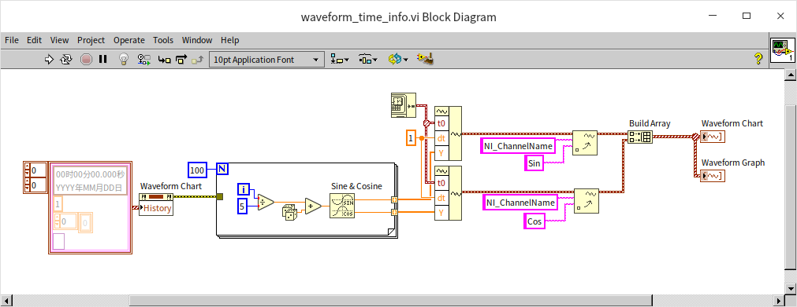

With these outputs:

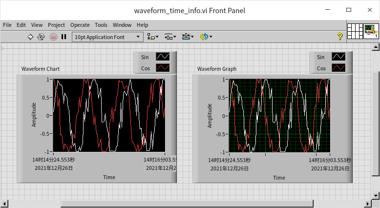

## XY Graph

The Waveform Graph works because its data points are ordered and evenly spaced in time ($dt$). However, if your data points are not evenly spaced, or if the X-axis values represent an independent variable other than time, you must supply an array of X-axis coordinates alongside the Y-axis values. The **XY Graph** control handles this type of data.

XY Graphs are ideal for plotting mathematical functions, parametric curves, or checking the correlation between two variables.

### Displaying the Relationship Between Two Signal Channels

Here, we plot two sine waves with a 90-degree phase difference as X and Y inputs on an XY Graph:

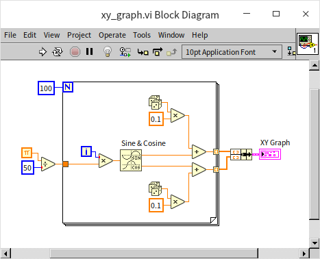

Without noise, this creates a perfect circle. With random noise introduced, the XY Graph plots a noisy circle:

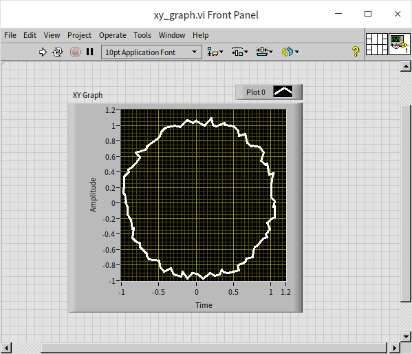

You can also use XY Graphs to plot **Lissajous curves** (figures generated by perpendicular sinusoidal signals). This program generates a Lissajous curve using 3 Hz and 4 Hz signals:

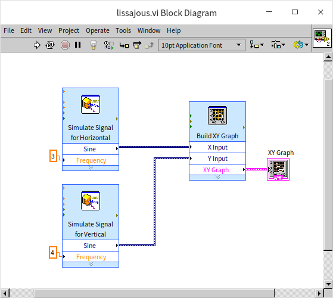

Resulting in:

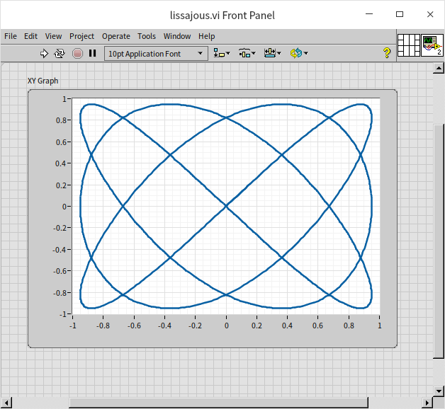

### Data Analysis

Consider a CSV dataset (`weight_height.csv`) containing height and weight information for 10,000 individuals. To plot this relationship, we read the data, split it by gender, and output the heights as the X input and weights as the Y input on an XY Graph:

- **Read Delimited Spreadsheet** reads the CSV file into a 2D array. (For details on file I/O, see [File Reading and Writing](pattern_file)).
- We split the data into 1D arrays: male height, male weight, female height, and female weight.
- We package these as two separate plots on the XY Graph.

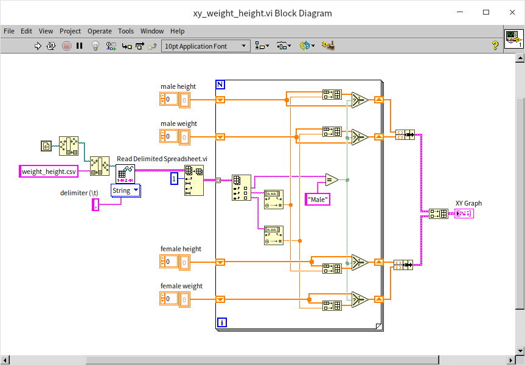

Since each data point represents an individual, we configure the plot settings to display discrete dots instead of a connected line:

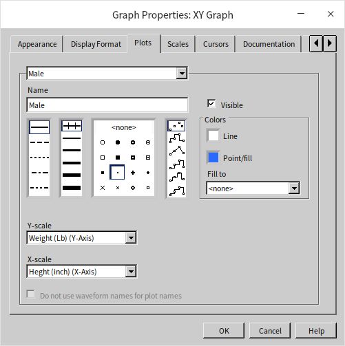

The resulting graph displays males in blue and females in red:

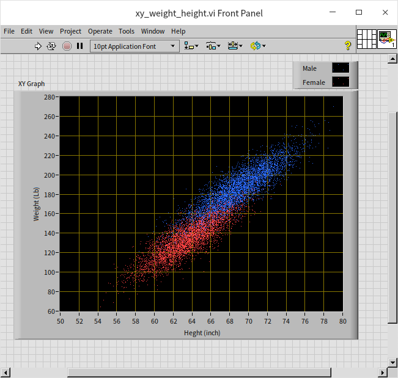

The plot shows a clear positive correlation between height and weight.

We can also process the data into histograms to see height and weight distributions:

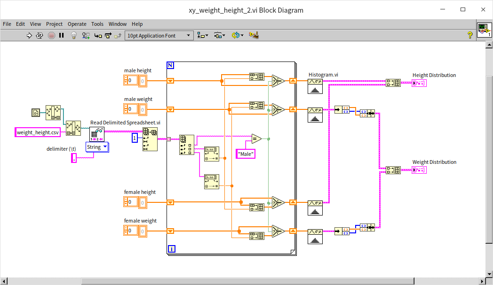

Rendered as curves:

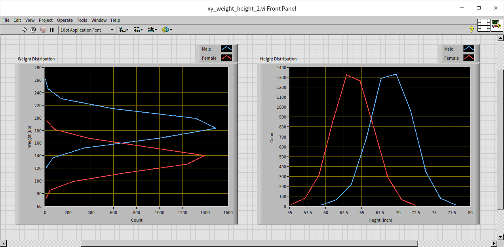

The peaks reveal the most common height and weight ranges for each gender.

## Intensity Graph

While an XY Graph shows 2D relationships, an **Intensity Graph** adds a third dimension ($Z$). It plots a grid of $X$ and $Y$ coordinates, using pixel colors to represent the magnitude of the $Z$ value at each coordinate.

By default, the Intensity Graph color ramp spans `0` to `100`. If your data range is different (e.g., fractional values between `0.0` and `1.0`), the graph may display as a solid color. Right-click the color scale and select **Autoscale Z**, or manually adjust the Z-scale range markers.

### Time-Frequency Joint Spectrum Analysis

In signal processing, we often want to see how frequency energy changes over time. An Intensity Graph is perfect for this: the X-axis represents time, the Y-axis represents frequency, and pixel colors represent signal power.

The program below reads a sound file, splits it into 200 ms segments, calculates the Fast Fourier Transform (FFT) for each segment, and builds a spectrogram:

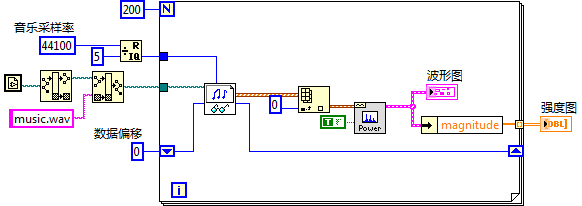

- **Sound File Read Simple.vi** reads the audio data.
- **FFT Power Spectrum and PSD.vi** calculates the power spectrum in the frequency domain.
- We choose a 200 ms time slice to balance time and frequency resolution.

The resulting spectrogram of a piano piece clearly isolates individual notes over time:

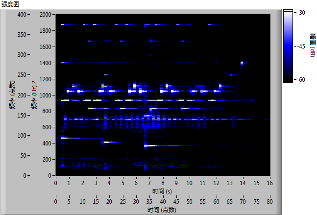

### Joint Distribution Map

To visualize the joint probability distribution of our height and weight dataset, we count the number of individuals within specific height and weight bins, generating a `200 * 200` intensity grid:

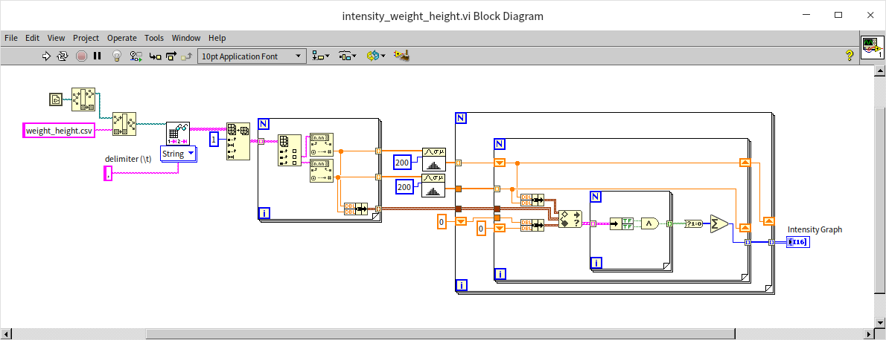

Plotting this grid on an Intensity Graph highlights the most common height-weight combinations:

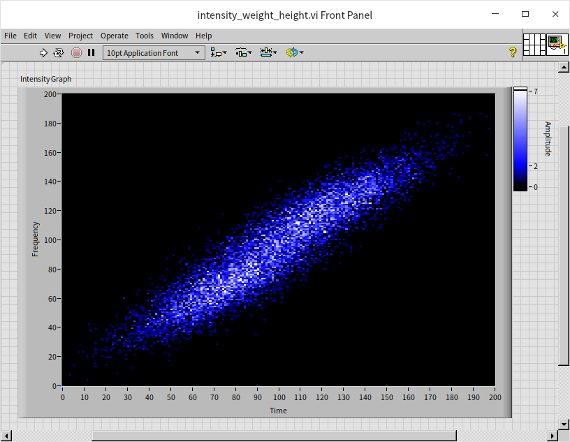

The two bright peaks represent the modes for the male and female groups.

### Image Display

A digital image is fundamentally an intensity graph. A grayscale image is a single 2D intensity grid, while a color image consists of three overlayed grids (Red, Green, and Blue).

We can write a VI to load a color image, unpack its 1D array of pixel data into a 2D RGB array, and display the R, G, and B color channels on three separate Intensity Graphs:

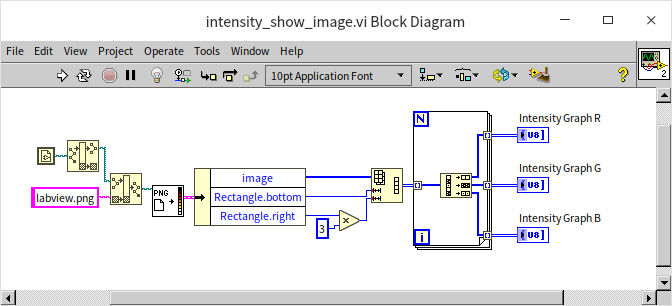

Which outputs:

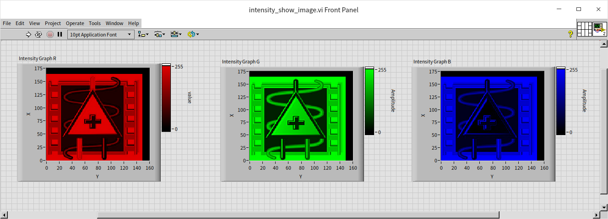

Note: standard image files define the origin `(0,0)` at the top-left, whereas Cartesian grids in LabVIEW default to the bottom-left. Because we did not transpose the coordinates in this basic program, the intensity plots appear rotated 90 degrees compared to the original image:

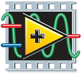

## 3D Graph Controls

To visualize complex 3D data without collapsing dimensions into colors, LabVIEW provides native **3D Graph** controls. These allow users to rotate, pan, and zoom plots in 3D space.

When you place a 3D Graph control, LabVIEW automatically adds a helper VI (e.g., `3D Curve Helper`) to the Block Diagram to format the inputs.

### 3D Point Graph

We can plot our height and weight dataset in 3D by representing gender as the Z-axis coordinate (e.g., `0.1` for females, `0.2` for males):

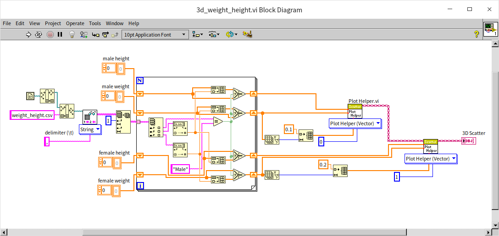

Executing this lets you rotate the view to inspect how the genders segregate in height-weight space:

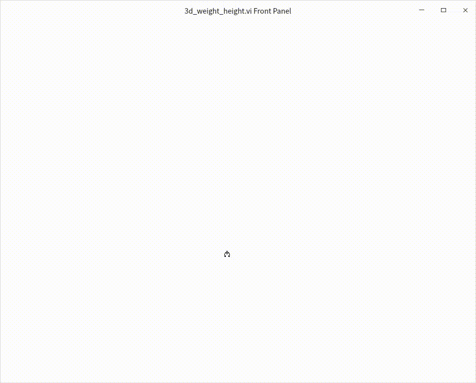

### 3D Curve

A 3D Curve connects consecutive points with line segments. This is ideal for plotting trajectories, such as a 3D Lissajous curve generated by perpendicular signals of 2 Hz, 3 Hz, and 4 Hz:

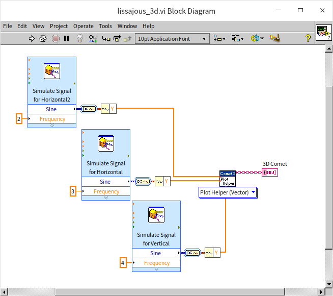

Resulting in:

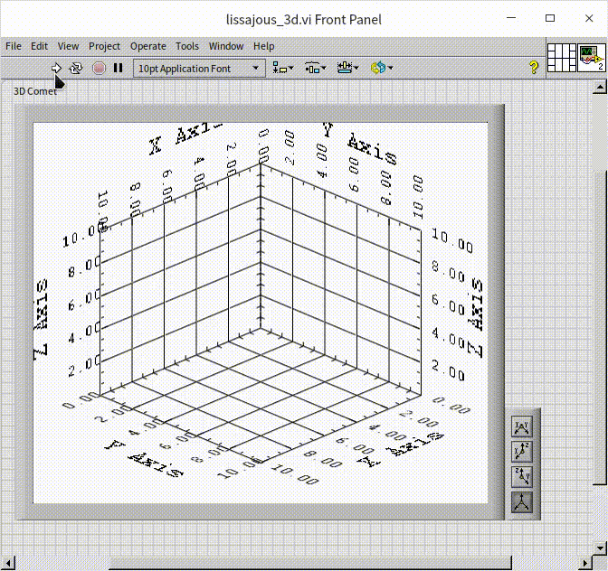

### 3D Surface

We can also plot mathematical equations as 3D surfaces. The program below plots a parametric mathematical formula that generates a 3D flower:

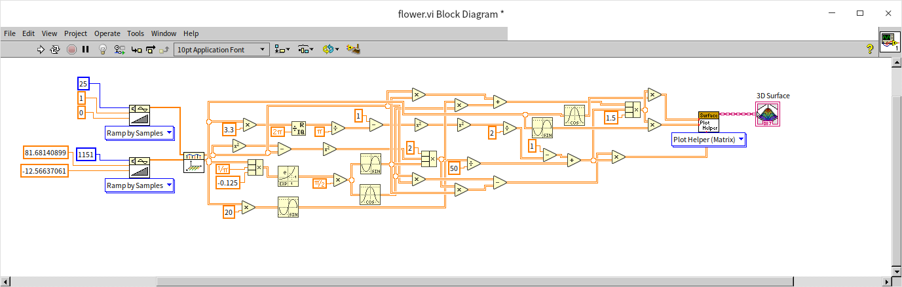

The default wireframe rendering looks mechanical:

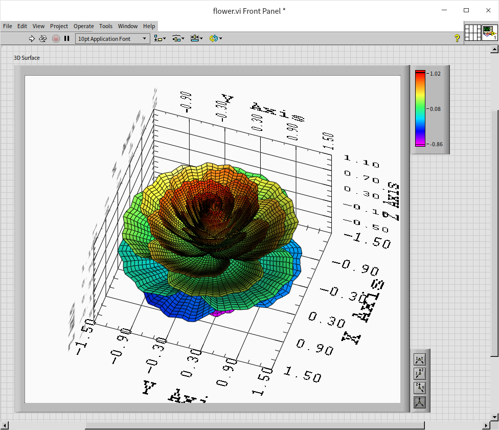

By right-clicking the 3D Graph, opening its properties, hiding the coordinate axes, and adjusting lighting and color maps:

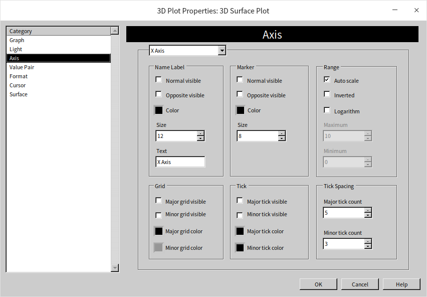

We get a much more organic-looking 3D render:

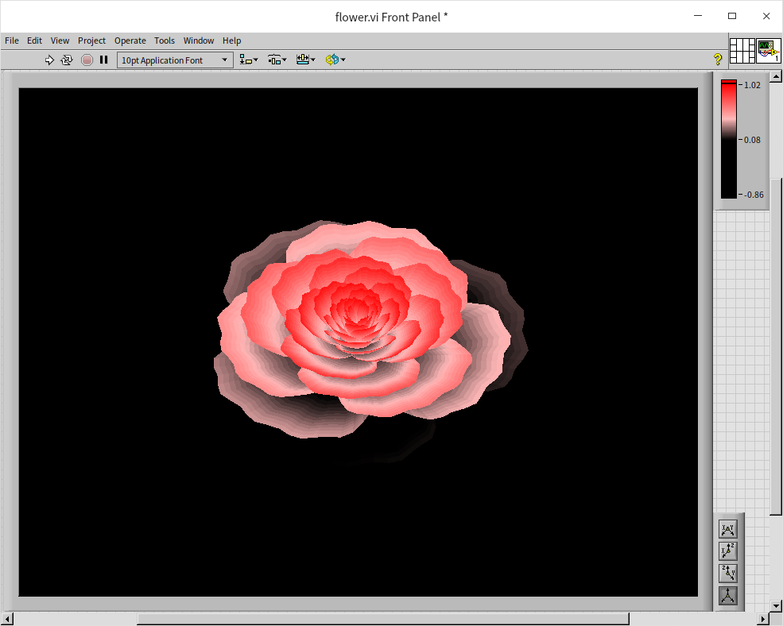

## Practice Exercises

- **Square Wave Generator**: Write a VI that generates square wave data and plots it on a Waveform Graph. Create Front Panel controls to dynamically adjust the frequency, amplitude, and duty cycle.
- **Lissajous Explorer**: Build a VI using an XY Graph to plot a Lissajous curve. Use two sine wave generators for the X and Y inputs. Add controls to the Front Panel to independently adjust the frequency and phase of the signals at runtime, observing the Lissajous pattern change in real-time.
