# Numeric and Boolean

## Numeric

### Controls

The first section you will typically encounter on the LabVIEW Controls palette is dedicated to numeric controls:

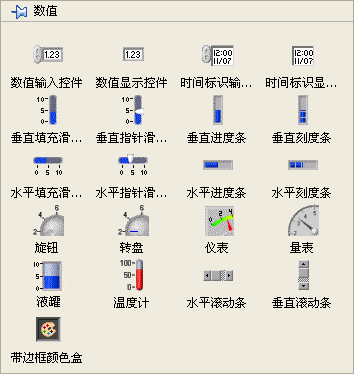

Despite their varying appearances on the Front Panel, the controls on this palette all represent numeric data. The two controls in the upper right are designed for 'time', which is ultimately stored as numeric data. Other controls located in different palettes, such as drop-down lists and list boxes, also handle numeric data types.

The top two controls are the most frequently used numeric controls. They are simple in design: the first is a control (input) and the second is an indicator (output). Controls are identifiable by their lighter background and include increment/decrement buttons—which are helpful for touchscreens but less critical for keyboard and mouse setups. Beyond these basic options, LabVIEW offers specialized numeric controls for different applications. For example, a Tank control can represent oil levels in a factory, while a Gauge control can simulate a car dashboard speedometer.

LabVIEW numeric controls offer diverse settings and display options, many of which are accessible via the right-click shortcut menu. These include configuring the data representation (base) and display units:

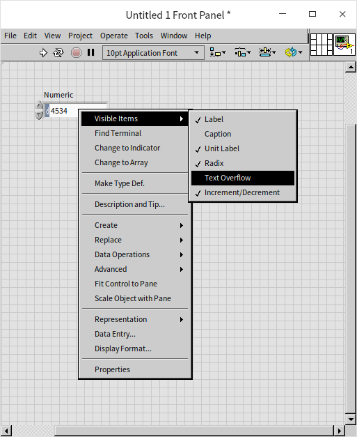

For more advanced customization, you can open the control's Properties dialog box by right-clicking it and selecting **Properties**:

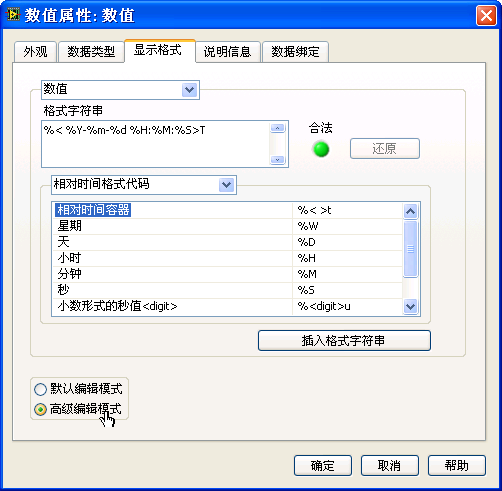

Here, you can adjust the control's appearance, size, data range, and more. The options are largely self-explanatory. For example, setting a data range prevents out-of-bounds inputs during runtime, while choosing a specific display format makes data easier to read.

The **Display Format** page offers multiple formatting options, including decimal, scientific, and engineering notation. For integers, you can select different radixes (bases) such as binary, octal, or hexadecimal. When dealing with time values, raw numbers can be unintuitive. Formatting the control to display dates and times in a standard format (e.g., Year-Month-Day Hour:Minute:Second) makes it much more user-friendly.

Configuring custom time formats can be slightly intricate. First, set the Type to **Absolute Time** (or **Relative Time**) on the Display Format page, and then check **Advanced editing mode** to define a custom format. For example, entering `%<%Y-%m-%d %H:%M:%S>T` in the **Format string** field formats a raw numeric value into the readable date string: 'YYYY-MM-DD HH:MM:SS'.

Here is how the value `0.0` appears when formatted as absolute time:

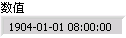

In LabVIEW, a real number representing absolute time indicates the number of seconds elapsed since 12:00 AM on January 1, 1904, Greenwich Mean Time (GMT). For instance, on a computer set to Beijing Time (GMT+8), `0.0` displays as `1904-01-01 08:00:00`.

### Constant

In LabVIEW, numeric constants adapt dynamically to their input values. If you right-click a numeric constant, you will see that **Match to input data** is checked by default. This setting allows the constant to automatically select the most appropriate representation based on what you type.

For example, typing the positive integer `34` sets the constant to a 32-bit signed integer (I32), color-coded blue . Typing a decimal value like `34.3` automatically changes it to a double-precision floating-point number (DBL), color-coded orange 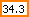. If you want to input `34` as a floating-point number, you must explicitly type `34.0`.

This auto-matching behavior is exclusive to constants. Front Panel numeric controls do not auto-match; you must manually configure their representation to suit your requirements.

### Representations {#representations}

LabVIEW offers multiple numeric representations to accommodate different ranges and precision requirements. Although types like I32 and U8 are technically different representations of the 'numeric' data type in LabVIEW, they are analogous to distinct primitive data types in text-based languages.

You can view or change the representation of a Front Panel numeric control or a Block Diagram numeric constant by right-clicking it and selecting **Representation**:

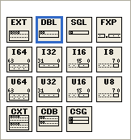

The LabVIEW Help topic 'Numeric Data Types' provides detailed specifications for each option. In binary systems, 8 bits make up 1 byte. Different representations allocate different numbers of bytes, as summarized in the table below:

| Representation | Description                             | Bytes |
|----------------|-----------------------------------------|-------|
| EXT            | Extended Precision Real                 | Platform Dependent (Often 10, 12, or 16) |
| DBL            | Double Precision Real Number            | 8     |
| SGL            | Single Precision Real Number            | 4     |
| FXP            | Fixed Point Number                      | Max 8 |
| I64            | Signed 64-bit Integer                   | 8     |
| I32            | Signed 32-bit Integer                   | 4     |
| I16            | Signed 16-bit Integer                   | 2     |
| I8             | Signed 8-bit Integer                    | 1     |
| U64            | Unsigned 64-bit Integer                 | 8     |
| U32            | Unsigned 32-bit Integer                 | 4     |
| U16            | Unsigned 16-bit Integer                 | 2     |
| U8             | Unsigned 8-bit Integer                  | 1     |
| CXT            | Extended Precision Complex Number       | 2×16  |
| CDB            | Double Precision Complex Number         | 2×8   |
| CSG            | Single Precision Complex Number         | 2×4   |

Use this table as a quick reference when choosing the appropriate representation for your application's requirements.

The exact byte size of the Extended Precision (EXT) type depends on your operating system and CPU architecture. On macOS and Linux, it typically occupies 16 bytes. On Windows, it is often an 80-bit float padded to 10 or 12 bytes, or defaults to 8 bytes on 64-bit systems.

Always choose a representation that comfortably fits your expected data range. For example, a 16-bit signed integer (I16) supports values from -32,768 to 32,767. If you perform a basic operation like `300 * 300`, the result (`90,000`) exceeds the I16 limit. If you multiply two I16 constants with values of 300 and output the result to an I16 indicator, you will experience an overflow, resulting in incorrect data (specifically, `-24,464`). Such errors can be hard to track down in larger applications.

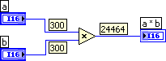

While a 64-bit signed integer (I64) can represent numbers up to approximately $9 \times 10^{18}$, even it can only calculate factorials up to 20! before overflowing. When you need a broader range or must handle fractional numbers, use floating-point (real) representations instead.

To optimize performance and memory usage, consider these guidelines when choosing numeric representations:

- **Operational Efficiency:** Floating-point operations can be slower than integer operations. If your data naturally consists of integers (like iteration counts, list lengths, or status flags) and will not exceed integer limits, use integer types rather than floating-point numbers.
- **Complex Numbers:** A complex number consists of two floating-point values representing the real and imaginary parts. Operations on complex numbers are slower than those on scalars, so use them only when your computational logic explicitly requires complex numbers.
- **Memory Footprint:** While the difference between U16 (2 bytes) and U32 (4 bytes) is negligible for a single variable, it compounds significantly in large datasets. For an array of 1,000 elements, the difference is only 2 KB. However, for 1 billion elements, the difference escalates to 2 GB, which can severely impact performance and memory availability.

In summary, larger data types provide a wider range and higher precision at the cost of increased memory usage and potentially slower computations. Always balance the precision requirements of your application against efficiency and memory constraints.


### Representation Conversion {#representations-conversion}

Converting between numeric representations in LabVIEW is straightforward and often happens automatically. When you wire a value of one representation to a terminal of a different representation, LabVIEW performs an implicit conversion. For functions like Add, which can accept different numeric types, LabVIEW automatically coerces the smaller-range data type to match the larger-range input. The output then adopts the larger representation. To indicate an implicit conversion, LabVIEW displays a red dot, known as a **coercion dot**, at the input terminal:

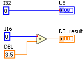

While coercion dots on simple scalar values are usually harmless, coercion on large arrays forces LabVIEW to duplicate the entire array in memory, which can severely degrade performance.

A common recommendation is to eliminate all coercion dots. However, simply inserting an explicit conversion function (found under **Programming -> Numeric -> Conversion**) right before the terminal does not save memory; the compiler performs the exact same buffer allocation. Use explicit conversion nodes only when you need to deliberately change data types midway through a calculation. To truly optimize your code, match the data representations at their source—by updating the representation of your numeric constants or Front Panel controls directly.

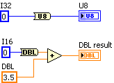


### Special Numbers

In LabVIEW, operations that exceed a data type's range or involve undefined math operations produce specific results. Here is how LabVIEW handles these scenarios:

- **Integer Overflow:** When an integer operation exceeds the limits of its data type, LabVIEW does not report an error. Instead, the value silently wraps around (e.g., in a U8, `255 + 1` becomes `0`), leading to incorrect results. You must design your program to handle potential overflows.
- **Floating-Point Overflow:** A double-precision float (DBL) can represent values up to approximately $1.7 \times 10^{308}$. Exceeding this range does not throw an error; instead, LabVIEW represents the value as `Inf` (positive infinity) or `-Inf` (negative infinity).
- **Division by Zero:** Unlike languages that throw a division-by-zero exception, LabVIEW outputs `Inf` for $1 \div 0$. However, $0 \div 0$ is mathematically undefined and results in `NaN` (Not a Number).
- **NaN (Not a Number):** LabVIEW outputs `NaN` for undefined operations, such as dividing infinity by infinity, adding `Inf` to `-Inf`, taking the square root of a negative real number, or performing any operation where an input is already `NaN`.

In the complex number domain, operations that are undefined for real numbers yield valid results. For example, the square root of `-1` is valid and theoretically equals $i$ (the imaginary unit). However, due to floating-point precision limits, the calculated result in LabVIEW may include a tiny, non-zero real part (e.g., $1.11 \times 10^{-16}$). This demonstrates the precision limits inherent in floating-point representations.

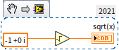

These examples highlight why you should exercise caution when comparing floating-point numbers for equality. Even operations that mathematically should yield exact results often carry tiny rounding errors due to binary floating-point representation.

Understanding how LabVIEW handles overflows, division by zero, and floating-point precision is essential for writing robust code that handles numerical edge cases reliably.


### Fundamental Functions

The primary functions for numeric manipulation are located under **Programming -> Numeric** on the Functions palette:

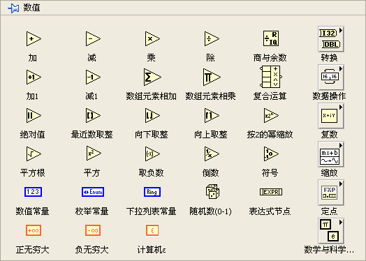

These nodes are intuitive, representing common operations like addition, subtraction, rounding, and reciprocals. For advanced math operations, refer to the **Mathematics** palette. Detailed function references are available in the LabVIEW Help and are not repeated here.

If you cannot find a specific function, use the search feature. Click the **Search** button (magnifying glass icon) at the top of the palette window:

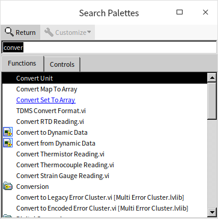

Type keywords into the search bar, then drag the desired result directly onto the Block Diagram or Front Panel. Double-clicking a search result highlights its location in the palette for future reference.

:::tip

Many basic math nodes are small, and their inputs (such as for the Subtract node) are close together. If you wire inputs to the wrong terminals, you can swap them quickly without deleting the wires: hover your cursor over one of the input terminals, hold **Ctrl**, and click. The cursor changes to a swap icon (scissors), and clicking swaps the two input wires. This shortcut works for any node with two inputs.

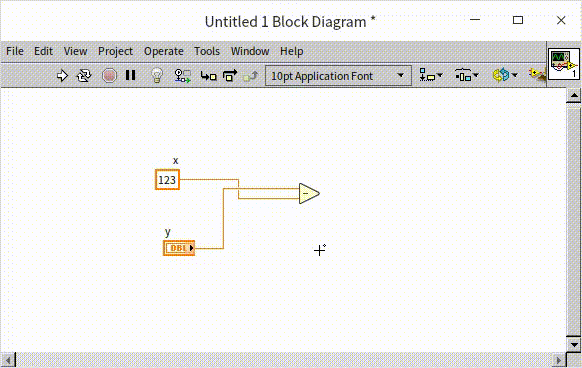

:::

### Expression Node

For simple arithmetic, basic math nodes are adequate. However, complex mathematical formulas can require dozens of nodes, leading to cluttered, crisscrossing wires that make the code difficult to read and maintain. In these scenarios, text-based programming approaches like the **Expression Node** are preferred.

Expression Nodes are best suited for calculations with a single input and a single output.

Consider converting Fahrenheit to Celsius. While easily implemented with basic arithmetic nodes, a graphical representation of the formula is harder to read at a glance than the familiar algebraic formula. This is a limitation of graphical languages when representing pure math. Text-based expressions align naturally with standard mathematical notation. In LabVIEW, an Expression Node lets you type the equation directly, keeping the logic clear and intuitive (as shown in the lower half of the figure below):

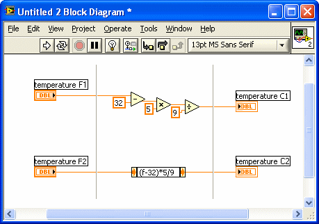

Additionally, Expression Nodes consume far less Block Diagram space than equivalent clusters of math nodes.

Because an Expression Node only supports one input variable, it is perfect for single-variable equations. You do not need to declare variables; LabVIEW automatically detects the variable from the text. In the example above, typing `(f - 32) / 1.8` establishes `f` as the input. You could name this variable `x`, `temp`, or anything else, as long as it is the only variable name in the formula.

The LabVIEW Help documents the operators and functions supported inside Expression Nodes. Both Expression Nodes and Formula Nodes (discussed next) use a syntax derived from the C language. If you have some C experience, these nodes will feel natural: `+`, `-`, `*`, and `/` represent basic arithmetic, `**` denotes exponentiation, and functions like `sqrt()` calculate square roots.

### Formula Express VI

For calculations that require multiple inputs, the **Formula Express VI** is a convenient tool:

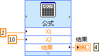

The design and applications of [Express VIs](measurement_express_vi) are covered in later chapters. For now, here is a brief overview: you can find the Formula Express VI under **Mathematics -> Scripts & Formulas** on the Functions palette. Dragging it onto the Block Diagram opens a configuration dialog that resembles a scientific calculator, making it easy to build equations without writing code:

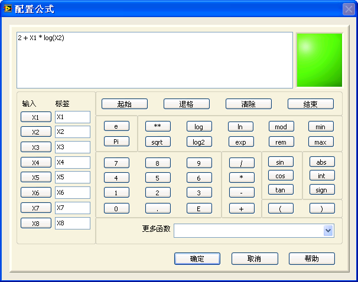

The Formula Express VI supports up to eight inputs and produces a single output. A key drawback is that the formula is hidden inside the configuration dialog rather than displayed on the Block Diagram. To view or edit the equation, you must double-click the node to reopen its configuration panel, which can slow down code reviews.

### Formula Node {#formula-node}

For Multiple-Input-Multiple-Output (MIMO) systems or complex equations, the **Formula Node** is the ideal choice. It is located under **Programming -> Structures** on the Functions palette:

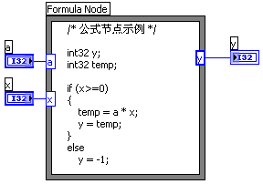

The Formula Node is an advanced, multi-input/multi-output version of the Expression Node. Its syntax is based on C, acting as a subset of C for mathematical operations. If you are familiar with C, you will find Formula Nodes highly intuitive. Even without C experience, learning its basic syntax is highly recommended for implementing complex formulas.

Inputs and outputs defined on the borders of the Formula Node do not need declaration statements inside the code (e.g., the input variables `a` and `x` and output `y` in the example). However, any internal helper variables used solely within the node (like `temp`) must be declared beforehand using standard C syntax (e.g., `float temp;` or `int32 temp;`).

When placed, a Formula Node appears as a blank rectangle with a gray border. You write your code directly inside. To pass data in or out, right-click the border and select **Add Input** or **Add Output**. These terminals appear as small text boxes along the border (typically inputs on the left, outputs on the right), where you type the exact variable names used in your text code.

Textual representations are often much easier to follow when writing algorithms, as they match standard mathematical notation. Furthermore, text code displays sequential flow control and branches (like `if-else` blocks) all at once. In contrast, LabVIEW Case Structures only show one sub-diagram (case) at a time, forcing you to click through them manually, which hampers readability.

Using Formula Nodes for complex calculations can significantly clean up your Block Diagrams and improve code maintainability.

The image below shows a subVI from a chess game designed to calculate a piece's legal moves. Although it performs basic indexing on a 2D array, the code becomes highly complex and hard to read due to nested loops and nested Case structures. (The actual chess logic is not important; it is shown merely to illustrate graphical complexity).

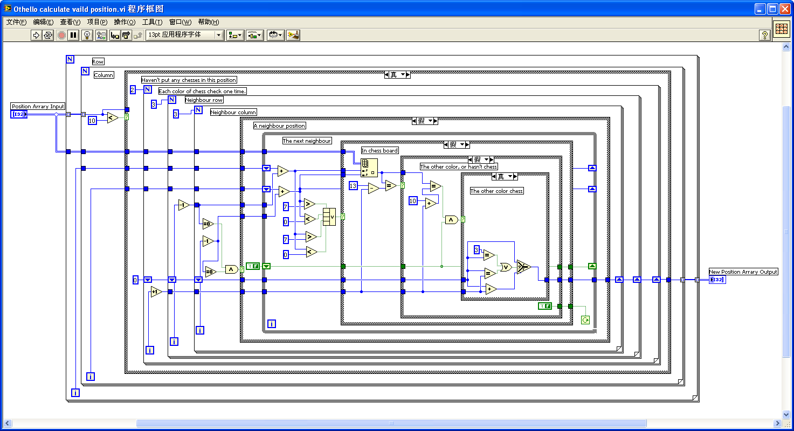

Here is the same subVI refactored with a Formula Node. For programmers with basic familiarity with both C and LabVIEW, this version is vastly easier to read, as the nested logic is consolidated into a clean, text-based block.

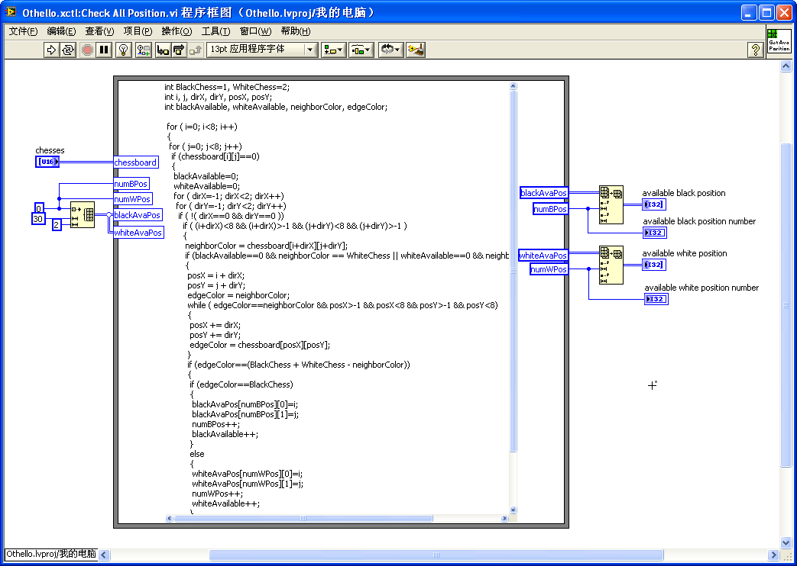

However, Formula Nodes have some limitations. For developers with no text-based coding experience, learning the syntax introduces an extra learning curve.

Additionally, you cannot place execution breakpoints or probe data flow inside a Formula Node. To ensure complex code is correct, you might want to write and debug the logic in an external C environment first, then copy the verified code into the Formula Node.

### Units

In engineering and scientific applications, LabVIEW stands out for its native support of physical units (dimensions) alongside raw numeric values. You can assign units to numeric controls, indicators, and constants. To add a unit, right-click the control and select **Visible Items -> Unit Label**, then enter the standard abbreviation (e.g., `m` for meters, `s` for seconds). If you do not know the abbreviation, type any character, right-click the unit label, and select **Build Unit String** to search through all supported units.

LabVIEW automatically handles unit conversions. For example, to calculate the number of days in two years, you can wire them together directly, and LabVIEW converts the units automatically:

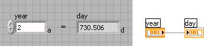

Just as LabVIEW prevents wiring mismatched data types (such as an integer to a string), it also enforces strict unit consistency. It prevents you from wiring incompatible physical quantities—for instance, you cannot wire a length value (meters) to a time indicator (seconds).

Wiring incompatible units results in a broken wire, preventing common dimensional analysis errors at edit time:

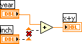

For calculations between physical quantities and unitless numbers, some operations are allowed while others are blocked. For example, multiplying a diameter of 2 meters by the unitless constant $\pi$ (`2m * \pi`) to find the circumference is valid. However, adding a unitless number to a value with a unit (e.g., `2m + 3`) is physically meaningless and results in a broken wire:

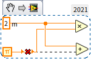

While strict unit checking prevents errors, it can limit code reuse. For instance, a subVI designed to add two time values cannot be reused to add two length values. To solve this, LabVIEW supports **unit wildcards**.

Unit wildcards let you write generic subVIs that adapt to whatever unit is wired to them. Represented as `$1` through `$9`, wildcards act as placeholders. For example, in a generic addition subVI, you can assign the unit `$1` to both inputs and the output. If you wire meters to it, the output becomes meters; if you wire seconds, the output becomes seconds.

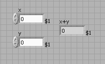

However, many built-in LabVIEW VIs and functions do not support unit wildcards. Wiring unit-carrying data directly to them causes errors. The standard workaround is to strip the units before calling the function, perform the operation, and then re-apply the units to the output.

The **Convert Unit** function (located under **Programming -> Numeric -> Conversion**) handles this task. It can strip units from a quantity or append units to a raw number. For example, to generate a random length between 1 and 2 meters, you can use the built-in `Random Number (Range).vi`. Since this VI does not support unit-carrying inputs, you must strip the units beforehand and re-apply them afterwards:

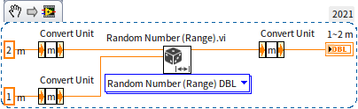

For converting between different units (e.g., inches to meters), use the **Cast Unit Bases** function on the same palette. Note that the **Convert Unit** node looks identical to an **Expression Node**. Although they look the same and share similar right-click menus, their operations are completely different. The two setups below look similar but yield entirely different results:

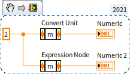

## Boolean

### Conversion Between Boolean and Numeric

Booleans represent binary states: `True` or `False`. While a single bit is sufficient to represent a Boolean value, modern CPUs process data in bytes. Consequently, LabVIEW stores Booleans as 8-bit bytes, where `0` represents `False` and any non-zero value represents `True`. The following code demonstrates conversion between numeric and Boolean types:

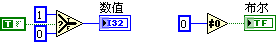

Numeric comparisons yield Boolean results (e.g., checking if $2 > 1$ returns `True`). However, you must take care when comparing floating-point numbers for equality or handling special values.

Floating-point comparisons must account for rounding errors. Because computers represent real numbers with limited precision, small rounding errors occur. Two floating-point numbers should be considered equal only if their difference falls within a small acceptable range (epsilon). This tolerance varies depending on your application. For example, checking if the real part of $\sqrt{-1}$ is exactly `0` might return `False` on one computer and `True` on another due to processor and compiler variations. To ensure consistent results, check if the absolute difference is less than an acceptable threshold:

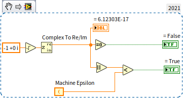

Is the expression `x == x + 100` always false? Mathematically, yes, but not in programming if `x` is infinity. In LabVIEW, `Inf` is equal to `Inf`. Any arithmetic operation on infinity (like `Inf + 100`) simply returns `Inf`:

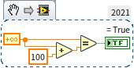

Conversely, `NaN` (Not a Number) is unequal to everything, including itself (e.g., `NaN == NaN` returns `False`). To check if a value is `NaN`, you must use the **Not A Number/Path/Refnum?** function:

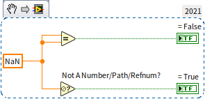


### Boolean Controls {#boolean-controls}

LabVIEW offers Boolean controls in many visual styles, including toggle switches, pushbuttons, and LEDs:

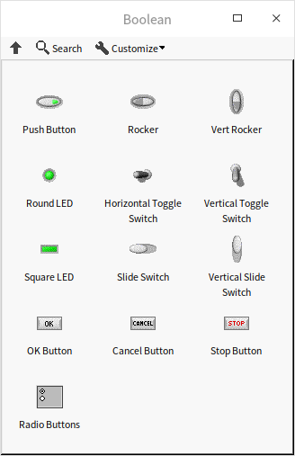

These controls mimic both the appearance and physical behaviors of real-world hardware. By right-clicking a Boolean control and selecting **Mechanical Action**, you can configure how it responds to clicks. LabVIEW provides six mechanical actions, grouped into **Switch** behaviors and **Latch** behaviors:

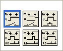

- **Switch actions** (top row: *Switch When Pressed*, *Switch When Released*, *Switch Until Released*) toggle and hold their state until clicked again, behaving like a physical light switch.
- **Latch actions** (bottom row: *Latch When Pressed*, *Latch When Released*, *Latch Until Released*) behave like momentary push buttons. They toggle their state temporarily and revert to their default value as soon as the LabVIEW Block Diagram reads the control's value.

These actions define exactly when the Boolean value toggles during a mouse click. Generally, the most intuitive settings are:
- *Switch When Pressed* (first row, first option) for toggles, which updates the value the instant the user clicks the control.
- *Latch When Released* (second row, second option) for command buttons, which emits a single `True` pulse the moment the user releases the mouse button.

Buttons are commonly used to trigger Event Structures, which we discuss in the [Event Structure](pattern_ui) section. We will cover [local variables and property nodes](data_and_controls) in later chapters. While you can typically read or write controls using local variables or the **Value** property node, LabVIEW enforces a strict rule: **you cannot read Latch-action Boolean controls via local variables or Value properties**. Attempting to do so breaks the VI run arrow. This restriction is necessary because the latching mechanism relies on a single, guaranteed read from the Front Panel terminal to safely reset the button to its default state.


## Type Casting

### Reinterpreting Memory (Type Casting)

LabVIEW provides a **Type Cast** function under **Programming -> Numeric -> Data Operations** on the Functions palette. This function reinterprets the raw binary bits of a data type in memory as another data type without modifying the bits themselves. This is equivalent to pointer type casting in C/C++.

Consider the following C++ code, which reinterprets the bits of a double-precision float as a 64-bit integer:

```cpp
double dblNumber = 13.4;
int64* intPointer = (int64*)(&dblNumber);
int64 intValue = *intPointer;
```

The equivalent block diagram in LabVIEW looks like this:

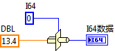

It is important to distinguish Type Casting from the representation conversions discussed earlier (such as converting a single-precision float to a double-precision float, or a number to a Boolean). Those conversions preserve the *value* or *meaning* of the data by converting its binary representation under the hood. For example, the number `13.4` can be stored as a DBL, an SGL, or converted to the [string](data_string) `'13.4'`. The binary representation in memory changes for each, but the value is preserved.

Type Casting does the opposite: it preserves the exact binary sequence in memory but changes how LabVIEW interprets it.

Consider converting `13.4` to a 64-bit integer (I64) using the standard **To 64-bit Signed Integer** function. This standard conversion truncates the value to `13`. The number `13` has an entirely different binary sequence in memory than `13.4`—only the value is preserved (as closely as possible).

In contrast, if you **Type Cast** the DBL `13.4` to an I64, the resulting integer is `4,623,733,147,430,603,981`. Both DBL and I64 occupy 8 bytes in memory. The binary sequence for `13.4` is `0100000000101010110011001100110011001100110011001100110011001101`. Interpreted as an IEEE 754 double-precision float, these bits represent `13.4`. Interpreted as a standard two's-complement 64-bit integer, those exact same bits represent `4,623,733,147,430,603,981`.

This highlights the core mechanism of type casting: the underlying memory buffer remains unchanged, but its interpretation shift yields a completely different value.

C/C++ developers should note a critical detail: **endianness**. Most modern desktop CPUs are Little-Endian. A native C++ program on Windows will store and interpret bytes in reverse order compared to LabVIEW, which universally stores and transmits data in **Big-Endian** format (network byte order). As a result, performing this exact type cast in C++ on Windows will yield a different integer unless you manually reverse the byte order.

### Applications of Type Casting

Type casting should be used carefully, as reinterpreting raw memory changes the semantic meaning of data. If you cast a temperature reading of `13.4` to a 64-bit integer, the resulting value (`4.6e18`) completely loses its real-world physical meaning.

Therefore, type casting is primarily used when transmitting raw bytes over networks, reading binary files, or interfacing with hardware APIs, where you must deserialize raw byte arrays into structured LabVIEW data types (or vice versa).

### Conversion Between Boolean and U8

Casting between Booleans and U8 (or I8) values is straightforward because both occupy a single byte in memory. The following two examples show different ways to convert between Booleans and numeric bytes. The first uses **Type Cast**:

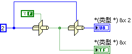

The second uses standard conversion functions:


If you expand the numeric type to a multi-byte value (such as a 16-bit integer, I16), these two approaches yield different outcomes. Standard conversions work as expected (e.g., checking if the I16 is non-zero, or using a Select node). However, type casting is risky here.

Because a Boolean occupies only 1 byte, type-casting an I16 (2 bytes) to a Boolean truncates the data, keeping only the first byte. If the highest byte of your I16 is `0`, the cast returns `False`, even if the I16's overall value is non-zero (e.g., `255`). Thus, type casting multi-byte numbers directly to Booleans is generally discouraged.

### Converting Between Time and Numerics

Although time in LabVIEW is fundamentally measured in seconds, LabVIEW provides a dedicated **Timestamp** data type for dates and times. A timestamp is stored in memory as a 128-bit structure consisting of two 64-bit integers: the first 64 bits represent the whole seconds, and the second 64 bits represent the fractional seconds.

Time in LabVIEW is divided into relative and absolute time. **Relative time** represents a duration (elapsed time) and is stored simply as the number of seconds. **Absolute time** represents a specific point in history (year, month, day, etc.) and is stored as the number of seconds elapsed since January 1, 1904, 12:00 AM Greenwich Mean Time (GMT).

For example, a relative duration of 2 minutes is represented by `120.0` seconds. An absolute time representing the opening ceremony of the 2008 Beijing Olympics (August 8, 2008, 8:00 PM Beijing time) is stored as `3301041600.0` (the number of seconds elapsed since the 1904 epoch).

You can convert between timestamps and double-precision floats using the standard conversion functions. Use **To Double Precision Float** to get the numeric seconds, and **To Timestamp**  to convert numeric seconds back into a timestamp. To convert between a timestamp and calendar components (year, month, day, hour, etc.), use the **Date/Time to Seconds** and **Seconds to Date/Time** functions. Here is an example program:

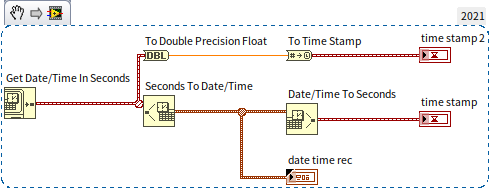

The execution results are shown below:

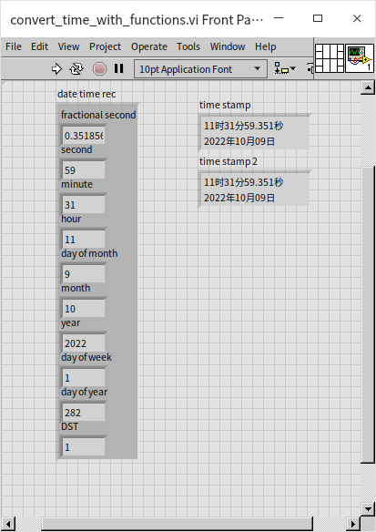

Because a timestamp is stored in memory as a 128-bit structure (64-bit integer seconds + 64-bit fractional seconds), you can use **Type Cast** to unpack its raw structure. Below, a timestamp is cast into a cluster containing two 64-bit unsigned integers (U64). The first represents the epoch seconds, and the second represents the fractional seconds:

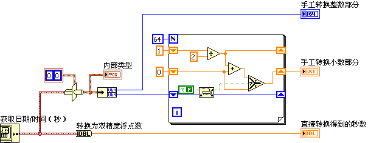

The output matches standard LabVIEW timestamp values:

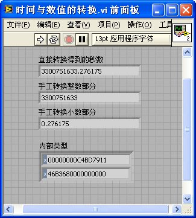

While this exercise demonstrates how LabVIEW manages timestamps under the hood, you should always prefer standard conversion functions over Type Cast in production code. Incorrect casting of complex structures can easily introduce bugs.


## Practice Exercises

- **Living Room Area Calculation**: Create a VI to calculate the area of a rectangular living room that is 22.5 feet long and 12.5 feet wide. The output should be in square meters (use LabVIEW's unit conversion features to convert square feet to square meters).
- **Target Sum VI**: Create a VI that takes four numeric inputs ($x_1$, $x_2$, $x_3$, and a target value) and a Boolean indicator named `result`. The VI should determine if any two of the inputs $x_1$, $x_2$, or $x_3$ add up to the target value.
- **Kinematics with a Formula Node**: Build a VI that calculates the final velocity ($v$) and distance traveled ($d$) of a free-falling object after an elapsed time $t$, given an initial velocity $v_0$ and the acceleration due to gravity ($g = 9.8\text{ m/s}^2$). Use a single Formula Node to execute both classical mechanics equations:
  ```c
  v = v0 + g * t;
  d = v0 * t + 0.5 * g * t ** 2;
  ```
