# String and Path

## String Data Type

In LabVIEW, strings are stored in memory as arrays of 8-bit unsigned integers (U8), which is similar to how strings are represented in C. However, they differ in how they define the string's end. A C string is null-terminated (ending with a `\0` character), whereas a LabVIEW string is length-prefixed, meaning it explicitly stores the character count and does not require a special terminator.

Because strings are stored in memory similarly to U8 arrays, converting between them is simple and efficient. When a U8 array is converted to a string, each element is interpreted as the ASCII code of a character. Similarly, displaying a string in hexadecimal mode exposes these ASCII codes directly. LabVIEW provides built-in functions for these conversions: **String To Byte Array**  and **Byte Array To String**. Because these dedicated functions exist, you do not need to use Type Cast. The two methods shown below produce the exact same outcome in memory:

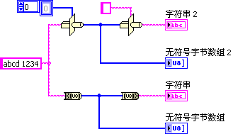

:::caution

As of the current version, LabVIEW does not officially support Unicode on Windows. For details on this limitation, see [LabVIEW's Unicode Limitations](appendix_problem). If you use non-ASCII characters (e.g., Chinese or accented European characters), switching operating systems (such as from a Chinese locale to a French locale, or from Windows to Linux) can cause strings to display as garbled text (mojibake).

:::

## String Control

LabVIEW string controls and indicators support several display modes beyond standard text. These include **'\' Codes Display**, **Hex Display**, and **Password Display**:

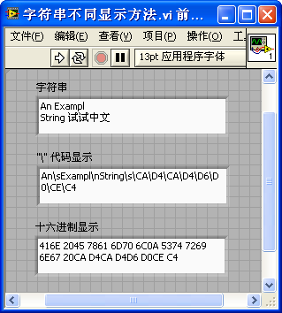

Non-printable characters (like carriage returns or line feeds) are difficult to inspect visually. In **'\' Codes Display** mode, LabVIEW represents these characters using standard backslash escape codes. This is identical to the string escaping used in C and other text-based languages. Common escape codes in LabVIEW include `\n` for a newline, `\r` for a carriage return, `\t` for a horizontal tab, `\s` for a space, and `\\` for a literal backslash.

When interfacing with instruments or reading binary files, LabVIEW often handles raw binary data using string types. If you display raw binary data as normal text, it will look like garbled symbols—similar to opening an `.exe` file in Notepad. Switching the string indicator to **Hex Display** mode allows you to inspect the raw hexadecimal values of the bytes.

**Password Display** mode masks characters with asterisks (`*`), hiding user input during entry.

A **Combo Box** is also a string-based control. It presents a list of predefined string choices to the user but stores the selected value as a standard string. The relationship between a Combo Box and a standard string control is analogous to the relationship between a [Ring control](data_custom_control) (or Enum) and a numeric control. These display modes provide the flexibility required to handle both human-readable text and raw binary streams.


## Converting Between Numbers, Time, and Strings

### Basic Conversion Functions

String manipulation functions are located under **Programming -> String** on the Functions palette:

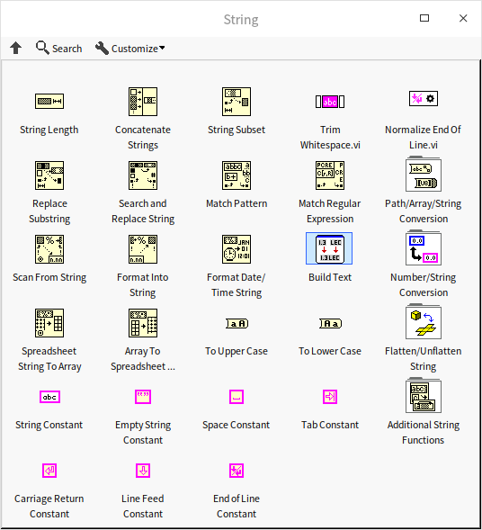

Basic functions like String Length or Concatenate Strings are intuitive. Here, we focus on converting between numeric and string representations.

Converting between numbers and strings is a very common task: math operations require numeric types, while user displays and text files require string formats. LabVIEW offers dedicated conversion functions under **Programming -> String -> String/Number Conversion**. These functions let you parse or format values based on radix (decimal, hex, octal) or notation (floating-point, scientific).

Consider the example program: **Hex Character to Boolean Array**. This program takes a single hexadecimal character as input and outputs its equivalent 4-bit Boolean array.

The program performs three steps: first, it sanitizes the input string to accept only hex characters (`0-9`, `A-F`); second, it converts the character into a U8 integer; and third, it unpacks the lower 4 bits of the U8 value into a Boolean array. We display the complete implementation below on a single Block Diagram:

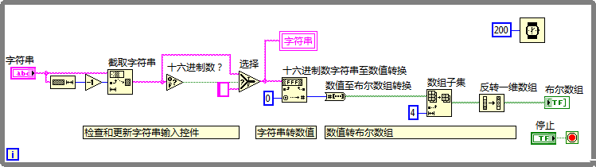

The corresponding output showing the Boolean state of the hex character is shown below:

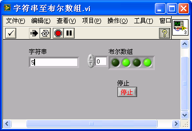

### String Formatting

For complex formatting, LabVIEW provides two powerful nodes under **Programming -> String**: **Format Into String** and **Scan From String**. These operate similarly to C's `sprintf` and `sscanf` functions. They allow you to process multiple variables of different types in a single node using format strings. LabVIEW's format syntax is a direct extension of C's printf syntax.

**Format Into String** formats multiple inputs into a single text output using a format string. The format string contains plain text (copied to the output as-is) and format specifiers (starting with `%`). The specifier format is `%[width][.precision]type`. Common specifiers include:

- `%d`: Signed decimal integer (e.g., `%4d` right-aligns the number to a width of 4 characters).
- `%u`: Unsigned decimal integer.
- `%f`: Fractional floating-point notation (e.g., `%6.2f` outputs a float with at least 6 total characters and exactly 2 decimal places).
- `%e`: Scientific notation.
- `%g`: Shortest representation, automatically switching between `%f` and `%e` based on value size.
- `%s`: Plain string input.
- `%%`: Literal percent sign.

If you are unfamiliar with format codes, LabVIEW offers an interactive builder. Right-click the node and select **Edit Format String** to open the configuration dialog. You can select your operations, and LabVIEW will automatically generate the corresponding format codes:

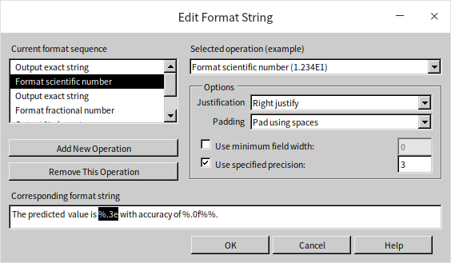

**Scan From String** performs the reverse operation, parsing structured variables out of a single text input. The following example demonstrates formatting two variables into a string, and then scanning them back out using the same format string:

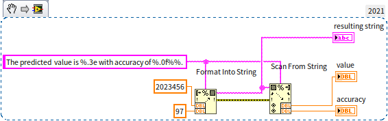

The output matches the inputs perfectly:

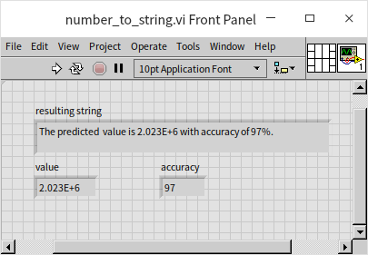

Be careful when using `%s` in **Scan From String** to parse contiguous text inputs. Because `%s` is greedy and matches spaces, parsing multiple strings can sometimes produce unexpected results or parsing errors:

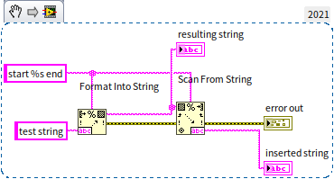

This happens because the first `%s` consumes the entire rest of the string, leaving nothing for the subsequent specifiers. To perform complex text parsing, use **Regular Expressions** instead.

Consider another challenge: **String Formula Evaluation**. Given a math equation as a string (e.g., `sin(pi(1/2)) + 3*5 - 2`), calculate its numeric result at runtime.

This is more complex than simple type conversion. While we previously discussed Formula Nodes and Formula Express VIs, those require formulas to be hardcoded at edit time. Here, the formula string is supplied dynamically at runtime.

Instead of building a parser from scratch, check if LabVIEW has a built-in solution. Under **Mathematics -> Scripts & Formulas**, you will find the **Eval Formula String** VI, which evaluates a dynamic mathematical expression at runtime:

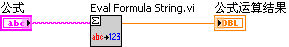

For reference, we will implement a simplified mathematical formula parser using a state machine in the [State Machine](pattern_state_machine) section. This built-in VI highlights the advanced capabilities LabVIEW provides for handling text-based inputs dynamically.

### Converting Between Time and Strings

To display timestamps in user interfaces, you must convert them to strings. The **Get Date/Time String** function formats a timestamp using the operating system's default format. If you need a custom format, use the **Format Date/Time String** function instead, which offers comprehensive template tokens.

Parsing a date/time string back into a timestamp is more complex due to the variety of date formats. LabVIEW does not have a single, automatic parser. Instead, you use **Scan From String** with a precise format string that describes the exact structure of your time text:

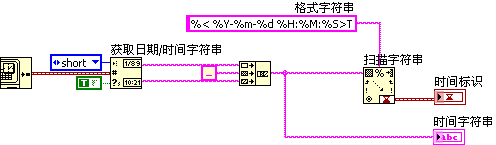

Note that the time format specifiers (such as `%T` or `%Y-%m-%d`) are specific extensions in LabVIEW and differ slightly from standard C printf format characters.


## Regular Expressions

### Introduction to Regular Expressions

A common task in software development is searching for specific patterns in text. While finding a static string (like 'dog') is simple using the **Search and Replace String** function, finding patterns—like isolating all function declarations in a source file—requires matching rules rather than static text. Writing manual parser logic for this is tedious and error-prone.

Regular Expressions (regex) solve this problem. A regular expression is a search pattern constructed from standard characters and special wildcard symbols (metacharacters). These patterns define matching rules for text. Once mastered, regex is an invaluable tool for both code logic and text processing. For instance, the image markup in this book's markdown files follows the format ``. To modify all image paths at once, you can use a regular expression that targets parentheses preceded by `![...]` to extract and rewrite the path strings.

### Match Pattern

LabVIEW provides two regex-based nodes: **Match Pattern** and **Match Regular Expression**. The **Match Pattern** function is lightweight, fast, and sufficient for basic string parsing (like extracting text within brackets). The **Match Regular Expression** function is slower but supports the full, standard regex syntax.

The following example extracts all numeric values from a block of text using **Match Pattern**. A While Loop processes the text iteratively, extracting the matched numbers and passing the remaining text to the next iteration:

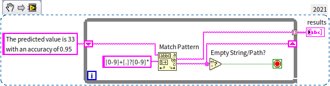

Running this program on the sample text yields the array `[33, 0.95]`. The regex pattern used is `[0-9]+[.]?[0-9]*`, which breaks down as follows:

- `[0-9]`: Matches any digit from `0` to `9`.
- `+`: Matches one or more occurrences of the preceding character class.
- `[0-9]+`: Matches an integer.
- `[.]`: Matches a literal decimal point.
- `?`: Matches zero or one occurrence (making the decimal point optional).
- `*`: Matches zero or more occurrences (matching the fractional digits after the decimal point).

**Match Pattern** scans the string, extracts the first matching substring, and outputs the remaining text (offset) so the loop can continue searching.

Note that this regex is simplified and might miss complex number formats. Let's look at another example: extracting the filename from a Windows file path. The program below accomplishes this:

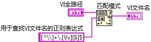

Running result:

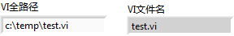

The regex used to match the VI filename is `[^\\]+\.[Vv][Ii]$`, which translates to:
- `\\`: Matches a literal backslash (escaped, because a single backslash is a regex control character).
- `[^\\]`: Matches any character that is *not* a backslash.
- `[^\\]+`: Matches a sequence of non-backslash characters (the filename itself).
- `\.`: Matches a literal dot.
- `[Vv][Ii]`: Matches the extension 'vi' case-insensitively.
- `$`: Asserts that the match must occur at the end of the string (excluding files like `abc.vit` or `xyz.vim`).

### Regular Expression Metacharacters

The table below lists the commonly used characters and usage in regular expressions:

| Metacharacter | Description |
| ------------- | ----------- |
| `\` | Marks the next character as special, a literal, a backward reference, or an octal escape. E.g., `n` matches "n", `\n` matches a newline; `\\` matches "\"; `\(` matches "(". |
| `^` | The matched string must start from the beginning of the input string. |
| `$` | The matched string must end at the end of the input string. |
| `*` | Matches the previous subexpression zero or more times. E.g., `fo*` can match "f" or "fo" or "foo". Equivalent to `{0,}`. |
| `+` | Matches the previous subexpression one or more times. E.g., `fo+` can match "fo" or "foo" but not "f". Equivalent to `{1,}`. |
| `?` | Matches the previous subexpression zero or one time. E.g., `fo?` can match "f" or "fo". Equivalent to `{0,1}`. |
| `{n}` | n is a non-negative integer. Matches exactly n times. Only in "Match Regular Expression" function. E.g., `fo{2}` matches "foo" but not "f" or "fo". |
| `{n,}` | n is a non-negative integer. Matches at least n times. Only in "Match Regular Expression" function. E.g., `fo{2,}` matches "foo" or "fooooooo". `o{1,}` is equivalent to `o+`; `o{0,}` is equivalent to `o*`. |
| `{n,m}` | m and n are non-negative integers, `n<=m`. Matches at least n and at most m times. Only in "Match Regular Expression" function. E.g., `fo{1,3}` can match "fo" or "foo" or "fooo". `o{0,1}` is equivalent to `o?".` |
| `?` (following limiters) | When `?` follows limiters (`*`, `+`, `{}`), the match is non-greedy. E.g., for "oooo", `o+?` matches one "o", while `o+` matches all "o". |
| `.` | Matches any single character except newline. To include newline, use <kbd>(.&#124;\n)</kbd>. |
| <kbd>x&#124;y</kbd> | Matches either x or y. Only in "Match Regular Expression" function. E.g., <kbd>a&#124;view</kbd> matches "a" or "view"; <kbd>(a&#124;v)iew</kbd> matches "aiew" or "view", equivalent to `[av]iew`. |
| `[xyz]` | Matches any one character in the brackets. E.g., `[abc]` matches "a" or "b" or "c". |
| `[^xyz]` | Matches any character not in the brackets. E.g., `[^abc]` matches "f" or "g". |
| `[a-z]` | Matches any character in the specified range. E.g., `[a-c]` matches "a" or "b" or "c". |
| `[^a-z]` | Matches any character not in the specified range. E.g., `[^a-e]` matches "f" or "g". |
| `\b` | Matches a word boundary, e.g., `\blab` matches "lab" in "labview", but not in "collaborate". |
| `\cx` | Matches the ASCII control character specified by x. E.g., `\cJ` matches a newline. |
| `\d` | Matches a numeric character. Equivalent to `[0-9]`. |
| `\D` | Matches a non-numeric character. Equivalent to `[^0-9]`. |
| `\f` | Matches a form feed. Equivalent to `\x0c` and `\cL`. |
| `\n` | Matches a newline. Equivalent to `\x0a` and `\cJ`. |
| `\r` | Matches a carriage return. Equivalent to `\x0d` and `\cM`. |
| `\s` | Matches any whitespace character, including space, tab, form feed, etc. Equivalent to `[\f\n\r\t]`. |
| `\S` | Matches any non-whitespace character. Equivalent to `[^\f\n\r\t]`. |
| `\t` | Matches a tab. Equivalent to `\x09` and `\cI`. |
| `\w` | Matches any word character including underscore. Equivalent to `[A-Za-z0-9_]`. |
| `\W` | Matches any non-word character. Equivalent to `[^A-Za-z0-9_]`. |
| `\xn` | n is a hexadecimal value, matches the ASCII character corresponding to n. E.g., `\x41` matches "A". |
| `\n` (octal) | n is an octal value, matches the ASCII character corresponding to n. E.g., `\101` matches "A". |

### Match Regular Expression {#match-regular-expression}

Experienced regex users will note that LabVIEW's regex engine does not support lookarounds (such as lookaheads or lookbehinds). For instance, if you want to extract the version numbers from the text `'LabVIEW 2018 and LabVIEW 2020'` without capturing the word `'LabVIEW'`, you cannot use a lookbehind like `(?<=LabVIEW\s)20\d{2}`. Instead, you must use capturing groups.

To do this, capture the desired pattern inside parentheses: `LabVIEW\s(20[0-9][0-9])`. The **Match Regular Expression** function outputs these captured subsets as submatches. The example below demonstrates extracting version numbers using capturing groups in a loop:

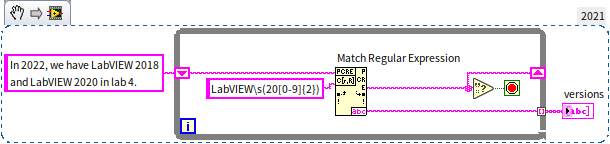

Another practical application occurs when [interfacing with Python](external_connectivity). We can parse Python script files to extract function names. Python functions start with the `def` keyword. The program below matches function definitions:


The regex to extract function names is `^def[\s]+([^\(\s]*)`. The `^` asserts the start of a line, and `def` matches the keyword. The parentheses `([^\(\s]*)` capture the function name (matching any character that is not a parenthesis or space). Setting the **multiline?** parameter of **Match Regular Expression** to `True` allows the engine to evaluate the regex across multiple lines of a script.

Readers can explore further with some commonly used regular expressions:
- To match an email address: `^[a-z0-9_\.-]+@[\da-z\.-]+\.[a-z\.]{2,6}$`.
- To match an unsigned decimal: `([1-9]\d*\.?\d*)|(0\.\d*[1-9])`.


## Paths

### Path Data Type

Paths are a distinct data type in LabVIEW, designed to resolve cross-platform directory formatting issues. In text-based languages, paths are typically represented as strings. However, because different operating systems use different path separators (e.g., Windows uses `\`, Linux and macOS use `/`), string-based paths are not portable.

LabVIEW's **Path** data type handles this internally. Under the hood, path data stores the path type (relative or absolute) and a string array containing each folder name in the hierarchy (e.g., `['C', 'Projects', 'main.vi']`). When displayed or utilized in OS file system calls, LabVIEW automatically reconstructs the path using the correct OS-specific separator, ensuring cross-platform compatibility.

#### Relative Paths

When building applications, you should always prefer **relative paths** over absolute paths. This ensures your program functions properly if its installation directory changes or when compiled into an executable (`.exe`).

For example, if your VI needs to load `data.txt` from its own directory, do not hardcode `C:\Projects\data.txt`. Instead, use a relative path. In LabVIEW, you can retrieve the path of the executing VI using the **Current VI Path** constant. Because this path includes the filename (e.g., `C:\Projects\main.vi`), wire it to the **Strip Path** function to remove the filename and retrieve the parent directory (`C:\Projects`). Then, use the **Build Path** function to append the relative file name (`data.txt`), resulting in the dynamically resolved path `C:\Projects\data.txt`:

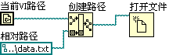

All functions and constants related to path data are found under the **Programming -> File I/O** subpalette in LabVIEW, providing a comprehensive suite of tools for efficient path management.

### Path Constants

LabVIEW provides several path constants under **Programming -> File I/O -> File Constants** to resolve system paths dynamically:

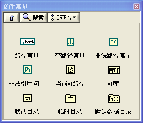

### Converting Between Path and Other Data Types

Path conversion functions are located under **Programming -> File I/O -> Advanced File Functions**. The most common are **Path To String** () and **String To Path** (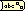).

You can also decompose paths into their folder hierarchies using **Path To String Array** () and **String Array To Path** ().

The **Refnum To Path** function () retrieves the file path from an open file refnum (e.g., standard files or TDMS file handles). Note that this does not support config refnums like those returned by the INI file **Open Configuration Data** VI.

:::caution

Converting strings to paths is OS-dependent. In the regex section, we extracted a filename from a Windows path using string regex:

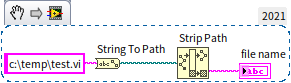

This string parsing fails on Linux or macOS because of different path separators. For cross-platform compatibility, **always use LabVIEW's native Path functions**. To extract a filename, simply pass the Path wire to the **Strip Path** node. It automatically identifies the active OS separator and splits the path into the parent directory and the isolated filename, eliminating string parsing entirely.

:::


## Data Flattening (Serialization)

### What is Data Flattening?

Data flattening, commonly known as **serialization**, is the process of converting complex, multi-level data structures into a flat, contiguous sequence of bytes. This flat byte stream is ideal for writing to disk, transmitting over networks, or passing to hardware. Simple scalar types and flat arrays of scalars are already contiguous in memory.

For simple, contiguous data types, you can use **Type Cast** to reinterpret their memory directly as a string. Because strings are U8 arrays in memory, casting a raw numeric array to a string preserves the exact byte sequence of that numeric array, reinterpreting it as text characters.

For complex data types (such as clusters containing strings or nested arrays), Type Cast is not enough. You should use **Flatten To String**. When you flatten a numeric array to a string, the resulting string includes a 4-byte header describing the array length, followed by the array elements. In contrast, type-casting the array to a string strips the length header, leaving only the raw element bytes. Use the appropriate method based on whether you need to preserve data headers for deserialization.

### Flattening to String {#flattening-to-string}

Different LabVIEW data types use different memory structures. While basic numbers occupy contiguous memory, complex types do not.

For example, in a string array, the array itself stores an array of memory pointers (handles) that point to separate heap locations where the actual text data resides. This creates a non-contiguous structure:

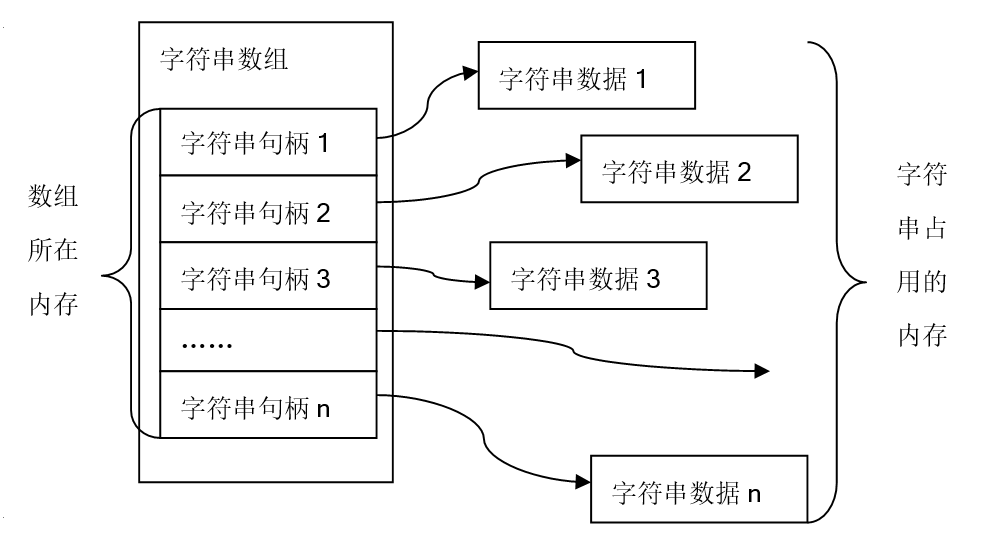

To transmit this array over TCP/IP or write it to a file, this fragmented structure must be packed into a single, contiguous byte stream. This packing process is called **flattening**. Flattening a string array consolidates the length information and string characters into a linear, contiguous byte array.

The **Flatten to String** function (under **Programming -> Numeric -> Data Operations**) serializes any LabVIEW data type into a binary string. The output is a raw binary stream, which is not meant to be read as plain text, but serves as a standardized format for data storage and network transmission.

To reconstruct the original data structure, wire the binary string to the **Unflatten from String** function along with a type specifier.

Additionally, in the **Programming -> Cluster, Class & Variant -> Variant** function palette, there are similar functions for converting between variants and flattened strings. However, these functions are specifically designed for handling variant types and are not as commonly used in broader applications.

### Flattening to XML

A drawback of binary flattening is that the resulting byte stream is not human-readable, making files difficult to debug or inspect. When human readability is important, serialize your data to **XML** (Extensible Markup Language) instead. XML uses structured text tags to describe the type and value of the data. For example:

```xml
<data label="input" type="DBL">34.2</data>
```

This tags the value `34.2` as a double-precision float (DBL) labeled `input`.

The **Flatten to XML** function (under **Programming -> File I/O -> XML**) serializes any LabVIEW data type into XML text. Use **Unflatten from XML** to deserialize it back. Here is a program that flattens a numeric value:

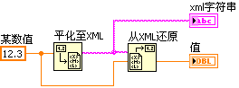

The resulting XML string:

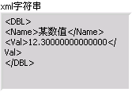

LabVIEW generates readable tags: the `<DBL>` element denotes a double-precision number, `<Name>` specifies the control name, and `<Val>` stores the value `12.3`.

Due to its readability and structured format, XML is widely used for configuration files and network messages.

The main disadvantage of XML is its verbosity. The text tags inflate file sizes and increase the CPU time required for parsing. For high-performance or high-volume storage, binary flattening is preferred.

### Flattening to JSON

While XML is powerful, it carries a lot of overhead. In 2002, JSON (JavaScript Object Notation) emerged as a simpler, more lightweight alternative. Today, JSON has widely surpassed XML in web services and config files due to its minimal footprint.

JSON's format is straightforward:
- Numbers are written as plain text.
- Strings are enclosed in double quotes.
- Arrays are enclosed in square brackets `[]`.
- Clusters (analogous to JSON objects) are enclosed in curly braces `{}` with key-value pairs.

Here is how you serialize a cluster to JSON in LabVIEW using **Flatten To JSON**:

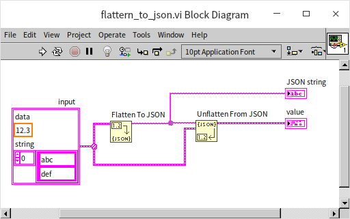

The output is a clean JSON string:

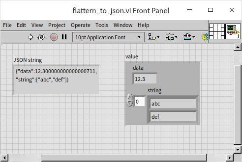

Due to its compact size and readability, JSON is usually preferred over XML for text serialization. However, native LabVIEW support for JSON has some limitations, and certain complex or custom data types (like paths or complex numbers) may not serialize cleanly without custom handling. In those cases, XML or custom flattening remains useful.


## Practice Exercises

- **Sort Student Names**: Create two one-dimensional string array constants containing lists of names. Write a VI that merges these two arrays into a single array and sorts the final list alphabetically.
