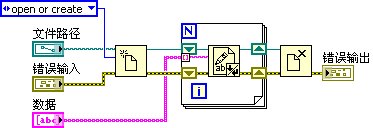
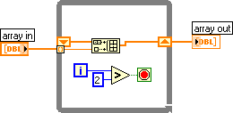
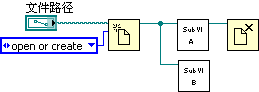
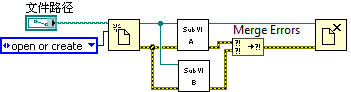
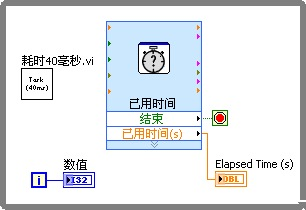

# LabVIEW 代码中常见的错误

发现了程序的问题再回头去调试、排查程序错误，就不可避免地要花费大量时间。要提高开发效率，最重要的一条原则就是，在编写代码时就避免一些常见的低级错误。这样，可以减少大量的调试时间。

直接就编写出潜在错误极少的代码，这需要程序员的耐心细致和长期经验积累。但是，有些编程错误出现的频率非常高，每个 LabVIEW 程序员在初始阶段差不多都曾遇到过。在这里列出了一些常见的错误，在编程时对这些问题多加留意，则可事倍功半。这些内容在本书的前面几章中都也有提及，在此处汇总，提醒读者多多注意。

## 数值溢出

下图是在[数值表示法](data_number#表示法)一节中介绍过的一段示例程序：

这个 VI 完成的功能是一个简单的乘法运算：300×300，不假思索就可以知道答案是 90000。但程序运行后，给出的结果却是 24464。乘法节点是不会错的，错误是由于程序中使用的数据类型是 I16，I16 能表示的最大数目只有 32767。所以，在乘法计算中出现了数值溢出错误，也就是数值已经超过数据类型可以表达的范围了。

为了避免此类错误，在程序中使用短数据类型时，一定要确认程序中的数据绝不会超出该类型可以表示的范围。短数据类型与长数据类型相比，其优点是可以节约程序的存储空间，提高程序运行效率。但它能表示的数据范围较小，容易出现数值溢出错误。对于单个的数据（不用于数组），如果使用频率不是特别高，那么短数据类型能够提高的效率是非常有限的，甚至可以忽略。这时，可以尽量考虑使用长数据类型，以避免可能发生的错误。

## For 循环的隧道

for 循环中的移位寄存器一般是用在当循环内需要使用局部变量的情况下，即上一次循环运行的输出数据要作为下次运行的输入数据使用。循环外的数组数据通过带索引的隧道在循环体内就可以直接得到数组元素。除此之外，简单地在循环内外传递数据，使用一般的隧道就可以了。

如果一个数据传入 for 循环结构体，又需要传出来，那么就应该使用移位寄存器或带索引的隧道来传递这个数据，尽量不要使用不带索引的隧道。因为 for 循环在运行时，循环次数是有可能为 0 的。这种传入又传出循环结构的数据，编程者往往是希望在后续程序中继续使用它的。但是，如果循环次数为 0，循环体内的任何代码，包括连接两个隧道之间的数据连线都不会被执行。数据是不会通过这根连线从输入隧道传递到输出隧道的。这样一来，输入值会被丢失，后续程序再无法使用它了。

下图中的程序，是将一组输入的数据存储至文件：

其中，文件引用和错误簇，都是通过普通隧道传入 For 循环，再传出的。当输入的数据是个空数组时，循环迭代次数为 0，for 循环中的代码不会被执行。从循环输出隧道读到的文件引用已经不是输入的那个引用了。后续的程序也就无法关闭被打开的文件。笔者曾经遇到并处理过一些有内存泄漏的程序，其实就是由这个错误引起的。

所以，在传递类似的句柄数据出入 for 循环时，一定要使用移位寄存器：

错误簇数据在传入传出循环结构时，也一定要使用移位寄存器。其原因还不仅是为了防止在循环次数为 0 时，错误信息丢失。另一个主要的原因是，通常一个节点有错误输出，意味着后续的程序都不应该执行。在有错误的情况下继续执行程序代码，风险非常大。有可能会引起程序、甚至系统崩溃。使用移位寄存器后，任何一次循环产生的错误都会立即被传递到后续的循环中，从而及时防止后续迭代过程中，循环结构中的节点被再次执行。

更详细的介绍可以参考[循环结构](data_array#for-循环)一节。

## 循环次数

如果 for 循环结构使用了索引输入隧道，那就不必再指定循环迭代次数了。for 循环会根据索引输入隧道连接的数组的长度来决定循环迭代次数。

有时，循环结构体上有多个索引输入隧道，或者又同时指定了循环迭代次数 N。这种情况下也是比较容易引起程序错误的。此时，循环的次数为连接到索引输入隧道的几个数组中长度和 N 值中最小的一个。如果发现程序在该处循环迭代的次数小于预期，甚至不执行循环，很可能就是某个输入数组的长度比预计的要短。

while 循环同样也可以使用带索引的隧道，在 while 循环中使用索引隧道风险更大一些。即便使用了索引隧道，while 循环的循环迭代次数也不是由输入数组的长度决定，而是由停止条件决定的。如使用了带索引的隧道，则在设计程序时，还需要考虑当数组大于、小于循环次数时，程序应该如何处理它。这样一来，还不如把整个数组传入 while 循环，在循环体内再对数组作索引来得方便。如果希望循环次数与数组大小保持一致，那自然是使用 for 循环的程序更加清晰易懂。因此，如果需要用到带索引的隧道，还是使用 For 循环更为适宜。

## 移位寄存器的初始化

下图所示的程序，由于它在 while 循环上使用了带索引的隧道，所以可读性不那么好。程序运行后，array out 的运行结果是什么，可能还要仔细考虑一阵子才能给出答案。

实际上，即使输入值 array in 恒定不变，程序每次运行，array out 的结果都是不一样的。array out 的数组长度会一直增加。其原因就在于没有给循环上的移位寄存器赋予一个初始值。

没有初始化的移位寄存器，在 VI 被关闭前，会一直保存上一次运行结束时的数据。这个特点在某些情况下可以被程序员利用，功能全局变量便是利用了此特性。但是，很多情况下移位寄存器只是被用作为循环内部的局部变量。这时，一定要对它初始化，以防止潜在的错误发生。

## 簇中元素的顺序

下图中的程序的输入簇 info 和输出簇 info out 分别包含三个元素：name、high 以及 weight，程序是先修改 info 中的三个元素的值，然后再传递给 info out。如果输入是 `high=10，weight=21` 很容易计算出，程序运行的结果应当是 `high=10，weight=21`：

但实际运行此程序，结果却与预期不符：

个错误的原因在于：簇中元素在数据线中的排序，并不一定和界面上看到的顺序是一致的。界面上元素控件的位置可以被任意挪动，数据的顺序也可以被调整。在簇的右键菜单中选择 "重新排序簇中控件"，即可设置元素数据的顺序：

上图中显示的是 info out 簇中数据的顺序，它的顺序和 info 簇中的顺序并不一致。在示例程序中，其目的是修改簇的第三个元素，而程序中输入输出两个簇控件的第三个元素的含义却是不同的。

为了避免此类错误，也为了应用起来更方便，在使用簇数据类型时，需要遵循以下原则：

* 凡是用到簇的地方，就为它创建一个类型定义。在程序中所有要用到这个簇类型的地方，都是使用同一类型定义的实例。这样，一是可以保证所有的簇中元素的类型、顺序都完全一致，避免了图 8.22 中的错误。二是一旦需要变动簇中的元素，只需在类型定义中更新一下，它的所有实例都会自动跟着更新，不必再挨个对 VI 进行修改。
* 凡是在簇数据需要捆绑或松绑的地方，统统使用按名称捆绑或松绑节点。使用按名称捆绑或松绑节点可以直观地显示出被操作的元素的标签。这样，不会因为顺序的不同而导致错误的连线。
* 在界面上，可以设置按照水平或垂直自动排列簇元素。这样一来，簇中控件的顺序就会和数据的顺序保持一致。

详细介绍可以参考[簇数据类型](data_array#簇)一节。

## 时序错误

LabVIEW 是自动多线程的编程语言。这在方便用户的同时，也会带来一些麻烦。比如，在单线程程序中，哪一个功能模块先运行，哪一个后运行是固定的。而在自动多线程的程序中，两个并行模块执行的先后顺序可能是不确定的。有时，它们的执行顺序可能与编程者预期的不同，那就会产生错误。

下图所示的程序的功能是：首先打开一个文件；之后，两个子 VI，A 和 B 都对这一文件进行了访问；最后关闭文件。

在这个 VI 中隐藏着一个潜在的问题：并行执行的两部分程序，先后次序是不定的。所以，VI 在运行的过程中，有可能会先执行关闭文件的函数，再执行子 VI B。而子 VI B 是要用到这个文件的，这时子 VI B 就会因为它所需要访问的文件已被关闭而产生错误。

避免这一错误的方法也很简单。利用错误簇的数据线，可以控制程序的运行时序，保证在子 VI A 和 VI B 都运行结束后，再执行关闭文件函数：

在判断 While 循环退出条件时，也容易出现时序错误。比如下图中的这个程序：

上图程序的功能是：在某一设定的时间范围内，循环直执行子 VI“耗时 40 毫秒.vi”。“已用时间”VI 用于检查程序运行的时间，一旦超过设定的时间，“结束”输出参数就会输出“真”，立即退出循环。但是这个程序是存在问题的：因为“耗时 40 毫秒.vi”和“已用时间”两个 VI 是并行运行的，而“已用时间”VI 的执行速度又非常快。每次循环迭代，总是“已用时间”VI 立即就可以返回结果。这时，即便设定的时间已经到了，“结束”参数返回的值为真，循环还是要等待一段时间，一直到 "耗时 40 毫秒.vi" 运行结束才能退出。

所以在循环体内，判断循环退出条件的代码，和其余部分代码的时序一定要明确。必要的时候，可以使用顺序结构来限定时序：

## 竞争状态

竞争状态也是一种时序错误。不过，竞争状态一般特指多个线程同时访问同一资源而引起的数据混乱。竞争状态主要出现在使用全局变量（或局部变量）时，我们在编程时应当尽量避免使用全局变量。如果无法避免全局变量和局部变量的使用，一个常用的避免竞争状态方法是使用信号量对多个线程共享的资源加以保护。当某一线程访问这个共享资源时，首先要确定它有没有被其它线程占用。如果有，就等待，直到它被其它线程释放。如果没有，则先给这个资源加个锁，这样其它线程就会知道这一资源已经被占用了。然后对资源进行访问，在访问结束后，把锁打开：

这一过程，和利用队列传引用时，对数据的保护方法是相同的。有关信号量的各函数均位于“编程 -> 同步 -> 信号量”函数选板上。更详细的信息可以参考[使用信号量避免数据竞争状态](pattern_global_data#使用信号量避免数据竞争状态)一节。

## 等待循环中的延时

上图是本书最初使用过的一个示例程序，程序框图中有一个循环，其目的是为了及时地对某个已被改变的数据或者状态做出反应。其实，单纯使用循环结构，效率是很低的。因为在大多数循环迭代中，数据或者状态都是不变的。这些迭代其实完全没有必要。在这类应用中，最好是在数据或状态改变时，才触发程序去做相应的处理。

但在有些情况下，要让数值或状态在一发生改变就立即发出事件，可能不太容易做到。比如，数据某一外部设备的数据发生变化，并不会产生事件。应用程序只能通过持续读取这一数据的值，来监视其是否发生改变。这时，程序只能采用不停地循环、反复地查询数据或状态是否变化的方式。在这样的查询程序中，一定要在循环体内加入几十至几百毫秒的延时。否则，程序会占用几乎全部的 CPU 来进行一些无谓的运算。这虽然不会引起程序逻辑错误，但导致了程序其他部分执行缓慢。
