# Common Mistakes in LabVIEW Code

Finding and debugging errors in a program can consume significant time. To improve development efficiency, a fundamental principle is to avoid common, elementary mistakes while writing code. This approach greatly reduces the time dedicated to troubleshooting.

Producing clean, robust code demands patience, attention to detail, and accumulated experience. However, certain programming mistakes are remarkably frequent, and nearly every LabVIEW programmer encounters them when starting out. Highlighting these common pitfalls can help you avoid them in your own development. These topics were touched upon in earlier chapters, but they are summarized here as a handy checklist.

## Numeric Overflow

Below is an example program previously introduced in the [Numeric Representation](data_number#representations) section:

This VI performs a simple multiplication: $300 \times 300$. Mathematically, the answer is $90,000$. However, the program outputs $24,464$. The multiplication node itself is correct; the error occurs because the inputs and output use the `I16` (16-bit signed integer) representation, which has a maximum value of $32,767$. Consequently, a numeric overflow occurs, meaning the calculation exceeds the range that the data type can represent.

To prevent overflow, ensure that the data type is large enough to handle the maximum possible value. While smaller data types conserve memory and can optimize operations (especially in large arrays), using them for individual scalars on a modern PC yields negligible savings. For general scalar operations, it is best practice to default to larger data types (such as `I32` or double-precision float `DBL`) to prevent accidental overflow.

## For Loop Tunnels

Shift registers are used in a For Loop when data from one iteration needs to be passed to the next (local state). Arrays outside the loop are typically fed into the loop using auto-indexed tunnels. For simple data passage where no iteration-to-iteration state is needed, standard non-indexed tunnels are used.

However, if data is fed into a For Loop and must be passed out to subsequent nodes, you must use shift registers or auto-indexed tunnels rather than standard non-indexed tunnels. This precaution is necessary because the iteration count of a For Loop can be zero (e.g., if the input array is empty). If the loop executes zero times, the code inside the loop—including any direct wires connecting the input and output tunnels—does not run. Consequently, a standard output tunnel will not receive the input value, resulting in default data values (like $0$ or null references) being passed downstream.

Consider the program below, which is designed to write data to a file inside a For Loop:

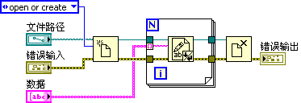

In this example, both the file reference (refnum) and the error cluster are passed into and out of the For Loop via standard non-indexed tunnels. If the input array is empty, the For Loop runs zero times. As a result, the file refnum output from the loop is a null reference rather than the valid open file refnum, preventing the downstream code from closing the file properly. I have encountered and resolved many memory and file resource leaks caused by this exact issue.

Therefore, you must use shift registers when passing refnums, handles, and other state data into and out of a For Loop:

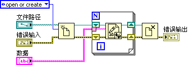

Similarly, the error cluster must always be passed via shift registers. This not only preserves error details if the loop runs zero times, but also allows you to implement a conditional exit or skip logic within the loop if an error is encountered in an earlier iteration.

## Loop Iteration Count

When you use an auto-indexed input tunnel in a For Loop, you do not need to wire a value to the loop count terminal `N`. The loop automatically determines its iteration count based on the size of the array connected to the auto-indexed tunnel.

However, issues arise when a For Loop has multiple auto-indexed input tunnels, or when the count terminal `N` is also wired. In these cases, the loop will run a number of times equal to the **smallest** value among the sizes of the auto-indexed arrays and the value wired to `N`. If your loop runs fewer times than expected (or not at all), check whether one of the input arrays is smaller than anticipated.

While Loops can also use auto-indexed tunnels, their iteration count is determined solely by the stop condition, not the size of the array. When auto-indexing out of a While Loop, you must manage how much data is written. It is usually simpler to pass the entire array into the While Loop and index it manually inside the loop body. For situations where the loop count matches the array size, a For Loop is always the cleaner and more readable choice.

## Initializing Shift Registers

The program below uses auto-indexing in a While Loop, which reduces code clarity. Take a moment to think about what the value of `array out` will be after execution:

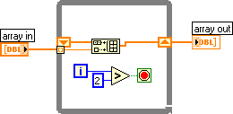

Interestingly, even if the input `array in` is constant, the size of the output `array out` increases every time you run the VI. This occurs because the shift register is uninitialized.

Uninitialized shift registers retain their values in memory between consecutive executions of the VI (until the VI is cleared from memory). While this behavior can be leveraged deliberately to maintain state across runs (similar to static variables in C), it is a common source of bugs when developers expect the shift register to reset on each run. Unless you are intentionally implementing a state-retention pattern, always initialize shift registers.

## Order of Elements in Clusters

The program below takes an input cluster named `info` and outputs a modified cluster named `info out`. Both clusters contain the elements `name`, `high`, and `weight`. The code modifies these values and passes them downstream. Assuming the inputs are `high = 10` and `weight = 21`, you might expect the output to reflect those same values:

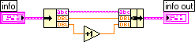

However, running the program yields unexpected values:

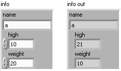

The root cause is that the logical order of elements within a cluster's data structure does not necessarily match their visual arrangement on the Front Panel. You can drag controls around in a cluster shell without changing their underlying data index. Right-clicking the cluster border and selecting **Reorder Controls in Cluster** displays the data indexes:

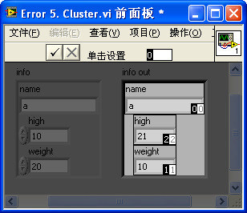

In this example, the element order in `info out` does not match the order in `info`. Because the wire passes the cluster data as a flat structure, the elements are mismatched.

To prevent these errors, adhere to the following rules when working with clusters:

- **Use Type Definitions (TypeDefs)**: Always create a TypeDef (`.ctl` file) for your clusters. Use instances of this TypeDef throughout the application. If you need to add, remove, or reorder elements, updating the TypeDef automatically updates all VIs, keeping the cluster structures synchronized.
- **Use Bundle/Unbundle By Name**: Avoid using the standard **Bundle** and **Unbundle** nodes, which rely on index order. Instead, use **Bundle By Name** and **Unbundle By Name**. These nodes display the element labels, making the code self-documenting and immune to changes in element index order.
- **Arrange Elements Systematically**: Use the auto-arranging options (horizontal or vertical) for cluster controls to keep the visual layout consistent with the logical data structure.

## Timing Errors

Because LabVIEW is inherently multi-threaded and dataflow-driven, parallel sections of code execute concurrently. In single-threaded text-based languages, execution order is strictly sequential. In LabVIEW, if two nodes do not have a data dependency (i.e., they are not connected by a wire), they can run in any order.

Consider the program below: the developer intends to open a file, have subVI A and subVI B read/write to it in parallel, and then close the file.

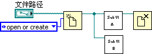

The bug here is the lack of sequence control. Because the file close function has no data dependency on subVI A or subVI B, LabVIEW might execute the close node before subVI B has finished running, leading to a file access error.

To control the execution sequence, use the error wire to establish a clear dataflow path, ensuring the file is closed only after both subVI A and subVI B have completed:

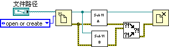

Timing issues are also common when exiting While Loops. Consider the example below:

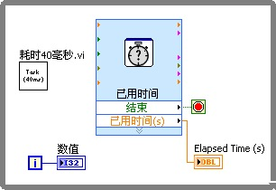

The goal is to run the subVI `Takes 40 milliseconds.vi` repeatedly for a specific duration. The `Elapsed Time` Express VI checks the duration and outputs `True` to the loop stop terminal when time runs out. However, because the `Elapsed Time` Express VI and `Takes 40 milliseconds.vi` run in parallel, the loop cannot evaluate the stop terminal until the 40 ms subVI finishes.

To guarantee that the loop exits exactly when the condition is met without waiting for parallel execution, you must define a strict sequence within the loop body. Using a Sequence Structure is an effective way to enforce this order:

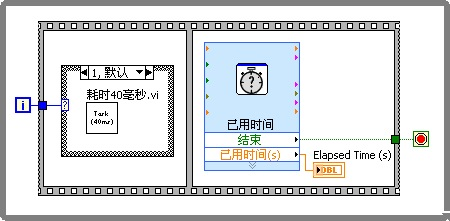

## Race Conditions

A race condition is a specific timing error that occurs when multiple parallel execution threads read and write to the same shared resource simultaneously, resulting in corrupted data. In LabVIEW, this is typically caused by the misuse of local or global variables.

To avoid race conditions, minimize the use of local and global variables. If you must use them, protect the shared resource using **Semaphores**. A semaphore acts as a lock: before a thread accesses a resource, it must acquire the semaphore. If another thread holds the lock, the requesting thread waits. Once the lock is acquired, the thread performs its read/write operation and releases the semaphore, allowing other threads to proceed:

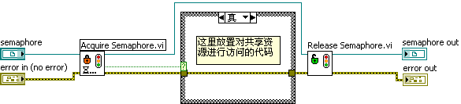

Semaphore VIs are located under `Programming -> Synchronization -> Semaphore`. For more information, see [Using Semaphores to Avoid Data Race Conditions](pattern_global_data#using-semaphores-to-avoid-data-race-conditions).

## Delays in Polling Loops

When a loop needs to respond to user events or check for data/status updates from external hardware, it must poll the status continuously if interrupts or events are not available.

If you run a While Loop without any timing delay, it will execute as fast as the CPU allows, pegging a CPU core to 100% usage for useless iterations. To prevent this, always include a small timing delay (e.g., using **Wait (ms)** or **Wait Until Next ms Multiple**) inside your polling loops. A delay of just 10 ms to 100 ms will drop CPU utilization to near 0% while remaining responsive enough for user actions and typical hardware updates.