# 调试

## 集成调试环境

### 列出编译错误

VI 程序框图窗口上的工具栏中，有多个用于调试程序的按钮，可以帮助编程者找出程序错误所在。

对于某些程序中的错误，如缺少必要的输入、数据类型连接错误等，LabVIEW 可以在编辑 VI 的同时就发现它们。LabVIEW 发现这些错误后，会把“运行”按钮变成断裂箭头模样的“列出错误”按钮：

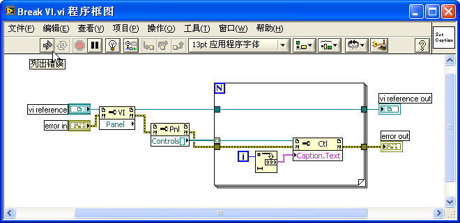

用户只要点击这一按钮，在弹出的“错误列表”窗口中就会显示出程序中的错误：

错误列表窗口会列出有错误的 VI 和 VI 中具体存在问题的节点。除了显示导致程序不能运行的错误之外，它还可以提供一些警告信息，显示程序可能存在问题的地方。

双击列表中列出的条目，即可弹出出错的 VI，并高亮显示出 VI 中相应的出错位置。

### 运行时的调试工具

有些错误，是不可能在编辑过程中被 LabVIEW 自动发现的。比如，程序中的逻辑错误等，只有在程序运行过程中，产生了错误或没有返回预期结果时，用户才能意识到程序存在错误。修改这样的错误，首先要对错误进行定位，找到程序中产生错误的具体位置，然后才好对症修改。

最常用的错误定位方法是：让程序在有可能出错的位置前暂停，然后单步执行。每执行一个函数或节点，都观察一下这个函数或节点的输出与预期的正确结果是否相符。若在执行某一步时，开始出现错误，则此处很可能就是症结所在。

VI 程序框图窗口工具栏中的“暂停”、“单步步入”等按钮，是用于帮助程序进行调试的。下图是一个正在运行的 VI 的程序框图。如果有其它编程语言的调试经验，看到工具栏上的按钮的图形，基本上就可以知道它的功能了：

 用于停止整个程序的执行。调试到中途，不想让程序继续执行下去了，可以使用这个按钮。

 用于暂停或者继续程序的执行。使用这个按钮可以让运行的程序暂停，或让暂停的程序继续执行到终结、或直到下一个断点处再停下来。

 用于启动高亮显示执行。在高亮显示执行时，LabVIEW 会放慢代码的执行速度，并且在程序执行到每一个节点时，高亮显示这个正在被执行的节点。高亮显示执行的速度非常慢，所以启用它要非常小心。如果启动高亮显示执行的同时，某个 VI 前面板的设置是 "模态"（modal）的（在 VI 属性框的 "窗口外观" 页，按 "自定义..." 键，进入 "自定义窗口外观" 页，勾选 "模态" 选项），那么再想中途关掉它是不可能的了。只能非常痛苦地等待程序的结束，或杀掉整个 LabVIEW 进程。所谓前面板或者一个窗口是 "模态" 的，是指这个前面板被打开后，总是置于同一程序的其它所有窗口之上。用户只能对 "模态" 前面板进行操作，而不能点击或编辑任何其它窗口。只有在 "模态" 前面板关闭后，才能继续点击其它窗口上的控件。一般来说，程序中的对话框就是 "模态" 的。

启用高亮显示时，程序框图的数据线上会显示一个小点在流动，以演示数据在数据线上的流动。这样，可以更形象地观察程序的执行流程。

 用于保留 VI 程序框图上数据线中的数据。如果这个按钮被按下，在程序执行过某根数据线之后，在数据线上流过的数据就会被保存下来。用户可以继续使用探针来查看这些数据。

 用于单步执行。它们三个分别表示进入、跳过或跳出某个节点、结构以及子 VI。

 下拉框表示 VI 的调用关系。如果正在被调试的是一个程序中的子 VI，在这里可以显示出子 VI 的调用关系。打开下拉框，可以看到当前 VI 从低层到高层的逐级被调用关系。选择下拉菜单中的某一项，即可跳到被选中的那个 VI 处。

除了上述这些工具，在进行调试时，通常还需要使用到断点和探针。断点和探针都是设置在程序框图上的。如果是在数据线上设置断点，数据线上会显示出一个红色的圆点：。如果断点设置在某一节点上，这个节点会被一个红色的框包围起来。探针只能加载数据线上，它会在数据线上添加一个标签：。标签中的数字表明这是哪一个探针。而探针所在处的数据会在如下图所示的悬浮窗口中显示出来：

### 全局选项

在 LabVIEW 的选项对话框上（点击“工具 -\> 选项...”菜单），有一些与调试相关的选项。旧版本 LabVIEW 的选项对话框上有专门的一页“调试”（Debugging）放置这些选项：

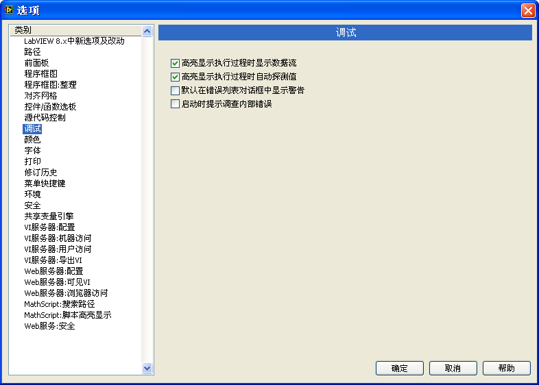

较新版本的 LabVIEW 中，这些选项被合并进了“环境”（Environment）页面：

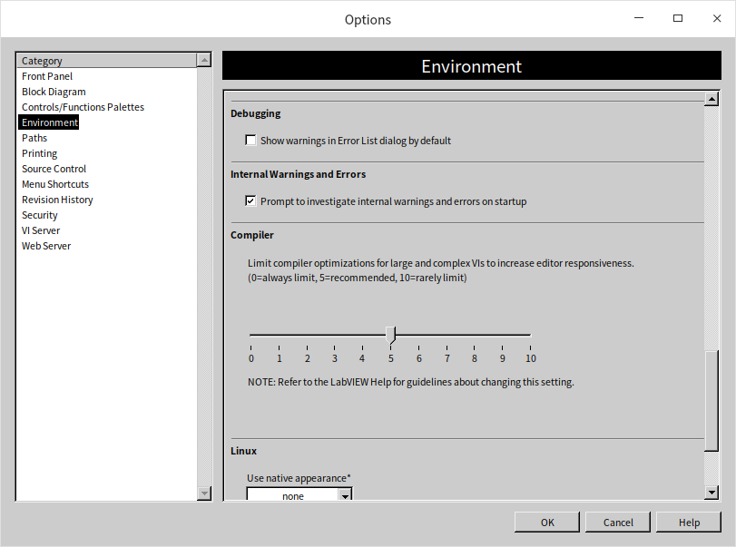

在几个常见的选线中：
* “高亮显示执行过程时显示数据流”表示在高亮显示执行的过程中显示数据的流动。
* “高亮显示执行过程时自动探测值”表示在高亮显示执行的过程中，数据从每个接线端流出时，显示数据的数值。
* “默认在错误列表对话框中显示警告”表示在默认情况下，在错误列表的对话框中显示警告信息。
* “启动时提示调查内部错误”表示在 LabVIEW 启动时检查是否存在内部错误。 

### VI 的属性

某些 VI 的属性设置（譬如某个 VI 被设置为不允许调试），会导致这个 VI 无法调试。禁止 VI 调试可以大大提高 VI 的运行速度，降低 VI 的内存占用。所以，在 VI 发布给用户时，最好把它设为不可调试。对于从别人那里得到的 VI，如果发现它不可以调试，应该首先查看一下它是否被设置为不可调试了。如果是，可以重新设置其为允许调试，然后再进行调试：

在有些情况下，VI 是无论如何都无法被调试的。比如，VI 被设置了密码保护，而你又不知道密码；或者 VI 在保存时被移除了程序框图。

## 断点和探针

断点和探针是调试 LabVIEW 代码时最常用的两个工具。

### 断点

LabVIEW 中的断点在使用和功能上都比较简单、直观。使用工具选板（下图）上的断点工具，在想要设置或者取消断点的代码处点击鼠标即可。或者，直接在程序框图的节点、数据线上右击鼠标，选择设置或取消断点的菜单项，也可以添加或删除断点。

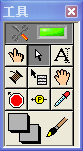

断点几乎可以设置在程序的任何部分。当程序运行至断点处，就会暂停，等待调试人员的下一步操作。很多编程语言的调试环境都具有条件断点，但 LabVIEW 没有类似的断点设置。LabVIEW 是使用条件探针来实现条件断点功能的。

如果某个 VI 不允许设置断点，很可能是这个 VI 被设为不允许调试了。此时，只需在 VI 属性中重新设置为允许调试即可。

断点是可以被保存在 VI 中的。关闭保存了断点的 VI，程序执行至断点处仍会停下来，并且会自动打开这个 VI。所以，在把程序发布给用户前，需要保证程序中没有断点，以免用户的程序在运行时突然停下来。打开“查看 -\> 断点管理器”菜单，可以查看到所有存在于内存中的 VI 的断点。并且可以对它们进行统一管理，比如可以直接删除所有的断点：

### 探针

探针的功能类似于其他语言调试环境中的查看窗口。查看窗口用于显示变量当前状态下的数据。LabVIEW 与其他语言不同之处在于，LabVIEW 是数据流驱动型的图形化编程语言。LabVIEW 中的数据传递并非通过变量，而主要是通过节点之间的连线完成的。所以，LabVIEW 的探针并不是针对变量的，而是添加在数据线上的。

预设值断点类似，使用工具选板上的探针工具，或者直接在程序框图的数据线上右击鼠标，选择探针菜单项，可以为数据线添加一个探针。LabVIEW 的探针也是图形化显示的，数据被显示在悬浮窗显示区域的显示控件中。探针窗口有左右两部分，左边列出了当前程序中所有的探针，高亮选中其中的一个探针，它的数值会被显示在窗口右边“Probe
Display”中的控件中。比如，为一根传递数值类型数据的连线添加探针，默认的探针便是一个数值型显示控件：

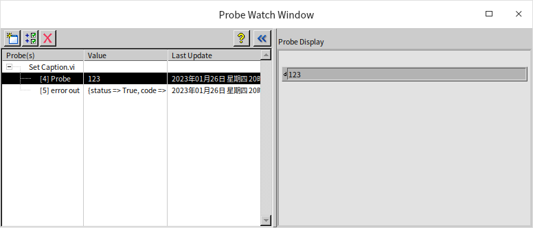

错误输入输出数据线上的探针，则看上去就像是个错误簇：

有些时候，为了显示对调试者更加有帮助的信息，探针也可能使用与连线数据类型不同的控件来显示信息。比如上文中用于监视一个引用类型的数据连线的探针，却使用了字符串控件，以显示出引用类型的详细信息和值：

### 选取其它控件作为探针

如果编程者认为 LabVIEW 为某一条数据线提供的默认的探针不美观或不适用，也可以在该数据线上点击鼠标右键菜单“自定义探针 -\> 控件 -\>...”，在弹出的控件选板中选取一个控件作为探针：

探针控件的数据类型必须与数据线的数据类型一致，探针才会被成功创建。

### 条件探针

设置断点后，程序每次执行到断点处都会停下来。但有时候，调试者希望程序只在被监测的数据满足某一条件时，才暂停运行。比如，被监测的数据在正常情况下应大于或等于零，调试者希望一旦数据小于零则暂停。在 LabVIEW 中，可以使用条件探针来实现这样的功能。

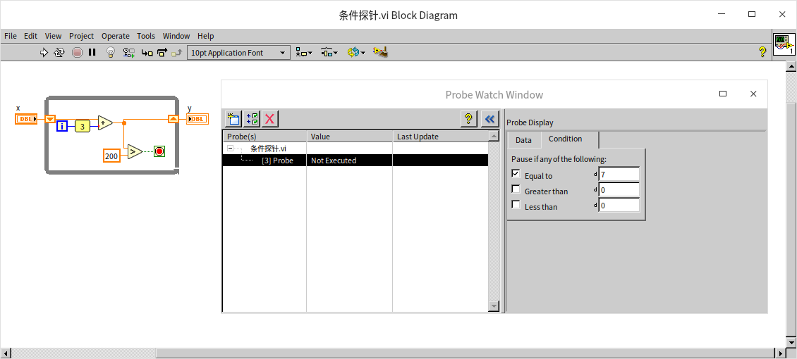

以上图中的程序为例，如果希望程序中的循环只有在迭代第 8 次时才停下来，就需要使用条件探针。在记录循环次数的 i 的输出数据线上点击鼠标右键，选择“自定义探针 -\> 带条件...”的探针，即可创建出一个条件探针。在探针的条件页上可以设置程序暂停的条件。比如，在这个例子中，当 i=7 时，则对应于循环迭代到第 8 次。满足这一条件时，程序会暂停运行，等待开发人员进一步的调试操作。

### 用户自定义探针

调试中，有时需要在探针上显示出信息更为详细的数据，也许 LabVIEW 自带探针的功能不够强大，并不能满足需要。如在下图的程序中，需要给队列数据类型加一个探针。LabVIEW 自带的探针只能显示出表示这一队列的一个 32 位整数，这对于调试程序帮助不大。调试者也许更希望在探针上看到队列中元素的内容。

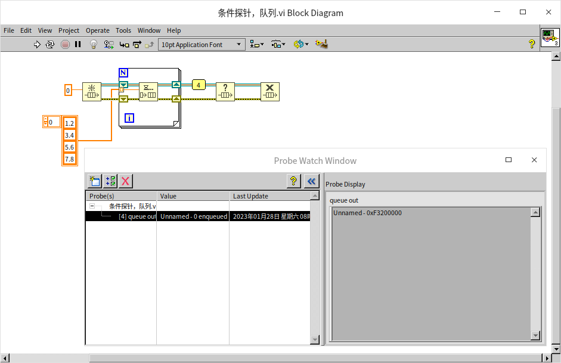

LabVIEW 提供的探针类型虽然有限，但编程者可以自己动手，创建出满足特殊调试需求的探针来，这就是用户自定义探针。

用户自定义探针其实就是一个 VI。LabVIEW 自带了一些已经做好的探针，这些探针都被放置在 \[LabVIEW\]\\vi.lib\\\_probes 文件夹下。可以打开这个文件夹里面的 VI，查看一下已有的自定义探针是如何做的。比如，上文演示的 I32 型条件探针的 VI 便是 ConditionalSigned32.vi。创建用户自定义探针前，可以参考这些已有的探针。

若需要自己动手创建一个自定义探针，可以先在探针所针对的数据类型的数据线上点击鼠标右键，选择“自定义探针 -\> 新建”。之后，LabVIEW 会弹出一个向导界面，帮助用户指定创建用户自定义探针所需的信息。第一步选择是否使用模板。我们可以从零开始自己编写一个全新的探针，但是这样工作量比较大。不同探针之间会有很多相似之处的，比如类似的界面，我们可以用一个已有的探针做模板，在其基础上进行改动，以提高效率：

点击下一步，向导页面会列出所有已有的探针。因为队列中的数据和数组中的数据比较类似，所以我们可以使用给数组的探针做模板创建应用与队列的探针：

再下一步是为探针起一个名字，因为需要探测的是一个元素为双精度浮点数的队列，我们可以给新建的探针起名为“DBL Queue”：

在提供了必要的信息之后，LabVIEW 会自动生成自定义探针 VI 的框架。这个框架 VI 的前面板如下，它就是探针的外观： 

我们可以根据自己的需求，修改其外观，但是在示例中，我们仅仅需要显示队里中数据的值，这个外观已经可以胜任了，所以我们不需要做任何改动。这个框架 VI 的程序框图也是改编自数组的探针，它无法直接处理队列数据，所以 VI 是无法运行的：

我们只需要做很小的改动，调用“Get Queue Status”函数，把队列中的数据按照数组的形式读出，后续程序可以完全使用框架中自动生成的代码：

这样，新的探针就具备了查看队列中元素的能力了：

### 探针的独立监视窗口

LabVIEW 默认把所有探针的数据显示全部集成在了一个窗口内，但在旧版本（LabVIEW 2009 之前）中，每个探针都有一个独立窗口的。新的集成式的探针管理器无疑更加简洁，但他的缺点是每次只能显示一个探针的值。 有时候，希望调试程序时可以同时看到多个探针的值，我们可以采用旧版本 LabVIEW 的探针显示方式：在探针监视窗口中选中某一个探针，点击窗口左上角的“在新窗口中打开”按钮，就可以为这个探针新建一个独立的显示窗口。这样，不同的探针数据就可以同时显示了：

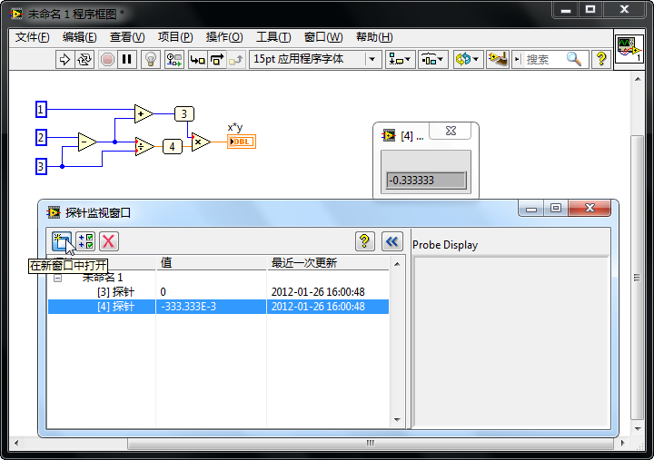

## 禁用结构

除了断点和探针这两种最常用的调试工具外，调试中还常常需要借助一些其它的工具和方法，以寻找到程序的问题所在。

调试有错误的程序，首要任务是要找到错误所处的部位。在大多数场合，可以在程序执行过程中使用探针一路跟踪数据的变化。如果某个节点的输出数据与预期的不一致，这个节点很可能就是问题所在之处。但在某些情况下，靠这种简单方法是无法找到错误所在之处的。

比如，程序运行中出现了数组越界的错误。但程序往往并不是在错误发生之处就立即表现出异常，而在程序又运行了一段不确定的时间之后，突然崩溃或报错。而且，每次调试时，程序报错、或者崩溃处所可能都不在同一处。或者，虽然找到了最终出错的代码处，但发现它是个最基本的 LabVIEW 节点，不能再进入节点内部调试了。而且，这个节点出错的可能性基本为零，错误肯定是在其它地方产生的。

再比如，有些错误是由于多线程的时序引起的。为程序添加断点或探针会改变程序的时序，导致程序调试时结果正常，而正常运行时，结果却错误。

在断点和探针派不上用场的时候，可以采用这种思路查找程序故障：先把一部分代码移除，再看看程序运行是否还有问题。如果一切正常了，说明被移除的代码中存在错误。否则，问题应当出在没有被移除的那部分代码中。这样，就缩小了查找可能存在问题代码的范围。然后，在有问题的那部分代码中，把怀疑有问题的代码再移除一部分，再重复上述的检查过程。这样，就可以一步一步缩小查找的范围，最终定位到出错的位置。

### 程序框图禁用结构 （Diagram Disable Structure）

程序框图禁用结构与[条件结构](structure_cond_seq)有些类似。两者的区别在于：程序框图禁用结构并非在运行时输入分支选择条件，它执行哪一分支是在编辑程序时就确定好了的。程序框图禁用结构中可以有多个分支，但是只有一个名为 "启用" 的分支，其它所有分支都是 "禁用"。程序运行时，只运行名为 "启用" 的那个分支。

如果需要把程序中的某一段暂时跳过不运行，就可以使用程序框图禁用结构。比如下图中的程序，它有一个把字符串 "test" 写入文件的操作，编写程序过程中暂时无法确定最后是否使用它，但两种方案都需要调试。从函数选板上拉一个程序框图禁用结构，把这一部分框起来：

放置好程序框图禁用结构，程序就暂时不会再执行这段位于禁用分支内的、写入文本文件的代码了。

在写入文件操作被禁用的同时，禁用结构会默认生成一个启用分支。通常需要修改一下启用分支，以保证程序逻辑和输出数据无误。如下图所示，在这个例子中就需要把文件句柄和错误数据进出结构的隧道分别相连，才能保证后续程序得到正确的数据。

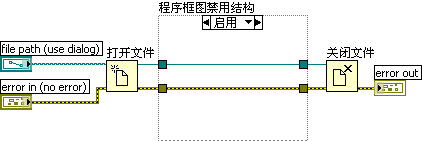

当再次需要运行这一段写入文本文件的代码时，把这个禁用分支设为“启用”分支即可，程序框图禁用结构边框上右键再点击选择“启用本程序框图...”。

在调试程序时常常要用到程序框图禁用结构，它的功能与用法相当于在调试文本编程语言程序时，将某些代码段注释起来。它可以帮助寻找并定位有错误的代码。对某段程序代码有怀疑，可以先禁用疑似有问题的部分，再逐步启用和禁用更小范围内的代码，最终定位到有错误的连线或节点。

程序框图禁用结构还可以用于其它一些场合，比如，在调试程序时，通常需要用写文件的方式记录下程序运行过程中的某些数据，但在程序发布后，就不再需要记录数据了。可以把记录数据文件这部分的代码放置在禁用结构中。调试时，启用这段代码；正式发布程序时，禁用它。

程序框图禁用结构与条件结构最重要的不同之处在于：程序框图禁用结构中启用哪个分支，是在编辑程序时决定的；而条件结构中执行哪一分支的代码，是程序运行中决定的。

运行程序时，禁用分支中的程序并不被生成可执行代码。如果被禁用的分支中包含了子 VI，LabVIEW 也不会把这些子 VI 调入内存。因此，使用禁用结构并不会影响程序的运行效率。如果程序框图禁用结构中，被禁用的分支有错误，比如把不同数据类型的接线端连接在一起了，这些错误都不会影响到 VI 的运行。

对于条件结构，LabVIEW 预先并不知道会执行到哪些分支，所以需要要把每一分支的程序都生成可执行代码，所有用到的子 VI 都装入内存之中。如果任何一个分支内的代码有错误，整个 VI 都无法运行。

### 条件禁用结构 （Conditional Disable Structure）

#### 系统预定义符号

条件禁用结构的许多特性与程序框图禁用结构类似：它也是在编辑时决定要运行哪一个分支的。两者的区别在于：条件禁用结构是根据用户设定的符号的值来判断决定执行哪个分支上的程序的。它有些类似 C 语言中的 #ifdef 宏。条件禁用结构通常被用在跨平台上的程序中。

如果一个项目需要支持多个操作系统，我们当然可以为每个操作系统都编写一套包含所有子 VI 的完整的程序，但采用这种方式，程序中每个 VI 都需要同时维护多个版本，经管很多 VI 在每个操作系统上都是一模一样的，这极大增加了维护工作量。使用条件禁用结构，我们可以把针对不同操作系统的代码分别写在条件禁用结构的不同分支内，LabVIEW 会根据 VI 运行的系统选择正确的分支运行。这样，一个程序就可以适应所有的操作系统，最大可能的降低了维护成本。

打开一个 VI，在其中放置一个条件禁用结构。此时，条件禁用结构仅包括一个“默认”分支。

鼠标右键点击结构的边框，在快捷菜单中选择“编辑本子程序框图的条件”，弹出“配置条件框”。

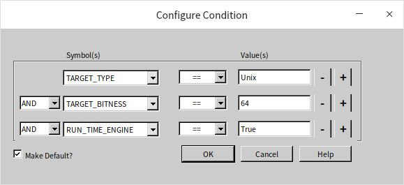

配置条件框上的“符号”可以是系统与定义好的一些符号，比如 TARGET_TYPE，TARGET_BITNESS 和 RUN_TIME_ENGINE。“值”则是“符号”对应的数值。配置条件框配置的是个条件可以选相等或不想等。比如 TARGET_TYPE 表示当前 VI 运行的操作系统，大多数读者使用的是 Windows 操作系统,如果配置条件框为条件禁用结构的某一分支配置了“TARGET_TYPE == Windows”，那么这个分支的条件就满足了，这个分支就会编程启动状态。笔者使用的操作系统是 Linux，LabVIEW 中对应 Linux 的 TARGET_TYPE 的值是 Unix，所以在笔者的电脑上，这一个分支是被启用的：

TARGET_BITNESS 用于判断计算机上安装的是 32 bit 还是 64 bit 的 LabVIEW； RUN_TIME_ENGINE 则用 True 来表示 VI 被制作成了一个 DLL 共享库； False 表示 VI 被制作成了一个 EXE 应用程序。

一个应用程序如果需要保存一些设置信息，在 Windows 操作系统下可以选择保存在注册表中；而在 Linux 系统下则通常保存在配置文件里。Linux 等系统是没有注册表的，如果只写一份使用注册表的程序，在 Linux 操作系统下就无法运行？

那么，是否可以使用[条件结构](structure_cond_seq)来区分当前的操作系统，选择不同的代码运行呢？条件结构运行哪一分支是在程序运行时决定的。程序运行时的确可以判断当前操作系统是什么，但问题在于，使用条件结构，程序装载时会检查所有条件结构分支中的代码，任何一个分支内的代码有错误，整个 VI 都无法运行。程序在 Linux 操作系统那个分支中找不到这注册表操作函数，出错，于是 VI 无法运行。

为了使这个 VI 也能够在其它操作系统下顺利运行，必须把平台相关的代码都放置在条件禁用结构中。在 MacOS 或 Linux 操作系统中，LabVIEW 不会试图装载 "TARGET_TYPE == Windows" 分支中的代码，代码的错误会被忽略：

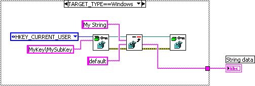

上图中的三个子 VI 均位于 "互连接口 -\>Windows 注册表访问 VI" 函数子选板，依次为 "打开注册表项"、"读取注册表值" 和 "关闭注册表项"。

#### 用户自定义符号

条件禁用结构还可以使用项目或项目运行的目标机器所定义的符号。

在项目浏览器的“我的电脑”项的鼠标右键菜单中选择“属性”，弹出“我的电脑属性”对话框：

我们可以在属性对话框中的“条件禁用符号”栏，添加了一个自定义的符号 "User"，它的值是 "QizhenRuan"。这样就可以在该运行目标机器下的 VI 中使用这一符号了：

在程序中，有时可能需要为不同的用户定制某些不同的服务：发布给不同用户的软件，基本功能是相同的，但在个别地方需要使用不同的代码。这种情况可以考虑使用条件禁用结构，用它来处理各用户之间有差异的代码。程序发布给不同用户时，只需更改一下项目属性中条件禁用符号的值即可。

程序框图禁用结构中，只能有一个启用分支，但条件禁用结构不同，可以有多个满足了条件的启用分支。比如，一个分支的条件是 TARGET_TYPE == Windows，另一个分支的条件是 TARGET_BITNESS == 64，那么两个分支在 Windows 64 计算机上都满足。在这种情况下，只有排在前面的，第一个被启用的分支会被程序装载和执行。

#### 调试时专用代码

有的时候，某种错误只在程序正常运行时出现，但试图暂停或使用断点、探针等调试工具时，错误却消失了。有的时候，程序运行必须关闭所有的调试信息，或者出错的代码部分不允许使用 LabVIEW 的调试环境（比如代码运行在 LabVIEW RT 设备上）。在不能使用 LabVIEW 调试工具的情况下，调试起来就麻烦多了。对于这一类程序，可以采用其它方法来观察程序运行过程中的数据。比如，让数据通过弹出对话框显示出来，或者把数据记录在文件中。通过观察被显示或记录下来的数据，判断程序是否有错。

上图是一个使用文件记录程序运行中临时产生的一些数据的例子。假设，由于某种原因这个 VI 不能使用 LabVIEW 调试工具，但它通过调用 "数据记录.vi" 就可以把程序运行中重要的数据了记录下来。待程序运行结束，便可以在记录的文件中查阅这些数据。记录数据 VI 是程序功能之外额外增加的逻辑，它会增加程序对资源的消耗，降低程序效率。所以在不需要调试的时候，还是希望将其关闭的。一个解决方案是，可以在程序的项目中自定义一个“DEBUG”符号，如果 DEBUG == 1 则启动数据记录，反之则禁用数据记录：

