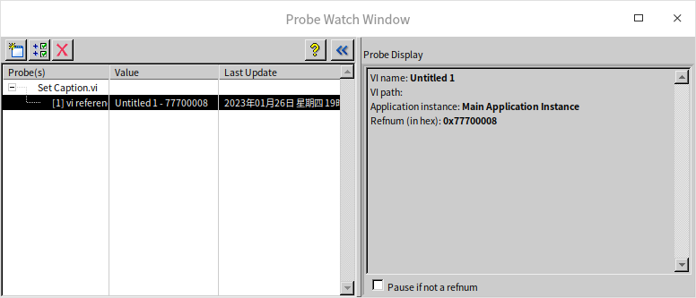
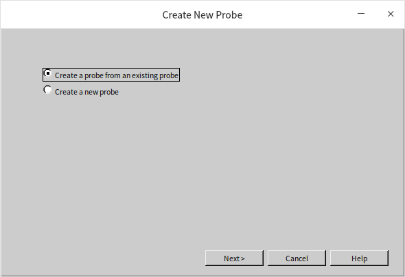
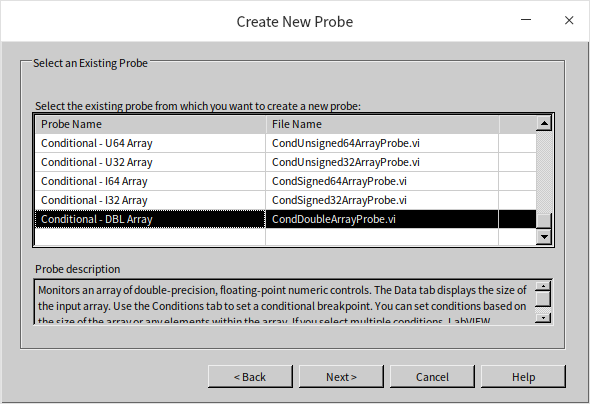
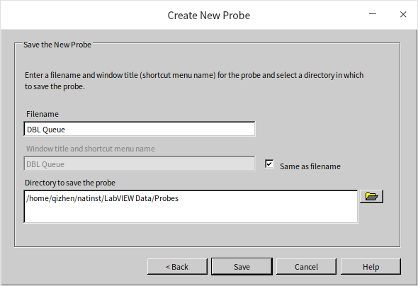
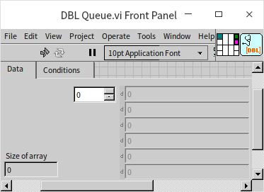
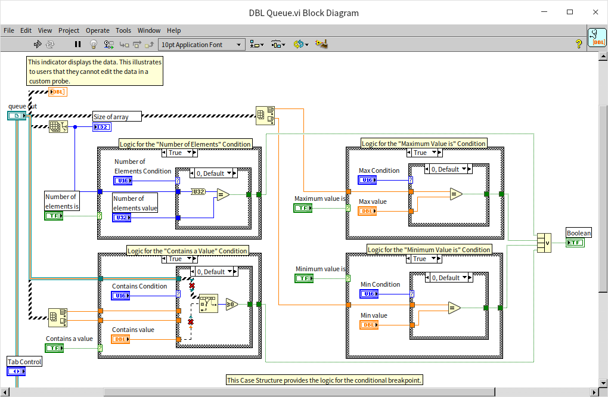
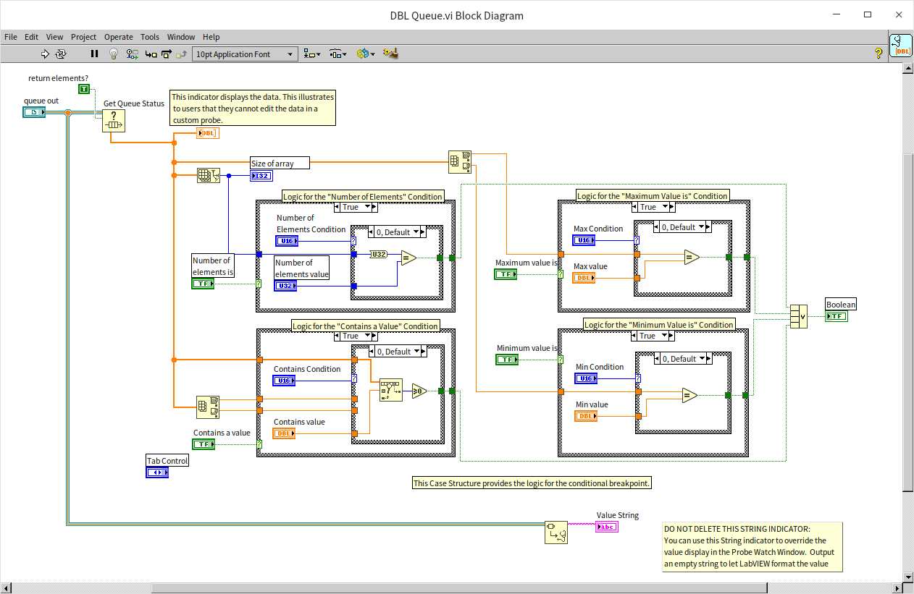
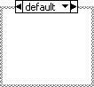
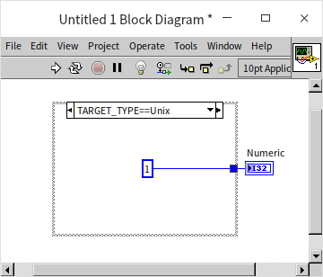

# Debugging

## Integrated Debugging Environment

### Identifying Compilation Errors

The toolbar on the block diagram window of a VI contains several debugging tools designed to help programmers locate and fix errors in their code.

LabVIEW is capable of identifying certain errors, such as missing necessary inputs or incorrect data type connections, in real-time as the VI is being edited. When such errors are detected, LabVIEW changes the "Run" button to a broken arrow icon, indicating the "List Errors" function:

Clicking on this button opens the "Error List" window, which displays the detected errors within the program:

The Error List window lists the VIs that contain errors and specifies the nodes within those VIs that are problematic. Beyond showing errors that prevent the program from running, it also offers warnings about potential issues, suggesting areas of the program that might need attention.

Double-clicking an item in the list opens the affected VI and directly highlights the area where the error occurs, facilitating quick navigation and correction of the issue.

### Runtime Debugging Tools

Certain errors, like logical flaws within a program, can't be automatically detected by LabVIEW during the editing phase. These issues only become evident when the program either behaves incorrectly or fails to deliver the anticipated results. Addressing such errors begins with pinpointing the error's location within the program to facilitate targeted corrections.

A common strategy for error localization involves pausing the program just before a potential error site and then proceeding with step-by-step execution. This involves scrutinizing the output of each function or node after execution to check if it aligns with the expected outcome. If discrepancies or errors start to emerge following a specific step, it's likely that the root cause lies there.

The VI's block diagram window toolbar features several debugging tools, such as "Pause" and "Step Into", intended to aid in this process. Below is the block diagram of a VI in the midst of execution. For those with debugging experience in other programming languages, the functions of these toolbar icons will likely be familiar:

 is used to halt the execution of the entire program. This button is useful when you decide to stop the program's execution partway through.

 toggles the pause or continuation of the program's execution. This button can pause a running program or resume a paused program, allowing it to either run to completion or pause again at the next breakpoint.

 activates highlight execution. With highlight execution, LabVIEW decelerates code execution and highlights each node as it executes. Given the slow pace of highlight execution, it should be used cautiously. If it's enabled and a VI's front panel is set to "modal" (accessible via "Window Appearance" in the VI's properties), discontinuing it midway becomes impossible. The only alternatives are to wait until the program completes or to forcibly end the LabVIEW process. A modal front panel or window means it stays forefront, preventing interaction with any other windows of the same program until closed. Typically, program dialog boxes are modal.

Highlight execution visibly demonstrates data flow through the block diagram with a moving dot along the wires, offering an intuitive view of the program's execution path.

 preserves the data flowing through a VI's block diagram wires. Once activated, data passing through a wire post-execution is captured for later examination with probes.

 facilitates stepwise execution, with each button designed for stepping into, over, or out of nodes, structures, or sub-VIs.

 The dropdown menu illustrates the VI's calling hierarchy. If the debugged VI is a sub-VI, this menu displays its call hierarchy, showing the layers of calls from lower to higher levels. Selecting an option jumps directly to that VI.

Beyond the aforementioned tools, debugging often involves setting breakpoints and using probes on the block diagram. A breakpoint on a wire is marked by a red dot: . If placed on a node, the node gets encircled in a red box. Probes, which can only be attached to wires, are indicated by a label: , with the label's number identifying the probe. Data at the probe's location is then shown in a pop-up window as depicted below:

### Global Options

LabVIEW's options dialog box, accessible through the "Tools -> Options…" menu, contains several debugging-related settings. In older LabVIEW versions, these settings were grouped on a dedicated "Debugging" page:

In more recent LabVIEW versions, these settings have been merged into the "Environment" section:

Some of the common settings include:
- "Show data flow during highlight execution" enables visualization of data movement during highlight execution.
- "Probe values automatically during highlight execution" shows the data values as they exit each terminal during highlight execution.
- "Show warnings in Error List dialog box by default" ensures that warning messages are displayed in the error list dialog by default.
- "Prompt for internal errors on launch" initiates a check for internal errors upon starting LabVIEW.

### VI Properties

Certain settings of a VI, such as being configured to disallow debugging, can make the VI non-debuggable. Turning off debugging for a VI can significantly enhance its execution speed and minimize memory consumption. Hence, it is advisable to set VIs to be non-debuggable before distributing them to users. If you're working with a VI obtained from someone else and find that it cannot be debugged, the first step is to check whether it has been configured to disallow debugging. If this is the case, you can alter its settings to enable debugging before proceeding with your debugging efforts:

There are scenarios where a VI may be inherently undebaggable. For example, if the VI is protected by a password that you do not have, or if the VI's block diagram was removed at the time of saving.

## Breakpoints and Probes

Breakpoints and probes stand as the most frequently utilized tools for debugging in LabVIEW.

### Breakpoints

In LabVIEW, breakpoints are straightforward and intuitive both in their application and functionality. By employing the breakpoint tool  found on the tools palette (as illustrated below), you can set or remove breakpoints with a simple mouse click at the desired code location. Alternatively, you can right-click on a node or a wire in the block diagram and select the menu option to set or clear a breakpoint, enabling you to add or remove them as needed.

Breakpoints can be positioned virtually anywhere within a program. Execution pauses when it reaches a breakpoint, awaiting further action from the debugger. Unlike many other programming environments that feature conditional breakpoints, LabVIEW does not offer a direct equivalent. Instead, LabVIEW employs conditional probes to fulfill the role of conditional breakpoints.

If a VI prohibits breakpoint setting, it's likely configured to disable debugging. This setting can be easily changed by adjusting the VI's properties to permit debugging.

It's important to note that breakpoints can be preserved within a VI. Closing a VI that contains saved breakpoints means the program will halt at these breakpoints during subsequent executions, and the VI will automatically open. Therefore, before distributing software to users, it's critical to ensure no breakpoints remain in the program to prevent unintended pauses during runtime. Accessing the "View -> Breakpoint Manager" menu reveals all breakpoints across VIs in memory, offering a centralized management point. Here, for instance, you can opt to remove all breakpoints at once:

### Probes

Probes in LabVIEW serve a similar purpose to the watch windows found in other programming languages' debugging environments, displaying data for variables in their current state. However, LabVIEW distinguishes itself as a dataflow-driven graphical programming language, primarily facilitating data transmission not through variables but via connections (wires) between nodes. Consequently, LabVIEW's probes are designed to attach to these wires rather than variables.

Adding probes is straightforward: you can use the probe tool from the tools palette or right-click directly on a wire within the block diagram and select the probe option to attach a probe to a data wire. LabVIEW showcases probe data graphically in a floating window display. The probe window is bifurcated into two sections: the left side lists all active probes within the current program, highlighting a selected probe and displaying its value in the "Probe Display" area on the right. For instance, a probe added to a wire carrying numerical data defaults to a numeric display control:

Probes placed on error in/out wires manifest as error clusters:

Occasionally, for a more helpful debugging insight, probes might utilize control types different from the wire’s data type to display comprehensive details and values of reference types, as illustrated below:

### Customizing Probes with Different Controls

Should developers find the default probe for a data wire unsuitable or aesthetically displeasing, LabVIEW allows for the customization of probes. By right-clicking on the data wire and selecting "Custom Probe -> Controls ->…", a different control can be chosen from the ensuing control palette as the probe:

For the probe to be successfully created, the data type of the chosen probe control must align with the data type of the wire.

### Conditional Probes

Breakpoints traditionally pause program execution at their locations each run. However, there might be occasions where a debugger wishes for the program to only pause when the monitored data meets certain criteria. For instance, if data is expected to be greater than or equal to zero, the program should pause if it dips below zero. LabVIEW addresses this need through conditional probes.

For example, to make a loop pause only at its 8th iteration, employing a conditional probe is necessary. By right-clicking on the wire outputting the loop counter 'i' and selecting "Custom Probe -> With Condition…", a conditional probe can be established. Within the probe's condition tab, you can specify the exact conditions that, when met, will cause the program to pause, thus waiting for further actions from the debugger. In this case, setting the condition for when 'i' equals 7 effectively pauses the program at the 8th iteration, ready for detailed debugging.

### Custom Probes

In debugging scenarios, there may be a need for probes to display more detailed data than what LabVIEW's built-in probes can offer. For instance, when applying a probe to queue data types, the default LabVIEW probe only shows a 32-bit integer representation of the queue, which isn't particularly helpful for debugging purposes. Debuggers might prefer to see the actual contents within the queue elements.

LabVIEW's selection of probe types is limited, but developers have the flexibility to create custom probes tailored to their specific debugging requirements.

A custom probe is essentially a VI. LabVIEW includes a variety of pre-made probes located in the `[LabVIEW]\vi.lib\_probes` folder. By exploring the VIs in this folder, you can gain insights into how existing custom probes are designed, such as the ConditionalSigned32.vi, which serves as an example of an I32 type conditional probe. Examining these probes can provide valuable reference points before embarking on creating a new custom probe.

To start creating a custom probe, right-click on the data wire for the desired data type and select "Custom Probe -> New". LabVIEW then launches a wizard to guide you through specifying the necessary information for the custom probe creation. The initial step asks whether to use a template. Although it's possible to build a completely new probe from scratch, using an existing probe as a template can save time and effort due to similarities in design, such as user interfaces:

Moving to the next step, the wizard displays all available probes. Given that data in queues resembles array data, an array probe can be utilized as a template for crafting a probe suitable for queues:

The next step is to name the probe. Since the focus is on a queue of double-precision floating-point numbers, the new probe could be named "DBL Queue":

With all necessary information provided, LabVIEW automatically generates the custom probe VI's framework. The appearance of this framework VI's front panel, which dictates the probe's look, is as follows:

Although this appearance can be adjusted to meet specific needs, in this example, the goal is simply to display the values of data within the queue, and the default appearance is adequate, requiring no modifications. The block diagram of this framework VI, inspired by an array probe, is not equipped to directly process queue data and thus cannot run as-is:

Minimal modifications are necessary. By employing the "Get Queue Status" function to extract queue data as an array, the rest of the program can effectively utilize the code generated within the framework:

These modifications endow the new probe with the ability to inspect the contents within the queue:

### Independent Probe Monitoring Windows

LabVIEW typically consolidates data from all probes into one unified window. However, in versions prior to LabVIEW 2009, each probe was displayed in its own window. The modern integrated probe manager offers a cleaner interface, yet it limits visibility to the value of a single probe at a time. When debugging, there's often a need to simultaneously monitor multiple probes' values. To emulate the display method of older LabVIEW versions, you can select a probe in the probe monitor window and click the "Open in New Window" button at the top left corner. This action creates a separate window for that specific probe, enabling the simultaneous viewing of different probes' data:

## Disabling Structures

In addition to the commonly used debugging tools of breakpoints and probes, sometimes additional tools and methods are essential to locate the source of a program's issues.

The first step in debugging an erroneous program is identifying the location of the error. Often, this involves using probes to track data changes throughout the execution. If the output from a particular node does not match expectations, it's likely the source of the problem. However, some errors are not so straightforward to diagnose.

For example, errors like array out-of-bounds may not manifest immediately at the point of error; the program might instead crash or produce an error after an indeterminate amount of further execution. Furthermore, the exact location of failure or error may change with each debugging session. Even if the final faulty code segment is identified, it might be a basic LabVIEW node, which doesn't allow further internal debugging. Such nodes are almost certainly not the error source, indicating the actual mistake lies elsewhere.

Errors caused by the timing of multiple threads present another challenge. Introducing breakpoints or probes can change the program's timing, causing it to behave correctly during debugging but fail during normal operation.

When breakpoints and probes prove ineffective, a different strategy for isolating faults involves removing parts of the code to see if the issue persists. If the problem is resolved, the removed code likely contains the error. Otherwise, the fault must be within the code that remains. This technique helps narrow down the potential problem areas. By repeatedly removing suspected sections of the problematic code and re-evaluating, you can gradually narrow the search field and pinpoint the error's location.

### Diagram Disable Structure

The Diagram Disable Structure in LabVIEW bears resemblance to [Conditional Structures](structure_cond_seq) but differs fundamentally in how it operates. Unlike Conditional Structures, which determine the execution path based on runtime inputs, the execution branch within a Diagram Disable Structure is predefined during the program's editing phase. This structure can host multiple branches, yet only one will be marked as "Enabled", with all others being "Disabled". Only the "Enabled" branch is executed during runtime.

For scenarios where a portion of the code needs to be temporarily bypassed, employing a Diagram Disable Structure is an effective strategy. Take, for instance, a program segment that writes the string "test" to a file. If it's uncertain whether this operation will be needed, but both possibilities require debugging, wrapping this segment with a Diagram Disable Structure from the functions palette can be a solution:

With the Diagram Disable Structure in place, the code within the disabled branch that writes to the text file is temporarily skipped:

Upon disabling the file-writing operation, an "Enabled" branch is automatically generated by the structure. It may be necessary to adjust this enabled branch to ensure the program logic and data output remain accurate. In the example shown below, connecting the file handle and error data through the structure's tunnels is essential for maintaining correct data flow in subsequent program operations:

To reactivate the file-writing code, simply convert the disabled branch back to "Enabled" by right-clicking on the structure's border and selecting "Make this Subdiagram the Enabled one…".

Diagram Disable Structures are invaluable for debugging, acting similarly to the practice of commenting out code segments in text-based programming. They facilitate the identification and localization of code errors. By initially disabling a suspected code section and then methodically enabling or disabling smaller segments, it’s possible to isolate and identify the erroneous connection or node.

Diagram Disable Structures also find utility in situations like debugging, where logging data to a file is necessary but not required in the final program version. Placing the logging code within a disable structure allows for its activation during debugging phases and deactivation for the program's release.

The critical distinction between Diagram Disable Structures and Conditional Structures lies in the selection of the active branch: for Diagram Disable Structures, this choice is made during editing, whereas for Conditional Structures, it's determined at runtime.

Execution efficiency is preserved as disabled branches do not generate executable code. If a disabled branch contains subVIs, LabVIEW does not load these into memory, ensuring the disable structure's use does not impact program performance. Errors within a disabled branch, such as incorrect terminal connections, do not affect the VI's operation.

In contrast, Conditional Structures necessitate preparation of executable code for each branch and the loading of all relevant subVIs into memory. If any branch harbors errors, the entire VI is compromised.

### Conditional Disable Structure

#### System Predefined Symbols

The Conditional Disable Structure shares functionalities with the Diagram Disable Structure, with both determining which branch to execute during the editing phase, not at runtime. The distinction lies in the Conditional Disable Structure's reliance on user-defined symbols to decide which branch's code to execute, akin to the #ifdef macro in C programming. This structure is particularly useful in cross-platform applications.

For projects that need to support multiple operating systems, one could theoretically write a complete program with all sub-VIs for each OS. However, this approach would require maintaining several versions of each VI, a cumbersome task especially when many VIs are identical across OSes. The Conditional Disable Structure allows for segregating code tailored to different operating systems into distinct branches, with LabVIEW selecting the appropriate branch based on the system executing the VI. This strategy enables a single program to adapt to various operating systems, greatly reducing maintenance efforts.

Placing a Conditional Disable Structure in a VI initially shows only a "Default" branch.

Right-clicking the structure's border and choosing "Edit This Subdiagram's Condition" opens the "Configure Condition" dialog.

The "Symbols" in the dialog can be system-defined symbols such as TARGET_TYPE, TARGET_BITNESS, and RUN_TIME_ENGINE, with "Value" being their respective values. Conditions can be set to equal or not equal. For instance, TARGET_TYPE reflects the operating system the VI runs on. If a branch is configured with "TARGET_TYPE == Windows", it meets the condition for activation. On my Linux system, the corresponding value for Linux in LabVIEW is Unix, hence this branch is enabled:

TARGET_BITNESS identifies whether the computer has a 32-bit or 64-bit LabVIEW installed; RUN_TIME_ENGINE indicates whether the VI has been compiled into a DLL shared library (True) or an EXE application (False).

In scenarios where an application needs to save settings, Windows systems may use the registry, whereas Linux systems typically use configuration files. Without a registry in Linux, how could a program designed for registry use run on Linux?

Could a [Conditional Structure](structure_cond_seq) differentiate the current OS and execute accordingly? While Conditional Structures determine the execution branch at runtime and could identify the OS, the loading phase checks all code within each branch of a Conditional Structure. Any error in any branch prevents the VI from running, making registry function calls on Linux problematic.

To ensure smooth operation on other OSes, platform-specific code must reside within a Conditional Disable Structure. For macOS or Linux, LabVIEW does not attempt to load the "TARGET_TYPE == Windows" branch, ignoring any code errors:

The three sub-VIs shown are found under "Connectivity -> Windows Registry Access VIs", specifically "Open Registry Key", "Read Registry Value", and "Close Registry Key".

### User-Defined Symbols

Conditional Disable Structures can leverage symbols defined either by the project or the target machine where the project is executed.

Accessing the "My Computer" properties in the Project Explorer (by right-clicking and selecting "Properties") opens the "My Computer Properties" dialog:

In this dialog, under the "Conditional Disable Symbols" section, you can add a custom symbol, such as "User", with the value "QizhenRuan". This symbol then becomes available for use within VIs running on that specific target machine:

There are scenarios in program development where certain features need to be customized for different users: while the core functionality remains the same, specific parts of the code may need to vary. In such cases, the Conditional Disable Structure can be employed to manage these variations. When distributing the program to different users, adjusting the value of the conditional disable symbol within the project properties can easily accommodate these differences.

Unlike the Diagram Disable Structure, where only one branch can be enabled, the Conditional Disable Structure allows for multiple branches that satisfy their conditions to be enabled simultaneously. For instance, if one branch is conditioned on TARGET_TYPE == Windows and another on TARGET_BITNESS == 64, both conditions could be met on a 64-bit Windows machine. In this scenario, only the first enabled branch encountered by LabVIEW will be loaded and executed.

#### Debugging-Specific Code

Occasionally, errors might manifest only during the normal run of a program and vanish when using debugging tools like breakpoints or probes. There are also situations where a program must operate without any debugging information or where the segment of code causing issues cannot be debugged using LabVIEW’s environment (e.g., when the code is running on a LabVIEW RT device). Debugging without LabVIEW tools can be significantly more challenging. For these programs, alternative methods for observing runtime data might involve displaying data through dialog boxes or logging it to files. By examining the data that has been displayed or logged, errors within the program can be identified.

The figure above shows an example of using file logging to capture some temporary data produced during the program's execution. Assume this VI cannot utilize LabVIEW's debugging tools for certain reasons. However, by calling "Data Logging.vi", it's possible to log crucial data as the program runs. After the program concludes, this data can be reviewed in the logged file. Implementing a data logging VI adds extra logic outside the program's main functions, consuming more resources and potentially reducing efficiency. Thus, it's preferable to disable this functionality when not required for debugging. A practical solution involves defining a "DEBUG" symbol within the project settings, enabling data logging when DEBUG == 1 and disabling it otherwise:

