# Debugging in LabVIEW

## Integrated Debugging Environment

### Identifying Compilation Errors

The toolbar on the Block Diagram window of a VI contains several debugging tools designed to help programmers locate and fix errors in their code.

LabVIEW is capable of identifying compilation errors—such as missing required inputs or incorrect data type connections—in real-time as the VI is being edited. When such errors are detected, LabVIEW changes the **Run** button to a broken arrow icon, indicating the VI has errors and cannot run:

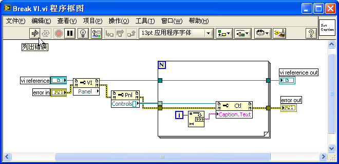

Clicking the broken Run button opens the **Error List** window, which displays all detected errors within the program:

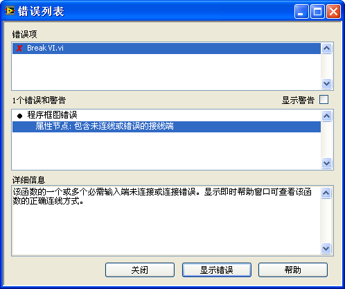

The Error List window lists the VIs that contain errors and specifies the exact nodes or wires that are problematic. Beyond showing errors that prevent the program from running, it also offers warnings about potential issues, suggesting areas of the program that might need attention.

Double-clicking an item in the list opens the affected VI and highlights the problematic area, facilitating quick navigation and correction.

### Runtime Debugging Tools

Logical flaws within a program cannot be automatically detected by LabVIEW during the editing phase. These issues only become evident when the program behaves incorrectly or fails to deliver the anticipated results during execution. Finding these errors begins with pinpointing where the logic deviates from expectations.

A common strategy for isolating faults involves pausing the program just before a suspected error site and then executing it step-by-step. By examining the outputs of each node or subVI after it executes, you can check if they align with expectations. If discrepancies emerge after a specific step, the root cause likely lies there.

The Block Diagram toolbar features several debugging tools to aid in this process. Below is the Block Diagram of a VI in the midst of execution. For those with debugging experience in other programming languages, the functions of these toolbar icons will be familiar:

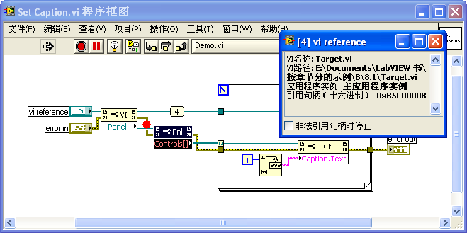

- **Abort Execution** : Halts the execution of the entire program immediately. This should be used as a last resort, as it does not allow the program to clean up resources (such as file handles or hardware sessions) gracefully.
- **Pause** : Pauses or resumes program execution. Clicking this button pauses the running program, allowing you to examine data, or resumes a paused program so it can run to completion or hit the next breakpoint.
- **Highlight Execution** : Toggles execution highlighting. When active, LabVIEW slows down code execution and animates the movement of data along wires using bubbles, highlighting each node as it executes. Because execution highlighting significantly reduces execution speed, use it with caution. If it is enabled and a VI's Front Panel window appearance is set to modal, aborting the VI mid-execution via the user interface can be impossible. You must either wait for the program to finish or force-kill the LabVIEW process. A modal window remains in the foreground and blocks interaction with other windows in the application until it is closed.
- **Retain Wire Values** 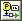: Saves the data flowing through the wires. Once activated, values passing through the wires are captured and can be inspected post-execution using probes.
- **Single Stepping** : Allows step-by-step execution. These buttons are designed for **Step Into**, **Step Over**, and **Step Out** of nodes, structures, or subVIs.
- **Call List** 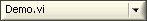: A dropdown menu displaying the VI's calling hierarchy. If the VI being debugged is a subVI, this menu displays the hierarchy of caller VIs from lower to higher levels. Selecting a VI from this list opens its Block Diagram.

Beyond these tools, debugging often involves setting breakpoints and using probes on the Block Diagram. A breakpoint on a wire is marked by a red dot 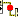; on a node, the node is encircled in a red box. Probes attached to wires are indicated by a numbered label 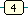. The data at the probed wire is displayed in a separate window:

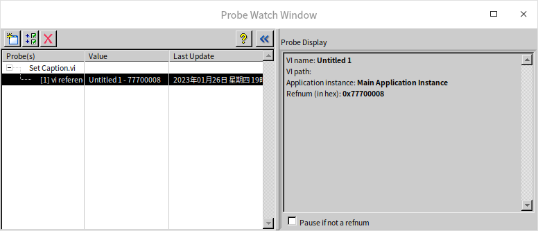

### Global Options

LabVIEW's Options dialog (accessible via `Tools -> Options...`) contains several debugging-related settings. In older versions, these settings were grouped on a dedicated **Debugging** page:

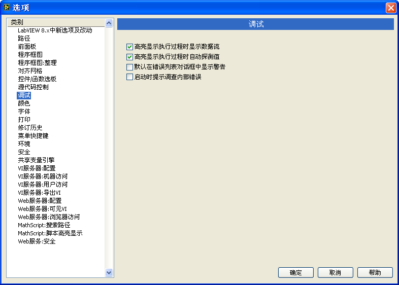

In modern versions, these settings are located in the **Environment** category:

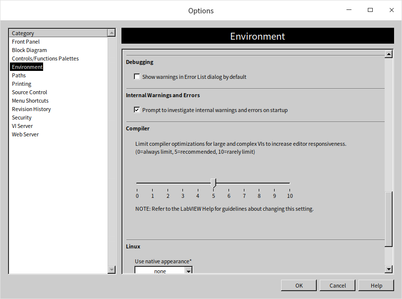

Some common settings include:
- **Show data flow during highlight execution**: Visualizes data movement along wires during execution highlighting.
- **Probe values automatically during highlight execution**: Displays data values next to terminals as they execute.
- **Show warnings in Error List dialog box by default**: Ensures warning messages are displayed in the Error List by default.
- **Prompt for internal errors on launch**: Triggers a diagnostic check for internal LabVIEW errors upon startup.

### VI Properties

VIs can be configured to disallow debugging, which optimizes execution speed and minimizes memory usage. It is common practice to disable debugging for VIs before building and distributing them to users. 

If you are working with a VI and find that debugging tools are unavailable, check its properties. You can enable debugging by going to `File -> VI Properties`, selecting the **Execution** category, and checking the **Allow debugging** box:

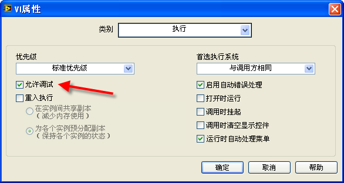

Note that a VI can be inherently undebuggable if it is password-protected and locked, or if the Block Diagram was removed when the VI was saved.

## Breakpoints and Probes

Breakpoints and probes are the most frequently used tools for debugging in LabVIEW.

### Breakpoints

In LabVIEW, breakpoints are highly visual and intuitive. By selecting the **Breakpoint Tool**  from the Tools Palette (shown below), you can set or clear breakpoints with a single click on any wire or node. Alternatively, you can right-click a node or wire and select **Breakpoint -> Set Breakpoint** from the context menu.

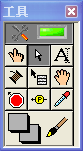

Execution pauses when it reaches a breakpoint, allowing you to use single-stepping or probes to examine the state of the program. Unlike text-based environments that feature conditional breakpoints directly, LabVIEW handles conditional pausing through **Conditional Probes**.

If a VI does not allow you to set breakpoints, check the VI Properties to ensure **Allow debugging** is enabled.

Breakpoints are saved with the VI. If you close a VI with active breakpoints, execution will still pause at them next time the VI is run, automatically opening the Block Diagram. Therefore, before distributing VIs, ensure you remove all breakpoints. You can manage and clear all breakpoints in memory by opening the **Breakpoint Manager** via `View -> Breakpoint Manager`:

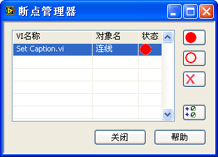

### Probes

Probes in LabVIEW serve a similar purpose to watch windows in text-based programming environments, displaying data values at runtime. However, because LabVIEW is a dataflow-driven graphical language, data is passed along wires rather than stored in variables. Consequently, probes are attached directly to wires.

To add a probe, select the **Probe Tool** from the Tools Palette or right-click a wire and select **Probe**. LabVIEW displays probe data in the **Probe Watch Window**. The left side of the window lists all active probes in memory, while the right side displays the selected probe's value. A probe on a numeric wire defaults to a numeric display:

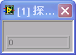

Probes on error wires automatically format as error clusters:

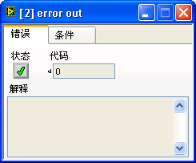

Probes display the exact data type of the wire, including complex types like clusters, arrays, and refnums:

### Customizing Probes with Different Controls

If the default probe indicator is not ideal for your debugging needs, LabVIEW allows you to customize the indicator control. Right-click a wire and select **Custom Probe -> Controls** to choose a different control (e.g., a gauge for a numeric wire):

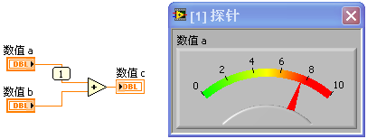

For the custom probe to display data, the control's data type must be strictly compatible with the wire's data type.

### Conditional Probes

Standard breakpoints pause execution every time the code path is hit. If you want execution to pause only when data meets a specific condition (e.g., if a sensor reading dips below zero, or a loop reaches a specific iteration), you can use a **Conditional Probe**.

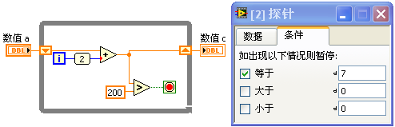

For example, to pause execution only during the 8th iteration of a loop, right-click the wire connected to the loop index terminal `i` and select **Custom Probe -> With Condition**. In the condition tab of the probe window, you can define the condition (e.g., `i == 7`). When this condition is met, LabVIEW will pause execution, allowing you to debug.

### Custom Probes

Sometimes you need to inspect internal details of a data structure that standard probes cannot display. For example, a default probe on a Queue refnum only shows the numeric value of the reference, which is not helpful. Developers usually want to inspect the elements currently inside the queue.

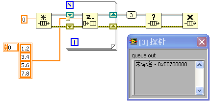

LabVIEW allows you to create custom probes to solve this problem. A custom probe is simply a VI. LabVIEW stores its built-in custom probes in the `[LabVIEW]\vi.lib\_probes` directory (for example, `ConditionalSigned32.vi` implements the conditional probe for 32-bit signed integers). You can examine these VIs for reference.

To create a new custom probe, right-click a wire and select **Custom Probe -> New**. This opens a wizard. You can choose to create a new probe from a template to inherit standard controls and formatting:

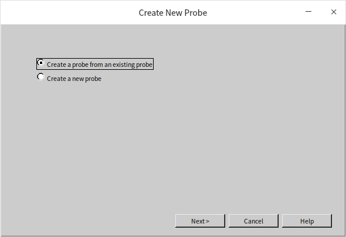

Since the data structure of a queue is sequential, we can use an array probe as a template:

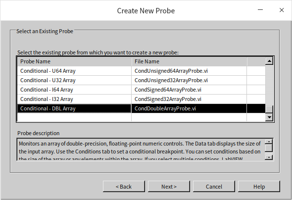

Name the new probe (e.g., `DBL Queue`):

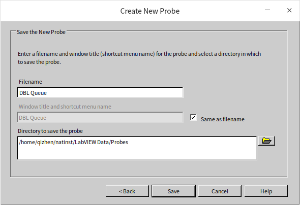

LabVIEW automatically generates the custom probe VI. Its Front Panel defines how the probe will look:

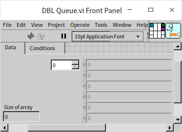

The automatically generated Block Diagram is configured for arrays and will not work directly on a Queue refnum:

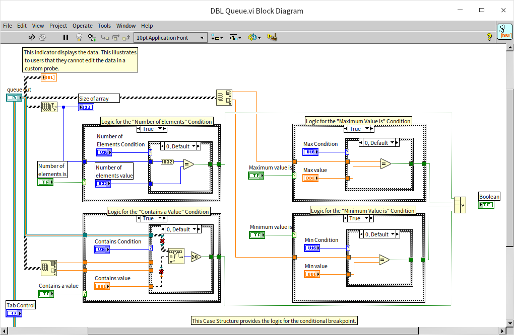

We can modify the Block Diagram to retrieve the queue elements. By calling the **Get Queue Status** function, we can extract the elements as an array and pass them to the display control:

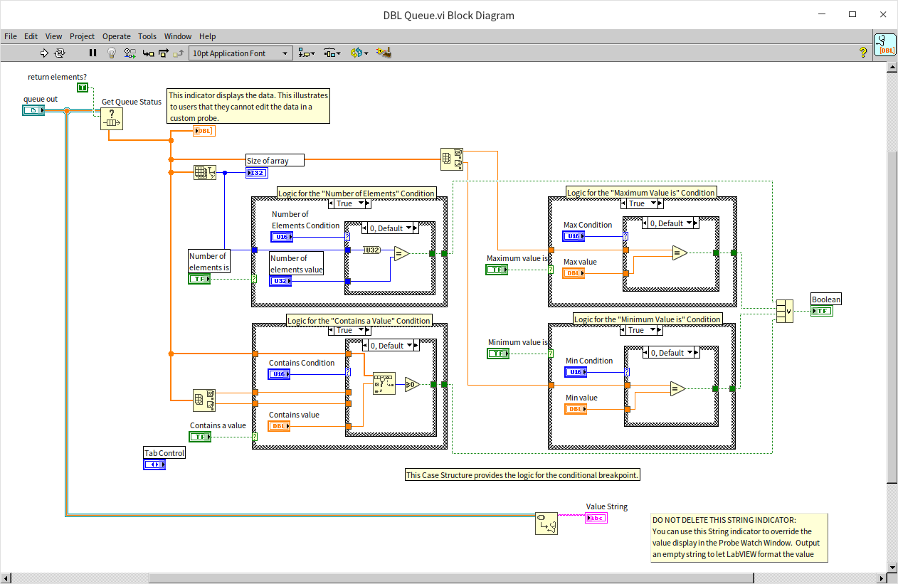

This custom probe now allows us to monitor the queue's contents in real-time during debugging:

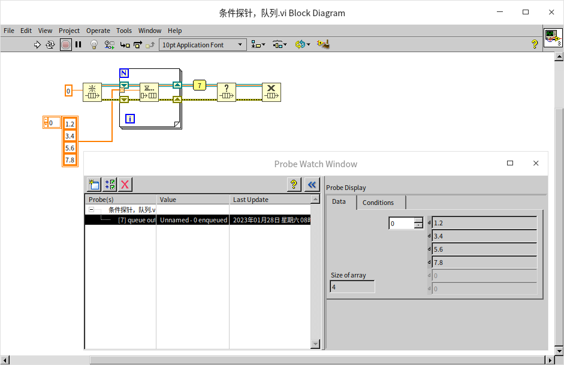

### Independent Probe Windows

By default, LabVIEW consolidates all probes into a single Probe Watch Window. If you want to monitor multiple probes simultaneously, select a probe in the manager and click the **Open in New Window** button at the top-left. This detaches the probe into its own floating window:

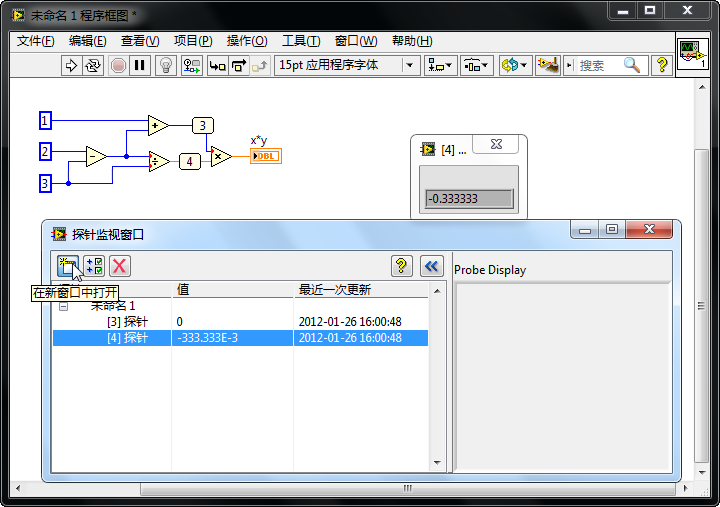

## Disabling Structures

When probes and breakpoints are insufficient to isolate an error, you can temporarily disable sections of code to narrow down the source of the issue.

Some bugs, such as array out-of-bounds or memory corruption, do not crash the program at the exact point of the error, but rather cause failures at unpredictable moments later in execution. Additionally, placing breakpoints or probes can alter execution timing in multi-threaded applications, causing race conditions to temporarily disappear during debugging (often called "heisenbugs").

By disabling specific sections of code and observing if the error persists, you can systematically isolate the bug. LabVIEW provides two structures for this purpose.

### Diagram Disable Structure

The **Diagram Disable Structure** allows you to disable sections of code on the Block Diagram. Unlike Case Structures, which select branches at runtime based on inputs, the active branch of a Diagram Disable Structure is determined statically during edit time. Only the **Enabled** subdiagram is compiled and executed; all **Disabled** subdiagrams are ignored.

For example, to temporarily bypass a file-writing operation during debugging, wrap the code in a Diagram Disable Structure:

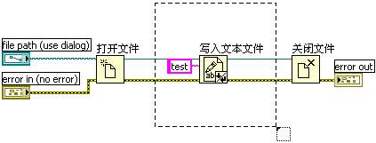

By default, the code is placed in the Disabled subdiagram:

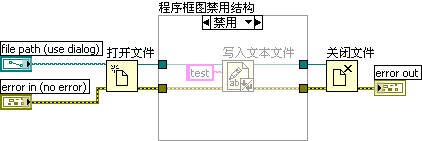

The structure automatically generates an Enabled subdiagram. You must wire the inputs and outputs (tunnels) through the structure to maintain dataflow consistency for the rest of the program:

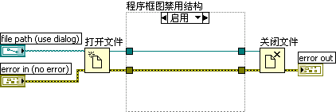

To restore the original code, right-click the border of the structure and select **Make this Subdiagram the Enabled one**.

The Diagram Disable Structure acts similarly to commenting out code in text-based languages. Because disabled branches are not compiled, any VIs located solely within a disabled branch are not loaded into memory, ensuring no runtime performance overhead. Furthermore, compilation errors within disabled subdiagrams are ignored, allowing the VI to run even if the disabled code is broken.

### Conditional Disable Structure

#### System Predefined Symbols

The **Conditional Disable Structure** compiles and executes specific subdiagrams based on conditions defined by symbols, similar to `#ifdef` preprocessor directives in C. This is particularly useful for writing cross-platform code.

If a project needs to support Windows, Linux, and macOS, writing separate VIs for each operating system is inefficient. The Conditional Disable Structure allows you to place platform-specific code in separate subdiagrams within a single VI. LabVIEW compiles only the subdiagram that matches the target platform.

When you place a Conditional Disable Structure, it contains a **Default** subdiagram:

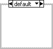

Right-click the border and select **Edit This Subdiagram's Condition** to open the configuration dialog:

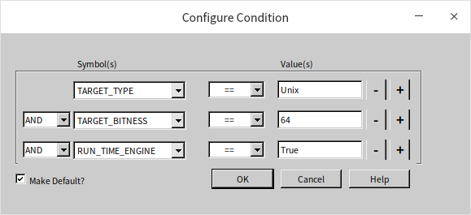

You can configure conditions using system-defined symbols such as:
- `TARGET_TYPE`: The platform type (e.g., `Windows`, `Mac`, `Unix` for Linux).
- `TARGET_BITNESS`: The bitness of the LabVIEW development environment (`32` or `64`).
- `RUN_TIME_ENGINE`: Indicates whether the code is running in the development environment (`False`) or the LabVIEW Run-Time Engine (`True`).

For instance, if a subdiagram condition is set to `TARGET_TYPE == Windows`, it will only compile and run on Windows. On Linux systems, the target type is `Unix`, so the corresponding Linux subdiagram will compile:

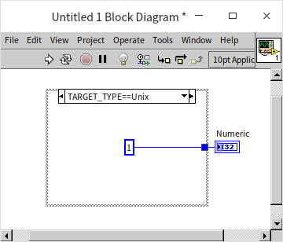

Using standard Case Structures for platform-specific code is problematic. A Case Structure evaluates conditions at runtime, meaning LabVIEW must compile all branches. If a branch contains Windows-only API calls (such as registry access VIs) and you run the program on Linux, the VI will fail to compile and cannot run. Placing the Windows-only code inside a Conditional Disable Structure configured for `TARGET_TYPE == Windows` prevents LabVIEW from compiling that branch on Linux, allowing the program to run successfully:

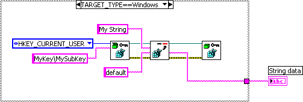

The registry VIs shown above (`Open Registry Key`, `Read Registry Value`, `Close Registry Key`) are located under `Connectivity -> Windows Registry Access`.

#### User-Defined Symbols

You can define custom symbols in the project settings. Right-click **My Computer** (or another target) in the Project Explorer, select **Properties**, and navigate to the **Conditional Disable Symbols** category:

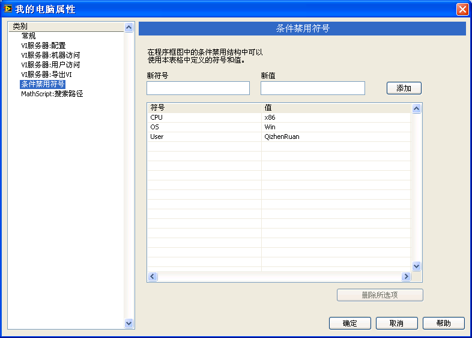

Here, you can add custom symbols (e.g., `User` with a value of `QizhenRuan`). These symbols can then be used in Conditional Disable Structures within VIs under that target:

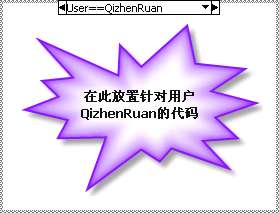

This is useful for customizing features for different deployments. By changing the symbol value in the project properties, you can easily toggle features without modifying the Block Diagram code.

Note that multiple conditions can evaluate to true (e.g., `TARGET_TYPE == Windows` and `TARGET_BITNESS == 64` on a 64-bit Windows PC). In this case, LabVIEW compiles and executes only the first matching subdiagram.

#### Debugging-Specific Code

Sometimes, bugs only manifest when a program is compiled into an executable or run on real-time target devices (such as LabVIEW RT) where standard debugging tools are unavailable. In these scenarios, you can build a custom logging system that writes diagnostic data to a file or displays it in a dialog box.

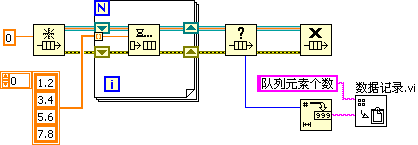

The VI above uses a custom `Data Logging.vi` to capture intermediate variables at runtime. To ensure the logging logic does not consume CPU resources or disk space in the final production release, you can wrap it in a Conditional Disable Structure tied to a custom `DEBUG` symbol:

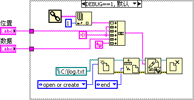
