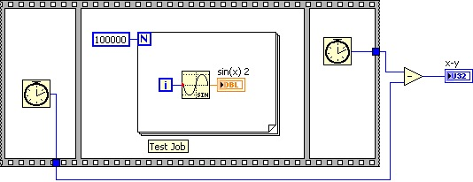
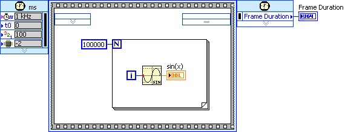
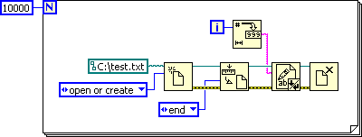
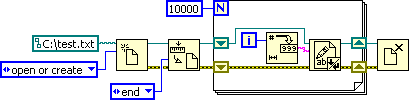
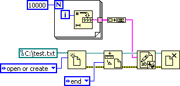
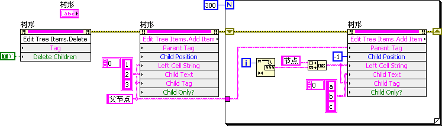
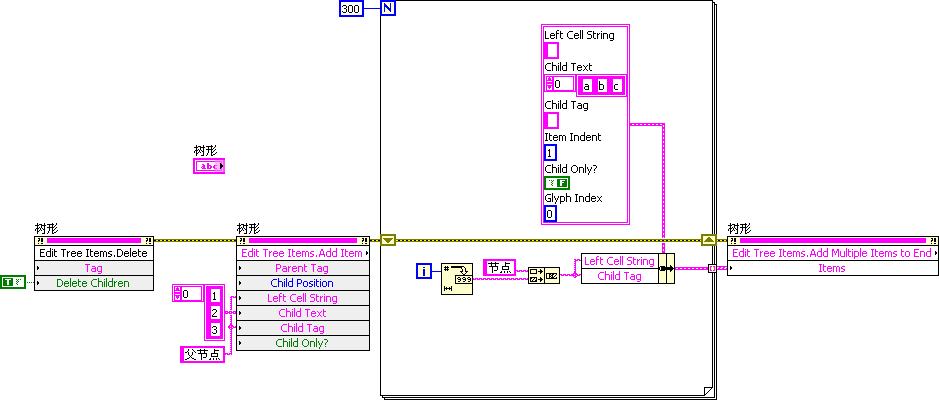
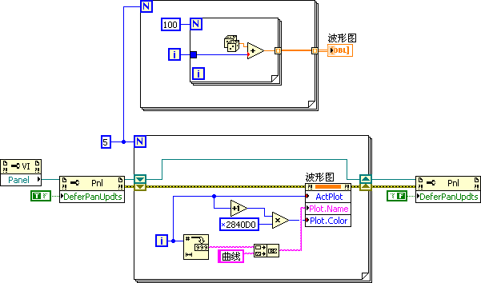
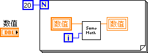
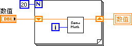

# Program Execution Efficiency

To significantly boost a program's execution efficiency, the primary step is to select efficient algorithms. If the chosen algorithm inherently lacks efficiency, no amount of code optimization can compensate for that deficiency. However, once the algorithm is set, optimizing the code can maximize the program's performance.

## Identifying Performance Bottlenecks

The key to enhancing a program's efficiency lies in pinpointing the bottlenecks that hamper its performance. According to the 80/20 rule, about 20% of the code consumes 80% of the execution time. Targeting and optimizing this critical 20% can yield disproportionately large efficiency gains.

For programs already in development, the **Profile Performance and Memory** tool can help identify how long each VI takes to run. Optimizations should focus on the most time-consuming VIs identified by this tool. Accessible via `Tools -> Profile -> Performance and Memory` in LabVIEW, this tool tracks CPU usage and memory allocation for each subVI during execution.

Here is a brief guide to using the tool: Before running the program, click the **Start** button on the tool's interface to begin monitoring all VIs in memory. After the program concludes, click the **Snapshot** button to sort and display each subVI by **VI Time** in descending order, highlighting which subVIs consumed the most CPU time. These are the primary candidates for optimization.

A subVI’s significant CPU time might indicate complex internal computations, necessitating a closer look and possible optimization of its algorithm. More often, however, it suggests the subVI is executed too frequently. In such cases, reevaluating the program's structure to reduce the execution frequency of these VIs is beneficial—whether by moving them out of loops or by refactoring the code to isolate parts that do not require repeated execution.

Not all issues related to execution efficiency will be visible in the Performance and Memory tool. It only tracks CPU time consumed by VIs. Inefficiencies due to unnecessary delays or blocking operations (such as slow I/O operations or network data transfers) will not be reflected. Similarly, significant CPU-consuming operations not directly associated with VIs, such as thread switching or memory allocation overhead, will not be captured. To analyze the execution times of these program segments, alternative methods must be employed.

## Measuring Code Execution Time

When debugging or testing, you are often concerned with the actual elapsed time (wall-clock time) a specific section of code takes to execute. This can be accomplished by writing a straightforward timing script. Utilizing a Flat Sequence Structure, you can record the current time (using the **Tick Count (ms)** function) just before the code segment starts and again immediately after it concludes. The difference between these two times represents the execution duration of that segment. This approach has been frequently used in examples throughout this book:

Alternatively, you can use a **Timed Loop** or a **Timed Sequence Structure**. In the example shown below, the **Frame Duration** output serves a similar purpose as the manual subtraction calculation in the previous illustration:

Both methods have a maximum precision of 1 millisecond. Note that employing a Timed Sequence Structure might alter the thread in which the enclosed code runs, potentially impacting the measured execution time.

On computers equipped with multi-core CPUs, programs can execute concurrently across several CPU cores. Some subVIs, although consuming significant CPU time, can be executed in parallel without affecting the overall program throughput if the program's threading is properly managed.

## Addressing Performance Bottlenecks

The Performance and Memory tool alone may not capture all potential efficiency issues. Furthermore, making substantial modifications to a program after the primary development phase is complete can be costly, especially when it involves restructuring the application. This may necessitate updates to dependent VIs and extensive retesting, introducing risks. Consequently, the most effective strategy for enhancing program performance is to design with efficiency in mind from the beginning.

Understanding common sources of inefficiency can help you write better code and locate bottlenecks quickly. The sections below discuss areas in code that commonly lead to reduced performance.

## Reading and Writing to Peripherals and Files

Compared to the processing and memory speed of a computer's CPU, the data handling and transmission speeds of peripheral devices (such as GPIB, serial ports, or network cards) are orders of magnitude slower. For example, a GPIB bus has a maximum transfer rate of only 1 MB/s, which is significantly slower than memory bandwidth. In test and measurement applications, the bottleneck causing system inefficiency is almost always these I/O operations; the program spends most of its execution time waiting for external hardware responses.

While you cannot increase the speed of the hardware itself, you can mitigate this bottleneck:
1. **Parallel Execution**: Perform intensive data processing and UI updates in parallel threads (e.g., using a Producer/Consumer design pattern) while the I/O thread is waiting for the device.
2. **Minimize I/O Operations**: Optimize the program structure to reduce the number of accesses to files or instruments. For instance, consider a program that writes $10,000$ strings to a file sequentially inside a loop:

This code is extremely inefficient because the file is opened and closed $10,000$ times. Running this code on a typical PC takes over 2 seconds. You do not need to open and close the file with each write operation. Instead, move the open and close operations outside the loop, as shown below:

With this simple optimization, the same file-writing operation now takes only 60 milliseconds. We can optimize this further by buffering the data and performing a single write operation after the loop:

In this version, all file functions are invoked only once. Executing this code requires only 30 milliseconds.

## Interface Refresh

Refreshing the user interface (UI) consumes a significant amount of CPU and graphics resources. Moreover, refreshing controls too frequently is useless to the user; a human needs at least a few hundred milliseconds to visually register a change. For example, updating a numeric indicator at a high frequency (such as 100 times per second) results in rapid flickering, making the value unreadable. Reducing the refresh rate to a human-readable scale dramatically decreases the CPU load.

Consider a scenario where data is collected and displayed on the interface as a waveform. If the program reads data from the acquisition device at 1,000 samples per second in blocks of 20 points, you do not need to refresh the graph after every read. Refreshing the screen every 100 milliseconds (after every 5 reads) is more than sufficient. Furthermore, displaying all raw data points may be unnecessary; resampling the data to a lower resolution before graphing can speed up rendering without losing visual clarity.

Some interface refreshes are triggered unintentionally. For example, the program below displays messages in a Tree control with a main entry and 300 sub-entries:

This loop iterates 300 times, adding an entry to the Tree control in each iteration. Each addition triggers a visual refresh of the control, which is extremely slow. Fortunately, the Tree control provides a method to add all entries at once. By doing so, the control only refreshes once:

If a control does not support updating all data at once (for example, when modifying individual properties of multiple curves on a Waveform Graph inside a loop), each property change will trigger a redraw. To prevent these intermediate redraws, use the **Defer Panel Updates** property of the VI. Set this property to `True` before starting the loop, apply the changes, and then set it back to `False` once the loop completes. This forces the Front Panel to redraw only once for the entire batch of updates, greatly enhancing performance:

## Loop Computations

Code inside loops must be designed with extra caution. A minor inefficiency that runs in microseconds will compound into seconds when executed millions of times. 
- **Code Hoisting**: Move calculations, constants, and initialization code that do not change during the loop iterations outside of the loop.
- **Hardware Resources**: Keep hardware reference open/close operations outside of loops. Open the device session at the start of the application, pass the reference into the loop, and close it when the loop terminates.
- **Avoid Variables inside Loops**: A common pitfall is using local or global variables inside a loop to pass data between iterations, rather than shift registers:

Reading and writing variables in LabVIEW involves thread synchronizations and data copies, which are slow. Use shift registers to pass data between iterations, and write the final value to the variable only after the loop completes:

## Debug Information

By default, a VI contains not only compiled execution code but also debug information (such as data structure mapping and execution tracking points). 

When a VI is compiled into an executable (EXE) or a dynamic link library (DLL), LabVIEW automatically strips this debug information. However, if VIs are distributed as source code to run within the LabVIEW development environment, this debug information is active. If the end-user does not need to debug these VIs, you can disable debugging in the VI Properties (see [VI Properties](debug_ide#vi-properties)). Disabling debugging removes the debug information, potentially reducing memory footprint and CPU overhead by up to 50%.

## Multithreading and Memory Usage

LabVIEW automatically manages multithreading and memory allocation (including buffer allocation and garbage collection). This means that, in most cases, LabVIEW generates optimized machine code without developer intervention. 

However, for high-performance applications, you can optimize thread distribution and minimize memory copy operations. These advanced techniques are explored in detail in the [Memory Optimization](optimization_memory) and [Multithreaded Programming](optimization_multi_thread) chapters.

## Utilizing User Idle Time

Human response times are extremely slow compared to computer speeds. You can utilize the time the program spends waiting for user input to perform background calculations. For example, in a chess game, the AI can begin calculating its next moves while waiting for the user to make their move. Although this does not reduce the absolute CPU calculations required, it dramatically improves the perceived responsiveness of the application.
