# Calling Dynamic Link Libraries

## Background

Dynamic Link Libraries, abbreviated as DLLs, fundamentally serve as repositories for functions, variables, and other resources that applications can utilize.

The term "dynamic" contrasts with "static", referring to the method of linking the library's code with the application that uses it. With static linking, the library's functions are compiled and embedded directly into the final executable file. In contrast, dynamic linking keeps the library's functions within the DLL file itself. These functions and variables are linked to the application only when the application is executed.

Static libraries have significant limitations; for example, a static library written in C can only be used within C environments, making it inaccessible to LabVIEW. Dynamic Link Libraries, however, offer cross-language compatibility. A DLL written in one programming language can be utilized by applications developed in another language. For instance, a DLL created in C can be employed within LabVIEW applications, and vice versa.

Furthermore, dynamic libraries can be loaded into memory either "statically" or "dynamically". These terms describe when the DLL's code is loaded into memory during application runtime. Static loading occurs at application launch, loading the DLL along with the application. Dynamic loading, however, loads the DLL into memory only when its functions are actually called, not at application startup.

The primary advantage of DLLs is their facilitation of code sharing. Once a functionality is made available through a DLL, other applications can leverage it directly, eliminating the need to duplicate the code.

The utilization of DLLs is widespread. For instance, the functionalities that the Windows operating system makes available for application calls are released as DLLs. In LabVIEW, if you need to access certain system functionalities, such as reading and writing the registry, you can accomplish this by invoking DLL functions provided by Windows. These system functions provided by Windows are collectively referred to as the Windows API. Among the commonly used system DLLs, `kernel32.dll` offers functions related to memory management and process scheduling, `user32.dll` primarily controls the user interface, and `gdi32.dll` handles graphics operations. In 32-bit operating systems, these Windows API DLLs are stored in the `System32` directory.

Device drivers for many hardware devices are also frequently provided as DLLs. Additionally, a wide range of DLLs can be found on the internet. If you need to parse certain file types or utilize common algorithms, it is advisable to search first to see if there are relevant DLL libraries available for direct use.

In LabVIEW, there are numerous instances where the use of DLLs is necessary, such as incorporating a third-party driver or algorithm offered as a DLL. For example, in the development of a large project, the computational engine might be implemented in C++ and compiled into DLL files for execution efficiency. The user interface is then developed in LabVIEW, which calls the pre-compiled DLL to access computational functionalities.

Before employing DLLs or ActiveX controls in LabVIEW, developers must familiarize themselves with their functions and how they are used. For instance, a common challenge when first using a DLL is calling a function but not achieving the intended outcome. In such scenarios, it is crucial to determine whether the issue stems from a misunderstanding of how to invoke DLL functions in LabVIEW or a lack of familiarity with the DLL's usage. Developers proficient in C should attempt to correctly use the DLL in C first. If the DLL functions correctly in C but not in LabVIEW, the problem likely lies with the way the DLL is called in LabVIEW. Mastering the content of this chapter will help address this issue. However, if the DLL also cannot be correctly called in C, this indicates a misunderstanding of how to use the DLL itself, and you should study the DLL's documentation thoroughly.


## CLFN and CIN in LabVIEW

In LabVIEW, the **Call Library Function Node** (located under `Connectivity -> Libraries & Executables -> Call Library Function`) is utilized for invoking functions within a DLL. This node is commonly abbreviated as the **CLFN**.

Adjacent to it on the same function palette is the **Code Interface Node**, commonly abbreviated as the **CIN**. Prior to the advent of the CLFN, LabVIEW could only invoke C-written functions through the CIN. With the introduction of the CLFN, the necessity for the CIN has significantly diminished. Unlike the CIN, which is limited to calling program code compiled in a specific format and cannot call generic DLL functions, CLFNs dynamically link to DLL functions at runtime rather than embedding them directly.

The introduction of the CLFN has rendered the CIN nearly obsolete due to the CIN's strict compilation requirements and lack of flexibility. Minor errors in using the CIN could easily lead to program crashes. Given its lack of universality and numerous limitations, the CIN has fallen out of favor since the emergence of CLFNs.

One of the primary challenges in invoking DLL functions in LabVIEW is accurately mapping the data types of function parameters to corresponding LabVIEW data types. Before manually configuring the CLFN, it is advisable to use the **Import Shared Library Wizard**, which automatically configures the node. Located under `Tools -> Import -> Shared Library`, this wizard specializes in wrapping DLL functions into VIs, with each VI's core component being a CLFN with automatically configured function parameters. This tool generally succeeds in wrapping DLL functions into correctly running VIs. For those looking to utilize an existing DLL within LabVIEW, this wizard offers a convenient starting point by wrapping all DLL functions into VIs, facilitating further adjustments.

However, the wizard may struggle with certain specific data types (such as string arrays) and advanced configurations (such as callback functions). Hence, understanding how LabVIEW calls DLL functions and how to manually configure CLFNs remains essential.

An important consideration is that DLLs utilizing C++ classes as interfaces cannot be directly invoked in LabVIEW. CLFNs are designed to call DLLs adhering to the standard C language function interface. For projects requiring the use of a C++ DLL, one solution is to create an intermediary C-interface DLL. This middle layer acts as a bridge between LabVIEW and the C++ DLL; LabVIEW invokes functions from the intermediary DLL, which in turn calls the methods of the C++ class.


## DLL Loading Methods

Upon initially dragging a CLFN onto the Block Diagram in LabVIEW, its appearance is as depicted below:


Configuration is required before it can be utilized. Double-clicking this CLFN opens its configuration dialog, which contains four tabs. The first tab specifies the function being called:

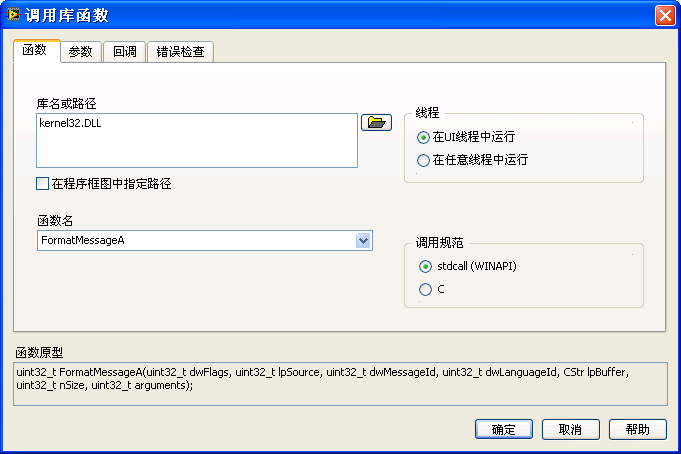

The **Library name or path** field is designated for the DLL file name or its complete path. If the DLL resides in the system path, only the file name is needed; otherwise, the full path is required. Unchecking **Specify path on diagram** means the DLL will be statically loaded by LabVIEW (also known as a static call). When the VI that invokes this DLL is loaded into memory, the DLL is simultaneously loaded, even if the VI has not yet executed. After the VI execution concludes, the DLL remains in memory and is not unloaded until all VIs using the DLL are closed.

Selecting **Specify path on diagram** invalidates the DLL path configured in the dialog. The CLFN then gains two additional "path" terminals for entering the DLL's path directly on the Block Diagram:

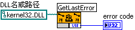

At this juncture, LabVIEW dynamically loads the DLL (a dynamic call). The path cannot be determined until the VI execution reaches the CLFN, preventing the DLL from being preloaded. Only when execution reaches this node does LabVIEW load the required DLL into memory. LabVIEW does not immediately unload the DLL from memory after the node executes. If subsequent CLFNs also utilize this DLL, reloading is unnecessary. LabVIEW only unloads the DLL once a null path is passed to the CLFN.

Loading DLL files is generally a time-consuming process. With static loading, all DLLs needed by the program are loaded into memory upon program launch, resulting in longer startup times. Conversely, dynamic loading delays the loading of DLLs until they are actually required during program execution, reducing the initial startup time by shifting the load to runtime.

One scenario where dynamic loading shows clear benefits is in programs with extensive functionalities that call upon multiple DLL files. Often, only a subset of these DLLs is utilized during a single program run. With static loading, all DLLs, regardless of their use, are loaded into memory. This can cause a program to fail to run at startup if any single DLL is missing, even if that DLL is not needed for the current operation. Dynamic loading, on the other hand, only loads the DLLs that are required for runtime, enhancing program robustness and ensuring the application is not impacted by the absence of momentarily unnecessary DLLs.


## Configuring Functions

In the CLFN configuration dialog, the **Function name** field specifies the function within the DLL to be invoked. If the static loading method is chosen and the complete path of the DLL file is correctly provided, this field will display a list of all exported functions within the DLL, allowing you to select from a dropdown list.

The **Thread** option determines the thread in which the invoked DLL function will execute. The CLFN offers two thread options: **Run in UI thread** and **Run in any thread**. A CLFN's thread choice is immediately apparent on the Block Diagram through its color coding. Nodes set to **Run in UI thread** appear in a darker shade of orange, whereas those set to **Run in any thread** are displayed in a lighter shade of yellow:

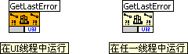

Opting for **Run in UI thread** means that the called function executes within the UI (User Interface) thread. Regardless of a LabVIEW program's complexity, it maintains just one user interface thread, which is responsible for all tasks related to the user interface, such as data display or user event generation. Given the singular nature of the UI thread, configuring multiple called functions to run in this thread ensures they execute sequentially within the same thread.

Beyond the interface thread, LabVIEW operates several other execution threads designated for processing the Block Diagram's code. Selecting **Run in any thread** leaves it to LabVIEW's execution system to determine which thread will run the DLL function.

To decide on the appropriate thread setting for a CLFN, consider the following guideline: if the dynamic link library is thread-safe, select **Run in any thread**. Conversely, if the library is not thread-safe, **Run in UI thread** must be chosen. Running a DLL function in any thread can enhance program efficiency because LabVIEW can execute the DLL function within the same thread as the contiguous program code, eliminating the overhead associated with thread switching. This setting also permits LabVIEW to invoke the same DLL function concurrently in different threads. However, if the DLL is not thread-safe, meaning that simultaneous calls to functions within the DLL from different threads could lead to memory corruption or logical errors, you must set the CLFN to **Run in UI thread** to force sequential execution within the single UI thread.

Assessing whether a dynamic link library is thread-safe demands careful scrutiny. Should the library's documentation not explicitly confirm its thread safety, it is prudent to treat it as not thread-safe. Those with knowledge of C can examine the DLL's source code; the presence of global or static variables without protective measures such as semaphores or critical sections indicates the DLL is not thread-safe.

For an in-depth overview of the execution threads within LabVIEW, the section on [multithreaded programming](optimization_multi_thread) is recommended.

The **Calling Convention** specifies how function parameters are managed on the stack. The CLFN accommodates two conventions: **stdcall** and **C call** (`cdecl`). Their primary distinction lies in stack management — `stdcall` mandates that the function being called cleans up the stack, whereas `C call` places this responsibility on the caller. Incorrect configuration of the calling convention can corrupt the stack and precipitate LabVIEW crashes. Thus, if you encounter exceptions when LabVIEW invokes a DLL function, the correctness of this setting should be your initial consideration.

For DLL users, understanding the intricate details of calling conventions isn't mandatory. It suffices to discern which convention is employed by the DLL in question. A general rule is that the Windows API typically employs `stdcall`, whereas most standard C library functions use `C call`. The presence of `__stdcall` within the function declaration indicates the use of the `stdcall` convention.


## Setting Up Parameters of Simple Data Types

The second tab in the CLFN configuration dialog focuses on setting up parameters:

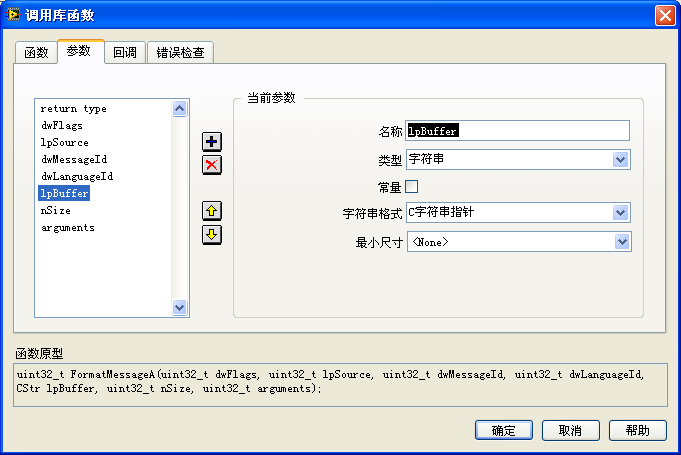

The most challenging part of utilizing the CLFN lies in accurately mapping the data types of function parameters to their equivalent data types in LabVIEW. When transferring parameters between DLLs and LabVIEW, the three most frequently encountered data types are numeric, string, and numeric arrays. Configuring these parameter types is generally straightforward.

### Numeric Data Types

For those with a foundational knowledge of C programming, the correlation between the various precision numeric types in LabVIEW and C is straightforward. For instance, LabVIEW's "4-byte single precision" data type is equivalent to the `float` data type in C. This alignment is illustrated in LabVIEW's example located at `[LabVIEW]\examples\dll\data passing\Call Native Code.llb`, which outlines the relationship between simple data types in both LabVIEW and C.

In C programming, passing pointers or data addresses between functions is standard practice. In 32-bit applications, a pointer is represented by a 32-bit integer. Consequently, in LabVIEW, when passing pointer data, the `I32` or `U32` numeric types can be utilized to represent these address-type data. However, for 64-bit applications, pointers must be represented using `I64` or `U64`. Therefore, when a VI calls a DLL function with parameters that are address types, utilizing a fixed data type for addresses would necessitate maintaining separate 32-bit and 64-bit versions of the code. To circumvent this, LabVIEW introduces the **pointer-sized integer** (signed or unsigned), selectable from the **Data Type** column. This data type dynamically adjusts between 32-bit and 64-bit lengths based on the target platform.

Should the `const` keyword be present in a C function's parameter declaration, selecting the **constant** option is appropriate. Typically, when LabVIEW passes data to a DLL function, it generates a copy of the data for the DLL function's use. This method prevents unauthorized modifications to the data within the DLL, eliminating potential errors. Selecting the **constant** attribute signifies that the parameter will remain unaltered within the DLL, allowing LabVIEW to omit generating a duplicate, thereby conserving memory.

The following table provides a comparison of how numeric data for DLL functions is configured in C and LabVIEW:

| Input / Output | Input | Output or Both Input and Output |
| -------------- | ----- | ------------------------------- |
| C Declaration  | `float red;` | `float* red;` |
| Configuration in LabVIEW | 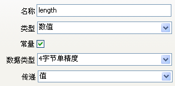 | 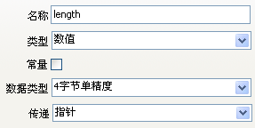 |
| Usage in LabVIEW |  | 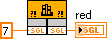 |


### Boolean Types

In the communication between DLL functions and VIs, there is no exclusive data type designed specifically for transferring Boolean values. Instead, these values are transmitted using numeric types. For inputs, Boolean values are converted into numeric values before being passed to the DLL function; for outputs, the process is reversed, converting numeric values back into Boolean values.

In the C programming language, there are several data types to represent Boolean values, such as `bool` and `BOOL`. The storage length for these types can vary; some are represented with a single byte, while others use four bytes. It is important to verify the storage length of Boolean types in the DLL being called and then use the appropriate numeric data type to represent it.

The following table outlines the setup for Boolean data:

| Input / Output | Input | Output or Both Input and Output |
| -------------- | ----- | ------------------------------- |
| C Declaration  | `bool visible;` | `bool* visible;` |
| Configuration in LabVIEW | 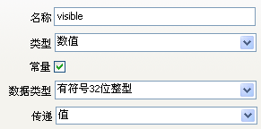 | 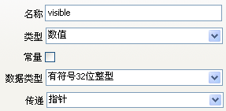 |
| Usage in LabVIEW | 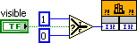 | 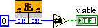 |


### Numeric Arrays

LabVIEW supports passing only numeric arrays among C data types. To configure array parameters in the CLFN, you must select **Type** as **Array**. Subsequently, **Data Type** must be chosen, indicating the data type of the array elements, which can be any numeric type.

**Array Format** is typically set to **Array Data Pointer**, aligning with arrays represented by pointers in the C language. Other options for **Array Format** include **Array Handle** and **Array Handle Pointer**. These "Handle" parameter types signify special types defined by LabVIEW, usually found only in DLLs associated with NI products or those generated through LabVIEW. Third-party DLLs rarely use these data types.

The **Minimum Size** parameter allows users to define a minimum length for one-dimensional array parameters. If the array passed to the CLFN is shorter than this specified value, LabVIEW automatically extends it to meet the minimum length before passing it to the DLL function.

For functions with array outputs, it is crucial to allocate storage space for the array's data. There are two approaches to allocating this space:

1. **Pre-allocation in LabVIEW**: Create an array with the necessary length as an initial value and pass it to the parameter. The input array's content is irrelevant; it is solely used to allocate memory space for the output array, ensuring the output data is stored in this designated memory space.
2. **Configuration in the CLFN Dialog**: Enter a fixed number in **Minimum Size** to instruct LabVIEW to allocate memory space for the output array. This field can accept a fixed numerical value. Moreover, if the CLFN parameters include integer parameters, their names will appear as options in this field. Selecting one of these parameters as the **Minimum Size** allows LabVIEW to allocate space based on the runtime input value of that parameter.

Not allocating memory for output data, or allocating insufficient space, may result in memory corruption due to arrays exceeding their bounds, leading to unexpected LabVIEW crashes. More problematically, LabVIEW may not crash immediately when the array bounds are exceeded, but at an unpredictable moment later. Diagnosing and resolving such errors can require extensive time and effort.

The following table provides a comparison of array data settings:

| Input / Output | Input | Output or Input/Output |
| -------------- | ----- | ---------------------- |
| C Declaration  | `int values[];` | `int values[];` |
| Configuration in LabVIEW |  |  |
| Usage in LabVIEW | 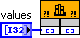 | 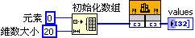 |


### String Types

The utilization of strings bears a strong resemblance to that of arrays. Essentially, in C programming, a string is an `I8` array. The table below provides a comparison of the configuration for string-type data:

| Input / Output | Input | Output or Both Input and Output |
| -------------- | ----- | ------------------------------- |
| C Declaration  | `char* name;` | `char* name;` |
| Configuration in LabVIEW | 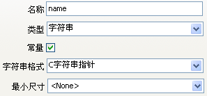 | 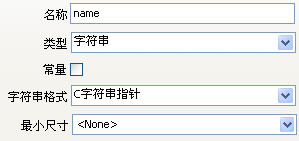 |
| Implementation in LabVIEW | 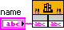 | 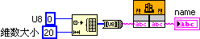 |


## Configuring Structured Parameters

In C, a structure (`struct`) can, in simple cases, be analogous to a **Cluster** in LabVIEW. However, for more complex scenarios, the LabVIEW Cluster needs appropriate adjustments to align correctly.

Before delving into the mapping of structured parameters, gaining an understanding of byte alignment is crucial. This brief overview introduces the concept, with more comprehensive details available through dedicated research on data alignment.

An example of a structure in C:

```cpp
typedef struct {
    char a;
    int b;
} MyStruct;
```

Clearly, element `a` takes up 1 byte, while element `b` occupies 4 bytes. If the address of element `a` within the structure is `0xAAAA0000`, the storage address for the 4-byte element `b` depends on the byte alignment setting of the structure. With 1-byte alignment, `b` is placed directly after `a`, giving `b` an address of `0xAAAA0001`. If 2-byte alignment is selected, `b`’s address is the first even address following `a`, which would be `0xAAAA0002`. For 4-byte alignment, `b`’s storage address becomes the first address that is a multiple of 4 after `a`, resulting in `0xAAAA0004`. Alignment can also be set to other sizes, such as 8 bytes or 16 bytes.

In C, byte alignment can be specified using the `#pragma pack` directive or set in the project properties. However, clusters in LabVIEW are limited to 1-byte alignment. Consequently, structures in C that do not adhere to 1-byte alignment require adjustments to ensure accurate data transmission when paired with a LabVIEW Cluster.

For example, if the structure `typedef struct {char a; int b;} MyStruct;` has 2-byte alignment, the first element of the corresponding LabVIEW Cluster should still be the `I8` type `a`. However, `b` cannot immediately follow `a` due to the presence of a meaningless 1-byte gap between them in C. This detail, while not explicitly present in the C structure, must be accounted for in LabVIEW by inserting a 1-byte padding element between elements `a` and `b` in the LabVIEW Cluster.

When writing a DLL specifically to be called by LabVIEW, setting all structures in the C code to 1-byte alignment simplifies the process.

Structures in C that include arrays cannot be directly mapped to clusters in LabVIEW that contain arrays. In LabVIEW, elements of the array must be individually placed within the cluster as flat elements.

The following table outlines the correspondence between common structured data types in C and LabVIEW.

| C | LabVIEW |
| ----------- | ----- |
| `<pre>#pragma pack (1) <br />typedef struct {char a; int b} MyStct; <br />MyStct* testStruct;</pre>` | 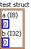 | 
| `<pre>#pragma pack (2) <br />typedef struct {char a; int b} MyStct; <br />MyStct* testStruct;</pre>` | 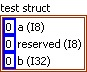 | 
| `<pre>#pragma pack (4) <br />typedef struct {char a; int b} MyStct; <br />MyStct* testStruct;</pre>` | 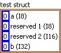 | 
| `<pre>#pragma pack (1) <br />typedef struct {char a; char\* str; int b} MyStct <br />MyStct* testStruct;</pre>` | 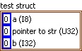 | 
| `<pre>#pragma pack (1) <br />typedef struct {char a; char str [5]; int b} MyStct; <br />MyStct* testStruct;</pre>` | 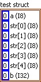 | 

In the table's fourth example, the structure includes a pointer. When corresponding with such structures, a cluster in LabVIEW can only represent the pointer's address with a `U32` numeric value (on 32-bit systems; `U64` on 64-bit systems), and it cannot directly incorporate the content pointed to by the pointer. Subsequent discussions will delve into extracting data from this address.

In the table, all `testStruct` variables declared in C are pointers to structures, indicating that when a C function's variable type is a structure pointer, it can be mapped to a cluster in LabVIEW. The CLFN's configuration panel doesn't feature a specific parameter type named "struct" or "cluster"; selecting **Adapt to Type** is adequate.

If a parameter is solely for input, it might directly utilize a structure rather than a pointer to a structure. Given the order of parameter stacking in C functions, passing a `struct` as a parameter is equivalent to individually passing each element within the structure as parameters to the function. The configuration method for structure parameter types in LabVIEW is depicted in the table below:

| Input / Output | Input | Output or Input/Output |
| -------------- | ----- | ---------------------- |
| C Declaration  | `typedef struct {int left; int top;} Position; long TestStructure (Position inPos);` | `typedef struct {int left; int top;} Position; long TestStructure (Position *pos);` |
| Configuration in LabVIEW | 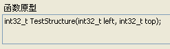 | 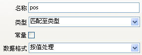 |
| Usage in LabVIEW | 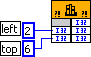 | 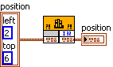 |


## Configuring Return Values

C functions can include return values, which correspond to the first output parameter on a CLFN. In configuring the CLFN, a function's return value can be `void`, a numeric value, or a string; other data types are not permissible.

Similar to output parameters, the function's return value transfers data from the DLL function to the subsequent LabVIEW code. However, on the CLFN, the function's return value does not have a leftward connector. This means it does not require the pre-allocation of storage space in LabVIEW, unlike output parameters.

Why is there no need to allocate storage space for the function's return value? Consider a function that returns a string as an example. Essentially, what is returned is a pointer to the string. Since this pointer is returned by the function, LabVIEW can access it and retrieve the string it points to. Within LabVIEW, once the string is obtained, its length can be determined. LabVIEW then allocates space of the appropriate size and copies the string's contents.

The scenario differs for output parameters that are strings. The term "parameter output" does not imply an actual return value; rather, the DLL function requires LabVIEW to supply a pointer to a memory space capable of holding the output data. Since LabVIEW cannot know in advance the size of the data to be output, it cannot automatically allocate a buffer and provide the pointer. Thus, the task of specifying the buffer size falls to the developer.


## Managing Pointers in C

C language functions frequently utilize pointer-type parameters. In LabVIEW, there are instances where one may only obtain a pointer to a specific piece of data. Consider the following declaration of a function in C:

```cpp
#pragma pack (1)
typedef struct {char a; char* str; int b} MyStct;
MyStct* testStruct;
long TestStructure (MyStct* tempStct);
```

In calling this function within LabVIEW using a CLFN, the function can only return the pointer to `str` as an integer type, making it impossible to access the string's content directly.

Often, obtaining the actual content pointed to by the pointer in LabVIEW is unnecessary. It might be sufficient to acquire the pointer's address in LabVIEW and then pass it to another CLFN for further processing. Any manipulation of the content that the pointer refers to is handled within the functions of the DLL.

However, if accessing the content pointed to by the pointer in LabVIEW is crucial, you can use helper C functions. Using the above function as an example, to access the content of the string `str`, an additional C function must be written. This new function deconstructs the elements of the `tempStct` structure returned by `TestStructure` into simpler data types, which then serve as parameters. One of these parameters would be `char* str`, which LabVIEW's CLFN can interpret as a string type. By invoking this new function in LabVIEW, the simpler data type values can be retrieved.

There are scenarios where a function is required to write data into externally allocated memory. Since LabVIEW does not offer native memory allocation operations, an additional C function is necessary to allocate the memory before it can be utilized by the called function.

The main disadvantage of this method is the need to create a wrapper function for each pointer whose content needs to be accessed, which can be labor-intensive.

Another method for reusing C code involves writing a C function responsible for reading data from the memory pointed to by a pointer as a byte array. Then, in LabVIEW, these bytes are reassembled into appropriate data types. Although this approach is complex, LabVIEW includes built-in VIs that already provide this functionality, allowing developers to utilize these ready-made VIs without writing additional C code.

The node for accomplishing this function is:
`[LabVIEW]\vi.lib\Utility\importsl\GetValueByPointer\GetValueByPointer.xnode`.

An [XNode](oop_xnode) can be considered a more complex VI, which can be used here just like a subVI.

This node has three inputs: the pointer (the data's memory address), the data type, and the byte alignment method. By providing the correct parameters, `GetValueByPointer.xnode` returns the data pointed to by the pointer.

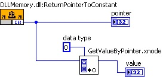

In the example shown above, the CLFN `DLLMemory.dll:ReturnPointerToConstant` returns a pointer to an integer constant declared in C. Passing this pointer to `GetValueByPointer.xnode` and specifying the data type as `I32`, the node retrieves and returns the content pointed to by the pointer.

The folder `[LabVIEW]\vi.lib\Utility\importsl\` contains three other VIs used for allocating memory to be used by functions in a DLL. For example, some functions output array or string data and require the calling function to allocate space for the output data before passing the address of this space. When calling such a function, `DSNewPtr.vi` can be used. Its input is the size of the memory space, and its output is the address of the newly allocated space. `InitStr.vi` can also allocate a memory space and write an initial value into it. `DSDisposePtr.vi` is used to release the space allocated by the previous two functions.


## Import Shared Library Tool

The **Import Shared Library** tool, accessible via `Tools -> Import -> Shared Library` in the menu, simplifies the process of converting functions from shared library files (.DLL on Windows, .so on Linux, .dylib on macOS) into VIs. For those unfamiliar with C programming, utilizing VIs directly in their programs is far more straightforward than configuring CLFN nodes.

LabVIEW provides a demo for this tool: `[LabVIEW]\examples\dll\regexpr\Import Shared Library Tutorial GUI.vi`. It is recommended to explore this example before using the Import Shared Library Tool for the first time, as it offers guided learning on how to use the tool effectively.

This tool operates as a wizard, leading users through the steps to transform DLL functions into VIs. Initially, it requires a DLL file and a header (`.h`) file. The tool identifies the functions available for use in the DLL and converts them based on their declarations in the header file. These declarations specify the number of parameters for each function and the data types of these parameters, allowing the tool to establish appropriate controls for the wrapped VIs.

Subsequently, the tool prompts for **Include Paths** and **Preprocessor Definitions**. This is because a DLL's header file may rely on additional header files. For example, the DLL function's header might utilize a system-defined data type whose definition is in `windows.h` (a component of the Windows SDK). To accurately process this data type, the tool needs access to the `windows.h` header file, requiring users to add its full path to the **Include Paths**. In C programming, it is common to employ various constant definitions. If the DLL's header file requires specific macro definitions, these should be listed in the **Preprocessor Definitions**.

Finally, the tool displays all functions contained within the DLL, allowing users to select which ones to wrap as VIs.

Subsequently, users are prompted to specify the path and name for the VI Library they are creating. (The concept of libraries will be covered in the [Library](manage_project#libraries) section of this book.) Following that, users must choose an error-handling mechanism for the generated VIs. The selection of an error-handling mechanism hinges on the configuration of the DLL function being called. If the function inherently does not generate error messages, its corresponding wrapper VI will operate without an error-handling mechanism. Nevertheless, the "Function Returns Error Code/Status" mechanism is the most frequently employed. API functions usually leverage parameters to convey the data necessary for executing the function's duties, while employing return values to denote error codes. The wrapper VI inspects the return value for errors immediately after invoking the DLL function via a CLFN.

The final step involves configuring the VI and controls. This page is dedicated to setting the properties for each VI and control. Having understood the CLFN configuration options, this page should be straightforward as it mirrors the configuration options found within the CLFN itself.

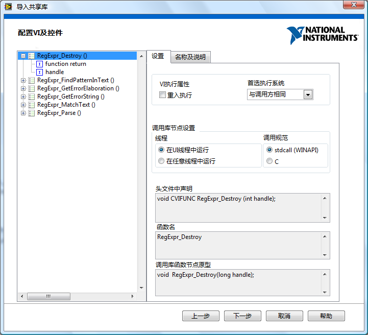

The Import Shared Library Tool strives to design the most appropriate wrapper VI based on the function's declaration. However, the tool sometimes cannot make precise judgments. For instance, if a parameter is of type `int*`, the tool cannot discern whether the parameter is intended to pass a single integer or an array of integers, nor can it determine whether it is meant for input or output. Consequently, the tool defaults to assuming it transmits a single datum and is designated for both input and output. These default configurations are modifiable on the **Configure VI and Controls** page. Regrettably, adjustments must be made for each VI individually, which is challenging if a series of similar modifications are required. For example, if all array-passing parameters are declared as `int*`, you must manually alter each of these data types from passing a pointer to passing an array on this configuration page. A more convenient approach involves altering the declarations of array-passing parameters in the DLL header file to `int foo[]` before utilizing the tool. This adjustment allows the tool to directly recognize these parameters as array-passing.

Eventually, a suite of VIs is generated and ready for direct invocation within the application.


## Developing DLLs Specifically for LabVIEW

More often than not, DLLs are invoked to utilize functionalities that others have already developed. However, there are scenarios where it is necessary to create a DLL file specifically for a LabVIEW project. For example, certain algorithms may only meet efficiency requirements when implemented in C, or it may be necessary to wrap an external module that cannot be directly invoked by LabVIEW. For DLLs designed for LabVIEW, there are methods to ease the creation process and boost operational efficiency.

First, designing data types does not need to be as cumbersome as mentioned earlier. One approach is to initially configure the CLFN, setting up the LabVIEW data types for its parameters. For instance, the CLFN shown below uses **Adapt to Type** when configuring parameters, making its terminals versatile enough to accept any data type. Subsequently, the necessary data types, such as a numeric type or a cluster, are connected to this CLFN. Then, by selecting **Create C File** from the CLFN's context menu:

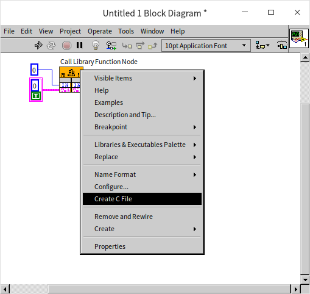

LabVIEW automatically generates the function declaration that the CLFN can call. For example, the C code generated for the above CLFN is as follows:

```cpp
#include "extcode.h"
#include "lv_prolog.h"

typedef struct {
	int32_t elt1;
	LVBoolean elt2;
} TD1;

void test_func(int32_t size, TD1 *data);
```

The generated C code includes several header files for processing LabVIEW data, such as `extcode.h`. These header files are located in the `[LabVIEW]\cintools\` directory.

Efficiency can be notably low when LabVIEW calls third-party DLLs due to data copying between the DLL function and LabVIEW. This arises because LabVIEW code and DLL functions cannot manipulate the same memory address, forcing data to be duplicated into their respective memory spaces. If the data volume is large, the overhead of copying data might surpass the actual data processing time, rendering it less efficient than processing the data directly in LabVIEW.

One way to circumvent the issue of data copying is by utilizing LabVIEW's data types for C when crafting the DLL. This strategy ensures that data transfers between the DLL and LabVIEW involve passing references to LabVIEW data instead of the data itself, eliminating the need for copying large datasets. LabVIEW offers an extensive set of C interface functions that enable developers to create and modify data of LabVIEW types and manage LabVIEW data handles while developing the DLL. These functions are declared in the previously mentioned `extcode.h` file.


## Debugging DLLs Utilized by LabVIEW

When your project involves DLL files written in C, errors may be present within the C functions. These errors might only surface when the functions are invoked within a LabVIEW program, making it necessary to debug these DLL functions while the LabVIEW program is operational.

Debugging of C code is typically performed in programming environments such as Visual Studio. For C programs that generate executable files, you can set breakpoints in the code. When the program runs, it will pause at these breakpoints, facilitating step-by-step debugging. These methods can also be applied to debug DLLs.

Given that DLLs cannot run independently, Visual Studio needs to be configured to call LabVIEW for debugging. This is achieved by setting the **Debugging -> Command** in the Visual Studio project properties to the `LabVIEW.exe` executable:

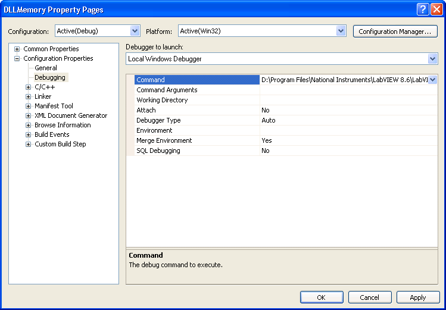

Once the debugging command is configured, initiating the **Start Debugging** command in Visual Studio will launch LabVIEW. If there are breakpoints in the code, the program will pause at those points when the CLFN is executed.

When employing this debugging method, it is important to ensure that the DLL being debugged is built in debug mode. Also, during the development and debugging process, there might be multiple versions of the DLL on the computer. It is crucial to confirm that the DLL version LabVIEW is calling is the one currently being debugged.