# Integrating External Programs and Components

LabVIEW can connect to and integrate a wide variety of external programs and components, often more easily than when working with DLLs.

## Python

For those interested in learning the Python programming language, this webpage comes highly recommended: https://py.qizhen.xyz.

### Installing Python

LabVIEW's Python integration relies on the local Python interpreter, necessitating the installation of Python on your computer. Each LabVIEW version supports only specific Python versions (for instance, LabVIEW 2021 supports Python 3.6 to 3.9). Furthermore, Python code called by LabVIEW may require specific library versions. To prevent compatibility issues between different Python versions and libraries, it is advisable to use professional tools to manage your environments. The most popular environment management tool for Python is Conda. The leading installation packages in the open-source community that include Conda and Python are [Miniconda](https://docs.conda.io/en/latest/miniconda.html) and [Anaconda](https://www.anaconda.com/). Miniconda offers a streamlined package containing only the core libraries, with additional libraries installable as needed, making it ideal for beginners. In contrast, Anaconda's installer is roughly ten times larger than Miniconda's because it pre-installs nearly all commonly used scientific libraries.

When downloading the installer, ensure you choose the correct bitness (64-bit or 32-bit). This must align with your LabVIEW installation; 64-bit LabVIEW can only interface with 64-bit Python, and 32-bit LabVIEW with 32-bit Python.

On Linux, if Conda is configured to initialize automatically upon opening the terminal, you will notice the active environment name in your command prompt. If you prefer not to activate the base Conda environment by default, you can disable this feature with the following command:

```sh
conda config --set auto_activate_base false
```

For Windows users, Conda can be accessed via the Anaconda Prompt or PowerShell window created in the Start Menu during installation.

To avoid conflicts with other Python programs, it is best practice to create a dedicated environment for the Python code that LabVIEW will call. You can create a new environment named `lv` and specify Python version 3.9 with the following command:

```sh
(base) qizhen@deep:~$ conda create --name lv python=3.9
```

The `conda env list` command displays all environments you have created along with their file paths. Keeping track of this path is important, as it will be needed when configuring LabVIEW to call Python code.

```sh
(base) qizhen@deep:~$ conda env list
# conda environments:
#
base                  *  /home/qizhen/anaconda3
lv                       /home/qizhen/anaconda3/envs/lv
```

In the list above, `lv` is the newly created environment, while `base` is the default. To configure or test the new environment, you must switch to it using the `conda activate` command:

```sh
(base) qizhen@deep:~$ conda activate lv
(lv) qizhen@deep:~$ 
```

Notice how the active environment name in the command prompt has changed from `(base)` to `(lv)`. Now you can configure the environment (for example, by installing libraries via `pip` or running scripts).


### Methods for Integrating Python

Prior to LabVIEW 2018, integrating Python required running the Python interpreter as an external process (e.g., executing a command-line script using the System Exec VI). While this approach is still useful for other scripting languages, LabVIEW has since introduced three specialized nodes for direct Python integration.

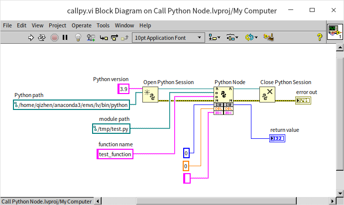

These three nodes are:
- **Open Python Session**: Initializes the Python interpreter. It requires the **Python version** (e.g., `3.9` for Python 3.9) and the **Python path** (the directory path to the specific Python interpreter executable, which is particularly important if you have multiple environments installed).
- **Python Node**: Calls a specific function within a Python script. The **module path** refers to the file path of the `.py` script, and the **function name** is the name of the function to invoke. The terminals at the bottom of the node are adjustable, allowing you to pass parameters and retrieve return values. Configuring the Python Node is much easier than configuring a CLFN because data types are specified using standard LabVIEW controls or constants connected to the inputs.
- **Close Python Session**: Terminates the Python interpreter session and frees resources once execution is complete.


### Creating a Test VI

Creating an external `.py` script file and switching back and forth between LabVIEW and a text editor can be tedious during development. To streamline testing, you can write the Python code directly in a string constant on the Block Diagram, write it to a temporary file at runtime, and execute it using the Python Node:

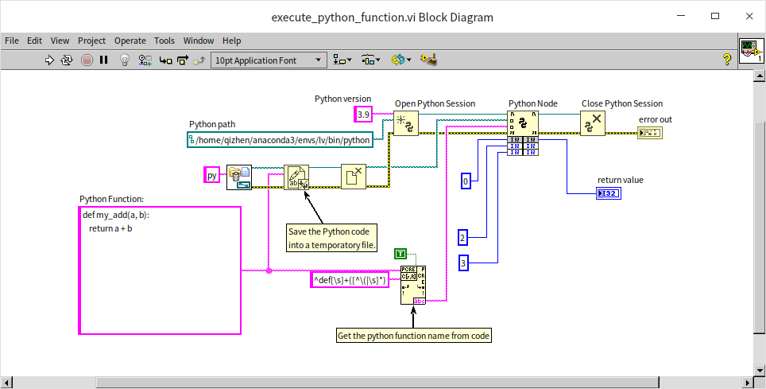

If the Python code in the string constant contains only one function, we can use the [Match Regular Expression node](data_string#match-regular-expression) to automatically extract the function name from the code.

Wrapping this logic into a subVI makes execution even more convenient. The main challenge in creating such a subVI is that the inputs and outputs of the Python Node are polymorphic and dynamic. If you want to create a subVI with a variable number of parameters and dynamic data types, you can implement it as an [XNode](oop_xnode).

Since developing an XNode is complex, a simpler compromise is to package everything except the Python Node and the Close Python Session node into a helper subVI:

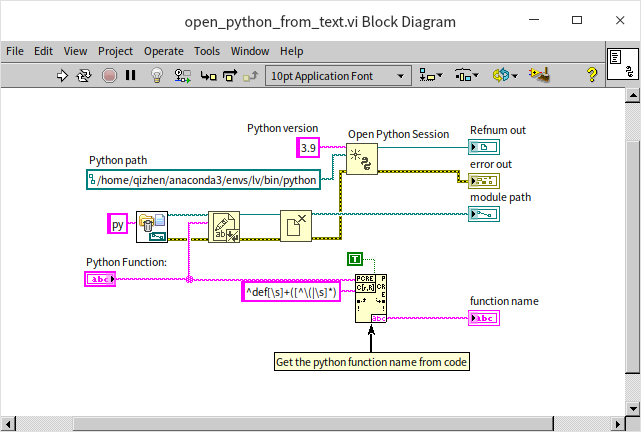

With this helper subVI, the main demonstration VI becomes clean and streamlined:

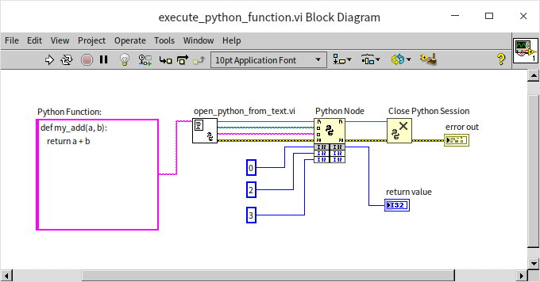


### Setting Input and Output Parameters

The Python code in the demonstration VI is simple, consisting of a single function named `my_add`:

```python
def my_add(a, b):
    return a + b
```

This function takes two input parameters, `a` and `b`, and returns their sum. When integers `2` and `3` are passed from LabVIEW, the result is `5`.

Because Python is dynamically typed, you do not need to declare variable types in the Python script. The interpreter resolves types at runtime. Consequently, you can pass different data types to the same Python function. For instance, passing the floating-point numbers `2.6` and `3.7` to `my_add` returns `6.3`.

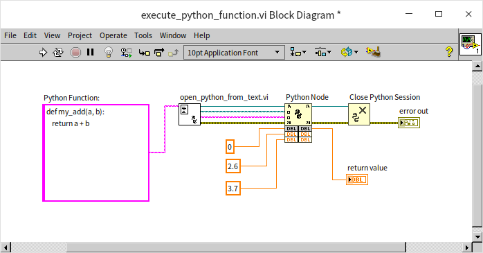

Strings are also supported: passing `"2"` and `"3"` to the function concatenates them, yielding `"23"`.

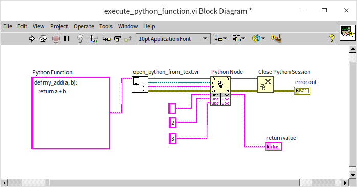

Arrays behave similarly: passing `[2, 3]` and `[4, 5]` to the function concatenates them into `[2, 3, 4, 5]`.

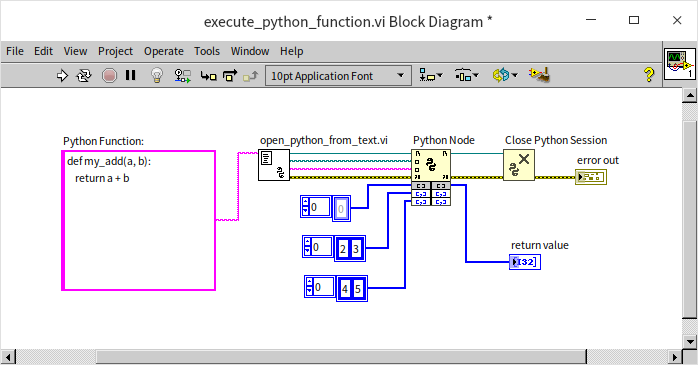

Clusters can also be passed, though their behavior in Python might be unexpected. Cluster data passed to Python is represented as a tuple. The `+` operator on tuples concatenates them. Therefore, passing the clusters `(2, 3)` and `(4, 5)` to the Python function returns a cluster with four elements: `(2, 3, 4, 5)`.

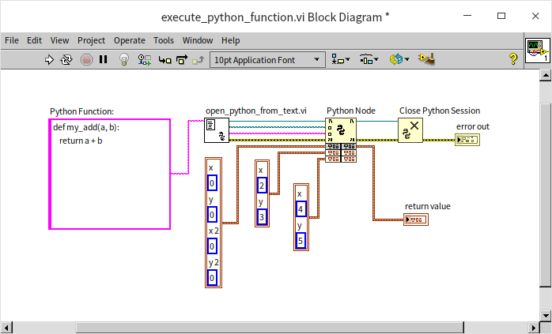

If you pass mismatched data types (such as a float and a string), the Python interpreter will throw a runtime error because Python does not support implicit addition/concatenation of disparate types.

You can include type hints in your Python code as shown below:

```python
def string_concat(a: str, b: str) -> str:
    return a + b
    
print(string_concat(2, 3))
```

However, these type hints are merely recommendations and are not enforced by the standard Python runtime at execution. LabVIEW can still pass other data types to this function without causing an error.

When numeric, string, or cluster (tuple) parameters are passed to a Python function, they are passed by value. Any modifications made within the Python function do not affect the original variables in LabVIEW. If you need to return modified data, you must do so via the function's return value.

Arrays, however, are passed by reference. This allows the Python function to modify the contents of the array in place and return the modified values back to the calling VI. Consider the following example:

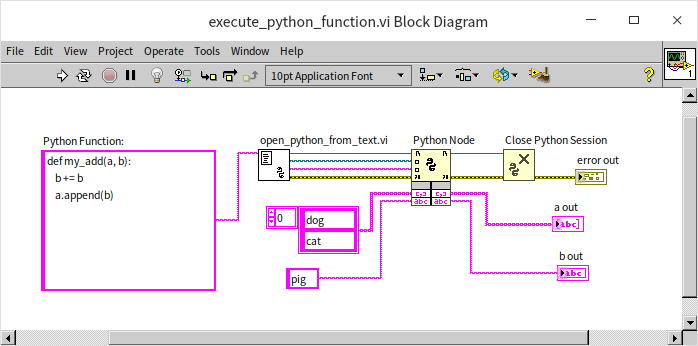

This VI invokes a Python function named `append_array`, which has no return value. The function accepts a string array `a` and a string `b`. Inside the function, the value of `b` is duplicated and concatenated (e.g., `"pig"` becomes `"pigpig"`). The modified string is then appended to the array `a`.

When running the VI, because array `a` is passed by reference, the changes are reflected in the `a out` control, which displays `["dog", "cat", "pigpig"]`. The string `b` is passed by value, so the modification remains local to the Python session, leaving the `b out` control unchanged as `"pig"`.

Python functions can return multiple values. For instance, executing the following script results in `x = 5` and `y = "pig"`:

```python
def return_both(a, b) -> str:
    return a, b
    
x, y = return_both(5, "pig")
```

In LabVIEW, you can receive these multiple return values as a Cluster. Running the VI below, you will see that the Cluster control `return value` contains `(5, "pig")`:

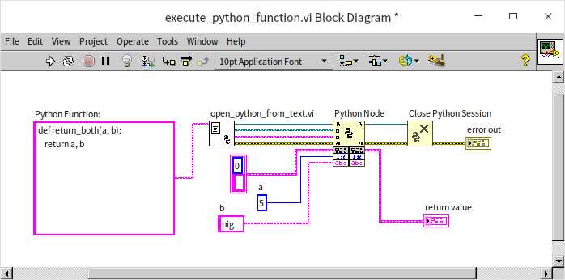

LabVIEW only supports passing simple data types (numbers, strings, arrays, and clusters) to Python functions. Complex types, such as classes and dictionaries/maps, cannot be directly mapped. To work with complex data structures, you must either break them down into simpler types or serialize them into formats like [JSON or XML](data_string) before passing them.


### Case Study: QR Code Generation

While many tasks can be accomplished directly in LabVIEW, Python has a massive open-source community that provides libraries for specialized domains like machine learning and image processing. For example, over 90% of modern AI research is built on PyTorch, which evolved from the Lua-based Torch project.

Let's look at a practical task: generating a QR code. LabVIEW does not natively support QR code generation. In Python, however, this can be done easily using the `qrcode` library. First, install the library in your Conda environment:

```
(base) qizhen@deep:~$ conda activate lv
(lv) qizhen@deep:~$ pip install qrcode[pil]
Collecting qrcode[pil]
  Downloading qrcode-7.3.1.tar.gz (43 kB)
     ━━━━━━━━━━━━━━━━━━━━━━━━━━━━━━━━━━━━━━━━ 43.5/43.5 kB 2.7 MB/s eta 0:00:00
  Preparing metadata (setup.py) ... done
Collecting pillow
  Downloading Pillow-9.2.0-cp39-cp39-manylinux_2_28_x86_64.whl (3.2 MB)
     ━━━━━━━━━━━━━━━━━━━━━━━━━━━━━━━━━━━━━━━━ 3.2/3.2 MB 4.4 MB/s eta 0:00:00
Building wheels for collected packages: qrcode
  Building wheel for qrcode (setup.py) ... done
  Created wheel for qrcode: filename=qrcode-7.3.1-py3-none-any.whl size=40386 sha256=ff22258cd1a100c88e4636b93a077a5ad0319933e434e098140210242f0637c
  Stored in directory: /home/qizhen/.cache/pip/wheels/93/54/16/55cec87f8d902ed84b94ab8fdb7e89ae115806e130bc83b03
Successfully built qrcode
Installing collected packages: qrcode, pillow
Successfully installed pillow-9.2.0 qrcode-7.3.1
(lv) qizhen@deep:~$ 
```

The `qrcode` library uses `Pillow` (the Python Imaging Library, PIL) for image generation, so installing `qrcode[pil]` installs both.

With the libraries installed, we can write a VI that uses a string of Python code to generate a QR code:

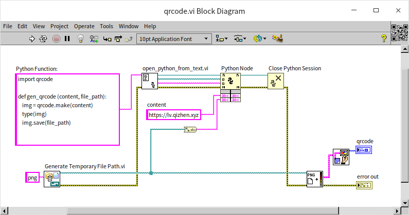

This VI defines a Python function named `gen_qrcode` that imports `qrcode` and saves the generated image to a temporary file. The path to this file is returned to LabVIEW, which reads and displays it on the Front Panel using a standard image control:

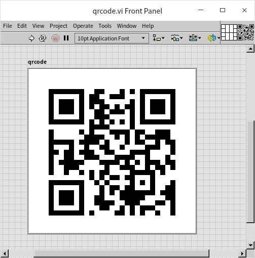

You can scan this QR code to visit the book's website.


## ActiveX

### ActiveX Controls

ActiveX controls utilize Microsoft's Component Object Model (COM) interface to allow reusable software components to be embedded into host applications (containers). Originally designed for Internet Explorer, ActiveX controls establish standard interfaces that allow containers to interact with external components without needing to modify the components' source code.

While creating ActiveX controls in LabVIEW is complex and rarely done, embedding third-party ActiveX controls in a LabVIEW application is very straightforward. You can use ActiveX controls to add rich features like web browsers and media players directly to your Front Panel.

This section focuses on how to call ActiveX controls in LabVIEW. For the technical details of ActiveX specifications, refer to specialized documentation.

### Calling ActiveX Controls

To use an ActiveX control, place an **ActiveX Container** on the Front Panel (located under `Modern -> Containers` on the Control Palette). Right-click the container and select **Insert ActiveX Object** to display a list of all registered ActiveX controls on your system:

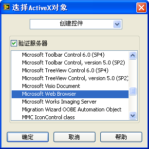

Note that some controls in the list require specific licensing or developer keys and may not work directly without proper authorization.

#### Web Browsing

LabVIEW does not include a native web browser control. Instead, it can embed the ActiveX browser control provided by Windows. You can insert the **Microsoft Web Browser** control into an ActiveX container on the Front Panel.

In recent versions of LabVIEW, common .NET and ActiveX controls (such as the web browser and Windows Media Player) are pre-configured on the Control Palette under the **.NET & ActiveX** category for easy access:

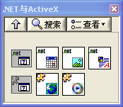

To display a webpage, call the `Navigate` method of the browser control on the Block Diagram using an **Invoke Node**:

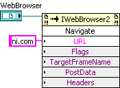

Executing the program will render the webpage inside the container on your Front Panel:

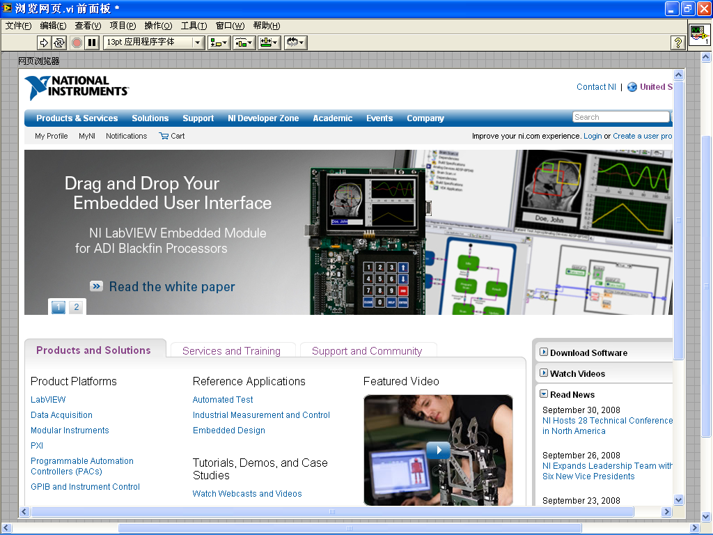

ActiveX controls expose a large number of properties and methods. You can consult the manufacturer's documentation for the specific control you are using to leverage all of its capabilities.

#### Playing MP3 Music and Video

The Windows Media Player ActiveX control provides robust media playback capabilities. Below is an example Front Panel utilizing Windows Media Player:

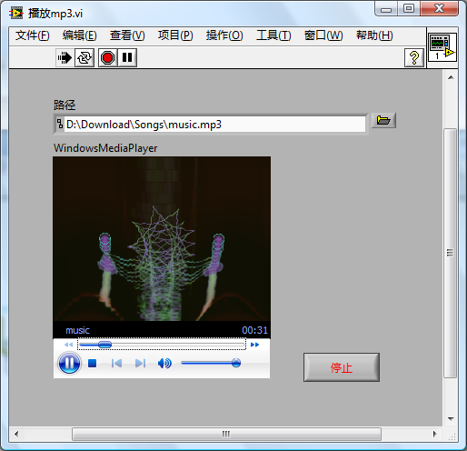

Here is the corresponding Block Diagram that controls the media playback:

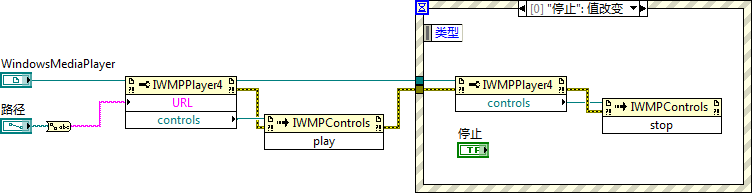


### ActiveX Control Events

In addition to properties and methods, ActiveX controls can trigger events (for example, clicking a button on a toolbar control triggers a `ButtonClick` event).

Since LabVIEW's native Event Structure cannot directly capture these external events, you must use a callback mechanism. To register a callback for an ActiveX event, use the **Register Event Callback** node (located under `Connectivity -> ActiveX` on the Function Palette).

This node requires three inputs: the ActiveX control reference, the callback VI reference, and user parameters. Connect the control reference to the top-left input, and select the desired event from the dropdown list (e.g., `ButtonClick`):

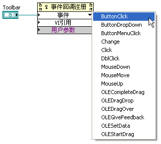

The **User Parameter** input accepts data of variant type, allowing you to pass arbitrary data to the callback VI. For example, you can pass a reference to a user-defined event so that the callback VI can notify the main event loop. (For details on user-defined events and callback VIs, see [User Interface Design Patterns](pattern_ui#callback-vis).)

Once the event is selected, right-click the **VI Reference** input and select **Create Callback VI**:

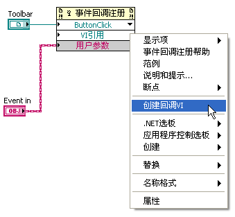

LabVIEW automatically generates a callback VI template with the correct inputs: `Event Common Data`, `Control Reference`, `Event Data`, and `User Parameter`.

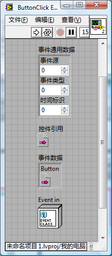
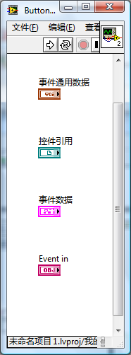

The `Event Data` cluster contains parameters passed by the ActiveX control. For a toolbar click, it includes a reference to the clicked button, allowing you to read properties like its `Key` (label).

In this example, the callback VI reads the clicked button's label and generates a corresponding LabVIEW user-defined event named after it. Unused inputs on the Block Diagram should be left connected to preserve the interface.

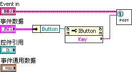

This mechanism translates the ActiveX event into a standard LabVIEW event, allowing you to handle it in a centralized Event Structure in the main program:

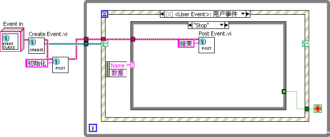


### ActiveX Documents

ActiveX documents allow files from applications like Microsoft Office to be displayed and edited directly within an ActiveX container in LabVIEW (for example, embedding a Excel chart):

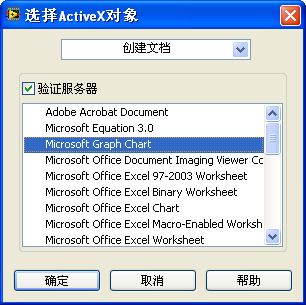

Unlike ActiveX controls, ActiveX documents cannot be programmatically controlled. To edit the embedded document, right-click it and select **Edit Object**. This launches the document's native editor (e.g., Microsoft Excel) in place or in a separate window:

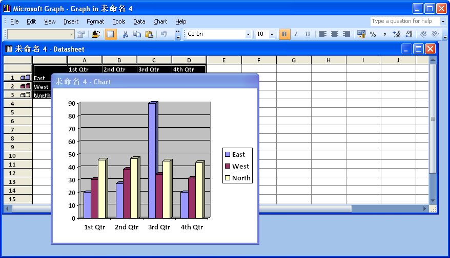

The resulting display will reflect your edits:

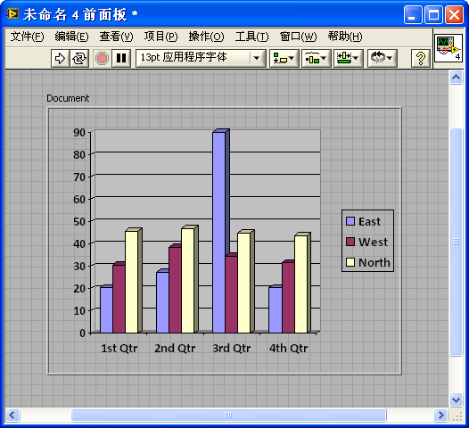


### ActiveX Automation

ActiveX automation allows LabVIEW to create and control out-of-process COM servers that do not have graphical user interface controls.

To instantiate an ActiveX automation server, use the **Open Automation Refnum** node (located under `Connectivity -> ActiveX` on the Function Palette). Drag the node onto the Block Diagram, right-click the **Automation Refnum** input, and select the ActiveX class.

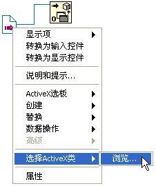

For example, to use Microsoft's Text-to-Speech (TTS) service, select the **Microsoft Speech Object Library** type library and choose the **ISpeechVoice** class:

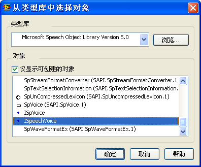

This creates the automation refnum. You can then use standard Property Nodes and Invoke Nodes to set properties or call methods. Calling the `Speak` method of `ISpeechVoice` with a string will play the audio through your speakers:

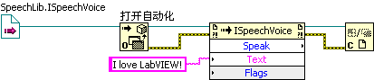


## .NET

The Microsoft .NET Framework provides a massive class library and ecosystem. You can instantiate and control .NET objects in LabVIEW in a manner almost identical to ActiveX.

To use a .NET control, place a **.NET Container** on the Front Panel and select the desired assembly and class. For example, you can embed the .NET **WebBrowser** control from the `System.Windows.Forms` assembly:

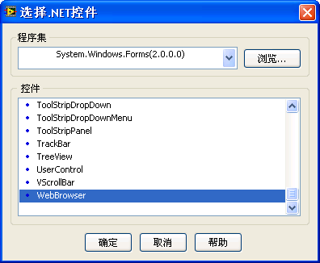

To load a webpage, call its `Navigate` method using an Invoke Node:

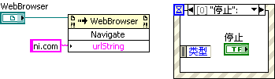


## Running System Executables (EXE)

Using the **System Exec** VI (located under `Connectivity -> Libraries & Executables`), LabVIEW programs can launch external applications or run command-line scripts. This allows you to launch notepad, open a web page in the default system browser, or run batch scripts.

The example below demonstrates how to launch Notepad from LabVIEW:

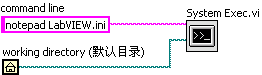

For more examples, refer to the `Calling System Exec.vi` sample located in the `[LabVIEW]\examples\comm` directory.
