# Projects and Libraries

## Project Explorer

### Functionality

The Project Explorer displays the contents of a LabVIEW project in a hierarchical tree structure, showcasing the files and resources used in the application. Developers can organize items logically within the Project Explorer, creating a clean structure regardless of where the physical files reside on disk.

Additionally, developers can analyze the call relationships among VIs. Right-clicking a subVI icon and selecting **Show VI Hierarchy**, or accessing `View -> VI Hierarchy` from the menu, opens a window showing which caller VIs invoke the selected VI and which subVIs it calls in turn.

In the **Files** tab of the Project Explorer, you can manage the physical files and folders on disk directly, eliminating the need to use the operating system's file browser.

The Project Explorer also integrates with source code control (SCC) tools, allowing developers to check files in and out directly from the LabVIEW development environment. Source code control is essential for managing version history, branching, and concurrent development in multi-developer environments.

### Hierarchical Structure in Projects

Below is a screenshot of the Project Explorer. It uses a tree structure to organize VIs, controls, libraries, and build settings:

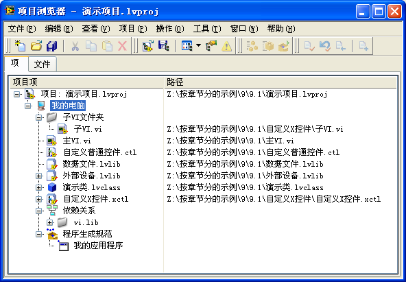

The top-level item in the tree represents the project itself. A LabVIEW project is saved on disk as an XML-formatted text file with a `.lvproj` extension.

The second level shows the execution targets. By default, you will see **My Computer**, representing the local PC. If you have toolkits installed for other hardware platforms (such as LabVIEW Real-Time or LabVIEW FPGA), those target devices (e.g., RT PXI controllers, CompactRIO chassis, or FPGA cards) will also appear at this level, as shown below:

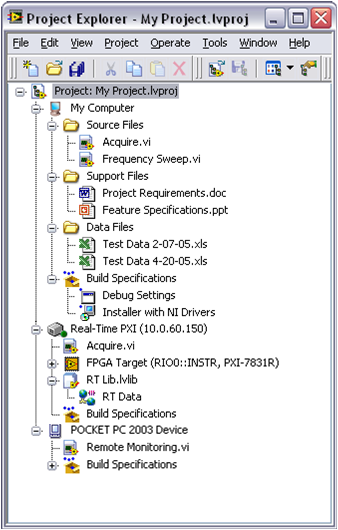

Under each target, you can organize your VIs (`.vi`), controls (`.ctl`), project libraries (`.lvlib`), classes (`.lvclass`), and XControls (`.xctl`). 

- **Dependencies**: Displays files that are called by VIs in the project but are not explicitly added to the project tree. This includes built-in LabVIEW VIs and external files. If a custom subVI appears under Dependencies, it is best practice to move it explicitly into the project structure to ensure it is not lost during deployment.
- **Build Specifications**: Contains configurations for compiling the project into standalone executables (EXEs), dynamic link libraries (DLLs), installers, source distributions, or packed project libraries (PPLs).

### File Structure

A large project typically consists of hundreds of files. To organize them, you can create **Virtual Folders** in the Project Explorer. These folders exist only in the project tree and do not reflect the physical file structure on disk.

Alternatively, you can link a project folder directly to a physical folder on disk. Right-click a virtual folder and select **Convert to Auto-Populating Folder**, then select a directory on disk. This folder will automatically synchronize: adding, removing, or renaming files in the Project Explorer will apply the changes to the disk, and vice versa.

To display the absolute disk paths of files in the project tree, select `Project -> Show Item Paths` from the menu.

### Identifying Link Conflicts

When copying projects for backups or starting a new project based on an existing one, VIs can easily become cross-linked. For example, a VI in the "Project A" folder might accidentally call a subVI located in the "Project B" folder because they share the same file name.

In the **Files** tab of the Project Explorer, files are organized strictly by their physical paths on disk. Checking this tab allows you to identify cross-linked files. In the example below, all files should reside within the "Project One" folder; the appearance of "Project Two" immediately signals a linking error:

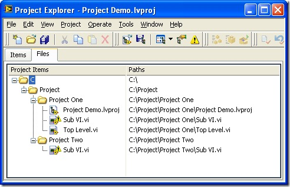

You can resolve cross-linking and move files physically on disk by dragging them to new locations directly within the **Files** tab of the Project Explorer.

### Source Code Control

For multi-developer projects, integrating LabVIEW with source code control (such as Git, Perforce, or Visual SourceSafe) is highly recommended. You can select your SCC provider globally under `Tools -> Options -> Source Control`:

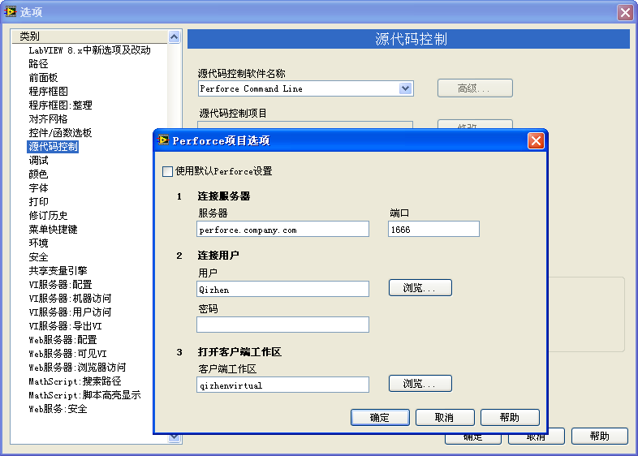

You can also override these settings for a specific project in the Project Properties dialog:

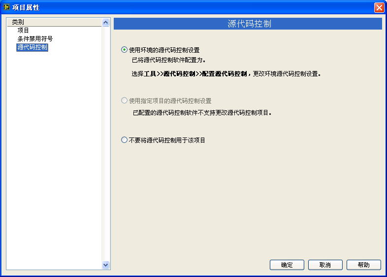

Once configured, file status icons appear next to project items in the Project Explorer. A small green square indicates a file is synchronized with the server; a red checkmark indicates the file is checked out and modified locally:

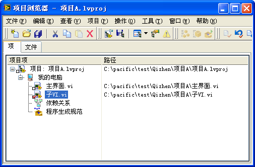

You can perform common operations like checkout, check-in, and reverting changes directly from the Project Explorer toolbar or context menu.

### Comparing and Merging VIs

Because LabVIEW code is graphical, standard text-based diff tools cannot compare versions of a VI. LabVIEW includes built-in tools to compare graphical code.

If SCC is configured, you can right-click a VI in the Project Explorer and select **Show Differences** to compare the local version with the latest version in repository. You can also manually compare any two VIs by selecting `Tools -> Compare -> Compare VIs` from the main menu:

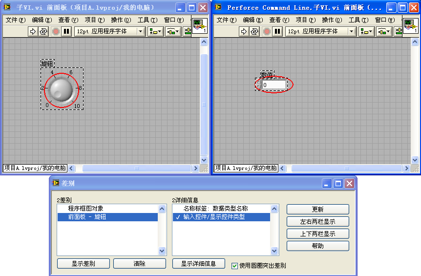

The differences are listed in a dialog box. Double-clicking any item in the list will automatically open both VIs and highlight the discrepancies on their Block Diagrams or Front Panels.

If two developers modify the same VI concurrently, you can use the **Merge VIs** tool (accessible via `Tools -> Merge -> Merge VIs`) to resolve conflicts and merge changes:

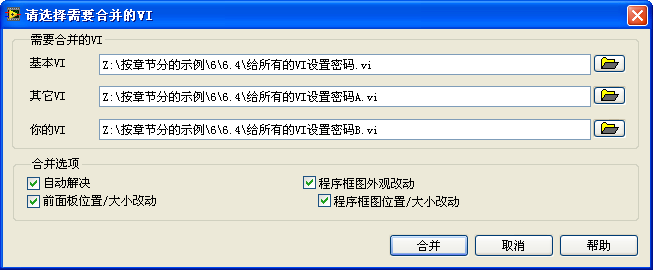

### Application Instances (Execution Environments)

VIs in LabVIEW are identified in memory by their names. In older versions of LabVIEW (prior to 8.0), you could not open two VIs with the same file name (such as `Initialize.vi`) at the same time, even if they were located in different folders. This was a significant limitation.

With the introduction of projects, LabVIEW introduced **Application Instances**. Each target in a project (and the project itself) operates in its own isolated memory space. VIs running in different application instances do not conflict, allowing you to open same-named VIs simultaneously without interference:

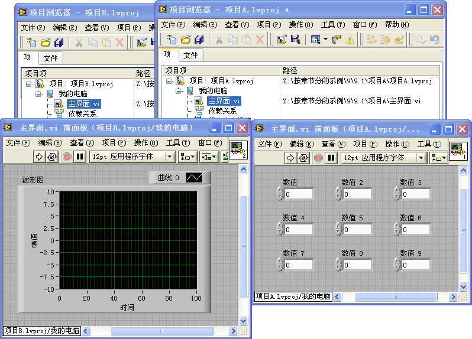

The active application instance name is displayed at the bottom-left corner of the VI window:

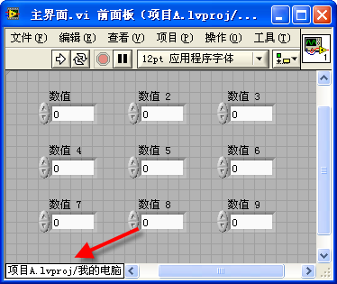

If you need to use VIs with identical names within the *same* target (for instance, if you have two different instruments that both use a subVI named `Initialize.vi`), you must place them into separate **Project Libraries**.

## Libraries

In software development, "library" often refers to dynamic-link libraries (DLLs) which are compiled binary files containing functions. In LabVIEW, a **Project Library** is a logical container saved on disk as a `.lvlib` file. It groups related VIs, controls, and settings together.

### Creating a Library

To create a library, right-click a target in the Project Explorer and select `New -> Library`. You can add VIs and controls directly to the library and organize them using folders:

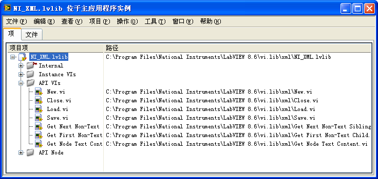

### Namespace Isolation

Standard VIs are identified solely by their filenames.

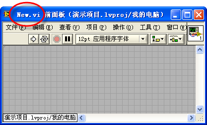

When a VI is added to a Project Library, its qualified name changes to include the library name as a namespace prefix, formatted as `LibraryName.lvlib:VIName.vi`. For example, a VI named `New.vi` inside `NI_XML.lvlib` is identified in memory as `NI_XML.lvlib:New.vi`:

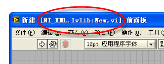

Because the qualified name includes the library prefix, VIs in different libraries can share the same file name without conflict, even within the same application instance.

*Note: You can nest libraries (e.g., `Parent.lvlib:Child.lvlib:MyVI.vi`), but this can become confusing and is generally discouraged unless necessary.*

### Setting Access Permissions

In large-scale applications, managing dependencies between modules is crucial. In my own development, I have built formatting and parsing modules intended for other team members. The module exposed a few high-level interface VIs (like Open, Read, Write, and Close) and used many low-level helper VIs internally.

Without access control, other developers would discover and call the internal helper VIs directly in their own applications. When I updated the module and modified or deleted those internal helper VIs, it broke the other developers' applications, even though the high-level interface VIs remained unchanged.

Project Libraries solve this problem by allowing you to define access permissions (**Public** or **Private**) for VIs:

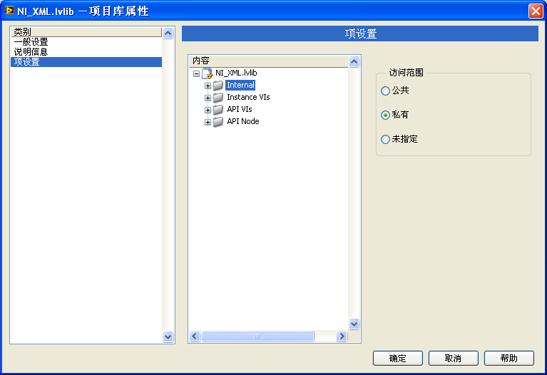

- **Public**: The VI can be called by VIs outside the library. This constitutes the module's API.
- **Private**: The VI can only be called by other VIs within the same library. 

By marking internal VIs as private, you can modify, optimize, or rename them in future updates without worrying about breaking external code, as long as the public API remains stable. You can set permissions on individual VIs or configure permissions for entire folders inside the library.

### LLB Files

An **LLB (VI Library)** is a legacy file format with a `.llb` extension. Unlike a Project Library (`.lvlib`), which only logically groups files, an LLB is a physical container (similar to a zip file) that stores VIs inside a single file on disk.

To create or manage an LLB in modern versions of LabVIEW, you must open the **LLB Manager** via `Tools -> LLB Manager`.

While LLBs were widely used in older versions of LabVIEW to package VIs and save disk space, they have significant disadvantages in modern workflows:
- **No Hierarchy**: All VIs inside an LLB are stored in a flat list, making it impossible to organize files using subfolders.
- **File Name Limits**: File names inside an LLB have strict character length limits; long names are automatically truncated.
- **Poor Version Control**: Because the entire LLB is a single file, modifying a single VI marks the entire `.llb` file as changed in your version control system, making diffs and change tracking extremely difficult.
- **Risk of Corruption**: If the single `.llb` file is corrupted, all VIs inside it can be lost.

Although National Instruments still uses the LLB format for legacy drivers and examples, it is highly recommended to use standard files organized in **Project Libraries (`.lvlib`)** for new developments.