# Publishing and Distributing Applications

Once the development of your LabVIEW application is complete, you can distribute it to end-users. 

One approach is to provide the source VIs directly, which users can run within their own LabVIEW development environment. Alternatively, for users who do not have the LabVIEW development system, you can compile the application into a standalone executable (EXE) file. Users can run the executable by double-clicking it, requiring only the free **LabVIEW Run-Time Engine** to be installed on their PC.

All deployment tools are integrated within the Project Explorer. Right-clicking **Build Specifications** and selecting **New** displays the available distribution formats: Standalone Application (EXE), Installer, Shared Library (DLL), Source Distribution, Web Service, and Zip File.

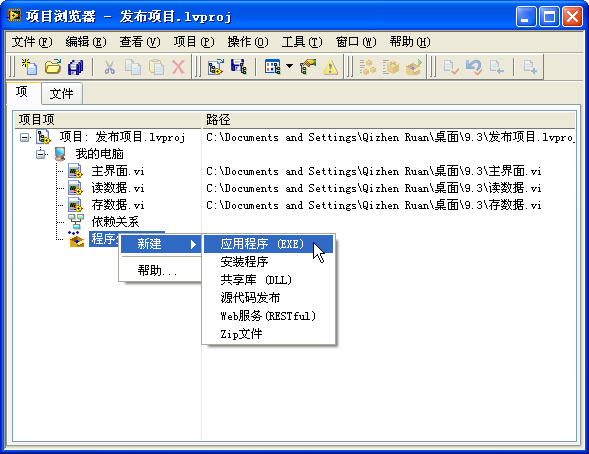

## Standalone Application (EXE)

### Application Build Specifications

Selecting `New -> Application (EXE)` opens the properties dialog for the application build specification:

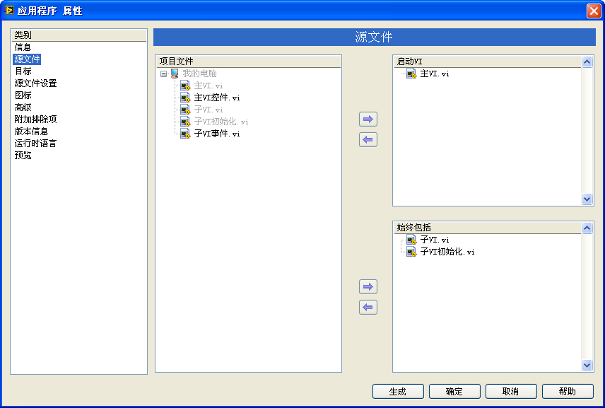

To configure the build:
1. **Startup VIs**: On the **Source Files** tab, select the main VI (typically the top-level user interface) and add it to the **Startup VIs** list. LabVIEW will compile this VI and automatically bundle all subVIs that it statically calls into the executable.
2. **Always Included**: If your application loads VIs dynamically (e.g., using VI Server calls), LabVIEW cannot detect these relationships at compile time. You must manually add these VIs to the **Always Included** list to ensure they are compiled into the executable.

### Handling File Path Changes after Compilation

When a program reads or writes to external files (such as configuration `.ini` files or databases) using relative paths, compiling the VI into an executable changes the path structure. A program that runs perfectly in the development environment might fail as an executable because it can no longer find its external files.

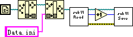

Consider the VI above, which opens a `Data.ini` file located in the same directory as the current VI. To illustrate the path change, we can display the paths at runtime:

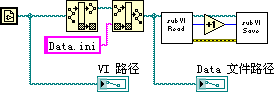

For comparison, let's say the source VI is stored in `C:\9.3\`, and the compiled executable `TestDir.exe` is placed in `C:\9.3\Application\`:

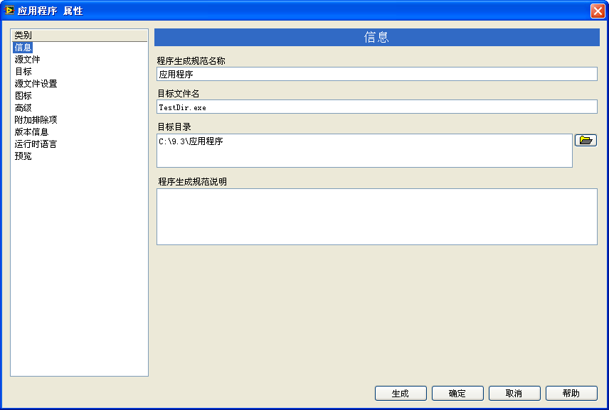

Running the application in both environments reveals how the paths differ:

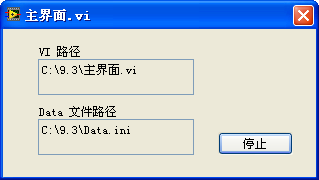
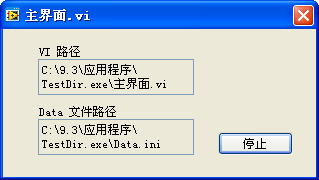

In the development environment, the VI path is its actual path on disk (`C:\9.3\Main.vi`). 

However, in the compiled executable, the path points to `C:\9.3\Application\TestDir.exe\Main.vi`. 

LabVIEW treats the executable file itself as a virtual directory. If the application attempts to find `Data.ini` in the "same folder" as the VI using the **Strip Path** function once, the resulting path points to `C:\9.3\Application\TestDir.exe\Data.ini`. Since the `.ini` file is not inside the executable, the operation fails.

There are two common solutions to this issue:

1. **Structured Development Paths**: During development, place the main VI in a subfolder (e.g., `C:\9.3\MyApp\Main.vi`) and place the data files in a parent folder (e.g., `C:\9.3\Data.ini`). The relative path from the VI is `..\Data.ini`. When compiled, the executable is built to `C:\9.3\Application\TestDir.exe`, and the data file is placed in `C:\9.3\Application\Data.ini`. The relative path from the VI inside the EXE now requires stripping two levels (`C:\9.3\Application\TestDir.exe\Main.vi` -> strip twice -> `C:\9.3\Application\`), making the relative path `..\..\Data.ini` work in both development and runtime environments.
2. **Conditional Path Resolution**: Determine the execution environment at runtime and calculate the path dynamically. Use the **Application: Kind** property of a Property Node. If it returns `Run-Time System`, the code is running as an executable, and you must strip the path twice to get the folder containing the executable. If it returns `Development System`, you strip the path once:

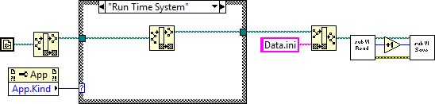

A simpler approach is to use the **Application: Directory** property, which returns the folder containing the application (either `LabVIEW.exe` or your custom executable) directly.

LabVIEW standalone applications automatically generate a configuration `.ini` file named after the executable (e.g., `TestDir.ini`) in the same folder. You can use this file to store application settings. You can retrieve the application's path and name dynamically using Property Nodes:

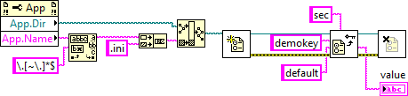

LabVIEW also features the **Default Directory** constant . In the development environment, it points to the `[LabVIEW]\vi.lib` folder. However, once compiled, the application runs independently of the LabVIEW development environment, and this constant returns an empty path.

If your compiled application needs to find the LabVIEW installation path on a machine, it must retrieve this information by reading the Windows Registry, where LabVIEW installation paths are stored under standard keys.

### Other Settings

The build properties dialog also allows you to configure:
- **Icon**: Define a custom `.ico` file for the executable.
- **Version Information**: Set file and product version numbers, company name, and copyright details.
- **Preview**: View the list of physical files that will be generated and their destination paths before committing to the build.

## Shared Libraries (DLLs)

If you are developing modular code in LabVIEW to be called by other environments (such as C++, Python, or C#), you can compile your VIs into a **Shared Library (DLL)**. Each exported VI becomes a callable function within the DLL.

Select `New -> Shared Library (DLL)` from the build specification menu. Unlike an executable which only needs a single startup VI, you must explicitly specify which VIs will be exported on the **Exported VIs** tab:

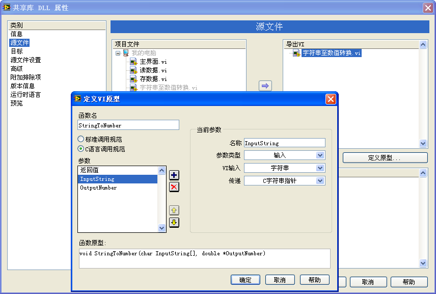

Click **Define prototype** to configure the exported C function prototype. You can rename the function (especially if the VI name contains spaces or non-English characters) and define the parameters.

Data types in C differ from LabVIEW data types. For example, a LabVIEW string contains length metadata, whereas C functions expect a null-terminated `char*` pointer, often paired with an integer parameter representing the string buffer length.

When compiling a DLL, LabVIEW generates the `.dll` file, an import library `.lib` file, and a C header `.h` file containing the function prototypes. It is highly recommended to use simple data types (numeric, boolean, flat arrays, and flat strings) for exported functions. If you use complex clusters, LabVIEW exports them as custom structures (e.g., `TD1`, `TD2`), which can be difficult to construct and parse in text-based environments without importing the LabVIEW C-interface APIs (`extcode.h`).

## Source Distributions

### Distributing Source Code

If you are developing a toolkit or library for other LabVIEW developers, you will distribute the code as source VIs. 

To protect your intellectual property and optimize performance for the end-user, you can use the **Source Distribution** build specification (`New -> Source Distribution`). This allows you to package a collection of VIs while applying settings globally:

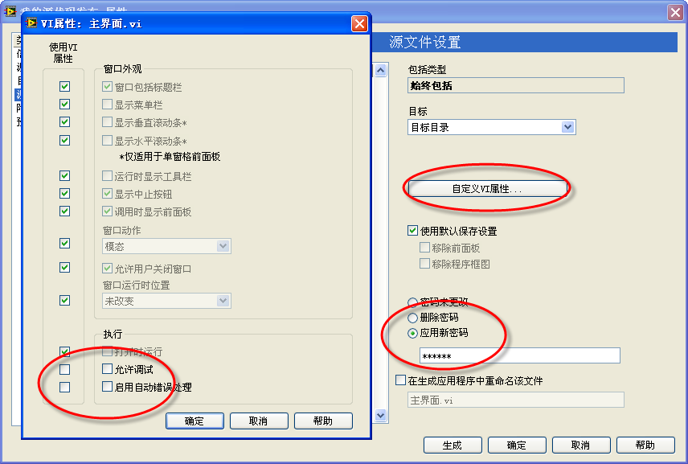

In the settings, you can:
- **Apply Password Protection**: Lock the Block Diagrams of the VIs so users can run them but cannot inspect or modify the code.
- **Remove Block Diagrams**: Remove the Block Diagram code entirely. This provides the highest level of IP protection and reduces file sizes, but VIs with removed Block Diagrams are strictly locked to the LabVIEW version they were compiled in (e.g., a VI with its diagram removed in LabVIEW 2021 cannot run in LabVIEW 2022).
- **Remove Front Panels**: Remove the user interfaces of subVIs that do not require visual interaction, reducing memory footprint.

### Customizing the Controls and Functions Palettes

If you are distributing a library of VIs for developers, you can add them to the LabVIEW **Functions Palette** so they can be dragged onto the Block Diagram during programming.

There are two ways to add VIs to the palettes:

1. **Automatic Placement**: Place the VIs in the `[LabVIEW]\user.lib` directory. LabVIEW automatically scans this folder and displays the VIs under the **User Libraries** category on the Functions Palette. *Note: Files or folders starting with an underscore (e.g., `_helper.vi`) are ignored and will not appear on the palette.*
2. **Manual Palette Editing**: Select `Tools -> Advanced -> Edit Palette Set`. This opens the palette set in editing mode. Right-clicking a blank space in the palette opens the edit menu:

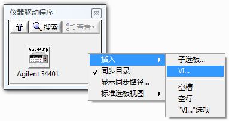

Select `Insert -> VI` and choose the VI you want to add. When finished, click **Save Changes** in the edit dialog box to write the changes to the palette configuration (`.mnu`) files:

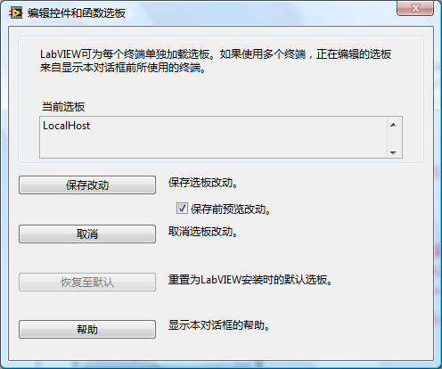

Normally, dragging an icon from the palette places the VI as a subVI node. However, you can configure an icon to insert the **actual contents** of a template VI directly onto the block diagram (similar to dragging a While Loop structure).

To configure this, create a template VI containing the code nodes and Front Panel controls you want to insert. Add this VI to the palette, right-click its icon in the palette editor, and select **Place VI Contents**:

When a developer drags this icon onto their Block Diagram, LabVIEW copies the internal code and controls directly into the target VI rather than instantiating a subVI node. This is highly useful for distributing standard design pattern templates, such as an **Event Loop** or a **State Machine**.

## Web Applications

### Remote Front Panels

If you need to monitor and control a LabVIEW application running on a remote machine (e.g., a test system in a cleanroom monitored from an office), you can use the **Remote Front Panel** feature.

First, enable the built-in web server on the host machine: go to `Tools -> Options`, navigate to **Web Server**, and check **Enable Web Server**. Open the target VI on the host machine.

On the client machine, open LabVIEW and select `Operate -> Connect to Remote Front Panel`:

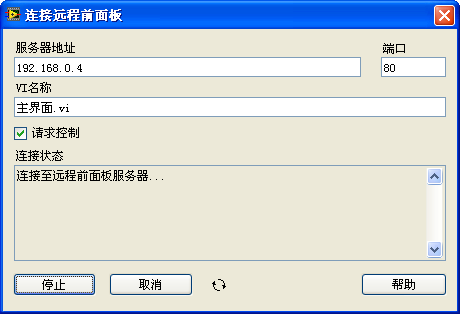

Enter the IP address of the host machine and the name of the VI. If you want to interact with the controls, check **Request Control**. Click **Connect** to display the VI's Front Panel inside your local window:

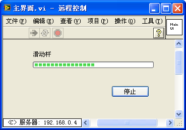

On the host machine, you can monitor and manage active connections by selecting `Tools -> Remote Front Panel Manager`:

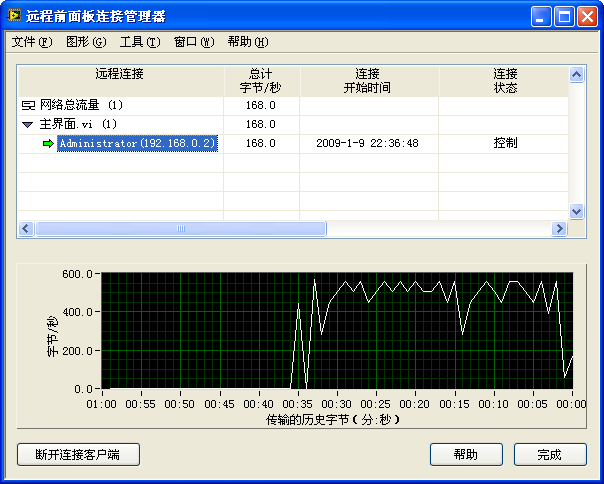

### Web Publishing Tool

The limitation of Remote Front Panels is that the client machine must have the same version of LabVIEW installed. To allow clients to view the Front Panel using a standard web browser, use the **Web Publishing Tool** (`Tools -> Web Publishing Tool`):

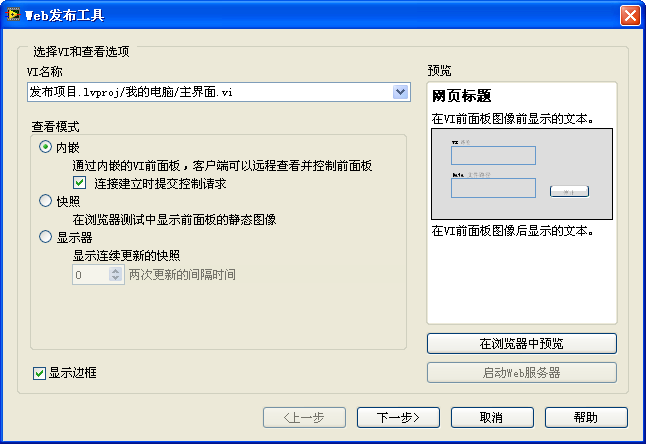

This wizard generates an HTML page containing an embedded browser control of the target VI and saves it to the LabVIEW web server directory (by default, `[LabVIEW]\www`).

Client machines can access the VI Front Panel by typing the host's IP address and the HTML file name in their web browser:

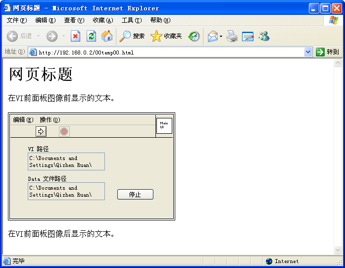

### Web Services

While Web Publishing exposes the graphical interface, a **Web Service** exposes raw VI execution endpoints via HTTP/HTTPS. This allows external applications (written in Python, Javascript, C#, etc.) to send data to LabVIEW VIs and receive responses using standard RESTful protocols (GET/POST).

To create a Web Service, right-click **Build Specifications** and select `New -> Web Service`. You can map specific VIs to URL paths, allowing them to act as web API handlers.

## Installers

 standalone applications and shared libraries require the **LabVIEW Run-Time Engine** to execute on a target PC. To package your application along with its dependencies, configuration files, and the required runtime engines, create an **Installer**.

Select `New -> Installer` from the build specifications menu. On the **Source Files** tab, specify the files to install:

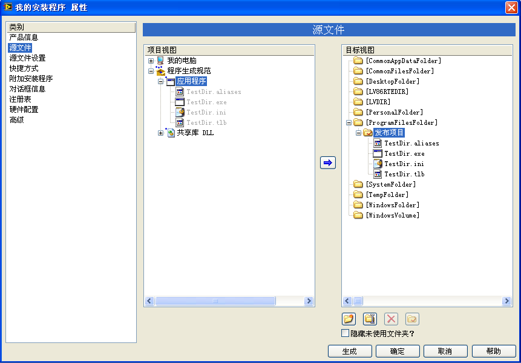

On the **Additional Installers** tab, check the required components (such as the LabVIEW Run-Time Engine, NI-DAQmx drivers, or NI-VISA runtime):

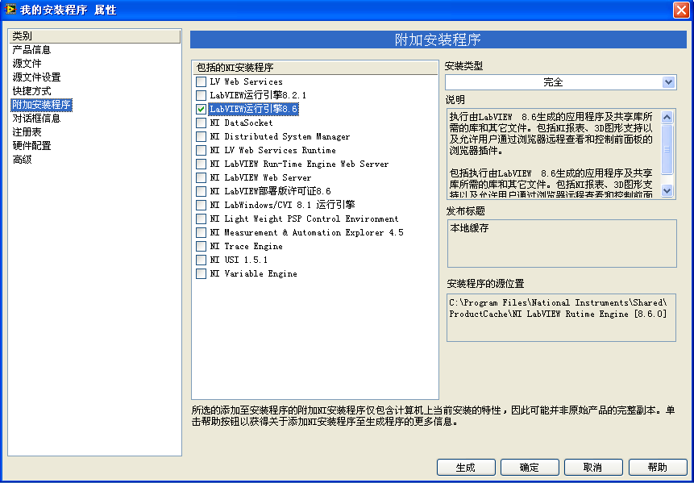

Including runtime engines can increase the installer package size by hundreds of megabytes. If the target machine is guaranteed to already have the necessary engines and drivers installed, you can exclude them to keep the installer package small.

## Zip Files

To distribute your application as a "green" portable package without an installer, select `New -> Zip File` in the build specifications. This packages the executable and its relative configuration files into a single compressed `.zip` archive.

## Packed Project Libraries (PPL)

In text-based environments like Visual Studio, a Solution can contain multiple Projects (e.g., an EXE project and multiple DLL projects). You can configure dependencies so that building the EXE automatically compiles the dependent DLL projects.

In LabVIEW, the project structure is historically flat; all VIs compile together into a single large executable, which can lead to long compile times.

To enable modular development, LabVIEW 2010 introduced **Packed Project Libraries** (file extension `.lvlibp`). A PPL is a compiled project library.

Consider a project containing a library named `My Algorithm Library.lvlib`:

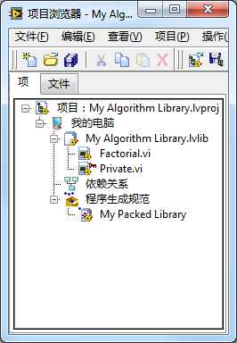

Right-click **Build Specifications** and select `New -> Packed Library` to configure the PPL:

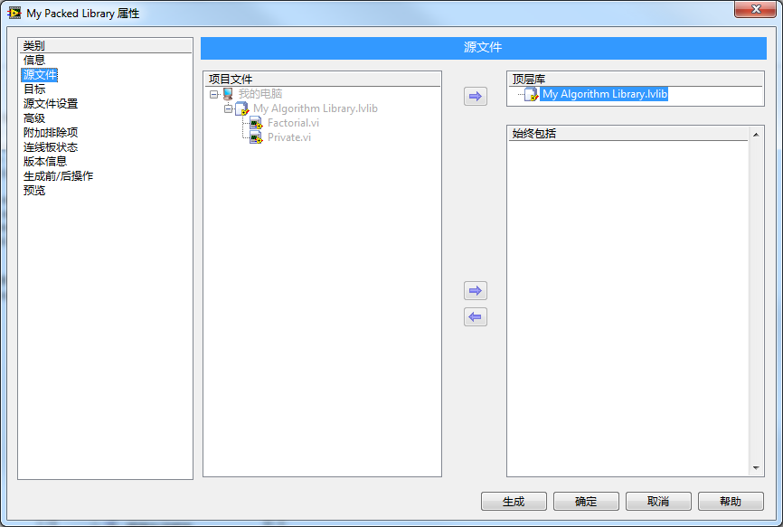

This compiles the library into a single `.lvlibp` file. Users can open this file to view and call the public VIs, while the private VIs remain compiled, hidden, and protected:

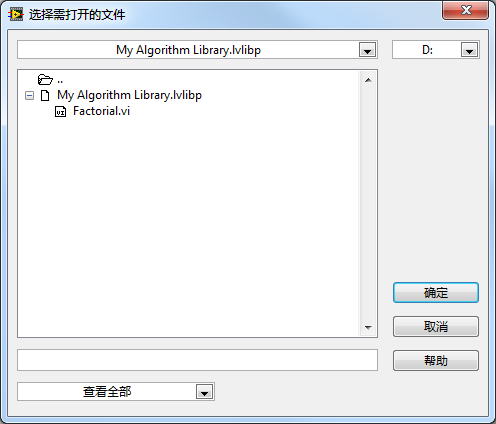

You can add this `.lvlibp` file directly to another LabVIEW project:

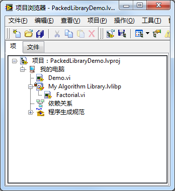

### Packed Libraries vs. Standard Libraries

- **Standard Library (`.lvlib`)**: A logical grouping of individual VI files on disk. The VIs remain editable, and their source code is exposed.
- **Packed Library (`.lvlibp`)**: A compiled, single-file binary containing all the library's VIs and resources. The VIs inside are read-only and pre-compiled. Private VIs are completely hidden.

PPLs are ideal for distributing modular plugins or libraries. Because they are pre-compiled, incorporating them into a larger project reduces the overall compilation time of the final application. *Note: The PPL and the project calling it must be compiled using the exact same version of LabVIEW.*