# Data Acquisition

Data acquisition (DAQ) is the foundational first step of most test and measurement applications. It is responsible for digitizing and collecting signals representing physical quantities from hardware devices.

## Utilizing Device Drivers

Regardless of the DAQ hardware you use, employing a LabVIEW-specific driver dramatically simplifies development. Hardware devices for data collection are highly diverse, spanning card-based DAQ boards, benchtop instruments, and embedded smart sensors. Although their drivers vary, their operational lifecycles are identical: initializing the device, configuring its hardware settings, reading or writing data, and closing the device session to release resources.

NI-designed hardware comes with native LabVIEW drivers (such as NI-DAQmx). Most third-party hardware manufacturers also provide LabVIEW instrument drivers, which can be downloaded from their websites.

For stand-alone instruments, LabVIEW features the **Find Instrument Drivers** finder to locate, download, and install drivers from the NI Instrument Driver Network (IDNet). This tool is accessible via **Tools >> Instrumentation >> Find Instrument Drivers...**.

The figure below shows the startup screen of the tool:

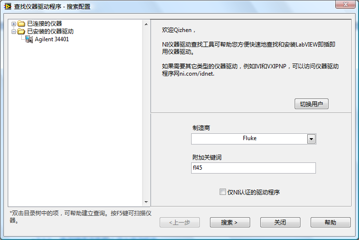

To use this tool, log in using your ni.com credentials. You can then search for drivers by manufacturer, model name, or keywords. The figure below shows typical search results:

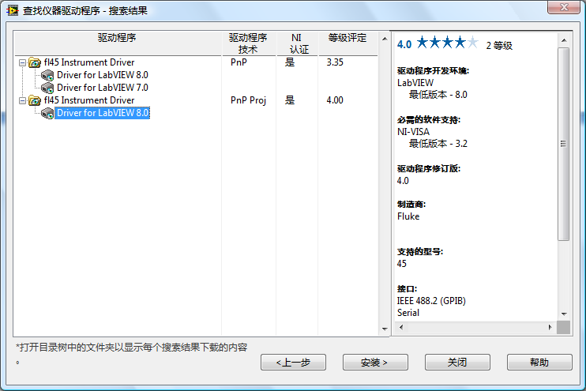

## Calling C-Language Drivers in LabVIEW

Some hardware lacks native LabVIEW drivers but provides C-language API libraries instead. These are typically distributed as Dynamic Link Libraries (DLLs) on Windows (or shared libraries on other OSs) alongside a C header file (`.h`) declaring the function prototypes.

In LabVIEW, you can call these DLL functions directly using the **Call Library Function Node (CLFN)**. However, wiring CLFNs directly on your main Block Diagram is cumbersome. A much cleaner practice is to wrap the C-language driver functions into a reusable LabVIEW VI library.

You can do this easily using LabVIEW's **Import Shared Library** wizard (**Tools >> Import >> Shared Library...**), which parses the header file and automatically generates wrapper VIs for all functions in the DLL. Using wrapper VIs is far superior to using raw CLFNs because the VIs can be documented with descriptions, parameter ranges, and standard LabVIEW error terminals.

For high-use drivers, you should design a professional, unified API library rather than just exposing 1-to-1 mappings of DLL functions. A single, intuitive LabVIEW VI can invoke multiple underlying DLL functions to perform a logical operation (e.g., initializing, configuring, and checking errors in a single step). You can look at the architecture of standard IVI instrument drivers as a design reference for wrapping DLLs.

## Developing Custom Instrument Drivers

For simpler or custom-built devices that do not come with any driver software, you must communicate with them directly using low-level commands (typically ASCII strings or binary packets) sent over standard communication buses.

Instruments connect to PCs via physical buses like GPIB, USB, Serial (RS-232), or Ethernet (TCP/IP). In LabVIEW, you control these connections using the **Virtual Instrument Software Architecture (VISA)** API (located under **Programming >> Instrument I/O >> VISA**). The most common functions are **VISA Write** and **VISA Read**:

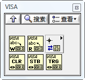

By supplying a properly formatted **VISA Resource Name** (e.g., `GPIB0::2::INSTR` or `TCPIP0::192.168.1.100::inst0::INSTR`), VISA handles the underlying hardware protocol transport automatically.

Calling raw VISA functions directly in your application code is bad practice. Instead, you should design a custom Instrument Driver. This is a modular VI library that encapsulates command sequences into logical VIs (e.g., *Initialize.vi*, *Configure Voltage.vi*, *Read Measurement.vi*, *Close.vi*). For example, a single *Read Measurement.vi* might perform a serial sequence of: **VISA Write** (sending the query command), **VISA Read** (retrieving the ASCII response), and string formatting (parsing the text into a numeric double). The block diagram below shows a VI from the Agilent 34401 multimeter driver, which encapsulates this exact command-response pattern using VISA functions:

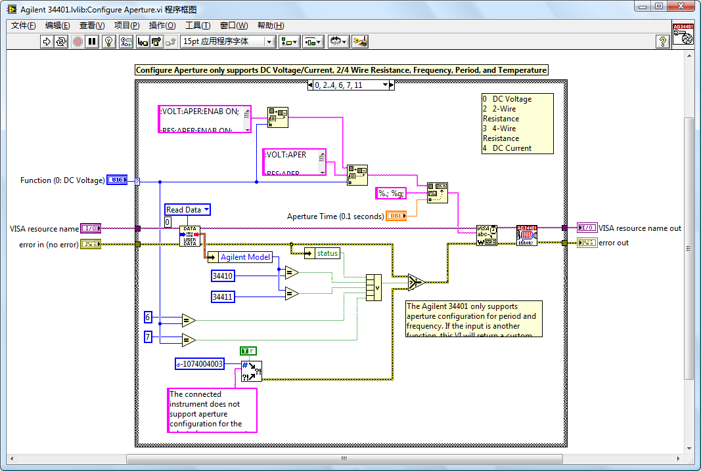

When building an instrument driver, align its architecture with industry standards like the National Instruments Instrument Driver Guidelines. Organizing the driver VIs in a standard palette structure (Initialize, Configure, Action/Status, Data, Utility, Close) makes it immediately familiar to other LabVIEW developers, reducing their learning curve.

## Interchangeable Virtual Instrument (IVI) Drivers

The **Interchangeable Virtual Instrument (IVI)** driver standard is defined by the IVI Foundation to enable hardware interchangeability at runtime.

Traditional instrument drivers bind your software application to a specific instrument model and driver. If you swap a multimeter (e.g., replacing a Fluke 45 with an Agilent 34401A), you must rewrite and recompile the test code to use the new driver VIs. IVI solves this by decoupling the application logic from the physical hardware.

To achieve this, the IVI Foundation standardized API interfaces for common instrument classes, such as oscilloscopes, digital multimeters (DMMs), and function generators. Each category has an **IVI Class Driver** defining standard properties and functions, and an **IVI Specific Driver** written for a particular instrument model. The class driver acts as a polymorphic interface: it intercepts calls from the application and routes them to the active specific driver (e.g., the `IviDmm` class driver routing commands to the `fl45` specific driver).

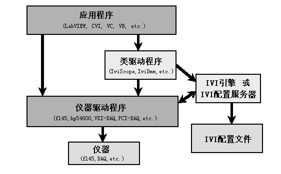

The mapping between the Class Driver and the Specific Driver is configured externally in the IVI Configuration Store. You configure these logical names, driver sessions, and hardware assets using **Measurement & Automation Explorer (MAX)**, which is installed alongside LabVIEW. 

By writing your test applications using IVI Class VIs, swapping physical hardware is as simple as updating the mapping in MAX. You do not need to edit or recompile a single line of your application code. This architecture is highly beneficial for large-scale industrial test systems or calibration software deployed across multiple labs with varying equipment configurations.

## Software vs. Hardware Timing

Many LabVIEW applications require specific tasks to execute at timed intervals. The level of precision required varies significantly depending on the application.

For simple UI updates or control loops, timing constraints are relatively relaxed. Consider this program:

It performs calculations and refreshes the user interface roughly every 200 milliseconds. A timing deviation of $\pm$20 ms does not affect its usability or accuracy.

Conversely, high-speed data acquisition demands extreme timing precision. If you are sampling a physical waveform, the time interval between individual data points must be highly stable (often requiring sub-nanosecond jitter) to prevent signal distortion.

### Basic Timing Functions

For general software timing, LabVIEW provides several primitives in the **Programming >> Timing** palette, including **Tick Count (ms)**, **Wait (ms)**, **Wait Until Next ms Multiple**, **Time Delay**, and **Elapsed Time**.

To measure execution time, you can query **Tick Count (ms)** before and after a block of code, as shown below:

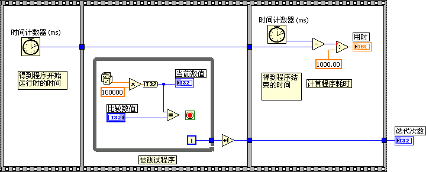

The **Elapsed Time** Express VI provides similar timing measurements but includes built-in output flags for elapsed time thresholds.

For simple delays, you can use the **Wait (ms)** or **Time Delay** functions. In desktop operating systems like Windows, these functions have a resolution limit of 1 to 2 milliseconds, and their execution accuracy can deviate by several milliseconds depending on CPU load. **Wait Until Next ms Multiple** provides slightly higher precision because it aligns execution to the system clock grid.

For basic UI loops, **Wait (ms)** is perfectly sufficient. For low-speed software-timed data acquisition, **Wait Until Next ms Multiple** is a better choice. However, if your application requires high-precision or deterministic timing, you must look to advanced techniques.

### Wait vs. Wait Until Next ms Multiple

In loop-based software execution, the two most common timing functions are **Wait (ms)** and **Wait Until Next ms Multiple**.

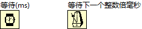

- **Wait (ms)**: Pauses execution for the specified $n$ milliseconds. The delay begins when the execution path hits the function.
- **Wait Until Next ms Multiple**: Pauses execution until the system millisecond clock becomes an integer multiple of $n$.

Let's compare these functions inside a While Loop. In the figure below, suppose the combined execution time of the **Read Data** and **Write Data** functions is $m$ milliseconds. If $m < 50$ ms, and the target loop time is 100 ms:

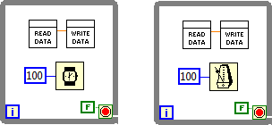

#### Cumulative Error (Jitter)

The **Wait (ms)** function starts its delay *after* the other VIs in the loop finish executing. The total time for one iteration is therefore $m + 100$ ms. Because $m$ varies slightly between iterations depending on operating system scheduling, this variation causes loop-time jitter. Furthermore, these errors accumulate over time, making it impossible to maintain a stable long-term loop frequency.

Conversely, **Wait Until Next ms Multiple** aligns execution with absolute system clock intervals (e.g., waking up at exactly 100 ms, 200 ms, 300 ms, etc.). Even if $m$ fluctuates, the function adjusts the sleep duration dynamically to hit the next multiple. Jitter is limited to the OS scheduling variation of a single iteration (typically $\pm$1–5 ms under Windows), and the error does not accumulate over time.

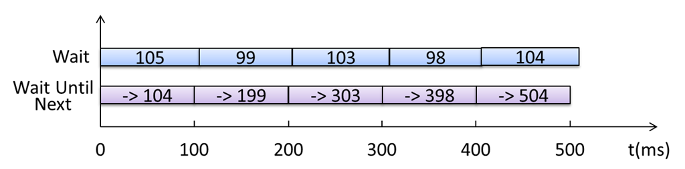

#### Timing the First Iteration

The two functions behave differently on the very first loop iteration. What will be the value of $x - y$ (measuring the total loop execution time) in the programs below?

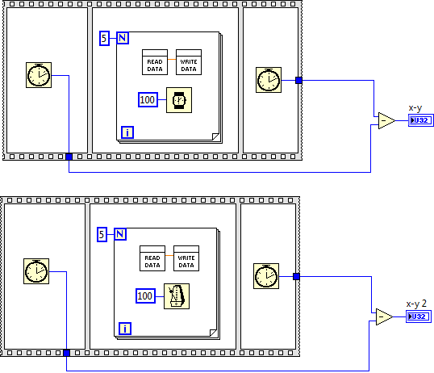

- For the **Wait (ms)** loop, the result is consistently 500 ms because each iteration runs for a flat 100 ms.
- For the **Wait Until Next ms Multiple** loop, the result is non-deterministic, ranging between $400 + m$ and $500$ ms. This occurs because the function does not align with the program's start time; it aligns with the system clock. The first iteration's wake-up can occur anywhere from 0 to 100 ms after the loop starts.

If your loop requires a precise delay on the very first iteration, you can run an initial empty **Wait Until Next ms Multiple** to align with the clock grid before entering the main processing loop:

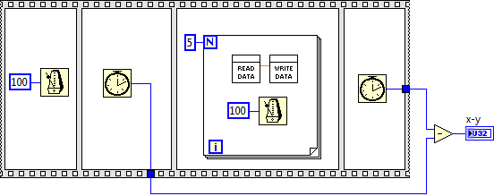

#### Parallel vs. Serial Wiring

In the loops above, the timing functions run in parallel with the data tasks. This allows the delay to dictate the loop time. However, if you wire the timing function in series (using sequence structures or error wires) to enforce a specific execution order:

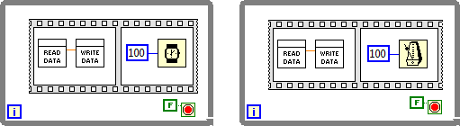

- For **Wait (ms)**, serial wiring forces the total loop duration to become $2m + 100$ ms. Any change in the execution time of the read/write VIs directly increases the loop period.
- For **Wait Until Next ms Multiple**, the loop duration remains exactly 100 ms (provided that $2m < 100$ ms), because the function dynamically adjusts its sleep time to meet the absolute wake-up grid.

### Timing with Event Structure Timeouts

An **Event Structure** can act as a loop timer via its Timeout terminal (the hourglass node in the upper-left corner). Wiring a millisecond value (e.g., `30`) triggers the **Timeout** event case at that interval if no other events occur.

Timing via Event Structure timeouts has similar precision to the **Wait (ms)** function. If your application already uses an Event Structure for UI interaction, adding a timeout case is a clean, low-overhead way to handle periodic tasks (such as updating an animation frame or refreshing a sensor readout):

### Timed Loops

The timing methods discussed above run on desktop operating systems (like standard Windows) and suffer from low precision and jitter due to OS task scheduling. For high-precision or deterministic software timing (especially on real-time targets like NI CompactRIO or PXI running RTOS), you should use **Timed Loops**.

A **Timed Loop** (located under **Programming >> Structures >> Timed Structure**) runs at a configurable priority and aligns with specific timing sources (such as the system real-time clock or hardware scan clocks). 

For example, in a long-running test program:
- Using **Wait (ms)** accumulated several minutes of timing drift after an hour of execution.
- Using **Wait Until Next ms Multiple** reduced the drift to under a minute.
- Using a **Timed Loop** reduced the drift to just a few seconds on a PC, and achieved microsecond-level determinism on a Real-Time OS.

In desktop applications, Timed Loops are also useful for setting execution priorities, handling multiple timing sources, or dynamically adjusting the loop period during runtime.

### Hardware Timing

For high-speed measurements (e.g., reading 1,000 to 1,000,000 samples per second), software timing is completely unviable. Software loops cannot resolve sub-millisecond intervals on standard Windows, and software jitter would distort the captured waveform.

Instead, professional DAQ applications use **Hardware Timing**. DAQ boards have high-precision onboard crystal oscillators (hardware clocks) that trigger analog-to-digital conversions. The device driver automatically stores these samples in a hardware FIFO buffer, which is periodically read in batches by the host application.

Consider a continuous audio capture example. Using a Sound Capture Express VI is unsuitable here because it is designed only for single, one-off recordings. For continuous streaming, we use the low-level API VIs located under **Programming >> Graphics & Sound >> Sound >> Input**.

The diagram below shows a continuous audio capture program. First, **Configure Sound Input** sets the hardware clock to a sampling rate of 22,050 Hz. We configure it to read 5,000 samples per iteration. The sound card's onboard hardware clock handles the high-precision sampling, filling a buffer. When 5,000 points are collected, the driver transfers them to PC memory in a single batch, and the While Loop displays the waveform:

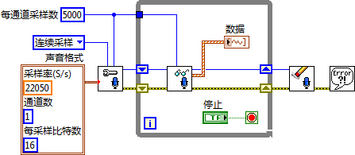

Reading and displaying data in batches is highly CPU-efficient and ensures that no samples are lost, achieving gapless, high-precision signal acquisition.