# Data Display

In the section on graphical data display covered earlier, we detailed methods for showcasing waveform data in LabVIEW. This section focuses on some specialized approaches for displaying test and measurement data.

## Interrupted Curves

In some applications, you need to plot discontinuous curves with breaks or gaps. For example, if a signal is active from 0 to 1 second, drops out from 1 to 2 seconds, and reappears from 2 to 3 seconds, you want to leave a blank gap in the plot during the inactive interval.

Setting the signal values to `0` during the dropout window is incorrect, as this will draw a horizontal line at $Y = 0$. The proper solution is to insert **NaN (Not-a-Number)** values into the data array. The LabVIEW graph plot engine ignores NaN data points, leaving a clean break in the plotted line.

For example, to display only the positive halves of a sine wave, we can replace all values less than 0 with NaN. The Block Diagram below implements this logic:

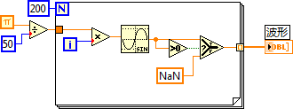

Here's the outcome:

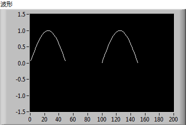

This technique is also useful for creating multi-color plots. For example, if you want a sine wave to be red when positive and green when negative, you can pass a 2D array representing two separate plots to the Waveform Graph/Chart: one plot containing the positive data (with negative values replaced by NaN) styled as red, and the other containing the negative data (with positive values replaced by NaN) styled as green. Because the plots are aligned, they appear to the user as a single, dynamically color-changing curve.

## Displaying Large Datasets

High-speed DAQ boards can capture millions of samples per second. Directly rendering millions of points onto a Waveform Graph or Chart is extremely inefficient and can cause the user interface to freeze.

Furthermore, displaying millions of points is unnecessary due to physical monitor limits. On a standard display with a width of 1920 pixels, a graph can resolve at most 1,920 horizontal data points. Passing more data points than the pixel width of the control is a waste of memory and CPU cycles. For maximum performance, you should downsample the dataset before rendering to match the display resolution.

To keep the overall shape of the signal intact, you can use uniform decimation (downsampling). For example, if the raw data contains 100,000 points and the graph control width is 200 pixels, extract every 500th sample to build a decimated display array:

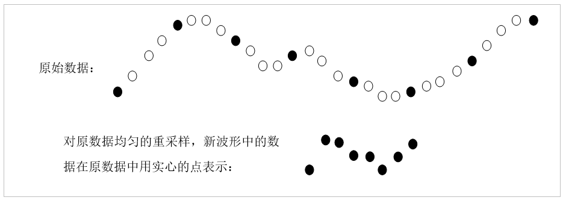

Rendering large datasets is a common source of performance bottlenecks. Reading gigabytes of binary data from disk and decimation-on-the-fly are CPU-heavy operations. If an application must load and display large files frequently, a best practice is to pre-calculate and save a decimated "thumbnail" dataset alongside the raw file (e.g., in a TDMS file with a separate low-resolution channel group). The application can then load the thumbnail file instantly for full-span displays, bypassing the need to parse the entire raw file.

While a decimated thumbnail preserves the macro shape of the signal, it loses micro details. If the user uses the Zoom tool to inspect a specific interval of the waveform, the decimated data will look pixelated or incorrect. When a zoom event is detected (such as via the **XScale.Range: Value Change** event), the application must intercept the event, query the active coordinate range, read only the corresponding raw data slice from disk, downsample it to fit the current pixel width, and update the graph.

For example, suppose a signal is sampled at 10 kHz for 10 seconds (100,000 raw points). Our graph has a display width of 200 pixels. To show the full 10 seconds, we extract every 500th point, resulting in a 200-point array spanning the full 10 seconds (effective sampling rate of 20 Hz).

If the user zooms in to inspect the interval between the 3rd and 4th seconds, the display area focuses on raw samples 30,000 to 40,000 (10,000 points). To display this 1-second window on the 200-pixel graph, the application reads the 10,000 raw points and extracts every 50th sample, resulting in a 200-point array that reveals the high-resolution details of that specific second.

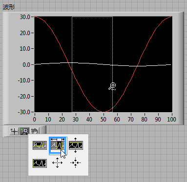

## High-Speed Real-Time Visualization

In many real-time testing applications, the system must acquire and display data concurrently. If the sampling rate is relatively low (e.g., under 1 kHz), you can wire data points directly to a **Waveform Chart**, which manages its own history buffer and scrolls automatically.

However, if the DAQ board is sampling at 100 kHz, writing every single sample to a UI chart is impossible. The human eye cannot resolve changes at 100,000 frames per second, and trying to redraw a control at that rate will completely lock the UI thread. To keep the UI responsive, you must separate the acquisition rate from the display rate. For example, while the acquisition thread collects all 100,000 points per second, the UI thread reads the data in batches and updates the chart at a comfortable refresh rate of 10 to 20 Hz (e.g., displaying a downsampled summary of the data).

While decimation works for general monitoring, it loses high-frequency transients. To inspect micro-second details of a signal, you can capture and display a short high-resolution snapshot (e.g., a 1 ms window of raw data) and hold it on the screen for 1 second before capturing the next snapshot. While this lets the operator inspect the signal details, it means the application only visualizes 0.1% of the total stream, ignoring the other 99.9%.

If the signal is periodic (like a sine or square wave), we can stabilize the display using the operating principles of an **Oscilloscope**. By ensuring that each rendering frame starts at the exact same phase of the signal's period, successive frames will overlap perfectly. This eliminates jitter and flickering, making the waveform appear static and clear even at high update rates (e.g., 20 to 30 Hz):

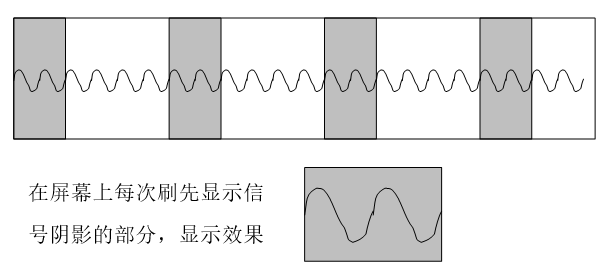

To achieve this, the software must implement a **Trigger** algorithm (such as an analog edge trigger). The algorithm scans the buffer for a specific trigger condition—such as the signal crossing a threshold voltage on a rising edge. Once the trigger point is located, a fixed window of data starting from that index is sliced and plotted.

The figure below shows a basic software oscilloscope that captures and displays audio signals from a PC sound card. The block diagram reads the audio buffer, detects the trigger point using a threshold check, and extracts a slice of the waveform for display:

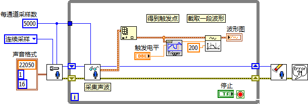

The figure below shows the running interface of the sound card oscilloscope. We generate a clean square wave through the computer speakers and capture it using a microphone. Due to acoustic and transducer distortion, the captured signal is deformed, but the periodic waveform remains locked and stable on the graph thanks to the software trigger. Adjusting the square wave's frequency or amplitude immediately updates the display in real-time without flickering:

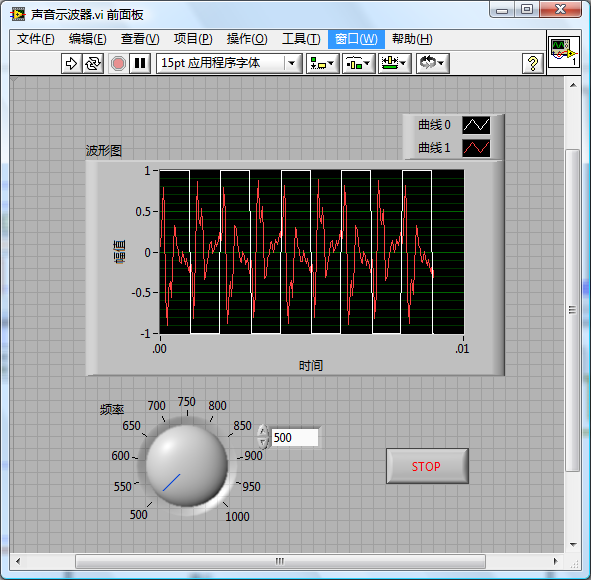

### Detecting and Selecting Plots with the Mouse

In applications displaying multiple curves, users often need to interact with specific plots (e.g., clicking a line to highlight it or display its status). To determine which plot the user clicked, you can use the **Get Plot at Position** method on the Waveform Graph/Chart control. This method takes the mouse coordinates (from a Mouse Down event) and returns the index of the clicked plot, or `-1` if no plot is near the click.

The block diagram below demonstrates this:
The VI initializes by plotting two random curves and listens for a **Mouse Down** event on the graph. When clicked, it calls the **Get Plot at Position** method. If a plot is detected, the program uses the **Active Plot** and **Plot.LineWidth** properties to set its line width to `2` to highlight it, while resetting the other plots to a width of `1`:

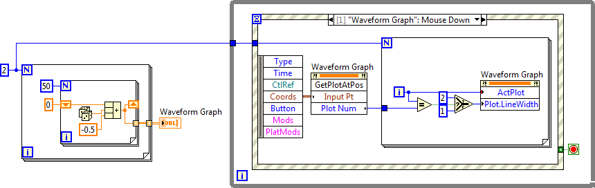

The effect of the program's execution is demonstrated below, where Plot0 has been thickened after selection:

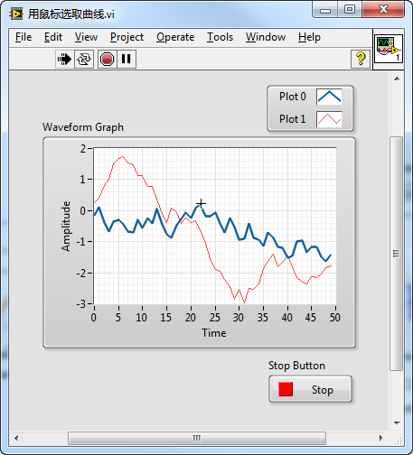

### Time-Frequency Spectrogram Analysis

The **LabVIEW Advanced Signal Processing Toolkit** provides advanced functions for time-series, time-frequency joint analysis (TFJA), and wavelet analysis.

For example, the Short-Time Fourier Transform (STFT) joint time-frequency analysis discussed in [Data Visualization](data_graph#time-frequency-joint-spectrum-analysis) can be performed using the **STFT Spectrogram** Express VI. The toolkit also includes advanced algorithms such as the *Gabor Spectrogram* and *Adaptive Spectrogram*, as well as VIs for spectrogram filtering, allowing you to isolate and reconstruct specific time-frequency components from the signal.

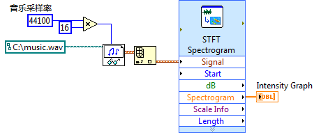

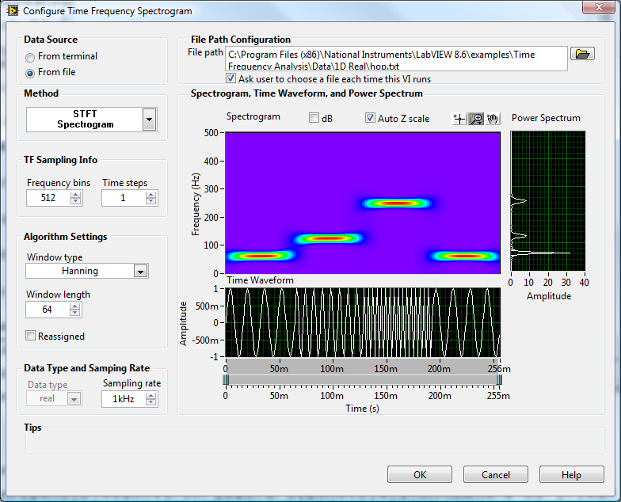