# Express VIs

## What Are Express VIs?

Express VIs are specialized VIs that feature interactive configuration dialogs. They allow developers to configure input parameters visually in edit mode, dramatically simplifying common programming tasks. For standard operations like data acquisition or spectral analysis, you can build a complete program using just one or two Express VIs. To make them easily accessible, LabVIEW groups the most common Express VIs in the **Express** palette of the Functions Palette, while other advanced Express VIs are nested in domain-specific palettes.

You can easily distinguish Express VIs from standard VIs on the Functions Palette by the light blue border around their icons (as seen on the **Time Delay** and **Elapsed Time** icons below):

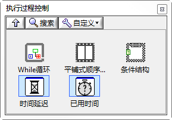 

When you drag an Express VI onto the Block Diagram, its configuration dialog opens automatically. This visual configuration eliminates the need to wire static constants on the diagram, keeping your code exceptionally clean. Because they encapsulate complex multi-step routines into a single node, beginners can quickly build functional data acquisition and signal display utilities without writing low-level code.

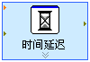  
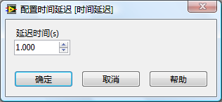 

Despite their convenience, Express VIs have a major drawback: poor runtime efficiency. Because they are designed to cover a broad range of use cases, they contain a massive amount of generic overhead and safety checks that you may not need. This redundant code bloats the compiled VI size and increases execution latency. For high-performance, real-time, or memory-constrained applications, you should avoid Express VIs and use standard, low-level API VIs instead.

## How SubVIs Appear on the Block Diagram

By default, standard SubVIs are displayed as rectangular icons on the Block Diagram. You can right-click an icon and select **Show Terminals** to reveal its connector pane layout. Alternatively, you can view the SubVI as an **Expandable Node** by right-clicking it and unchecking **View As Icon**. An Expandable Node displays its input and output terminals as a vertical list that can be resized by dragging the bottom border (as shown on the right in the figure below):

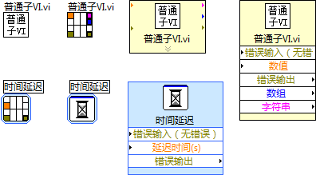

Express VIs support the same display modes. However, by default, Express VIs are displayed as Expandable Nodes. They are always marked by a distinctive light-blue background outline to distinguish them from standard VIs.

Although Expandable Nodes consume more block diagram space, they offer several advantages: they show the full names of each terminal, making the code self-documenting, and you can collapse or hide unused terminals to save space. The generous vertical spacing also prevents overlapping wires on complex nodes.

For example, consider the `ex_subFileWrite.vi` SubVI below, which has dozens of parameters. Viewing it as an Expandable Node makes it easy to see where each wire connects. If it were displayed as a standard icon, wiring these parameters would be extremely difficult and error-prone:

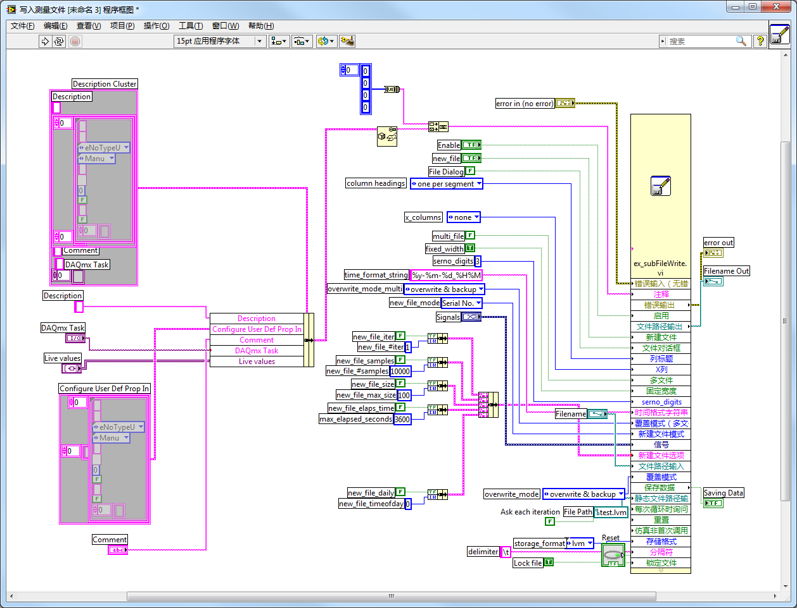

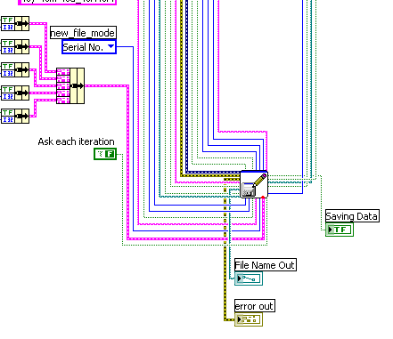

## How Express VIs Work

A standard SubVI is a static file containing a Front Panel (defining the user interface and parameters) and a Block Diagram (containing the executable code). In edit mode, double-clicking a standard SubVI on the Block Diagram opens its Front Panel; holding the **Ctrl** key and double-clicking opens its Block Diagram directly.

Express VIs behave differently. Double-clicking an Express VI on the Block Diagram opens its configuration dialog rather than its Front Panel. Because most Express VIs are built-in NI libraries or toolkit utilities, developers configure them interactively and rarely need to view or modify their internal implementation code.

The executable code of a standard SubVI is stored inside its own `.vi` file. When called, the host VI executes the exact same underlying Block Diagram. Express VIs violate this rule. When you adjust the parameters in an Express VI's configuration dialog, LabVIEW dynamically updates the underlying Block Diagram of that specific instance. As a result, two instances of the same Express VI on a diagram can run completely different code. 

Consequently, the executable code of an Express VI instance is not stored in a shared library file; it is compiled and saved directly *inside the caller VI's file*. For instance, if `main.vi` calls the **Simulate Signal** Express VI, the generated code for that instance is embedded directly inside `main.vi`.

You can inspect the underlying code generated by an Express VI by right-clicking it and selecting **Open Front Panel**.

> [!WARNING]
> Selecting **Open Front Panel** permanently converts the Express VI into a standard, static SubVI. You will lose the ability to reopen its configuration dialog.

Let's look at the **Convert from Dynamic Data** Express VI (**Express >> Signal Operations >> Convert from Dynamic Data**) as an example. We place two instances, 'Data Conversion 1' and 'Data Conversion 2', on our diagram and configure them with different types:

"Data Conversion 1" is set to "1D Waveform Array":

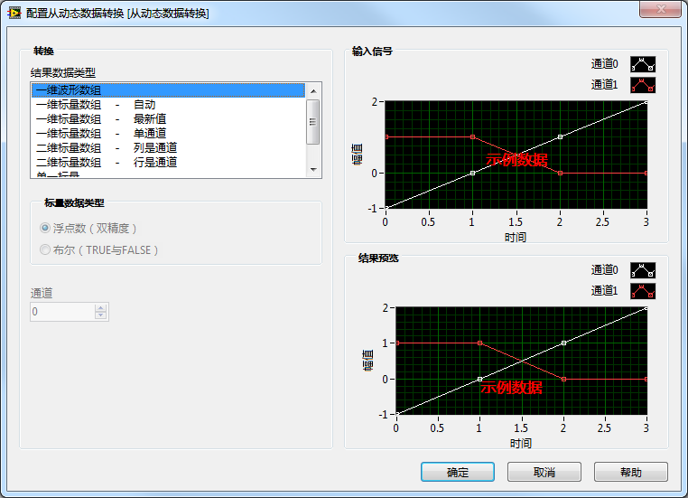

Upon converting the Express VI into a standard VI and viewing its block diagram:

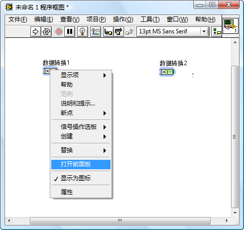

The block diagram consists of a straightforward sub VI:

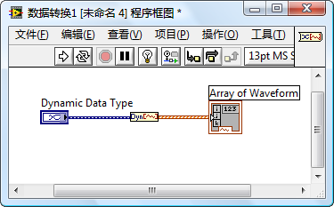

"Data Conversion 2" is configured for "2D Scalar Data" with the scalar data type set to "Boolean". Viewing its block diagram reveals a completely different structure from "Data Conversion 1" due to the differing functions they perform.

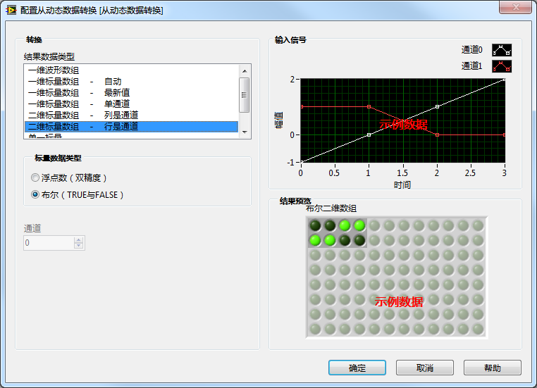

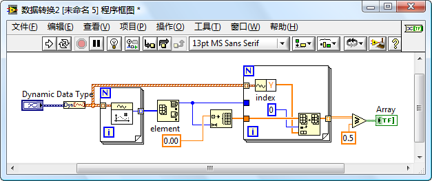

## Express VIs in Test and Measurement

Since LabVIEW is primary used for test and measurement, it provides a large set of Express VIs designed specifically for signal generation, acquisition, analysis, and storage:

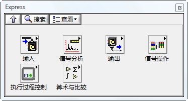

These VIs encapsulate complex mathematics and driver commands into simple nodes. Because these functions are highly versatile, they require many configuration parameters, though in practice you only need to customize a few settings for a specific test run.

For example, generating a simulated waveform requires configuring the wave shape, frequency, amplitude, phase offset, sample count, and sampling rate. If you used standard SubVIs, you would have to wire constants to all these inputs, cluttering the Block Diagram and reducing code readability.

In most applications, these parameters are static (e.g., you always want a 50 Hz sine wave). Having to wire them on the diagram is overkill. Express VIs solve this: you double-click the VI to open the configuration dialog, set the parameters once, and they are saved directly in the instance metadata.

Furthermore, configuration dialogs often feature a **Result Preview** graph. For instance, in the **Simulate Signal** Express VI, you can preview the generated waveform immediately as you adjust the frequency and amplitude sliders, without needing to run the VI:

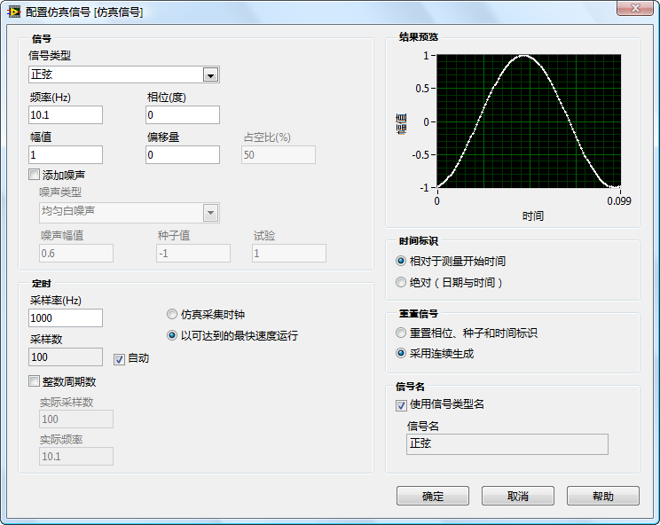

### Note on Sampling Rate Configuration

Configuring the sampling rate is a balance between CPU/storage capacity and signal fidelity. Under the **Nyquist-Shannon sampling theorem**, the sampling frequency ($f_s$) must be at least twice the highest frequency component ($f_{max}$) of the analog signal to prevent **aliasing** (distortion):

$$f_s > 2 f_{max}$$

For a pure, ideal sine wave, a sampling rate slightly higher than $2f$ is mathematically sufficient. However, real-world signals (like square waves or distorted inputs) contain high-frequency harmonics. While we cannot sample at an infinite rate, we must sample fast enough to capture the primary harmonics of interest. In practical engineering, a rule of thumb is to set the sampling rate to at least **10 times** the fundamental frequency of the target signal to ensure low-distortion reconstruction, and then adjust based on specific application requirements.

## Application Example

Using National Instruments DAQ hardware with Express VIs allows you to build complete test applications in minutes. The entire pipeline—acquisition, analysis, display, and storage—can be implemented using one or two Express VIs per stage.

For example, with the **NI-DAQmx** driver package installed, you can use the **DAQ Assistant** Express VI to acquire data:

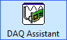

This VI opens a step-by-step configuration wizard that guides you through selecting physical channels, setting measurement ranges, and configuring timing and triggering settings on your NI DAQ hardware:

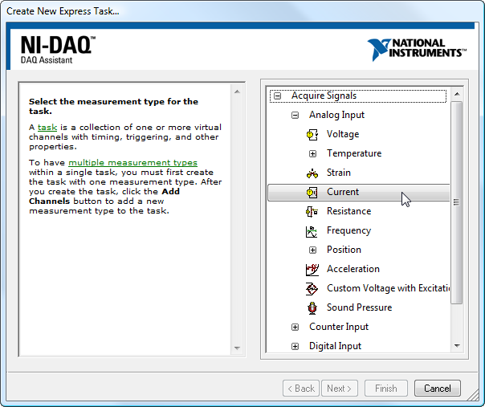

Users first select a type of signal to measure. The wizard then presents compatible hardware options. After selecting the hardware, it's configured as needed.

Since not every developer has access to dedicated NI DAQ hardware, standard PC sound cards are excellent for demonstrations. A sound card acts as a basic dual-channel analog input/output device. 

In the following example, we will build a program that generates a simulated sine wave, outputs it through the PC speakers, records the sound using a microphone, and compares the power spectra of the generated vs. captured waveforms.

The pipeline consists of: **Simulate Signal** (generating the waveform) $\rightarrow$ **Play Waveform** (outputting to speakers) $\rightarrow$ **Acquire Sound** (recording via microphone) $\rightarrow$ **Spectral Measurements** (calculating the power spectrum). This entire application can be built using just four Express VIs, as shown in the block diagram below:

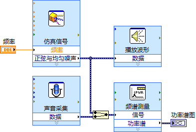

The Front Panel of the running application is shown below. On the Power Spectrum graph, the original simulated signal is plotted in blue, while the microphone-acquired signal is shown in red. The captured signal clearly shows amplitude attenuation and a higher noise floor introduced by the room acoustics and microphone hardware:

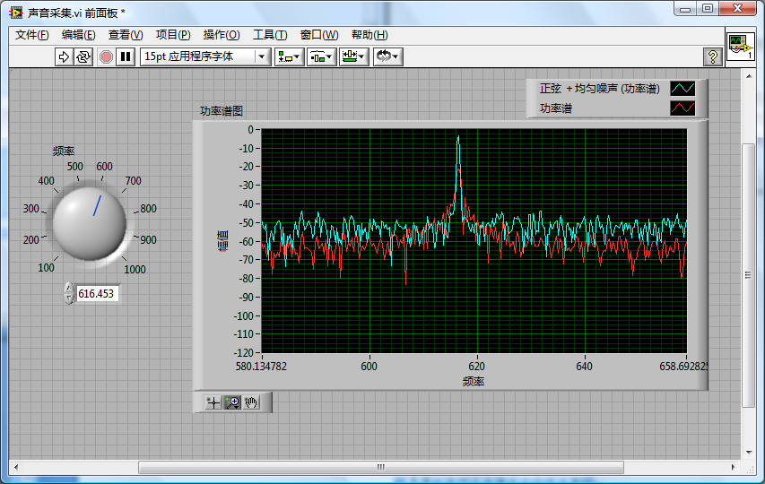

Note: When configuring these VIs, ensure the simulated signal duration matches the sound capture window. If the recording window is longer than the playback signal, the tail end of the capture will record silence or ambient room noise, distorting the spectrum comparison.

While Express VIs make rapid prototyping easy, they only support standard, high-level configurations. If your project has advanced requirements (e.g., custom hardware drivers, complex triggering, or raw buffer operations), you will need to replace them with low-level, specialized API VIs.

## Pros and Cons of Express VIs

### Pros
- **Accessibility**: Express VIs lower the entry barrier for non-programmers (such as test technicians or researchers) by replacing G coding with interactive, visual configuration panels.
- **Speed**: Allows rapid prototyping and instant validation of signal processing settings via the Result Preview graph.

### Cons
- **Limited Selection**: Only a small subset of standard LabVIEW functions are available as Express VIs. You cannot build a complex application using Express VIs alone.
- **Performance Overhead**: Because they compile generic, all-in-one code to handle many options, they consume more memory and execute slower than optimized standard VIs.

## Creating Custom Express VIs

In addition to using LabVIEW's built-in libraries, you can build your own custom Express VIs. Select **Tools >> Advanced >> Create or Edit Express VI...** to launch the Express VI creation wizard, which guides you through designing a custom configuration dialog and wrapping it into an Express VI library.