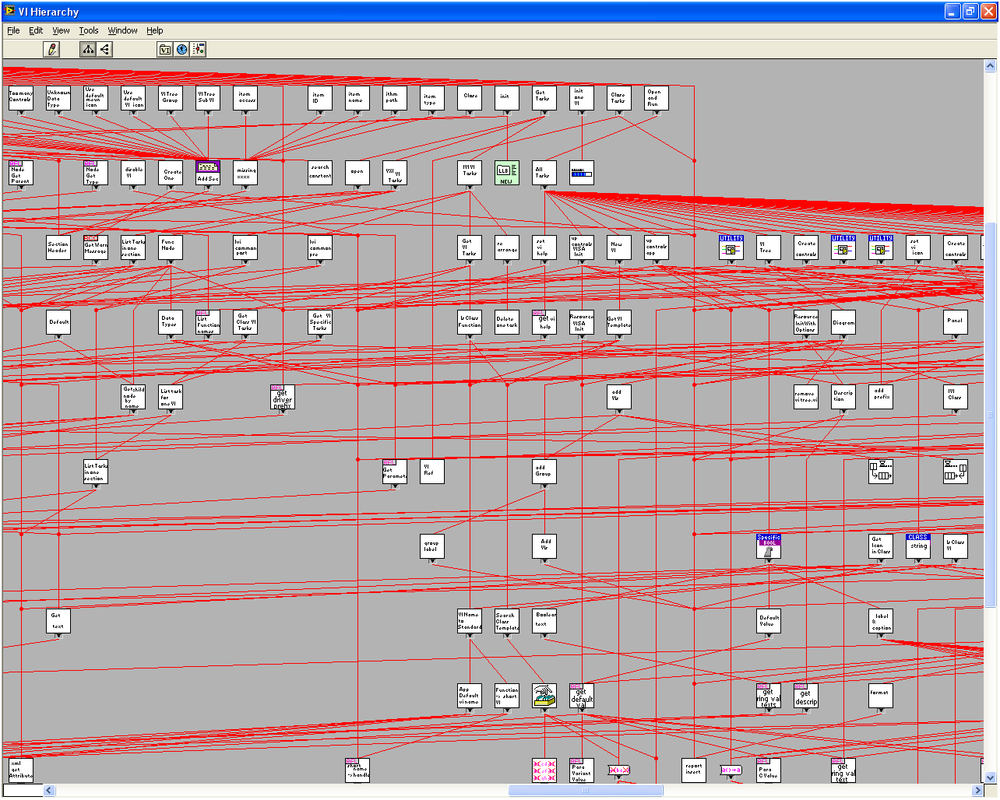
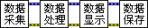
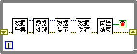
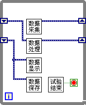
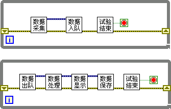

# Data Acquisition, Processing, and Display

## Structuring Your Program

When analyzing an existing application or designing a new one, it is best practice to use a top-down design methodology. Moving from a high-level architectural view down to low-level implementation details prevents getting bogged down in minutiae too early.

During the design phase, developers partition the application into vertical layers. At the highest level, they divide the application into distinct subsystems based on their general roles and interfaces. They then break down each subsystem into modular components and individual VIs. This layered approach is repeated until the individual functions are defined.

The number of hierarchical layers depends on the project's scale. A simple tool might exist as a single VI. A moderate application typically has two layers: a main VI (mediating user interaction) and several SubVIs (performing specific calculations). Complex industrial systems can span four or more layers.

While you can visualize simple projects using LabVIEW's built-in **VI Hierarchy** window (see [Using SubVIs](ramp_up_complex_vis#utilizing-sub-vis)), this tool is overwhelming for large applications. In a large project, the hierarchy diagram is a dense web of hundreds of nodes, making it impossible to analyze visually:

A standard architectural pattern for test and measurement systems splits the software into three distinct layers:

- **Presentation / User Interface Layer (Top)**: The main VI, which presents the Front Panel, handles user input events, and displays test results.
- **Business Logic / Functional Layer (Middle)**: Implements core algorithms, routing, and processing tasks. In measurement systems, this is represented by the four primary pillars: Data Acquisition, Data Processing, Data Visualization, and Data Storage.
- **Hardware Abstraction / Driver Layer (Bottom)**: Provides low-level drivers to communicate with hardware instruments (e.g., NI-DAQmx, VISA), file I/O APIs (e.g., TDMS, CSV), database connectors, and core mathematical utilities. Since LabVIEW includes these drivers out of the box, we will not focus heavily on their low-level implementation details.

The main VI employs various program structures when invoking several functional modules, adapted to the program's specific needs. Below, we introduce several structural models frequently employed in test programs.

## The Standard Loop Model

The baseline process of a measurement system runs through four sequential steps: acquisition $\rightarrow$ processing $\rightarrow$ display $\rightarrow$ storage. The simplest program structure is shown below:

To monitor a system continuously, you must repeat this sequence in a loop. This **Single-Loop** architecture is shown below:

The loop terminates when a stop condition is met. Because this single-loop model executes sequentially, it is easy to program, debug, and understand.

However, the sequential dependency between stages is a major performance bottleneck. Because all tasks execute in a single thread, a delay in one stage stalls the entire loop. For example, writing data to disk (Data Storage) is a slow operation. The loop must wait for the disk write to finish before it can acquire the next batch of data (Data Acquisition), leading to potential buffer overflows on the DAQ card and a reduced sampling rate.

## The Pipeline Model

We can optimize performance by running these tasks in parallel, similar to a manufacturing assembly line. In a **Pipeline** architecture, while the acquisition stage collects block $N$ of data, the processing stage analyzes block $N-1$, and the display/storage stage writes block $N-2$ to disk:

This pipeline model improves throughput. The overall loop execution period is no longer the *sum* of all stages, but is dictated by the *slowest single stage* in the pipeline.

However, in real-world environments, execution times fluctuate (e.g., disk writes can experience brief OS delays, or processing times vary with CPU load). If the consumer stage experiences a spike in latency, it stalls the upstream stages. To absorb these fluctuations, you should introduce a **Buffer** between stages. When acquisition runs faster than processing, data is safely buffered; when processing catches up, it drains the buffer.

## The Producer-Consumer Model

Implementing this buffer model in LabVIEW leads to the **Producer-Consumer** architecture:

In this design, a **FIFO Queue** acts as the buffer. The acquisition loop (the **Producer**) writes newly acquired data blocks directly to the queue. Enqueueing is extremely fast, ensuring that the hardware interface loop never stalls or misses a sample. A separate execution loop (the **Consumer**) continuously dequeues and processes the data:

This Producer-Consumer pattern decouples the timing of the acquisition thread from the processing/storage threads. You can find pre-built templates for this architecture in LabVIEW's **New...** project dialog box. 

Although the Producer-Consumer pattern introduces multi-threaded complexity and requires managing queue lifecycles, it is the industry-standard architecture for high-performance test and measurement systems.