# Class

## Creating Classes

To create a new class in the Project Explorer, right-click a target (like the project root or a library/folder) and select **New -> Class**:

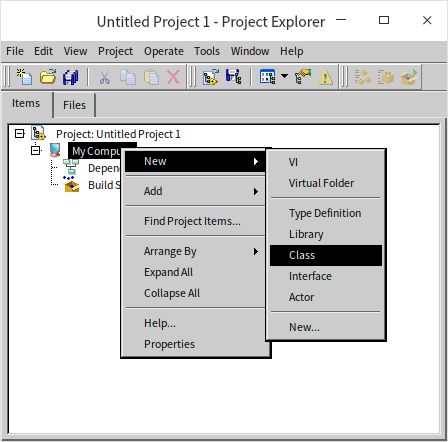

Let's name this class "Parent," as we will use it as the parent class for another class later. During creation, LabVIEW prompts you to select the parent class from which the new class will inherit:

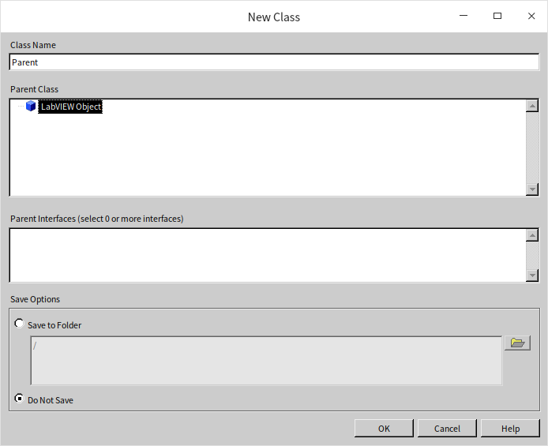

Since this is our first class, we don't have a custom parent class for it. In LabVIEW, every class must inherit from exactly one parent class. If you don't specify one, **LabVIEW Object** is used by default. Thus, **LabVIEW Object** serves as the ultimate ancestor for all LabVIEW classes. If you write a VI to process any generic LabVIEW object (for example, to retrieve an object's class name), you can set the input data type to **LabVIEW Object**. This allows the VI to accept an instance of any class.

Next, create another class named "Child" using the same procedure. Since "Child" should inherit from "Parent," select "Parent" as its parent class:

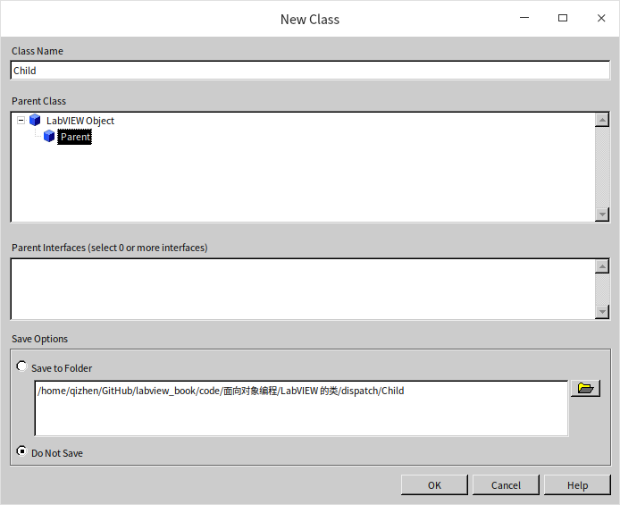

Structurally, a LabVIEW class is similar to a project library (see [LabVIEW Library](manage_project#libraries)). It behaves as a namespace (prepending the class name to its member VIs), and allows you to configure access permissions (public, private, community, etc.) for its VIs. Beyond these library-like features, classes also define their own data (properties) and VIs (methods).

LabVIEW classes are saved as files with a `.lvclass` extension.

## Methods (VIs)

To create a method for a class, right-click the class in the project tree and choose from the available options. Under the hood, class methods are simply standard VIs.

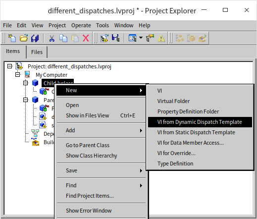

The **New** submenu provides several choices for creating methods and resources:

* **VI**: Creates a standard method VI.
* **Virtual Folder**: Used to organize methods logically, which is helpful when a class contains many VIs.
* **Property Definition Folder**: A special folder for accessor VIs that read or write class properties.
* **VI Based on Dynamic Dispatch Template**: Creates a method that can be overridden by subclasses. This is equivalent to "virtual functions" in text-based OOP languages.
* **VI Based on Static Dispatch Template**: Creates a method that cannot be overridden by subclasses. The main structural difference from dynamic dispatch is that its class input and output terminals are statically allocated.
* **VIs for Data Member Access**: Since class data in LabVIEW is always private, public accessor VIs are required to read or write it. This option serves as a shortcut, generating accessors with pre-built data-handling code in the block diagram.
* **VIs for Overriding**: Generates a VI in a subclass to override a parent method of the same name. It applies the dynamic dispatch template and automatically includes a "Call Parent Method" node in the block diagram.
* **Type Definition**: Creates a custom control (typedef) to define unique data structures for the class.

Let's examine the different behaviors of statically and dynamically dispatched VIs.

First, create a static dispatch VI named `static.vi` in the `Parent` class. Its block diagram simply returns the string "Parent Static VI":

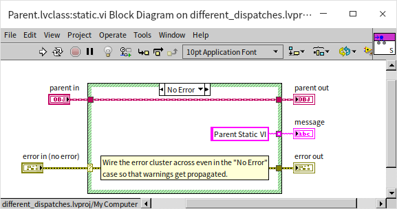

Next, if you attempt to create another static dispatch VI with the same name (`static.vi`) in the `Child` class, you will find that `Child.lvclass:static.vi` is broken and unable to run:

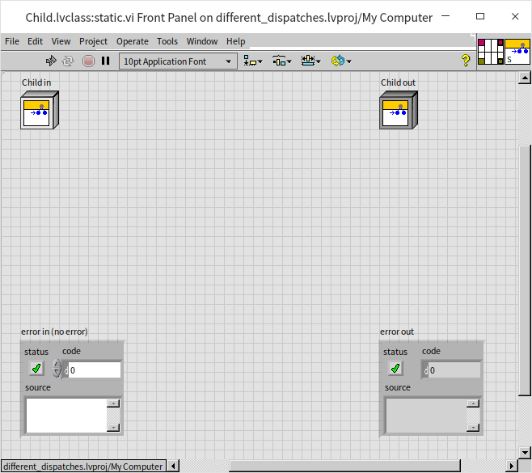

Clicking the broken run arrow reveals an error message indicating that you cannot override a statically dispatched VI from an ancestor class:

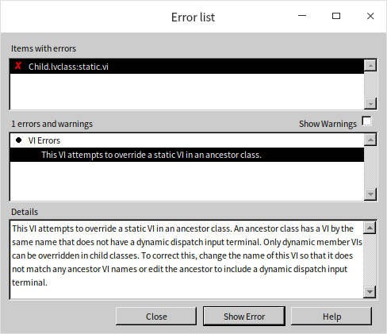

In LabVIEW, once a class defines a static dispatch VI, its subclasses cannot define a method with that same name.

In contrast, if you use the dynamic dispatch template, you can create VIs with the same name in both the parent and child classes. For example, let's create a dynamic dispatch VI named `dynamic.vi` in both classes, returning "Parent Dynamic VI" and "Child Dynamic VI" respectively. Both VIs compile and run successfully:

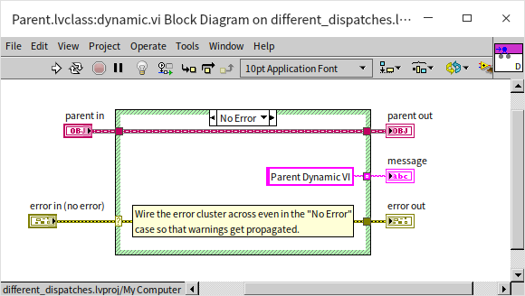

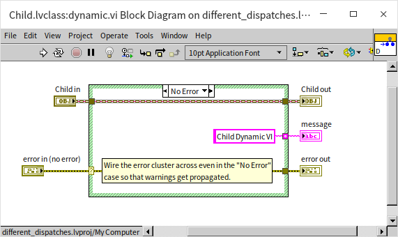

Now let's build a test program to see how these VIs execute. The block diagram below passes instances of the parent and child classes into the static and dynamic VIs to display their outputs:

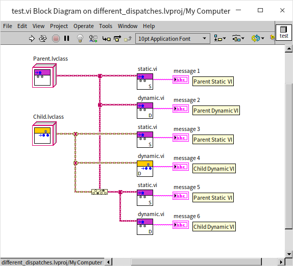

In the diagram, VIs with a purple icon belong to the `Parent` class, and those with a yellow icon belong to the `Child` class.

Because `static.vi` uses static dispatch and cannot be overridden by subclasses, the compiler guarantees that `Parent.lvclass:static.vi` is always invoked, returning "Parent Static VI" regardless of whether a Parent or Child object is wired to it.

For `dynamic.vi`, passing a `Parent` object to the parent's dynamic VI returns "Parent Dynamic VI," while passing a `Child` object to the child's dynamic VI returns "Child Dynamic VI." This is the expected behavior.

The case labeled "message 6" is the most interesting. Because the `Child` class inherits from the `Parent` class, a `Child` object is also a `Parent` object. In the block diagram, we can convert a `Child` object to the `Parent` class type (upcasting) and wire it to `Parent.lvclass:dynamic.vi`. Even though the wire type is the ancestor `Parent` class, the underlying object is still a `Child` instance. Therefore, when `dynamic.vi` is called, the child's version (`Child.lvclass:dynamic.vi`) is executed at runtime, returning "Child Dynamic VI." If the child class had not overridden `dynamic.vi`, the runtime would default to executing the parent's version.

Next, let's modify the block diagram of `Parent.lvclass:static.vi` to call `Parent.lvclass:dynamic.vi`:

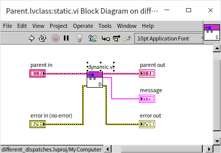

Now, in our test program, we pass a `Child` object (upcast to the `Parent` type) to `Parent.lvclass:static.vi`. What will it return?

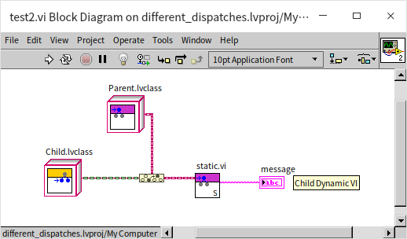

Although the `Child` class does not have its own `static.vi` (so the parent's `static.vi` is executed), the incoming object is a `Child` instance. When `static.vi` calls `dynamic.vi`, the runtime dynamic dispatch mechanism routes the call to the subclass method `Child.lvclass:dynamic.vi`. A dynamically dispatched VI always resolves to the implementation matching the actual runtime class of the object, even when called from inside another class's method.

This behavior is a classic example of **polymorphism** in object-oriented programming. At edit time, we program against the parent class's interface. At runtime, the actual method executed depends entirely on the type of the object passed in.

If a subclass overrides a parent method, can it still invoke the parent's implementation? Yes, but you cannot simply drag the parent VI onto the block diagram (doing so would just call the subclass method recursively or fail). Instead, you must use the **Call Parent Method** node, which is located in the **Programming -> Cluster, Class & Variant** palette. If you choose "VIs for Overriding" when creating the subclass method, LabVIEW automatically places this node on the block diagram.

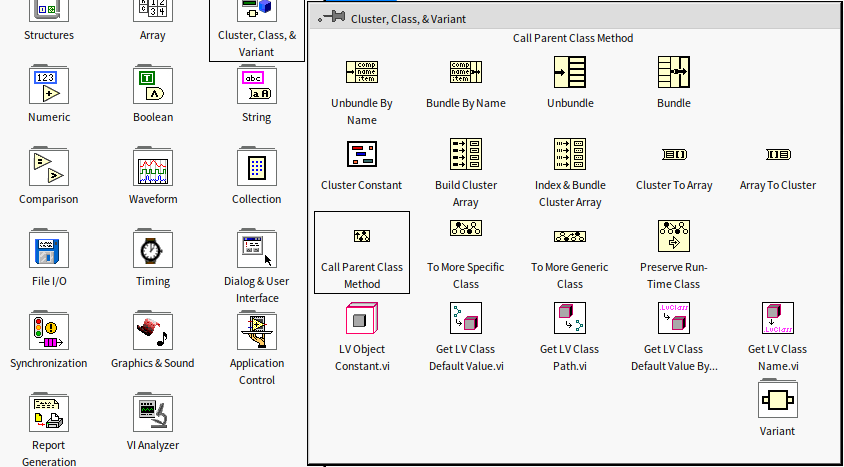

The subclass method below uses the **Call Parent Method** node to retrieve the parent method's return value, appends its own message, and returns the combined string:

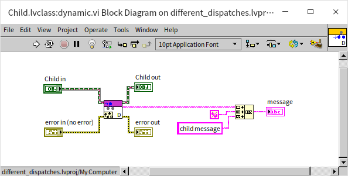

At the source code level, the only difference between a static and a dynamic dispatch VI is whether the class input/output terminals on the connector pane are set to dynamic dispatch. If you create a static dispatch VI and later decide it needs to support dynamic dispatch, you don't need to rebuild it. Simply right-click the class terminal on the connector pane and toggle the dispatch setting.

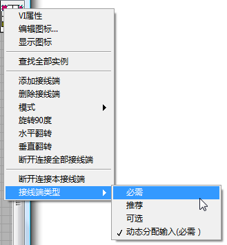

## Properties (Data) {#properties-data}

Every class includes a `.ctl` control file that shares the class's name. Although its front panel and configuration resemble a custom control, this `.ctl` file does not exist separately on disk; its data structure is saved directly inside the `.lvclass` file. This `.ctl` control is defined as a cluster containing the class's properties—essentially the class variables, just like in text-based programming languages. In LabVIEW, class data is strictly **private**. To protect data integrity, external code cannot access class data directly and must interact with it through public methods.

Because class data is private, there is no direct data inheritance. Subclasses do not automatically inherit parent class fields. If a subclass needs to read or write parent class data, it must do so indirectly using methods provided by the parent class.

Let's add some data fields to our class:

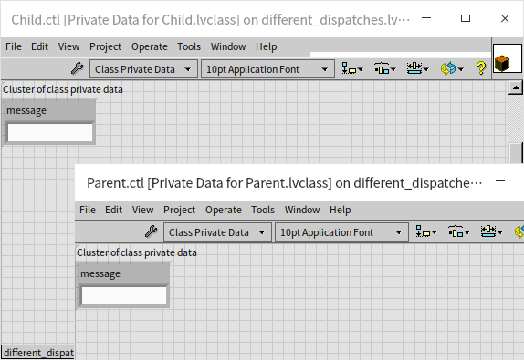

Subclasses and parent classes can define data fields with the same names. Class data is initialized using the default values of the controls in the `.ctl` cluster. For example, in the image above, if the default value of the `message` control is an empty string, new instances of the class will start with an empty string. Changing its default value in the `.ctl` to "init" means new instances will be initialized with "init" as their message data.

You can easily generate VIs to read and write these data fields using the **New -> VI for Data Member Access** menu option.

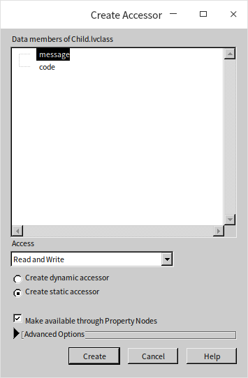

Data member access VIs can be either static or dynamic dispatch. Since class data is private, static dispatch accessors are usually more straightforward and intuitive. However, a conflict occurs if both parent and child classes have fields with the same name, which generates accessors with conflicting names. If these accessors are static dispatch, LabVIEW will throw the previously mentioned error about overriding static VIs. Renaming the accessor VIs (since their names don't have to match the data fields exactly) resolves this issue.

Alternatively, you can make the data member access VIs dynamic dispatch. This allows them to share the same name across parent and child classes, which can be useful when you want to simulate data inheritance. For instance, if a `Furniture` parent class has a `Price` attribute and a `Table` subclass should logically inherit it, you can define the `Price` field in both classes and create matching dynamic dispatch accessors. This makes it easy to call the parent's data accessor from the subclass to manage the shared property.

Here are the data member access VIs created for our test project:

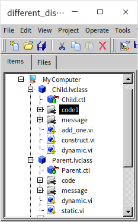

Data member access VIs can also be called using LabVIEW's **Property Nodes**, which allow you to read and write multiple properties in a single clean block:

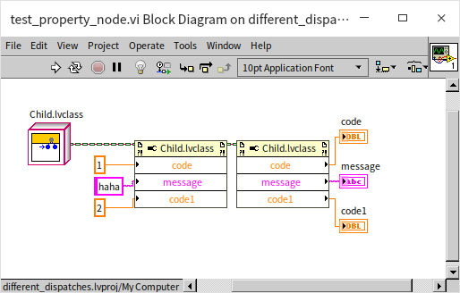

When designing classes, it is best practice to avoid exposing raw data accessors to class consumers. A fundamental principle of object-oriented encapsulation is to hide internal data structures and expose only high-level methods. This allows class authors to change the underlying implementation without breaking external code.

### Wire Style

By default, all new LabVIEW classes use the same wire style and color. To make your block diagrams easier to read—especially when debugging or presenting code—you can customize the wire color and pattern for each class:

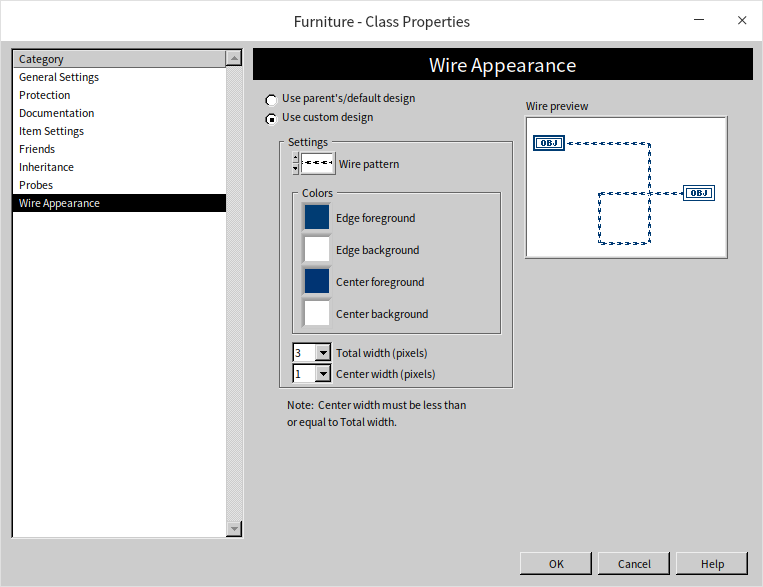

## Application Example

Let's explore a practical example to illustrate the development workflow of object-oriented programming in LabVIEW.

### Scenario

Imagine a furniture store that sells two types of items: tables and chairs. We want to build a program that models these items with the following properties and behaviors:
* **ID (Property)**: A unique identifier for each item.
* **Cost Price (Property)**: The store's wholesale purchase price.
* **Calculate Selling Price (Method)**: Computes the retail price using the formula: `Cost Price * (Expected Profit Margin + 1) * (Tax Rate + 1)`. We assume the profit margin and tax rate are constants.
* **Assembly (Method)**: Simulates assembling the furniture.
   * *Tables*: Legs are attached to the tabletop, and the table is flipped upright.
   * *Chairs*: The cushion is fastened to the backrest, and then the legs are attached.
* **Unique Subclass Behaviors**:
   * *Spread Tablecloth* (unique to the Table class): Displays a message indicating a tablecloth has been placed.
   * *Place Cushion* (unique to the Chair class): Displays a message indicating a cushion has been positioned.

We will write a test program that initializes several furniture items, puts cushions on the chairs, and then processes all items together to output their assembly descriptions and calculated selling prices.

### Design

Based on these requirements, we can structure our design as follows:
* We define three classes: `Furniture` (parent), `Table` (subclass), and `Chair` (subclass).
* The `Furniture` class holds the shared data (`ID` and `Cost Price`) and two methods: `Return Selling Price` and `Assembly`.
   * **Return Selling Price** implements identical logic for all furniture. It is created as a static dispatch VI in the `Furniture` parent class so subclasses inherit it directly without overriding.
   * **Assembly** has different behaviors for tables and chairs. It is defined as a dynamic dispatch VI in the `Furniture` parent class, allowing the subclasses to override it with their specific logic.
   * Each subclass also requires an **Initialize** (constructor) method. Since they require different inputs (e.g., tablecloth type vs. cushion model), these constructors must be separate, non-overridden VIs in each subclass.
* The `Table` class contains: `Initialize`, `Assembly` (overridden), and `Spread Tablecloth` (unique).
* The `Chair` class contains: `Initialize`, `Assembly` (overridden), and `Place Cushion` (unique).
* Profit margin and tax rate are defined as constants.

### Creating Classes

Start by creating a new LabVIEW project, then create the three classes: `Furniture`, `Table`, and `Chair`, setting `Furniture` as the parent for the other two.

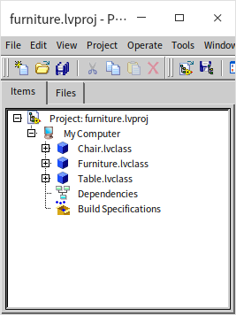

### Properties (Data)

The `Furniture` class contains two private data fields: `ID` and `Cost`. To allow subclasses to write to these fields during initialization, we generate public data member access VIs for them.

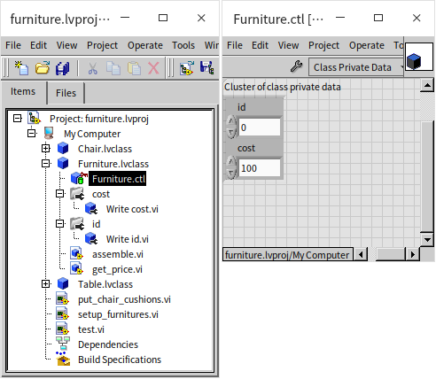

The `Table` and `Chair` classes require additional fields for `Tablecloth Type` and `Cushion Model`. It's good practice to use custom typedef enums for these properties. These enums can be stored directly inside the respective class folder. Below, the tablecloth type enum is added to the `Table` class:

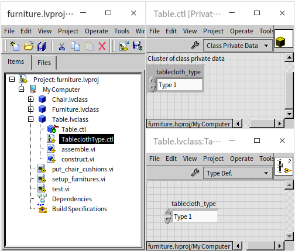

### Methods (VIs)

Let's implement the methods in the parent `Furniture` class first. The selling price calculator (`get_price.vi`) is a static dispatch VI since the calculation logic is identical for all subclasses. It multiplies the cost price by profit margin and tax constants:

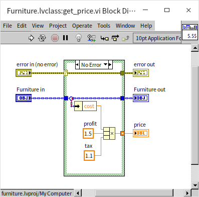

The `Assembly` (`assemble.vi`) method must be dynamic dispatch since tables and chairs are assembled differently. Its default implementation in the `Furniture` class simply returns the item's ID:

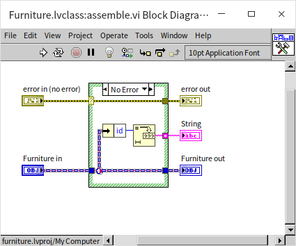

The subclasses override this method. As shown below, the `Chair` class's version of `assemble.vi` first calls the parent method to retrieve the ID, then appends its own custom assembly instructions. The `Table` class implements its own version similarly.

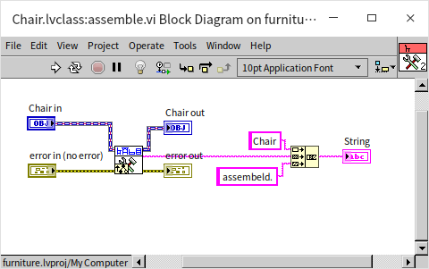

Next, the `Chair` class requires a constructor method (`construct.vi`) to initialize its instance. This VI calls the parent class accessors to write the shared `ID` and `Cost`, and then stores the subclass-specific `Cushion Model`. The `Table` class uses a similar constructor.

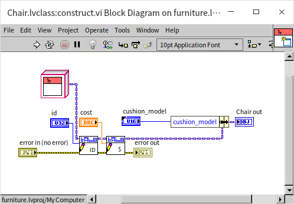

Finally, we implement the subclass-specific methods. The `Chair` class implements `put_cushion.vi`, which reads the cushion model and outputs a message confirming the cushion has been placed. The `Table` class implements a similar `put_tablecloth.vi` method.

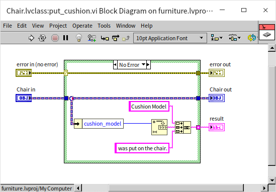

We have successfully built the class library. Now, we are ready to test the behaviors.

### Application Testing

First, we create a simple VI named `put_chair_cushions.vi` to place cushions on an array of chairs. This VI accepts an array of `Chair` objects and runs `put_cushion.vi` on each element inside a For Loop:

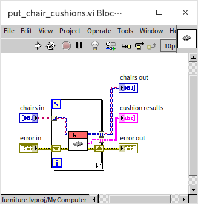

Next, we create `setup_furnitures.vi` to assemble and calculate prices for a collection of furniture items. Because this VI must process multiple types of furniture, its input and output arrays use the parent `Furniture` class type. The VI loops through the array, calling the dynamic dispatch `assemble.vi` and the static dispatch `get_price.vi` on each item, and concatenates the resulting text:

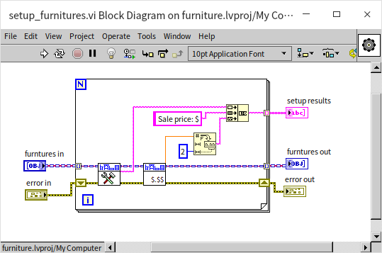

Now, we build the main test program (`test.vi`):

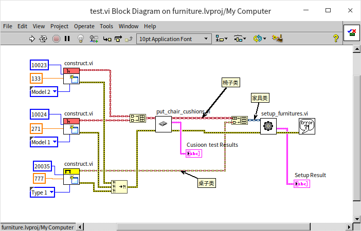

The test program does three things:
1. **Initialize**: Calls the constructors for the `Table` and `Chair` classes to create two chairs and one table.
2. **Subclass-Specific Loop**: Groups the two chairs into a `Chair` array and passes it to `put_chair_cushions.vi`.
3. **Polymorphic Loop**: Merges the chairs and table into a single array. LabVIEW automatically upcasts this to a `Furniture` class array. This array is passed to `setup_furnitures.vi`.

Running this test VI yields the following results:

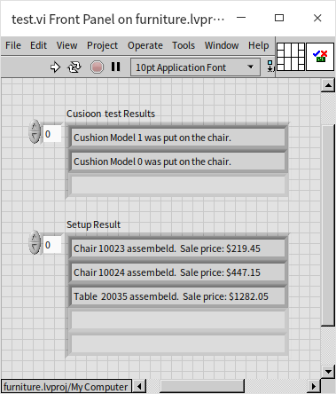

In procedural programming, handling different object types usually requires a Case Structure or type-checking logic to determine which subVI to call. Thanks to class polymorphism, our test program does not need any conditional logic. All instances are treated as the generic `Furniture` type, and when `assemble.vi` is invoked, LabVIEW dynamically determines the object's actual class at runtime and dispatches the call to the correct subclass implementation.

Since `Table` and `Chair` both override the parent class's `assemble.vi` method, the correct subclass version runs automatically, producing custom assembly text for each item in the array.

Because `assemble.vi` is a dynamic dispatch VI, double-clicking it on a block diagram will not open a single VI. Instead, LabVIEW displays a dialog showing all implementations across the class hierarchy, prompting you to select which one you want to view.

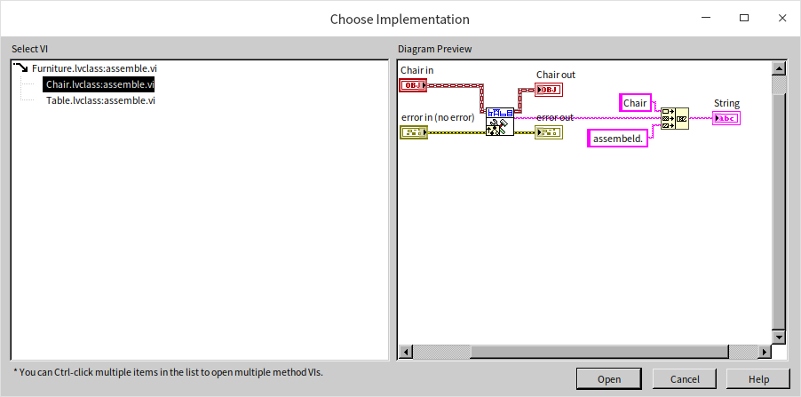
