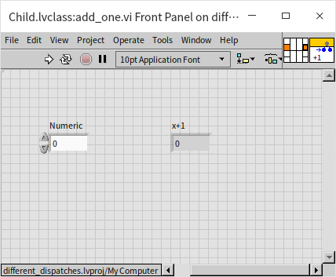
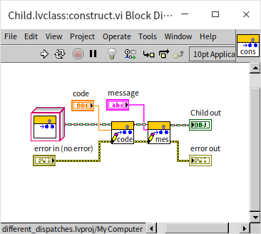

# 类的优缺点

## “类” 的种类

LabVIEW 为了降低学习门槛，在 2020 之前，只提供了一种 “类”。但是如果我们看一下其它面向对象的编程语言，会发现，它们通常提供了很多种不同类型的 “类”，而且有不同的分类方法。

### 访问权限

按照访问权限来分，类的属性（数据）和方法（函数或 VI）可以分为：

* 公有：类内和类外都可访问。类内访问是指在同一个类的方法（函数或 VI）的代码中可以读写，否则就是类外访问。
* 私有：类内可访问，类外不可访问。
* 保护：可以在类内，或者子类内访问。
* 友元：有的编程语言支持友元的概念，是指某个类的属性和方法可以被其它一些指定为友元的方法或类访问到。

在 LabVIEW 中，类的属性（数据）只有一种访问权限，私有，数据只能被同一个类中的 VI 读写。LabVIEW 中，类的方法（VI）到是支持了以上所有四种访问权限的设置，它在类的设置对话框中：

底层的方法（VI）要尽量设置成私有的，不能够让用户直接使用。在 LabVIEW 还没有完善的私有 VI 保护功能的时候，笔者常常遇到一种情况：修改了一个底层 VI 中的问题，然后就会有用户抱怨说，笔者的改动破坏了他们的应用程序，他们没办法再像原来那样使用被改动过的 VI 了。这些 VI 本来并不打算给用户使用的，可是用户就是上帝嘛，既然他们已经在用了，也就只能把修改回退回去让这些 VI 保持不变的行为。这样就造成功能模块非常难以维护，每一处细节都有可能影响到一些客户，都不能动。反之，如果把底层的 VI 都设置为私有的，这样就能够确保用户不会使用它们。模块的维护者就可以放心大胆的去修改它们了，只要保证提供给用户的 API 不变，底层结构怎么更新都没事。

比如，我们上一节中使用的家具店的例子，家居类中数据访问方法只是给子孙类中的方法使用的，所以应当设置为 “保护”（Protected）权限。

有些语言中，类本身也可以设置访问权限，私有或共有。这样可以把模块也分出层次：一个应用程序先划分成几个大模块，每个大模块又可以划分成若干小模块，小模块可以定义为私有的，或者在不同的大模块之间共享。LabVIEW 的类虽然不能嵌套，但是 LabVIEW 的库可以嵌套，我们有可能会在一个大型项目中划分若干库，某个库中又创建出若干类。这时候这个类作为库中的一个成员，也可以设置它是私有，或共有等。

### 是否需要实例化 

按照是否必须把类实例化之后才能调用，类中的属性和方法可以分为：

* 静态：静态的属性和方法不需要类实例化就可以被访问。
* 动态：动态的属性和方法只能通过类的某个实例进行访问。

需要格外注意的是，LabVIEW 中的 “基于动态分配模板” 和 “基于静态分配模板” 与讨论其它编程语言时候所说的动态静态是完全不同的概念。按照大多数编程语言对静态动态的定义，我们之前演示过的 LabVIEW 类中的属性和方法大多是属于动态的：类中 VI 都有一个 “类” 输入控件，并且是必须的。也就是说，不输入一个类的实例进来，这些 VI 是不能被调用的。LabIVEW 的类中也可以添加 “静态方法”，只要添加一个普通的 VI，没有类输入控件的就可以了。比如下图中的 VI，它虽然被放置在一个类中，但并没有类的输入，因此可以在任何地方被直接调用。

这相当于这个 VI 仅仅利用了类的封装特性，把它和相关的 VI 封装在同一个类里。有一些 VI 很适合被封装在类里，比如我们之前演示过的构造 VI，它并没有类的输入，但是这个 VI 可以产生一个类的实例，并且对它进行初始化。可以在这个 VI 里面设置一些对象初始的数据，以及打开所需的文件，仪器，链接网络资源等。下图是一个构造 VI 的示例：

本书除了这一小段之外，在讨论类中的 “静态” 和 “动态” 概念的时候，都会是按照 LabVIEW 定义的静态动态来讨论，而不是指是否需要类被实例化之后才能调用。

### 是否需要或必须被子类覆盖

* 普通函数：在很多语言里，普通函数和下面提到的虚函数，都是可以被子类继承和覆盖的，但是它和虚函数的行为有所不同，它不具备多态（动态绑定）功能。LabVIEW 中没有对应的 VI 类型。
* 虚函数：对应 LabVIEW 类中的 “基于动态分配模板” VI，表示这个函数或 VI 可以被子类继承和重写，并且具有多态功能。
* 最终函数：不允许被子类中的函数覆盖。对应 LabVIEW 类中的 “基于静态分配模板” VI，这种 VI 不能被子类中的 VI 重写。
* 抽象函数：也被称为纯虚函数。这是一种虚函数，但基类通常只定义了函数的名字和输入输出参数类型，并没有实现（编写代码给）这个函数。抽象函数必须在子类中被重写，添加实际代码后，才能被调用。LabVIEW 中可以把一个方法 VI 设置为必须在子孙类中重写，这样的 VI 就成为抽象 VI（纯虚 VI）了：

与函数类似，类也有普通类的和抽象类。有些语言里还有最终（final）类。
* 抽象类：不能被实例化的类，只能用于被子类继承。
* 最终类：不能被继承的类。

不能被实例化的类有什么用？在 [上一节](oop_class) 的家具店示例中，家具店只卖两种家具：桌子和椅子。我们定义一个 “家具” 类作为父类，它有两个子类：“桌子” 类和 “椅子” 类。这个家具类就应该是一个抽象类，因为家具店里不存在除了桌子和椅子之外的其它家具类型。为了预防程序员可能出现的错误，把家具类设为抽象类，就会强制程序员只能从桌子类或椅子类创建家具对象，不至于创建出一个不属于任何应有类型的家具来。

桌子类和椅子类并不适合被设置为最终类，因为桌椅还可以被细分成很多种类，比如躺椅、长条椅等都可以从椅子类派生出来。最终函数和最终类的使用一般都是出于安全考虑，比如我们写了一个用于验证密码的类，为了防止有人把密码验证逻辑在子类中重写后传给调用者，可以把验证密码类设为最终类，防止它被继承后在子类里被重写。

LabVIEW 中没有抽象类的定义，但是我们在 [下一节](oop_interface) 会介绍一个与它非常相似的概念：“接口”。我们可以使用接口来完成抽象类的功能。

## 多继承

### 多继承的问题
LabVIEW 的类不允许多继承，一个类只能有一个父类。当然一个类还是可以有多个子类的。但实际应用中，还是会遇到很多需要多继承的情况的。比如还是上面那个家具店，他们只卖桌子和椅子，但是偏偏有这么一种家具，它既是桌子也是椅子：

这种合体桌椅即有桌子的属性和方法，也有椅子的属性和方法，最符合直觉的就是它应该同时拥有两个父类：“桌子” 类和 “椅子” 类。它应该把两个父类的属性和方法都继承过来，如果只能单继承，比如只能继承自椅子类，那么它具有的桌子的属性和方法，就要再重新编程实现一遍，比较低效。其实还有个比低效更严重的问题：如果某个程序是用来处理桌子的，程序只能输入桌子对象，由于这个合体桌椅是继承自椅子类，就无法把它的对象传给程序做处理了，尽管它也是一种桌子。

有些编程语言是允许多继承的，比如 C++。但是多继承引发了很多更为严重的问题，比如属性和方法调用冲突的问题。在多继承的情况下，我们可以写一个 “合体桌椅” 类，同时继承桌子和椅子。桌子和椅子类中可能会有一些同名的方法，那么合体桌椅类应该继承谁的呢？
* 有时候可能需要同时保留两个父类里同名的方法，比如桌子和椅子都有 “返回承重” 方法，可以得到家具的承重参数，“合体桌椅” 类的桌子部分和椅子部分还是有不同承重的，所以需要同时保留来自两个父类的 “返回承重” 方法；
* 有时候可能应该在两个父类的同名方法中只保留一份，比如桌子和椅子都有 “返回价格” 方法，合体桌椅也不可能一个东西返回两样价格。
* 更麻烦的情况是，有一个程序用于处理所有的家具，它的输入数据类型是 “家具”，当有一把合体桌椅被当做 “家具” 类的实例传递给程序后，程序调用了实例的 “返回承重” 方法，这时候你觉得程序会拿到合体桌椅从桌子类那里继承来的方法，还是从椅子类那里继承来的方法，还是最早他们共同从 “家具” 类里继承来的方法？

其实，编程语言肯定会把这些情况都定义的明明白白，问题是程序员搞不清楚。程序员会写出能产生各种莫名其妙结果的代码，以至于使用多继承产生的问题远比它解决的问题多。学习 C++ 编程经常看到的一个建议就是尽量不要使用多继承。在 C++ 之后才出现的主流编程语言，很多吸取了 C++ 的教训，直接就取消了类的多继承功能。既然不能使用类的多继承，又需要合体桌椅同时被处理桌子的程序和处理椅子的程序都接受，怎么办呢？解决方法是使用 “接口”。

### 接口

我们可以把接口想象为只包含抽象函数的抽象类。接口可以被多继承而不引起混乱，因为接口中只有方法的定义，而没有实现。我们可以明确的知道程序不会调用到接口里的方法，因为那里没有实现方法的代码。当一个类继承了一个父类，那么它是为了借用父类实现好的方法做事情；当一个类继承了一个接口，它是为了保证会自己会实现接口要求的所有方法。一个类当然可以继承多个接口，保证自己会支持每个接口定义的所有方法。合体桌椅同时继承 “桌子” 接口和 “椅子” 接口，表示它即有桌子的功能，也有椅子的功能，那么就可以被处理桌子的程序和处理椅子的程序都接受了。

接口虽然解决了一个对象同时支持多类功能的问题，可以让这个对象被多个种处理不同类型数据的程序接受。但是它并没有解决有效降低重复代码的问题，因为很多方法明明已经在其它类中定义了，却不能继承。不同的编程语言采取了一些不同的措施来更有效的重复利用代码。比如在 PHP 语言中引入了一种叫做 Traits（特性）的东西。一个特性是一个代码块，它的封装方式与类是有些相似的。在其它类中，可以使用一个定义好的特性。比如我们定义一个 TableTraits，封装一些桌子会用的方法，比如 put_tablecloth 方法。我们还有一个叫做 DeskClass 的类，使用了 TableTraits 这个特性，这样 DeskClass 就拥有了 TableTraits 封装的所有方法。一个特性可以备用在多个类中，一个类也可以使用多个特性。比如，另一个叫做 DiningTableClass 的类已使用了 TableTraits 这个特性，DiningTableClass 就也拥有了 put_tablecloth 方法。

与类继承不同，特性中的方法是被直接挪到了类里面，在程序运行时，我们是看不到 TableTraits 这种东西的，所有的方法就如同是直接在类中实现的一样。我们只能看到 DeskClass:put_tablecloth 方法和 DiningTableClass:put_tablecloth 方法。这样就解决了多继承时，搞不清楚函数是在哪个类中实现的这一问题。

Java 在解决这个问题的时候，采取了另一种策略，他允许在接口中给函数添加默认实现。如果使用了接口的类没有重写这个方法，那么，它的对象就会使用接口中实现的这个方法。接口中的方法有了实现，又有多继承，如果不加以限制就和类的多继承没区别了，就又会引起多继承的所有问题。 所以 Java 对使用类中方法的默认实现有一个限制，当某一个类实现了多个不同接口中的同名方法，并且接口中都提供有默认实现，那么，这个类必须重写这个方法。这样将来不管哪一个程序使用到这个类的对象的时候，都可以明确的知道调用的是这个类当中重写了的方法，而不是调用到了任何一个接口中实现的方法。这样就避免了，在多继承中搞不清楚是调用关系的问题。

## 面向对象与数据流

首先考虑一个问题，LabVIEW 类的对象在程序中是传值还是传引用的？我们可以做一个简单实验验证一下：

先把一个对象分别传递到两个分支上，在其中一支分叉上修改的数据是不会影响另一分支上的数据的。所以 LabVIEW 类的对象和 LabVIEW 中大多数数据类型一样，都是采用值传递的。

LabVIEW 是数据流驱动的编程语言。数据在数据线上流动，每个节点通过输入端的连线接收到数据，对其进行处理，再把结果传给输出端连线。为了符合数据流的概念，多数情况下 LabVIEW 函数或 VI 使用的传参方式是值传递：就仿佛是整个数据在连线上流动，遇到一个节点，便一股脑儿都传到节点中去。必要时，譬如数据线分叉的时候，数据便生成一个副本。这样就有了两份同样的数据，沿着不同的分支继续传递。

为了保持这种用户已经习以为常的数据流驱动方式，LabVIEW 类的对象也是按照值传递的方式在节点间流动的。这一点和其它编程语言是有所差别的。常见文本编程语言中传递对象时，基本都使用传引用的方式。

传值与传引用这两种传参方式各有特色，LabVIEW 别具一格地选择了值传递方式，是因为在 LabVIEW 中，值传递的优势更大一些。

传引用的主要优点在于效率高，一个对象的数据量往往都比较大。C 语言中，使用压栈的方式传递函数参数，如果数据量太大，压栈、出栈的开销会非常大。而一个引用类型的数据一般只需要占用 4 或 8 个字节，传递它们的开销远小于直接传递数据。而 LabVIEW 在把参数传递给子 VI 时，并不是采用压栈方式的。对于设计良好的程序，子 VI 可以做到缓存重用，也就是子 VI 中的参数直接使用源数据的内存，这样可以大大提高参数传递的效率。所以，在 LabVIEW 中，值传递并不像 C 语言中那样对效率有明显影响。

在多线程程序中，传引用意味着不同的线程可以访问同一块数据。在不同的线程中同时对同一数据进行读写是很危险的，它可能会产生不可预期的结果。所以，在多线程程序中常常使用临界区、信号量等方法来防止竞争状态的出现。这对于 C++ 或其他文本语言的程序员来说，这不是一个太大的问题，编写多线程程序的软件开发人员多少已经对可能出现的竞争状态有所了解。并且他们清楚地知道自己在编写多线程程序，会相当留意并采取措施防止错误出现。

而 LabVIEW 的使用者中，相当一部分用户是非计算机专业的。为了更简便地利用多线程的优势，LabVIEW 采用了自动多线程的机制。编程者并不需要告诉程序开辟新线程，程序中任何两段没有逻辑上先后顺序依赖的代码都有可能被自动地放到两个线程中去同时执行。在这种情况下，传引用是非常危险的，编程者可能根本意识不到程序是多线程的，因而在无意识的情况下写出了存在竞争状态的代码。

只有值传递才可以解决这个问题。值传递意味着数据在必要时，每到一个分叉处，就复制成相等但互相独立的两份数据。每个可能同时运行的数据线上的数据都是相互独立的，程序永远不会试图去同时访问同一个数据。这样就避免了无意识下造成的竞争状态。如果程序中的确需要在不同线程里处理同一对象，编程者可以在明确程序风险的前提下使用 LabVIEW 中的传引用机制，并做好多线程安全防护。

## 面向对象思想对 LabVIEW 程序设计的影响

目前，LabVIEW 程序开发的一般流程是先设计和实现顶层 VI，一般来说顶层 VI 也就是程序的主界面。然后自上而下地设计和编写 LabVIEW 程序。在这种思路的引导下，程序中的大部分模块都不具备通用性，都需要重新编写。只有少量最低层的基础程序模块才可能互相通用。

随着程序规模的膨胀，不同项目间的重复度越来越高，可重复利用的东西越来越多。而模块的重用可以极大地提高项目开发效率。因此，对于模块的管理、维护和重用，成了软件开发效率的关键点。程序员不得不把更多的精力集中在模块的设计开发上。

面向对象的编程思想正是应此需求而生的。借助面向对象的编程方法可以对程序的功能模块进行封装，提高模块的通用性和安全性。可以对模块的功能进行继承，提高新模块的开发效率。不同的模块间可以并行地开发、测试，便于团队工作。这些都大大提高了 LabVIEW 开发大型程序的效率。而搭建在各种模块之上的 LabVIEW 应用程序，其规模也必然会有一个本质性的飞跃提高。

## LVClass 内存加载引发的效率问题

曾经有一个 LabVIEW 的用户抱怨：他编写的一个 LabVIEW 程序，每次打开主程序就要花费几分钟的时间，这有点令他忍无可忍。笔者对他的项目分析后，得出结论：程序的效率问题是由 LvClass 引起的。他的项目包含有上百个类（LvClass），大量的 LvClass 有可能造成效率低下。

LabVIEW 中有一个属性节点可以用来查看内存中所有的 VI，利用它就可以查看一个程序被打开后，到底装入了哪些 VI：

假设有一个 VI，它不属于任何 LvClass，也不包括任何子 VI，打开这个 VI（即便这个 VI 是属于某个 lvlib 的）后，可以查看到只有这个 VI 会被装入内存。但是，如果打开的是某一个 LvClass 中的 VI，则不但这个 VI 会被装入内存，它所在的类中的所有其它的 VI 也都会被调入内存。如果这个类从属某个父类和祖先类，那么所有的父类、祖先类中的 VI 也统统都会被调入内存。

总结一下：当一个 VI 被装入内存时，则
1.	它的所有子 VI 都会被装入内存；
2.	它所在的类中的所有的 VI 都会被装入内存；
3.	它所在的类的父类中的所有的 VI 都会被装入内存。
4.	以上 3 条是可以递归的。
 

假如一个主 VI A.vi 被装入内存，它的子 VI B.vi 也会被装入内存，和 B 同属一个类的 VI C.vi 也要被装入内存， C 中有个子 VI D.vi， D.vi 属于类 E.lvclass， E.lvclass 的父类是 F.lvclass，F.lvclass 中有个方法 VI G.vi。尽管 G.vi 的功能和程序 A.vi 根本不挨边，但也会被装入内存。表面上这个程序不算太大，但是程序开始启动时，却需要把多于程序本身许多倍的不相关的 VI 都装入内存，这一过程也许会长达几分钟的时间。

鉴于 LvClass 的这一特性，设计使用它的时候一定要格外小心。为此需要注意如下几点：

1.	如果仅需要对一些 VI 进行封装，那么应当使用 lvlib，而不是 lvclass。两者封装的主要区别是，lvlib 只封装方法（也就是 VI），lvclass 还可以封装对象的属性（也就是模块用到的数据）。
2.	类中的 VI 必须是高内聚的，即类中的方法共同完成某一基本功能，不可再分割。应用程序一旦用到这个类中的某个 VI，就意味着程序将会使用到类中几乎全部的 VI。如果一个应用程序可能只使用这个类中的某几个 VI，那就不必使用类。
3.	继承关系应当尽量简单，没有必要的时候尽量不使用继承。LabVIEW 不支持接口，不应该创建仅当作接口用的纯虚类。
4.	尽量不要嵌套调用类中的 VI。比如，在某一个类的 VI 中又去调用另一个类中的 VI。
5.	打算使用类的多态特性时要注意，多态使得应用程序在运行时，会根据对象的类型选择对应的处理方法。但有些选择应当是程序编译时就做出的，它们不适合套用在多态特性上。
 
举几个具体的例子：

-	读写 INI 文件的模块比较适合做成类，每个 INI 文件对应一个类的实例。它有丰富的数据（文件的内容）；它的方法有限，基本上只需要打开、读条目、写条目、保存关闭，这四个方法，并且一般的应用程序都会同时使用到这四个方法。
-	复杂仪器的驱动程序不适合做成类，因为驱动程序会提供非常多的功能。如示波器有各种触发模式，而一个应用程序通常只用到多种模式中的某一种就够了。
-	某个可以生成测试报告给用户的测试程序，在程序运行时用户可以选择不同的报告类型。生成报告的模块可以用 lvclass 来设计。因为生成不同类型的报告的方法间，可重用代码很多，可以为它们设计一个基类。
-	某个可以支持多种不同型号仪器的测试程序，不适合使用 lvclass 来设计选择仪器驱动程序这部分功能。因为测试程序发布给用户时，虽然不同用户使用不同的硬件，但特定用户的硬件设备是固定的。对仪器的选择应当是程序发布时就决定好的，而不是等到程序每次运行起来后再判断的。

## LVClass 内存加载引发的类型转换问题

我们做一个实验，看看能否把一个 LVClass 类型的对象转换成 XML 格式，保存成文件。然后再从文件中把数据转回成相应 LVClass 的对象。

首先，给一个子类的对象设置一些数据。然后把它当做父类类型的数据，平化成 XML 文本，存盘：

关闭 LabVIEW，然后重新打开 LabVIEW。再编写一个反向程序，把 XML 数据转换成父类类型的数据：

发现函数 Unflatten From XML 返回了一个错误，输出值 value 返回的是一个空的数据。

这个错误产生原因是：当把子类对象转换成父类类型的时候，这个对象类型虽然变成了父类类型，但其数据仍然是子类的。在转换成 XML 格式时，XML 格式中记录的仍然是子类的数据。

在反向过程中，Unflatten From XML 拿到的数据是子类的，但它企图转换时，却发现内存中没有子类的类型信息，因此它也就不知道如何转换这个数据，所以报错。

如果这个程序稍微改动一下，把 XML 数据直接转换成子类的数据，就不会出错了：

实际上，子类的数据总是可以用父类来表示的。因此这个 XML 数据亦可以直接被转换成父类的类型，但前提是，一定要保证运行时子类的类型已经被加载到内存中去了。只要在程序中放置一个子类的对象，自然就可以把子类加载至内存。像下面这个程序就可以正常工作：

由以上的实验我们可以看出：

1. 若 XML 中的内容如果是属于某个 LVClass 类型的数据，把这些数据转换回对应 LVClass 的对象的时候，那个 LVClass 一定要已经被加载进内存才行，否则 LabVIEW 是不会知道如何转换的。
2. 上一节提到：当子类被加载进内存时，它所有的父类也会被载入内存。但反过来并不成立。因为一个类有哪些父类是确定的，父类的地址就记录在子类中。但一个夫类并不会知道他有多少个子类，任何人都有可能从它再派生出不同的子类来，因此父类在装入内存时，不可能把自己的子类也都装进来。
