# Advantages and Disadvantages of OOP

## Varieties of "Classes"

To keep the learning curve gentle, LabVIEW supported only a single, standard type of class before LabVIEW 2020. However, other object-oriented programming languages often feature various kinds of classes, categorized by their access permissions, instantiation requirements, and inheritance rules.

### Access Permissions {#access-permissions}

Classes control access to their attributes (data) and methods (VIs or functions) using access scopes:

- **Public:** Accessible from both inside and outside the class. "Internal" access means reading or writing data from within the class's own methods; "external" access refers to calls from any other code.
- **Private:** Accessible only within the class's own methods.
- **Protected:** Accessible within the class itself and any of its subclasses.
- **Community (Friend):** Some languages use "friend" classes or functions. In LabVIEW, this is called **Community** access. It allows designated "friend" libraries or classes to access methods that are otherwise hidden from the general public.

In LabVIEW, class attributes (data) are strictly private—they can only be read or written by VIs belonging to the same class. However, LabVIEW supports all four access levels for class methods (VIs). You can configure these permissions in the Class Properties dialog:

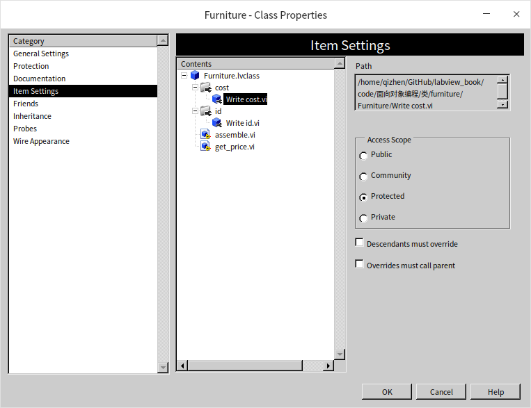

It is best practice to keep low-level helper VIs private or protected to prevent end-users from calling them directly. In the past, when low-level VIs were left public, developers often faced situations where a minor internal tweak broke a customer's application because the customer had bypassed the official API and called the internal VIs directly. To keep customers happy, developers had to restore the old, flawed behavior, making the module nearly impossible to maintain or refactor. Encapsulating internal VIs as private ensures that consumers can only interact with the official public API, giving module authors the freedom to update internal logic safely.

For instance, in our furniture store example, the data access VIs in the `Furniture` parent class are only intended for subclasses like `Table` and `Chair`. Therefore, their access scope should be set to **Protected**.

Some languages also support setting access permissions on the class itself (e.g., public vs. package-private classes) to help structure larger software components. While LabVIEW classes cannot be nested directly inside other classes, they can be nested within LabVIEW project libraries (`.lvlib`). In this setup, a class acts as a library member, and you can mark the class itself as public or private relative to the library's namespace.

### Instantiation Requirements for Classes

In text-based OOP, class members are divided by whether they require an instance to be accessed:

- **Static Members:** Attributes or methods that belong to the class itself rather than any specific instance. They can be accessed without creating an object of the class.
- **Instance (Dynamic) Members:** Attributes or methods that belong to a specific object. You must instantiate the class before you can access them.

Note that LabVIEW's "static dispatch" and "dynamic dispatch" templates mean something completely different from the terms "static" and "dynamic" in other OOP languages. In standard computer science terms, most methods in a LabVIEW class are instance methods because they require a class control input on their front panel and cannot run without a valid object wired to them.

However, you can create static methods in LabVIEW by building a standard VI inside a class folder that does *not* include a class input terminal. As shown below, this VI is physically grouped inside the class library but can be called directly from anywhere without wiring an instance to it:

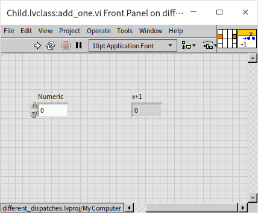

This technique is useful for grouping helper functions with the class. A prime example is a **constructor** VI: since it doesn't take a class input but outputs a newly initialized class instance, it cannot be an instance method. Constructors are used to set default data, open files or hardware resources, and initialize network connections. Below is an example of a constructor VI:

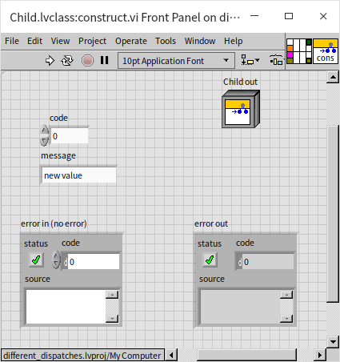

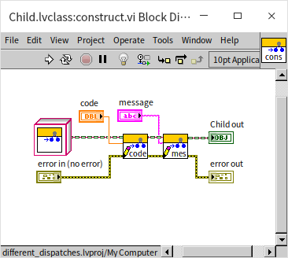

To avoid confusion, except for this section, this book will use LabVIEW's definitions when referring to "static" and "dynamic" (referring to how VIs resolve at edit-time vs. runtime) rather than the broader text-based programming definitions (whether instantiation is required).

### Overriding Requirements in Subclasses

Methods can also be categorized by how subclasses are allowed or required to override them:

- **Virtual Functions:** Methods that can be overridden by subclasses to exhibit polymorphic behavior. In LabVIEW, these are VIs created using the **Dynamic Dispatch** template.
- **Final Functions:** Methods that subclasses are explicitly forbidden from overriding. In LabVIEW, these correspond to **Static Dispatch** VIs, which cannot be redefined in subclasses.
- **Abstract Functions (Pure Virtual Functions):** Methods defined in a parent class with only their interface (name and connector pane terminals) but no implementation. Subclasses must override and implement these VIs before they can be used. In LabVIEW, you can mark a dynamic dispatch VI as **Must be overridden by descendant classes** in its properties, making it an abstract method:

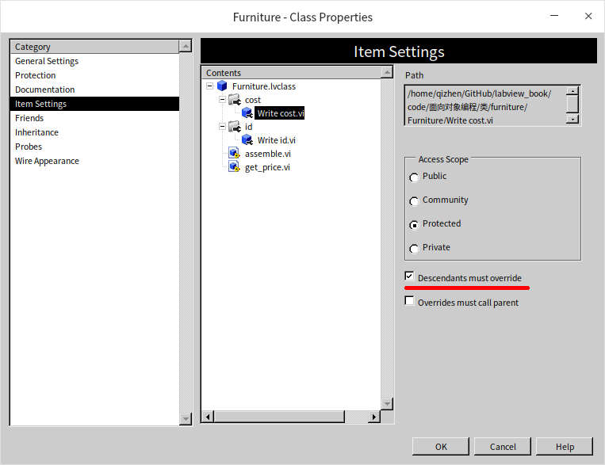

Just like methods, classes themselves can be categorized by how they are inherited:

- **Abstract Classes:** Classes designed solely to serve as templates for subclasses; they cannot be instantiated directly.
- **Final Classes:** Classes that cannot be inherited by any subclass.

What is the point of a class that cannot be instantiated? In our furniture store example, the store only sells tables and chairs. We created a `Furniture` parent class to hold shared behavior, but since there is no generic "furniture" item for sale, we shouldn't allow users to instantiate a raw `Furniture` object. By designing `Furniture` as an abstract class, we force developers to instantiate either a `Table` or a `Chair`, preventing invalid configurations.

Marking `Table` and `Chair` as final classes would be too restrictive here, as a user might want to derive a `Recliner` from the `Chair` class. Final classes and methods are generally used for security or performance optimization. For example, if you write a class for security validation, making it final prevents someone from creating a malicious subclass that overrides your password checks.

While LabVIEW does not have an explicit keyword for "abstract class," you can achieve the same result using **Interfaces** (discussed in [Interfaces](oop_interface)), which were introduced in LabVIEW 2020.

### Multiple Inheritance

#### The Challenges of Multiple Inheritance

LabVIEW classes use **single inheritance**: a class can have only one parent class, although it can have multiple subclasses.

However, real-world problems often present cases where multiple inheritance would be convenient. Consider a furniture store that sells tables and chairs, but also introduces a combo table-chair:

This combo piece has characteristics of both tables and chairs, suggesting it should inherit from both the `Table` and `Chair` classes. Under a single-inheritance model, if we inherit only from `Chair`, we have to duplicate the table-specific code inside the combo class, which is highly inefficient. Even worse, any existing VIs designed to accept and process `Table` objects won't accept our combo object because it doesn't belong to the `Table` inheritance tree.

While some languages (like C++) support multiple inheritance, it introduces the infamous **Diamond Problem** and class member conflicts. For example, if both `Table` and `Chair` implement a `Calculate Weight Capacity` method, which version does `Combo Table-Chair` inherit?
- Should it keep both implementations separate?
- If they both inherit from a common ancestor like `Furniture` which defines `Calculate Price`, which path does the compiler resolve to avoid calculating the price twice?
- If a program accepts a generic `Furniture` wire and calls `Calculate Price` on the combo object, does it dispatch through the `Table` path or the `Chair` path?

The rules to resolve these ambiguities in languages like C++ are notoriously complex and error-prone. Consequently, modern languages (including Java, C#, and LabVIEW) forbid multiple class inheritance. Instead, they resolve this design dilemma using **Interfaces**.

### Interfaces

An **Interface** can be thought of as a purely abstract class containing only method signatures without any implementation code. Because interfaces do not contain code or data, inheriting from multiple interfaces does not cause conflicts or duplicate data issues.

When a class inherits from a parent class, it gains the parent's behaviors (implementation reuse). When a class inherits (implements) an interface, it signs a contract agreeing to implement all the methods defined by that interface. In LabVIEW, a class can inherit from exactly one parent class, but it can implement multiple interfaces. A `Combo Table-Chair` class can inherit from `Chair` and implement a `Table` interface, making it compatible with any program designed for either chairs or tables.

While interfaces solve the type-compatibility issue (allowing a class to belong to multiple types), they do not directly solve code reuse because interfaces do not contain code. Different programming languages have addressed this in different ways:
- **Traits (e.g., PHP, Rust):** Reusable blocks of code that can be imported directly into a class, avoiding inheritance-based duplication.
- **Default Interface Methods (e.g., Java, C#):** Allow interfaces to provide a default method implementation. To avoid conflicts if a class implements multiple interfaces with the same default method signature, the language forces the implementing class to override the method and explicitly declare which version to use.

LabVIEW 2020 introduced interfaces to the G language. We will detail how to use them in [Interfaces](oop_interface).

### OOP and Data Flow in LabVIEW

A fundamental design question for any programming language is whether objects are passed by value or by reference. Let's run a simple experiment in LabVIEW to see:

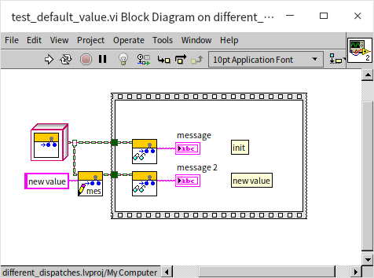

If we branch an object's wire and modify the object's data on one branch, the data on the other branch remains completely unaffected. This demonstrates that, like most native G data types, LabVIEW class objects are **passed by value**.

LabVIEW is built on a dataflow paradigm. Data travels along wires: a node executes when all its inputs are available, processes that data, and passes the result downstream. Forking a wire duplicates the data, creating two independent copies. To maintain this intuitive behavior, LabVIEW objects navigate the block diagram via pass-by-value, differing from languages like C++, Java, or C# where objects are almost exclusively passed by reference.

Pass-by-value in LabVIEW has distinct architectural advantages, particularly when it comes to memory management and thread safety:

1. **Efficiency and Memory Optimization:** In text-based languages, passing large structures by value can be slow because data must be copied onto the call stack. In LabVIEW, subVIs do not use stack pushing to pass arguments. The LabVIEW compiler optimizes memory allocations (buffer allocation) by reusing memory blocks in-place when a VI modifies data. Consequently, pass-by-value in G is highly optimized and doesn't incur the performance penalties typically seen in text-based environments.
2. **Race Conditions and Multithreading:** In pass-by-reference languages, multiple threads can access the same memory location simultaneously. If thread A writes to an object while thread B reads from it, a race condition occurs. Developers must use complex synchronization tools (like mutexes, semaphores, or critical sections) to write thread-safe code.
   LabVIEW is inherently multithreaded. The compiler automatically parallelizes nodes that have no data dependencies. Because LabVIEW uses pass-by-value, branching a wire automatically isolates the data in each execution branch. Programmers don't have to worry about concurrent read/write errors because the two threads are working on independent copies of the data.

If your application explicitly requires a single shared instance of a class across different parts of the diagram, you can implement **by-reference classes** using LabVIEW's reference mechanisms (such as Data Value References, queues, or DVR-wrapped objects), which we will discuss later in the book.

### The Impact of OOP on LabVIEW Programming

Traditional LabVIEW development often starts with the top-level UI and proceeds top-down. This ad-hoc approach makes modules highly project-specific, resulting in low code reuse. Typically, only a few low-level driver or utility VIs end up being reused in subsequent projects, while the core logic has to be rewritten from scratch.

As application complexity grows, managing, maintaining, and reusing software components becomes critical. OOP addresses these challenges by organizing code into self-contained, encapsulated classes. Because class methods are bound to their private data structures, classes act as highly decoupled modules that can be developed, tested, and maintained independently. Inheritance allows developers to extend existing modules without rewriting them, and polymorphism enables writing clean, pluggable architectures. Adopting OOP principles allows LabVIEW applications to scale up cleanly to support large, enterprise-grade software systems.

## Class Memory Loading and Performance {#class-memory-loading}

A LabVIEW developer once complained that their application took several minutes to load, making updates painful. Analysis of the project revealed that the bottleneck was due to class design: the project defined hundreds of `.lvclass` files, resulting in thousands of VIs loading into memory simultaneously.

LabVIEW provides property nodes to query which VIs are currently loaded in memory. You can use these to profile your application's memory footprint:

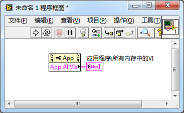

If a VI is independent (or belongs to a standard project library, `.lvlib`) and has no subVIs, opening it loads *only* that specific VI into memory. However, opening any VI belonging to a `.lvclass` triggers the loading of the **entire class** (all member VIs) into memory. Furthermore, if the class has parent or ancestor classes, all VIs inside those ancestor classes are loaded as well.

### Summary of Memory Loading Rules

When a VI is loaded:
1. All of its subVIs are loaded.
2. Every member VI of its class is loaded.
3. Every member VI of all its ancestor classes is loaded.
4. These rules apply recursively.

For example, if you load `A.vi`, and it calls `B.vi` (which belongs to class `C.lvclass`), LabVIEW will load `B.vi` and all other methods of `C.lvclass`. If another method `C.lvclass:other.vi` (which isn't called by `A.vi`) contains a subVI `D.vi` belonging to class `E.lvclass`, then all methods of `E.lvclass` and its parent class `F.lvclass` will be pulled into memory. This recursive dependency chain can quickly drag thousands of unrelated VIs into memory, leading to slow startup times and high memory usage.

To prevent memory bloat, follow these class design guidelines:

1. **Use `.lvlib` for Namespace Encapsulation:** If you only need to group related VIs into namespaces, use a Project Library (`.lvlib`) rather than a Class (`.lvclass`). Use classes only when you need to encapsulate both data (state) and methods.
2. **Ensure High Cohesion:** Class methods should be tightly focused on a single responsibility. If a program only needs to use one or two VIs from a large class, the class is likely too bloated.
3. **Keep Inheritance Trees Shallow:** Avoid deep, complex inheritance hierarchies. Before LabVIEW supported interfaces, developers often created deep hierarchies of purely virtual classes. This practice should now be replaced with interfaces to keep classes decoupled.
4. **Minimize Dependencies Between Classes:** Avoid nesting classes where a method in class A calls methods in class B, C, and D, as this links their loading behaviors.
5. **Use Polymorphism Judiciously:** While runtime polymorphism is powerful, use it only when the type is unknown at edit-time. If choices are fixed at compile-time, dynamic dispatch is unnecessary.

### Practical Examples

- **Good Fit for Classes:** An INI file reader/writer module. Each INI file represents an object instance. The class encapsulates the file path and cached data, and the methods (`open`, `read`, `write`, `save`, `close`) are highly cohesive and typically used together.
- **Poor Fit for Classes:** A comprehensive instrument driver (e.g., an oscilloscope driver with hundreds of configuration VIs). An application usually only configures a few specific trigger modes, but class loading would load every single driver VI into memory. Use project libraries (`.lvlib`) for instrument drivers instead.
- **Good Fit for Classes:** A report generation module. If the application needs to dynamically generate PDF, HTML, or Excel reports at runtime based on user configuration, you can create a `Report` base class with subclasses for each format, sharing common layout methods.
- **Poor Fit for Classes:** A testing program supporting multiple instrument models. While a factory pattern using classes seems appealing, a single user's test station typically has fixed hardware. Since the instrument type is known at deploy-time and does not change dynamically during execution, loading all driver classes into memory is wasteful. A conditional build, plugin architecture, or library-based approach is often better.

## Class Serialization and Dynamic Loading

Let's perform an experiment to see how LabVIEW classes behave when serialized to XML and restored.

First, we populate an instance of a subclass with data, cast the wire to its parent class type, and use the **Flatten to XML** function to save the data to a file:

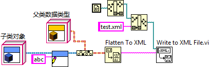

Next, we restart LabVIEW (to clear the memory) and write a program to deserialize the XML back into the parent class object:

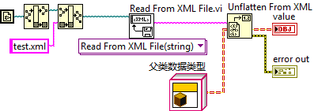

Running this VI throws an error from the **Unflatten From XML** function, returning empty data.

Why does this happen? Even though we cast the subclass object to the parent class type in the first G diagram, the underlying object data remains that of the subclass. Consequently, the generated XML contains the subclass type descriptor and subclass-specific data fields.

When we restart LabVIEW and run the deserialization program, the block diagram only references the parent class type, so only the parent class is loaded into memory. When **Unflatten From XML** parses the XML and finds subclass data, it attempts to load the subclass. However, since the subclass is not currently loaded in memory, the function does not know the subclass's data structure and fails, throwing an error.

If we modify the deserialization VI to output the subclass type directly, the code runs without error:

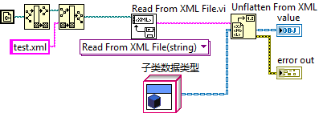

Because a subclass can always be represented by its parent, we can also successfully unflatten the subclass data back into a parent class wire, *provided* the subclass is already loaded in memory. Dropping a subclass constant onto the block diagram forces LabVIEW to load the subclass, making the following code run perfectly:

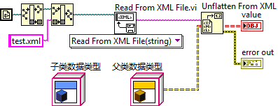

From this experiment, we can draw two important conclusions:

1. Deserializing XML or JSON data into a specific LabVIEW class type is only possible if that class has already been loaded into memory.
2. Loading a subclass into memory automatically loads all of its parent classes because the subclass contains explicit dependencies pointing to its parents. However, loading a parent class does *not* load its subclasses. The parent class has no knowledge of which classes inherit from it.