# Generic Programming

## Fundamentals

In software development, we often abstract common logic. For example, when implementing a sorting algorithm, we don't rewrite the code for every specific array we need to sort. Instead, we package the logic into a subfunction (subVI) and pass the target array as an input parameter. Since the sorting algorithm itself is independent of the specific values, the same subVI can sort `[1, 3, 2]` as easily as `[5, 6, 4]`.

**Generic programming** takes abstraction a step further by decoupling algorithms from specific *data types*. A generic sorting algorithm can sort an array of integers, an array of strings, a list of apples sorted by weight, or a database of students sorted by grade.

In traditional G programming, inputs and outputs on a subVI's connector pane have fixed data types. If a subVI is configured with a numeric input terminal, you can only wire numbers to it; wiring a string array will result in a broken wire syntax error. However, many built-in LabVIEW functions are inherently generic. For example, the addition function (`+`) accepts numeric types, arrays, or clusters:

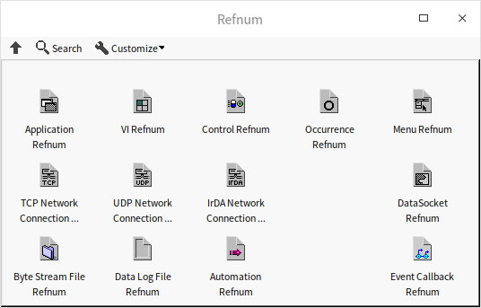

Similarly, array functions (like *Insert Into Array* or *Index Array*) adapt dynamically to whatever data type the array contains.

If we write a subVI and set its input parameter to the **Variant** data type (which can accept any type of data), does that constitute generic programming?

Not quite. A true generic programming model requires not only parameter flexibility but also **static type checking**. Static type checking means the compiler identifies type mismatches at edit-time (causing a broken wire), rather than letting the program compile and fail at runtime. For example, if a custom sorting algorithm supports numbers and strings but not Booleans, wiring a Boolean array should immediately break the wire, prompting the developer before the code runs. A subVI using raw Variant inputs cannot achieve this because a Variant accepts any G data type without breaking the wire.

In mainstream text-based languages, generic programming is implemented in two main ways:
- **Type Erasure (e.g., Java):** The compiler performs type checking and type inference during compilation to ensure type safety. Once checked, it erases the generic type parameters, producing generic-free bytecode. A single compiled class (like `List`) is reused for all types.
- **Code Generation / Templates (e.g., C++):** When you write a generic template, the compiler does not compile it directly. Instead, when it compiles code like `List<int>` and `List<string>`, it automatically generates separate, type-specific source code classes behind the scenes. This trades executable size (code bloat) for execution speed, ensuring strict compile-time type safety.

LabVIEW offers several techniques to build VIs that support multiple data types. This chapter will walk through these approaches.

## Utilizing Variants as SubVI Parameter Types {#utilizing-variants-as-sub-vi-parameter-types}

### The Variant Data Type

The **Variant** is a unique data type in LabVIEW that can represent any G data type. You can convert any variable to a variant using the **To Variant** function, and convert it back using the **Variant To Data** function (both located in the **Programming -> Cluster, Class & Variant -> Variant** palette):

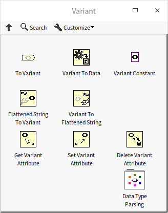

The Variant data type functions similarly to `void*` in C or `Variant` in Visual Basic.

### Type Conversion

When you convert data to a variant, the variant retains the original data type information. Consequently, the **Variant To Data** function can only cast the variant back to its exact original type (or a compatible type); attempting to convert it to an incompatible type will output default data and a type mismatch error.

Below is an example of converting a custom cluster into a variant and then restoring it:

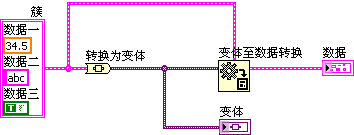

During debugging, you can right-click a variant indicator or control and select **Show Type** and **Show Data** to inspect its internal type metadata and actual value directly on the front panel:

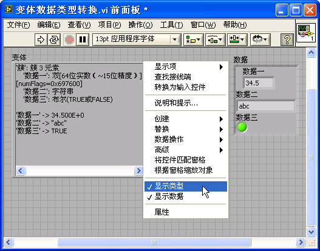

If you need to inspect the data type programmatically, use `Get Type Information.vi` inside the **Data Type Parsing** subpalette. This subpalette contains several advanced VIs for parsing complex data structures, such as inspecting the data type of individual fields inside a cluster:

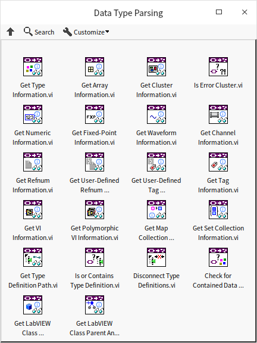

The program below demonstrates converting cluster data to a variant and extracting its internal type structure:

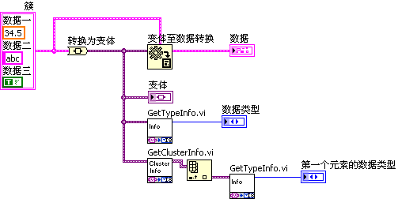

### Applying Variants as Parameters

By setting a subVI's inputs and outputs to the **Variant** type, you can pass any data type to the subVI. This is also useful when you need to store different data types inside the same collection, such as an array of variants.

However, using variants as inputs bypasses compile-time type safety. The compiler cannot verify if the incoming type is valid. Instead, the subVI must inspect the data type at runtime (dynamic type checking) and report errors if a mismatch occurs.

Suppose you want to write a subVI that adds two inputs. It should support both numbers and strings: if the inputs are numbers, it outputs their sum; if they are strings, it parses them, adds them, and outputs the sum as a string. Setting the parameters to Variant allows the subVI to accept both:

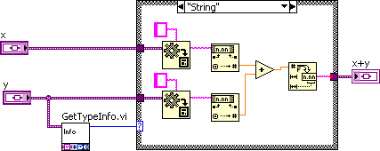

The calling code wires different types directly to `Variant Addition.vi`:

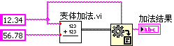

This approach has two main drawbacks:
1. **Poor Type Safety:** The algorithm is only designed to handle numbers and strings. However, if you wire a Boolean or a path control to this subVI, G will allow it without showing a broken wire. The error will only be caught during execution when the subVI fails to parse the variant.
2. **Output Unflattening:** Because the subVI output is also a variant, the caller must manually use **Variant To Data** to convert the result back to a concrete type before it can be used in downstream logic.

To solve these issues, we can use **Polymorphic VIs**, which we will discuss next.

### Implementing Map Containers with Variant Attributes

The Variant palette includes three functions for managing metadata: **Get Variant Attribute**, **Set Variant Attribute**, and **Delete Variant Attribute**. This allows associating key-value attributes (where the key is a string and the value is any G data type) directly with a variant variable.

Because variant attributes are implemented internally as a hash table, reads and writes are highly optimized. Before LabVIEW introduced native Map and Set data types in LabVIEW 2019, G developers frequently used variant attributes as key-value dictionaries.

For example, to build a grade-lookup table where a student's name is the key and their numeric score is the value:

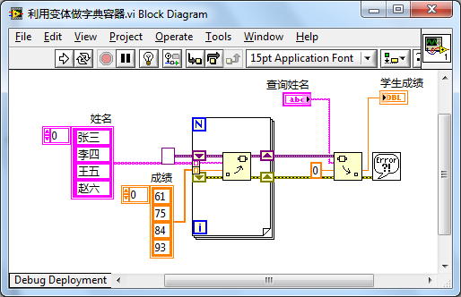

This program yields the following lookup results:

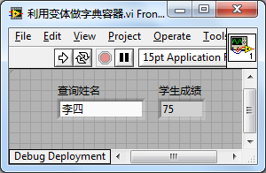

Although variant attributes provide quick lookups, they are not a formal data container and are limited to string-based keys. In modern LabVIEW, you should use the native **Map** and **Set** collections instead.

## Polymorphic VIs

Many of LabVIEW's built-in VIs are polymorphic, meaning they accept multiple data types. For example, the VIs for reading and writing configuration files can handle numbers, strings, Booleans, paths, and more. This is also true for audio output, file I/O, and data acquisition VIs:

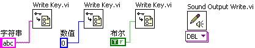

A **Polymorphic VI** is a special container VI that doesn't contain any functional code itself. Instead, it wraps a collection of standard VIs, known as **instance VIs**. Each instance VI implements the exact same logic but for a specific data type. When a developer wires a data type to the polymorphic VI on their diagram, G automatically routes the call to the matching instance VI.

Polymorphic VIs solve the type-safety problem. If you configure a polymorphic VI with two instances (one for numbers and one for strings), it will only accept numbers or strings. Wiring a Boolean to its input will break the wire immediately, ensuring compile-time safety.

### Creating Polymorphic VIs

Let's build a polymorphic VI named `add_polymorphic.vi` that supports both numbers and strings. Based on the input data type, it will delegate the call to either `add_numeric.vi` or `add_string.vi`:

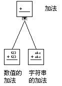

To create a polymorphic VI, you must first create all of its instance VIs as standard subVIs. For example, here is the block diagram of `add_string.vi`:

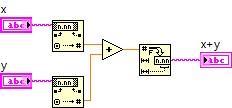

Once your instance VIs are saved, select **File -> New** and choose **VI -> Polymorphic VI**.

A polymorphic VI has no front panel or block diagram. Instead, it opens a configuration window where you manage its instance list:

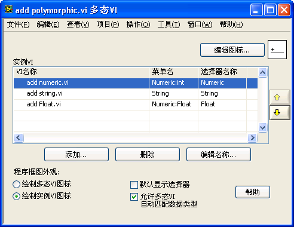

Use the **Add** button to load your instance VIs into the list.

Here are the key configuration options in this dialog:
- **Icon:** Click **Edit Icon** to design the main icon.
- **Draw polymorphic VI icon / Draw instance VI icon:** Choosing the former displays a single icon for the polymorphic VI. Selecting the latter dynamically changes the icon on the block diagram depending on which instance VI is selected.
- **Allow polymorphic VI to automatically match data types:** When checked, LabVIEW automatically resolves the data types wired to its terminals and selects the matching instance. If unchecked, the user must select the instance manually.
- **Default to showing selector:** When checked, a purple selector menu appears under the VI icon when placed on the diagram, allowing users to manually choose the active data type.
- **Edit Names:** Customizes the names shown in the selector menu and right-click menus.

### Design Considerations

When designing polymorphic VIs, keep the following best practices in mind:
- **Connector Pane Consistency:** All instance VIs must share the exact same connector pane layout and terminal positions. The inputs and outputs must match in quantity and function, even though their data types differ.

  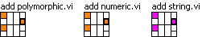

- **Unified Behavior:** While instance VIs can have entirely different internal code, they should perform conceptually identical tasks. The user expects the polymorphic VI to act as a single API.
- **Nesting Restriction:** Polymorphic VIs cannot be nested. A polymorphic VI cannot be used as an instance VI inside another polymorphic VI.

### Structuring Selectors and Menus

For polymorphic VIs with many instances, you can group them into hierarchical right-click menus. Use colons (`:`) in the **Menu Name** field of the configuration dialog to define menu subfolders. For example, setting the menu name to `Numeric:Double` creates a `Numeric` category with `Double` as a nested option:

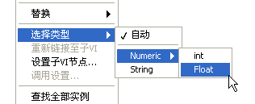

### Drawbacks of Polymorphic VIs

While polymorphic VIs ensure type safety, they require substantial developer effort. You must create and maintain a separate physical VI file for every data type you want to support. This becomes impractical for algorithms that should theoretically accept an infinite variety of data types (such as a generic sorting VI that could sort *any* user-defined cluster).

To handle generic programming without file duplication, LabVIEW offers **Malleable VIs**, which we will discuss next.

## Malleable VIs

LabVIEW includes a set of built-in **Malleable VIs**, which are recognizable on the functions palette by their bright orange background color:

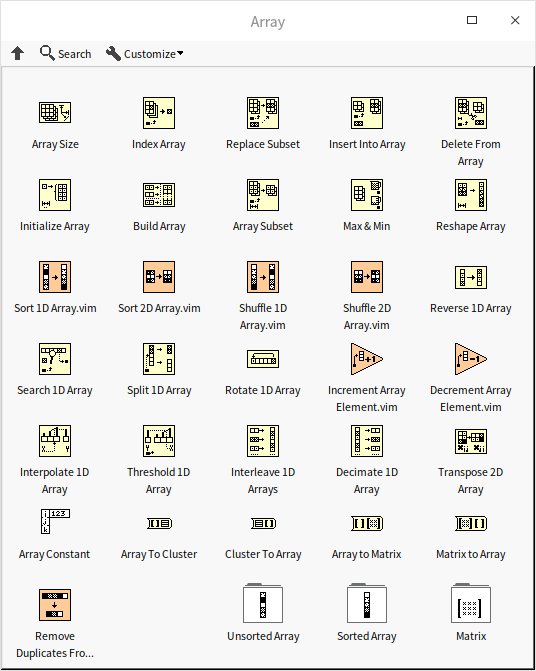

Dragging a malleable VI onto your block diagram allows it to accept a wide variety of input data types automatically:

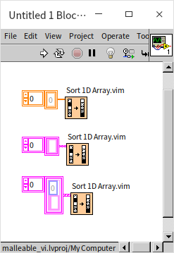

### How Malleable VIs Work

Malleable VIs are standard VIs with a unique file extension: `.vim`. You can convert any standard VI into a malleable VI simply by changing its extension from `.vi` to `.vim`. To compile successfully, a malleable VI must be configured as **Reentrant** and set to **Inline**:

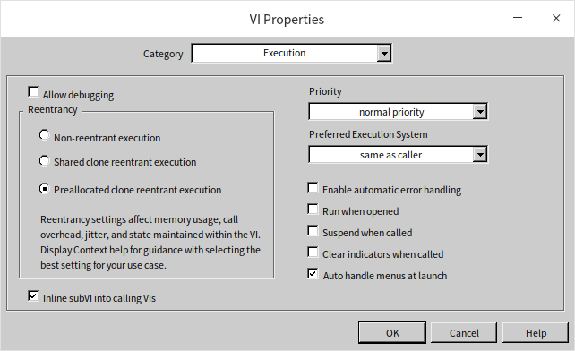

When a malleable VI is compiled, LabVIEW inlines its code directly into the caller's block diagram. Unlike standard inlined VIs which enforce strict type checking based on their front panel terminals, a malleable VI's terminals act as generic type placeholders. The compiler inspects the actual data types wired to the malleable VI terminals. If the code inside the malleable VI is syntactically valid for those types, G generates type-specific code for the call. This is conceptually identical to templates in C++ or generics in Java.

### Malleable VIs vs. Polymorphic VIs

- **Structure:** A polymorphic VI is a directory of separate, type-specific `.vi` files. A malleable VI is a single `.vim` file.
- **Flexibility:** Malleable VIs are much easier to create and maintain. They dynamically support an infinite number of user-defined data types (such as custom clusters), whereas polymorphic VIs are hardcoded to a fixed list of instances.
- **Complexity:** Polymorphic VIs can support instances with completely different parameters or panel structures. Malleable VIs must use a single, unified connector pane layout.

### Writing a Malleable VI

Let's build a custom malleable VI to implement a **shuffling algorithm** (Knuth/Fisher-Yates shuffle). The algorithm is as follows:
1. Iterate through the array from the first element to the last.
2. For each element, select a random index from the remaining elements (current index to end).
3. Swap the elements at these two indices.

This algorithm ensures that every possible permutation of the array is equally likely.

This algorithm can shuffle any list of items, whether they are integers, strings, or custom hardware driver references. It would be highly inefficient to restrict the VI to only one array type. By writing it as a malleable VI, we can shuffle arrays of any type.

First, create a new malleable VI:

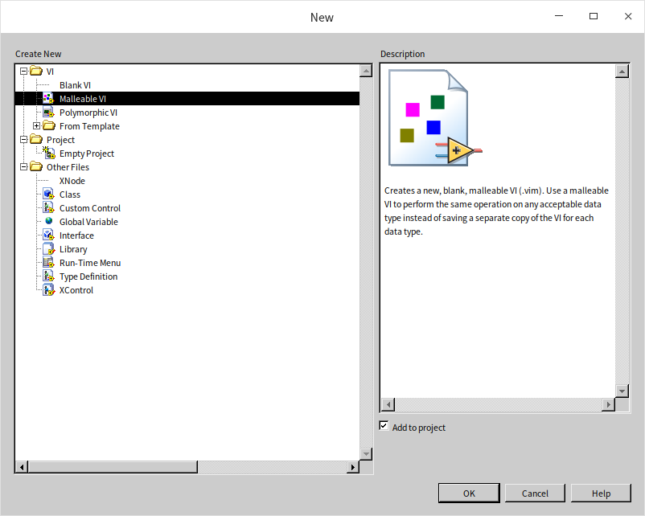

Next, implement the shuffling logic. On the malleable VI's block diagram, we must place input/output controls. Since G needs to compile the diagram, we drop a standard 1D Numeric Array control onto the front panel to serve as our data template. G will dynamically substitute this type with the caller's wire type:

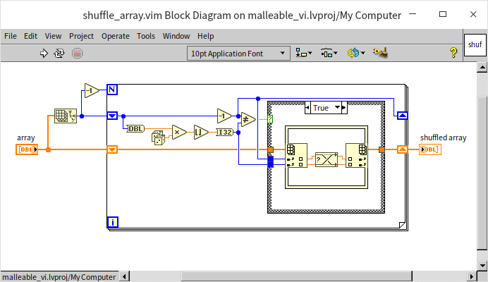

Once saved as `shuffle_array.vim`, this single VI can randomly sort 1D arrays of any G data type:

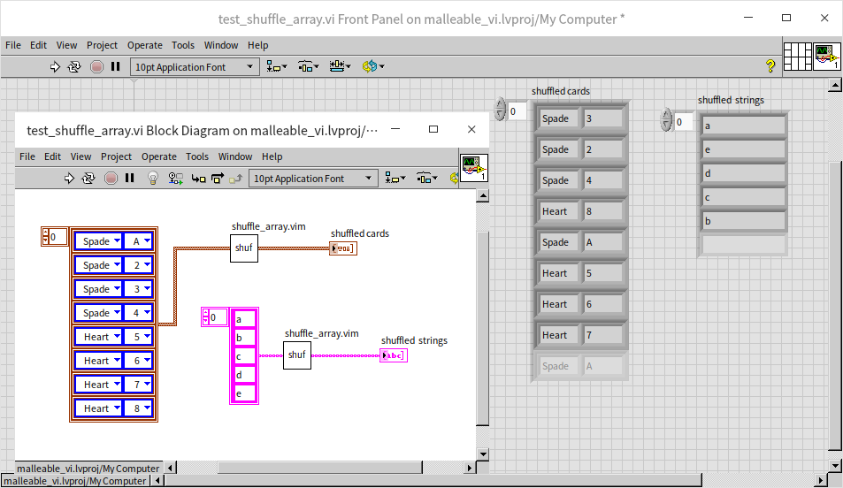

### Type Specialization Structures

Our `shuffle_array.vim` works perfectly for 1D arrays, but wiring a string or a 2D array to it will result in a broken wire:

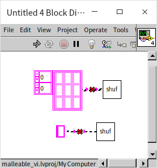

If a datatype is wired to a malleable VI, and that datatype causes a syntax error inside the malleable VI's block diagram, the compiler breaks the wire at the call site. For instance, passing a string to `shuffle_array.vim` breaks because the internal array manipulation nodes cannot accept string inputs:

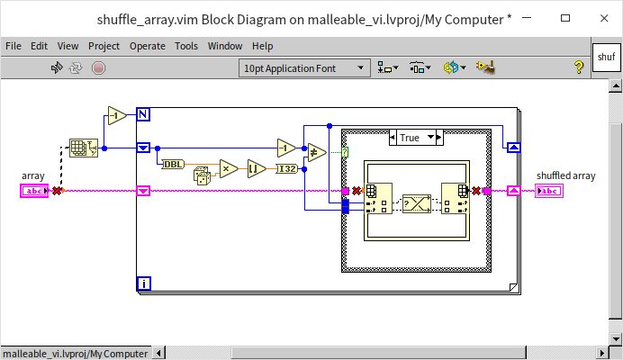

If we want the shuffle VI to support strings by shuffling their characters, we need to execute different logic for string inputs. We can implement this inside a new malleable VI (`shuffle_string_and_array.vim`) using the **Type Specialization Structure**:

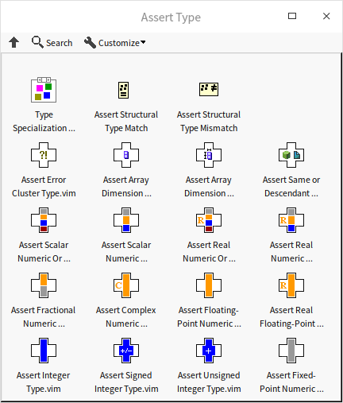

The **Type Specialization Structure** is a G structure designed specifically for malleable VIs. It works like a compile-time case structure. When LabVIEW compiles the calling code, it tests the branches sequentially. If a branch generates syntax errors (like passing a string to an array function), the compiler ignores that branch and tests the next. The first branch that compiles successfully is the one used to generate the final machine code.

Here is the block diagram of `shuffle_string_and_array.vim`:

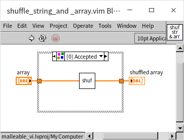

- **Branch 0:** Wired directly to `shuffle_array.vim`. If the input is a 1D array, this branch compiles without errors and runs.
- **Branch 1:** Converts the incoming string to a byte array, shuffles it using `shuffle_array.vim`, and converts it back to a string. If the input is a string, Branch 0 fails to compile, so LabVIEW uses this branch instead.
- If a Boolean is wired, both branches fail, resulting in a broken wire at the caller.

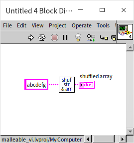

While the Type Specialization Structure lets you write different implementations for different types, it should be used sparingly. If your implementations are completely different, using polymorphic VIs or classes is much better for readability.

### Type Checking

To control which types a malleable VI accepts or rejects, you can use compile-time type assertions located under **Programming -> Comparison -> Assert Type**:

- **Assert Structural Type Match:** Takes two inputs and compiles successfully only if their data structures match. If they differ, it triggers a syntax error (breaking the wire).
- **Assert Structural Type Mismatch:** The inverse of the above. It triggers a syntax error if the two inputs share the same data structure.

For example, suppose we want to write a malleable VI that bundles two inputs into a cluster. The rule is that both inputs must share the same type (e.g., both integers or both strings). Since LabVIEW's native *Bundle By Name* or *Bundle* function allows mixing types, we insert **Assert Structural Type Match** inside the malleable VI to enforce this constraint:

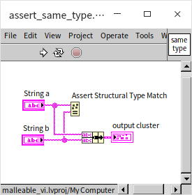

If the input types are identical, the wire compiles. If they differ, G flags a syntax error:

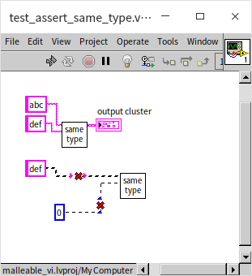

Similarly, you can use **Assert Structural Type Mismatch** to exclude specific types. For example, to make a malleable VI accept any G type except strings, you can compare the input against a string constant using this assertion:

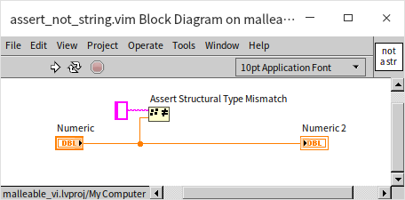

### Limitations of Malleable VIs

While malleable VIs cover most generic programming needs in G, they have key limitations:
1. **Reentrancy and Inlining Constraints:** Malleable VIs must be reentrant and inlined. Because of this, they cannot access certain VI properties and methods at runtime. Furthermore, you cannot unbundle private class data within an inlined VI, meaning malleable VIs cannot directly manipulate a class's private cluster even if the malleable VI is a member of that class.
2. **Metadata and Dynamic Terminals:** Malleable VIs cannot inspect or dynamically restructure their own terminals. For example, you cannot write a malleable VI that takes any custom cluster, reverses the ordering of its fields, and outputs the result. Similarly, you cannot dynamically extend the terminals of a malleable VI by dragging the edge, like you would with the native *Bundle* node. For these advanced macros, LabVIEW uses **XNodes** (discussed in [XNodes](oop_xnode)).

## Application Example: Generic Doubly Linked List

In [Object-Oriented Application Examples](oop_use_cases#doubly-linked-list), we implemented a doubly linked list that only supported DBL numeric data. If we wanted to store strings, we would have to copy the entire class hierarchy and recreate all the VIs for string types, even though the underlying linked list algorithm is identical.

In this section, we will refactor the doubly linked list into a **generic container** that supports any G data type. Users will be able to manage numeric, string, or cluster lists using a single unified API.

Unlike our previous single-VI examples, a data container is a collection of related VIs (a library or class) where types are interdependent. Once a user instantiates a list to store strings, all subsequent write operations (like `Insert`) must verify that the incoming data is indeed a string.

To achieve this, we need a way to pass type information between VIs. LabVIEW classes do not support G-type parameters (generic classes) because `.lvclass` wires have static types. However, we can use a **Cluster** wire to pass both a reference to the list data and a type placeholder.

To simplify the implementation, instead of redesigning the doubly linked list from scratch, we will wrap our existing class:
1. Modify the internal data field in the node class from a DBL numeric type to a **Variant** type. This allows the nodes to store any type of data at runtime.
2. Wrap the class methods with **Malleable VIs** (`.vim`) that add compile-time type verification. This design mirrors how Java uses type erasure.

### Storing Data as Variants

The core steps to build the list class are described in [Object-Oriented Application Examples](oop_use_cases#doubly-linked-list). Our only change to the underlying class is changing the data type in the list node `.ctl` cluster to a Variant:

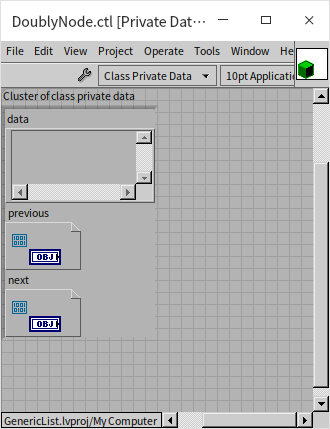

We also change the input and output terminals of all node-accessing VIs to Variant. Here is the `get_data.vi` method in the Iterator class:

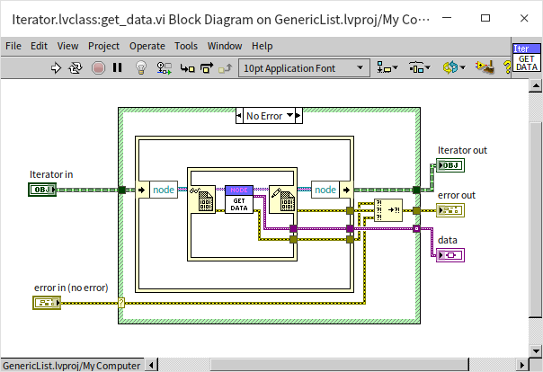

This allows the list to store any G type at runtime. Next, we will use malleable VIs to add compile-time type verification.

### Wrapping Methods in a Generic Library

We create a Project Library (`.lvlib`) to group our generic wrapper methods:

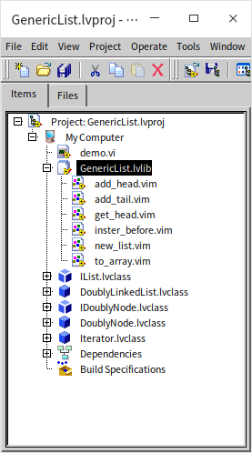

Every public method in this library is a malleable VI (`.vim`), not a standard VI.

### Creating a Generic List Instance

A standard list doesn't require initialization arguments, but a generic list needs to know what type of data it will store.

We implement `new_list.vim` to initialize the list. It takes a single input terminal: a placeholder for the element data type. The value is ignored; we only inspect its type. The VI initializes the underlying `DoublyLinkedList` object and bundles it with the type placeholder into a custom cluster:

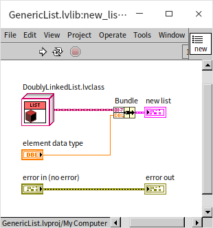

This cluster acts as our generic list reference. Other library VIs will read this cluster to identify both the data container and its expected data type.

### Writing Data to the Generic List

Every method that writes data to the list performs two steps:
1. Compile-time verification that the input matches the list's expected data type.
2. Invocation of the underlying class method.

Here is the block diagram of `insert_before.vim`:

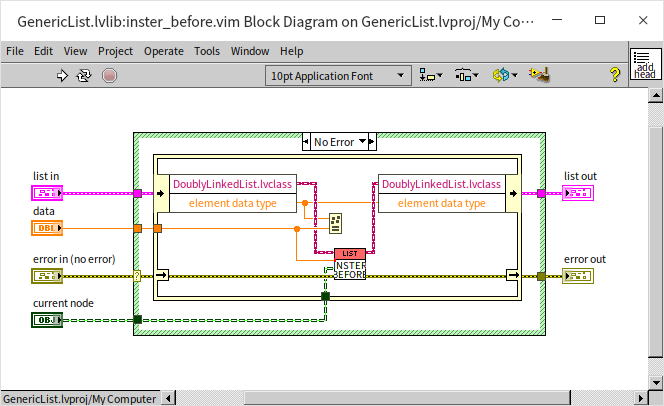

The VI unbundles the `list in` cluster, reads the type placeholder, and uses the **Assert Structural Type Match** function to check it against the incoming data. If they mismatch, G flags a syntax error at the call site. If they match, it converts the data to a variant and inserts it into the `DoublyLinkedList` object.

### Reading Data from the Generic List

When reading data, the generic wrapper reads the variant from the underlying class and automatically casts it back to the concrete type stored in the container. The `to_array.vim` method retrieves all data in the list and outputs it as a typed array:

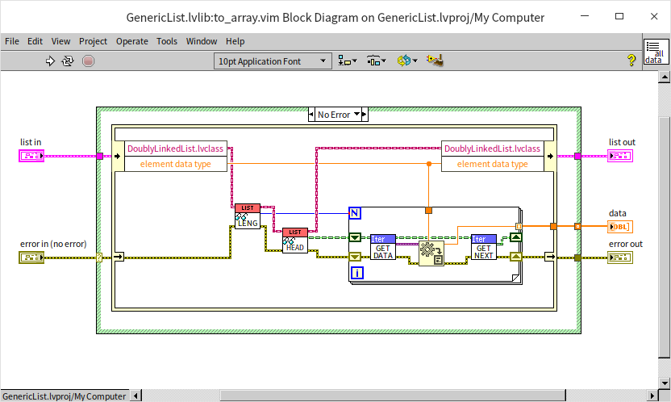

### Utilizing the Generic Linked List

Here is an example program showing the generic doubly linked list in action:

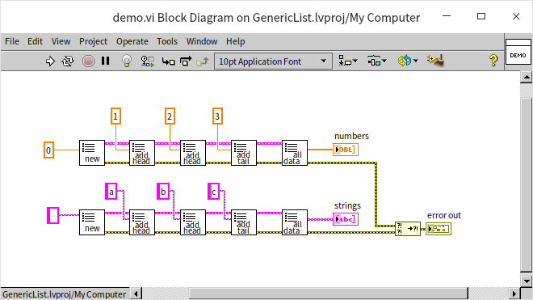

By using malleable wrappers, we can use the exact same G nodes to build, write, and read lists of double-precision numbers, strings, or any other G data type.