# Interface

## The Essential Difference Between Classes and Interfaces

Before diving into LabVIEW interfaces, let's review the fundamental conceptual differences between classes and interfaces:
- **Class Inheritance (Implementation Reuse):** Inheriting from a parent class allows a subclass to reuse existing functionality. For example, if instrument model `LV12345` inherits from an `Oscilloscope` class, it means `LV12345` *is* a type of oscilloscope and reuses the code defined in the parent class.
- **Interface Inheritance (Capability Contract):** Implementing an interface declares that a class is capable of performing certain behaviors, without forcing it into a specific taxonomic category. If `LV12345` implements the `Oscilloscope` interface, it simply guarantees that it provides oscilloscope capabilities.
- **Single vs. Multiple inheritance:** A class can inherit from only one parent class, but it can implement multiple interfaces. If `LV12345` inherits from `Oscilloscope`, it cannot also inherit from `Spectrum Analyzer`. However, if `LV12345` represents a hybrid instrument, it can implement both the `Oscilloscope` and `Spectrum Analyzer` interfaces, signaling it supports the capabilities of both.

This distinction has direct implications for software design. When designing modular APIs (e.g., a VI that takes an instrument input and acquires a waveform), you should set the input terminal type to an **Interface** rather than a class. If you use an `Oscilloscope` class type, the VI will refuse to accept a hybrid instrument that has oscilloscope capabilities but inherits from a different class hierarchy. By using an interface, your API remains decoupled and can interact with any hardware model that implements the required capabilities.

In text-based OOP languages, interfaces serve two main purposes:
1. **Abstraction:** Interfaces cannot be instantiated directly (they do not have concrete objects). They define a contract, and the runtime ensures that only concrete class instances are passed to parameters expecting an interface type.
2. **Code Reuse:** Some languages allow interfaces to provide default method implementations so that implementing classes don't have to duplicate boilerplates.

In LabVIEW, interfaces are structurally very similar to classes, but with two key differences:
1. **Interfaces contain no private data.**
2. **Interfaces support multiple inheritance.**

While LabVIEW interfaces are excellent for defining public APIs, G does not strictly enforce abstraction (you can place an interface constant directly on a block diagram), and code reuse is limited because interfaces cannot store state. Therefore, G developers must apply specific design patterns to get the most out of interfaces.

## Creating Interfaces

To create an interface in LabVIEW, right-click in the Project Explorer and select **New -> Interface**:

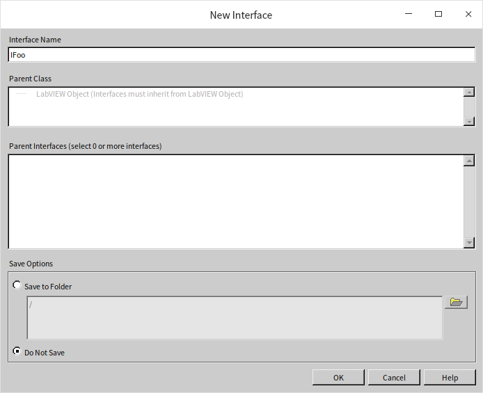

Like classes, all interfaces ultimately inherit from **LabVIEW Object**. Interfaces cannot inherit from classes, but they can inherit from other interfaces.

LabVIEW interfaces are saved as files with the `.lvclass` extension—the exact same extension used for classes. Because they share the same extension, you cannot distinguish between a class and an interface by their file names alone. To make your code readable, it is standard practice to prefix interface names with a capital `I` (e.g., `ITable` for a table interface, `IInstrument` for an instrument interface).

Interfaces can inherit from other interfaces to build functional hierarchies. For example, you can create an interface named `IParent` and a child interface `IChild` that inherits from it:

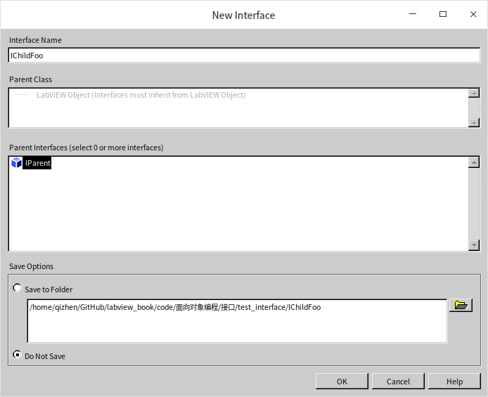

When you create a class, you configure which parent class it inherits from and which parent interfaces it implements:

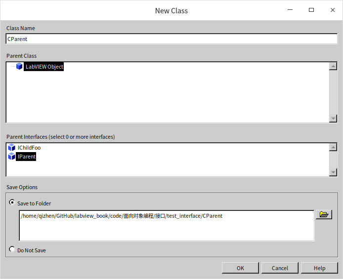

## Properties

LabVIEW interfaces cannot contain private data. Because class data in LabVIEW is strictly encapsulated and accessible only via member VIs, interfaces (which define only API signatures) do not define data fields at all.

## Methods in Interfaces

Creating methods inside an interface is very similar to creating methods inside a class. When you right-click an interface, you can add VIs, virtual folders, templates, and type definitions. Because interfaces have no data, the options for **Property Definition Folder** and **VI for Data Member Access** are not available. Let's look at how static and dynamic dispatch methods behave within an interface:

### Static Dispatch VIs in Interfaces

A **Static Dispatch** VI in an interface cannot be overridden by implementing classes or child interfaces, but it is inherited by them. This means subclass instances can call the static interface method directly:

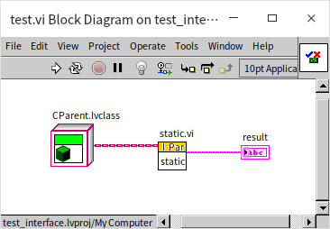

This allows you to add default helper methods directly inside the interface. However, because interfaces cannot store data, these static VIs cannot read or write object fields. They are limited to stateless operations, restricting their utility for code reuse compared to helper VIs in classes.

If a class implements two interfaces that happen to contain static VIs with the same name, there is no conflict. Since static VIs are resolved at compile-time and cannot be overridden, the call path remains unambiguous.

### Dynamic Dispatch VIs in Interfaces

By default, when you add a **Dynamic Dispatch** VI to an interface, LabVIEW configures it as **Must be overridden by descendant classes**. If an implementing class fails to override this method, LabVIEW will flag a compilation error:

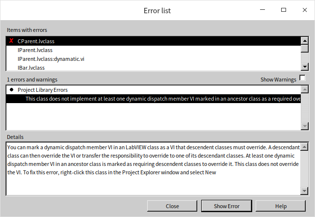

A dynamic dispatch VI in an interface has no executable block diagram (or has an empty one that should not be called). Its sole purpose is to define the API signature: the name of the method and the layout of its connector pane terminals.

If a class implements multiple interfaces that define the same dynamic dispatch method, the class must implement a single overriding VI. At runtime, calling the interface method dispatches directly to the class's override, avoiding the ambiguities associated with multiple inheritance.

You can allow subclasses to inherit an interface's dynamic method implementation without overriding it by disabling the **Must be overridden...** flag. However, if a class implements multiple interfaces that contain the same dynamic dispatch method *and* both provide default implementations, the subclass **must** override the method to resolve the conflict. This prevents any diamond-problem ambiguities.

LabVIEW will flag compilation errors in the following conflicting scenarios:
- **Signature Mismatch:** If a class implements two interfaces containing a dynamic dispatch method with the same name but different connector pane terminals, the class cannot resolve the conflict and will fail to compile. An overriding VI can only match one signature.
- **Static/Dynamic Conflict:** If a class implements two interfaces where one defines `DoWork.vi` as static and the other defines it as dynamic, the class cannot compile. Overriding it violates the static interface's constraint, while failing to override it violates the dynamic interface's constraint.
- **Dynamic Dispatch Initialization Conflict:** If you have an instrument class `LV12345` implementing both `IOscilloscope` and `ISpectrumAnalyzer`, and both interfaces define an `Initialize.vi` with identical signatures, the class can only write one override. The class has no way of knowing whether it was called via an oscilloscope interface wire or a spectrum analyzer interface wire, which can lead to logical issues if the initialization steps for the two modes differ.

To prevent these conflicts, **avoid using identical method names in related interfaces**. A cleaner design is to use descriptive names, such as `Initialize Oscilloscope.vi` and `Initialize Spectrum Analyzer.vi`.

### Access Permissions

Like classes, interface methods support public, private, community, and protected access. However, since the purpose of an interface is to define a public API contract, almost all methods defined in an interface should be **Public**.

### Retrofitting Existing Classes

Because interfaces are decoupled from implementation, you can easily add them to existing classes. Open the **Class Properties** dialog of your target class, navigate to **Inheritance**, and add the target interfaces to the **Parent Interfaces** list:

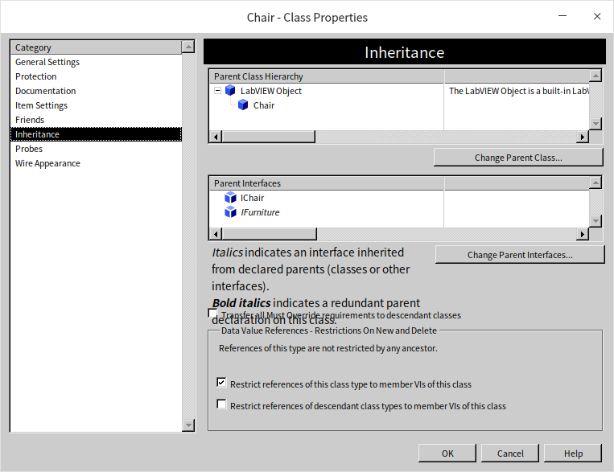

After implementing the interface, you will need to create overrides in the class to implement the interface's dynamic dispatch methods.

## Application Example

Let's refactor the furniture store application from [Class](oop_class) using interfaces to support a `ChairWithTableAttached` combo item.

Here is our updated design:
- **Three Interfaces:** `IFurniture` (base), `ITable` (inherits `IFurniture`), and `IChair` (inherits `IFurniture`).
- **Interfaces do not contain data fields**, but they can contain shared custom enums (such as a tablecloth type enum).
- `IFurniture` defines: `Return Price` and `Assemble`.
- `ITable` defines: `Spread Tablecloth` (and inherits the methods from `IFurniture`).
- `IChair` defines: `Place Cushion` (and inherits the methods from `IFurniture`).

To instantiate the physical items, we define three concrete classes:
- `Table` class: implements `ITable` (meaning it must implement `Return Price`, `Assemble`, and `Spread Tablecloth`), plus its own constructor.
- `Chair` class: implements `IChair` (meaning it must implement `Return Price`, `Assemble`, and `Place Cushion`), plus its own constructor.
- `ChairWithTableAttached` class: implements both `ITable` and `IChair` interfaces, plus its own constructor. This combo class must override all methods declared by both interfaces.

### Creating the Interfaces and Classes

Open the class hierarchy window in LabVIEW (**View -> LabVIEW Class Hierarchy**) to view the relationship between our classes (rectangles) and interfaces (ovals):

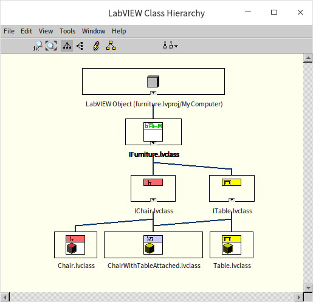

### Attributes and Data Duplication

Replacing the `Furniture` parent class with an `IFurniture` interface provides type compatibility but introduces a drawback: since interfaces cannot hold data, we cannot place the shared attributes (`ID` and `Cost`) in a parent class. Instead, each concrete class (`Table`, `Chair`, and `ChairWithTableAttached`) must define its own private `ID` and `Cost` fields:

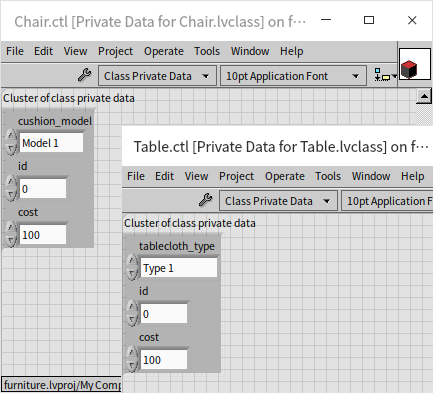

The data access VIs (`get_id.vi`, `set_id.vi`, etc.) must also be implemented independently in each class.

### Overriding Interface Methods

Since a class must implement all methods of its inherited interfaces, LabVIEW will flag a compilation error if any methods are missing. To generate these overrides quickly, right-click the class, select **New -> VI for Override**, select all the interface methods, and click OK:

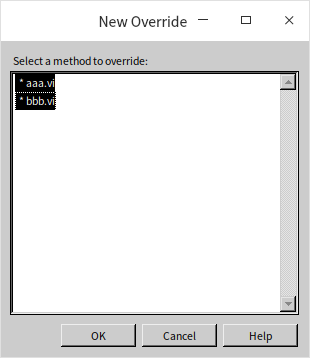

### Application Testing

The test program closely resembles the earlier example that used classes exclusively. However, this iteration of the test program creates three objects from distinct classes:

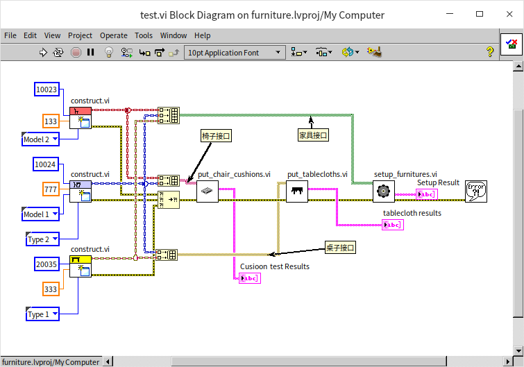

- Wiring a `Chair` object and a `ChairWithTableAttached` object together into an array automatically types the array as `IChair` interface references. Any VI that accepts the `IChair` interface can process both elements.
- Wiring a `Table` object and a `ChairWithTableAttached` object together types the array as `ITable` interface references.
- Wiring all three objects together types the array as `IFurniture` interface references.
- If two classes share no common interface, G upcasts their array to **LabVIEW Object** (the universal base type).

However, a type conflict occurs if two classes share multiple common ancestor interfaces and you attempt to wire them to the same array without casting. For example, if classes `CFoo` and `CBar` both implement `IAAA` and `IBBB`:

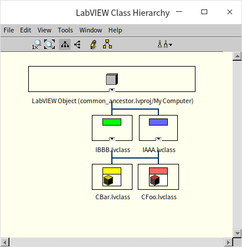

Wiring them to the same array node triggers a type conflict error because the compiler doesn't know whether the array should be typed as `IAAA` or `IBBB`:

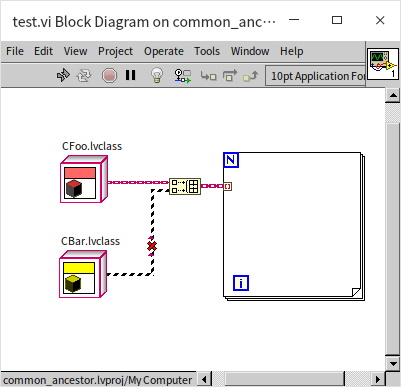

To resolve this conflict, you must manually cast the inputs to a specific interface type (e.g., using the **To More Generic Class** node to cast them to `IAAA`):

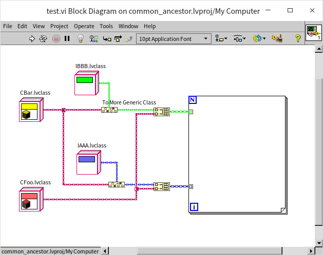

## Instantiating Interfaces and the Lack of Abstract Classes

In our furniture store application, we want to prevent users from creating a generic "furniture" item. Since the store only sells tables, chairs, and combo units, any raw furniture object represents a programming error.

In our second design, we replaced the `Furniture` class with the `IFurniture` interface. However, this alone does not prevent developers from instantiating it. In LabVIEW, **interfaces are not abstract**. You can drop an interface constant directly onto a block diagram, compile, and run it:

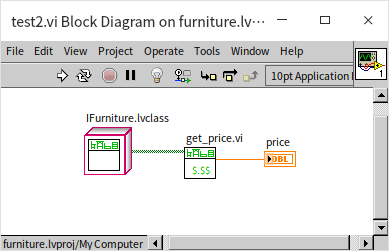

To prevent developers from accidentally executing an un-implemented interface method, you should write safety checks inside the interface's default member VIs. Since dynamic dispatch interface methods are designed to be overridden, the code inside the interface's own VI will only run if a developer directly instantiates the interface and calls the method.

By default, rather than leaving the interface VI's diagram empty, you should place an error-generation node inside it to notify the caller:

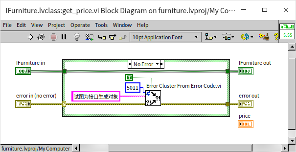

The lack of true "abstract classes" or "abstract interfaces" in LabVIEW stems from its G dataflow architecture: **data types and data values are inseparable in G**.

Unlike text-based languages that use type keywords (like `int` or `class`), LabVIEW has no text-only type names. A data type is always represented by a physical value constant on the block diagram. For example, to cast a double to a 64-bit integer, we must wire a `0` constant of type `I64` to the type terminal:

Similarly, to cast an object to the `IAAA` interface type, we must place an `IAAA` constant on the diagram to serve as a type descriptor. While this linking of type and value can seem unusual, it is a core mechanism of G compilation.

## Enhancing Code Reusability

Our interface-based furniture store program introduced redundant code because we couldn't store the `ID` and `Cost` data or their accessors inside the interface.

To mitigate this, you can extract common logic into helper VIs (standard subVIs) and call them from the class overrides. This allows the concrete classes to implement the interface contract while reusing shared code.

## Summary

Here is a summary of best practices for using LabVIEW interfaces:
- **API Definition:** Prefer interfaces over classes to define public APIs for your software modules.
- **Single Responsibility:** Design small, focused interfaces rather than large, multi-purpose ones.
- **Expose Public Methods Only:** Interfaces should only declare public APIs. Internal helper VIs belong inside concrete classes, not interfaces.
- **Use Dynamic Dispatch:** Interface methods should generally be dynamic dispatch, forcing implementing classes to override them.
- **Interface Error Handling:** Place error-generating nodes inside the interface's default VI diagrams to catch invalid direct instantiations at runtime.
- **Descriptive Naming:** Use descriptive method names to prevent conflicts if a class implements multiple interfaces.
- **Modular SubVIs:** Use standard helper subVIs to share code across different classes implementing the same interface.
