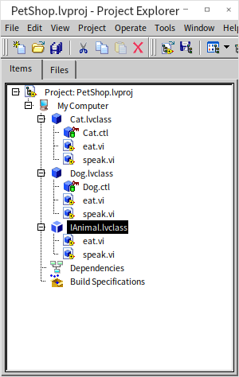
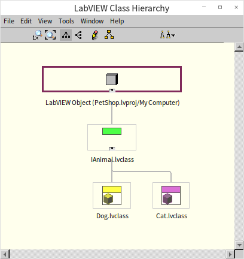
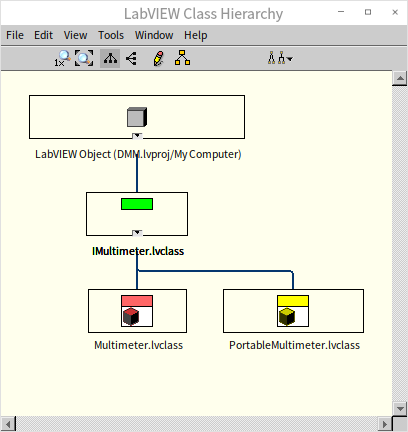
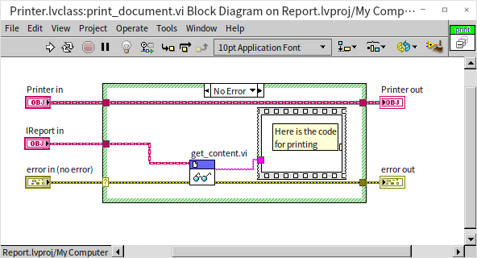
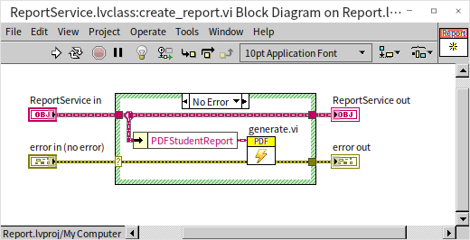
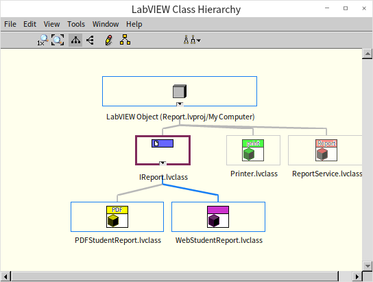

# OOP Design Methods and Principles

In our previous discussions on object-oriented programming (OOP), we focused on the implementation details: how to define classes, write VIs, and implement properties and methods. In this section, we shift our focus to **software design**: how to identify which classes are needed for a given problem and how they should interact.

OOP is fundamentally built for large-scale software. For small, disposable utility programs, applying strict OOP design principles is often over-engineered. If a program is only run once to parse a specific log file and then discarded, spending hours designing class interfaces is a waste of time. If requirements change, rewriting a small script from scratch is trivial.

The math changes completely for enterprise-scale software. Large software systems represent a significant investment in time and budget. When new hardware models, test profiles, or formats are introduced, you cannot simply throw away the software and rewrite it. Instead, you must patch, refactor, and extend the existing codebase.

Therefore, when designing large applications, you must anticipate future changes:
- **Pet Store System:** You might need to add new animal species with unique behaviors.
- **Reporting Module:** You will likely need to support new report formats (PDF, HTML, XML) or delivery methods (email, print, cloud upload).
- **Test Executive:** You will definitely need to support new test instruments, product models, or limits.

If you don't design for extensibility upfront, maintaining and expanding the software later becomes incredibly difficult. The goal of OOP design is to build a system that is both **flexible** and **stable**:
- **Flexibility:** The ease of adding new features.
- **Stability:** The ability to add those features without modifying or breaking existing, working code.

We previously covered the three pillars of OOP: **Encapsulation**, **Inheritance**, and **Polymorphism**. These are the tools we use to model classes. In this chapter, we will look at how classes relate to one another (dependencies, composition, aggregation) and explore the **SOLID Principles**—five foundational guidelines for object-oriented design proposed by Robert C. Martin (Uncle Bob):

- **S:** Single Responsibility Principle (SRP)
- **O:** Open/Closed Principle (OCP)
- **L:** Liskov Substitution Principle (LSP)
- **I:** Interface Segregation Principle (ISP)
- **D:** Dependency Inversion Principle (DIP)

While they form the acronym SOLID, we will explain them starting from the most fundamental concepts to make learning intuitive.

## Abstraction

**Abstraction** is the process of identifying common characteristics across a group of specific entities and modeling them as a generalized concept. Modeling different dogs as a generic `Dog` class is an example of data abstraction.

In software design, we take this further: we extract shared behaviors from different classes to define a unified **Interface**. This interface declares *what* behaviors are supported without specifying *how* they are implemented. Abstraction hides internal complexity, highlights core capabilities, and prevents code duplication.

Suppose we are designing a pet store system containing cats and dogs. While they are different animals, they all have a name, eat food, and make sounds. We can abstract these shared traits into an `IAnimal` interface:

The `IAnimal` interface defines three method signatures: `set_name.vi`, `eat.vi`, and `speak.vi` without implementing any code. We then build concrete classes (`Cat`, `Dog`) that implement this interface. The project hierarchy looks like this:

Each concrete class provides its own specific implementation of `speak.vi`. With this design, if we want to add a `Bird` class, we just implement `IAnimal` without modifying the core pet store management logic.

Similarly, when designing a student report system, you should abstract the capability of being printed or emailed. In a test executive, you should abstract shared measurement capabilities across different instruments.

## Liskov Substitution Principle

The **Liskov Substitution Principle (LSP)** states that **subtypes must be substitutable for their base types without altering the correctness of the program.**

In other words, if a program expects an instance of a parent class, you should be able to pass any of its subclasses to it without breaking the application. If a subclass violates LSP, the caller can no longer rely on the parent class interface, destroying polymorphism and increasing testing and maintenance costs.

Consider a test sequence that uses a standard multimeter class (`Multimeter`). Suppose we have a portable multimeter that has similar measurement functions but lower accuracy, and we decide to inherit it as `PortableMultimeter`.

In everyday logic, a portable multimeter is a multimeter, so inheritance seems correct. However, in software, if the main test sequence expects a highly accurate `Multimeter` and we wire a `PortableMultimeter` instance instead, the sequence may fail because of the low accuracy. This violates LSP because substituting the subclass changes the correctness of the program.

To comply with LSP, we should decouple the two classes. Instead of making `PortableMultimeter` a subclass of `Multimeter`, we can define generic voltage and current measurement interfaces (`IVoltageMeasurable` and `ICurrentMeasurable`):

Both multimeters implement these interfaces independently as sibling classes. The test sequence then programs against `IVoltageMeasurable`, ensuring that the accuracy requirements are explicitly handled, rather than assuming any multimeter is compatible.

Let's look at another classic LSP violation in hardware control:
Suppose we have a parent class `Instrument` with methods `Initialize.vi` and `Start_Measurement.vi`. We write a subclass `Laser_Controller` that inherits from `Instrument`. However, for safety reasons, the laser hardware requires an operator to physically press a safety button on the physical instrument panel before a measurement starts. If the button is not pressed, calling `Start_Measurement.vi` triggers a safety warning dialog and aborts the test.

This design violates LSP. The main test program expects a generic `Instrument` that can initialize and immediately start a measurement programmatically. When we substitute the laser controller, this contract is broken, causing the automation sequence to fail.

To respect LSP, a subclass overriding a parent method **cannot strengthen preconditions** (it cannot demand more restrictive environment conditions than the parent) and **cannot weaken postconditions** (it must fulfill all promises made by the parent interface and cannot throw unexpected errors).

## Dependency Relationships

A **Dependency** is a loose connection where one class utilizes instances of another class inside its methods. Unlike composition or aggregation, a dependency is transient and does not link the lifecycles of the two objects.

For example, suppose a `Printer` class prints reports represented by an `IReport` interface. The `Printer` class depends on the `IReport` interface because it needs an `IReport` object to run its printing logic:

Inside `print_document.vi`, the `IReport` object is passed in as a parameter. The printer reads the report content and sends it to the hardware. The `Printer` does not own the `IReport` object, and the report object lives independently of the printer. The relationship only exists during the execution of this VI.

## Dependency Inversion Principle

The **Dependency Inversion Principle (DIP)** states:
1. **High-level modules should not depend on low-level modules. Both should depend on abstractions.**
2. **Abstractions should not depend on details. Details should depend on abstractions.**

In traditional procedural design, top-level VIs depend directly on concrete low-level drivers. DIP inverts this relationship. Rather than coding against concrete classes, you code against interfaces.

DIP is the foundation of decoupled architectures. It ensures that changes in low-level drivers or modules do not cascade up to break the high-level application logic.

Let's look at a report generator:
Suppose we have a `ReportService` class that directly calls a concrete `PDFStudentReport` class to generate reports. Here is the block diagram of `create_report.vi` in `ReportService`:

The `create_report.vi` directly instantiates `PDFStudentReport` and calls its methods.

If the customer now asks for HTML web reports, we have to open `ReportService.vi` and modify its diagram to swap `PDFStudentReport` with `WebStudentReport`.

To apply DIP, we define an abstract `IReport` interface. Both `PDFStudentReport` and `WebStudentReport` implement `IReport`. We then configure the private data of `ReportService` (its `.ctl` cluster) to store an `IReport` interface wire instead of a concrete class wire:

At runtime, the main application injects the concrete report instance (PDF or Web) into `ReportService` (often called **Dependency Injection**). If we need to add an XML report format in the future, we can write the new class and implement `IReport` without modifying a single wire inside `ReportService`.

## Single Responsibility Principle

The **Single Responsibility Principle (SRP)** states that **a class should have one, and only one, reason to change.**

In other words, a class should be responsible for a single area of functionality. If a class has multiple responsibilities, it becomes tightly coupled and fragile.

Suppose we are managing student data. We need to load student records from a database and print them as formatted reports. One design approach is to build a single `Student` class that handles both:
1. Connecting to the database to read/write records.
2. Generating and printing the formatted student report.

This design violates SRP. There are two distinct reasons to modify this class:
1. The database schema changes (data management change).
2. The print template changes (presentation change).

If the DBA updates the database layout, we have to modify the `Student` class, which risks breaking the report rendering code. A design following SRP separates these concerns: a `Student` class to manage database queries and state, and a `StudentReport` class to handle formatting.

Let's look at a test executive example:
Suppose we write a `TestManager` class that controls a multimeter to read voltages, writes those readings to a SQL database, and plots the values on a UI graph.

This class violates SRP because it has three reasons to change:
1. The multimeter hardware is replaced with a different model (instrument driver change).
2. The database schema is updated (database logger change).
3. The customer requests a bar chart instead of a line graph (UI visualization change).

To follow SRP, we split this class into three separate classes: `DMM_Driver` (hardware), `Database_Logger` (storage), and `UI_Controller` (visualization).

Adhering to SRP yields key benefits:
- **Clean Collaboration:** In team environments, different developers can work on hardware drivers and UI layouts simultaneously without merge conflicts in the same class file.
- **Explicit Version Control:** Class file updates align directly with specific functional changes, making git history easy to audit.

## Interface Segregation Principle

The **Interface Segregation Principle (ISP)** states that **clients should not be forced to depend on methods they do not use.**

When an interface is too bloated, implementing classes are forced to write empty or dummy overrides for methods they don't need. ISP encourages designing small, highly focused interfaces rather than a single massive interface.

In our student report system, suppose we define an `IStudentReport` interface with three methods: `Generate_Report.vi`, `Email_Report.vi`, and `Print_Report.vi`. Our concrete `PDFStudentReport` class implements this interface and overrides all three.

Now, we receive a requirement to support web reports. We create a `WebStudentReport` class. Web reports are displayed in a browser and can be emailed, but they cannot be printed directly to a physical printer. Because `WebStudentReport` implements `IStudentReport`, it is forced to implement a dummy `Print_Report.vi` that it doesn't need. This violates ISP.

To satisfy ISP, we split `IStudentReport` into three focused interfaces: `IReportGeneratable`, `IReportEmailable`, and `IReportPrintable`.
- `PDFStudentReport` implements all three interfaces.
- `WebStudentReport` implements only `IReportGeneratable` and `IReportEmailable`.

By splitting the interfaces, `WebStudentReport` is no longer burdened with implementing unused methods.

When designing instrument drivers, instead of creating a massive `IMultimeter` interface, it is often better to split it into specialized interfaces like `IDcVoltageMeasurable`, `IAcVoltageMeasurable`, and `IDcCurrentMeasurable`. This keeps the API clean and flexible.

## Association

An **Association** defines a relationship between objects of two classes. Associations can be:
- **Directional:** One-way (Class A knows about Class B, but B doesn't know about A) or two-way (both classes know about each other).
- **Multiplicity:** One-to-one, one-to-many, or many-to-many.

For example, in a school management system:
- A `Teacher` teaches multiple `Student` objects.
- A `Student` is taught by multiple `Teacher` objects.

This is a bidirectional, many-to-many association.

*(Note: Detailed G block diagrams demonstrating Association will be added in future revisions.)*

In G, to establish this bidirectional association, the `Teacher` class stores an array of `Student` objects (or references) inside its private data cluster, and the `Student` class stores an array of `Teacher` references. Helper methods like `add_student.vi` manage the array insertions to keep the relationship in sync.

## Composition

**Composition** represents a strong "whole-part" relationship. The parent object (the whole) owns the child objects (the parts), and the lifecycles of the parts are tightly bound to the whole: when the parent is created or destroyed, the parts are created or destroyed with it.

Composition is a powerful alternative to inheritance (often described as "favoring composition over inheritance"). It allows building complex systems by nesting simpler components.

For example, a `Dog` is composed of a `Head`, a `Body`, and `Legs`. A dog does not inherit from a leg; rather, it *has* legs.
- **Component Classes:** We define separate classes for `Head`, `Body`, `Leg`, and `Joint`.

  *(Note: Detailed G code diagrams of body components will be added in future revisions.)*

- **Dog Class:** The private data cluster (`Dog.ctl`) of the `Dog` class contains four `Leg` objects and one `Head` object:

  *(Note: Dog data cluster configuration will be added in future revisions.)*

- **Execution:** To make the dog walk, the `Dog:walk.vi` method loops through the leg instances and calls `Leg:move.vi`:

  *(Note: Walk method block diagram will be added in future revisions.)*

In LabVIEW, implementing **Composition** is straightforward: you open the private data cluster of the parent class (e.g., `Car.ctl`) and drop the component class constant (e.g., `Engine.lvclass`) directly into it. When a `Car` object flows along a wire or is cleared from memory, the nested `Engine` instance is created and destroyed in lockstep.

## Aggregation

**Aggregation** represents a weaker "whole-part" relationship characterized by an "ownership" dynamic where the parts can exist independently of the whole. The parent object does not manage the lifecycle of the child objects.

The key difference between composition and aggregation is **lifecycle ownership**:
- **Composition (Strong):** If the dog dies, its tail is destroyed with it. The tail has no meaning outside the dog.
- **Aggregation (Weak):** A `Classroom` contains multiple `Student` objects. If the classroom is closed, the students continue to exist. The students can be moved to a different classroom.

In LabVIEW, implementing **Aggregation** requires care. Because G is a dataflow language that passes objects by value, dropping a `Student` object array directly into `Classroom.ctl` would copy the student data. If a student's grade is updated elsewhere, the copy inside the classroom would become stale. Furthermore, destroying the classroom wire would destroy the student data.

To implement Aggregation in G:
1. Do **not** place concrete child objects directly inside the parent's data cluster.
2. Instead, store an array of **Data Value References (DVRs)** pointing to the child objects, or store an array of **Unique ID Strings** pointing to a global object manager that manages the lifecycles of the child instances.

This allows the classroom to refer to the students without owning their memory space, permitting the student objects to live independently.

## Open/Closed Principle

The **Open/Closed Principle (OCP)** states that **software entities (classes, modules, VIs) should be open for extension, but closed for modification.**

This means you should be able to add new features to a system without editing existing, working source code files. Modifying tested code introduces the risk of regression bugs, so we should keep existing classes sealed.

OCP is the ultimate goal of object-oriented design. The other SOLID principles (SRP, LSP, ISP, DIP) and techniques like composition and abstraction serve to support OCP.

Let's look at report formatting again:
Suppose we have a `StudentReport` class that formats and prints student grades.

*(Note: Original source code representation will be added in future revisions.)*

Now, we receive a requirement to print reports in a custom dictionary format. If we directly modify `StudentReport.vi` to add a Case Structure for the new format:

*(Note: Direct modification code will be added in future revisions.)*

This approach violates OCP. Every time a customer requests a new report format, we must modify the `StudentReport` class, risking bugs in existing formats.

To satisfy OCP, we introduce an abstract `ReportGenerator` interface. Each format is implemented as a separate class that inherits from `ReportGenerator`:

- `PDFGenerator` class implements `ReportGenerator`.
- `HTMLGenerator` class implements `ReportGenerator`.
- `DictGenerator` class implements `ReportGenerator`.

*(Note: Abstract interface definition will be added in future revisions.)*

Our report engine class now accepts a `ReportGenerator` interface wire:

*(Note: Decoupled generator implementation will be added in future revisions.)*

When the user wants to switch formats, they simply wire a different generator subclass to the engine:

*(Note: Client configuration code will be added in future revisions.)*

Adding a new XML format is now simple: we create a new `XMLGenerator` class and implement the interface. The existing classes remain completely untouched, satisfying the Open/Closed Principle.