# 应用实例

## 管理一个类的多个对象

这是最常见的面向对象编程的应用。在程序里经常会出现需要管理多个同类型对象的情况。比如一个测试程序，可能会使用到同类型的多台仪器。那就可以把这个型号的仪器定义为一个类，每台仪器就是这个类的一个对象；它每次采集到的数据也是相同类型的，也可以把数据的模型定义成一个类，每次采集的数据是一个实例；数据需要保存在格式相同的文件中，所以可以把这种格式的文件定义为一个类，每个文件就是一个实例。

比如一个简单测试程序，需要把所有的测试数据保存在统一格式的文件中。在应用程序中需要管理多个格式相同的文件，所以可以为这种类型的文件编写一个类。

这个文件中保存有实验名称、实验时间和实验数据。因此，类的数据中应当包含这些信息（图
13.11）。

图 .11 类的数据

这些数据是不能直接被应用程序读写的，所以还要为它们创建读写方法。使用右键菜单 "新建" 中的 "用于数据成员访问的 VI"，就可以直接创建出这些属性读写方法。

除了属性读写方法，数据文件还常常会用到以下几个方法：打开、创建、保存等。因此，这个数据文件类中也实现了这些方法。

"打开" 方法用于从文件中读出数据，保存在类的数据中（图 13.12）。

图 .12 数据文件类的打开方法

"保存" 方法与 "打开" 方法是相反的过程。把类中的数据存入文件（图 13.13）。

图 .13 数据文件类的保存方法

"创建" 方法用于创建一个空的数据文件对象。为了演示方便，程序中还为这个数据文件类添加了一个 "清空" 方法，用于清空类中的所有数据。设计好的类结构如图
13.14 所示。

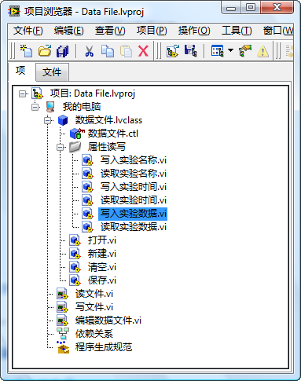

图 .14 数据文件类

图
13.15 是使用这个类的一段演示程序，倘若需要应用到多个数据文件，程序可以在一开始就为每个文件生成一个对象。之后的程序中，就可以使用类的方法，对这些对象进行操作。使用类的方法时，和使用普通 VI 是一样的，把它们拖到程序框图上即可使用。

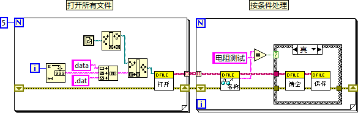

图 .15 在应用程序中使用类

另外再举一个例子，笔者曾经在一个演示项目中使用到了一块某公司产的数据采集卡。为了编程方便，为它写了一套基于类的驱动程序。其总体结构如图
13.16 所示。

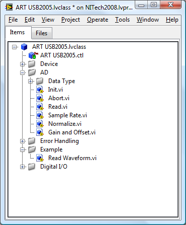

图 .16 基于类的硬件驱动程序

这个驱动程序的思路是，把所有这块硬件的设置参数（如：采样率、放大倍数等）作为类的数据（图
13.17），而用户可以调用的硬件的功能（如：初始化、读数据等）则作为类的方法。类中某些 VI 仅作为其它 VI 的子 VI，不能给用户使用的，只要设为私有，就可以了。

图 .17 硬件驱动程序类中的数据

图
13.18 是使用这一驱动程序的一个示例程序。例子只演示了使用一块硬件卡的情况，如果程序需要用到多块相同的硬件卡，只要用 "Open" 方法打开多个驱动程序类的对象就可以了。

图 .18 使用基于面向对象的驱动程序

## 同一段代码处理多种数据类型

虽然管理多个对象是最典型的类的使用方法，但是读者可能会发现，在前面提到的这两个例子中，类并不是必需的。完全可以使用簇和 LabVIEW 的库达到同样的效果：簇用来保存原来类中的数据，而原本类的方法都做成库中的 VI 就可以了。

LabVIEW 中的类可以涵盖簇的功能，这就如同 C++ 中的类和结构有时也可通用一样。不过，使用簇加库的方式，只能实现对模块的封装，类的另外两大特性：继承和多态是没法实现的。所以类的一些更为复杂的应用，就不可能使用簇来替代了。

如果使用簇加库的方式，那么应用程序的一份代码，只能处理一种数据类型。比如，图
13.15 中的示例程序，只是处理了一种格式的文件。如果使用簇来记录所有数据文件的内容也是可以的。但是，如果程序中需要使用几种不同格式的文件，即表示它们的簇的内容不同，是属于不同的数据类型的簇。一个子 VI 的某个参数必须是固定的，换成另外一种数据类型就不能接受了。所以若需要处理两种以上的数据类型，即便所做的工作是相同的，也必须编写两套 VI。

但是，如果某个 VI 属于类的子 VI，那么，尽管每个子类的数据类型不同，它就可以处理这个类的所有子类。这样，在应用程序中，只需编写一段代码，就可以处理多种不同类型的数据，势必会大大提高编程效率。

以一个最简单的应用为例。一个程序需要处理两种类型的数据：一个数值型，一个簇型。程序的功能是把两种类型的数据中的数值都加 1。

作为演示，这个程序的代码极为简单，实际上只是调用了一个子 VI。但是这个子 VI 却可以处理两种不同类型的数据（图
13.19）。

图 .19 同一方法处可以处理不同数据类型

实现这一功能的方法是，把程序中使用到的两种数据类型 "数值" 和 "簇" 装箱成类。（换句话说，就是创建两个类，这两个类中的数据分别是数值类型的数据，和簇类型的数据。）再创建一个数据为空的基本类做为它们共同的父类（图
13.20）。而程序中所用到的算法，都在这个父类中实现。父类的方法是可以直接被子类使用的，每个子类数据类型不同，这样父类的算法就可以应用于多种不同的数据类型了。

图 .20 处理不同数据类型的类的结构

多态 VI 也可以实现类似的功能，即根据不同类型的输入数据，选择不同的实例 VI 来处理这个数据。但是使用多态 VI 时，程序没有办法把各种不同的类型的输入数据放置在同一数据结构（比如数组）中进行存储和传递。换言之，多态 VI 是在编程时就根据输入数据类型的不同，为其选择了不同的实例 VI 进行处理。实例 VI 一旦选定，在程序运行过程中就不能改变了。而面向对象的编程方法则可以做到在程序运行时，用相同的方法把所有数据传给了某个子 VI 后，这个子 VI 仍然可以根据输入数据类型的不同为其分配不同的处理方法。比如，为了简化应用程序代码，在处理图
13.19 中的程序时，往往使用循环结构，来减少对 "加 1.vi" 子 VI 的调用次数。如图
13.21 所示。

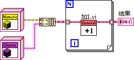

图 .21 把不同类型的数据放在同一数据结构中

算法应该是与数据类型无关的。比如，一个排序算法既可以给数值类型的数据排序，又可以给字符串类型的数据排序。在编程实现一个算法时，也应该做到这一点。编写好一段某种算法的程序，它就应该可以方便地适用于各种类型的数据，而不必针对每种不同类型的数据再重新实现算法。

## 框架插件程序架构

本书在[装载和运行子 VI](vi_server_for_subvi) 一节中介绍了利用动态调用实现 "框架 - 插件" 式程序结构的编程方法。使用类也可以达到同样的效果，并且可以简化代码，并提高程序效率。

比如，某一应用程序需要把所有放在相对路径“Plugin/”下的任务都运行一遍。这就可以使用 "框架 - 插件" 式程序结构。界面及任务调度等是主程序，也就是框架；被执行的每一个任务是一个插件。编写框架程序时，有多少个插件是不确定的，每次框架程序运行起来之后，再检查“Plugin/”文件夹，凡是里面合乎定义的文件都是一个插件。

使用类来编写这种模式的程序，需要为所有的插件设计一个统一的接口。这个接口定义了了框架可以调用插件的所有方法，以及这些方法 VI 中的连线板模式和参数类型。接口方法 VI 可以有多个。

在演示程序中，每个插件只有一个接口方法，叫做 "execute.vi"。调用这个 VI 时，程序弹出一个对话框，上面标志着这个插件的名字。所以，在插件接口 “PluginInterface.lvclass” 只需要创建一个动态分配模板的方法。这个 VI 除了类输入 / 输出和错误输入 / 输出之外，不需要额外的参数。

程序中的每个插件，是一个类。它们都必须实现插件接口 “PluginInterface.lvclass”。每个类都需要重写接口中定义的方法，在这个例子中就是 "execute.vi"。每个任务所完成的具体工作都在这个 "execute.vi" 中完成。

实现好的项目结构如下图所示： “PluginInterface.lvclass” 是插件接口； “Task1” 和 “Task2” 是插件类。它们有统一的接口方法。

下图是其中一个任务的接口方法的实现代码，在演示程序中它只是弹出一个对话框，显示这是 Task1。

框架程序的实现方法如下图所示。它的前半部分与使用动态 VI 编写框架程序的方法是一样的：在固定的文件夹下，找到所有符合插件定义的文件。

程序后半部分有所不同。框架程序首先调用 "编程 -\> 簇、类与变体 -\> 获取 LV 类默认值"VI （Get LV Class Default Value.vi），这个 VI 可以为一个类或接口文件创建一个采用默认值的对象。由于这个 VI 可以应用在所有类上，所以它输出的类是所有 LabVIEW 类共同的祖先类 "LabVIEW 对象"。而需要调用的是插件接口中的方法，所以，接下来需要使用 "编程 -\> 簇、类与变体 -\> 转换为特定的类" 函数，把 LabVIEW 对象类型转为更为特殊化的 “PluginInterface.lvclass” 接口。之后调用这个接口的 "execute.vi" 方法。

由于类有多态性，虽然程序框图上只是调用了插件接口类的 "execute" 方法，但程序实际上调用的是每个插件的特定类的执行方法。这样，执行这个演示程序，程序会顺序弹出 “Task1” 和 “Task2” 等信息。

使用类来实现框架插件结构的程序，比使用动态调用 VI 方法实现相同的结构要更为简单高效。

下面比较一下这两种方法各自的优缺点。

|             | 动态调用 VI                               | LvClass     |
|---------|------------------------|-----------------------------------------------------------------------------|
| LabVIEW 版本 | LabVIEW 很早的版本就具备了动态调用 VI 的功能。| LabVIEW 8.2 开始才支持面向对象的程序设计。   |
| 开发的难度  | 相对来说比较直观易懂。 | 对于已经了解了 LabVIEW 面向对象编程的用户来说，做一个插件也是比较简单的。但是如果完全没接触过面向对象这个概念，还需要预先学习面向对象编程。      |
| 插件的形式  | 插件是一个单独的 VI，插件所有的功能都必须在这个 VI 中实现。 | 插件是一个对象（类的实例）。插件对象可以拥有多个方法。一个新的插件被添加进来后，它的所有方法可以自动应用于框架程序中任何调用了插件方法的地方。 |
| 总结    | 适合简单程序       | 适合大型程序     |

表 13.1 动态调用 VI 与 LvClass 实现框架插件程序架构的比较

## 简单列表（List）数据结构

很长一段时间内 LabVIEW 自带的数据结构只有数组（Array）和队列（Queue），直到 2019 年才又增加了映射（Map）和集合（Set）。多数情况下，这几种数据结构足够开发者使用了。但是，程序员有时也会希望使用其它一些数据结构，比如列表（List）、树（Tree）等。这些数据结构在主流编程语言中都是非常常见的。在 LabVIEW 中也可以编程实现这些数据结构。一个比较直观易懂的编程方法是基于 LabVIEW 中的类和引用来实现各类数据结构。

在 C++，C#，Java 等语言中还常常会遇到数据容器这一个概念。数据结构和数据容器是十分相似的概念：数据结构侧重于数据的存储方式，比如按何种顺序存储数据；数据结构再加上与此结构相关的操作方法，比如添加删除数据等方法，就构成了一个数据容器。脱离了操作方法，单纯的数据结构用处非常有限。因此，本书在提到数据结构或者数据容器时，指的都是同一回事：数据结构和相关的方法。

这一节，我们讨论一下如何在 LabVIEW 中实现一个简单的列表数据结构。提到列表，有其它编程语言经验的读者的头脑里可能已经浮现出下面这样一幅图片了：

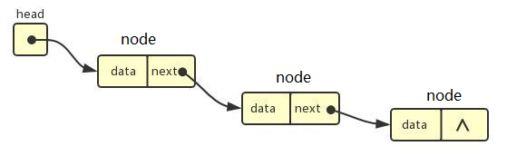

上图展示的是单向链表的结构。链表（Linked List）是一种最具代表性的列表（List），以至于很多时候，提起 List，大家脑海里直接就会出现 Linked List。

链表由多个节点（Node）组成，每个节点保存一个或一组数据。节点中除了数据之外，还要使用一个指针（Pointer）或者引用（Reference），用来指向下一个节点。通过这种方式，数据被像链条一样，连成了一串，这也是链表这个名称的由来。链表常常被拿来和数组做比较。数组中的每个数据是按顺序一个一个排列在一起的。两者相比较，数组的优势在于按位置查询，因为数组的数据都是安顺排列的，我们可以直接就找到第n个数据；但是数组的插入删除效率较差，这是因为每插入一个新数据，或删除一个数据，这个数据之后的所有数据都必须被调整，它们需要换个位置才能保证整个数组的数据依然是按顺序排列好的。链表的插入删除则不影响其它数据，假设链表中有两个节点：Node A 和 Node B。Node A 中有个引用，指向了 Node B。当我们需要在 Node A 和 Node B 之间插入一个新的数据 Node C 时，我们仅仅需要改变 Node A 中的引用，让它指向 Node C，再设置 Node C 中的引用，让它指向 Node B，这样，新的数据 C 就被插在 Node A 和 Node B 之间了。

当然列表不仅仅只有链表这一种实现方法。比如，在某些纯函数式编程（Functional Programming）语言中，可以通过函数调用来构建列表。LabVIEW 中，可以使用数据的引用来实现一个链表。如果不使用引用，单纯利用 LabVIEW 中的类，实现链表会比较繁琐，但仍可以相对简介的实现其它一些形式的列表。

假如，我们创建一个类，类中的一个成员变量保存了这个类的另一个对象，这样就可构造出一系列的数据嵌套关系，这也就相当于为一组数据构建了一个可以逐一添加或查询的列表。它的逻辑结构如下图所示：

直觉告诉我们，要用程序实现上图中的结构，我们应该创建一个“列表”类，它有两个成员变量，一个用于存储目标数据，另一个成员变量的数据类型就是这个列表类本身，用于存储下个节点。这样的设计在大多数语言中都没有问题，但在 LabVIEW 中却行不通。在其它编程语言中，程序运行时，才会对类的对象进行初始化。而 LabVIEW 中，VI 一打开，它的控件和常量就需要被初始化了。某个对象在初始化时，它的成员变量也要被初始化，若它的成员变量的类型还是这个类，这个初始化的过程就陷入了死锁：类需要它的成员变量先初始化；它的成员变量需要这个类先初始化…… 

基于同样的原因，一个类的成员变量的数据类型也不可以是这个类的子类：子类初始化需要先对它的父类进行初始化。类的成员变量的数据类型也不能是这个类的引用类型，或者是这个类的子类的引用类型。因此，当一个类的成员变量的类型需要是这个类本身时，在 LabVIEW 中需要借助于一个父类或者父接口来辅助实现。一个类的成员变量的数据类型可以是这个类的父类（或接口），因为父类在初始化的时候，不依赖于子类的初始化；而子类的对象又可以被当做父类的类型来保存。我们可以利用这一特性在 LabVIEW 中实现数据结构的节点：只不过在 LabVIEW 实现列表的节点要多一个步骤，需要为节点类再定义一个父类，这个父类不做任何实质性的工作，但我们需要这个数据类型来保存下一个节点的数据。

所以，在实现这个列表时，首先创建一个空的类（Node.lvclass）作为列表中每个节点的父类。再创建一个它的子类：列表类（List.lvclass）。在这个简化的演示程序中，列表类既是列表数据结构的类型，也是列表中每个节点的类型。在程序中使用链表的第一个节点来表示整个列表数据结构，如下图所示

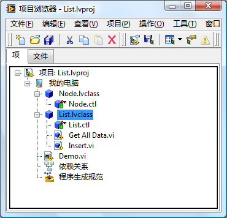

在这里，列表中每个节点都是一个 List.lvclass 的对象。每个节点它包含连个成员变量：一个用于存储目标数据，在此演示中，我们使用了一个双精度实数作为数据；另一变量的类型为 Node.lvclass ，用于保存下一个节点。

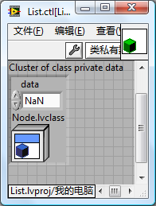

List 类实现了列表数据结构两个最简单的方法。Insert 方法用于在列表头部插入一个新节点。它的实现方法如下图所示：

首先创建一个新的 List 对象，把要插入的数据赋给它。它的下一个节点是原来列表的头节点，然后再把当前这个节点，作为列表新的头节点。

Get All Data 方法用于返回容器中所有的数据它的实现方法如下图所示：

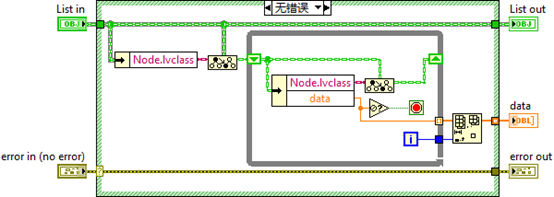

首先得到列表头节点的数据，返回出来；再得到下一个节点，返回其数据；再得到再下一个节点的数据…直到得到的数据是一个 NaN 类型，表示到了最后一个节点为止。

下图是应用这个列表的一个示例：首先创建一个列表对象，然后插入一些数据，再从列表中取出所有数据。

虽然在这个简单列表的示例中，我们仅仅使用了 LabVIEW 推荐的值传递方式，但是，在某些情况下，传引用依然是必要的，否则程序会变得非常杂乱难懂。比如，当实现一个更加复杂的双向链表时，某个节点的前一个节点和后一个节点都需要指向当前的节点，也就是说，需要有方法在不同的地方找指向同一个数据，这种情况下，传引用是最好的解决方法。下面，我们就通过实现一个双向链表来演示一下如何在 LabVIEW 中使用类和引用实现复杂的数据结构。

## 双向链表 （Doubly Linked List 或 Double Linked List）

### 双向链表的结构

在双向链表中，每个节点都记录了上一个节点和下一个节点的位置。因此，在双向链表中，可以从一个节点直接跳转到它的上一个或下一个节点上去，也就是正向或反向遍历整个链表。如果链表的最后一个节点（尾节点）的下一个节点指向的是头结点；而头结点的前一个节点又指向了尾节点，那么这就构成了一个环状双向链表，如上图所示。单向链表也可以有环，而且也有可能一个链表，它的一些节点在环外，另一些节点构成环。在实际应用中，非环状的链表可能更为常见，我们示例中实现的也是一个非环状的链表。

这里插一个问题，请读者思考一下：如何使用非常有限的内存来判断一个长链表中是否存在环？

### 设计

与上一个简单链表示例不同，在这个示例中，我们需要在节点中使用引用类型，指向前一节点和后一节点。因此，双向链表中每个节点对象包含三个成员变量： data 用于保存目标数据，在此演示中，我们使用了一个双精度实数作为数据；previous 是指向前一节点的引用；next 是指向后一节点的引用。关于引用数据类型可以参考[传引用](pattern_pass_by_ref)一节。

我们给节点类命名为 DoublyNode.lvclass。上文提到过，DoublyNode 类中不能再使用 DoublyNode 的引用类型的数据做成员变量。因此，我们为 DoublyNode 类创建了一个接口 IDoublyNode。DoublyNode 类的数据 previous 和 next 都是 IDoublyNode 引用类型。

用于使用了引用，程序中就难免会涉及到大量创建和删除引用的操作。如果由上层程序来完成这些创建和删除引用操作，上层程序会变得非常繁琐和难以阅读，因此，我们在示例中又创建了一个类 Iterator.lvclass，专门封装了所有与节点引用相关的操作。 Iterator 类只有一个成员变量，是一个指向节点的引用。我们可以把一个 Iterator 对象就想象为一个指向链表中某个节点的引用，调用 Iterator 的 get_next 方法，就会得到一个新的 Iterator 对象指向下一个节点；调用 Iterator 的 get_previous 方法，就会得到一个新的 Iterator 对象指向上一个节点。

以上几个类都是用于操作节点的，链表作为一个整体，它的数据和方法（比如给链表添加数据、删除数据等操作）被封装在了 DoublyLinkedList.lvclass 中。前文提到过，应用程序应该尽量通过接口而不是类来调用功能模块，因此我们又设计了一个接口 IList，定义了链表中所有的方法。几个类的结构关系如下：

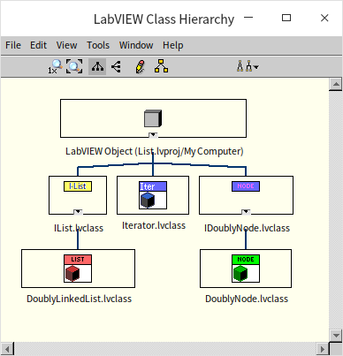

### IDoublyNode 接口和 DoublyNode 类

正如之前设计的那样，IDoublyNode 接口和 DoublyNode 类只用于定义链表节点的数据，下图是 DoublyNode 中的数据：

它们实现的方法也仅仅是用来直接读写 DoublyNode 的三个成员变量的： data ，previous 和 next。需要注意的是，LabVIEW 的类有一个安全选项：“只能在这个类的成员 VI 中创建或销毁这个类的数据引用”（Data Value Reference - Restrictions On New and Delete: Restrict references of this class type to member VIs of this class）。默认情况下，这个选项是被选中的。如果选中了，我们就只能在这个类的成员 VI 里为这个类的对象创建一个引用或者销毁一个这样的引用，在上层程序中是不能创建销毁的。而对于接口来说，这个选项被默认选中，而且无法改变。

我们需要用到指向 IDoublyNode 接口的引用，所以在 IDoublyNode 接口中添加了两个额外的函数： new.vi 和 delete.vi 用于创建和销毁 IDoublyNode 的引用。这两个 VI 的功能非常简单，仅仅就是包装一下“New Data Value Reference”和“Delete Data Value Reference”两个函数。

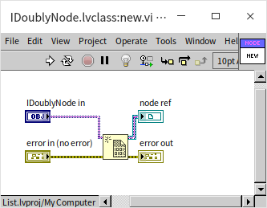 

在程序中如果使用了数据引用，就一定要记得：当不再需要这个引用时将它销毁。否则会引起程序的内存泄露，严重时可能会导致程序无法正常运行。

### Iterator 类

:::tip

Iterator 类演示了 LabVIEW 中一个改进程序程序可读性的技巧。 LabVIEW 最自然的编程方式是值传递，当使用引用时，会大大增加程序的复杂程度。我们可以把某类数据的所有与引用相关的操作都封装在一个类中。这样，上层的程序就可以通过调用这个封装好的类，像操作值传递数据那样方便的操作引用类型的数据。

:::

Iterator 类只有一个成员变量，是一个指向节点的引用。

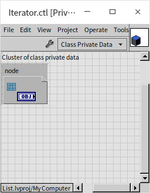

所有真正对链表节点的操作都被封装在了 Iterator 类中，比如，创建一个新的节点，得到下一个节点，读写节点的数据等。我们用 get_next.vi 方法为例，介绍一下 Iterator 类中的方法的工作方式。 get_next 用于得到当前节点的下一个节点，下图是它的程序框图：

程序首先通过输入的 Iterator 对象得到它包含的唯一的数据：一个指向 IDoublyNode 的引用。再通过元素同址操作结构得到引用指向的节点，再得到这个节点的下一个节点的引用。得到下个节点的引用之后，再包装成一个 Iterator 的对象。这也是为了上层程序可以只关注 Iterator，而不必再考虑更底层的 IDoublyNode 和 DoublyNode。

### IList 接口和 DoublyLinkedList 类

IList 接口定义了链表需要提供给上层程序调用的所有方法。DoublyLinkedList 类实现了这些方法。DoublyLinkedList 类有三个成员变量，其中两个是 Iterator 类型的对象，分别指向链表的头和尾：head 和 tail。当链表为空的时候，head 和 tail 包含的是无效引用。第三个成员变量是一个整数：length，表示链表的长度。

tail 和 length 并不是一个链表必要的属性，只要有链表头 head，我们总可以一个节点一个节点数下去，找到尾节点，算出链表的长度。但是这样做的效率比较低，如果应用程序会经常需要查询链表的尾节点和链表长度时，我们可以在链表类中维护一个尾节点变量和一个长度变量，提高查询它们的效率。

下面详细介绍一下链表中几个主要方法是如何实现的。

首先是 **add_head** 方法。调用这个方法会在链表头插入一个数据，因此这个方法有一个输入数据。

程序首先调用 Iterator 的方法，为输入的数据创建一个新的节点，在把新节点插入到链表头。如果链表是空链表（length==0），则新节点既是头结点也是尾结点，所以要把链表的头结点和尾结点都指向这个新的节点。如果链表不空，那么新的节点将会成为新的头结点，这个新的头结点的下一个节点是原来那个头节点；而原来那个头结点的上一个节点需要指向新的头结点。

无论链表原来是否为空，链表的长度在添加了新节点后，又要加一。

下面在看一个更通用的添加节点方法，**instert_before**。调用这个方法，会在指定的节点之前再插入一个新节点。所以这个方法的数据参数中除了目标数据，还包含一个参考节点。

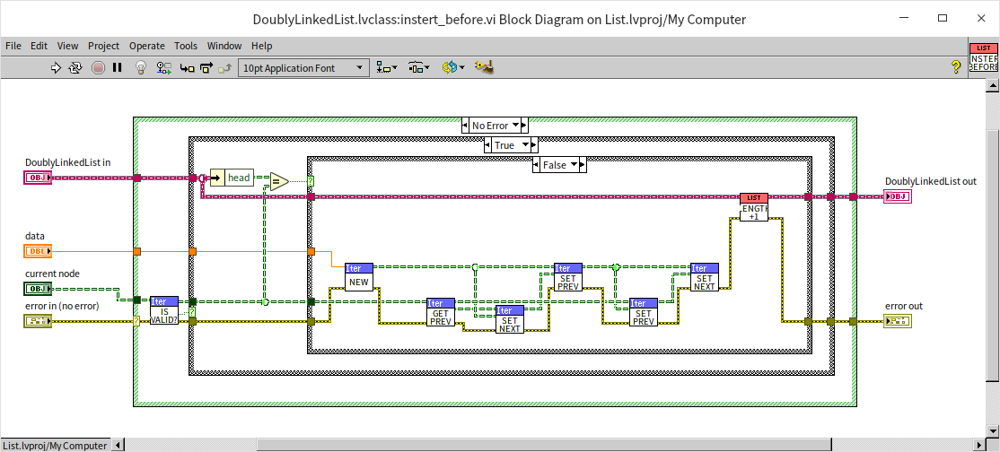

程序首先检查指定的节点是否有效，如果是无效节点则报错。如果节点有效，还要查看一下给定的节点是否是链表的头结点，如果是，则调用上面实现的 add_head 方法即可。如果参考节点不是链表的头结点，那么需要做下面的设置：
* 新节点的上一个节点是给定节点原本的上一个节点
* 新节点的下一个节点是给定的参考节点
* 给定参考节点的新上一个节点是新插入的节点
* 给定参考节点原本的上一个节点的下一个节点是新插入的节点

上面这个段说明比较绕口，看程序可能会更容易理解一些。

与添加节点对应的就是删除节点，**delete** 方法。调用这个方法，会把指定的节点从链表中删除。

程序首先检查指定的节点是否有效，如果是无效节点则报错。如果有效，就需要考虑一下这个节点是否是头结点，是否是尾节点，或者既是头结点也是尾结点。最简单的情况，给定的节点既是头结点也是尾结点，那么我们只需要把链表的头结点尾结点都设为默认值（无效引用），然后销毁指定的节点即可。如果给定的节点只是链表头节点，那么就需要把链表的头结点向下移动一个节点，然后销毁给定的节点。最复杂的情况是给定的节点是链表中间的一个节点，那么在销毁这个节点之前，我们需要把给定节点的前一个节点和后一个节点链接起来。

为了方便查看链表中的数据，DoublyLinkedList 类中还实现了一个 **to_array** 方法。调用这个方法时，程序会从链表头节点开始，依次向下遍历每个节点，同时读取每个节点中的数据，把它们以数组的方式返回出来。

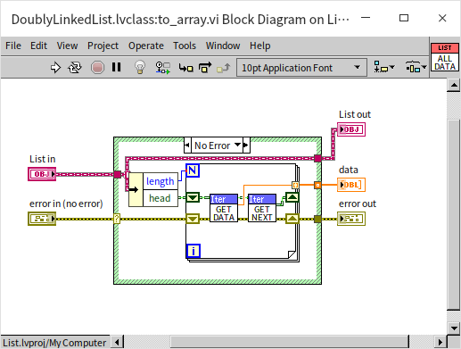

### 链表的使用

下面这个演示程序调用了链表接口的一些基本操作：

* 程序首先创建了一个空链表，这时候链表中的数据应为空
* 然后在链表头插入了一个数据：0.2，这时链表中的数据应为： 0.2
* 然后在链表头又插入了一个数据：1，这时链表中的数据应为： 1, 0.2
* 然后在链表头又插入了一个数据：2，这时链表中的数据应为： 2, 1, 0.2
* 然后程序读出了当前的链表头结点，这个节点中的数据应为： 2
* 然后程序在这个节点之前有插入了一个数据：4，这时链表中的数据应为： 4, 2, 1, 0.2
* 然后程序获取了刚才那个节点的下一个节点，也就是保存了数据 1 的那个节点。
* 然后程序在保存了数据 1 的那个节点之前又插入了一个数据：5，这时链表中的数据应为： 4, 2, 5, 1, 0.2。
* 然后程序删除了保存数据 1 的那个节点，这时链表中的数据应为： 4, 2, 5, 0.2。
* 然后程序删除了链表当前的头结点，这时链表中的数据应为： 2, 5, 0.2。

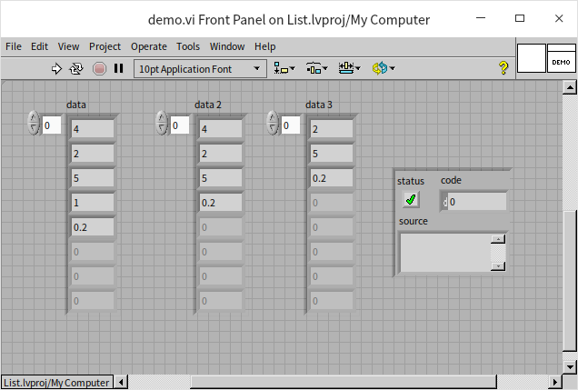

至此，一个比较完整的链表容器就已经完成了。但是这个链表容器还存在一个严重的缺陷，它只能保存数值类型的数据。我们会在[泛型编程](oop_generic)一节中介绍如何编写可以把同一算法应用与多种不同数据类型的 VI。
