# Application Example

## Managing Multiple Objects of a Single Class

This scenario is a quintessential application of object-oriented programming, where programs frequently need to handle multiple objects of the same type. For instance, a test program might involve using several instruments of the same model. Therefore, the instrument model could be defined as a class, with each instrument being an instance of this class. Similarly, since each batch of collected data is of the same type, it could also be modeled as a class, making each data collection an instance; data must be stored in uniformly formatted files, so this file format can be conceptualized as a class, with each file representing an instance.

Consider a straightforward test program required to store all test data in files of a uniform format. To manage multiple files of the same format within the application, one could create a class for this file type.

This file is meant to contain the experiment name, experiment time, and experiment data. Consequently, the class data should include these details:

Since these pieces of data cannot be directly accessed for reading or writing by the application, it's necessary to create methods for their reading and writing. By selecting "New -> VI for Data Member Access" from the right-click menu, these property read/write methods can be automatically generated.

In addition to property read/write methods, operations such as open, create, save, etc., are common necessities for data files. Thus, these methods have also been implemented within the data file class.

The "Open" method is designed to extract data from a file and store it within the class's data fields:

Conversely, the "Save" method performs the reverse operation of the "Open" method. It writes the data from the class into a file:

The "Create" method is designed to initiate a new, empty data file object. To facilitate demonstrations, a "Clear" method was also included in this data file class, enabling the erasure of all data within the class. The design of the class structure is illustrated in the following figure:

The next figure presents a portion of a demonstration program that employs this class. If the application necessitates the use of multiple data files, the program can instantiate an object for each file right at the start. Afterwards, these objects can be manipulated using the class's methods in the same way you would use any standard VI—simply by dragging them onto the block diagram of the program.

In one of my demonstration projects, I utilized a data acquisition card produced by a specific company. For programming convenience, I created a set of class-based driver programs for it. The overall structure of this driver program is shown below:

The driver program is structured such that all of the hardware's setting parameters (e.g., sampling rate, amplification factor, etc.) are encapsulated as class data. Meanwhile, the hardware functions that users can access (e.g., initialization, data reading, etc.) are implemented as class methods. Certain VIs within the class, intended solely for internal use as sub-VIs and not for direct user interaction, are set to private for security:

The image below demonstrates an application utilizing this driver program. This example only shows the use of one hardware card, but if the program requires multiple identical hardware cards, they can easily be managed by opening multiple instances of the driver program class object using the "Open" method.

## Utilizing the Same Code for Multiple Data Types

Though the most classic application of object-oriented programming involves managing multiple objects, the examples previously discussed don't absolutely require classes for implementation. Equivalent functionality could be achieved using clusters combined with LabVIEW libraries: clusters to hold the data originally contained within the class, with the class's methods converted into VIs within a library.

LabVIEW's classes can encompass the functionality of clusters, much like how classes and structures in C++ can sometimes serve interchangeable roles. However, the cluster-plus-library approach only facilitates modular encapsulation, lacking the capabilities for inheritance and polymorphism that classes provide. Thus, more complex uses of classes cannot be replicated with clusters.

Adopting clusters and libraries limits application code to processing a single data type. For instance, the example program in figure 13.15 handles only one file format. It's feasible to use clusters to document the contents of all data files. However, if the program needs to work with several distinct file formats, implying different cluster contents and data types, a sub-VI's parameter must be fixed, unable to accept different data types. Consequently, even for identical operations across more than two data types, separate VI sets are necessary.

Yet, if a VI is a sub-VI of a class, it can manage all the class's subclasses despite each having varied data types. Thus, a single code segment in the application can process numerous data types, significantly enhancing programming efficiency.

Consider a straightforward example where a program must handle two data types: numeric and cluster. The program's task is to increment the numeric value within both data types by 1.

As a demonstration, the program's code is exceedingly simple, essentially just invoking a sub-VI. Yet, this sub-VI is capable of processing two distinct data types:

The approach to achieve this functionality involves "boxing" the two data types used in the program—"numeric" and "cluster"—into classes. (In other words, create two classes whose data are respectively numeric-type data and cluster-type data.) Then, create a basic class with no data as their common parent:

The algorithm used in the program is implemented within this parent class. The parent class's method can be directly utilized by the subclasses, each of which has a different data type, allowing the parent class's algorithm to be applied to various data types.

Polymorphic VIs can also achieve a similar function, that is, choosing different instance VIs to process the data based on the type of input data. However, when using polymorphic VIs, there's no way to store and pass different types of input data within the same data structure (like an array). In other words, polymorphic VIs select different instance VIs for processing based on the type of input data at the time of programming. Once an instance VI is chosen, it cannot be changed during the program's execution. Object-oriented programming, however, allows for the same method to pass all data to a certain sub-VI, which can still allocate different processing methods depending on the input data type. For instance, to simplify application code when handling the example above, loops are often used to reduce the number of calls to the "Add 1.vi" sub-VI, as shown below:

Algorithms should be independent of data types. For example, a sorting algorithm can sort both numeric and string data types. When implementing an algorithm in programming, it should also achieve this independence. Once a piece of code for a particular algorithm is written, it should be easily applicable to different types of data without needing to reimplement the algorithm for each different data type.

## Framework-Plugin Program Architecture

This book has previously discussed leveraging dynamic invocation for a "framework-plugin" style program architecture in the section on [Loading and Running Sub-VIs](vi_server_for_subvi). Utilizing classes can achieve the same goals, but with the added benefits of code simplification and enhanced program efficiency.

Consider an application that needs to execute all tasks located within the "Plugin/" relative path. This scenario is ideally suited for a "framework-plugin" structure, where the framework consists of the main program, including the user interface and task scheduling, and each task executed acts as a plugin. When designing the framework, the exact number of plugins is unknown; they are identified upon the program's startup by scanning the "Plugin/" directory for files that match the defined criteria for plugins.

To implement this model using classes, a uniform interface for all plugins is necessary. This interface outlines all the methods the framework can invoke on the plugins, detailing the method VIs' connection panel patterns and parameter types. Multiple method VIs can be defined within the interface.

In the demo program, each plugin features a single interface method named "execute.vi". Invoking this VI triggers a dialog box to appear, displaying the plugin's name. Hence, in the "PluginInterface.lvclass" plugin interface, only one dynamic dispatch template method is required. Aside from class input/output and error input/output, no additional parameters are needed for this VI.

Each plugin within the application is represented by a class. These classes must implement the "PluginInterface.lvclass" plugin interface. They are required to override the methods defined within the interface, in this case, "execute.vi". The specific actions carried out by each "execute.vi" task are encapsulated within this VI.

The structured layout of the implemented project is depicted below: "PluginInterface.lvclass" serves as the plugin interface, with "Task1" and "Task2" functioning as plugin classes. They adhere to a standardized interface method.

Below is the implementation code for the interface method of one of the tasks, which in the demo simply displays a dialog box indicating it's Task1.

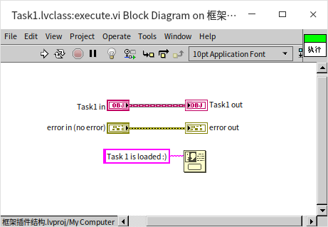

The framework program's implementation method is illustrated below. Its approach mirrors that used for framework programs involving dynamic VIs - identifying all files within a designated folder that qualify as plugins.

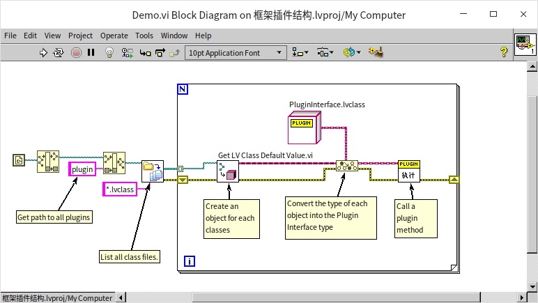

The latter part of the program differs significantly. Initially, the framework invokes the "Programming -> Cluster, Class & Variant -> Get LV Class Default Value" VI, which creates an object with default values for either a class or interface file. Since this VI applies universally across classes, it outputs an object of type "LabVIEW Object", the common ancestor to all LabVIEW classes. However, the intended method resides within the plugin interface, necessitating the next step: converting the LabVIEW Object type to the more specialized “PluginInterface.lvclass” interface using the "Programming -> Cluster, Class & Variant -> To More Specific Class" function. Following this conversion, the "execute.vi" method of this interface is called.

Thanks to class polymorphism, although the program diagram only appears to invoke the "execute" method of the plugin interface class, it actually executes the specific execute method of each plugin's unique class. Consequently, running this demonstration prompts sequential pop-ups with “Task1” and “Task2” information.

Leveraging classes to establish a framework-plugin architecture simplifies and enhances efficiency over the dynamic VI call method.

The table below outlines the strengths and weaknesses of these two approaches:

|               | Dynamic VI Call                   | LvClass                                        |
|---------------|-----------------------------------|------------------------------------------------|
| LabVIEW Version | Supports dynamic VI call from early versions. | Object-oriented programming has been supported since LabVIEW version 8.2.                 |
| Development Difficulty | Intuitively straightforward and easy to grasp.       | Creating a plugin is relatively straightforward for those versed in LabVIEW's object-oriented programming. However, for newcomers to object orientation, a learning curve exists. |
| Plugin Form   | The plugin is a standalone VI, requiring all functionalities to be encapsulated within it. | The plugin is an object (an instance of a class), allowing for multiple methods per plugin. New plugins can seamlessly integrate their methods into any part of the framework program that invokes these methods. |
| Summary      | Ideal for simpler programs                           | Better suited for complex, large-scale applications.                                      |

## Simplifying List Data Structures

For a significant period, LabVIEW natively supported only arrays and queues as its primary data structures, with Maps and Sets added only in 2019. These structures typically cover most developers' needs. However, there are occasions when other types of data structures, such as lists or trees, which are commonplace in many mainstream programming languages, might be desired. These can also be implemented in LabVIEW, employing a straightforward approach based on LabVIEW's classes and references.

In languages like C++, C#, and Java, you'll frequently encounter the concept of data containers. Data structures and data containers share similarities: data structures focus on the manner of data storage, such as the sequence in which data is stored. Adding operational methods to these data structures turns them into data containers. Without these operational methods, pure data structures are of limited utility. Thus, when discussing data structures or data containers here, we're referring to the same concept: data structures along with their associated methods.

This section will explore how to implement a simple list data structure within LabVIEW. For those familiar with other programming languages, mentioning a list might instantly bring to mind the image below:

The diagram above illustrates a singly linked list, a quintessential form of a List so much so that the term List often evokes the idea of a Linked List.

A linked list is composed of multiple nodes, each storing data or a group of data. Beyond the data, each node uses a pointer or reference to indicate the subsequent node. This method connects the data like a chain, thus the term linked list. Linked lists are frequently contrasted with arrays. In an array, each data piece is sequentially arranged side by side. Arrays excel in positional queries due to their sequential organization, allowing for direct access to the nth item. However, arrays are less efficient in insertions and deletions. Every time a new data item is inserted or removed, all subsequent items must be adjusted to maintain the sequence. In contrast, insertions and deletions in linked lists do not affect other data. For example, if a linked list has two nodes, Node A and Node B, with Node A referencing Node B, inserting a new Node C between Node A and Node B merely requires altering Node A's reference to point to Node C and adjusting Node C's reference to point to Node B. Thus, the new data C is seamlessly inserted between Node A and Node B.

While Linked Lists are often compared with arrays, their advantage lies in insertion and deletion efficiency. Unlike arrays, where these operations can shift the entire data structure, linked lists maintain a fluidity allowing for quick updates without impacting the entire structure.

Though linked lists are a classic way to implement lists, they're not the only method. For example, some functional programming languages build lists through recursive function calls. In LabVIEW, we can use data references to construct a linked list. While using references simplifies creating a linked list, implementing it purely with LabVIEW's class structures can be cumbersome. However, it's still relatively straightforward to implement other types of list structures without references.

Consider creating a class where one member variable holds another object of the same class. This setup constructs a series of nested data relationships, essentially forming a list that allows for incremental additions or searches. The logical structure of such a simple list is depicted in the following diagram:

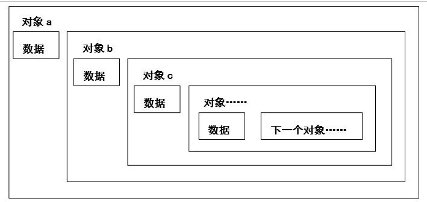

You might think to implement the structure shown above by creating a “List” class with two members: one to store the target data and another whose type is the list class itself, for storing the next node. While this design works in most programming languages, it encounters problems in LabVIEW. In other languages, class objects are initialized at runtime. However, in LabVIEW, the controls and constants of a VI require initialization as soon as the VI is opened. This creates a deadlock for self-referencing classes: the class needs its member variable initialized first, but that member variable also needs the class to initialize...

Likewise, a class’s member variable cannot be a subclass of itself, as initializing the subclass necessitates initializing the parent class first. Nor can the member variable's type be a reference to the class itself or its subclass. Therefore, when needing a class’s member variable to be of the class itself in LabVIEW, an auxiliary parent class or interface is necessary. A class’s member can be of its parent class (or interface) type because the parent’s initialization doesn’t depend on the child’s; moreover, a child object can be stored as its parent's type. This strategy allows for the implementation of data structure nodes in LabVIEW, albeit with the additional step of defining a parent class for the node class. This parent class serves no substantial function but is required for storing the data of the next node.

In this list implementation, start by creating an empty class (Node.lvclass) to act as the parent for each node in the list. Next, create a subclass: the List class (List.lvclass). In this simplified demonstration, the List class functions both as the type for the list data structure and as the type for each node within it. The first node of the list essentially represents the entire list data structure, as shown below:

In this scenario, each node in the list is an instance of the List.lvclass. Each node contains two member variables: one for storing the target data, in this case, a double-precision floating-point number; and another variable of type Node.lvclass, used to store the reference to the next node.

The List class implements two fundamental methods for the list data structure. The Insert method is for adding a new node at the beginning of the list. Its implementation is illustrated in the diagram below:

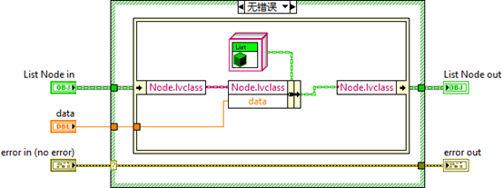

First, a new List object is created and assigned the data to be inserted. This object's next node is set as the original head node of the list, making this current node the new head node of the list.

The GetAllData method is designed to retrieve all data from the container. Its implementation process is depicted below:

The process begins by retrieving data from the list's head node and returning it; then it proceeds to get the next node, returning its data; and so on, until reaching a NaN type, indicating the end of the list has been reached.

Below is an example application utilizing this list: starting with the creation of a list object, followed by inserting some data, and finally retrieving all the data from the list.

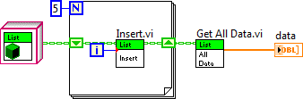

Although this simple list example solely utilizes LabVIEW's recommended value-passing method, reference passing is still essential in certain circumstances to avoid making the program overly complex and confusing. For instance, implementing a more sophisticated doubly-linked list, where each node's preceding and succeeding nodes both refer back to the current node, suggests a need for a method to refer to the same data from various locations. This scenario makes reference passing the optimal solution. Next, we will illustrate how to employ classes and references in LabVIEW to construct complex data structures by creating a doubly-linked list.

## Doubly Linked List

### Structure of a Doubly Linked List

In a doubly linked list, each node is linked to both its previous and next nodes, allowing direct traversal to either the preceding or following node. This structure enables both forward and backward navigation throughout the list. A circular doubly linked list is formed when the tail node's next pointer links to the head node, and the head node's previous pointer links back to the tail node, as depicted above. Although singly linked lists can also form loops, a list may have some nodes outside a loop with others forming the loop itself. Non-circular lists are more common in practice, and our example implements such a non-circular list.

Here's a thought-provoking question: How can you use limited memory to determine whether a long list contains a loop?

### Design

This example diverges from the simple list by requiring reference types to point to both previous and next nodes. Thus, each node in the doubly linked list contains three member variables: `data` for storing the target data, in this case, a double-precision floating-point number; `previous`, a reference pointing to the preceding node; and `next`, a reference pointing to the succeeding node. Refer to the section on [Pass by Reference](pattern_pass_by_ref) for more about reference data types.

The node class is named `DoublyNode.lvclass`. As previously discussed, a `DoublyNode` class cannot use references of its own type as member variables. To address this, we created an interface `IDoublyNode` for the `DoublyNode` class. The `previous` and `next` data members in the `DoublyNode` class are of the `IDoublyNode` reference type.

With references in play, creating and deleting references becomes inevitable. Handling these operations in high-level code would make it cumbersome and complex. To streamline this, we introduced an `Iterator.lvclass` specifically for encapsulating all node reference-related operations. The `Iterator` class has a single member variable, a reference to a node. Think of an `Iterator` object as a pointer to a node within the list. Invoking the `Iterator`'s `get_next` method produces a new `Iterator` object pointing to the subsequent node; similarly, its `get_previous` method returns a new `Iterator` object pointing to the previous node.

The list as an entity, along with its operations like adding or removing data, is encapsulated in `DoublyLinkedList.lvclass`. Following the principle that applications should ideally invoke functionalities through interfaces rather than directly through classes, we designed the `IList` interface, defining all list methods. The structural relationship among the various classes is illustrated below:

### The IDoublyNode Interface and DoublyNode Class

As designed, the IDoublyNode interface and the DoublyNode class are designated solely for defining the data structure of list nodes. Below is an overview of DoublyNode's data structure:

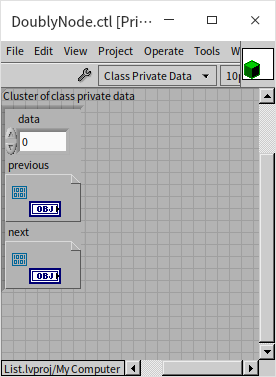

Their implemented methods are limited to directly accessing and modifying DoublyNode's three member variables: `data`, `previous`, and `next`. It's worth noting that LabVIEW classes offer a security feature: “Restrict references of this class type to member VIs of this class” (Data Value Reference - Restrictions On New and Delete). This option is enabled by default. When enabled, references for this class's objects can only be created or destroyed within the member VIs of this class, not in any higher-level program. For interfaces, this setting is locked as enabled and cannot be altered.

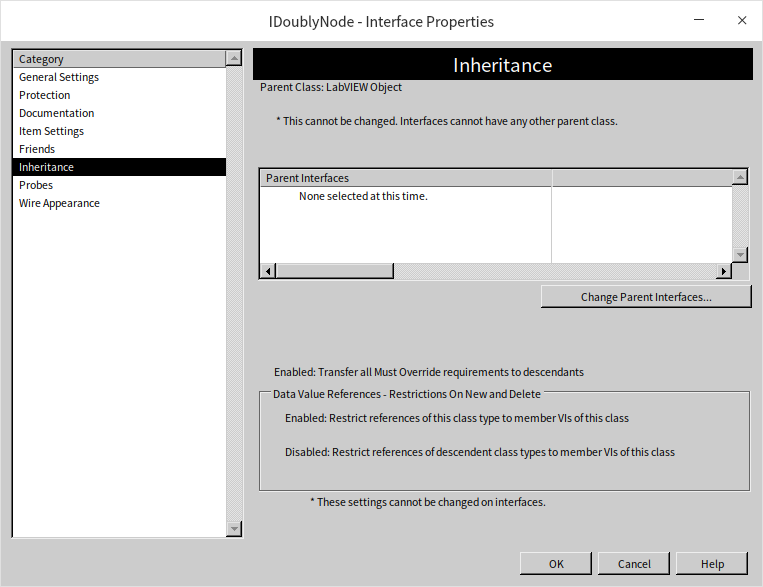

We require references to the IDoublyNode interface, so two additional functions have been included within the IDoublyNode interface: `new.vi` and `delete.vi` to manage the creation and destruction of IDoublyNode references. These two VIs have a very straightforward purpose, essentially encapsulating the “New Data Value Reference” and “Delete Data Value Reference” functions.

 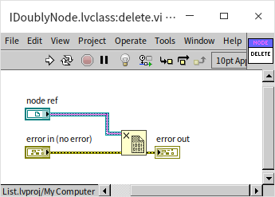

When employing data references in a program, it's essential to ensure that these references are properly disposed of when they are no longer required. Neglecting to do so can lead to memory leaks, potentially causing significant issues with program operation.

### The Iterator Class

:::tip

The Iterator class showcases a technique in LabVIEW to improve program readability. LabVIEW's most intuitive programming approach is value passing, but using references can significantly increase the complexity of the program. One method to manage this complexity is to encapsulate all operations related to a specific type of data, including its references, within a class. This allows higher-level programs to manipulate reference-type data as conveniently as if they were dealing with value-passed data.

:::

The Iterator class contains a single member variable: a reference pointing to a node.

All essential operations on the doubly linked list nodes are encapsulated within the Iterator class. This includes creating new nodes, obtaining the next node, and reading and writing node data. Let's take the `get_next.vi` method as an example to illustrate how methods in the Iterator class function. The `get_next` method retrieves the next node from the current node, as shown in its block diagram below:

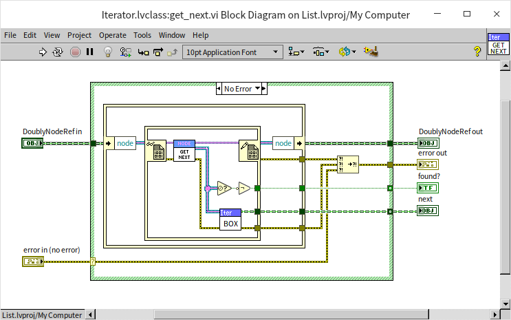

The procedure begins by extracting the sole piece of data in the input Iterator object: a reference to IDoublyNode. It then uses the in-place element structure to access the node this reference points to and subsequently obtains the reference to the node's next link. Upon acquiring the reference to the next node, it wraps this reference into a new Iterator object. This design choice enables upper-level programs to focus solely on the Iterator, thus bypassing the need to directly engage with the underlying IDoublyNode and DoublyNode complexities.

### The IList Interface and DoublyLinkedList Class

The IList interface defines all the methods necessary for a doubly linked list to interact with higher-level programs. The DoublyLinkedList class implements these methods. This class includes three member variables. Two of them are objects of the Iterator class, pointing to the head and tail of the list, respectively. When the list is empty, both head and tail contain invalid references. The third member variable is an integer, length, which indicates the length of the list.

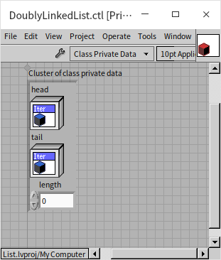

Having tail and length as attributes is not strictly necessary for a linked list's functionality. With just the head of the list, it's possible to traverse node by node to identify the tail and calculate the list's length. However, this method is less efficient. If an application frequently needs to query the list's tail or determine its length, maintaining variables for the tail node and length within the list class can significantly enhance efficiency.

Let's examine in detail how several key methods in the list are implemented.

Starting with the **add_head** method: invoking this method inserts data at the head of the list, hence this method requires data as an input.

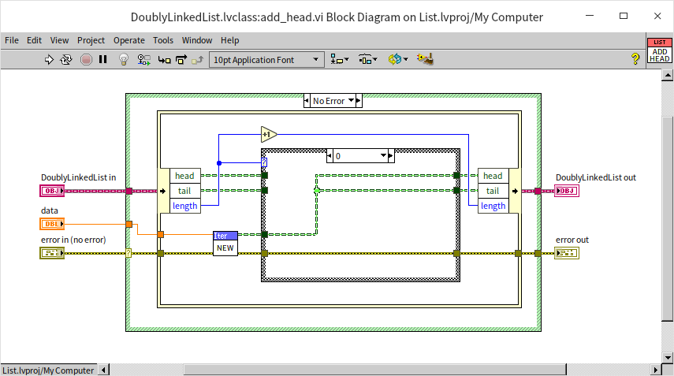

The program first uses the Iterator's method to create a new node for the input data, then inserts this new node at the head of the list. If the list is empty (length == 0), the new node acts as both the head and tail node, so both the list's head and tail need to point to this new node. If the list is not empty, the new node becomes the new head node, with its next node being the original head node; and the original head node's previous node must be updated to point to this new head node.

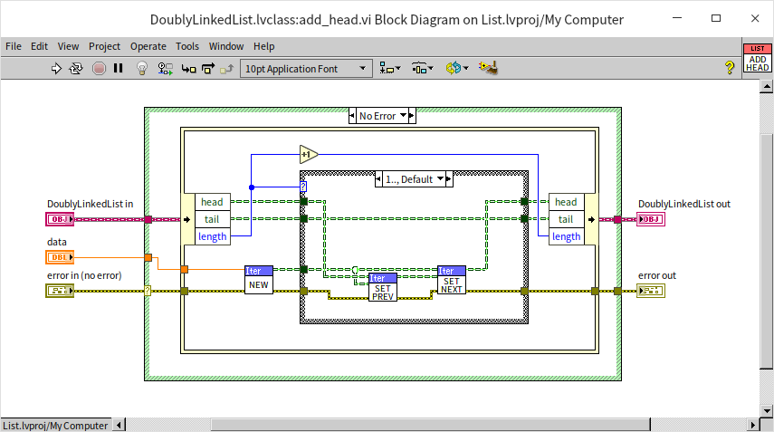

Regardless of the initial state of the list, its length increases by one after adding a new node.

Let's examine a more general method for adding nodes, **insert_before**. This method inserts a new node immediately before a specified node. Hence, along with the target data, this method's parameters include a reference node.

First, the program verifies whether the specified node is valid; if it's not, an error is reported. If the node is valid, it further checks if the given node is the list's head. If so, the add_head method previously implemented is called. If the reference node is not the list's head, then the following adjustments are made:
- The new node's previous node becomes the given node's original previous node.
- The new node's next node becomes the given reference node.
- The given reference node's new previous node becomes the newly inserted node.
- The original previous node's next node, of the given reference node, becomes the newly inserted node.

Though the explanation here might sound complex, the program logic might be clearer.

Corresponding to the node addition is the **delete** method for node removal. Invoking this method removes a specified node from the list.

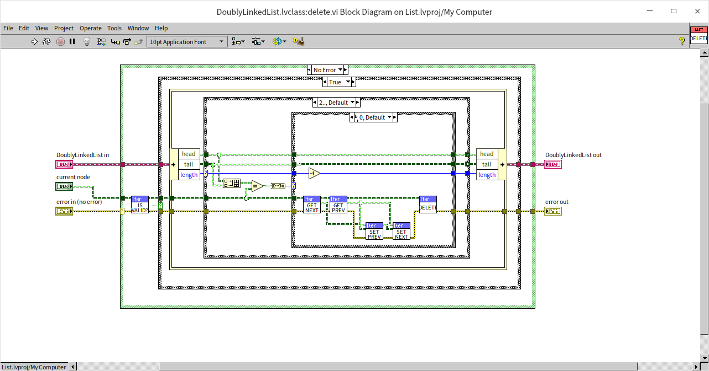

Initially, the program checks if the specified node is valid; if it's invalid, an error is reported. If valid, it needs to determine whether this node is the head node, the tail node, or both. The simplest case is when the given node is both the head and tail, in which case the list's head and tail are set to their default values (invalid references), followed by the specified node's destruction. If the given node is just the head node, then the list's head needs to be shifted down one node before destroying the given node. The most complex scenario occurs when the given node is a middle node in the list. Before destroying this node, it's necessary to connect the previous and next nodes of the given node.

For easy access to the list's data, the DoublyLinkedList class also includes a **to_array** method. This method, when invoked, starts from the list's head node, sequentially traverses each node, retrieves the data from each node, and returns them as an array.

### Using the Linked List

Below is a demonstration program that utilizes some of the basic operations provided by the linked list interface:

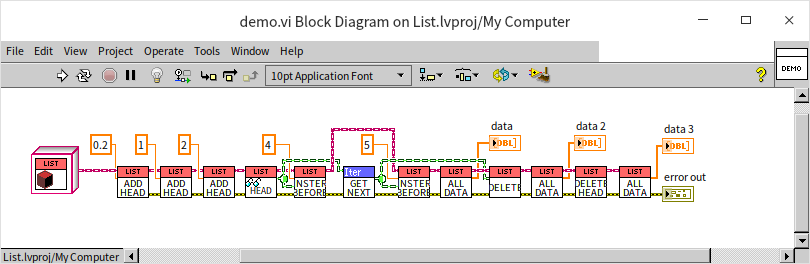

- Initially, the program creates an empty list, so the list's data should be empty.
- It then inserts data at the list's head: 0.2, making the list's data: 0.2.
- Another data insertion at the list's head: 1, changes the list's data to: 1, 0.2.
- A further data insertion at the list's head: 2, updates the list's data to: 2, 1, 0.2.
- The program reads the current head node of the list, which should contain the data: 2.
- It then inserts another data item before this node: 4, altering the list's data to: 4, 2, 1, 0.2.
- The program retrieves the next node from the one just processed, which is the node containing data 1.
- Another data item is inserted before the node with data 1: 5, modifying the list's data to: 4, 2, 5, 1, 0.2.
- The program then deletes the node with data 1, revising the list's data to: 4, 2, 5, 0.2.
- Lastly, the program deletes the current head node of the list, resulting in the list's data being: 2, 5, 0.2.

With this, a fairly comprehensive linked list container has been developed. However, this linked list container has a significant limitation: it can only store numeric data types. In the section on [Generic Programming](oop_generic), we will discuss how to create VIs capable of applying the same algorithm to various data types.
