# Practical OOP Examples

## Managing Multiple Objects of a Single Class

Managing multiple instances of the same resource or data structure is a classic use case for OOP. For example, a test execution program might control several identical instruments. We can define the instrument model as a class, with each physical instrument represented by an object instance. Similarly, we can model raw measurements or data files as classes, where each acquisition run or file on disk corresponds to an instance.

Let's look at a simple test program that stores data in a custom file format. To manage multiple data files within the application, we create a file handler class.

Each file contains an experiment name, timestamp, and numeric data. We store these fields inside the class's private data cluster:

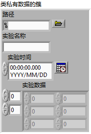

To allow other VIs to read or write these fields, we generate accessor VIs by right-clicking the class and selecting **New -> VI for Data Member Access**.

Beyond basic accessors, we also need methods to open, create, and save files.

The `Open` method reads data from a file on disk and populates the class's internal properties:

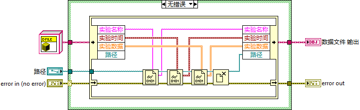

The `Save` method does the reverse: it writes the class's current property values back to the file on disk:

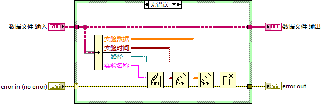

We also implement a `Create` method to initialize a new, empty data file object, and a `Clear` method to wipe the object's current attributes. The complete class structure in the project tree looks like this:

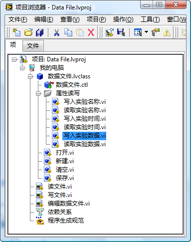

Below is a demonstration program using this class. If the program needs to process multiple data files, it instantiates a class object for each file at startup. We then manipulate these files by dragging the class methods directly onto our block diagram:

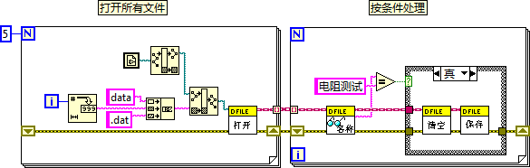

Here is another real-world example: a G-based hardware driver for a multi-channel data acquisition card. The class encapsulates driver configurations and functions:

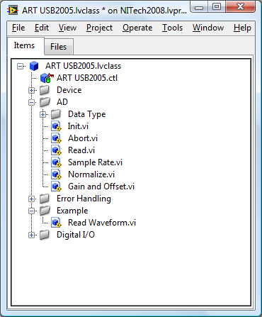

All hardware parameters (e.g., sampling rate, gain settings, channel list) are stored as private data inside the class cluster. The public hardware API (e.g., `Initialize`, `Read Data`, `Close`) is exposed to the user as public methods. Low-level configuration subVIs that are only meant for internal driver operations are set to private to prevent misuse:

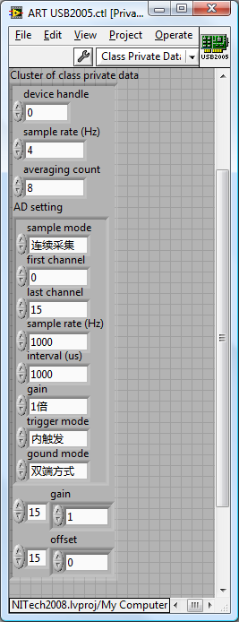

Below is an application VI using this driver class. If the application needs to control multiple identical acquisition cards, it simply opens multiple instances of the driver class using the `Initialize` constructor:

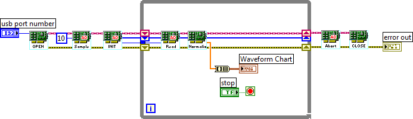


## Writing Code to Support Multiple Data Types

While managing multiple instances of a class is the most common use case for OOP, the previous hardware and file driver examples could technically be written without classes. You could group parameters inside a standard G Cluster and package operations inside a Project Library (`.lvlib`).

However, this cluster-plus-library approach is limited to namespace encapsulation. It lacks inheritance and polymorphism.

If you use standard clusters, a subVI connector pane must be hardcoded to a specific cluster type. If your application needs to support three slightly different file formats or instrument types, you have to write three separate sets of VIs, even if the processing logic is identical.

By using classes, a subVI expecting a parent class input can automatically accept any of its subclasses. This allows a single G diagram wire to process multiple distinct data structures, greatly improving code reuse.

Consider a simple program that needs to process two types of data: a raw number and a cluster. The goal is to increment the inner numeric value of both structures by 1.

Using class-based polymorphism, we can write a single subVI call that handles both types:

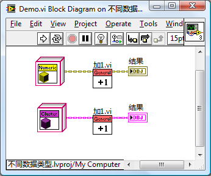

To implement this, we wrap the two different structures into separate subclasses: a `Numeric` class and a `Cluster` class. We then define a parent class with no data to serve as their common ancestor:

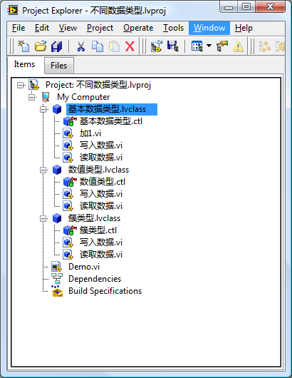

The `Add 1.vi` method is defined as dynamic dispatch in the parent class and overridden in each subclass.

While **Polymorphic VIs** can also dispatch calls based on the input type, they are resolved at edit-time. You cannot group different data types into the same collection (like an array of polymorphic types) and loop through them. With classes, you can cast the different subclasses into an array of the parent class type and process them inside a single For Loop:

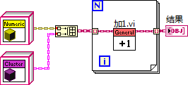

By decoupling the algorithm from concrete types, you can reuse the same loop structure to process any new data type by simply creating a new subclass and overriding the dynamic dispatch method.


## Framework-Plugin Program Architecture

In [Dynamic SubVIs](vi_server_for_subvi), we explored building a plugin architecture using raw VI Server references. We can build a cleaner, more efficient framework-plugin system using LabVIEW classes.

Suppose a main framework application scans a relative folder (`Plugin/`) for plugins, loads them dynamically, and runs them. At edit-time, the framework has no knowledge of how many plugins exist or what they do.

To build this with classes, we define an interface class that all plugins must implement. This interface specifies the connector pane layouts and methods the framework will call.

In our demo program, the interface is defined as `PluginInterface.lvclass` and contains a single dynamic dispatch method: `execute.vi`. Calling this method displays a dialog with the plugin's name.

Each plugin is built as a separate class that implements `PluginInterface.lvclass` and overrides `execute.vi` with its custom task logic.

The project structure looks like this:

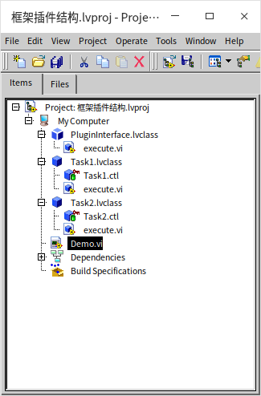

Here is the implementation of `execute.vi` inside `Task1`:

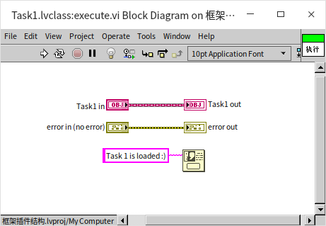

Below is the main framework block diagram that dynamically loads and runs the plugins:

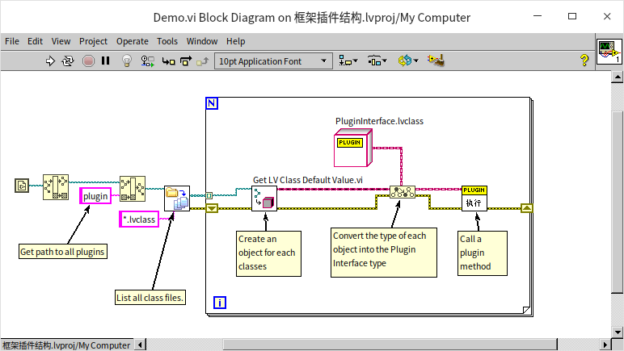

The framework scans the directory, locates the `.lvclass` paths, and uses the **Get LV Class Default Value** node to load the class definitions into memory. Since this node is generic, it outputs a reference typed as **LabVIEW Object**.

We then use **To More Specific Class** to cast the reference to our interface type (`PluginInterface.lvclass`). Once cast, the framework can safely call `execute.vi`.

At runtime, polymorphism routes the `execute.vi` call to the concrete subclass implementation (e.g., displaying "Task1" or "Task2").

Using classes for plugins is far more robust than raw VI Server calls. The table below compares the two approaches:

| Feature | Dynamic VI Call | LvClass Plugins |
|---|---|---|
| **LabVIEW Version** | Supported since early versions. | Supported since LabVIEW 8.2. |
| **Development Complexity** | Straightforward, but requires managing path strings and control names manually. | Requires understanding OOP, but ensures compile-time connector pane checks. |
| **Plugin Capabilities** | Limited to a single VI entry point. Passing complex data requires flattening/unflattening. | The plugin is a stateful object. It can define multiple methods, private attributes, and custom settings. |
| **Use Case** | Simple, scripting-like pluggable scripts. | Complex, large-scale modular software frameworks. |


## Value-Based List Data Structures

For many years, G natively supported only arrays and queues as primary data collections. Native maps and sets were introduced in LabVIEW 2019. However, there are scenarios where you want a classic linked list or tree structure. We can implement these custom data containers in G using classes.

In software engineering, a **data container** combines a data structure (how nodes are arranged in memory) with its operational API (methods to add, remove, and traverse the nodes).

Let's look at how to implement a linked list. If you come from a text-based programming background, you likely picture a list as a chain of nodes:

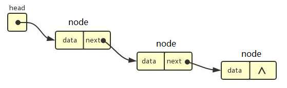

A linked list is composed of nodes. Each node contains data and a reference pointing to the next node in the chain.

Unlike arrays, which are stored as contiguous memory blocks, linked list nodes are scattered.
- **Arrays** excel at indexing: reading the $n$-th element is an $O(1)$ operation. However, inserting or deleting elements is slow ($O(N)$) because all subsequent elements must be shifted in memory.
- **Linked Lists** excel at insertion and deletion: inserting a node $C$ between $A$ and $B$ only requires changing $A$'s pointer to $C$, and $C$'s pointer to $B$. This is an $O(1)$ operation. However, indexing requires traversing the chain node-by-node ($O(N)$).

### The Self-Reference Challenge in G

In text-based OOP, you define a self-referencing class:
```cpp
class Node {
    double data;
    Node* next;
};
```
However, implementing a self-referencing class directly in G causes a compiler deadlock.

Because LabVIEW is a visual dataflow language, when you open a VI containing a class control or constant, LabVIEW must initialize its default structure immediately. If the class contains a member variable of its own class type, the compiler gets stuck in a recursive loop: to initialize the class, it must initialize its member variable, which requires initializing the class, and so on.

Similarly, a class cannot contain a member variable that is a subclass of itself, nor can it directly contain a reference to itself.

To break this recursion, we must introduce an auxiliary parent class or interface. A class can store a member variable of its parent class type because the parent's default constructor does not depend on the child's definition.

In this simple list implementation, we create an empty parent class `Node.lvclass` to act as the abstract node container. We then create a subclass `List.lvclass` that inherits from `Node`. The class hierarchy looks like this:

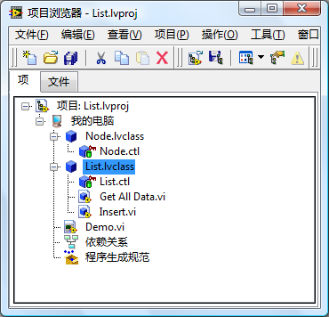

Each node in our list is an instance of `List.lvclass`. It contains two private data fields:
1. `data`: a double-precision floating-point number.
2. `next node`: a control of type `Node.lvclass` (the parent class), which stores the next node in the list.

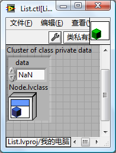

`List.lvclass` implements two basic methods. The `Insert.vi` method adds a new node to the front of the list:

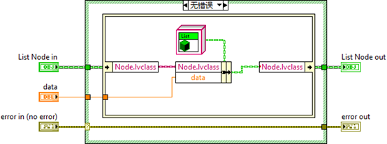

It instantiates a new `List` object, sets its data, and updates its `next node` field to hold the current list.

The `GetAllData.vi` method traverses the list recursively to return all elements as a DBL array:

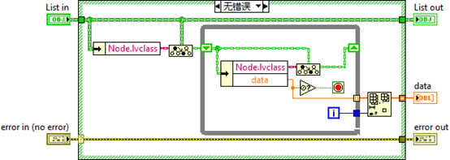

It reads the data of the head node, gets the next node, downcasts it to the `List` subclass, and reads its data, continuing until it hits a default `Node` constant (which signifies the end of the list).

Below is a test application using this value-based list:

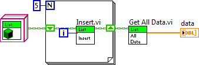

While this value-based list is clean because it avoids raw reference management, it is limited. Implementing a doubly linked list (where each node has pointers to both its previous and next nodes) using value-passing G is extremely complex and slow. For complex structures, **pass-by-reference** is the proper solution.


## Doubly Linked List {#doubly-linked-list}

### Structure of a Doubly Linked List


In a doubly linked list, each node contains links to both the previous and next nodes, allowing you to traverse the list in either direction. In a circular doubly linked list, the next pointer of the tail node links to the head, and the previous pointer of the head links to the tail. In this section, we will implement a standard, non-circular doubly linked list.

> [!TIP]
> **Interview Question:** How can you determine if a linked list contains a loop using only $O(1)$ extra memory?
> **Answer:** Use Floyd's Cycle-Finding Algorithm (also known as the "Tortoise and Hare" algorithm). You run two pointers through the list at different speeds (one node per step vs. two nodes per step). If the list has a loop, the fast pointer will eventually catch up and meet the slow pointer.

### Architectural Design

Because each node needs to modify its neighbors dynamically, we must use reference types (pointers) for the link fields. Each node contains three variables:
1. `data`: a DBL number.
2. `previous`: a reference pointing to the preceding node.
3. `next`: a reference pointing to the succeeding node.

(See [Pass by Reference](pattern_pass_by_ref) for a detailed discussion on implementing references in G).

Our node class is named `DoublyNode.lvclass`. To bypass the G self-reference limitation, we define an interface `IDoublyNode`. The fields `previous` and `next` inside `DoublyNode` are stored as **Data Value References (DVRs)** pointing to the `IDoublyNode` interface.

To keep the client code clean, we do not expose these raw DVRs. Instead, we encapsulate all pointer traversal logic inside a dedicated `Iterator.lvclass` helper class. An `Iterator` object acts as a safe wrapper pointing to a specific node. Calling `get_next.vi` on an iterator returns a new iterator pointing to the next node; calling `get_previous.vi` returns an iterator pointing to the previous node.

The list container itself is implemented as `DoublyLinkedList.lvclass`, which implements the public `IList` interface defining the list API. The object relationships are illustrated below:

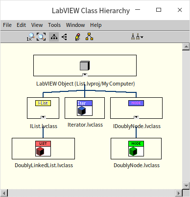


### The `IDoublyNode` Interface and `DoublyNode` Class

The `IDoublyNode` interface and the `DoublyNode` class define the node's fields:

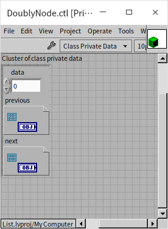

Their methods are basic getters and setters for the `data`, `previous`, and `next` fields.

By default, LabVIEW enables a safety setting on classes: **Restrict references of this class type to member VIs of this class** (meaning DVRs can only be created or destroyed inside the class's own methods). For G interfaces, this safety constraint is locked and cannot be disabled:

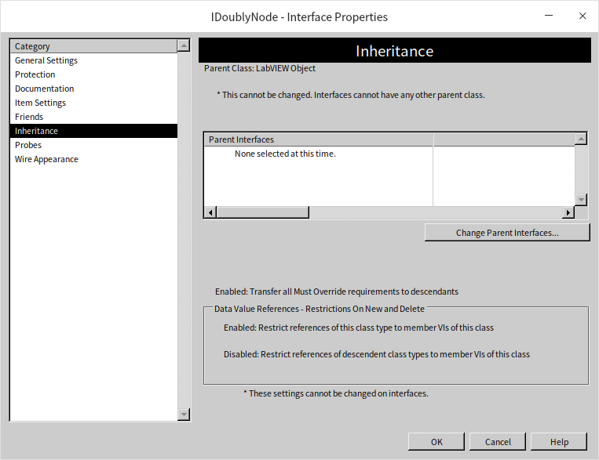

Because of this restriction, we must add explicit `new.vi` and `delete.vi` methods inside the `IDoublyNode` interface to manage the allocation and deallocation of node DVRs. These VIs wrap G's native **New Data Value Reference** and **Delete Data Value Reference** primitives:

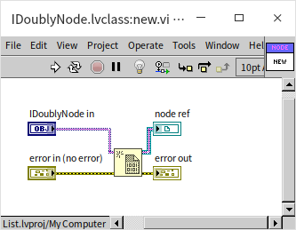 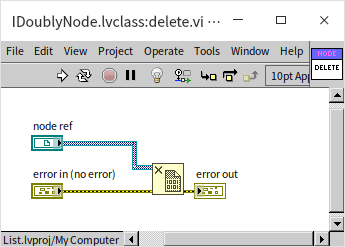

> [!WARNING]
> When using DVR references in G, you must explicitly delete references when they are no longer needed. Leaving references un-deleted results in memory leaks, which can degrade performance or crash long-running applications.


### The `Iterator` Class

> [!NOTE]
> The `Iterator` class is a design pattern used in G to manage pointer complexity. While pass-by-reference is necessary for linked lists, passing raw DVR wires across high-level block diagrams makes G code messy. Encapsulating the DVR inside a value-passed `Iterator` object allows client programs to interact with the list cleanly.

The `Iterator` class contains a single field: a DVR pointing to the node.

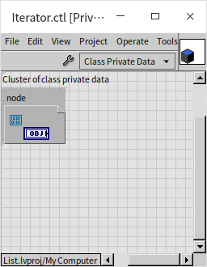

All pointer-traversal methods are wrapped inside the `Iterator` class. For example, here is the block diagram of `get_next.vi`:

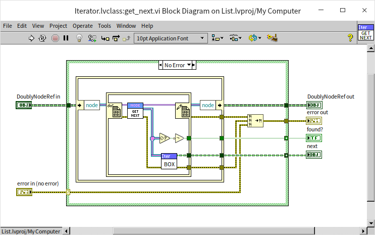

This method unbundles the `Iterator` class data to read the node DVR, opens the DVR using an **In-Place Element Structure** to retrieve the node's private `next` DVR, and wraps that nested DVR into a new `Iterator` object. The calling code never sees the raw pointer wires or the In-Place Element Structure.


### The `IList` Interface and `DoublyLinkedList` Class

The `IList` interface defines the public linked-list methods, and the `DoublyLinkedList` class implements them. The class stores three fields:
1. `head`: an Iterator pointing to the head node.
2. `tail`: an Iterator pointing to the tail node.
3. `length`: an I32 integer indicating the number of nodes in the list.

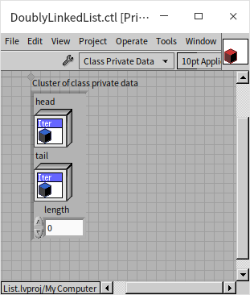

Storing the `tail` and `length` explicitly is not strictly required, but it optimizes operations like appending data or checking the count from $O(N)$ traversal to $O(1)$ direct access.

Let's examine the implementation of some key methods.

#### The `add_head` Method
This method inserts a new element at the beginning of the list:

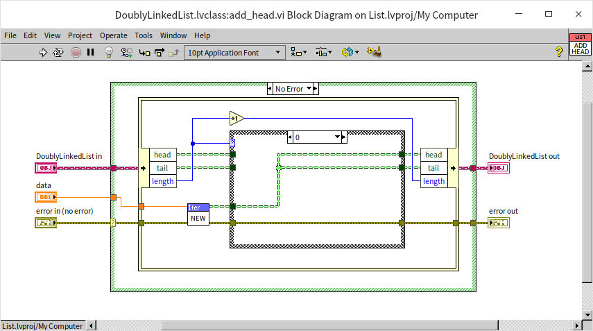

1. First, we use `Iterator` to instantiate a new node with the input data.
2. If the list is empty (`length` == 0), this new node becomes both the `head` and the `tail`.
3. If the list is not empty, the new node becomes the new `head`, its `next` pointer is set to the original head node, and the original head's `previous` pointer is updated to point to the new node:

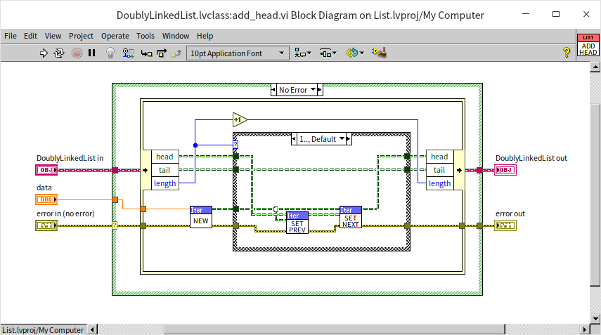

4. The list's `length` is incremented by 1.

#### The `insert_before` Method
This method inserts a new node immediately before a specified reference node:

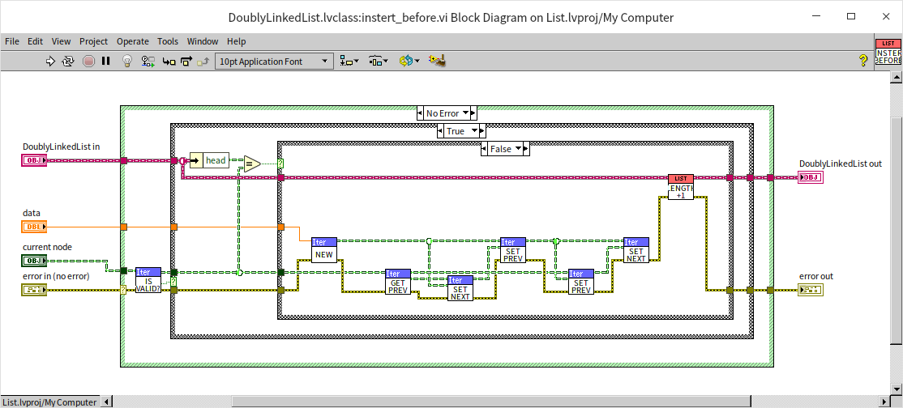

1. The program verifies if the reference node is valid. If not, it reports an error.
2. If the reference node is the current `head`, the program calls `add_head.vi`.
3. If the reference node is in the middle of the list:
   - The new node's `previous` pointer is set to the reference node's original `previous` node.
   - The new node's `next` pointer is set to the reference node.
   - The reference node's `previous` pointer is updated to point to the new node.
   - The original previous node's `next` pointer is updated to point to the new node.
4. The list's `length` is incremented by 1.

#### The `delete` Method
This method removes a specified node from the list:

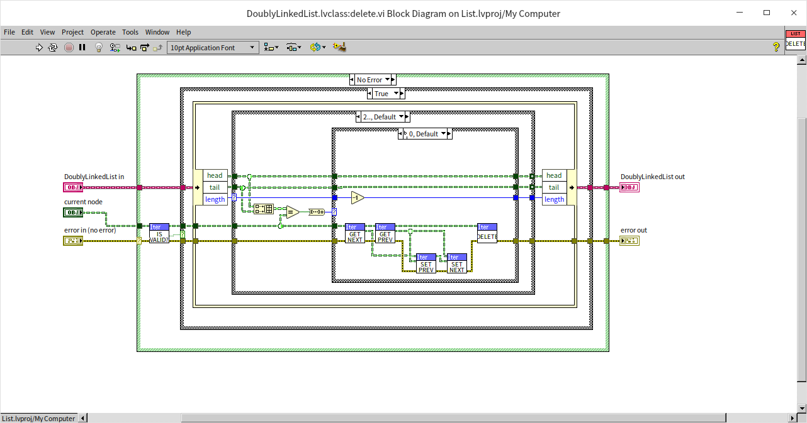

1. The program verifies if the specified node is valid.
2. It checks where the node lies:
   - **Only node (head & tail):** Resets the list's `head` and `tail` to invalid reference constants and deletes the node reference.
   - **Head node:** Updates the list's `head` to point to the second node, resets the second node's `previous` pointer to invalid, and deletes the head node.
   - **Tail node:** Updates the list's `tail` to point to the second-to-last node, resets its `next` pointer to invalid, and deletes the tail node.
   - **Middle node:** Hooks the target's `previous` node to its `next` node directly, then deletes the target node.
3. The list's `length` is decremented by 1.

#### The `to_array` Method
This method traverses the list starting from the `head` node, extracts the data from each node sequentially, and returns them as a standard G array:

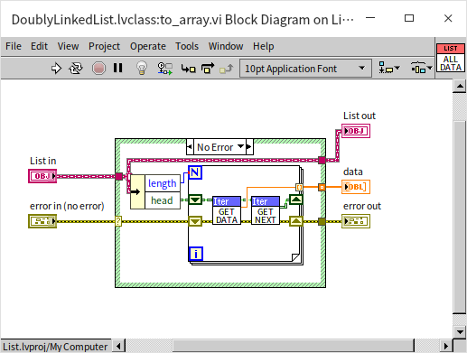


### Using the Linked List

Here is a test program demonstrating various operations on our doubly linked list:

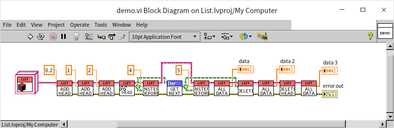

The program executes the following sequence:
1. Creates an empty list (data is empty).
2. Appends `0.2` to the head (list is `[0.2]`).
3. Appends `1` to the head (list is `[1, 0.2]`).
4. Appends `2` to the head (list is `[2, 1, 0.2]`).
5. Reads the head node (`2`).
6. Inserts `4` before the head node (list is `[4, 2, 1, 0.2]`).
7. Gets the next node (which holds `1`).
8. Inserts `5` before the node containing `1` (list is `[4, 2, 5, 1, 0.2]`).
9. Deletes the node containing `1` (list is `[4, 2, 5, 0.2]`).
10. Deletes the head node (list is `[2, 5, 0.2]`).

Running this VI confirms the operations execute correctly:

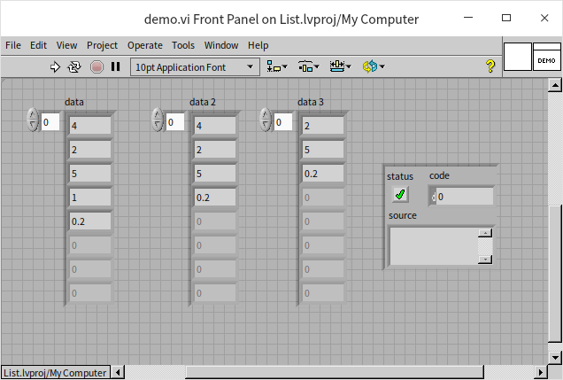

While this linked list works, it is currently limited to storing double-precision floating-point numbers. In [Generic Programming](oop_generic), we will show how to refactor this library to accept any G data type using malleable VIs.
