# XNode

:::info

This section will leverage technologies associated with [VI Scripting](vi_server_for_vi) and [XControl](ui_xcontrol).

:::

You might be well-versed in creating subVIs, including those capable of processing various data types. But have you considered creating nodes with functionalities as robust as LabVIEW's built-in functions (like cluster bundling) or structures (such as loop constructs)?

Indeed, this is achievable through LabVIEW's XNode feature. The name "XNode" might remind you of [XControl](ui_xcontrol), and they do share some similarities. XNode and XControl were introduced around the same time. While XControl allows users to design controls with complex appearances and behaviors, XNode enables the creation of nodes with sophisticated functionalities and behaviors. Both are developed using G code, the native LabVIEW programming language. XControl has been accessible to NI's external users for quite some time, but XNode has not yet been officially released for external use. However, since all components needed to develop XNodes are included in the LabVIEW installation package, users can activate this feature with some configuration adjustments. Numerous user-created XNodes are available online.


### Enabling XNode Features

XNodes essentially consist of a collection of libraries and VIs that meet specific format criteria, much like XControls are also a compilation of libraries and VIs with defined format requirements. Theoretically, users can utilize XNodes within their programs by providing a corresponding set of files that make up the XNode, without any special LabVIEW configurations. However, creating these VIs from scratch can be both cumbersome and error-prone. By activating LabVIEW's XNode functionality, LabVIEW offers templates and documentation to aid in constructing XNodes, significantly easing the creation process.

### On Windows Systems

For Windows users looking to create XNodes conveniently, there are two paths to choose from. The official route involves obtaining a certificate from NI that enables XNode functionality, which is then activated on the computer. If this option is not viable, free third-party tools are available that also facilitate the creation of XNodes. For example, the XNode Editor (a quick Google search will yield detailed information) is such a tool.

Additionally, it is advantageous to incorporate the following settings into LabVIEW's configuration file. These configurations activate LabVIEW's development and debugging tools related to XNodes, simplifying the development of XNodes.

```ini
XnodeWizardMenu=True
XnodewizardMode=True
XTraceXnode=True
XNodeDebugWindow=True
SuperSecretPrivateSpecialStuff=True
```

On Windows systems, LabVIEW's configuration file is the labview.ini, located in the same folder as the labview.exe executable.


### Linux

For Linux users, enabling XNode functionality is relatively straightforward. You only need to copy the following configuration into LabVIEW's configuration file:

```ini
XNodeDevelopment_LabVIEWInternalTag=True
XnodeWizardMenu=True
XnodewizardMode=True
XTraceXnode=True
XNodeDebugWindow=True
SuperSecretPrivateSpecialStuff=True
```

On Linux systems, the path to LabVIEW's configuration file is: `/home/<username>/natinst/.config/LabVIEW-x/labview.conf`.

The setting `XNodeDevelopment_LabVIEWInternalTag=True` allows the New feature in LabVIEW to include an option for creating XNodes.


### XNode Debug Menu

LabVIEW's built-in nodes, such as the "Match Regular Expression" node found under “Programming -> String” in the function palette, appear to be standard LabVIEW functions. The distinction, however, is in their development; "Match Regular Expression" is crafted with XNode technology, in contrast to most other LabVIEW functions that are developed in C++. After enabling XNode debugging tools as previously described, right-clicking on this node will reveal an additional menu group titled "XnodeWizardMenu". This menu displays all of the feature VIs associated with the XNode. The concept of an XNode's feature VIs is akin to that of [XControl](ui_xcontrol)'s feature VIs, which dictate the XNode's various behaviors and functionalities. These will be further detailed below.


Selecting a feature VI from the debug menu will open the block diagram for that specific feature VI. This can be particularly useful for referencing how well-constructed XNodes are implemented should you face challenges while developing your own XNode.

The "Match Regular Expression" node shown in the above block diagram merely represents the XNode's icon, similar to how a sub VI’s icon is displayed on the block diagram of a calling VI. Just as double-clicking a sub VI's icon opens its code, to view the executing code of an XNode, you can select "GeneratedCode" from the "XnodeWizardMenu". LabVIEW will display the executing code of the XNode, as seen in the execution code for the "Match Regular Expression" node below:


At first glance, the code appears inactive because it isn’t manually crafted but generated by the software (thus named "GeneratedCode"), and it wasn't organized during its generation. By clicking the “Cleanup Diagram” button, the full code layout is revealed:


One key difference between XNodes and sub VIs is that a sub VI’s code remains static after it's written, whereas an XNode's executing code is dynamically generated by the software, adapting based on configuration options, data connections, and more. XNodes offer versatility, enabling the creation of a wide variety of nodes. For instance, the "Error Ring" acts as a data terminal node XNode, while the "Timed Loop" functions as a structural XNode, similar to loop structures.


## Debugging XNodes with Function VIs

XNodes, similar to [XControls](ui_xcontrol), are governed by specific function VIs that manage their logic and functionality. However, XNodes incorporate significantly more function VIs than XControls, increasing their complexity. In the following sections, we'll cover some of the essential and frequently used function VIs, showcasing their application through a step-by-step creation of an example XNode. Let's create an XNode from scratch that behaves like a functional node. This hypothetical XNode takes cluster data as input, reverses the order of its elements at runtime, and outputs a new cluster. Besides its primary functionality, we also want this XNode to have a customizable appearance, automatically accommodate various cluster data types, and feature custom menus and additional auxiliary functions.

### The State Function Control

Firstly, we initiate by creating a brand new XNode:


Noticeably, the newly crafted XNode starts off with a sole default “State” function control. This control mirrors the functionality of the State function control found in XControls. It is a cluster control encompassing data types for each piece of data the XNode requires. If certain data must be shared among various function VIs, its type should be included in the State control. This arrangement allows the XNode to allocate memory for all state data as defined within State. At this point, we don’t necessitate any specific data, so we can leave the default State control as is and revisit it later as needed.

A freshly minted XNode lacks any function VIs initially since all of its function VIs are optional.

Would this bare XNode function? Let’s proceed with a test VI by dragging our newly created XNode onto its block diagram. The new XNode appears merely as a blank square, and interestingly, the test VI runs without hitting any syntax errors. Nonetheless, this bare XNode performs no actionable tasks during execution.


After deploying the XNode onto the test VI, editing the XNode becomes impossible. Hence, it is prudent to remove the XNode from the test VI’s block diagram after each test round. This approach not only facilitates further modifications to the XNode but also ensures the XNode is tested in its most current state for subsequent trials.


### Adjusting XNode Icon Size with GetBounds

When a newly created XNode is placed onto the block diagram of another VI, it appears as a plain square, about the size of a standard sub-VI icon. On high-resolution displays, this size might seem too small. While the size of sub-VI icons is fixed to a maximum of 32x32 pixels, the icon size of an XNode can be adjusted. We will use the GetBounds function VI to increase this icon's size.

First, let's add this function VI to our new XNode. Right-click on the XNode project and select "Ability":


LabVIEW will display a dialogue box listing all the function VIs available for the XNode:


This dialogue also offers a short description for each function VI. We locate GetBounds and then click to add it.
The GetBounds function VI determines the current XNode icon's dimensions. When we open this function VI, we see an output named "Bounds" that we need to configure. We'll set the size to a larger dimension, 64x64 pixels:


Upon opening the test VI again, we notice that the XNode's icon has been enlarged:


It's crucial to remember that XNode's function VIs are intended to be invoked by the LabVIEW system, with preset input and output interfaces. In creating XNodes, we must ensure not to alter their input/output controls or terminal layouts. These function VIs should not be directly called from other VIs. XNode developers are merely required to implement the necessary program logic within these function VIs. Data transfer between function VIs cannot be direct nor facilitated through global variables; it should only proceed through the "state" designated by function controls.


### GetImage

The newly created XNode still appears as a hollow square on the block diagram. Now, let's add a meaningful icon. The function VI for adding an icon is called GetImage. We follow the same procedure, open the function VI dialog, find GetImage, and choose to add it.

The main output of this function VI is an Image data type, essentially a picture that serves as the icon. If you've already designed an icon with a graphic tool, you can either load the picture from a file within this function VI or, for simplicity, embed the picture directly as a constant within this VI. However, sometimes we can't predetermine all icons for an XNode, especially for those whose appearance must dynamically change based on the number and types of connected wires, such as an XNode resembling the Bundle/Unbundle nodes. It's impossible to predraw these icons before connections are made. In such cases, icons must be dynamically generated within the program.

In this demonstration, we use LabVIEW's drawing VIs to craft an icon for the XNode from scratch:


Dragging this XNode into the test VI again, we can see our newly crafted icon is a "sad face":


When selecting this XNode with the mouse, you'll notice the icon is no longer square but circular. This concept is akin to [creating irregular sub-VI icons](optimization_coding_style): LabVIEW does not consider the transparent edges around the icon's graphic part of the icon itself.


### GetGrowInfo

XNode icons are not just larger than standard sub-VI icons; they can also be resized by users. To enable this feature for an XNode, the permissible size range must be defined in the GetGrowInfo function VI.


The essential output of this function VI is a cluster that includes information such as:

- Min Bounds: The minimum allowable icon size. Users cannot reduce the icon's dimensions below this size.
- Max Bounds: The maximum allowable icon size.
- Vertical Increment: The increment for vertical adjustments, indicating the number of pixels by which the size increases or decreases with each adjustment. Some nodes, like Bundle/Unbundle, can be vertically stretched, so their increment must accommodate a full terminal's height, not just 1 pixel but rather 5 pixels (assuming each terminal height is 5 pixels). Our example icon can be any size within its allowed range, so we'll stick with the default setting, which suggests an increment of 1 pixel.
- Horizontal Increment: The increment for horizontal adjustments, set in a similar manner to the vertical increment.
- Maintain Aspect?: This determines whether to keep the aspect ratio constant. We're setting it to true to ensure the icon always remains a perfect circle.
- Oval?: When resizing, the XNode displays guide dots and outline lines around the icon. By default, these form a rectangular shape. Since our example icon is circular, we've set this to true, so the outline forms a circle instead.
- Vertical Only Resize?: Indicates whether the icon can only be resized vertically.
- Horizontal Only Resize?: Indicates whether the icon can only be resized horizontally.
- Resize None?: Specifies whether resizing is permitted.

After dragging this XNode into the test VI and hovering over the icon, guide dots for resizing appear. Clicking and dragging one of these dots shows the icon's outline can be adjusted in size:


However, upon releasing the mouse, the icon's size seems unchanged. This occurs because GetGrowInfo function VI only establishes the boundaries within which the icon size can vary. The actual adjustments to the icon size need to be made in a series of other function VIs that will be discussed later.


### OnResize2

Firstly, we need to let the XNode know how much it's been resized by the user. This is done through the OnResize2 function VI. The name of this function VI includes a "2", which is its version number. Sometimes, newer versions of LabVIEW may change the requirements for a function VI, necessitating the creation of a version with a different numerical identifier.

OnResize2 is triggered automatically when a user attempts to resize the XNode. It receives a "Bounds" input, which is the new size of the XNode as adjusted by the user. Subsequently, we need to use this new size set by the user to adjust the XNode's icon size (via the GetBounds function VI) and the XNode's icon design (via the GetImage function VI). However, we can't directly pass data between different function VIs: we can't directly call one function VI from another, and function VIs are only supposed to be invoked by LabVIEW itself. Using global variables isn't an option either. The transfer of data between function VIs must occur through the "state" defined by the State control, which means using the "State In" and "State Out" inputs and outputs every function VI is equipped with.

To transmit the correct data via State, we first need to modify the State control to include the XNode's dimensions as part of the state data:


It's crucial to set a practical default value for this state data. Next, we can convey the newly acquired size detected by OnResize2 to the "state" data:


This function VI's "State In" input receives the current "state" data of the XNode; "State Out" collects the new state. The OnResize2 function VI also outputs a "Reply". Reply can accept predefined strings, indicating to LabVIEW which function VIs to call next. Since we wish for LabVIEW to update both the XNode's icon size and its pattern next, we pass the string "UpdateImageAndBounds" to Reply, prompting LabVIEW to invoke the GetBounds and GetImage function VIs after processing OnResize2.

To enable user-adjustable icon size for the XNode, GetBounds needs some adjustment; it cannot use a constant value for the XNode's dimensions anymore. Instead, it should retrieve the current dimensions from the XNode's state data:


Similarly, the GetImage VI requires modifications. It can no longer use constants for drawing the icon. All elements in the image, including shape areas and the lengths and thicknesses of lines, must be calculated proportionately based on the XNode's size:

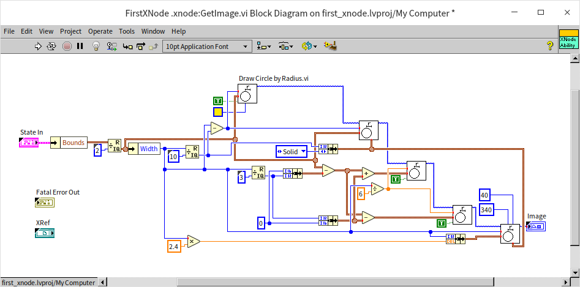

After these changes to the code, users can now resize the XNode's icon by dragging with the mouse:


### Handling Terminals with GetTerms4

So far, the XNode we've been working on is just an icon and doesn't perform any specific functions. If we aim to add functionality similar to a real function or a subVI, we must introduce input and output terminals. This is where the GetTerms4 function VI comes into play.

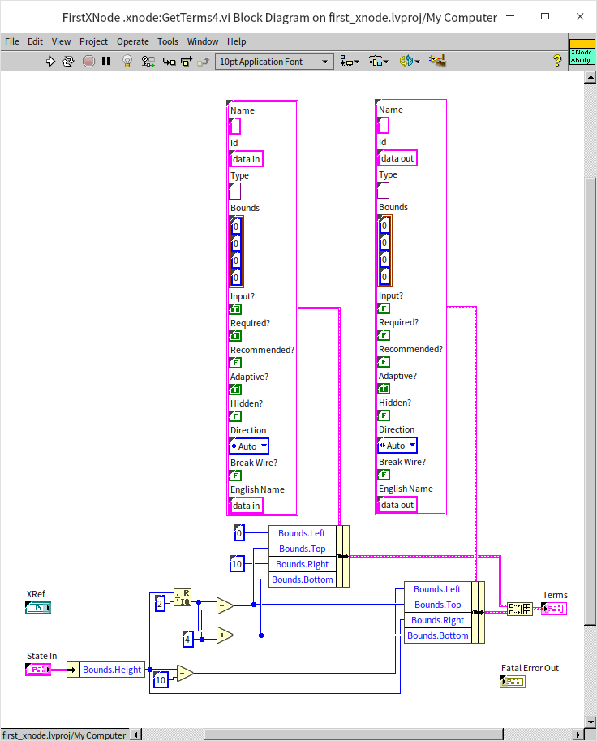

The critical output of this function VI is an array, where each element is a cluster that represents information about a terminal. Each cluster contains the following information:

- Name and English Name: Names for the terminal or parameter, both in English and in the local language.
- Id: A unique identifier for each terminal, used in other function VIs to refer to specific terminals of the XNode.
- Type: The data type of the terminal.
- Bounds: The position of the terminal, indicating the distance from the icon's top-left corner.
- Input?: Indicates whether it's an input or an output terminal.
- Required?: Specifies if a connection is mandatory.
- Recommended?: Indicates if a connection is recommended.
- Adaptive?: If set to true, the input terminal's data type automatically adjusts based on the connected input data's type.
- Hidden?: Determines if the terminal is hidden.
- Direction: The orientation of the terminal, typically set to automatic to allow the system to orient terminals away from the XNode icon's center.
- Break Wire?: Determines whether the terminal causes the wire to break.

Let's add two terminals to the XNode: an input terminal on the left and an output terminal on the right.

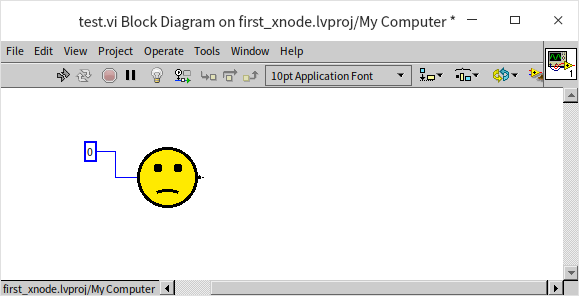

This setup enables the XNode to connect with other nodes via wires. The data terminals of the XNode have been set to Adaptive, allowing any type of data to be connected. However, this Adaptive feature does not apply to output terminals. So, how do we ensure the data type of the XNode's output terminal matches the input terminal's type?


### Adapting to Input Changes with AdaptToInputs

When changes are made to the connections on an XNode, the AdaptToInputs function VI gets called into action. This function VI takes "State In" as one of its main inputs, which is an array detailing the data types currently connected to each of the XNode's terminals. These terminals are identified using the Ids set within the GetTerms4 function VI. If our goal is to synchronize the XNode's output data type with its input, we need to track what type of data is being input, a detail that must be encapsulated within the XNode's state data:

Initially, we augment the State control to include a new data field indicative of the input data's type:

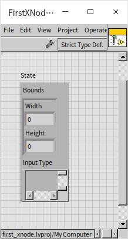

Subsequently, in the AdaptToInputs function VI, we extract the data type from the XNode's “data in” terminal and persist this type information in the state data. Given that a change in data type necessitates the re-drawing of the XNode's terminals, this function VI's Reply output must dispatch an “UpdateTerms” command, prompting LabVIEW to refresh the XNode's terminals.

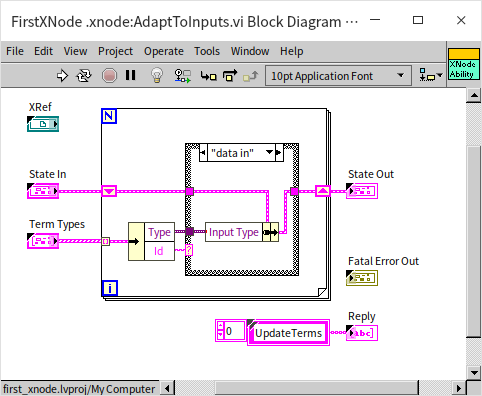

Corresponding adjustments are required for the GetTerms4 function VI, which moves away from employing the Adaptive feature for dynamic data types. Instead, it derives the necessary data type directly from the state, configuring the terminals accordingly.


Through these modifications, the XNode's output can now dynamically adjust to match the type of the input data:

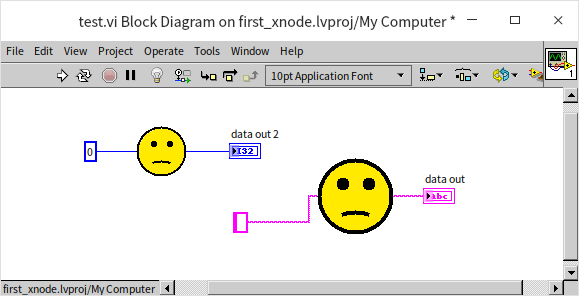

To align with our initial design intentions, we need to adjust the code to add some complex behaviors to this XNode's terminals. First and foremost, this XNode should not accept any data type; it's specifically designed to process cluster data types. This restriction can be enforced in the AdaptToInputs function VI. Here, we employ specialized functions and VIs dedicated to checking data types to ascertain the nature of the connected data. These tools are located under “Programming -> Cluster, Class, & Variant -> Variant -> Data Type Parsing” in the function palette. We used “Get Type Information.vi” to verify if the data type connected to the “data in” terminal is of a cluster type. If so, this type information is stored in the state data; otherwise, a null data type is recorded. Additionally, we instructed this function VI to send an “UpdateImageAndBounds” command to Reply, signaling LabVIEW to invoke the function VIs responsible for updating the XNode's icon size and graphics after processing this function VI.

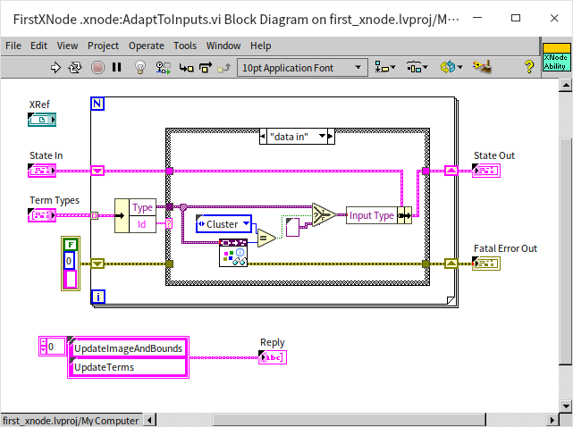

When the XNode’s input is a cluster, we want the output to be a cluster as well, but with the elements ordered in reverse of the input cluster. This means the output cluster's data type needs to dynamically change. We need to generate a new data type for the output terminal based on the input cluster's type, which is executed within the GetTerms4 function VI. The program first uses “Get Type Information.vi” to check if the current input data is a cluster. If it is, “Get Cluster Information.vi” is called to retrieve the data types of each element within the cluster, returning this information as an array. By reversing the order of this array, we get the element information for our output cluster. This cluster element information is then written into a new cluster data type via “Set Cluster Information.vi,” creating the required output data type for the XNode.


Here, we add an extra feature: if the XNode is connected to a valid data type (a cluster), the icon’s frown turns into a smile. This functionality is achieved by drawing the mouth in different orientations in the GetImage function VI, depending on the current input data type:

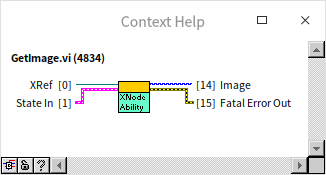

After making these code adjustments and dragging the XNode back into the test VI, we can see that the XNode now correctly handles the input and output types:

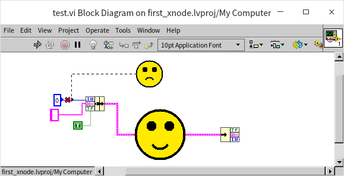


### GenerateCode

So far, we have finished most of the interface-related functionalities for the XNode. Now let's move on to implement its runtime logic. The XNode's runtime behavior is defined by the GenerateCode function VI. Importantly, we don't directly write the runtime logic within the GenerateCode function VI itself. Instead, we craft a piece of code within GenerateCode that, when executed, generates another block of code. It's this generated block that the XNode will invoke during runtime.

For example, our designed XNode's operational logic might look something like this:

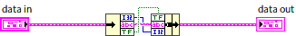

At runtime, it should take an input cluster, unbundle each element, and then re-bundle all elements in reverse order into a new cluster. Thus, within the GenerateCode function VI, we need to craft a script that adds the necessary bundle/unbundle functions onto a temporary VI's block diagram and correctly connects the wires. Writing code in GenerateCode to generate another LabVIEW code segment necessitates extensive use of [VI Scripting](vi_server_for_vi) functionalities.

The fully implemented GenerateCode function VI is depicted below:

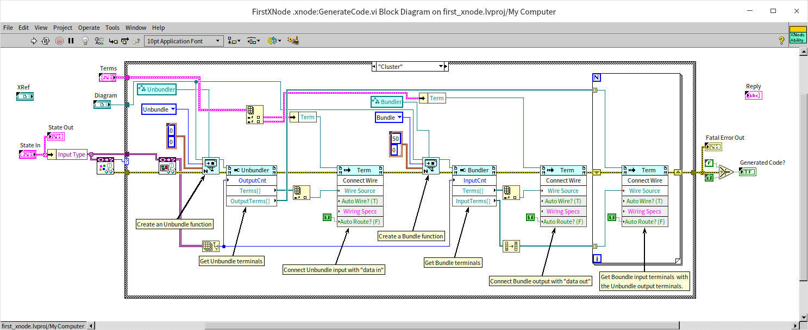

This function VI includes two main inputs:

* Diagram: A reference to the block diagram of a temporary VI, onto which the code the XNode will call at runtime is written. Having this reference enables us to employ VI Scripting functionalities to code on it directly.
* Terms: An array that lists all the input and output terminals (i.e., the XNode's terminals) of that temporary VI, facilitating their manipulation with VI Scripting functionalities.

The logic of the GenerateCode function VI is roughly as follows: first, it checks whether the current input data type for the XNode is a cluster. If it is, a unbundle function is created on the temporary VI, with the number of its output terminals adjusted according to the number of elements in the current input cluster. Similarly, a bundle function is then created; finally, all the necessary wires are connected.

With these adjustments, the XNode can now be effectively used in a program:


The runtime logic of this example XNode is relatively simple, making it manageable to script all its logic using VI Scripting. However, in most XNode projects, the required code is far more complex. Generating everything with the GenerateCode function VI could make the function VI excessively intricate. A common method to simplify GenerateCode entails pre-writing a template VI for the XNode's runtime logic. This way, in the GenerateCode function VI, you can initially copy all code from the template into that temporary VI, then refine it using VI Scripting programming, significantly streamlining the code volume in GenerateCode.


### Initialize Function VI

The Initialize function VI is responsible for initializing state data. Unlike XControls, XNodes do not have an Uninitialize function VI, meaning that any resources opened in the Initialize function VI must also be closed within it, as there might not be another suitable opportunity to do so.


In this example, the Initialize function VI primarily initializes some state data. If default values are set in the State control, it might not be necessary to use the Initialize function VI at all.


### BuildMenu5 Function VI

To add custom menu functions to an XNode, the BuildMenu5 function VI is required. This VI's two main inputs are the menu reference and the menu type. There are four types of menus: “Operate Object Operate,” which can generally be understood as the menu that appears upon a left mouse click, although defining the behavior for a left-click is more complex. In our demonstration, we used the second type, “Operate Object Popup,” which is the system menu LabVIEW displays when right-clicking on the XNode. Menu-related functions allow us to modify the menu by adding or removing items.

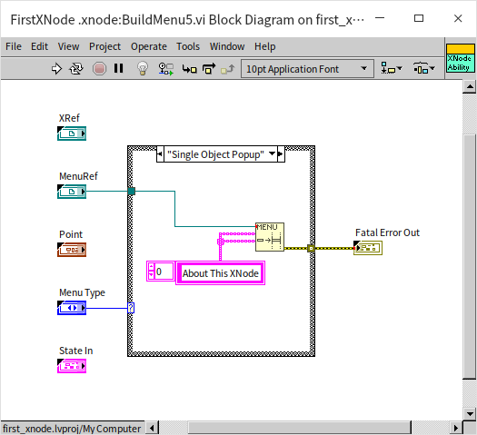

We've added a menu item titled “About This XNode” to the XNode:


### SelectMenu5

While the BuildMenu5 function VI adds menu items to the XNode, the actions triggered by user selections from these menus are defined in another function VI: SelectMenu5. This VI allows us to modify certain state data to execute complex operations, such as altering the XNode's appearance or adding terminals. In our demonstration program, we've chosen a simple operation: displaying a dialog box:


This dialog box can either be custom-designed or utilize one of LabVIEW's built-in VIs.


### GetDisplayName3

Our final step is to assign a meaningful name to the XNode, enhancing its discoverability and readability within the program. This is accomplished with the GetDisplayName3 function VI, which outputs two key pieces of information: the "Type Name" mainly aids in search and identification; the "Instance Name" is used for labeling. Usually, both names are identical.

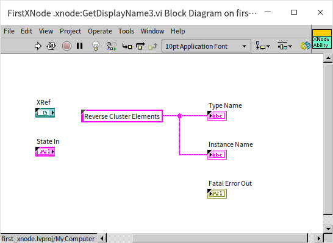

This concludes our creation of a feature-rich XNode.