# XNode

:::info

这一节的的示例程序将会使用到 [VI 脚本](vi_server_for_vi) 和 [XControl](ui_xcontrol) 等相关技术。

:::

读者们应该都已经非常熟悉如何创建子 VI 了，甚至创建一些能处理多种数据类型的子 VI。但是我们是否还能创建一些功能更强大的节点呢，就像 LabVIEW 自带的那些函数（比如簇捆绑），甚至是结构（比如循环结构）等等？

还真的可以，LabVIEW 已经提供了相应的功能：XNode。XNode 看名字，会马上联想到 [XControl](ui_xcontrol)。二者确实有一些相似之处，XNode 与 XControl 是差不多同时出现的技术。使用 XControl，用户可制作出具有复杂外观和行为的控件；而使用 XNode 则可以制作出具有复杂功能和行为的节点，并且它与 XControl 相同，也是使用 G （LabVIEW） 代码进行开发。XControl 很早就已经开放给 NI 的外部用户使用了，而 XNode 至今也没有正式开放给外部用户。但是，因为 LabVIEW 安装包已经包含了制作 XNode 的全部组件，用户只要改动一些设置就可以使用这个功能了，网上也可以找到很多用户制作的 XNode 产品。

## 开启 XNode 的相关功能

XNode 本质上就是一组有特定格式要求的库和 VI （类似的，XControl 本质上也是一组有特定格式要求的库和 VI），所以，理论上，用户即使不对 LabVIEW 做任何特殊设置，只要提供了符合要求的这样一组构成 XNode 的文件，就可以在程序里使用这个对应的 XNode 了。但在实际应用中，凭空创建这个些 VI 即繁琐又容易出错。如果激活了 LabVIEW 的 XNode 功能，LabVIEW 会提供一些模板以及文档来帮助搭建 XNode，极大的方便 XNode 的制作过程。

### Windows

在 Windows 系统下，用户如果想方便的创建 XNode，有两个途径可选。一是官方途径，从 NI 官方得到一个启用 XNode 功能的证书，然后在电脑上激活这个功能。如果此路不通，也可以使用一些免费的第三方的工具。利用这些第三方工具，同样可以方便快捷的创建 XNode。比如，XNode Editor （Google 这个工具名，可以搜索到详细信息）。

此外，最好可以在 LabVIEW 的配置文件中添加以下设置，它们可以激活 LabVIEW 中与 XNode 相关的辅助开发和调试工具，使得 XNode 开发更容易。

```ini
XnodeWizardMenu=True
XnodewizardMode=True
XTraceXnode=True
XNodeDebugWindow=True
SuperSecretPrivateSpecialStuff=True
```

在 Windows 系统下，LabVIEW 的配置文件是与 labview.exe 同文件夹下的 labview.ini 文件。

### Linux

笔者主要在 Linux 系统下使用 LabVIEW。在 Linux 系统下启用 XNode 功能还要更方便一些，只需要将如下配置拷贝到 LabVIEW 的配置文件中即可：

```ini
XNodeDevelopment_LabVIEWInternalTag=True
XnodeWizardMenu=True
XnodewizardMode=True
XTraceXnode=True
XNodeDebugWindow=True
SuperSecretPrivateSpecialStuff=True
```

在 Linux 系统下，LabVIEW 的配置文件的路径是：“/home/<username\>/natinst/.config/LabVIEW-x/labview.conf”。

其中的 XNodeDevelopment_LabVIEWInternalTag=True 设置可以让 LabVIEW 的新建功能增加 XNode 选项。


## XNode 的调试菜单

LabVIEW 自带的一些节点也是使用 XNode 技术制作的。比如 Match Regular Expression，这个节点在函数选板“Programming -> String” 上。它看上去就是一个普通的 LabVIEW 自带函数，区别在于开发方式，Match Regular Expression 是用 XNode 制作的，其它的多数 LabVIEW 自带函数都是使用 C++ 编写的。当我们按照上文介绍的方法开启 XNode 调试工具之后，再用鼠标右键点击这个节点，会发现鼠标右键菜单多了 XnodeWizardMenu 这一组菜单。这组菜单列出了这个 XNode 所有的功能 VI。XNode 的功能 VI 与 [XControl](ui_xcontrol) 的功能 VI 概念相似，用来控制 XNode 的各种行为和功能，下文会详细介绍。


在这个调试菜单上选取一个功能 VI，就会打开相应功能 VI 的程序框图。如果将来在编写 XNode 时遇到困难，可以用此方法打开一个别人做好的 XNode 的功能 VI，用于参考借鉴。

我们在上图看到的程序框图上的 Match Regular Expression 节点只是这个 XNode 的图标，就好像是子 VI 在调用 VI 程序框图上显示的图标。当我们双击一个子 VI 的图标，会打开这个子 VI 的执行代码；相应的，如果我们想查看这个 XNode 的执行代码是什么，可以在 XnodeWizardMenu 菜单中选取 “GeneratedCode”,LabVIEW 会把这个 XNode 的执行代码显示出来。比如下图是这个 Match Regular Expression 节点的执行代码：


上图中的运行代码似乎什么事都没做，其实这是因为这段代码不是人手工编写的，而是程序程生成出来的（所以叫 GeneratedCode），并且代码生成时候也没有排列得当。点击一下“Cleanup Diagram”按钮，就会看到完整的程序代码了：

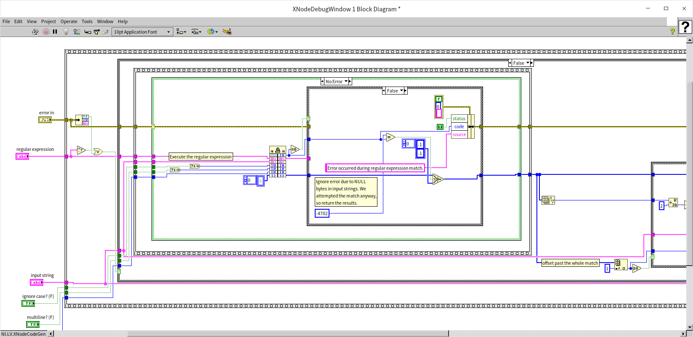

XNode 与子 VI 有一些不同：子 VI 的代码是固定的，写好的什么样，就一直是什么样；XNode 的执行代码是程序动态生成的，它会根据配置选项，连接的数据线等条件的改变而改变。XNode 的功能强大，可用于制作很多不同类型的节点。比如，“Error Ring”是一个比较类似于数据接线端节点的 XNode，“定时循环结构(Timed Loop)”是一种结构（比如循环结构）的 XNode。

## 功能 VI

XNode 与 [XControl](ui_xcontrol) 相似，通过一些特定的功能 VI 来控制 XNode 的逻辑和功能。不过， XNode 的功能 VI 的数量比 XControl 多了一个数量级，所以开发难度也更大一些。下文会介绍这其中一些最重要和最常用的功能 VI，本书将使用一个示例 XNode 来演示这些功能 VI 的使用方法。我们将一起从零开始制作一个 XNode。假设，我们需要制作的 XNode 是一个类似函数的节点，它的输入是一个簇类型数据，程序运行时，XNode 会把簇中元素反向排列，组成一个新的簇类型数据，然后输出。除了这个核心功能，我们还希望这个 XNode 可以有能够变化的外观，能够自动处理各种不同的簇数据类型，有自定义的菜单等辅助功能。

### State 功能控件

首先，创建一个全新的 XNode：

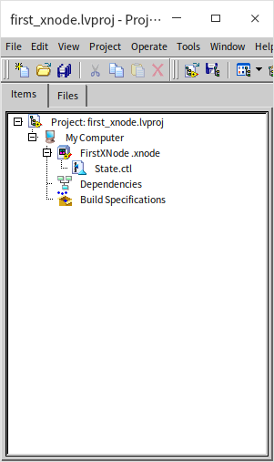

这时会发现，新创建出来的 XNode，只有一个默认的“状态(State)”功能控件。它与 XControl 中的 State 功能控件功能完全相同。它是一个簇控件，簇中包含了用于定义 XNode 所需的每个数据的数据类型。如果哪个数据需要在不同的功能 VI 之间被传递，可以就把它的类型放在 State 功能控件里，这样 XNode 就会根据 State 中的定义，开辟一块数据空间给所有状态数据。我们暂时还不需要任何数据，所以可以先不去改变默认的 State 功能控件，将来需要用到时，再做修改。

新建的 XNode 没有任何功能 VI，XNode 所有的功能 VI 都是可选的。

这个空的 XNode 能运行吗？让我们创建一个测试 VI，然后把新建的 XNode 拖到测试 VI 的程序框图上，可以看到新建 XNode 看上去就是一个空白方块，并且测试 VI 是可以运行的，没有语法错误。只是新建的 XNode 也是空的，运行起来不做任何事情。


当 XNode 被拖拽到测试 VI 上后，我们就无法编辑这个 XNode 了。所以每次测试后，可以先把 XNode 从测试 VI 的程序框图上删除。这样不但可以继续修改 XNode，也可以确保下次测试时， XNode 的状态是修改过后的。

### GetBounds

新建 XNode 在其它 VI 的程序框图上是上去是一个空白的方块，大小就是一个子 VI 图标的大小。这在高分辨率显示器上看上去显得太小了一点,子 VI 的图标大小是没法调节的，最大就是 32*32 像素，但 XNode 的图标尺寸是可以调节的，下面我们就使用 GetBounds 功能 VI 把这个图标改大。

首先，为新建的 XNode 添加个这个功能 VI。鼠标右键点击 XNode 项目，选择“Ability”：


LabVIEW 会弹出一个对话框，列出 XNode 所有的功能 VI：


对话框还给出了每个功能 VI 的简要说明。我们找到 GetBounds，然后点击添加。
GetBounds 功能 VI 用于设定当前 XNode 图标的尺寸。打开这个功能 VI，可以看到他有一个名为“Bounds”的输出，这是我们唯一需要设置的，把尺寸设置大一点 64*64 像素：

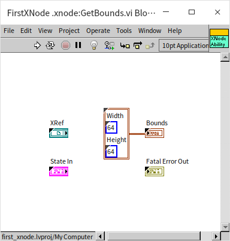

再次打开测试 VI 查看，会发现 XNode 的图标大了一倍：


需要注意的是：XNode 的功能 VI 是供 LabVIEW 系统去调用的，它有预定好的输入输出接口。我们在编写 XNode 的时候一定不要改变它们的输入输出控件，以及接线端的布局。我们也不可以直接在其它的 VI 中直接调用这些功能 VI。XNode 开发者需要做的只是填充功能 VI 所需的程序代码。功能 VI 之间的数据无法直接传递，也不应该使用全局变量传递数据，只可以通过由功能控件定义的“状态”来传递数据。


### GetImage

新创建的 XNode 在程序框图上还只是一个空心方块，我们现在给它加上一个有意义的图标。添加图标的功能 VI 是 GetImage。我们使用同样的方法，打开添加功能 VI 对话框，然后找到 GetImage， 选择添加。

这个功能 VI 的核心输出是一个 Image 类型的数据，也就是一张代表图标的图片。如果读者已经使用作图工具画好一个图标了，那么可以在这个功能 VI 里从文件中读取图片，或者更简单的，直接把图片做成常量，放在这个功能 VI 里输出就行了。但有的时候，我们无法为 XNode 预先绘制全部图像，只能在这个 VI 中动态生成，比如我们想要做一个类似捆绑/松绑（Boundle/Unboundle）节点的 XNode，它显示出来的图标会根据接入的数据线的数量和类型产生变化，在数据线连接之前是无法预先绘制图标的。类似这种情况，只能每次在程序中临时绘制图标。

在这个的演示程序中，我们使用 LabVIEW 的绘图 VI，从零开始绘制一幅图片作为 XNode 的图标：


再次把这个 XNonde 拖到测试 VI 里，可以看到我们新绘制的图标是一个“苦脸”：

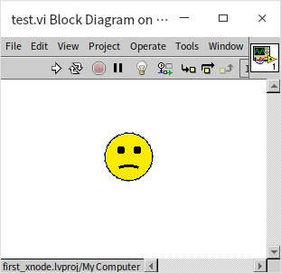

用鼠标选中这个 XNode 会发现，这个图标不再是方形的了，而是一个圆形。这一点与[制作不规子 VI 图标](optimization_coding_style)的原理是相似的：图标图形边缘的空白区域都不会被 LabVIEW 认作是图标的一部分。


### GetGrowInfo

XNode 的图标不但可以比正常子 VI 图标大，它还允许用户在使用时调整大小。如果想让 XNode 提供这个功能，就需要在 GetGrowInfo 功能 VI 中设定 XNode 尺寸允许的范围。

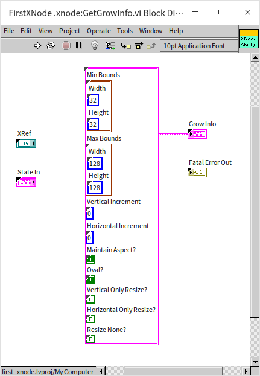

这个功能 VI 的核心输出是一个簇，包含了如下信息：

* Min Bounds： 这是 XNode 图标允许的最小尺寸，用户不能把图标缩的比这个尺寸更小；
* Max Bounds： 这是 XNode 图标允许的最大尺寸；
* Vertical Increment： 纵向调整的增量，也就是每次增加或减少几个像素点。有些节点，比如：捆绑/松绑（Boundle/Unboundle），是可以纵向拉伸的，但每次伸展增量要恰好能够容纳一个接线端。所以它的增量不会是 1 个像素，而是 5 个（假设每个接线端高度是 5 个像素）。我们的示例图标可以是允许尺寸内的任意大小，所以我们不需修改这个值，默认值表示增量为 1 个像素；
* Horizontal Increment： 横向调整的增量，设置方法与纵向增量类似；
* Maintain Aspect?： 是否维持长宽比。这个我们设置为真，保证图标总是一个正圆；
* Oval?： 用户在调整图标大小的时候，XNode 图标上会出现一些提示用的光点和轮廓线。默认情况下，这些光点和轮廓线会围绕图标排列成一个矩形。因为我们的示例图标是一个圆脸，所以正好把这一项也设置为真，让轮廓线摆列成圆形；
* Vertical Only Resize?： 设置是否只能纵向调节尺寸；
* Horizontal Only Resize?： 设置是否只能横向调节尺寸；
* Resize None?： 设置是否允许调节尺寸。

再次把这个 XNonde 拖到测试 VI 里，把鼠标移动到 XNode 的图标上，就可以看到允许调节尺寸的提示光点了。点击拖动一个光点，可以看到图标的轮廓的大小是可变的：


可是，当我们松开鼠标，会发现 XNode 图标的尺寸并没有改变。这是因为 GetGrowInfo 功能 VI 只是设置了图标尺寸可以变化的范围，真正调整图标尺寸，还需要在以下一些列的功能 VI 中进行设置。

### OnResize2

首先我们要让 XNode 知道用户把尺寸调整到了多大。这需要通过 OnResize2 功能 VI 来实现。这个功能 VI 名称带有一个数字 2，这是版本号。有的时候，新版本的 LabVIEW 中，对某个功能 VI 的需求可能会有变化，就会增加一个只有版本号不同的同名功能 VI。

OnResize2 会在用户试图调整 XNode 尺寸是被自动触发。它有一个“Bounds”输入，传入的数据就是用户调整后，XNode 的新尺寸。之后，我们要根据这个新的用户设定的尺寸来设置 XNode 的图标尺寸（使用 GetBounds 功能 VI） 和 XNode 的图标图案（使用 GetImage 功能 VI）。但是我们没办法直接在不同的功能 VI 之间传递数据：我们不可以在一个功能 VI 中直接调用另一个功能 VI，功能 VI 只能被 LabVIEW 调用。也不能使用全局变量。功能 VI 之间的数据传递必须通过由 State 功能控件所定义的“状态”，也就是每个功能 VI 都带有的“State In”和“State Out”输入输出。

为了在 State 中传递准格尔数据，我们先要修改一下 State 功能控件：把 XNode 的尺寸作为一个状态数据：

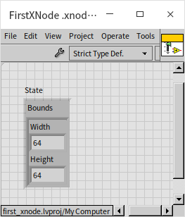

需要注意，状态数据的默认值要设置合理。接下来我们就可以在 OnResize2 功能 VI 中把它截获的用户设定的新尺寸传递给“状态”数据了：


这个功能 VI 的 “State In” 输入的是这个 XNode 当前的“状态”数据；“State Out”则用来接收新的状态。OnResize2 功能 VI 还有一个输出：“Reply”。Reply 可以接收一些预先定义好的字符串，告诉 LabVIEW 在处理完当前这个功能 VI 之后，还应该调用哪些功能 VI。因为我们希望 LabVIEW 之后去更新 XNode 图标的尺寸和图案，所以我们在这里把字符串“UpdateImageAndBounds”传递给 Reply，这样 LabVIEW 在运行了 OnResize2 之后会再去调用 GetBounds 和 GetImage 两个功能 VI。

为了能让用户调整 XNode 图标尺寸，我们还需要对 GetBounds 做一些修改，不能再用一个常量值来设定 XNode 尺寸了，而是应该从 XNode 的状态数据中读取当前应有的尺寸：

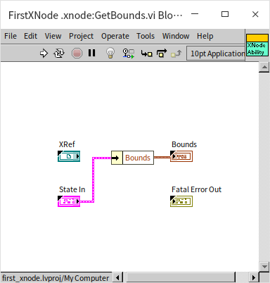

GetImage VI 也要做相应的修改，不再用常量来绘制图标，所有图片中的图块面积，曲线的长短、粗细等都必须根据 XNode 的尺寸按比例计算得到：


完成这些代码修改后，XNode 的尺寸就可以被用户通过鼠标拖拽来调节了。

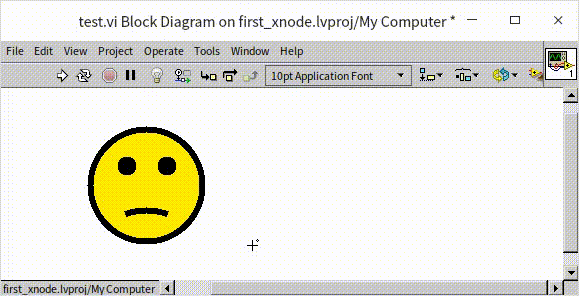


### GetTerms4

到目前为止，我们制作的 XNode 仅仅只是个图标，并不能做任何事情。如果我们要给它添加点功能，像一个真正的函数或者子 VI 那样，我们需要先给它添加一些输入输出参数，也就是接线端。这需要通过 GetTerms4 功能 VI 来实现。


这个功能 VI 的核心输出是一个数组，数组的每个元素是一个簇。每个簇表示一个接线端的信息。簇中包含以下内容：

* Name 和 English Name： 接线端，也就是参数的名字，可以分别有一个英语名和一个本土语言的名字；
* Id： 每个接线端都要有一个唯一的标识，在其它功能 VI 中，如果用到 XNode 的接线端，都要通过这个 ID 找到所需的接线端；
* Type： 接线端的数据类型；
* Bounds： 接线端的位置，数值标识的是相对于图标左上角的距离；
* Input?： 是输入接线端还是输出接线端；
* Required?： 是否必须连接数据线；
* Recommended?： 是否推荐连接数据线；
* Adaptive?： 如果选择“真”，那么这个输入接线端的数据类型会根据连接的输入数据的类型进行自动调整；
* Hidden?： 是否隐藏接线端；
* Direction： 接线端的朝向，一般设为自动就行，系统会尽量让接线端朝向背离 XNode 图标中心的方向；
* Break Wire?： 是否让接线端断裂；

我们给 XNode 添加两个接线端，左面一个输入接线端，右面一个输出接线端。


这样就可以让 XNode 跟其它节点连通数据线了。XNode 的数据接线端已经选择了 Adaptive （自适应），所以任何类型的数据都可以与之相连。但是 Adaptive 对于输出接线端并不起作用。如何才能 XNode 的输出接线端的数据类型保持与输入端的类型相同呢？

### AdaptToInputs

当连接到 XNode 的数据线发生变化时，AdaptToInputs 功能 VI 会被调用。这个功能 VI 的一个主要输入是“State In”，它是一个数组，包含了目前连接到 XNode 每个接线端的数据类型。接线端用在 GetTerms4 功能 VI 中定义的 Id 表示。假如我们打算让 XNode 的输出数据与输入数据类型保持一致，那么我们需要记住输入数据是什么类型的，这一信息也要记录在 XNode 的状态数据中：

首先，在 State 功能控件里添加一个数据，用来表示输入数据的类型：


然后，在 AdaptToInputs 功能 VI 中读出 XNode 的“data in”接线端连接的数据的类型，把这个信息保存传递给状态数据。当数据类型有变化时，是需要重新绘制 XNode 的接线端的，所以这个功能 VI 的 Reply 输出需要包含一个“UpateTerms”命令，通知 LabVIEW 更新 XNode 的接线端。


GetTerms4 功能 VI 也要做相应修改，它不再使用 Adaptive 自适应数据类型，而是从状态中读出所需的数据类型，然后设置接线端为相应类型。

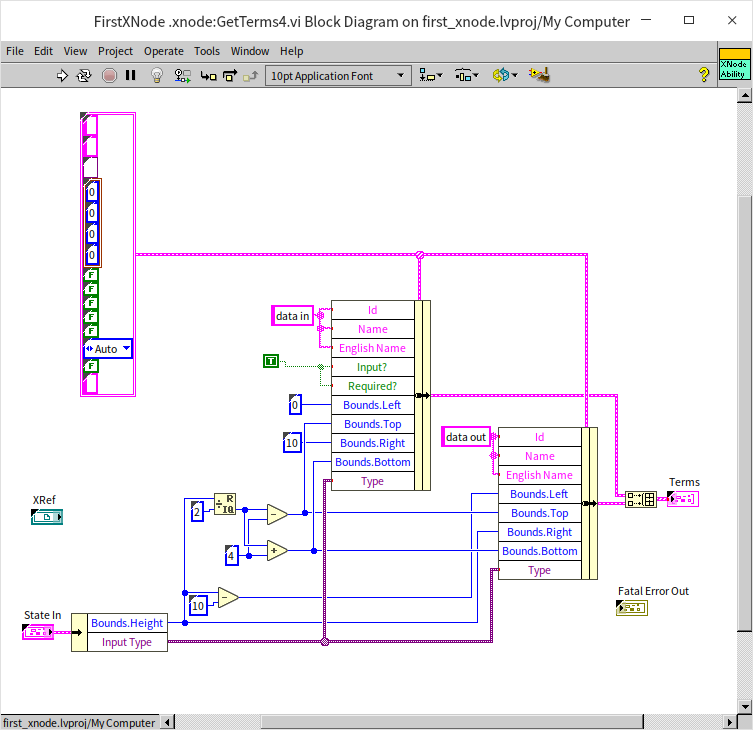

这样，XNode 的输出端也可以根据输入数据进行调整了：


根据我们最初的设计，我们还需要改变一下代码，给这个 XNode 接线端添加一些更复杂的行为。首先，这个 XNode 并不应该接收任何数据类型，它只能处理簇数据类型。这一限制可以添加在 AdaptToInputs 功能 VI 中。这里，我们需要用到一些专用于检查数据类型的函数和 VI，用于查看输入的数据类型到底是什么。这些函数和 VI 可以在函数选板“Programming -> Cluster,Class,&Variant -> Variant -> Data Type Parsing”上找到。这里用了“Get Type Information.vi”，检查“data in”接线端连接的数据类型是否是一种簇类型的数据，如果是，就把这个类型存入状态数据；否则，就把一个空数据类型记入状态数据。在这里我们又让这个功能 VI 传递了一个“UpdateImageAndBounds”命令给 Reply，通知 LabVIEW 处理完这个功能 VI 后再去调用更新 XNode 图标尺寸和图形的功能 VI。


当 XNode 的输入是一个簇的时候，我们希望输出的也是一个簇，但是，输出簇中元素的数序要与输入簇的元素顺序相反。也就是说，输出簇的数据类型设动态变化的。我们要根据输入簇的类型，编程创造一个新的数据类型给输出接线端。这一逻辑需要在 GetTerms4 功能 VI 中实现。程序首先调用“Get Type Information.vi”检查当前的输入数据类型是否是簇，如果是，调用“Get Cluster Information.vi”得到簇中每个元素的数据类型，这一信息以数组的形式返回。所以，只要把这一数组的顺序颠倒，就得到我们需要的输出簇的元素信息了。把这一组簇元素信息通过“Set Cluster Information.vi”写入到一个簇数据类型中，新生成的数据类型就是我们需要的 XNode 的输出数据类型。

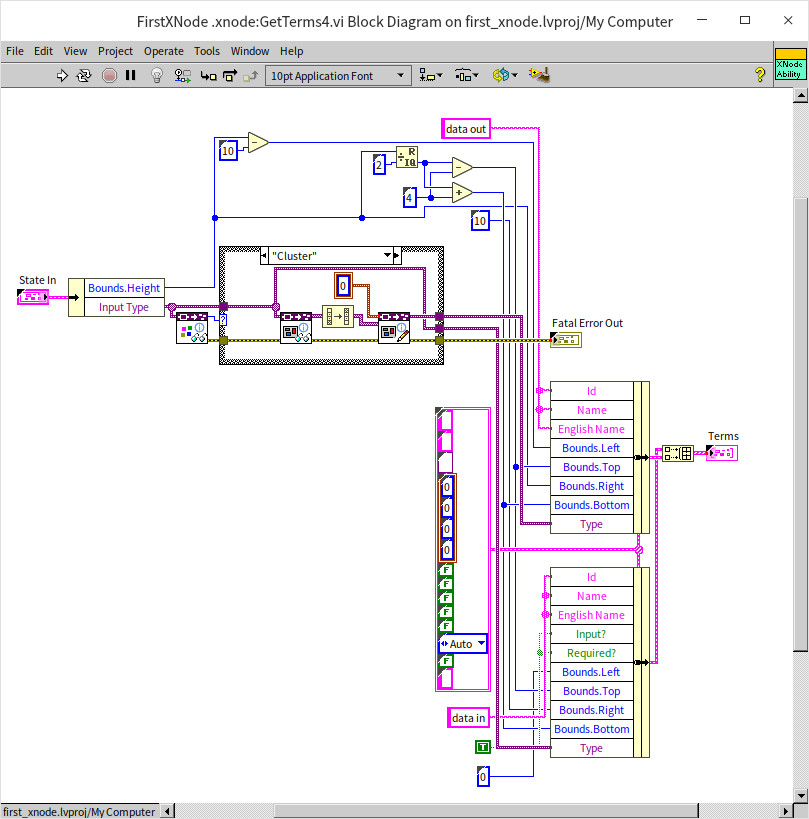

这里，我们再添加一个额外功能，如果 XNode 连接的数据类型合法（是一个簇），就把图标的哭脸改为笑脸。在 GetImage 功能 VI 中，根据当前的输入数据类型，画出不同方向的嘴巴，就实现了这一功能：


再次把这个 XNonde 拖到测试 VI 里，发现 XNode 已经可以对输入输出类型做正确的处理了：


### GenerateCode

到目前为止，我们已经完成了 XNode 的大部分与界面相关的功能。下面我们来实现它在运行时的逻辑功能。XNode 通过 GenerateCode 功能 VI 定义 XNode 运行时的逻辑。需要格外注意的是，我们不是直接在 GenerateCode 功能 VI 中实现 XNode 运行时的逻辑，而是要在 GenerateCode 功能 VI 中编写一段代码，当这段代码运行时，它又生成了一段程序，这段生成出来的程序才是 XNode 运行时调用的代码。

比如，我们设计的这个 XNode，它的运行逻辑大致应当是如下这样：


它在运行时，拿到输入的簇，松绑每个元素，然后在按照相反的顺序把所有元素捆绑成一个新的簇。那么在 GenerateCode 功能 VI 的代码中，我们就要编写一段程序，让它在一个临时 VI 的程序框图中，添加上相应的捆绑、松绑函数，然后把相应的数据线连接好。在 GenerateCode 功能 VI 中编写的代码是用来生成另一段 LabVIEW 代码的，这就需要大量依赖各种 [VI Scripting](vi_server_for_vi) 功能。

实现好的 GenerateCode 功能 VI 如下图所示：


这个功能 VI 有两个最主要的输入：

* Diagram： 是指向一个临时 VI 程序框图的引用，这个程序框图上的代码就是 XNode 在运行时回去调用的代码。有了这个引用，我们就可以使用 VI Scripting 功能在它上面编写 LabVIEW 代码了。
* Terms： 是一个数组，列出了那个临时 VI 所有的输入输出接线端（也就是 XNode 的接线端），也是为了方便我们用 VI Scripting 功能处理它们。

GenerateCode 功能 VI 的逻辑大致如下，先判断一下 XNode 当前的输入数据类型是否是簇，如果是，则在临时 VI 上创建一个送绑函数，根据 XNode 当前输入的簇的元素个数，调整送绑函数输出端的个数；类似的再创建一个捆绑函数；最后连接好所有的数据线。

这样， XNode 就可以真正的在程序里被使用了：

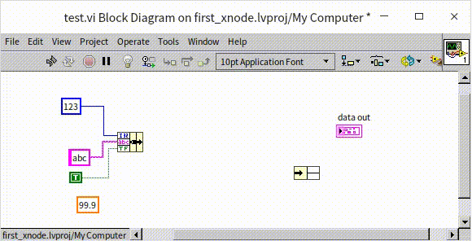

这个示例 XNode 的运行逻辑是非常简单的，所以它的全部逻辑都使用 VI Scripting 编写出来也不算太复杂。但是在大多数 XNode 项目里，需要生成的代码都比这复杂的多。如果全部用 GenerateCode 功能 VI 编程生成，会让准格尔功能 VI 过于繁琐。一个常用的简化 GenerateCode 的技巧是：先为 XNode 的运行逻辑编写好一个模板 VI，这样，在 GenerateCode 功能 VI 里可以先把所有模板中的代码拷贝到那个临时 VI 里去，再用 VI Scripting 编程进行加工，这样可以 GenerateCode 功能 VI 的代码量可以大大降低。

### Initialize

Initialize 功能 VI 用于初始化状态数据。与 XControl 不同， XNode 没有 Uninitialize （反初始化功）能 VI，所以，在 Initialize 功能 VI 中打开任何资源都要在这个 VI 中就关闭，我们可能找不到其它更适合关闭资源的地方了。


示例中的 Initialize 功能 VI 仅仅初始化了一些状态数据，如果在 State 功能控件中设置了控件的默认值，不使用 Initialize 功能 VI 也可以。

### BuildMenu5

如果希望给 XNode 添加一些菜单功能，就需要使用到 BuildMenu5 功能 VI。这个 VI 的两个最主要输入数据是菜单引用，和菜单类型。菜单类型有四种：“Operate Object Operate”可以简单理解为是鼠标左键点击产生的菜单，但是鼠标左键点击的行为是需要额外定义的，比较复杂。我们在演示里就使用了第二种“Operate Object Popup”，这是鼠标右键点击 XNode 时，LabVIEW 弹出的系统菜单，我们可以使用菜单相关的函数，对菜单里的项目进行增删。


我们为 XNode 增加了一个名为“About This XNode”的菜单项：

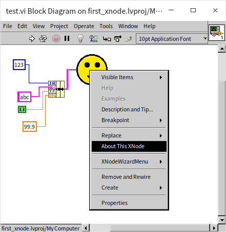

### SelectMenu5

BuildMenu5 功能 VI 只是为 XNode 增加了一些菜单项目，但是用户点击菜单后做什么事，则是在另一个功能 VI： SelectMenu5 中定义的。我们可以在 SelectMenu5 修改某些状态数据，从而完成一些复杂的操作，比如改变 XNode 的外观，增加一些接线端等等操作。在演示程序里，我们仅仅让它弹出一个对话框：

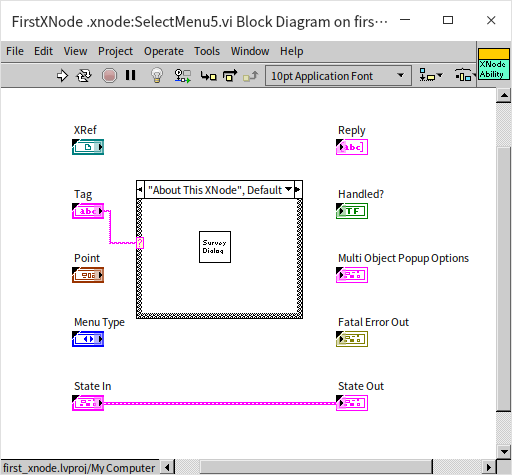

对话框可以自己编写，也可以使用 LabIVEW 自带的 VI。

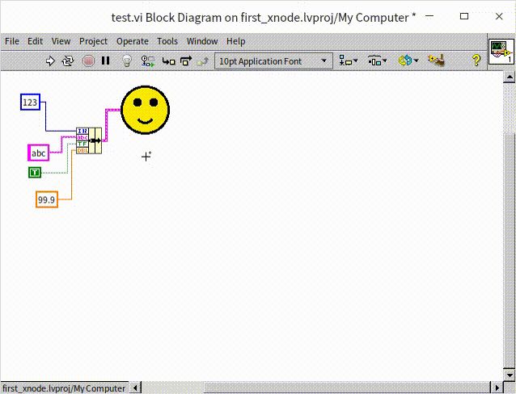

### GetDisplayName3

最后，我们再给 XNode 设置一个有意义的名字，方便搜索或阅读程序。这个功能需要使用 GetDisplayName3 功能 VI。这个 VI 有两个输出，“Type Name”主要用于搜索和查找；“Instance Name”用于显示标签。通常它们都是相同的名字。


至此，我们就已经完成了一个功能比较完善的 XNode 了。

