# XNode

:::info
This section builds on the concepts of [VI Scripting](vi_server_for_vi) and [XControls](ui_xcontrol).
:::

You might be comfortable creating subVIs, even those that support multiple datatypes using malleable VIs. But have you ever wanted to build a node that has the same level of UI integration as LabVIEW's built-in nodes? For example, a node that grows vertically when you drag its edge (like the *Bundle* node), automatically updates its terminal labels based on connected types, or compiles dynamic diagrams under the hood?

This is possible using LabVIEW's undocumented **XNode** technology.

Like XControls, XNodes are G-coded libraries that define custom editor behaviors. While XControls let you build custom front panel widgets, XNodes let you build custom block diagram nodes. Although National Instruments (NI) uses XNodes extensively to build built-in features (like the *Error Ring*, *Timed Loop*, or *Match Regular Expression* node), XNodes have never been officially released to the public. However, all the files and hooks required to develop XNodes are installed with LabVIEW. With some configuration tweaks, you can unlock this powerful macro toolkit.


### Enabling XNode Development

An XNode is physically stored as a folder containing a library (`.xnode`) and a set of **Ability VIs** (similar to XControl *Abilities*). You can place and run compiled XNodes on any block diagram without configuring LabVIEW. However, to create or edit XNodes, you must activate LabVIEW's hidden development mode to access XNode templates and wizards.

#### On Windows Systems

To enable XNode creation on Windows:
1. Open your `labview.ini` file, located in the same folder as the `labview.exe` executable.
2. Add the following lines to the end of the file:
   ```ini
   XnodeWizardMenu=True
   XnodewizardMode=True
   XTraceXnode=True
   XNodeDebugWindow=True
   SuperSecretPrivateSpecialStuff=True
   ```
3. Restart LabVIEW.

XNode development on Windows may require a special license. As an alternative, you can develop on Linux (which is what I did), or use third-party community tools such as XNode Editor to manage and package XNode files.

#### On Linux Systems

To enable XNode development on Linux:
1. Open your LabVIEW configuration file located at `/home/<username>/natinst/.config/LabVIEW-x/labview.conf`.
2. Add the following lines:
   ```ini
   XNodeDevelopment_LabVIEWInternalTag=True
   XnodeWizardMenu=True
   XnodewizardMode=True
   XTraceXnode=True
   XNodeDebugWindow=True
   SuperSecretPrivateSpecialStuff=True
   ```
3. Restart LabVIEW.

The `XNodeDevelopment_LabVIEWInternalTag=True` key adds the **XNode** item to the **File -> New** dialog:

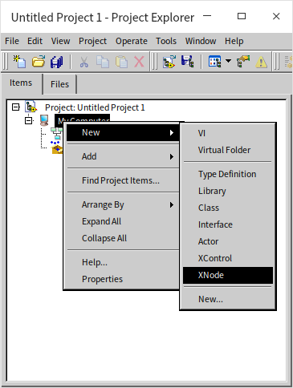


### Inspecting Existing XNodes

Many native LabVIEW nodes (such as the *Match Regular Expression* node) are written as XNodes rather than hardcoded C++ engine functions. Once you enable the XNode debug keys in your `.ini` file, right-clicking *Match Regular Expression* on a block diagram exposes the hidden **XnodeWizardMenu**:

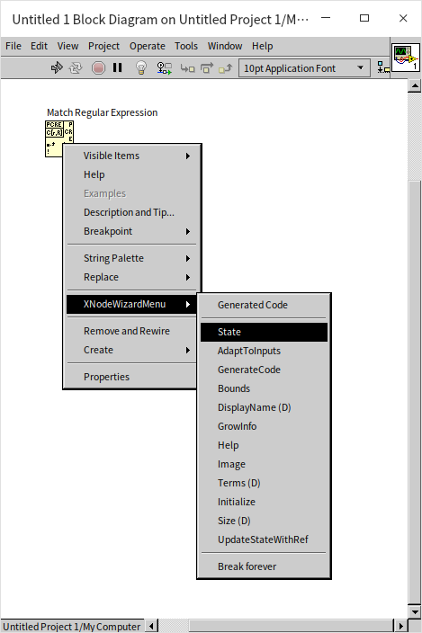

This menu lists the **Ability VIs** that define how the node behaves. Clicking an Ability opens its G diagram, which is a great way to study how NI developers implement XNodes.

Double-clicking an XNode on the diagram does not open its source code. Instead, selecting **GeneratedCode** from the **XnodeWizardMenu** opens a temporary VI showing the actual G code compiled under the hood:

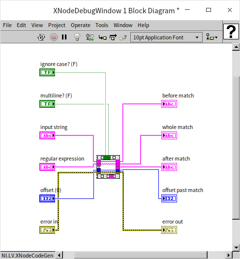

Using the **Clean Up Diagram** tool on this window shows the generated code layout:

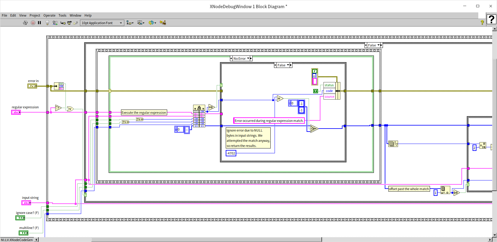

Unlike standard subVIs whose code is static, an XNode's execution code is **generated dynamically** by its Ability VIs. The code morphs on the fly depending on user settings, wiring choices, or configuration menus. Examples of G components built this way include the *Error Ring* (which serializes database codes at edit-time) and the *Timed Loop* (a structural XNode).


## Developing an XNode Step-by-Step

XNode development involves overriding built-in **Ability VIs**. XNodes have many more abilities than XControls, making them significantly more powerful but also more complex.

To demonstrate, we will build a custom XNode named `ReverseCluster.xnode` that:
1. Takes any custom cluster as input.
2. Reverses the ordering of its fields.
3. Outputs the reversed cluster.

We want this node to have a custom circular icon, support vertical stretching, handle type propagation (updating the output wire type dynamically), and expose a right-click configuration menu.

### The State Control

Create a new XNode. The project tree initializes with a single file: `State.ctl`:

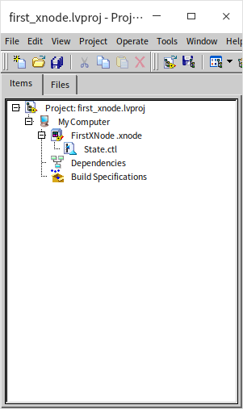

`State.ctl` is a cluster defining the XNode's persistent properties (similar to an XControl's State). Any data that needs to be shared between different Ability VIs (like the node's dimensions, terminal types, or configuration settings) must be added here. LabVIEW automatically serializes this cluster and stores it inside the block diagram caller at edit-time. We will leave it empty for now and add fields as needed.

If we drag this bare XNode onto a test VI's block diagram, it shows up as an empty square:

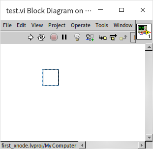

The test VI compiles and runs without errors, though the empty node does nothing.

> [!IMPORTANT]
> **XNode Development Loop:** When an XNode instance is placed on a test VI block diagram, LabVIEW locks its `.xnode` library to prevent code conflicts. You must delete the XNode instance from your test diagram before editing its Ability VIs, and then drag it back on to test your updates.


### Sizing the Icon: `GetBounds`

A standard subVI icon is fixed to $32 \times 32$ pixels. XNodes support dynamic sizing. We use the **GetBounds** Ability VI to declare the node's dimensions.

Right-click the `.xnode` library in the Project Explorer and select **Add -> Ability**:

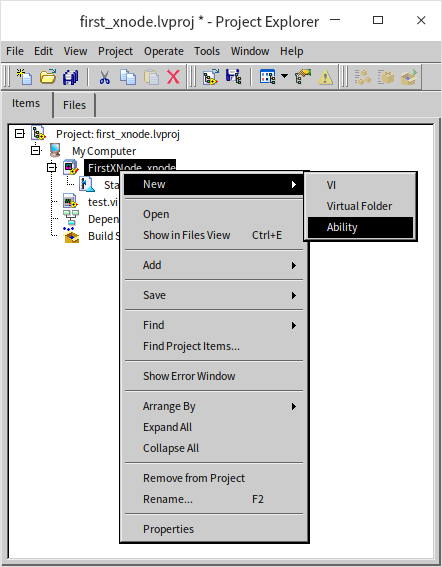

Select **GetBounds** from the dialog:

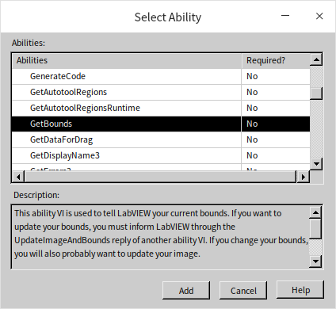

Open `GetBounds.vi`. The VI has a single output cluster named **Bounds**. We configure this to return a size of $64 \times 64$ pixels:

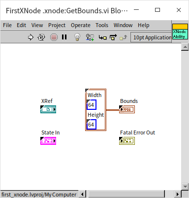

Drag the XNode onto your test diagram; the square is now enlarged:

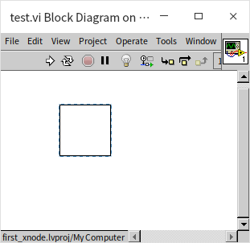

> [!CAUTION]
> Ability VIs are system macros called exclusively by the LabVIEW compiler. Do **not** modify their input/output controls or connector pane layouts. You should only edit their block diagrams to implement your custom logic.


### Drawing the Icon: `GetImage`

To replace the empty square with a visual icon, add the **GetImage** Ability.

The `GetImage` output is a picture datatype. You can load an image from a file, but for nodes whose icons change dynamically based on connected wires (like the *Bundle* node displaying labels), the icon must be drawn programmatically at runtime.

We will use LabVIEW's built-in 2D Picture VIs to draw a facial icon:

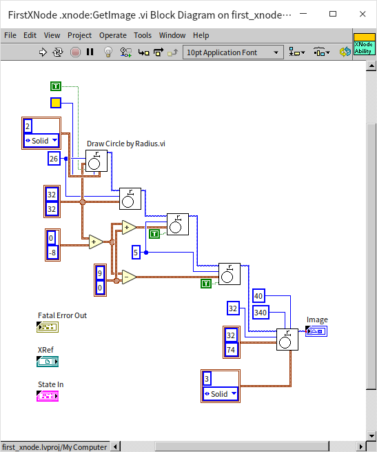

Now, the XNode displays a circular face:

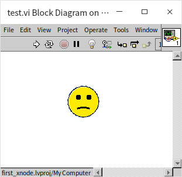

When selected on the block diagram, the selection border matches the circular face. G automatically handles transparent edges for irregular icon shapes.


### Resizing Behaviors: `GetGrowInfo`

To let users resize our node by dragging its corners, we implement the **GetGrowInfo** Ability:

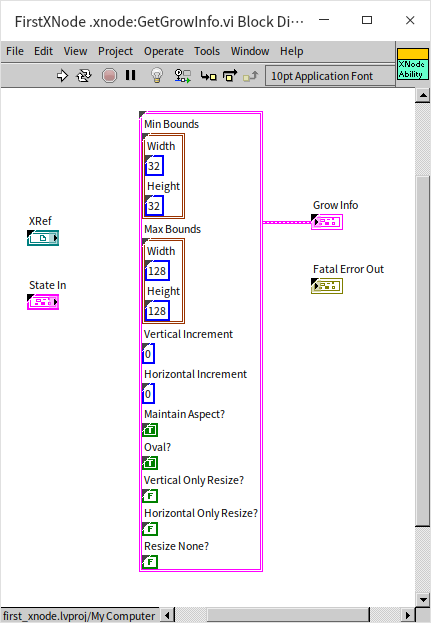

The output cluster properties define resizing constraints:
- **Min Bounds / Max Bounds:** The boundary limits for the node.
- **Vertical / Horizontal Increment:** The snap grid size in pixels during resizing. For nodes like *Bundle* that grow by adding terminals, this increment should match the height of a single terminal (typically $18$ pixels). For smooth scaling, leave it at $1$.
- **Maintain Aspect?:** Set to `True` to force the node to scale as a perfect circle.
- **Oval?:** Set to `True` so the resizing guideline outline is an ellipse/circle rather than a rectangle.
- **Vertical / Horizontal Only Resize:** Restricts dragging directions.

Hovering over the XNode in the test VI now shows resize handles:

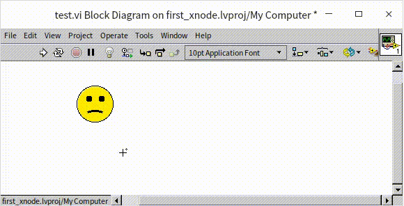

However, releasing the mouse snaps the node back to its original size. `GetGrowInfo` only configures the UI guidelines; we must write code to update the node's internal state when a resize event occurs.


### Handling Resize Events: `OnResize2`

To capture the resize event, implement the **OnResize2** Ability.

When the user drags the resize handles, `OnResize2.vi` runs automatically. It receives the new rectangular **Bounds** chosen by the user. We must save these new dimensions to the XNode's persistent `State.ctl` cluster.

Open `State.ctl` and add a `Bounds` field:

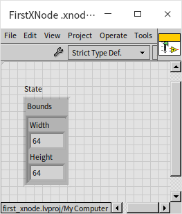

Next, update `OnResize2.vi` to write the new size to the `State Out` terminal:

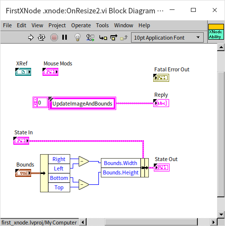

The `Reply` output must return the instruction `"UpdateImageAndBounds"`. This tells the LabVIEW engine to run `GetBounds.vi` and `GetImage.vi` immediately after the resize operation completes.

Now update `GetBounds.vi` to return the size saved in the state:

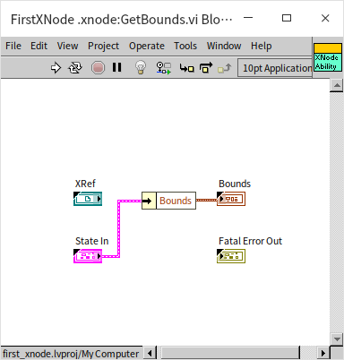

Finally, update `GetImage.vi` to calculate coordinates dynamically based on the current state dimensions rather than hardcoded bounds:

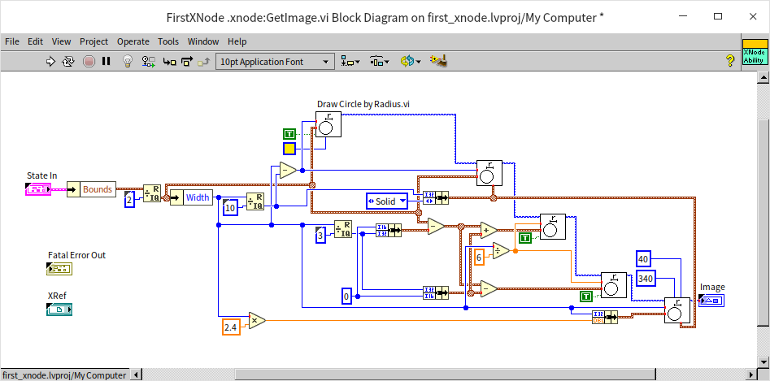

Now, dragging the node's handles scales the icon graphic in real-time:

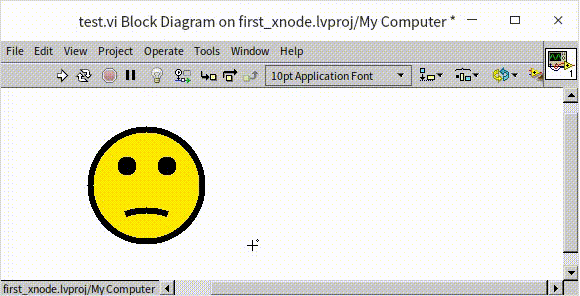


### Defining Terminals: `GetTerms4`

To turn our graphic icon into a functional block diagram node, we must add connection terminals using the **GetTerms4** Ability:

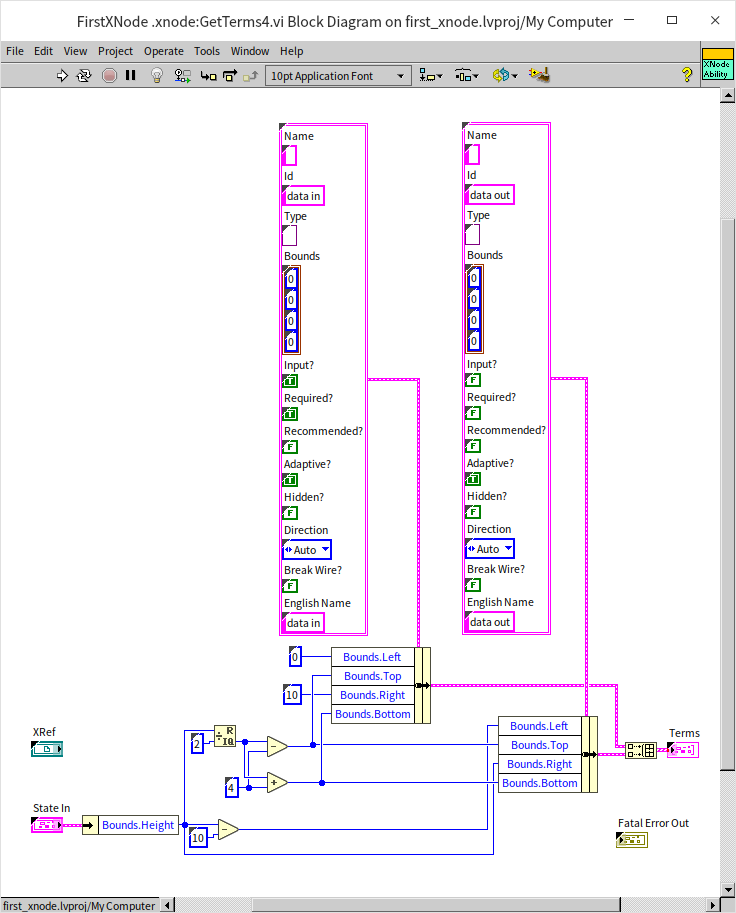

`GetTerms4` outputs an array of terminal configuration clusters. Each cluster contains:
- **Name:** The label of the terminal.
- **Id:** A unique string used by other Ability VIs to refer to this terminal.
- **Type:** The G data type of the terminal.
- **Bounds:** The coordinate position of the terminal relative to the icon's top-left corner.
- **Input?:** True for inputs, False for outputs.
- **Required?:** True if the compiler should throw an error if the terminal is unwired.
- **Adaptive?:** If True, G automatically resolves the terminal type based on the wired input.
- **Break Wire?:** If True, G breaks the wire if the datatype is invalid.

We configure two terminals: an input terminal on the left and an output terminal on the right:

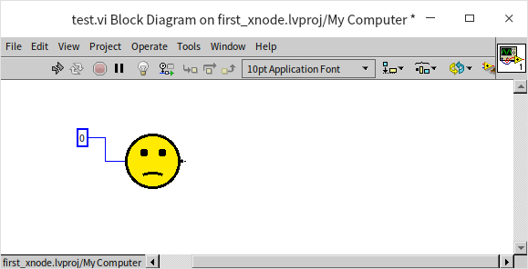

The input terminal is set to `Adaptive = True` so it can accept any data structure. However, how do we make the output terminal dynamically match the input type?


### Wiring Type Propagation: `AdaptToInputs`

When the user wires a data type to an XNode terminal, G calls the **AdaptToInputs** Ability.

`AdaptToInputs.vi` receives the data types of all currently wired inputs. To propagate the type from input to output, we must save the input type structure into `State.ctl`:

1. Add a `TypeInfo` field of type **Variant** to `State.ctl`:

   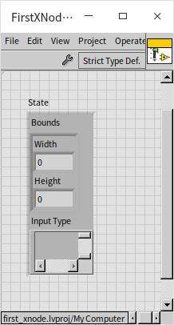

2. Implement `AdaptToInputs.vi` to extract the incoming type from the input terminal and save it to the state. The `Reply` output must return `"UpdateTerms"` to force G to redraw the terminals:

   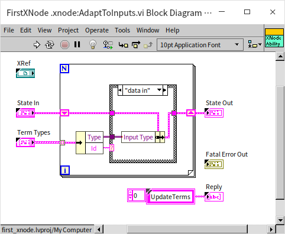

3. Modify `GetTerms4.vi` to read the data type saved in the state and apply it directly to the output terminal instead of hardcoding a type:

   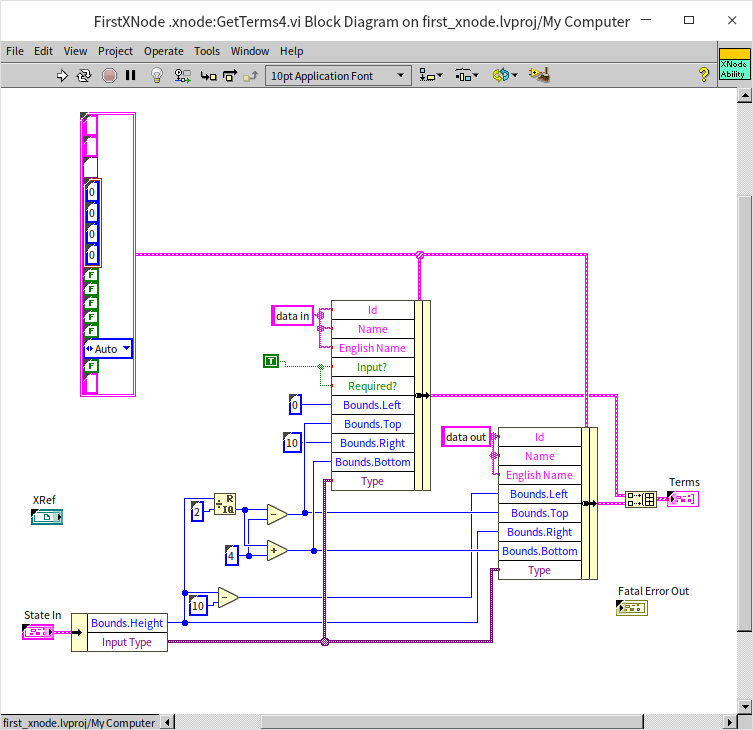

Now, the output wire dynamically matches whatever type is wired to the input:

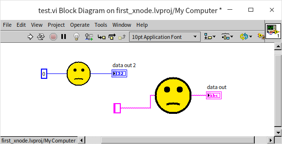

Next, we enforce our custom constraints. Since our node is designed to reverse clusters, it should only accept cluster inputs:
1. In `AdaptToInputs.vi`, use `Get Type Information.vi` (from the variant parsing palette) to verify if the input is a cluster. If it is not, store a null type to break the wire. We also return `"UpdateImageAndBounds"` to update the face graphic:

   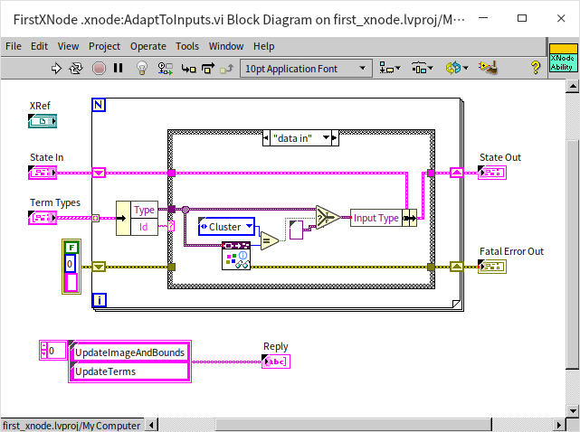

2. In `GetTerms4.vi`, retrieve the cluster type from the state. Call `Get Cluster Information.vi` to get the list of element types, reverse the array order, and construct the output cluster type using `Set Cluster Information.vi`:

   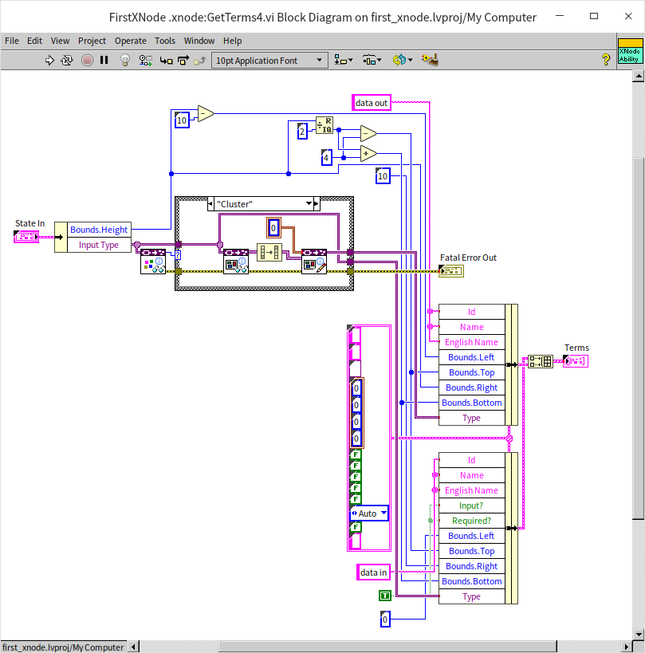

3. In `GetImage.vi`, update the facial expression. If the state contains a valid cluster, draw a smile; otherwise, draw a frown:

   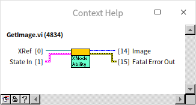

Now, if we wire a non-cluster to our node, the wire breaks, and the face frowns. If we wire a cluster, the wire compiles, the output cluster type is dynamically reversed, and the face smiles:

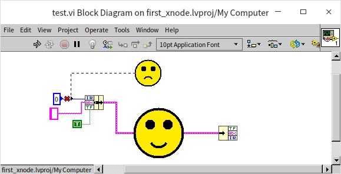


### Generating Code: `GenerateCode`

Now, let's implement the node's core execution behavior. The execution block diagram is compiled dynamically using the **GenerateCode** Ability.

Unlike a standard VI where you write the runtime code directly, in an XNode you write **meta-code (scripting code)**. When the caller VI is saved or compiled, G executes `GenerateCode.vi`, which runs scripting routines to assemble the block diagram of a hidden temporary subVI.

Our node's runtime execution logic is conceptually equivalent to unbundling a cluster and rebundling it in reverse order:

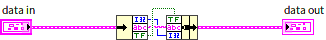

In `GenerateCode.vi`, we use **VI Scripting** nodes to instantiate the *Unbundle* and *Bundle* primitives, set their terminal counts based on the number of elements in the cluster, and wire the terminals in reverse:

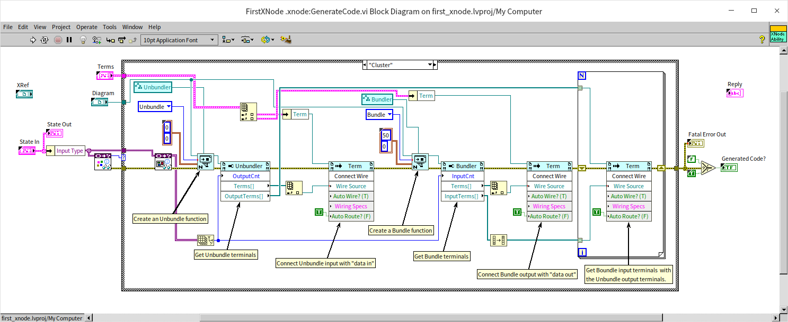

`GenerateCode.vi` takes two main inputs:
- **Diagram:** A G refnum to the block diagram of the hidden temporary subVI.
- **Terms:** An array of references to the XNode's physical terminals.

The scripting code creates the G primitives on the temporary diagram, matches the terminal wires, cleans up the layout, and compiles the code.

Now our XNode is functional. Wiring a cluster to the input and running the VI correctly outputs the reversed cluster:

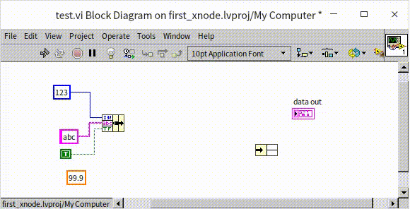

> [!TIP]
> Scripting complex block diagrams from scratch using pure G scripting nodes can result in massive, unmaintainable Ability VIs. For complex code generation, write a **template VI** first. In `GenerateCode.vi`, you copy the template's diagram block directly into the temporary VI and use scripting only to adjust the type connections.


### Initializing State: `Initialize`

The **Initialize** Ability runs when the XNode is first loaded or placed on the diagram. It is used to initialize state data or load external DLL files.

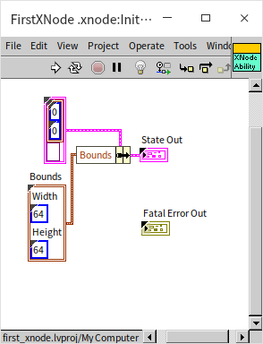

> [!WARNING]
> Unlike XControls, XNodes do not have an *Uninitialize* Ability. If you open files, instrument connections, or DLL sessions inside `Initialize.vi`, you must close them before the VI completes, or manage their lifecycles carefully to avoid resource leaks.


### Custom Context Menus: `BuildMenu5` and `SelectMenu5`

To add custom context menu items (such as an "About" dialog or a quick configuration option) when right-clicking the XNode, implement the **BuildMenu5** and **SelectMenu5** Abilities.

`BuildMenu5.vi` receives a reference to the right-click menu. We use menu APIs to append our custom items (e.g., "About This XNode"):

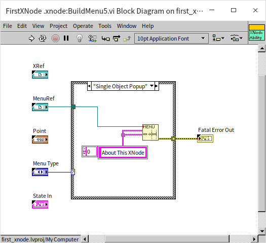

The item appears in the right-click menu when placing the node:

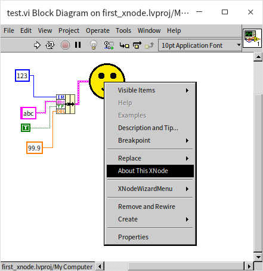

When the user clicks our custom menu item, LabVIEW triggers `SelectMenu5.vi`. We read the menu item tag and execute our action (in this case, displaying a pop-up dialog):

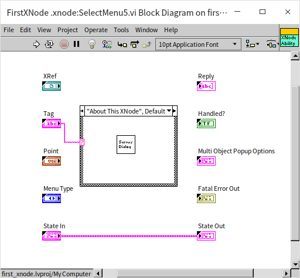

Selecting the item runs the popup successfully:

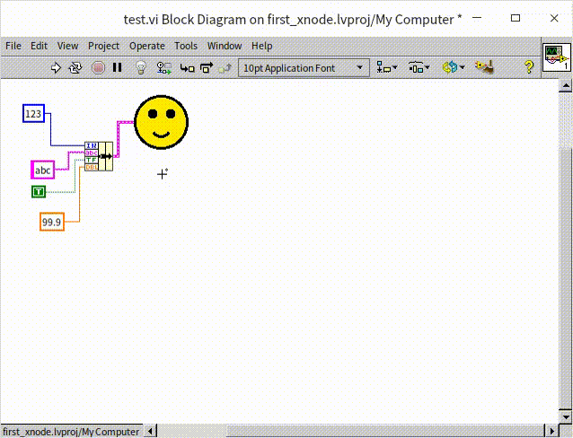


### Naming the Node: `GetDisplayName3`

To give the XNode a friendly display name (for searches or hover help), implement the **GetDisplayName3** Ability:

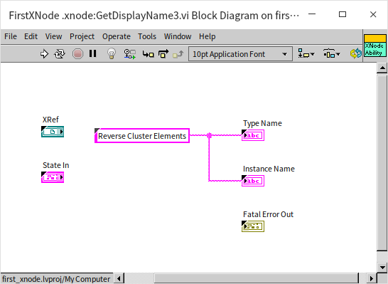

This returns the default Type Name and Instance Name.

We have successfully built a fully custom, type-propagating G macro using XNodes!
