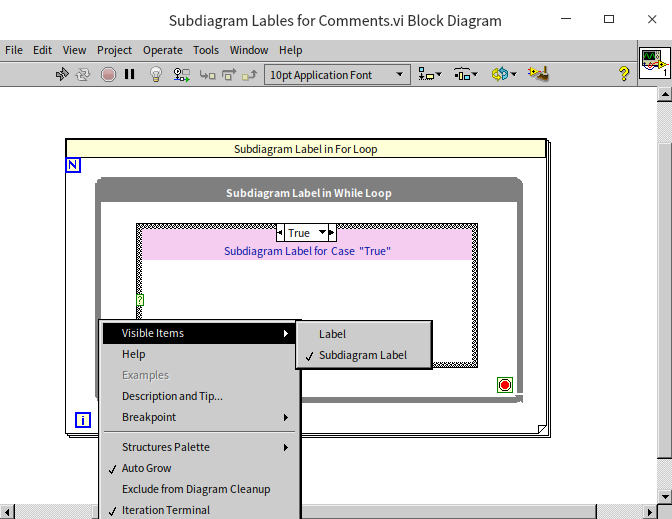
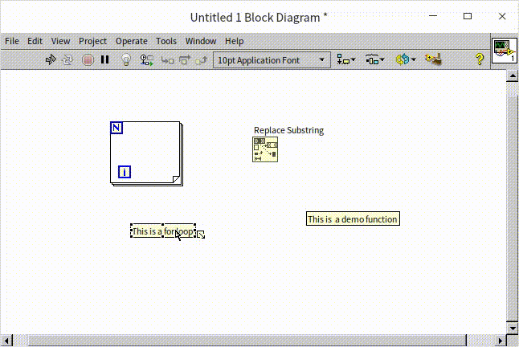
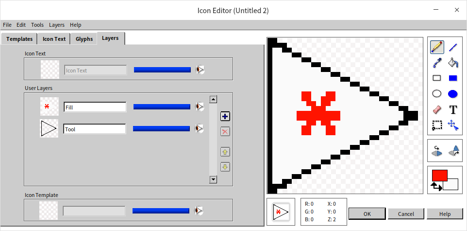

# Coding Standards and Techniques

Writing code goes beyond just ensuring it runs correctly; it's also important for the code to be readable and maintainable. Codes that are considered to have good readability and maintainability share several common traits. Indeed, this book has focused on how to craft elegant and robust code for specific problems across various chapters. Here, we'll introduce some more universal standards and techniques for code writing.

## Concise Block Diagrams

For a program to be easily understood, it must be concise. If a program's block diagram contains only four or five subVIs or functions, along with one or two structures, then its contents are generally easy to grasp at a glance. On the contrary, if a diagram is cluttered with dozens of subVIs, functions, and nested loops and conditional structures, crisscrossed by data wires, it can quickly become overwhelming and difficult to decipher.

In an ideal scenario, a VI's block diagram should only include four or five subVIs or functions and one or two structures. Moreover, this diagram should conform to common programming structures or patterns, making it immediately obvious whether it utilizes a state machine structure, an event-driven loop, or something similar. Readers typically have some familiarity with these common structural patterns, which can significantly speed up understanding when they can apply their existing knowledge.

A complex function cannot likely be achieved with merely four or five functions. Thus, it's advisable to break down large functions into multiple subVIs: the main VI is composed of four or five subVIs, each containing a few functions or even lower-level subVIs, and so on.

Differing from text-based languages, in LabVIEW, not only should code meant for reuse be made into sub-functions, but also overly large or complex code segments should be split into subVIs to enhance readability, even if they aren't intended for reuse elsewhere. In a project where each subVI encapsulates a modest amount of code, it will certainly be more comprehensible. However, this method may also introduce some disadvantages.

Firstly, the concern about an excessive number of subVIs potentially affecting program execution efficiency is common among programmers. Indeed, using subVIs does incur some extra computational resources, but this overhead is minimal and can usually be neglected in most cases. If program efficiency is a critical concern, such that even the slight overhead from subVIs needs to be eliminated, programmers can still develop using subVIs normally during the development phase to maintain code readability. However, for the final release, leveraging VI Scripting capabilities to merge all subVIs into the main VI can ensure the released program consists solely of the main VI, eliminating subVIs to enhance execution efficiency.

Secondly, having many layers in a program could make reading the entire code challenging. However, in team settings, each programmer typically handles only a small segment of a project. They are primarily focused on the project's overall structure and the specifics of their assigned segment, with less concern for the minutiae of other parts. Therefore, the more detailed the division into modules and layers within a project, with an increased number of subVIs, the easier it becomes for programmers to understand the general workflow and maintain their specific code segment.

The above describes an ideal scenario. In practice, creating subVIs also takes additional programming time, leading programmers to prioritize immediate coding speed over optimizing program style. To accelerate development, programmers might even sacrifice code maintainability, reasoning that they may not be the ones maintaining the code in the future, and that currently, writing speed is more likely to receive commendation from supervisors than code style.

Thus, when setting coding standards, a balanced approach can be adopted. Each subVI can be slightly more complex, including more nodes, but the complexity of the block diagram should not exceed what can fit on a single screen. Considering the size of contemporary monitors, a VI's block diagram should not exceed the display area, allowing all code to be visible without scrolling.

Many beginners attempt to maximize the content on the block diagram by opting for a full-screen display. However, when developing large programs, it often becomes necessary to view the VI's front panel and subVI block diagrams simultaneously. Maximizing a VI's block diagram window makes it inconvenient to view other windows simultaneously. Therefore, it is advisable to keep the VI's block diagram window to no more than two-thirds of the screen size.

## Layout and Wiring

Two block diagrams with identical content can vary significantly in readability, largely influenced by the layout of nodes and the organization of wires. Generally, programs with orderly layouts and consistent wiring directions are easier to read and understand than those that are cluttered and chaotic.

Key considerations for arranging a block diagram include:

- All wires on the block diagram should run from left to right, reflecting the natural flow of data in this direction. This left-to-right orientation aligns with the most intuitive reading habit.
- There should be a primary data line traversing the diagram from left to right. This line often represents crucial data, such as file references, instrument connections, or class instances. Having this main line allows others to more easily navigate and comprehend the code.
- Efforts should be made to minimize wire bending and crossing. Theoretically, since data flows from left to right, wires should ideally run parallel to each other.

The example below shows a program block diagram that is exceptionally easy to read due to its well-organized wiring:

Arranging the nodes and wires on a block diagram neatly can be time-consuming and somewhat cumbersome. Fortunately, LabVIEW offers an auto-arrange feature for block diagrams, serving as a great convenience for those looking to streamline the process. By clicking the "Clean Up Diagram" button on the VI block diagram window toolbar, the block diagram is automatically organized. This feature adjusts the positions of nodes and wires without changing the program's logical relationships, enhancing readability and neatness. Consider this cluttered block diagram:

After utilizing the "Clean Up Diagram" button, it transforms into the neatly organized block diagram shown below:

However, this automated tool, despite its usefulness, cannot outperform the nuanced adjustments a human can make. While the reorganized block diagram is significantly tidier than its original form, it still doesn't match the aesthetic quality of a manually adjusted diagram.

## Comments

Adding textual explanations to your code is crucial for helping others quickly grasp the program logic or specific implementation methods. In LabVIEW, the following practices should be implemented when adding textual explanations:

* Utilize meaningful names for controls and constants.
* Show labels on nodes and use descriptive text.
* Design meaningful icons for subVIs.

Nodes and structures on the block diagram, much like controls, come with labels, which by default are not shown. For LabVIEW structures, it's advised to use Subdiagram Labels for adding annotations. Right-click the structure and navigate to "Visible Items -> Subdiagram Label":

A text area will appear above the structure for you to write comments specific to that diagram. You can adjust the background and font color of this area as needed.

Using labels for annotations offers two main advantages: firstly, it facilitates the unification of comment style across the project; secondly, comments will always maintain their relative positioning to nodes and structures, avoiding disarray from code layout adjustments.

If labels and structure tags still fall short—for instance, in programs meant for educational or demonstration purposes that require more detailed explanations—you can place text annotations directly on the block diagram for in-depth comments.

Comments should ideally be positioned close to the node or wire they refer to. If the comment is too lengthy and to prevent disrupting the normal code flow, you might need to place the comment further away from its related node or data. For making annotations more prominent and intuitive, you might opt for one of the following two annotation styles.

The first method uses arrows to specify the nodes or data targeted by the comments, as illustrated below:

LabVIEW's text labels include built-in arrows, so no additional arrow graphics are needed. When you hover the mouse over a text label, a small icon appears at the label's bottom right. Dragging this icon extends an arrow (as shown in the following image). Pulling this arrow towards the node or structure you intend to comment on anchors the arrow there. This ensures that even if you move the node or the comment label, they remain linked.

The second method links comment text and the commented node or data using numbers, as shown in the image below:

It's advisable to use the text label's built-in arrow to anchor comments directly to the node being discussed.

There's a limitation to using text labels for comments: their arrangement can be disrupted by the "Clean Up Diagram" tool. This can lead to misplaced comments within the program. In LabVIEW, text labels and diagram elements such as nodes and wires do not share a logical relationship. The "Clean Up Diagram" tool, unaware of their interconnected content, may alter node positions during diagram organization, consequently affecting the placement of comments. Text labels with anchored arrows are usually relocated to appropriate positions, but unanchored labels may end up in completely unrelated areas.

## Using Type Definition

"Cluster" data types are a common occurrence. In larger programs, the same type of cluster data might be utilized across multiple subVIs. For example, a program designed to store experimental data could use the "Experiment Info" data type in several VIs. "Experiment Info" is a cluster composed of elements like "Experiment Name" and "Experiment Date".

During development, it might become evident that the cluster data type needs modification. Initially consisting of just two elements, the program may require the addition of an "Experiment ID" for further detail:

Since this data type is prevalent across multiple subVIs, any alteration necessitates corresponding updates in all VIs that use this cluster. Such updates are not only cumbersome but also fraught with the risk of overlooking certain instances, potentially introducing latent errors into the program.

Creating a [type definition](data_custom_control#type-definition) for such datasets is the solution. Similar to [custom controls](data_custom_control#custom-control), type definitions are stored in .ctl files. Their creation mirrors that of custom controls, with the distinction lying in setting the control type to "Type Definition" or ["Strict Type Definition"](data_custom_control#strict-type-definition). Within the program, utilizing this .ctl file equates to employing an instance of this custom control or type.

Custom controls and their instances lack any direct linkage. For example, if you create and save a stylish button as a custom control, adding an instance of this user-defined control to a VI's front panel is achieved by dragging or opening the .ctl file. Once instantiated, this instance becomes independent of the original custom control. Modifications to either the instance or the original control have no impact on one another.

Instances of type definitions and strict type definitions are generated in VIs similarly to custom controls. However, the key difference is the linkage between type definition (and strict type definition) and their instances. For instance, creating a type definition for a numeric data type means all its instances will be numeric. Changing the data type to string within the type definition file causes all its instances to automatically convert to string types.

For strict type definitions, the connection extends beyond data types to include the control's properties with their instances. These properties, like the control's color, size, and options in enumeration or dropdown list controls, remain synchronized.

For example, using a type definition where the control is a text dropdown list with a U16 numeric data type, containing options such as "Item One" and "Item Two". Adding "Item Three" in the type definition doesn't affect existing instances if the data type remains U16; they continue to display only the original two items. However, with strict type definitions, all instances automatically update to include the new option.

LabVIEW often requires adjustments to certain data types and their properties during development, like clusters, enumerations, dropdown lists, combo boxes, arrays, and waveforms. To simplify these modifications, strict type definitions should be created whenever such data types are encountered. strict type definitions should also be used when a uniform appearance across all control instances is desired.

## Connector Pane

To keep the block diagram wiring tidy, all subVIs should ideally adhere to a uniform connector pane layout.

For example, it might be stipulated that all VIs within a program adopt a 4224 pattern:  (the pattern is named for the count of terminals in each column). For all VIs, input parameters are represented by the six terminals on the left side of the connector pane, while output parameters use the terminals on the right side. SubVIs are typically represented by their icon on the block diagram, but their connector panes can be displayed: right-click on the subVI icon and select "Show Terminals".

In the program illustrated below, all subVIs consistently use the 4224 connector pane pattern. This uniformity ensures that terminal positions for each VI are fixed. Between two subVIs, terminals on the same row will have the same relative height. Therefore, connecting them with data wires ensures straight lines without any bends.

If subVIs on the block diagram each utilize different connector pane patterns, aligning their terminals at the same height becomes difficult, leading to wires with inevitable bends, as shown below:

The 4224 pattern offers a total of 12 terminals. If a VI's parameters (inputs and outputs) exceed 12, this pattern becomes impractical. In practice, it's advised to limit a VI's parameters to no more than 8. Exceeding this number not only complicates the use of the VI but also affects the readability of the code that calls it. Identifying among a dozen or more data wires in a subVI can be quite taxing for readers.

Should a VI require managing a large volume of data, consider merging similar or related data into an array or cluster to decrease the parameter count. Or, explore alternative methods for data exchange between VIs, such as employing global variables.

The arrangement of terminals on the connector pane should mirror the positioning of their corresponding controls on the VI's front panel. This design choice helps readers intuitively grasp the connection between terminals and controls. For instance, in the VI shown below, the terminal layout on the connector pane precisely matches the control layout on the front panel. This clarity allows readers to instantly recognize that the second terminal in the first column on the connector pane corresponds to the "AC Filter Bandwidth" parameter.

## Icons

Icons are a crucial part of VIs, and thoughtfully designed icons can significantly enhance the readability of a program. Here are some key considerations for designing VI icons:

**Avoid Default Icons**: Default icons result in a block diagram where all subVIs appear identical, making it difficult to differentiate between them.

**Prefer Graphics Over Text**: Humans process visuals much faster than text, making graphical icons not only more visually appealing but also quicker to identify. Sometimes, developers may struggle to find an appropriate icon and opt for text instead. This defeats the purpose of icons, as the name of the subVI or comments are already text-based. While temporary or internal VIs might use text on their icons, VIs released to users should always have meaningful graphical representations.

**Unified Style for Related Icons**: Icons within the same functional module or library should have a consistent style to indicate their relationship at first glance. This consistency can be in color schemes or shared design elements, such as the same labels or graphics. Below are two examples: the first set is from an instrument driver program featuring a common red "AG34401" label; the second set includes LabVIEW VIs for configuration file processing, all adorned with a consistent file icon.

LabVIEW icons can be up to 32×32 pixels in size, which is the standard dimension. Usually, the default size suffices for most applications. However, icons can also be designed in other sizes or irregular shapes. In specific scenarios, uniquely shaped icons can add aesthetic value to a LabVIEW block diagram. Here are two examples where such an approach is beneficial.

## Creating Irregularly Shaped SubVI Icons

Typically, SubVI icons are square. However, for aesthetic and readability purposes, it might be necessary to display SubVIs as irregular shapes on their parent VI's block diagram. Many of LabVIEW's built-in functions, such as arithmetic operations, do not adhere to the regular 32×32 square icon format. In applications, SubVIs can also adopt non-square shapes, such as the triangular icon for My Function.vi illustrated below.

When modifying a SubVI's icon to an irregular shape, several considerations are important. Firstly, selecting an appropriate connector pane pattern is crucial. The default 4224 pattern usually doesn't suit irregular icons. For instance, My Function.vi requires a centrally located output terminal, a requirement that the symmetrically distributed terminals of the 4224 pattern cannot fulfill.

By right-clicking on the icon in the VI's front panel and selecting "Show Connector", followed by another right-click to choose "Pattern", you can select a suitable pattern. For My Function.vi, the 52225 pattern would be suitable, as shown below:

The next phase is the crucial task of editing the icon. Key considerations include:

- Avoid adding a border to the icon.
- If using the old [Icon Editor](ramp_up_complex_vis#polishing--icons), ensure the three colored icons in the editor are consistent.

The image below showcases LabVIEW's old-style icon editor, with three small squares in the center representing the icon in black and white, 16 colors, and 256 colors. Clicking one of these squares opens the editing area for that color scheme on the left.

Since modern displays support more than 256 colors, the 256-color icon is what will primarily be seen on the block diagram; only on older displays with fewer colors, such as 16-color displays, would the 16-color icon be utilized. However, 16-color displays are virtually extinct, rendering the 16-color icon generally unused. While black-and-white displays are even rarer, the black-and-white icon plays a crucial role in defining the icon's outline. Therefore, a black-and-white icon that matches the 256-color icon's shape is necessary for crafting an irregularly shaped icon. Usually, clicking the "Copy from 256 colors" button to copy the 256-color icon into the black and white area suffices.

When creating an irregular-shaped icon, it's recommended to enable "Show Connectors" to visualize the connector pane pattern within the icon editing area. This ensures the icon's shape aligns with the connectors properly. For instance, to connect an output data terminal at the right side's center, the icon's shape must extend over that terminal.

The new icon editor has completely eliminated black-and-white and 16-color icons, allowing for straightforward creation of irregularly shaped icons:

### Hiding Large Cluster Constants on the Block Diagram

During the development of certain programs, you might come across situations like the one illustrated below: using an extremely complex data type constant. This constant, due to its large size, makes the block diagram visually unappealing, regardless of layout. So, how can we modify this program to enhance its aesthetic appeal?

To address this, the objective is to conceal the constant within the main block diagram. Typically, there are two methods to achieve this:

The first method involves converting the constant into a control and then hiding the control. While straightforward, this approach has its downsides. Firstly, it may cause confusion, as controls generally indicate incoming values, leading others to wonder about the source of the value; secondly, modifying an element within the cluster constant can be cumbersome.

The second method entails hiding it within a deeper subVI. The steps are as follows:

As depicted below, start by establishing a strict typedef for the complex data type.

Next, create a new VI, placing the bulky constant within this VI, and create a display control of the same type to pass its value out. The VI's connector pane should adopt the 4224 pattern, with the third terminal in the fourth row used to output the VI's single data point, as illustrated below:

This VI's icon should be designed to be small and visually appealing, as shown below:

Drag this newly created constant data VI onto the block diagram, connect its output to where the original constant was connected, and position it properly. Does this revised block diagram look much more attractive?

### VI Analyzer

Actually, there are many standards to consider while programming. It can be quite challenging for programmers to memorize all these standards and apply them during coding consistently. Inevitably, oversights can occur, necessitating a means to identify these lapses. LabVIEW's "VI Analyzer" tool serves to detect errors or stylistic issues within program code effectively.

The "VI Analyzer" boasts a wizard-like interface, activated by selecting "Tools -> VI Analyzer -> Analyze VIs" from the menu. Simply follow the prompts step by step to analyze your VIs.

This tool scrutinizes each VI being tested against predefined standards, checking for issues like spelling errors and proper alignment of controls. These checks or test items are available as plugins, and users have the option to craft custom check plugins. All test plugins reside in the `[LabVIEW]\project\_VI Analyzer\` folder.

Without the "VI Analyzer Toolkit" installed, your computer may not have any plugins. This Toolkit enriches the "VI Analyzer" with capabilities to check VIs for common issues.

Below are three key steps in the "VI Analyzer" wizard interface, illustrated through screenshots.

Firstly, select the VIs for testing within the "VI Analyzer" (shown above). You can opt for all VIs within a project or select a directory to analyze all VIs contained within. For this example, all VIs under the `[LabVIEW]\examples\xml` path are chosen for analysis.

Next, decide which tests to conduct on the VIs (shown above). Some test items might not be crucial; for instance, concerns regarding arrays or string operations within loops can be overlooked. Simply by unchecking these items, they won't be subjected to tests.

Upon completion, the "VI Analyzer" displays all detected issues (shown above). While many flagged issues might be false alarms or minor, it's advisable to ignore these. Problems highlighted with red exclamation points are considered serious, whereas blue exclamation points mark less critical issues. These warrant special attention. The "Explanation" column in the results window offers detailed descriptions of the issues.

If the explanations remain unclear, double-clicking an entry prompts LabVIEW to automatically open the problematic VI and highlight the area of concern (shown above).