# Coding Standards and Style

Writing high-quality code is about more than just correctness; readability and maintainability are equally critical. Clean, well-structured code is easier to debug, extend, and share. Throughout this book, we have discussed patterns for specific coding problems. In this section, we present universal style guidelines and standards for LabVIEW programming.

## Concise Block Diagrams

A readable Block Diagram must be concise. If a diagram contains only a few SubVIs, native functions, and one or two structures, it is easy to understand at a glance. Conversely, a diagram crammed with dozens of nodes, deeply nested loops, and a spaghetti-like web of overlapping wires is extremely difficult to decipher.

Ideally, a high-level VI should contain no more than five to ten major nodes and follow a recognizable design pattern (such as a Queued Message Handler, State Machine, or Event Loop). When other developers recognize a familiar structural pattern, they can immediately understand the application flow without tracing every wire.

Of course, complex logic cannot be built using only five nodes. The solution is modularization: partition your logic into hierarchy layers. The top-level VI should delegate tasks to several mid-level SubVIs, which in turn contain lower-level SubVIs or primitive functions.

Unlike text-based languages, where code is typically only modularized into helper functions for reuse, LabVIEW developers modularize code *solely to manage visual complexity*. Even if a block of code will only be called in one place, wrapping it into a SubVI is highly recommended if it improves Block Diagram readability. Keeping VIs visually compact makes the project far easier to maintain. However, this hierarchical approach does introduce some concerns:

- **Performance Overhead**: A common concern is that deep SubVI call stacks introduce function-call overhead. While calling a SubVI does consume some CPU cycles (for thread switching and memory allocation), this overhead is negligible (typically sub-microsecond) in most applications. If your code operates in a highly execution-critical loop (such as real-time control loops), you can make the SubVI **reentrant** or configure it to **inline** the SubVI into the calling VI (via **VI Properties >> Execution >> Inline subVI**). Inlining completely eliminates the call overhead while preserving the visual modularity of the source code.
- **Navigation Complexity**: Too many layers can make tracing code flow tedious, as developers must continuously double-click to drill down into sub-VIs. However, in large projects, modular encapsulation is essential. It allows developers to work on a specific component using defined APIs without having to understand the low-level implementation details of the rest of the application.

In practice, developers sometimes prioritize raw speed over layout quality, leading to "spaghetti code". However, sacrificing style for speed is a false economy: poorly organized code takes significantly longer to debug and test. Investing time in proper layout and modularity pays off almost immediately.

As a rule of thumb, **a VI's Block Diagram should fit entirely on a single screen**. Developers should not have to scroll horizontally or vertically to see the entire logic of a single VI. If a diagram exceeds one screen, it is a clear sign that some code block should be factored out into a SubVI.

Additionally, avoid maximizing the Block Diagram window to fill the entire monitor. When coding, you frequently need to view the Front Panel, parent VIs, or project explorer side-by-side. Resizing your Block Diagram window to occupy roughly half to two-thirds of the monitor width provides a much more efficient development environment.

## Layout and Wiring

A readable Block Diagram relies on clean spacing, logical node alignment, and straight wires. Here are the core guidelines for Block Diagram layout:

- **Left-to-Right Data Flow**: Wires should always enter nodes from the left and exit from the right, matching the natural reading order. Avoid running wires backward (from right to left) unless implementing a feedback loop.
- **Clear Main Data/Error Wires**: Run primary data lines (such as file refnums, hardware sessions, class instances, or error clusters) in straight, parallel lines across the bottom of the diagram. This serves as the "spine" of your code, making the execution path obvious.
- **Minimize Bends and Crossings**: Keep wires straight and parallel. Avoid routing wires behind nodes or overlapping them, which makes tracing connections confusing.

The example below shows a program block diagram that is exceptionally easy to read due to its well-organized wiring:

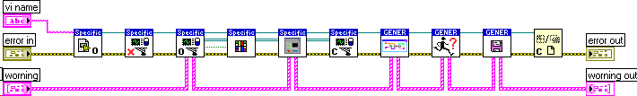

Wiring manually can be tedious. LabVIEW includes the **Block Diagram Clean Up** tool (the broom icon on the Block Diagram toolbar, or **Ctrl+U**). Clicking this automatically realigns nodes, reroutes wires, and compacts structures without altering your code logic.

For example, this messy Block Diagram:

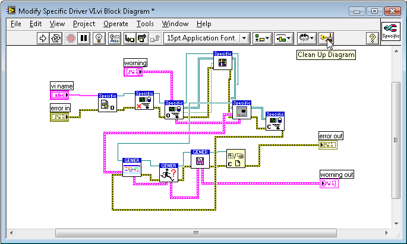

...becomes this clean layout after applying the cleanup tool:

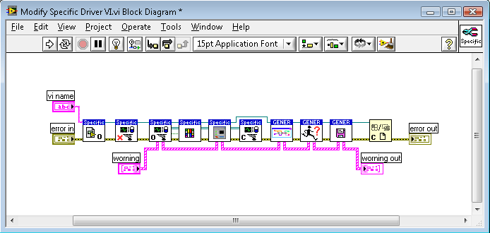

While the automated cleanup tool is highly convenient, it is not a complete replacement for manual layout. It can sometimes group nodes tightly or create unnecessary bends. A professional developer should use the cleanup tool as a starting point and make manual adjustments to maximize clarity and beauty.

## Comments

Adding text documentation is essential for maintainable code. In LabVIEW, this includes:

- **Descriptive Control Names**: Give controls and indicators meaningful names instead of default labels like "Numeric" or "String 2".
- **Visible Subdiagram Labels**: Display descriptive text above Case structures and Loops to explain their role.
- **Meaningful SubVI Icons**: Create graphical icons instead of leaving the default LabVIEW numbered grid.

To document execution structures (such as While Loops, Case Structures, and Event Structures), use **Subdiagram Labels**. Right-click the border of the structure and select **Visible Items >> Subdiagram Label**:

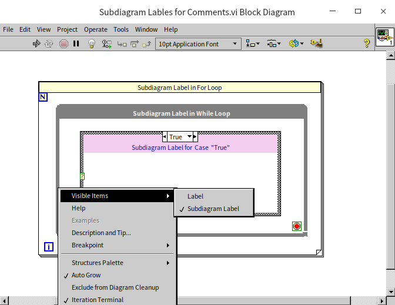

This creates a dedicated text bar pinned to the top of the structure. Subdiagram labels are excellent because they remain anchored to the structure when you resize or move it, preventing comments from drifting and cluttering the diagram.

For general block diagram comments, you can double-click any empty space on the diagram to create a **Free Label**.

Free labels can drift if you run the **Block Diagram Clean Up** tool, as the layout engine is unaware of which node a label refers to. To prevent this, use **Callouts (anchored arrows)**. When you hover over a Free Label, a small circle icon appears in the corner. Dragging this icon pulls out an arrow line that you can anchor directly to a specific wire or node:

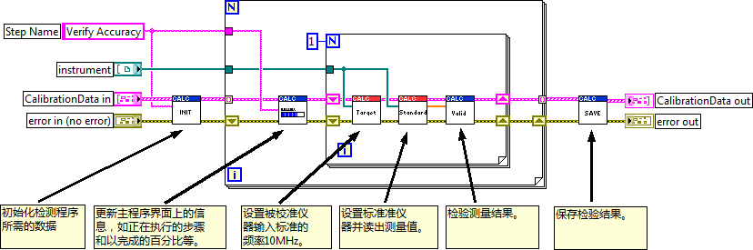

Even if you move the node or run the cleanup tool, the label and arrow remain logically linked and move together:

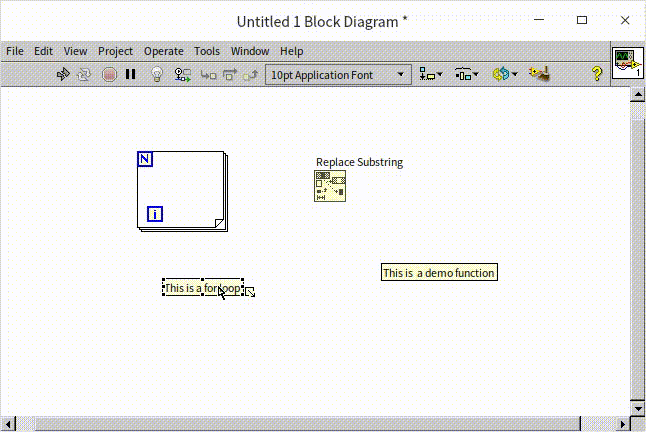

Another method is numbering comments and placing matching number tags on the diagram, though anchored callout arrows are generally preferred because they are fully interactive:

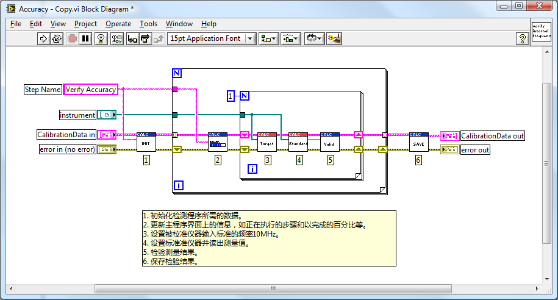

## Type Definitions (.ctl)

Test applications often pass complex datasets (like a cluster of experiment metadata containing "Test Name" and "Date") through multiple SubVIs. If you later need to modify this dataset—for example, adding a "Test ID" string—you would have to manually update every single VI, control, and constant in the project. This is tedious and prone to compiler mismatches.

To solve this, always use **Type Definitions** (`.ctl` files). A Type Definition acts as a centralized template. If you modify the `.ctl` file, LabVIEW automatically propagates the changes to all instances of that control across your entire project.

LabVIEW supports three types of custom controls in `.ctl` files:

- **Control**: A customized UI control. Once dragged onto a Front Panel, the link is broken; modifying the `.ctl` file does not affect existing VIs.
- **Type Definition (TypeDef)**: Links the data type of all instances to the `.ctl` template. If you add or remove elements in a TypeDef cluster, or change a data type, all instances update their types automatically.
- **Strict Type Definition (Strict TypeDef)**: Links not only the data type but also the visual appearance (color, font, size, and Enum/Ring item lists) of the controls. 

For example, if you have a Ring Control with options "Pass" and "Fail" saved as a standard TypeDef, adding a third option "Incomplete" in the `.ctl` file will *not* update the item list of existing instances. If saved as a **Strict TypeDef**, all instances will automatically inherit the updated item list.

**Best Practice**: Always use **Strict Type Definitions** for Clusters, Enums, and Ring controls that are shared across VIs. This maintains visual and structural consistency throughout your application.

## Connector Pane Layout

To keep Block Diagram wiring neat and parallel, you should establish a standardized connector pane pattern for all SubVIs in your project.

The industry standard is the **4-2-2-4** connector pane layout (the numbers indicate the count of terminals on the left, top, bottom, and right columns, respectively). Under this standard:
- **Inputs** are always wired to the left column.
- **Outputs** are always wired to the right column.
- **Reference / Session inputs and outputs** are wired to the top-left and top-right terminals.
- **Error In and Error Out** are wired to the bottom-left and bottom-right terminals.

Using a uniform 4-2-2-4 layout across all SubVIs ensures that common inputs and outputs (like references and errors) align at the exact same height on the Block Diagram, creating straight, parallel wires:

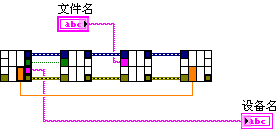

If SubVIs mix different layouts (e.g., one uses 4-2-2-4 and another uses 5-3-3-5), aligning the wires becomes impossible, resulting in messy bends and crossovers:

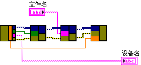

The 4-2-2-4 pattern provides 12 terminals. If a VI requires more than 12 inputs and outputs, do not switch to a denser grid. Instead, **refactor the VI**. A VI with more than 8 to 10 terminals is difficult to read and maintain. You should group related parameters into a custom Strict TypeDef Cluster to pass them as a single wire, or break the VI into smaller, more focused SubVIs.

Additionally, organize the physical layout of controls on your Front Panel to match the relative positions on the connector pane. This visual correspondence makes it intuitive for developers to know which Front Panel control maps to which connector terminal:

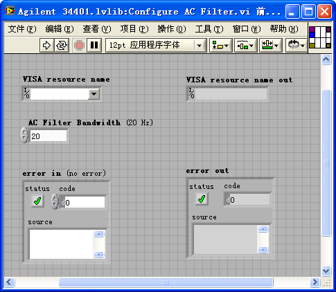

## Designing SubVI Icons

A professional SubVI should have a custom, descriptive icon. Here are the core guidelines for icon design:

- **Avoid Default Icons**: Never leave the default LabVIEW icon (a numbered grid). If all VIs have default icons, it is impossible to understand the Block Diagram flow without opening each subVI.
- **Prefer Glyphs Over Text**: Visual shapes and glyphs are processed much faster by the human brain than words. Use icons with clear graphical representations rather than just typing the VI's name in text.
- **Unified Banner / Color Coding**: VIs belonging to the same project library (`.lvlib`), class, or driver should share a unified style. Use a consistent top header banner (e.g., color-coded) and a shared label (such as a hardware identifier) so developers can instantly identify which module the VI belongs to:

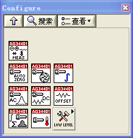
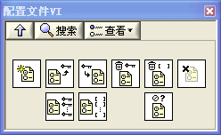

### Irregularly Shaped Icons

Standard SubVI icons are 32×32 pixel squares. However, you can create irregularly shaped icons (such as triangular or round shapes) to match native LabVIEW operators (like the Add or Multiply nodes).

When designing an irregular icon, choose a connector pane pattern that fits the shape. For instance, if you have a triangular function node (`My Function.vi`) with a single output at the apex, the standard 4-2-2-4 grid will not align properly. You can right-click the icon on the Front Panel, select **Show Connector**, and change the **Pattern** to a custom grid (such as the 5-2-2-2-5 pattern):

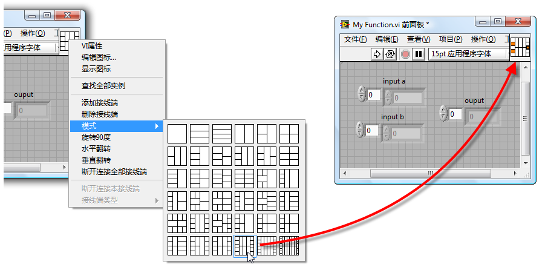

When drawing the irregular icon in the **Icon Editor**:
- Do not draw a border box around the perimeter.
- If using LabVIEW's legacy icon editor, synchronize the black-and-white, 16-color, and 256-color slots. The black-and-white slot acts as the transparency mask; any pixel left blank in the black-and-white grid will be transparent on the Block Diagram.
- In modern LabVIEW (which features the vector-based Icon Editor), transparency is handled natively via the alpha channel, making it simple to draw irregular shapes:

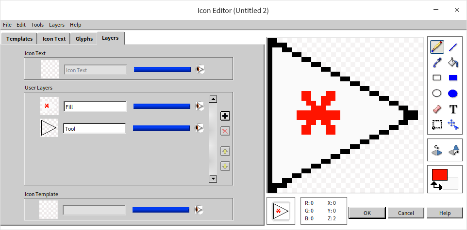

### Hiding Large Cluster Constants

Large, complex cluster constants on the Block Diagram can occupy massive visual space and clutter the code:

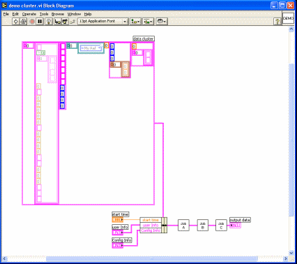

To keep the diagram clean, you can hide these bulky constants using one of two methods:

1. **Hidden Control**: Convert the constant into a Front Panel control and hide it from view (using properties). The downside is that this is confusing to other developers (who expect controls to be inputs) and makes modifying default values difficult.
2. **Constant SubVI (Best Practice)**: Wrap the constant inside a dedicated SubVI:
   - Create a Strict TypeDef for the cluster.
   - Create a helper VI containing only the cluster constant wired to an output indicator. Configure the connector pane to output the cluster:

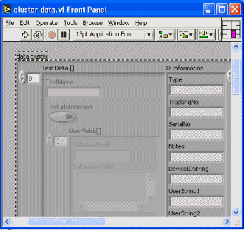
   - Design a compact, descriptive icon for this helper VI (e.g., representing the config value):

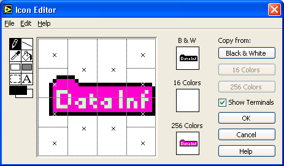
   - Place this SubVI on your main Block Diagram. It acts as a visual constant but takes up only the size of a standard icon, keeping your code neat:

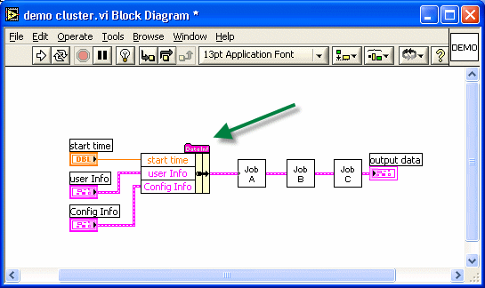

## Automated Code Reviews with VI Analyzer

Remembering and enforcing all style and layout guidelines manually can be difficult, especially in large teams. To automate code reviews, you can use the **LabVIEW VI Analyzer Toolkit**.

The VI Analyzer automatically scans your VIs and checks them against a library of style, performance, and documentation rules (such as checking for overlapping controls, unwired error terminals, or missing subdiagram labels). To launch the analysis wizard, select **Tools >> VI Analyzer >> Analyze VIs...**.

The wizard will guide you through the following steps:

1. **Select VIs**: Choose which files, directories, or project items you want to scan:

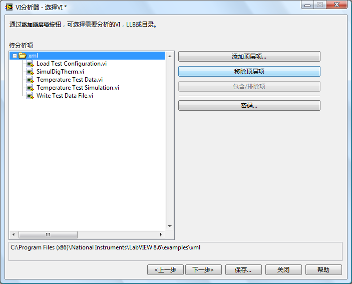

2. **Select Tests**: Choose which rules to enforce. You can enable or disable specific tests (such as performance checks for variables inside loops) to customize the ruleset:

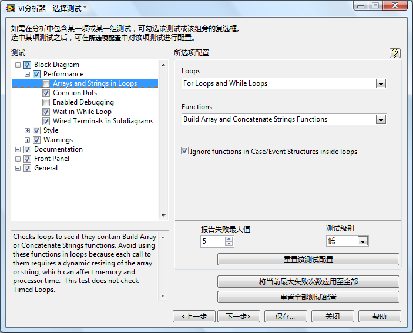

3. **View Results**: The analyzer runs and displays a report. Items with red indicators are critical style/logic violations, while blue indicators mark minor warnings. Double-clicking any error in the list automatically opens the target VI and highlights the exact node or wire that failed the test:

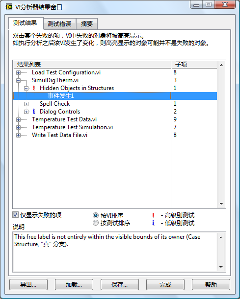

Using the VI Analyzer as part of your testing workflow ensures that your codebase remains clean, uniform, and free of common data-flow bugs.