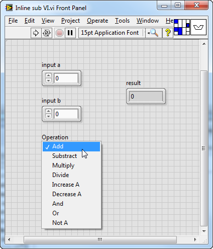
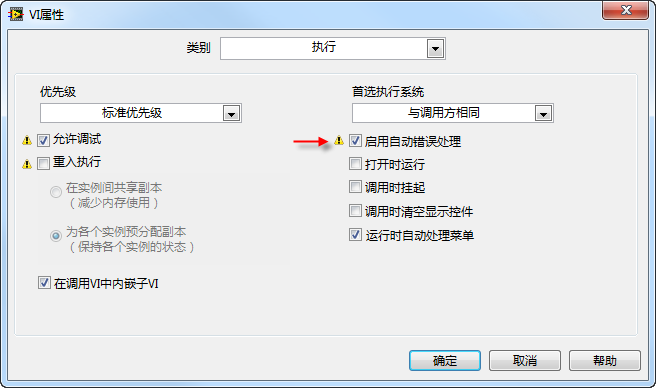
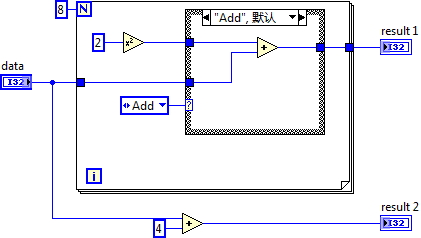
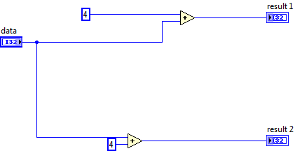
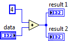

# Operating Mechanism

## Differences Between LabVIEW and Text-Based Languages

Graphical programming languages, such as LabVIEW, are driven by data flow, contrasting with the procedural drive mechanism typical of text-based programming languages. This fundamental difference necessitates a distinct approach to programming in LabVIEW compared to text-based languages.

The transition from text-based to graphical programming often presents challenges, particularly for those accustomed to conventional programming practices. Habits like generating temporary variables on the fly, employing nested jump statements, and constructing monolithic functions common in text-based languages can lead to disorganized and convoluted LabVIEW diagrams. Applying text-based programming strategies directly to LabVIEW can result in diagrams that are cluttered, with nodes scattered and data wires interwoven chaotically. Such programs are undeniably harder to comprehend and modify, leading some to perceive LabVIEW as more difficult to use than text-based languages.

This perception does LabVIEW a disservice. The issues encountered are not inherent flaws of LabVIEW but rather stem from not fully grasping the LabVIEW programming philosophy. It's possible to create LabVIEW programs that are both clear and easy to read; the approach is just slightly different. LabVIEW's capability for detailed, illustrative comments, combined with the human ability to process visual information quicker than text, means that well-crafted LabVIEW code can be more accessible, understandable, and maintainable than its text-based counterparts.

Let’s illustrate the difference in programming methodologies between text-based languages and LabVIEW with a simple example.

The `if-else` conditional statement, a staple of the C language, can be replicated in LabVIEW using the Case structure. However, they are not entirely equivalent. Trying to mimic the exact structure of C language programming in LabVIEW can lead to a diagram that is chaotic and hard to read.

Consider the following C language statement:

```cpp
if (conditionA) {
    if (conditionB) {
        if (conditionC) {
            ……
        } else {
            ……
        }
    } else {
        if (conditionD) {
            ……
        } else {
            ……
        }
    }
} else {
    if (conditionE) {
        if (conditionF) {
            ……
        } else {
            ……
        }
    } else {
        if (conditionG) {
            ……
        } else {
            ……
        }
    }
}
```

Implementing the same logic in LabVIEW as one would in C language results in a diagram with multiple levels of nested structures. In text-based programming, even with several levels of nested conditions, all code is laid out flatly, allowing programmers to easily view the entire code by scrolling. In contrast, LabVIEW displays only one case of a Case structure at a time. To examine the code corresponding to "condition g" in C, one would simply scroll to find that code segment. In LabVIEW, however, this process would involve toggling through different nested Case structures, which is considerably more cumbersome and leads to poor code readability:


Actually, when writing LabVIEW code, the approach differs from that of text-based programming. It's not merely about translating C language code directly; instead, it involves fully adopting the LabVIEW programming mindset. For the same functionality, LabVIEW can produce code that is significantly easier to read. The strength of LabVIEW's Case structure is its ability to support multiple cases, not just the binary true or false conditions like if-else statements in C; its limitation is the reduced readability due to nested Case structures. Therefore, optimizing the program for LabVIEW's Case structure involves first performing logical operations on all input conditions, connecting the results to a single Case structure, and using various cases to represent different states (as shown below). This method simplifies the program significantly, allowing users to view the code for any case at a glance and enhancing readability.


Note that the input to the Case structure in the example above is essentially a set of Boolean values, so the selector label of the Case structure should display the input conditions in binary format. This adjustment helps readers intuitively understand the Boolean array input values corresponding to each case.


## Compiled or Interpreted Language

LabVIEW, similar to common programming languages such as VC++ and VB, is a compiled language. It adheres to strict syntax rules and checks all statements for syntax errors before the program runs. Any detected errors will prevent the program from executing.

Misunderstandings about whether LabVIEW is a compiled language often arise for a few reasons. Firstly, users do not observe the generation of target files during compilation (in LabVIEW's environment, a VI can run directly without generating any executable files). Secondly, LabVIEW lacks a visible compile button. Furthermore, there doesn't appear to be a noticeable compilation phase before a VI runs.

To illustrate, let's compare LabVIEW with the C language in terms of storage and compilation: C language source files are saved in .c files. To compile, you'd click a menu or tool button in the programming environment, which invokes the compiler. After some time, compiled files containing executable binary code, such as .obj files, are generated. Conversely, LabVIEW's source code is stored within .vi files, without separate menus or buttons for compilation.

A .c file typically encapsulates multiple functions. A C language project comprising dozens of functions might only consist of a few .c files. In contrast, a LabVIEW .vi file generally stores just one VI, equivalent to a function in C language. Hence, even a small LabVIEW project could be made up of numerous .vi files.

In certain cases, a .vi file may contain several sub-VIs (sub-functions) without their own .vi files. These VIs, lacking front panels, have their block diagrams stored within the .vi file of the calling higher-level VI. This scenario is often unnoticed by users and is exemplified by Express VIs. Most Express VIs have a "configuration dialog box", where their parameters can be differently configured for each usage. These configurations are stored somewhere, yet the published project does not include .vi files for Express VIs. In reality, Express VIs are embedded within the higher-level VI that calls them. If a VI uses an Express VI, its block diagram might be simple, but its corresponding .vi file could be quite large because it also includes the code for the Express VI.

A .c file stores only the program's source code, whereas a .vi file holds both the LabVIEW program's source code and the compiled target code. The absence of .obj-like files in a LabVIEW project is because the compiled code is also stored within the .vi files.

LabVIEW doesn't require a separate compilation before running a VI because it compiles the VI when loading it into memory and while editing it. The compilation is distributed and only focuses on a portion of the modified code at a time, making the process fast and often imperceptible.

When loading a VI into memory, LabVIEW first checks whether the VI requires recompilation. Generally, if the VI's code has not been modified, it doesn't need recompilation. However, recompilation is necessary in two specific scenarios: First, when a VI saved with an older version of LabVIEW is opened in a newer version; second, when the VI is loaded and opened on a different operating system.

For instance, opening a VI in LabVIEW 8.0 that was originally written in LabVIEW 7.0 necessitates recompilation. Different versions of LabVIEW have varying features, and LabVIEW is always evolving. The target code generated by a newer version of LabVIEW differs from that generated by an older version, hence recompilation is required. If a project contains hundreds of VIs, you might noticeably experience the compilation time when opening the top-level VI in a newer version of LabVIEW. Another example is when a VI, originally created on Windows, is opened on Linux; LabVIEW will also require recompilation. LabVIEW generates different target codes for different operating systems.

In both mentioned scenarios, upon opening a VI, a star (*) will appear next to the title in the VI window's title bar. This star indicates that the VI has been altered and needs to be resaved. Although no modifications have been made to the VI's code, LabVIEW has recompiled the VI, altering the internally stored binary target code, making the VI need resaving. Of course, this star also appears after the title when modifications are made to the VI's block diagram or front panel, as both the source and target code within the VI have changed.

After installing a LabVIEW update patch (e.g., upgrading from 8.0 to 8.0.1), the program may prompt whether all LabVIEW's built-in VIs need to be recompiled in batch. Given the vast amount of built-in VIs in LabVIEW, choosing "Yes" could require spending anywhere from several minutes to several hours recompiling all these VIs. At this point, it's clear that LabVIEW's compilation process can indeed be time-consuming.

LabVIEW compiles the program's source code while the programmer is editing it. Usually, only the VI being edited needs compilation since its subVIs already contain compiled target code, eliminating the need for recompilation. Since each .vi file equates to a function and doesn't carry a large code volume, the compilation is swift, barely noticeable to the programmer. While creating a LabVIEW program, connecting two terminals of different types will immediately break the run button, signaling that the program has finished compiling and the compiled code is unexecutable. Once programming is complete, and all VIs have been compiled, the program is ready for direct execution.

Occasionally, when using a prewritten program, one might find that upon opening a VI, the run button displays a broken arrow, indicating the VI cannot run. However, clicking on the broken arrow does not list any errors. This scenario typically occurs because the VI stores compiled code that is unexecutable. For example, if the VI did not locate a required DLL file the last time it was opened, leading to unexecutable compiled code, and if the VI was saved in this state, it also preserved the unexecutable status. If the VI is closed, the missing DLL file is then placed back in the correct location, and the VI is reopened, theoretically, the VI should be runnable. But because LabVIEW does not recompile the VI upon opening, it retains the previously unexecutable code, hence the broken run button arrow. Since there are no errors in the program's source code at this time, the error list remains empty.

To address this issue, the method to correct the arrow status involves holding the Ctrl + Shift keys and then left-clicking the run button (marked by a broken arrow) with the mouse. In LabVIEW, holding Ctrl + Shift while clicking the run button signals to compile without executing. This action is akin to pressing the "Compile" button in other languages.

LabVIEW's approach of storing both the executable code and the source program in a single file, along with its dispersed compilation methodology, is quite distinctive. This method, compared to other languages, presents both advantages and disadvantages.

A major benefit is the dispersion of compilation time. Compiling a large C++ program can sometimes take hours or even days. LabVIEW, however, compiles as you code, making the compilation time almost imperceptible to programmers. Another advantage is the ease of running subVIs within the LabVIEW environment. Unlike other programming languages where you cannot run a function by itself, LabVIEW allows any VI to be directly executed. To run a subroutine in other environments, entry from the main entry point is necessary.

However, this compilation strategy, which combines the source file and target code in one file, also brings several drawbacks.

Firstly, it complicates code management. In a formal software development setting, the code needs to be uploaded daily to a code management server. Typically, managing source code requires significant disk space. In LabVIEW, not only the program code but also the compiled executable code is stored in the same file, increasing the burden of code management. When developing a program, revisiting past modifications is common. If a file changes, code management software identifies it as a code modification. However, in VIs, sometimes it's only the included executable code that changes, but the code management software can't accurately determine if the source code has changed. (See [Source Code Management in LabVIEW](appendix_problem#labview-的源代码管理))

Secondly, while source code usually occupies a small amount of storage space, LabVIEW cannot distribute just the source code to users. As a result, application files tend to be quite large.

Additionally, every LabVIEW upgrade requires all VIs to be resaved to refresh the compiled target code within the VIs. This process can be time-consuming.


## Data-Driven Programming in LabVIEW

In contrast to procedural or control flow-driven programming commonly found in traditional text-based languages, LabVIEW adopts a data-driven approach. While this bears similarities to procedural programming, there are distinct differences worth noting.

In a procedural program, execution flows sequentially as dictated by the code structure. A specific line of code awaits its turn, contingent upon the completion of its predecessors, regardless of whether its input conditions are ready. Typically, unless explicitly creating new threads, a program operates within a single thread.

Conversely, LabVIEW's programming paradigm hinges on the flow of data through wires. The sequence of data movement sets the execution order. Wires can diverge, splitting data across various pathways. As data enters a node and the node completes its operation, the resulting data is then dispatched along the wires to subsequent nodes awaiting this input. Nodes execute independently as soon as they receive all required inputs, making their execution order independent of other nodes. This inherent characteristic facilitates automatic multithreading within LabVIEW, allowing multiple nodes to execute concurrently across different threads.

The automatic multithreading capability of LabVIEW simplifies many aspects of programming but introduces complexity and potential error sources associated with managing multiple threads. Therefore, LabVIEW incorporates additional mechanisms to help programmers effortlessly create safe and efficient multithreaded applications.

A common challenge in multithreaded environments is managing access to shared resources or memory to prevent conflicts. For instance, in a single-threaded context, the next read operation retrieves exactly what was previously written into memory. This guarantee does not hold in a multithreaded context, where another thread could alter the memory in the interim. Traditional languages operate under the assumption of single-threaded execution by default, leaving the programmer responsible for managing the complexities of multithreading.

LabVIEW, however, must address this issue head-on. It is entirely possible for LabVIEW programmers to unwittingly create multithreaded applications. One of LabVIEW's strategies to mitigate potential issues is its approach to parameter passing. When transferring data to functions or sub-VIs, LabVIEW primarily uses value passing instead of reference passing, significantly reducing the risk of concurrency-related problems.


## Passing by Value vs. Reference

In many popular programming languages like C++, Java, and C#, arguments to functions are primarily passed by reference. This means that the function receives a reference to the original data location rather than a copy of the data. C++, aiming for compatibility with C, typically uses value passing for simple data types. However, for larger data structures, such as arrays, strings, structures, and classes, reference (or pointer) passing is commonly used.

The drawback of value passing is clear: it necessitates copying the data for each function call, consuming substantial memory resources. Reference passing, while more memory-efficient since it avoids data duplication, poses safety risks. In single-threaded scenarios, these risks are manageable, but in a multithreaded environment, ensuring data safety becomes challenging.

Ideally, a data-driven programming language could rely solely on value passing, duplicating data at every data flow branch. This approach ensures that each node works with its own data copy, minimizing the risk of cross-thread data corruption. When designing LabVIEW programs, one might intuitively treat LabVIEW as functioning this way. However, LabVIEW's actual operation is more nuanced. It optimizes to avoid unnecessary data duplication, balancing data flow principles with performance considerations.

LabVIEW sometimes reuses input data memory for output if it can ascertain that the input data won't be accessed elsewhere and an output node requires memory. This practice, known as cache reuse, essentially mirrors reference passing by allowing a function to modify data directly in its original memory location. LabVIEW programmers generally can't choose between value or reference passing directly; LabVIEW decides based on prioritizing data safety over processing efficiency. It may not always accurately predict when reference passing is safe, defaulting to value passing and data duplication in uncertain scenarios.

While programmers can't set value or reference passing directly, those aiming for efficiency can adjust their coding style to guide LabVIEW in identifying optimizable code sections, thus avoiding unnecessary data duplication. Techniques such as using shift registers and cache reuse can signal to LabVIEW when reference passing is safe, facilitating the creation of highly efficient LabVIEW code.

In LabVIEW, certain nodes have input and output data types that are entirely different. For instance, the Array Index node accepts an array and an index as inputs but outputs an element from the array. The disparity in input and output data types necessitates allocating new memory for output data, rendering cache reuse impossible. Conversely, some nodes feature identical data types for inputs and outputs. An example is the Addition node, where the output data type always matches one of its inputs (fixed-point data types are an exception). LabVIEW strives for cache reuse in such nodes whenever feasible.

Consider a scenario where an array data input is simultaneously fed into an Array Index node and an Addition node via branched connections. Ideally, in a data-flow driven paradigm like LabVIEW's, these two nodes should execute concurrently. However, for the sake of optimizing memory usage, LabVIEW prioritizes nodes where cache reuse isn't feasible (for instance, executing the Array Index node first in this example), followed by those where cache reuse is viable (like the Addition node).

Here's why: if the Addition node runs first or if both nodes run at the same time, the memory for the Addition node’s input data, which needs to be accessed by the Array Index node, cannot be altered. This necessitates allocating new memory for the Addition node's input data. On the other hand, if the Array Index node runs first, by the time the Addition node executes, its input data’s memory won't be accessed by any other node, allowing the Addition node to safely utilize this memory for cache reuse.

While LabVIEW programmers don’t have the direct ability to choose between value or reference passing for data sent to a node, LabVIEW does include "reference handle" controls in its control palette. These controls are designed to prevent frequent copying of large data blocks or manipulation of the same memory across different threads. Controls named "... reference handle (... refnum)" fall into this category, representing data (or a device) whose reference, not the actual data, is transmitted along data wires. If a wire carrying reference data splits, though the reference value might be duplicated, the data it points to isn't. Additionally, LabVIEW features several functions with terminals named "... reference" or "... handle", and the data on these terminals is also passed by reference.


## Data Space in LabVIEW VIs

LabVIEW, unlike other languages, relies heavily on value passing, which inevitably impacts its execution efficiency. This necessitates that LabVIEW employs specific strategies not required by other languages to maximize efficiency. One key optimization involves how memory is allocated for internal data within a sub VI.

In C language, a subroutine's local variables are stored in the stack. A space is allocated for these variables only when the function is called, creating a stack to hold the subroutine's local variables. Once the subroutine completes, this stack space is freed, and upon the next function call, new stack space is allocated, potentially at a different memory address.

However, the concept of local variables in LabVIEW differs from that in C. In LabVIEW, elements such as data lines, control default values, and shift registers require temporary memory allocation to store their data, similar to local variables in C. These can be considered the internal data of a sub VI.

To avoid the overhead of frequent space allocation, LabVIEW VIs do not store this internal data in a stack. Typically, when a VI is called statically, LabVIEW allocates a dedicated data space for each VI for data storage. This data space's memory address remains constant across VI executions, ensuring that the location of each piece of internal data does not change. As a result, data from a previous run can be reused in subsequent runs.

This method offers a significant advantage in reducing the overhead of memory allocation and deallocation. However, it also presents a major limitation that other languages avoid: it prevents recursive calls. To enable recursion, a LabVIEW VI must be set to reentrant mode.

In the case of non-reentrant sub VIs, the same data area is used regardless of where the VI is called within the program. If a main VI calls the same sub VI in parallel, as depicted with two Delay VIs in the example below, theoretically, a dataflow-driven language should execute the sub VI code concurrently in two threads. However, because both calls access the same data area, LabVIEW executes them sequentially to prevent data conflict and confusion, leaving it uncertain which sub VI gets executed first.

Sequential execution by LabVIEW is not always a drawback. For instance, this approach prevents errors that could arise from multiple threads simultaneously accessing a single serial port, which is beneficial when a sub VI is designated for serial port communication. Yet, this can introduce inefficiencies, such as when operations on different serial ports must wait for one another due to the non-reentrant nature of the VI, leading to longer execution times.

To address this issue, LabVIEW introduced the concept of reentrant VIs. A non-reentrant VI shares its data area with its other components (like execution code and interface), using the same data area wherever it's called. A reentrant VI, however, allocates its data area through the parent VI that calls it. Each instance of a reentrant sub VI on the parent VI's block diagram represents a separate data area allocation within the parent's space. This allows for parallel calls to the same reentrant sub VI to operate independently without data interference. Even in a loop, whether a sub VI is reentrant or not, each iteration calls the same VI, using the same data area.


## Separating Executable Code from Source Code

Previously, we discussed a distinctive feature of LabVIEW that sets it apart from many other languages: its tendency to bundle together elements that could otherwise be separated. For instance, a VI in LabVIEW contains:

- The program's interface, such as inputs and outputs (e.g., entering a string, outputting a numerical value).
- The program's user interface, detailing what types of controls are used and their arrangement.
- The program's logic code, which might include operations like calculating the length of a string before performing an addition.
- The layout of the program's block diagram, including the placement of nodes and the routing of wires.
- The executable code, which is the binary code compiled from the program.

This integrated approach is quite convenient for small programs that only require a few VIs, as everything needed to run a program is neatly contained within these VIs. Users don't have to concern themselves with the organization and storage of these components. However, this method shows its limitations in larger projects, especially those developed by multiple contributors.

First off, including unnecessary elements in VIs not only wastes resources but can also lead to complications.

For most sub VIs, having a user interface is redundant. The functionality of a sub VI remains the same regardless of where controls are placed. Ideally, sub VIs would not store any user interface elements at all. Instead, LabVIEW could generate a standard interface for debugging purposes when necessary.

Moreover, if LabVIEW's auto-layout feature were sufficiently advanced, even the layout of the program's block diagram might be deemed unnecessary. The route a wire takes—above or below—does not impact the program's functionality. If LabVIEW could always find the optimal layout for nodes and wires, it would spare programmers the effort of arranging layouts manually and save the space required to store these layouts in VIs. By comparison, most text-based programming languages come with editors equipped with auto-formatting features that can instantly organize even the most chaotic code.

A more critical issue arises from storing source code and executable code together, complicating source code management. This mixture leads to unnecessary use of storage space and network bandwidth since source code management systems should ideally only store the source code. It also complicates the task of comparing changes between different versions of the source code. For example, the same VI could be developed in 64-bit LabVIEW by one person and in 32-bit LabVIEW by another, or some may use Windows while others Linux. Merely opening and saving a VI can alter it because the executable code compiled from the same source code varies across platforms. In a source code management system, it's straightforward to see that some VIs have undergone version changes, but distinguishing whether they were genuinely modified or simply resaved in a different LabVIEW version becomes challenging. This situation significantly undermines efficient program source code management.

Automating the layout for user interfaces and program block diagrams is notably challenging, particularly for block diagrams. Yet, separating executable code is more straightforward. Starting with LabVIEW 2010, an option to "Separate compiled code from source code" was introduced in the VI Properties dialog. When selected, this option retains only the source code part of the VI, while the compiled binary code is moved outside the VI:


LabVIEW manages the separated, compiled executable code. In Windows 7 systems, the folder `[USERPROFILE]\Documents\LabVIEW Data\VIObjCache\[LabVIEW version number]\` houses an objFileDB.vidb file, serving as the database for all executable code of LabVIEW programs.

Adopting a strategy of separating executable code from source code becomes particularly advantageous when developing programs across different platforms or deploying programs to various platforms. This approach helps avoid unnecessary VI modifications.

In theory, separating executable code from source code could also enhance program loading speeds by allowing programs to load on demand, either loading only the source code or the executable code as needed.


## Compiler Optimization and Inlining Sub VIs

For enhancing program readability, maintainability, and reusability, it's recommended to utilize sub VIs extensively in LabVIEW program design. Ideally, each functionally independent feature should be encapsulated into a sub VI, with a guideline suggesting a sub VI should not exceed 30 nodes.

However, an overabundance of sub VIs might slightly affect the program's execution efficiency.

First off, invoking a sub VI does incur a small overhead, such as parameter stacking. Yet, this overhead is minimal and generally negligible.

The primary benefit of inlining sub VIs for program performance stems from the optimizations performed by the LabVIEW compiler. The LabVIEW compiler is adept at intelligently optimizing the code to increase execution efficiency without altering the program logic. Some common compiler optimization techniques include:

- **Dead Code Elimination**: Removing code that will never execute.
- **Loop-Invariant Code Motion**: Operations within a loop that remain constant across iterations are moved outside the loop, needing to be performed only once.
- **Common Code Merging**: Redundant operations on the same data within the program are identified and eliminated by the compiler.
- **Constant Folding**: Operations on constants are calculated at compile-time, with results directly stored in the program to avoid recalculations at runtime.

The LabVIEW compiler's optimizations have a limitation: they can only be applied within an individual VI and not across the entire program. Merging the code from a sub VI (B) into a parent VI (A) can reveal many optimization opportunities to the compiler. However, if the codes for VIs A and B are kept in separate VIs, the compiler, examining each VI's code separately, might miss these optimization opportunities.

LabVIEW provides a solution that strikes a balance between readability and execution efficiency. This involves dividing the program into multiple sub VIs during development and merging the sub VI codes into the parent VI at compile time. This process allows the compiler to optimize the code maximally. This technique is known as "inlining sub VIs".

The "Inline SubVI into calling VIs" option, found in the VI properties dialog under the "Execution" page, enables this feature. Inlining a sub VI is somewhat analogous to inline functions in the C language.


With this option enabled, the VI becomes an inlined sub VI. To the code editor, it appears no different from a regular sub VI; however, from a compilation perspective, it's distinct. Unlike a regular sub VI, which exists independently, the code of an inlined sub VI is copied entirely into the VI that calls it. For example, consider a program with two VIs, A and B, where A calls B. If B is a regular VI, the compiled executable will include both A and B. If B is inlined, only an expanded version of A remains in the compiled program, now incorporating the code from both the original A and B.

It's crucial to recognize that more inlining doesn't necessarily mean greater efficiency. Misuse of inlining can lead to efficiency losses, such as code bloat from inserting the inlined code at every call site, which can increase the program's size and memory usage. Therefore, inlining should be reserved for sub VIs that are called infrequently or whose input parameters are often constants, while sub VIs called frequently across the program should not be set to inline mode.

Let's examine a specific example to illustrate how the LabVIEW compiler optimizes programs:

We start by creating a sub VI that accepts three inputs: two for data and a third to indicate the operation (such as addition or subtraction) to be performed on these data inputs. The result of this operation is then output.




This "Inline sub VI.vi" is configured as an inlined sub VI. An inlined sub VI must be reentrant, meaning its code is duplicated at every call site, and each call site has its own separate data space. As of LabVIEW 2011, inlined sub VIs do not support debugging and automatic error handling. Thus, when setting a sub VI to inline mode in the VI properties dialog, you must adjust other settings accordingly; otherwise, LabVIEW will flag these settings with an exclamation mark, indicating there's an issue.



Now, let's call this sub VI in the following program:


We'll explore how the LabVIEW compiler optimizes this program. For clarity, we'll use some illustrative program block diagrams. These diagrams are not produced or optimized by LabVIEW but are manually created by the author solely for demonstration. LabVIEW's optimizations are applied to the compiled executable code and do not alter the VI's source code (program block diagram). However, after LabVIEW's optimizations, the executable code generated from main.vi is functionally equivalent to the executable code that would be compiled from our illustrative diagrams.

Because "Inline sub VI.vi" is an inlined sub VI, its code is considered to be copied into main.vi by the compiler. Thus, the compiler perceives the code as follows:



In this snippet, the conditional structure's selector input is a constant "Add", which means the program will always execute the "Add" branch, while other branches will never be executed. The compiler eliminates these unreachable branches, so the optimized program code effectively becomes:


The operation performed inside the program loop is consistent across iterations, so it can be moved outside the loop to be executed just once. The post-optimization code effectively looks like this:


Since the input to the square operation is a constant, this calculation is performed at compile time, removing the need for runtime computation. The optimized code effectively becomes:



In the program, performing the same operation twice on the "data" input is redundant. The compiler consolidates these operations, resulting in the final optimized code effectively looking like this:



As demonstrated, a program that initially appears complex can, after extensive optimization by the LabVIEW compiler, run as efficiently as significantly simpler code. However, this doesn't mean that programmers can afford to neglect code efficiency. The compiler is limited to performing only straightforward optimizations, so the primary determinant of program efficiency remains the programmer's code writing approach.
