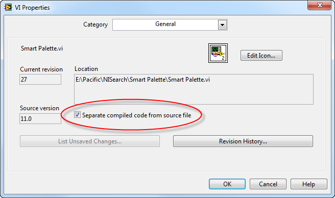
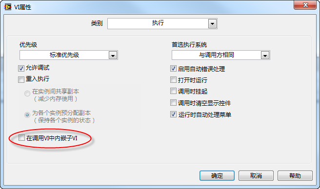
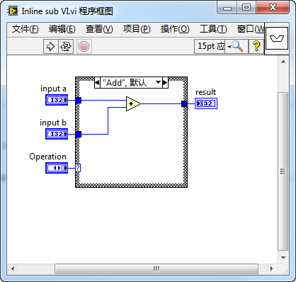
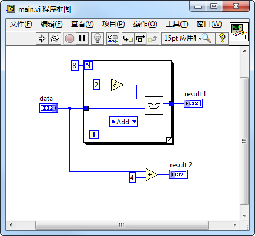
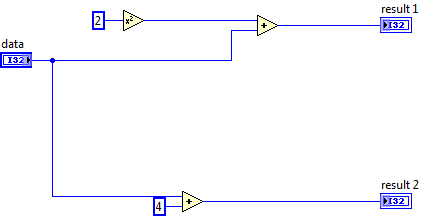

# LabVIEW 的运行机制

## LabVIEW 与文本语言的差异

图形化编程语言是数据流驱动的，这与一般文本编程语言的过程驱动机制稍有差别。所以，在程序设计的思路上，LabVIEW 与文本编程语言也是有所区别的。

由于这些差异性，习惯于文本编程的程序员开始使用 LabVIEW 的时候，最容易产生困扰的就是那些 LabVIEW 不同于文本语言之处。随时创建一些临时变量、书写层层嵌套的跳转语句、成百上千行代码的单一函数，这些在文本语言中习以为常的习惯，却可以把 LabVIEW 程序框图搞得一团糟。只是一味将其它语言的编程经验套用在 LabVIEW 上，写出来的程序很可能是节点星罗棋布，毫无条理；数据线纵横交错犹如蛛网。这样的程序毫无疑问难于理解和修改，很多人由此就认为 LabVIEW 较文本语言更难使用。

其实，这对 LabVIEW 来说是不公平的。产生这些问题并非 LabVIEW 本身的缺陷，而是由于编程者尚未真正掌握 LabVIEW 语言的编程思想。LabVIEW 程序也可以做到清晰易读，只是实现方法可能略有不同。实际上，在 LabVIEW 中可以为代码添加图文并茂的注释，再加上人类对图形的识别速度远远超过对文本的分析速度，一个优秀程序员编写的 LabVIEW 代码往往要比文本语言编写的代码更易阅读和理解，也更易于维护和优化。

下面用一个简单的例子，说明文本语言与 LabVIEW 在实现同样功能时，所采用的不同思路。

If else 条件语句是 C 语言中最常用的语句之一，在 LabVIEW 中，可以利用条件结构完成类似的功能。但这两者并不完全相等。假如完全按照 C 语言的编写方法编写 LabVIEW 程序，其代码肯定杂乱不堪，可读性极差。

例如，用 C 语言编写的语句如下：

```cpp
if (conditionA) {
    if (conditionB) {
        if (conditionC) {
            ……
        } else {
            ……
        }
    } else {
        if (conditionD) {
            ……
        } else {
            ……
        }
    }
} else {
    if (conditionE) {
        if (conditionF) {
            ……
        } else {
            ……
        }
    } else {
        if (conditionG) {
            ……
        } else {
            ……
        }
    }
}
```


如果在 LabVIEW 中按照与 C 语言完全一模一样的逻辑来实现此功能，LabVIEW 的程序框图将出现多层嵌套（图
11.3）。在文本语言中，即便有多层条件嵌套，但所有代码都是平铺开的。程序员只需拖动鼠标，就可以查看全部程序代码。而在 LabVIEW 中，每次只能显示条件结构一个条件分支的代码。如果程序员，想要查看条件 "condition
g" 所对应的那段代码，在 C 语言中，只要拖动鼠标，就可以找到那段代码。而在 LabVIEW 的程序框图上，需要反复切换不同层次条件结构显示出来的条件分支。这要比 C 语言麻烦得多，程序可读性当然就很差了：


实际上，在编写 LabVIEW 代码时，其编写逻辑与 C 语言的代码是有所不同的。不能简单机械地翻译 C 语言，而应当完全按照 LabVIEW 程序的思维方式考虑。同样是实现这一功能，LabVIEW 也可以写出非常易读的代码。LabVIEW 条件结构的优势在于可以支持多个条件分支，而并非如同 C 语言中的 if else 语句只能支持真假两个状态；其劣势在于 LabVIEW 的条件结构可读性差，需要避免多层条件结构嵌套。所以，应该针对 LabVIEW 条件结构的这一特性优化程序：先对所有输入条件进行逻辑运算，把运算结果连接到单独一个条件结构上，并用条件结构多个不同的分支表示不同的状态（如下图所示）。这样一来，程序简单得多了，用户一次就可以查看任何一个条件分支的代码，可读性也好了。


需要注意的是，由于上图中条件结构的输入实际上是一组布尔数据，所以条件结构的选择器标签内应该以二进制格式显示输入条件，以帮助程序阅读者直观地知道每个条件分支对应的布尔数组的输入值。

## LabVIEW 是编译型语言还是解释型语言

LabVIEW 和常用的 VC++、VB 等编程语言一样，是一种编译型语言。LabVIEW 有严格的语法定义，在程序运行之前会检查所有语句的语法。一旦查出有差错，程序会报错，不能运行。

在 LabVIEW 是否是编译型语言这个问题上容易引起误解的原因如下。一是用户没有看到编译时生成的目标文件（在 LabVIEW 的环境中，可以直接运行一个 VI，而并不生成任何可执行文件）。二是 LabVIEW 没有编译按钮。此外，VI 运行前似乎也没有明显的编译时间。

可以把 LabVIEW 和 C 语言的存储与编译方法作一比较：C 语言的原文件存储在.c 文件中。需要编译时，通过点击程序编辑器相关的菜单或工具按钮，程序编辑环境调用编译器对程序进行编译。在耗费一段编译时间后，可以看到编译后生成的含有可执行二进制代码的.obj 文件。而 LabVIEW 的原代码是存储在.vi 文件中的，没有专门的进行编译的菜单或按钮。

一个.c 文件中通常保存了多个函数。一个由几十个函数构成的 C 语言工程，也许仅由两三个.c 文件组成。而 LabVIEW 的一个.vi 文件通常只存储一个 VI，即相当于 C 语言中的一个函数。所以，即使一个小型 LabVIEW 工程也可能由几十个.vi 文件组成。

在某些特殊情况下，一个.vi 文件也可能保存了若干个子 VI（子函数）。其中，某些 VI 可能没有他们自己的.vi 文件。这些 VI 没有前面板，而它们的程序框图就保存在调用它们的高层 VI 的.vi 文件中。用户一般并不会意识到这种特殊情况，这种情况有个典型的应用，就是 [Express VI](measurement_express_vi)。几乎所有的 Express VI 都具有一个“设置对话框”，它们的参数在每个使用 Express VI 的地方，都可以被任意配置为不同的值。这些配置信息肯定是被保存在某处了，但发布的工程中却并没有保存 Express VI 的.vi 文件。实际上，Express VI 是被保存在了调用它们的高层 VI 中的。如果某个 VI 调用了 Express VI，它本身程序框图也许非常简单，但它对应的.vi 文件却可能非常大，因为它还保存有 Express VI 的代码。

.c 文件只保存程序的原代码，而.vi 文件不仅保存了 LabVIEW 程序的原代码，还保存了程序编译之后生成的目标代码。在 LabVIEW 的工程中看不到类似.obj 这样的文件，那是因为编译后的代码也已经被保存在了.vi 中的缘故。

LabVIEW 在运行 VI 之前无需编译，是因为 LabVIEW 在把 VI 装入内存的时候、以及在编辑 VI 的同时进行了编译。由于编译工作被分散开来了，每次只需针对一部分被改动的代码进行编译，工作量不大、速度非常快，所以往往不易被察觉。

当把一个 VI 装入内存时，LabVIEW 先要判断一下这个 VI 是否需要被编译。一般情况下，如果 VI 的代码未被改动，是不需要重新编译的。但是在下列两种情况下仍需要重新编译。第一种情况，是在高版本 LabVIEW 中打开一个用低版本 LabVIEW 保存的 VI；其次，是在不同的操作系统下装入和打开了 VI。

比如，要在 LabVIEW 8.0 中打开一个原来用 LabVIEW
7.0 编写保存的 VI，则被装入的 VI 需要被重新编译。不同版本的 LabVIEW 的功能有所不同，并且 LabVIEW 总是在不断改进中。新版本 LabVIEW 生成的目标代码与旧版本生成的代码会有所不同，所以需要重新生成。如果一个工程包含有上百个 VI，在新版本的 LabVIEW 中打开顶层 VI 时，就会明显地察觉到编译所占用的时间。第二种情况的例子是，在 Linux 中打开一个原来是在 Windows 下编写保存的 VI，LabVIEW 也需要重新编译。LabVIEW 为不同操作系统生成的目标代码也是不同的。

在以上两种情况下，打开一个 VI 后，就会发现 VI 窗口标题栏中的标题后面出现了一个星号（\*）。这个星号表示 VI 被改动了，需要重新保存。尽管没对 VI 的代码做任何修改，但是 LabVIEW 重新编译了 VI，它内部保存的二进制目标代码变化了，所以 VI 还是需要被重新保存。当然，VI 的程序框图或前面板被修改后，在标题栏标题后也会出现这个星号，因为这时 VI 中保存的源代码和目标代码也都发生了变化。

在 LabVIEW 安装了升级补丁之后（比如从 8.0 升级到 8.0.1），程序会提示是否需要把 LabVIEW 自带的 VI 全部批量编译。LabVIEW 自带的 VI 数量非常多，如果选择“是”，可能需要花费几十分钟到几个小时的时间才能把所有这些 VI 重新编译一遍。此时，就可以明显地感觉到，LabVIEW 编译程序也是需要花费时间的。

LabVIEW 在程序员编辑程序原代码的同时，就会对它进行编译。LabVIEW 通常只需要编译当前正在编辑的这个 VI，因为它的子 VI 已经保存有已编译好的目标代码，不需要重新编译了。因为每个.vi 只相当于一个函数，代码量不会很大，编译速度就相当快，程序员基本上是察觉不到的。在编写一个 LabVIEW 程序时，假如把两个类型不同的接线端连在一起，会看到程序的运行按钮立即断裂。它表示程序已经编译完毕，并且编译后的代码不可执行。等程序编写完毕，所有 VI 也都已是被编译好了，程序就可以直接运行了。

在使用已编写好的程序时，偶尔会出现这种情况：打开一个 VI，VI 左上方运行按钮上的箭头是断裂的，表示 VI 不能运行。但是点击断裂的箭头，在错误列表里却没有列出任何错误信息。其实，此时箭头断裂是由于 VI 保存的编译后的代码不能执行引起的。例如，在上一次打开这个 VI 时，该 VI 没有找到所需调用的 DLL 文件，编译后的代码自然不能执行。当时，倘若保存这个 VI，也同时保存了这个不能执行的状态。而后关闭了 VI，再找到缺失的 DLL 文件放回正确位置。再打开 VI 时，理论上该 VI 应当可以运行了。但由于打开 VI 时，LabVIEW 没有重新编译它，VI 中保存的还是上一次不可执行时的代码，所以运行按钮的箭头仍然是断裂的。而此时程序的原代码并没有任何错误，所以错误列表中没有任何错误信息。

此种情况下，修复箭头状态的方法是按住 ·Ctrl + Shift· 键，再用鼠标左键点击运行按钮（断裂的箭头）。在 LabVIEW 中按住 ·Ctrl + Shift· 键，同时鼠标左键点击运行按钮，表示编译，但不运行。这相当于按动其他语言的“编译”按钮。

LabVIEW 的这种把可执行代码与源程序保存在同一文件，分散编译的方式，是一种相当特殊的编译方式。与其它语言相比，它有利有弊。

它的主要优点是分散了编译时间。一个大型的 C++ 程序，有时编译起来，要花费几个小时甚至几天时间。而 LabVIEW 在写代码的同时进行编译，程序员基本感觉不到 LabVIEW 编译占用的时间。它的另一个优点是：在 LabVIEW 环境下，运行子 VI 极为方便。LabVIEW 可以直接运行任何一个 VI。而在其它语言环境里，是不能够单独运行某一个函数的。要运行子程序，只能从主入口进入。

但是，由于这种编译方式把源文件与目标代码保存在了同一文件中，这也带来了一些不利之处。

首先它不利于代码管理。在一个规范的软件开发部门，所开发的程序代码每天都需要上传至代码管理服务器。通常，源代码管理需要占用大量的硬盘空间。而用 LabVIEW 开发程序，除了程序代码，还要把编译好的执行代码也存储在同一个文件里，这更加重了代码管理的负担。程序开发的时候，经常需要回头查看过去的修改历史。如果某个文件发生了变化，代码管理软件就会意识到这是代码作了修改。但是 VI 中有时只是它包含的执行代码发生的变化，但代码管理软件无法正确地判断出是否源代码有变化。（参考[LabVIEW 的源代码管理](appendix_problem#labview-的源代码管理)）

其次，源代码常常只占用较小的存储空间，但 LabVIEW 却无法只把源代码发布给用户。因而，它的应用程序文件通常都比较大。

另外，LabVIEW 每升级一次，它的所有 VI 全部都要重新保存一遍，以更新 VI 中保存的编译后的目标代码。这也是一件比较费时的工作。

## 数据流驱动的编程语言

在面向对象的编程思想出现以前，文本编程语言主要采用的是面向过程的编程方法，或称之为控制流驱动的编程方法。编程时，通常要先设计一个流程图，然后，按照流程图翻译成代码。

LabVIEW 程序是数据流驱动的。这与面向过程的程序比较相似，但也有区别。

面向过程的程序执行时，代码按照设计好的顺序一条一条执行下去。代码中的某一条语句，即便它的输入条件都已经被满足，也必须等到它前面的代码都被执行完后，才能被运行。一般的文本编程语言，除非程序员在程序中调用开辟新线程的函数，否则所有代码都是在同一个线程内顺序执行的。

LabVIEW 程序中，数据被约束在数据线上流动。数据流动的顺序也就是程序执行的顺序。数据线可以有分支，数据在数据线分叉时，也会分成两份分别流向不同的分支。数据流入一个节点，该节点运行完毕，便从这个节点输出，同时沿着数据线被传输到所有需要用到它的其它节点。一个节点，只要它所有的输入都已经准备好了，就会被执行，而与其它节点是否执行完毕无关。这样一来，程序中经常会有多个节点需要同时运行，LabVIEW 会自动把它们放到不同的线程中去运行。这就是数据流驱动程序的一大特点：它是自动多线程运行的。

自动多线程，为编程人员带来的不少方便。但是，由于多线程程序更为复杂，可能导致出错的隐患更多。LabVIEW 不得不格外多做一些其它语言不需要做的工作，来保证用户可以方便地用 LabVIEW 开发出安全高效的程序。

多线程程序中最常见的问题之一，是如何避免多个线程访问同一资源或内存时发生冲突。先以内存中的数据为例：程序运行在单线程状态下，下次读出来的一定就是先前写进这块内存的数据。而在多线程状态下就不一定了。在写、读之间，说不定内存已经被别的线程修改了，读出来的数据可能并非是该线程先前写入的了。一般的文本语言在默认情况下只会使用一个线程，故而不需要编译器来考虑如何防止编程者做出类似的错误操作。多线程一定是由程序员有意识开辟的。既然是有意识开辟的，程序员在使用多线程的时候也就会留心类似的不安全问题。

LabVIEW 却不能不考虑这个问题。LabVIEW 的编程者会在无意识的情况下就编写出多线程的程序来。LabVIEW 采取的保护措施之一就是它的传参方式。在 LabVIEW 程序中，把数据传递到一个函数或子 VI 中去，基本上都是采用传值而非传引用的方式。

## 传值和传引用

常用的文本编程语言（C++, Java, C# 等），在调用子函数时的传参方式以传引用方式为主。也就是说，传递给被调用函数的是参数所在的位置，而不是参数的数据。C++ 为了保持和 C 语言的兼容，一般的简单数据还是使用值传递。但对于大块的数据，比如数组，字符串，结构，类等等，也基本上都是以引用（或指针）形式传递的。

值传递的缺点是显而易见的：每次调用子函数的时候，需要把数据拷贝一份，耗费了大量的内存。传引用的方式，不需要每次都拷贝数据，节省了内存空间和复制数据的时间。但是传引用的安全性不如直接传值。因为传引用的时候，数据所在的内存也可能被其它函数访问。这在单线程情况下，问题不大。但在多线程下，就不能保证数据的安全了。

理论上，一个数据流驱动的编程语言，可以只采用值传递。数据在每一个联线分叉的地方，都做一个拷贝。这样，任何一个节点所处理的数据都是它专用的，不需要担心线程之间会相互影响。在设计 LabVIEW 程序时，可以假设 LabVIEW 就是这样工作的。但是 LabVIEW 的实际工作情况比这要复杂。它在不违背数据流原则的前提下，进行了一些优化，以避免过多地复制数据。

在某些时候，一个节点得到了输入数据，LabVIEW 如果能够确认这个输入数据的内存肯定不会被其他部分的程序代码所使用，并且恰好节点的一个输出需要一块内存，LabVIEW 就不再为输出数据另外再开辟一块内存了，而是直接使用那一块输入数据所在的内存。这叫做缓存重用。

这种行为实质上和传引用是一样的。告诉函数一个数据的地址，然后函数直接在这个地址上处理数据。在大多数情况下，LabVIEW 程序员是不能够直接设置某个参数是传值还是传引用的。到底采用那种传递方式，是由 LabVIEW 决定的。LabVIEW 决定采用哪种参数传递方式的原则是：首先保证数据的安全，其次才顾及效率。LabVIEW 并不能总是准确地判断出某段代码采用传引用的方式是否安全。于是本着宁枉勿纵的原则，对凡是拿不准的地方一律不优化，全部采用传值的方式，多拷贝一份数据。

虽然不能够直接设置某个参数是传值还是传引用的，但追求效率的程序员，可以通过改变程序风格，来帮助 LabVIEW 准确判断出哪些代码可以优化，无需拷贝数据，从而让自己编写出来的 LabVIEW 代码效率最高。比如，使用移位寄存器和缓存重用结构告诉 LabVIEW 在某个地方使用传引用的方式。

LabVIEW 中有些节点的输入输出数据类型完全不一样，比如数组索引节点，输入是一个数组和索引，输出是一个数组的元素。输入和输出的数据类型完全不同，所以必须为输出数据新开辟一块内存，根本不可能做到缓存重用。而有些节点的输入与输出的数据类型总是有相同的。比如加法节点，输出值的数据类型总是和其中一个输入同类型（定点数据类型是个例外）。LabVIEW 要考虑尽量在这些节点使用缓存重用。

如果输入值是数组数据，它通过分叉的连线被同时输入到一个数组索引节点和一个加法节点。假设其它数据都已就绪，LabVIEW 作为数据流驱动的程序，理论上应该同时运行这两个节点。但实际上，为了内存优化，在类似的情况下，LabVIEW 总是先运行不可能缓存重用的节点（比如在此情况下先运行数组索引节点），然后再运行可以缓存重用的节点（加法节点）。

其原因如下：假如先运行加法节点或者同时运行两个节点，因为加法节点的输入数据所在的内存还要被数组索引节点读取，因而加法节点是不能够改变这块内存中的数据的，只好再为输入数据开辟一块新内存。相反，如果先运行数组索引节点，在运行加法节点的时候，加法节点输入数据所在的内存就不可能再被别的节点所使用，这时加法节点就可以放心地把输入数据放到这块内存里，做到缓存重用。

数据传递给一个节点时，LabVIEW 程序员虽然不能直接设置其是使用值传递还是引用传递，但是 LabVIEW 的控件选板内有一类专门的“引用句柄”控件，可以用来保证大块的数据不被频繁复制、或者在不同的线程内对同一内存做数据操作。一般来说，名为“... 引用句柄（...
refnum）”的控件都属于这一类。它们所代表的数据（也可用于表示某个设备）并不随着数据线流动。若这类引用数据的连线出现分叉，虽然“引用”这个值本身可能会被复制，但它所指向的数据是不会被拷贝的。另外，LabVIEW 还有部分函数，带有命名为“... 引用”或“... 句柄”的接线端，这些接线端上的数据也都属于引用传递。

## VI 中的数据空间

与其它语言相比，LabVIEW 由于采用了更多的值传递方式，必然会影响它的运行效率。这也使得 LabVIEW 在这方面必须采取一些其它语言不需要的应对措施，以尽量提高运行效率。其优化方法之一，便是子 VI 内部数据使用的内存的分配方式。

在 C 语言中，子函数的局部变量存储在堆栈中。只有在调用某一函数时，程序才为这个子函数开辟一块空间，作为保存函数中局部变量的堆栈。子函数运行结束后，栈空间即被释放。下次再调用这个函数，程序再重新分配堆栈空间。这时的堆栈空间可能与上次分配的并不是同一内存地址。

C 语言中的局部变量与 LabVIEW 中的那个局部变量并不是一个概念。但是 VI 中的数据线、控件默认值、移位寄存器等，需要临时开辟一些内存来保存其中的数据。它们与 C 语言中的局部变量有类似之处，可以把这些数据称为子 VI 的内部数据。

为了节约反复开辟空间的时间，LabVIEW
VI 中并没有采用栈的方式存储这些内部数据。一般情况下，静态调用 VI 时，LabVIEW 为每个 VI 专门开辟了一块存储数据的数据空间。这块数据空间所在的内存地址在 VI 每次运行时是不会变化的，每个内部数据存储的位置也是固定不变的。因而，VI 运行后所留有的数据还可以在下次运行时被使用。

LabVIEW 的这种做法，其最大的好处是节约了大量开辟、回收内存的开销。但它也有严重的缺陷，这也是其他语言不采用类似措施的原因。由于每次调用同一函数时用的都是同一个数据区，因此无法实现 [递归调用](pattern_reentrant_vi)。正因如此，LabVIEW 的 VI 若需要递归调用，必须被设置为可重入。

对于非可重入的子 VI，不论程序在何处被调用，使用的都是同一块数据区。如果主 VI 上有两个并行被调用的同一个子 VI，比如下图所示程序中的两个 Delay VI：


在理论上来说，数据流驱动语言是应该在两个线程内同时运行这两个子 VI 的代码的。但是，由于这两次调用会使用到同一块数据区，为了避免两次运行的互相干扰，引起数据混乱，LabVIEW 实际上是顺序执行这两次调用的。每次只能运行其中一个子 VI。至于哪个子 VI 被先调用是不确定的。

LabVIEW 只能顺序执行这两次调用，这在很多场合下并不是一件坏事。例如，有一个子 VI 是用来读写某一串口的。LabVIEW 的这一特性恰好防止了多线程同时对这个串口读写而引发的错误。但这种行为也会带来一些不太有利的事情。又如，有一个子 VI 是用来读写所有串口的。在一个线程内对串口 1 做了操作，另一个线程要对串口 2 操作。读写串口是比较慢的，本来应该两个串口同时操作，以缩短程序执行时间。但是，如果串口读写子 VI 不能重入，那其中一个线程就只好慢慢等着另一个线程先执行完了再说。

LabVIEW 为了解决这个问题，于是给 VI 增加了一个可重入属性。非可重入 VI 的数据区是和这个 VI 的其它内容（比如执行代码、界面、源代码等）放在一起的。无论这个 VI 在何处被调用，使用的都是同一数据区。设置为可重入的 VI，它的数据区被开辟在调用它的父 VI 那里。在父 VI 的程序框图上的每一个可重入子 VI 的图标，都意味着在父 VI 的空间内为这个 VI 开辟了一块数据区。如若并行地两次调用了同一可重入子 VI，这两次调用时，它们使用的是两个不同的数据区。所以，程序可以同时运行而不需要担心数据被互相干扰。如果父 VI 的程序框图是循环内有一个子 VI，那么，不论子 VI 是否可重入，循环多次执行中，每次调用的是同一个子 VI，使用的都是同一个数据区。

## 可执行代码与源代码分离

上文介绍到了 LabVIEW 一个与多数其它语言的不同之处：它把很多原本可以分开的东西全都打包混在了一起。以一个 VI 为例，一个 VI 中包含：

* 程序的接口：输入一个字符串，输出一个数值等；
* 程序的用户界面：哪种类型的控件，摆在哪；
* 程序的逻辑代码：比如先计算字符串长度，再做个加法等；
* 程序框图的排布：加法节点放在哪，连线怎么走等；
* 可执行代码：这是程序编译好之后的二进制代码。

对于只需要几个 VI 的小型程序，LabVIEW 这样做还是挺方便的。运行一个程序需要的所有东西都在这几个 VI 里了。用户也不需要关心它们是怎么组织和保存的。但是对于有多人合作开发的大型项目，VI 的这种组织方式的弊端就会比较明显。

首先，有一些不必要的内容，放在 VI 里不但浪费资源，而且一会引起一定的麻烦。

比如，对于大多数子 VI 来说，它们是不需要有用户界面的。一个控件不论摆在上面还是下面，对这个子 VI 的功能都毫无影响。当然有时候用户需要这个界面进行调试，所以理想的方案是，子 VI 都不保存任何用户界面，在需要的时候，由 LabVIEW 临时生成一个标准界面供用户调试。

甚至，如果 LabVIEW 的自动排版如果能做的足够好的话，程序框图的排布也是不必要的：一个连线从上面绕还是下面绕也是不影响程序功能的。如果 LabVIEW 总能为节点和连线找到最佳布局，既可以省了程序员费尽心机排版布局，也可以省下 VI 保存布局的空间。与之对比，大多数文本语言的编辑工具都有自动排版的功能，不论程序员代码在布局上写的有多乱，点一个按钮，代码马上变得整整齐齐。

还有主要的一点，把源代码与可执行代码混合存储，会给源代码管理带来很多麻烦。一是存储空间和网络流量的浪费：源代码管理服务器应当只保存源代码。二是这会给比较不同版本源代码之间的变化带来麻烦。同一个 VI，可能有人在 64 位的 LabVIEW 中进行开发，有人用 32 位的 LabVIEW，有人用 Windows，有人用 Linux。这时候 VI 只要打开再保存，它就变了。这是因为，相同的 VI 源代码，在不同平台下编译出来的可执行代码是不同的。在源代码管理器中，只能看到有些 VI 发生了版本变化，但是很难直观的判断出，哪些 VI 是真的被人修改了，还是只是在不同的 LabVIEW 中重新保存了一下。这就非常不利于程序源代码管理。

用户界面和程序框图的自动布局是比较麻烦的，尤其是程序框图。但分离可执行代码还是相对容易一些的。从 LabVIEW
2010 开始，VI 的属性对话框中，开始有了这个“分离编译后代码与源代码”的选项。若这一选项被选中，则 VI 中只保留程序的源代码部分，而编译生成的二进制代码则被移出 VI 之外：



被分离出来的编译好的可执行代码由 LabVIEW 统一管理，在 Windows 7 系统中，文件夹 \[% USERPROFILE\$\]\\Documents\\LabVIEW Data\\VIObjCache\\\[LabVIEW version number\]\\ 下有一个 objFileDB.vidb
文件，这就是用来存储 LabVIEW 程序所有可执行代码的数据库。

当程序在不同平台下协同开发时，或者程序会被发布到不同平台下去，就可以考虑采用可执行代码与源代码分离的策略，避免不必要的 VI 变动。

理论上，可执行代码与源代码分离开来，还可以提高程序的加载速度：程序可以按需装载，只加载源代码或只加载可执行代码。

## 编译器优化与内嵌子 VI

从提高程序的可读性、可维护性、可重用性的角度来说，在设计 LabVIEW 程序时，应当经可能多的使用子 VI。基本上，每个相对比较独立的功能都应当被做成子 VI，而子 VI 最大也不应到超过 30 个节点。

但子 VI 过多，可能会对程序的运行效率带来一定影响。

首先，调用子 VI 是有一定的开销的，比如调用子 VI 时需要把参数压栈等，但是这些开销是非常小的，可以忽略不计。

造成嵌入式子 VI 提高整个程序的性能的主要原因是在于 LabVIEW 编译器的优化工作。LabVIEW 编译器是可以比较智能的做一些优化工作的，在不改变程序逻辑的前提下，提高生成代码的执行效率。比如下面列出了其中几种常见的编译器优化方法：

- 去除死代码：把永远的不会被执行到的代码删除。
- 转移循环中的不变量：若循环每次迭代都做某些相同的运算，编译器会把这个运算挪到循环之外，制作一次就可以了。
- 相同代码合并：编译器自动发现程序中对同一数据进行的重复运算，把重复的运算去掉。
- 常量合并：编译器会发现程序中对常量进行的运算，在编译时就计算他们的结果，把结果直接保存在程序中，这样就不需要每次程序运行都对其进行计算了。

LabVIEW 编译器的优化有一个局限性，就是这些优化措施只能在一个 VI 上进行，不能应用于全局。当把一个子 VI B 的代码合并到上层 VI A 中去，编译器可能就会发现合并后的代码有很多可以优化的地方；若 VI A 和 B 的代码分别在不同的 VI 中，编译器分开查看每个 VI 中的代码，可能就找不出太多可以优化的地方。

LabVIEW 中有一个解决方案，可以兼顾可读性与运行效率：在编写程序时，可以多划分一些子 VI；而编译程序时，又把子 VI 的代码合并到上层 VI 中，使得编译器可以做最大程度的优化。这个解决方案就是 “内嵌子 VI”。

在 VI 属性对话框的 "执行" 页面上有个选项是 "在调用 VI 中内嵌子 VI"，英文叫 "Inline SubVI into calling VIs"。内嵌子 VI 有点类似与 C 语言中的 inline 函数。



当这个选项被选中，这个 VI 就变成了内嵌子 VI。当内嵌子 VI 被拖拽到其它 VI 上，从编辑代码的角度上看，它与一般的子 VI 没有什么区别；但是在程序编译的角度来看，它与普通子 VI 是不同的：内嵌子 VI 在编译时，并不是独立存在的，它的代码被全部复制到了调用它的 VI 中。用一个实际的例子来讲，假如一个程序中有两个 VI，A 和 B，A 调用了 B。假如 B 是一个普通的 VI，这个程序便编译成可执行代码后，代码中还是有两个 VI，A 和 B；若 B 是内嵌子 VI，编译好的程序就只剩下一个 VI 了，被扩充了的 A，被扩充的 A 中包含原来 A 和 B 两个 VI 的代码。

需要注意的是：内嵌子 VI 这个选项并不是用的越多程序效率就越高。不恰当的使用内嵌子 VI 也会给效率带来负面影响，比如：内嵌子 VI 会在每一处调用它的地方都插入自己的代码，使得程序体积膨胀，占用过多的内存。因此，使用内嵌子 VI，应该把调用不频繁，输入参数常常为常量的 VI 设为内嵌子 VI；而被程序在多出调用的子 VI 则不需设置成内嵌模式。

下面用一个具体的示例来看一下 LabVIEW 编译器是如何优化程序的：

首先，我们编写一个子 VI，这个 VI 有三个输入；其中两个输入是数据，另一个输入表示对两个输入数据进行何种运算，是相加还是相减等；让后把运算结果输出。




这个 "Inline sub VI.vi" 被设置为内嵌子 VI。一个内嵌子 VI 必须是可重入的。内嵌子 VI 的代码在每个子 VI 被调用的地方都会有一个副本，数据空间就更是要每个调用地方都有自己的副本了。LabVIEW 2011 还不支持嵌入式子 VI 的调试和自动错误处理。所以，在 VI 属性对话框中设置嵌入式子 VI 时，要把其它的设置做相应改动，否则 LabVIEW 会在其它设置项上打个叹号，提示这里的设置有问题。


接下来我们在下面的程序中调用的这个子 VI：



下面我们一起看一下，LabVIEW 的编译器是如何对这个程序进行优化的。为了更直观的展示给读者，我们用一些虚构的程序框图来解释每一步优化过程。这些用于示意的程序框图并不是 LabVIEW 产生的，或优化出来的，而是笔者手工制作的，纯粹用于演示。LabVIEW 的优化只针对编译好的可执行代码，它并不会修改 VI 的源代码（程序框图）。但是经过 LabVIEW 的优化，main.vi 生成的可执行代码，与我们制作的示意程序框图编译成的可执行代码是完全等效的。

因为 "Inline sub VI.vi" 是嵌入式子 VI，对于编译器来说，它的代码是被拷贝到 main.vi 上来的，所以对于编译器来说，它看到的代码是这样的：


在这段代码中，条件结构分支选择器的输入是一个常量 "Add"，这就意味着程序每次都只会进入 "Add" 这一分支，而其它分支永远不会被执行到。编译器会把那些执行不到的分支移除，因此，优化后的程序代码等效如下：


程序中循环内所作的运算，在每次迭代中都是相同的，因此它可以被挪到循环之外，只运行一次。优化后代码等效如下：



程序中的平方运算的输入值是一个常量，因此这一运算会在编译时就完成，不必每次运行时再计算，等效优化后代码如下：


程序中，对 data 这个输入数据进行两次完全相同的运算，这是没有必要的，编译器也会将其合并，于是优化后的代码最终等效与如下：


可见，一个看似复杂的程序，经过 LabVIEW 编译器的层层优化，最终运行效率可以媲美一段极其简单的代码。当然这并不是说程序员可以不再关心代码的效率了。编译器毕竟还是能力有限，它只能做简单的优化，程序效率的决定因素还是在于程序员是如何编写代码的。