# Execution Mechanism

## Differences Between LabVIEW and Text-Based Languages

Unlike text-based languages that compile into procedural instruction flows, LabVIEW (G language) is a **dataflow-driven** graphical programming language. This architectural difference requires a different design mindset.

Programmers transitioning from text-based languages to LabVIEW often struggle. Text-based design habits (such as creating temporary variables, using nested if/else logic, and writing massive, monolithic functions) do not translate well to dataflow. Attempting to force-fit these patterns into LabVIEW results in messy, unreadable block diagrams with tangled wires and scattered nodes (often called "spaghetti code"). This leads to the misconception that LabVIEW is difficult to maintain.

This is a misunderstanding. G language is highly readable and maintainable when you follow the dataflow paradigm. Because human brains process visual structures much faster than text lines, a clean LabVIEW diagram with proper layout and documentation is often easier to understand than equivalent text-based code.

Let's compare the conditional execution models of text-based languages and LabVIEW to illustrate the difference.

While the C-language `if-else` statement maps to the LabVIEW **Case Structure**, they are handled differently. Deeply nested C code compiles cleanly, but nesting Case Structures in LabVIEW ruins diagram readability.

Consider the following C language statement:

```cpp
if (conditionA) {
    if (conditionB) {
        if (conditionC) {
            ……
        } else {
            ……
        }
    } else {
        if (conditionD) {
            ……
        } else {
            ……
        }
    }
} else {
    if (conditionE) {
        if (conditionF) {
            ……
        } else {
            ……
        }
    } else {
        if (conditionG) {
            ……
        } else {
            ……
        }
    }
}
```

If you directly duplicate this nested structure in LabVIEW, the block diagram becomes cluttered with nested Case Structures. In text-based code, nesting still displays all lines sequentially on the screen, letting you scroll to read the logic. In LabVIEW, a Case Structure only displays one case at a time. Tracing logic across nested Case Structures requires clicking through selector menus on multiple layers, which is highly tedious and hides the code flow:

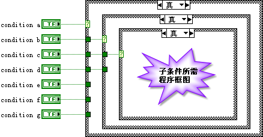

To optimize this for LabVIEW's dataflow model, you should combine the multiple Boolean inputs into a single selector value using array conversion or logical operations. Then, wire the combined value to a single, multi-case Case Structure (as shown below). This flat design eliminates nesting, making every execution path clean and inspectable at a glance:

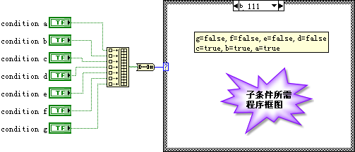

In the example above, the Boolean inputs are bundled into an array and converted to an integer, so the Case Structure selector labels use binary representations (e.g., `000`, `001`, `010`). This clearly documents the state combinations on each case banner.


## Compiled vs. Interpreted Execution

LabVIEW is a fully compiled language, similar to C++ or Java. The compiler enforces strict syntax rules and validates all node connections. If the compiler detects an error (such as a type mismatch or an unwired required input), the VI is marked as broken and cannot run.

Beginners often mistakenly believe LabVIEW is an interpreted language because they don't see separate `.obj` or `.exe` files generated during editing, and there is no visible "Compile" button or noticeable compilation delay before clicking the Run arrow.

This is because LabVIEW uses an incremental, background compilation model.

In C, source code resides in `.c` files, and you manually trigger the compiler to output binary `.obj` files. In LabVIEW, a `.vi` file contains *both* the source G code (graphical diagrams) and the compiled binary executable target code for the host platform.

While a `.c` file can contain many functions, a standard `.vi` file represents a single function (virtual instrument). Tell-tale exceptions like Express VIs do not have external `.vi` files; their compiled block diagrams are serialized and embedded directly inside their host caller VIs. This is why a host VI's file size can swell significantly when it uses Express VIs.

Because the compiled machine code is stored directly within the `.vi` file alongside the G source, there is no need for separate object files. LabVIEW compiles your code incrementally in the background as you edit the diagram. When you draw a wire or drop a node, the compiler immediately checks type compatibility and re-compiles that specific code path. This background compilation is extremely fast and completely imperceptible to the developer.

When you load a VI, LabVIEW checks if it needs to re-compile the binary target code. Normally, it loads the pre-compiled binary instantly. However, re-compilation is triggered in two cases:

1. **Version Upgrades**: When opening a VI saved in an older version of LabVIEW (e.g., loading a LabVIEW 2018 file in LabVIEW 2024).
2. **Cross-Platform Transfers**: When opening a VI on a different OS (e.g., moving a VI from Windows to Linux/macOS). The compiler must compile the source G code into the target binary instructions matching the new platform.

If your project contains hundreds of VIs, opening the top-level VI in a newer version of LabVIEW will trigger a noticeable background compilation phase as the compiler updates the binary target code for the entire hierarchy. Similarly, moving a Windows-developed VI to an RT target or Linux environment triggers re-compilation.

After a background compile (due to platform or version migration), an asterisk (`*`) appears in the VI window's title bar. This indicates that the file is dirty and must be saved. Even though you did not edit the G code, the compiled binary code stored inside the `.vi` file has changed, requiring a save operation.

When upgrading LabVIEW, NI often recommends performing a **Mass Compile** (via **Tools >> Advanced >> Mass Compile...**) to re-compile entire directories of VIs. For large codebases, this process can take minutes or hours, showing the scale of the compiler's optimizations.

During standard editing, only the active VI compiles. Since each VI is visually constrained to a single screen, the compilation finishes in milliseconds. If you wire a string output to a numeric input, the **Run** button immediately turns into a broken arrow. This is the compiler telling you that compilation has failed due to type mismatch. Once you fix the wire, the Run button restores, meaning the VI is pre-compiled and ready to run instantly.

Sometimes, a VI opens with a broken Run arrow, but clicking the arrow opens an empty error list. This happens when the cached binary is out of sync with the environment. For example, if the VI was saved while a dependency (like a DLL) was missing, its binary was flagged as unexecutable. If you restore the DLL on disk and reopen the VI, LabVIEW might load the cached unexecutable binary without triggering a re-compile. Since the G code itself has no syntax errors, the error list is empty.

To force LabVIEW to rebuild the VI's binary target code, hold **Ctrl + Shift** and left-click the **Run** button. This forces a complete compilation of the VI and its subVI hierarchy, updating the cached executable code and restoring the Run arrow.

Storing G source code and compiled binary instructions inside a single `.vi` file has distinct trade-offs:

### Advantages
- **No Compilation Delays**: Background incremental compilation means you never have to wait hours for a build.
- **Runnable SubVIs**: You can open and run any SubVI independently on its own Front Panel for testing, without having to build a harness or execute from the main program entry point.

### Disadvantages
- **Source Code Control (SCC) Noise**: When you open and run a VI, LabVIEW may update its internal compiled state (e.g., caching platform details). If you save, SCC systems (like Git) will flag the file as modified even if you did not change a single pixel of G code. This makes code reviews noisy.
- **Large File Sizes**: `.vi` files are larger because they contain binary target codes.
- **Version Lock**: Upgrading LabVIEW requires resaving all VIs to update their binary formats.


## Dataflow Execution Engine

Traditional text-based languages use **control flow** to execute statements sequentially (line by line). A statement must wait for its predecessor to execute, and execution is single-threaded by default unless you explicitly launch threads.

In contrast, LabVIEW uses a **dataflow** model. A node (function, SubVI, or structure) executes *only when all of its input terminals receive data*. When a node finishes execution, it outputs data to its outgoing wires, triggering downstream nodes. 

Because execution order is governed strictly by data availability rather than physical layout, nodes whose inputs are independent can run in parallel. The LabVIEW execution engine includes an automatic scheduler that distributes independent dataflow paths across a **Thread Pool**, enabling native, automatic multi-threading without requiring the developer to manage threads.

This automatic multi-threading is highly convenient, but concurrency raises the risk of **race conditions** (two threads reading/writing the same memory space simultaneously, causing corrupted data). In text-based languages, managing locks and mutexes to protect memory is the developer's responsibility.

To ensure strict data safety, LabVIEW's default execution model is **Pass-by-Value**. When a wire branches, LabVIEW conceptually duplicates the data so that each parallel execution path operates on its own isolated memory copy. This completely eliminates race conditions on G wires.

### Pass-by-Value vs. Pass-by-Reference

Passing data by value ensures safety, but copying large datasets (like a 10 million element array) consumes significant memory and CPU cycles. In text-based languages, you use pointers or references to pass memory addresses without copying the data, but this requires manual concurrency control.

To balance safety and performance, the LabVIEW compiler does not always duplicate data when a wire branches. It performs **In-place Optimization (buffer allocation optimization)**. If the compiler determines that a node reads data but does not modify it, or if it can safely reuse the input memory buffer for the output (e.g., modifying an array element in-place), it avoids creating a copy:

- **Input/Output Type Mismatch**: Nodes like *Index Array* accept an array but output an element. Because the types differ, LabVIEW must allocate new memory for the output element.
- **In-Place Execution**: For nodes with matching input/output types (like *Add*), the compiler attempts to overwrite the input buffer directly (in-place operation) if it knows the input data is not needed elsewhere.

For example, if a large array wire branches to both an *Index Array* node and an *Add* node, the compiler optimizes execution order: it runs the *Index Array* node first (which only reads the buffer), and then runs the *Add* node, which can then safely overwrite the original buffer. This prevents data copying.

For scenarios where you must share a single resource (like a hardware session or global configuration) across threads without copying, LabVIEW provides **Refnums (Reference Numbers)** (such as VISA, File, or Queue Refnums) and **Data Value References (DVRs)**. Wiring a refnum passes only the pointer value, ensuring that the underlying resource is accessed by reference.


### Static Data Space Allocation

In text-based languages like C, a function's local variables are allocated dynamically on the **Call Stack** when the function is called, and popped off the stack when it exits. 

LabVIEW does not use a stack for standard VIs. Instead, when a VI is loaded, LabVIEW allocates a **Static Data Space** in memory for the VI's variables (including wire values, control terminals, and Shift Registers). This memory space is allocated once and remains at a fixed address throughout execution.

#### Advantages
- Eliminates the performance overhead of allocating and deallocating stack frames on every call.
- Allows variables (like Shift Registers) to retain their values between successive runs of the VI.

#### Disadvantages & Reentrancy
Because there is only one static data space per VI, a standard VI is **non-reentrant**:
- **No Recursion**: A VI cannot call itself, as the nested call would overwrite the active data space of the outer call.
- **Sequential Execution**: If you call the same non-reentrant SubVI in two parallel paths on a diagram, LabVIEW cannot run them concurrently. It forces them to execute sequentially (one after the other) because they share the same data memory.

Shared static data space is sometimes useful (e.g., forcing serial access to a hardware port), but it introduces bottlenecks if parallel loops must wait for a shared SubVI.

To allow parallel execution or recursion, you must configure the SubVI as **Reentrant** (via **VI Properties >> Execution >> Reentrancy**). A reentrant VI allocates a separate data space (clone) for each call site, allowing them to run concurrently without interference.


## Separating Compiled Code from Source Code

By default, a `.vi` file contains multiple components: the Front Panel control layout, the Block Diagram graphical code, edit-time layout metadata, and the compiled binary machine code.

While convenient for self-contained portability, this layout causes severe issues in professional software development:
- **Redundancy**: SubVIs rarely need their Front Panel metadata at runtime, yet they carry it, wasting disk space and memory.
- **Source Code Control (SCC) Conflicts**: Opening a VI in different LabVIEW bitness (32-bit vs. 64-bit) or on a different OS re-compiles its binary code. If you save, Git flags the file as modified. This makes tracking genuine G code edits extremely difficult.

To solve this, LabVIEW 2010 introduced the ability to **Separate Compiled Code**. You can enable this by checking **Separate compiled code from source file** in the VI Properties dialog (under the **File** page, or configure it globally in the project settings):

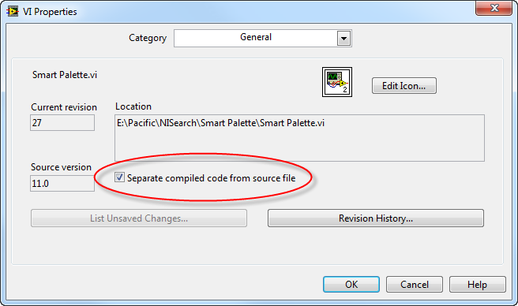

When enabled:
- The `.vi` file stores *only* the G source code and UI layout.
- The compiled binary executable code is moved to a centralized object cache on the local PC (located in the user directory under `LabVIEW Data\VIObjCache\`).

**Best Practice**: Always enable **Separate Compiled Code** for all files in a professional project. This keeps Git diffs clean (since changing the environment or bitness only modifies the local obj cache, not the `.vi` source file) and minimizes merge conflicts.


## Compiler Optimizations and SubVI Inlining

While modularizing code into SubVIs improves maintainability, calling a SubVI introduces minor thread and boundary overhead. However, the largest performance cost of modularity is that **the LabVIEW compiler optimizes code VIs individually**. 

Standard compiler optimization techniques include:
- **Dead Code Elimination**: Removing unreachable cases or code paths.
- **Loop-Invariant Code Motion**: Moving calculations that do not change inside a loop to the outside of the loop.
- **Common Subexpression Elimination**: Merging redundant calculations on the same data.
- **Constant Folding**: Computing constant expressions (like $2 + 3$) at compile time.

Because these optimizations are isolated within each VI, the compiler cannot optimize across the boundary of a SubVI. For example, if you pass a constant to a SubVI, the compiler cannot evaluate constant folding inside the SubVI code.

To solve this, LabVIEW supports **SubVI Inlining**. In the VI Properties dialog under the **Execution** page, check **Inline subVI into calling VIs**:

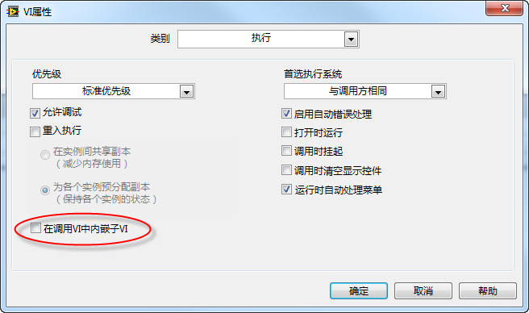

When compiled, LabVIEW copies the SubVI's Block Diagram directly into the caller VI, replacing the SubVI node. This removes the SubVI boundary, allowing the compiler to optimize the combined code globally.

> [!NOTE]
> An inlined SubVI must be configured as **Reentrant** (preallocated clone) because its code is copied to each call site, and debugging/automatic error handling must be disabled.
>
> 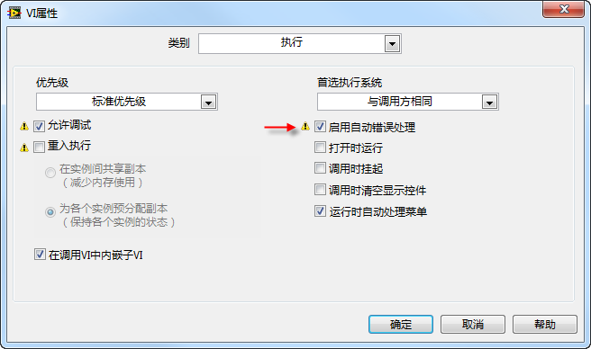

### Walkthrough of Compiler Optimization

Let's look at an example. We create a SubVI `Inline sub VI.vi` that takes two numbers and an operation string ("Add" or "Sub") and outputs the result:

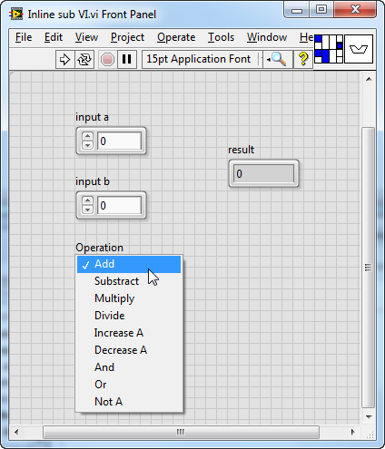
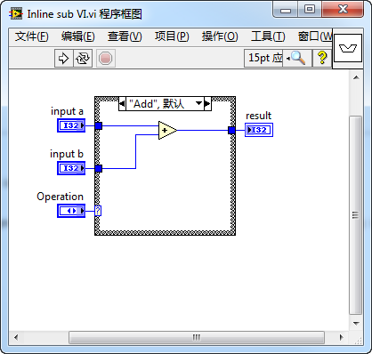

We configure this SubVI to be inlined and call it inside a loop in `main.vi`, passing a constant "Add":

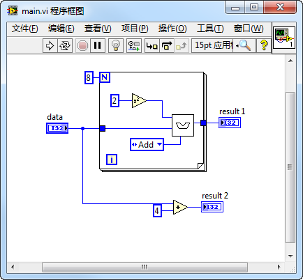

Let's look at how the LabVIEW compiler optimizes the compiled code (visualized as G diagrams for clarity):

1. **Inlining**: The compiler copies the SubVI diagram into the loop:

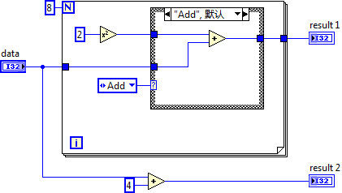

2. **Dead Code Elimination**: Since the selector input is a static constant "Add", the "Sub" case can never execute. The compiler deletes the dead branch:

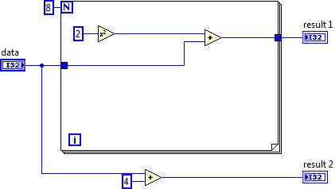

3. **Loop-Invariant Code Motion**: The square operation does not depend on the loop index. The compiler pulls it out of the loop:

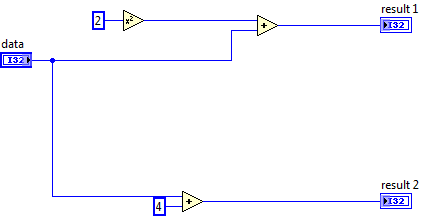

4. **Constant Folding**: The input to the square node is a constant `5`. The compiler pre-computes $5 \times 5 = 25$ at compile time, replacing the node with a constant:

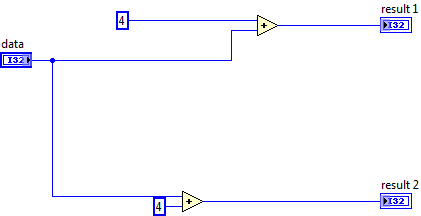

5. **Common Subexpression Elimination**: The diagram performs the same addition on the loop index twice. The compiler merges them into a single node:

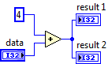

Through inlining, a complex, modular program is optimized into a highly efficient compiled binary. However, avoid inlining massive VIs or VIs called in many places, as this will cause **code bloat**, increasing file sizes and CPU cache misses. Use inlining selectively for small, helper VIs where performance is critical.
