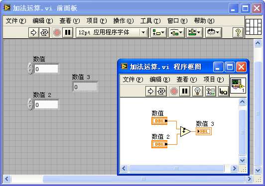
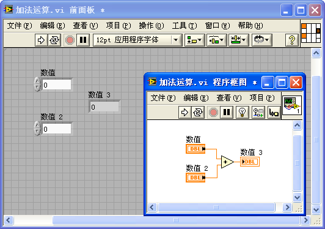
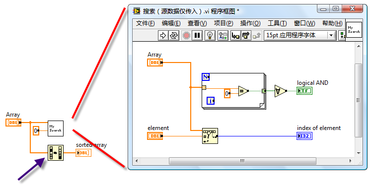
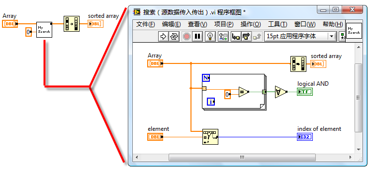

# Memory Optimization

## VI Structure in Memory

When you open the properties dialog of a VI, the "Memory Usage" page provides insights into the VI's memory footprint:

This display breaks down a VI's memory usage into four main parts: front panel objects, block diagram objects, code and data, and their cumulative total. Notably, when a VI is launched in LabVIEW, these components are not loaded into memory all at once. Opening a main VI brings its code and data segments into memory, along with those of all its sub VIs. Since the front panel of the main VI typically needs to be open, it too is loaded into memory. However, the main VI's block diagram and the front panels and block diagrams of sub VIs remain unloaded until required, such as when inspecting the main VI's block diagram or accessing the sub VIs' front panels and block diagrams.

Given LabVIEW's approach to memory management, here are strategies to enhance memory efficiency in LabVIEW programming:

1. **Break down complex VIs into multiple sub VIs.** Implementing sub VIs introduces additional front panel and block diagram overhead but does not increase code and data footprint. As program execution primarily demands code and data, sub VIs do not incur extra memory usage. A significant benefit of sub VIs is LabVIEW's ability to efficiently reclaim unused data spaces once a sub VI concludes, optimizing memory utilization.

2. **Refrain from making sub VIs reentrant unless necessary.** Reentrant VIs duplicate their data usage with each execution, leading to higher memory use.

3. **Minimize opening sub VI front panels.** Utilizing property nodes linked to a sub VI's front panel controls triggers loading of its front panel into memory, raising memory demands. Thus, it's advisable to avoid property nodes related to sub VI front panel controls within the sub VI itself.

4. **It's safe to embellish the block diagram of a VI and the front panels of non-UI VIs with images, annotations, and other help aids that won't be accessed during runtime.** These additions assist in the development and maintenance of LabVIEW programs without affecting runtime memory consumption.

## Memory Leaks

LabVIEW, unlike the C language, does not contain any commands for manually allocating or releasing memory. Instead, LabVIEW manages memory automatically, allocating or reclaiming it as needed. This design prevents the common issue of memory leaks in C language, which are often caused by programmers improperly managing memory.

In LabVIEW, memory leaks typically arise under one specific condition: when resources are opened but not subsequently closed. For instance, file operations require opening a file and obtaining a reference handle. If this handle is not closed afterwards, the memory it uses will never be reclaimed, leading to a memory leak. This problem can occur with any function or VI that opens a handle in LabVIEW.

Since memory leaks occur dynamically, they cannot be detected through the properties panel of a VI. However, you can monitor for potential memory leaks in LabVIEW programs using the Task Manager in Windows. Consider a program that continuously creates new XML documents within a loop without closing them. Each creation of an XML document requires some memory. If the loop is allowed to run indefinitely, the memory consumption of the VI will increase over time.

The impact of memory leaks can be observed in the Windows Task Manager. By pressing `Ctrl + Alt + Delete` and opening the Task Manager, you can monitor the system's memory usage on the "Performance" tab. The "Page File Usage History" graphically displays the current state of memory usage. As the aforementioned program begins to run, a noticeable increase in "Page File Usage History" can be observed:

The "Page File Usage History" shows the overall memory usage by all programs on the system. To specifically check LabVIEW's memory usage, look at the "Peak Memory Usage" for LabVIEW.exe in the "Processes" tab. This metric records the maximum amount of memory LabVIEW has used during operation. An ongoing increase in Peak Memory Usage during the execution of a program indicates a memory leak:

## Cache Reuse

LabVIEW programs operate on a data flow principle. As data is transmitted between different nodes, it often necessitates making a duplicate. This duplication is a protective measure in LabVIEW, designed to prevent errors that could arise if data were altered at the nodes. LabVIEW avoids making backups at nodes if the target node is read-only and it is confirmed that the node cannot modify the input data. For instance, the "Index Array" function, which doesn't alter the array values, does not prompt LabVIEW to backup the input array. Conversely, for nodes that inherently modify input data, such as addition or subtraction operations, LabVIEW will backup either the input or output data. When the program operates on simple data types or on arrays and clusters with very few elements, these types occupy minimal memory, and duplicating them multiple times does not significantly increase memory consumption.

Yet, some LabVIEW programs, particularly those that perform operations on large arrays, can be heavy on memory usage. The primary reason is LabVIEW's creation of excessive data copies during array operations.

Many LabVIEW nodes, in reality, support cache reuse. This is somewhat analogous to the address passing technique used in subfunction calls in C language. By carefully designing and utilizing nodes capable of cache reuse, the memory footprint of LabVIEW programs can be greatly reduced. The "Tools -> Performance and Analysis -> Show Buffer Allocations" feature allows users to examine how buffers are allocated within a VI's block diagram:

By activating this tool and selecting the data type you wish to inspect for buffer allocations, any part of the block diagram responsible for buffer allocation will be marked with a black dot. Here are the findings for a few commonly used nodes:

### Standard Operation Nodes

In the program above, a constant is incremented by 1, and the result is then outputted. The "+1" function's output is marked with a black dot, indicating that LabVIEW has allocated a buffer to store the result of this operation. However, it would be entirely feasible to utilize the memory space of the input data for storing this result. LabVIEW can be instructed to reuse the memory space of the input data at this operation node by the following approach:

The diagram above illustrates an optimized VI. By substituting the original numeric constant input with a control-type numeric control, LabVIEW no longer allocates a new buffer at the "+1" function. Since constant data is immutable, its memory space cannot be repurposed for storing other data, necessitating that the results of operations on constants be stored in a newly allocated data space.

This characteristic of avoiding unnecessary buffer allocation applies to other operation nodes in LabVIEW as well.

### Shift Registers

Shift registers play a vital role in optimizing memory within LabVIEW because they enforce the use of the same memory across the terminals at both ends of a loop structure. This feature can signal LabVIEW to reuse the input and output buffers when compiling the loop's code.

Let's examine the program depicted below.

This program constructs an array and then applies a series of mathematical operations to it. LabVIEW allocates a buffer for each operation to store the results. When accessing the "Memory Usage" tool from the VI's properties panel, it's evident that this VI consumes approximately 2.7MB of memory. However, these multiple copies are unnecessary; the results from each operation could be stored in the memory space originally allocated for the input data. To circumvent this, we can encapsulate all operational nodes into a sub VI and apply the previously mentioned cache reuse strategy:

Below are the sub VI and its block diagram:

Invoking this sub VI:

Apart from employing a sub VI, cache reuse can also be facilitated using shift registers:

As illustrated, placing the operational code inside a loop that executes only once, and connecting both the operation's input and output to the shift registers, effectively notifies LabVIEW that the operation's input and output should utilize the same buffer space. Consequently, LabVIEW refrains from allocating new buffers for each step and instead reuses the buffer allocated for the input data to store the results. Opening the memory usage in the VI properties panel reveals that this VI's memory footprint has reduced to one-sixth of its original size.

Employing shift registers to optimize memory in a loop structure is a nuanced approach. Programmers not acquainted with this technique might find such code confusing, which could detract from the program's readability. Luckily, with LabVIEW 8.5, a new structure was introduced: the "In-Place Element Structure" found under "Programming -> Application Control -> Memory Control". This structure is specifically designed for memory optimization in code. The following program, optimized with the In-Place Element Structure, achieves identical outcomes as the one utilizing shift registers:

The In-Place Element Structure offers an advantage over shift registers by allowing integration with array indexing and cluster bundling operations. It ensures that while replacing array or cluster elements, existing buffers are used as efficiently as possible to conserve memory:

### Using Library Function Nodes

To delve into cache reuse, let's consider library function nodes that pass integer parameters. These nodes allow for a choice between value passing and pointer passing in their parameter configuration panel.

With value passing, the library function call node does not alter the parameter's content. If input data enters the node's parameter on the left terminal and output data exits from the right terminal, LabVIEW does not allocate a new buffer at this node because the node's output data is directly derived from its input data.

In pointer passing, however, LabVIEW assumes the input data might be modified. Since the input data could also be directed to other nodes, LabVIEW allocates a buffer at this juncture to hold a copy of the input data. This means that using pointer passing, each pair of terminals on the library function call node engages in cache reuse; essentially, the node's output values are stored directly in the input value’s buffer space.

For parameters serving solely as outputs, an input constant is often established at the node's input terminal. This constant's address space, while not directly utilized, serves as an initial placeholder for buffer allocation by the node. Even without inputting a constant, LabVIEW allocates a buffer for this parameter, leading to variable parameter values with each execution. For instance, in the function below, which adds 1 to its input and outputs the result, the output in scenario a is always 1. In scenario b, because the library function call node reuses the same buffer for each pointer-passed parameter's input and output, each run's input is the previous run's output, resulting in a cumulative increase of 1 with each iteration.

Program c above serves as evidence that some nodes in LabVIEW reuse caches. Running the program c example, the output incrementally increases by 2 on each execution. This is due to both the library function parameter terminals and the "+1" node’s input/output terminals utilizing the same buffer.

If a parameter in a library function call node is only connected to an input, with no corresponding output, LabVIEW assumes the called function will not modify this parameter. Consequently, it does not duplicate this data but reuses the existing cache. Under these circumstances, if the called function alters this data, the program might encounter a hidden risk: other parts of the program could be using this data, and although there may be no visible modifications, its runtime value might not align with expectations. This discrepancy occurs because the cache containing this data was repurposed by another library function call node, which covertly modified it.

In the examples provided, if a library function call node’s output parameter is an array or string, an array or string matching the output data size must be connected to its input. Without this, LabVIEW cannot ascertain the output data size, and default buffer allocations could lead to array out-of-bounds errors.

### Cache Reuse in Sub VI Parameters

In a well-crafted LabVIEW program, data can be efficiently reused as it moves between sub VIs, avoiding duplication and significantly boosting program performance.

Take a look at the VI illustrated below. Using the "Show Buffer Allocations" tool previously discussed, we observe memory allocation within this VI and notice a black dot at the addition function. This indicates that the program has allocated additional memory here specifically to store the outcome of the addition.

Why doesn't the addition function utilize cache reuse here? Why not use the memory space of one of the operands to store the result?

In the depicted VI, the operand's data, Numeric, is sourced from a control on the VI's front panel. Assuming the control's value is unchanged, it should remain constant across VI executions. If the addition function were to implement cache reuse, the operand's data—or the control itself—would be altered post-computation, potentially leading to logical errors in the program.

Thus, connecting such a control directly to a LabVIEW operation function means the function node cannot reuse the control's data memory. The same logic applies when connecting a constant to a function node, preventing cache reuse. In sub VIs, input controls not connected to the connector pane essentially act as constants.

However, connecting the VI's controls to the connector pane changes the dynamics entirely. As seen in the figure below, when three controls are linked to the connector pane, the black dot on the addition node vanishes. This means no new memory is allocated for the computation result.

This change occurs because, with input controls linked to the connector pane, LabVIEW considers these input values to be provided by the caller of the sub VI (the parent VI). Conceptually, connecting input controls to the connector pane transforms them from constants to input variables for the sub VI. As input variables, the sub VI no longer needs to preserve the original input data. Thus, the newly generated data can occupy the input parameter's memory space, facilitating cache reuse.

What happens, though, if the modified input parameter's data is still required by other nodes in the parent VI?

This consideration falls outside the sub VI's scope of concern. Any modification to the input data is assured to be safe, safeguarded by the parent VI. If the input data should remain unchanged, the parent VI will duplicate the data before sending it to the sub VI.

In the program below, which calls the previously mentioned sub VI, the input parameter connected to the sub VI's upper-left connector pane is a constant. Since constants are immutable, LabVIEW duplicates this value before passing it to the sub VI, enabling the sub VI's operation nodes to implement cache reuse.

If the parent VI's input control is also connected to the connector pane, supplying input parameters to the sub VI, LabVIEW recognizes that this data comes from an even higher-level VI, eliminating the need for data duplication at this point and thereby achieving cache reuse. If executed correctly, passing parameters through multiple VI layers can be accomplished without the need for new memory allocations.

This discussion also highlights an important aspect: modifications within a sub VI can affect the parent VI's behavior, such as whether the data passed to the sub VI is duplicated. Consequently, modifying a sub VI sometimes necessitates resaving the parent VI.

### Layout of Input and Output Parameters

In the block diagram of a sub VI, no matter how complex the code or how many nested structures there are, the ideal arrangement for control terminals is as follows: place all input parameters (control-type control terminals) on the extreme left side in a single column, and all output parameters (indicator-type control terminals) on the extreme right side, also in a single column. This means input and output parameters are best positioned outside the internal structures of the VI, as illustrated below:

This arrangement primarily enhances the program's readability. When navigating LabVIEW code, the natural inclination is to read from left to right. Organizing all input parameters on one side makes it easier to follow the data lines and locate where data is being read and written.

Furthermore, this VI style is optimized for performance. Let's discuss the efficiency benefits of this arrangement for inputs and outputs.

If an input parameter's terminal is placed on the code's extreme left, outside all structures, it is the first part of the block diagram to be executed. This allows the VI to immediately read data from this input control upon starting.

However, if an input parameter's terminal is located within a structure in the code, LabVIEW must enter this structure to read the parameter's value, potentially causing logical errors. For example, the program shown below has an input parameter terminal inside a loop structure. If this were a sub VI, the "Initial Value" input would remain unchanged during the VI's execution. But if it's an interface VI, users might alter the "Initial Value" control while the loop is active. Since LabVIEW cannot predict the VI's usage context, it must read the "Initial Value" data in each loop iteration for safety. To prevent errors in future reads, LabVIEW cannot reuse the cache for this data.

If the "Initial Value" terminal is outside the loop, LabVIEW understands it only needs to read the data once at the program's inception. Therefore, LabVIEW can reuse the "Initial Value" data cache when necessary, avoiding the need for new memory allocations and data copying, hence enhancing memory efficiency.

Regarding output parameters, if a terminal is within a conditional structure, LabVIEW must consider the possibility that the condition may not execute. LabVIEW then has to add code to manage this situation, at least ensuring a default value is prepared for the output parameter. For instance, in the program below, the "Result" output is located within branch 1 of a conditional structure. If the "Method" input is 1, the VI assigns the "Initial Value" plus 10 to "Result". However, if "Method" is 0, and there's no code assigning a value to "Result", LabVIEW must introduce extra code to generate an output value for "Result".

By moving the "Result" output terminal outside the conditional structure, the programmer explicitly provides output values for different conditions, eliminating LabVIEW's need to add automatic code and thus improving the program's performance.

### Enhancing Program Memory Efficiency Through Data Flow Structure

Consider the following program:

In the diagram, the left side displays the block diagram of the main VI, which includes an input array parameter "Array". This input data is directed to two sub VIs: "My Search" and the "1D Array Sort" function. On the right side is the block diagram for the sub VI "My Search".

It's noteworthy that there's a black dot within the 1D array sort function icon in the main VI, indicating a memory allocation at this point. This occurs because the Array data is simultaneously passed to both "My Search" and "1D Array Sort" for processing. These operations may execute concurrently. To ensure safety (preventing data modifications from affecting each other and avoiding simultaneous read-write operations on the same memory), LabVIEW must allocate separate memory backups for these nodes. Thus, if one operation utilizes the original Array memory, the other must create its own data copy.

However, a closer look at the "My Search" sub VI reveals that it does not alter the Array data. Therefore, there's no need for the main VI to allocate new memory. If "My Search" runs first without changing the Array data, running the 1D array sort afterwards allows the original Array cache to be reused for storing results.

A minor adjustment to the program can optimize it. Below is the revised program:

In the revised program, the Array data first enters the "My Search" sub VI, exits, and then proceeds to the "1D Array Sort" function. While it appears the data takes an extra loop through the sub VI, the input and output of the Array within the sub VI utilize cache reuse, effectively passing only the array data reference to the sub VI, making the operation highly efficient. In the main VI, executing the "1D Array Sort" now allows LabVIEW to recognize that the input data is exclusive to this node and can be safely modified, facilitating cache reuse. Consequently, the small black dot on the "1D Array Sort" disappears.

This main VI benefits from adhering to data flow principles, with its main data seamlessly flowing from left to right through each node, making the program straightforward to read and understand. LabVIEW finds it easier to optimize such structured code, typically resulting in more efficient programs.

Although leveraging LabVIEW's automatic multithreading features for parallel code can enhance program efficiency—especially for sections requiring lengthy computations or data operations—parallel code comes with challenges, including increased complexity and a higher likelihood of errors. Multithreading may also incur additional overhead. For programs like the one discussed, with significant data volumes but no intensive computations or data operations, sequential processing is more efficient than parallel.

