# Memory Optimization

## VI Structure in Memory

When you open the properties dialog of a VI, the "Memory Usage" page provides insights into the VI's memory footprint:

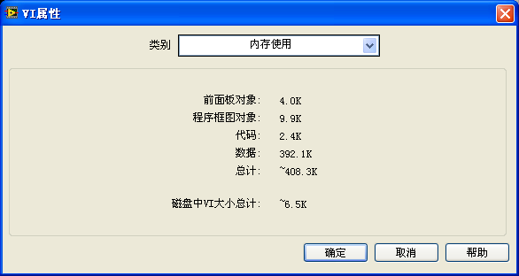

This display breaks down a VI's memory usage into four main parts: front panel objects, block diagram objects, code and data, and their cumulative total. Notably, when a VI is launched in LabVIEW, these components are not loaded into memory all at once. Opening a main VI brings its code and data segments into memory, along with those of all its subVIs. Since the front panel of the main VI typically needs to be open, it too is loaded into memory. However, the main VI's block diagram and the front panels and block diagrams of subVIs remain unloaded until required, such as when inspecting the main VI's block diagram or accessing the subVIs' front panels and block diagrams.

Given LabVIEW's approach to memory management, here are strategies to enhance memory efficiency in LabVIEW programming:

1. **Break down complex VIs into multiple subVIs.** Implementing subVIs introduces additional front panel and block diagram overhead but does not increase the code and data footprint. Since program execution primarily requires the code and data segments, subVIs do not incur extra runtime memory usage. A significant benefit of subVIs is LabVIEW's ability to efficiently reclaim their temporary data space once the subVI finishes executing, optimizing memory utilization.

2. **Refrain from making subVIs reentrant unless necessary.** Reentrant VIs allocate separate data spaces for each instance (clone) at runtime, leading to higher memory consumption.

3. **Minimize opening subVI front panels.** Accessing property nodes or control/indicator references of a subVI's front panel controls triggers loading its front panel into memory, increasing memory overhead. Thus, it is advisable to avoid using property nodes that reference front panel controls in a subVI unless absolutely necessary.

4. **It is safe to enrich the block diagram of a VI, as well as the front panels of non-UI VIs, with images, comments, decorations, and other documentation aids.** Since these are not loaded or accessed during runtime execution, they do not affect runtime memory consumption.

## Memory Leaks

Unlike languages like C, LabVIEW does not require or provide functions for manual memory allocation and deallocation. Instead, LabVIEW manages memory automatically, allocating or reclaiming it as needed. This automatic memory management prevents the common memory leak bugs associated with manual pointer management.

In LabVIEW, memory leaks typically arise when references or resources are opened/allocated but not closed or released. For instance, file, network, or VI Server operations require opening a resource and obtaining a reference or handle. If this reference is not explicitly closed, the associated memory and system resources remain allocated, leading to a resource or memory leak. This can happen with refnums, file info, database connections, ActiveX/generic references, or any functions that allocate system handles.

Because memory leaks accumulate dynamically at runtime, they cannot be detected through the static VI Properties dialog. However, you can monitor for potential memory leaks in LabVIEW programs using the Task Manager in Windows. For example, consider a loop that repeatedly creates XML documents or opens files without closing the handles. Each iteration allocates more memory, causing the application's memory usage to steadily climb.

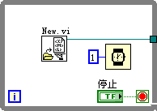

The resulting memory growth can be observed in the Windows Task Manager. In the Task Manager, you can monitor the process's memory usage or check system-wide usage on the **Performance** tab. As the leaking program runs, the system memory consumption continuously rises:

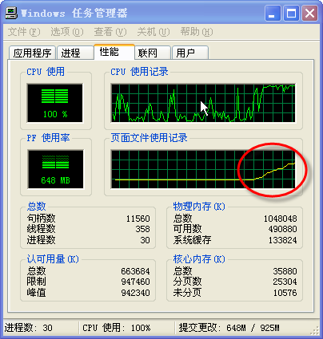

To isolate LabVIEW's memory usage, you can monitor the memory consumption of the `LabVIEW` (or `LabVIEW.exe`) process under the **Details** or **Processes** tab. A steady, unbounded increase in memory usage (such as working set or commit size) while the program runs is a clear sign of a memory leak:

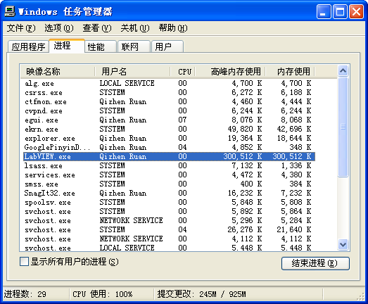

## Buffer Reuse

LabVIEW programs operate on dataflow principles. As data travels along wires between different nodes, the execution system may need to create a duplicate of the data. This duplication (data copying) is a safety mechanism in LabVIEW designed to ensure that operations executing in parallel do not interfere with each other or corrupt data. LabVIEW avoids copying data if the downstream node is read-only and cannot modify the input data. For instance, the **Index Array** function, which only reads elements, does not require LabVIEW to allocate a new buffer for the input array. Conversely, nodes that modify data (e.g., addition, subtraction, or inserting elements) may require a new buffer if the original data must be preserved for other wires.

For scalar values or small arrays/clusters, copying data is extremely fast and has negligible memory overhead. However, when working with large arrays or datasets, excessive buffer copies can lead to high memory consumption and performance degradation.

Fortunately, many LabVIEW nodes support **buffer reuse** (in-place memory operations), where an operation overwrites its input buffer with the output results, similar to passing by reference or pointer in C. By designing your code to maximize buffer reuse, you can dramatically reduce memory usage and avoid GC-like spikes. To help inspect this, LabVIEW provides the **Show Buffer Allocations** tool (**Tools -> Profile -> Show Buffer Allocations**):

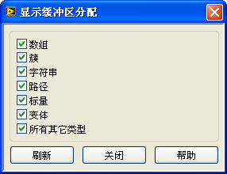

By activating this tool and selecting the data type you wish to inspect for buffer allocations, any part of the block diagram responsible for buffer allocation will be marked with a black dot. Here are the findings for a few commonly used nodes:

### Standard Operation Nodes

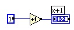

In the program above, a constant is incremented by 1, and the result is output. The output of the **Increment (+1)** function is marked with a black dot, indicating that LabVIEW has allocated a new buffer to store the output. However, it would be more efficient to perform this operation in-place, reusing the input memory. We can allow LabVIEW to reuse the buffer by using a control instead of a constant:

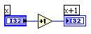

In this updated block diagram, by replacing the numeric constant with a control, the black dot on the **Increment (+1)** function disappears, indicating that LabVIEW is reusing the input control's buffer. Because constants are hardcoded and immutable in memory, their memory space cannot be overwritten, forcing LabVIEW to allocate new buffers for operations directly connected to them.

This characteristic of avoiding unnecessary buffer allocation applies to other operation nodes in LabVIEW as well.

### Shift Registers

Shift registers play a vital role in memory optimization because they enforce the reuse of the same memory buffer across iterations and between the loop's input and output terminals. This helps the LabVIEW compiler optimize buffer reuse.

Let's examine the program depicted below.
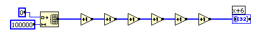

By checking the **Memory Usage** section in **VI Properties**, we can see that this VI consumes about 2.7 MB of memory. These copies are redundant; the results of each operation could easily overwrite the input array's buffer. To prevent this overhead, we can encapsulate the calculations into a subVI and apply the buffer reuse rules discussed above:

Below are the subVI and its block diagram:

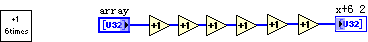

Invoking this subVI:

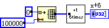

Apart from employing a subVI, buffer reuse can also be facilitated using shift registers:

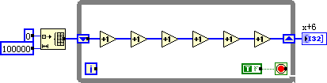

By wrapping the calculation in a single-iteration loop (e.g., a While Loop with a `True` constant wired to the stop terminal) and passing the array through shift registers, we tell the compiler that the input and output data share the same buffer. LabVIEW will reuse this buffer for the intermediate math operations rather than allocating new ones. The memory usage of the VI drops to about one-sixth of the original size.

Using shift registers inside a single-iteration loop solely for memory optimization is a somewhat non-intuitive workaround that can harm code readability. To address this, LabVIEW introduced the **In-Place Element Structure** (located in **Programming -> Application Control -> Memory Control**). This structure explicitly instructs the compiler to perform operations in-place. The following program uses this structure to achieve the same memory optimization as the shift register workaround, but in a much cleaner and more readable way:

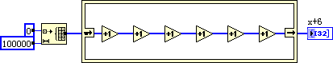

The In-Place Element Structure is also extremely powerful for array indexing, cluster unbundling/bundling, and map/set operations. It ensures that when modifying specific elements inside an array or cluster, the compiler avoids copying the entire complex structure, performing the updates directly in-place:

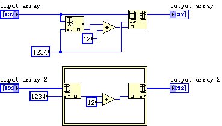

### Using Call Library Function Nodes

To better understand buffer reuse, consider a **Call Library Function Node** (CLFN) calling a C/C++ DLL function with integer parameters. In its configuration panel, you can choose to pass parameters **by value** or **by pointer**.

When passing by value, the node cannot modify the original parameter. If you wire a value into the left side of the CLFN and output it from the right side, LabVIEW does not allocate a new buffer because the input value is simply copied to the output wire.

When passing by pointer, LabVIEW assumes the DLL function might modify the value. If the input wire is also branched to other nodes, LabVIEW will duplicate the data to prevent other nodes from seeing the modified value. However, if there are no other branches, the CLFN will reuse the input buffer directly (in-place operation), modifying the value in that buffer and outputting it on the right terminal.

For parameters that act strictly as outputs from the DLL, you must still wire an input value (often a constant) to initialize the buffer size (especially for arrays and strings). For scalars, if you do not wire the input, LabVIEW allocates a default buffer, which can lead to unpredictable values. In the example below, the DLL function increments its input pointer by 1. In scenario **a**, the output is always 1 because a constant 0 is wired to the input every time. In scenario **b**, because the input and output share the same shift register (and thus the same buffer), each execution uses the previous run's output as the new input, leading to a cumulative counter.

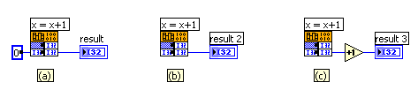

Scenario **c** demonstrates that LabVIEW shares buffers between nodes. In this case, the output increases by 2 on each run because the DLL function and the **Increment (+1)** function share the exact same buffer space in the loop.

If a parameter in a Call Library Function Node is configured as input-only (no output terminal on the right), LabVIEW assumes the DLL will not modify it and passes the buffer directly. If the DLL function violates this contract and modifies the memory anyway, it creates a severe bug: other wires sharing that buffer will have their values corrupted without any indication on the block diagram. This is a common source of memory corruption in LabVIEW DLL integrations.

When calling external DLLs that return arrays or strings, you must pre-allocate the array or string to the required size in LabVIEW and wire it to the input terminal. LabVIEW does not know how much memory the DLL will write; if you do not pre-allocate the buffer, the DLL will write to unallocated or too-small memory spaces, leading to memory corruption, buffer overflows, or application crashes.

### Buffer Reuse in subVI Parameters

In a well-crafted LabVIEW program, data can be efficiently reused as it moves between subVIs, avoiding duplication and significantly boosting program performance.

Take a look at the subVI shown below. Using the **Show Buffer Allocations** tool, we observe a black dot at the **Add** function. This indicates that LabVIEW has allocated a new buffer to store the sum.

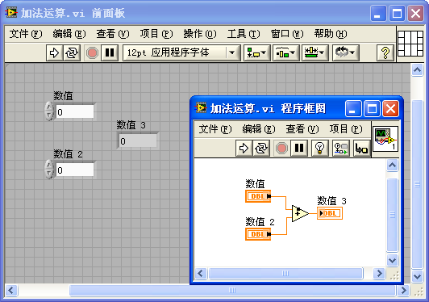

Why doesn't the **Add** function reuse the buffer here? Why not overwrite the memory space of one of the inputs to store the sum?

In this VI, the input data comes from a Front Panel control (`Numeric`). The Front Panel control needs to retain its value so the user can see it. If the **Add** function performed the operation in-place and reused that memory, it would overwrite the control's value on the front panel, which would be a serious logical error.

Thus, a function node cannot reuse the buffer of a Front Panel control. The same applies to constants. In a subVI, any input control that is not connected to the **Connector Pane** acts like a constant because its value can only be modified from its own Front Panel.

However, connecting these controls to the **Connector Pane** changes everything. As shown below, when the controls are linked to the connector pane, the black dot on the **Add** function disappears, meaning no new buffer is allocated for the result.

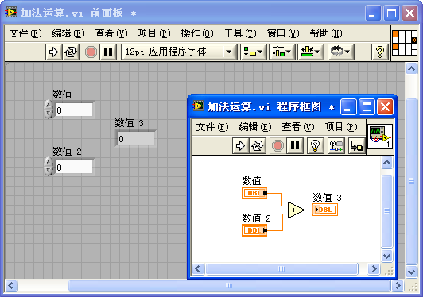

This happens because once an input control is linked to the connector pane, its value is provided by the calling VI. Conceptually, this turns the control into an input parameter. The subVI is no longer responsible for preserving the original value of this input parameter on its own Front Panel unless the Front Panel is open. Consequently, LabVIEW can safely overwrite the input parameter's buffer to store the output, enabling buffer reuse.

Whether the caller still needs the original input data is the caller VI's responsibility. If the caller VI branches the wire and needs to use the input data elsewhere, the compiler will automatically duplicate the data *in the caller VI* before passing it to the subVI.

In the caller VI below, the input passed to the subVI's upper-left terminal is a constant. Since constants are immutable, LabVIEW duplicates the value before passing it to the subVI. This allows the subVI's internal nodes to safely overwrite the buffer and achieve buffer reuse.

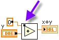

If the caller VI's input is also linked to its own connector pane, LabVIEW knows the data comes from an even higher-level caller. It can pass the buffer down through multiple layers of subVIs without any duplication, achieving seamless buffer reuse across the call chain.

This highlights why changing a subVI can affect the compiler's buffer allocation decisions in the caller VI. It is why editing and saving a subVI often marks its caller VIs as modified, requiring them to be recompiled and saved.

### Layout of Input and Output Parameters

In the block diagram of a subVI, no matter how complex the code or how many nested structures there are, the ideal arrangement for control terminals is as follows: place all input parameters (controls) on the far left side in a single column, and all output parameters (indicators) on the far right side, also in a single column. This means input and output parameters are best positioned outside the internal structures of the VI, as illustrated below:

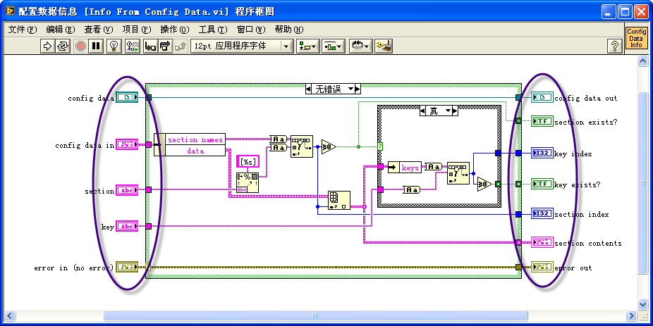

This arrangement primarily enhances the program's readability. When navigating LabVIEW code, the natural inclination is to read from left to right. Organizing all input parameters on one side makes it easier to follow the data lines and locate where data is being read and written.

Furthermore, this VI style is optimized for performance. Let's discuss the efficiency benefits of this arrangement for inputs and outputs.

If an input parameter's terminal is placed on the code's extreme left, outside all structures, it is the first part of the block diagram to be executed. This allows the VI to immediately read data from this input control upon starting.

If an input terminal is placed inside a structure (like a While Loop), LabVIEW cannot optimize its memory usage as effectively. In the example below, the `Initial Value` control terminal is inside a While Loop. If this VI is run as a top-level user interface, a user could theoretically change the value on the Front Panel while the loop is running. Because LabVIEW must support this interactive behavior, it has to read the control in every iteration. To guarantee that subsequent reads get the latest user input without corruption, LabVIEW cannot perform buffer reuse on this data.

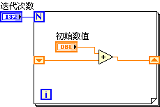

If the `Initial Value` terminal is placed outside the loop, LabVIEW knows the value is read exactly once when the subVI starts. Thus, the compiler can safely reuse the buffer for downstream operations, avoiding redundant allocations and copies inside the loop.

Similarly, placing output terminals (indicators) inside structures (like a Case Structure) introduces overhead. If an indicator is inside a Case Structure, LabVIEW must handle cases where that path is not executed by supplying a default value to the indicator. In the program below, the `Result` indicator is inside one branch of a Case Structure. If the other branch executes, LabVIEW must run behind-the-scenes code to write the default value to the indicator, consuming CPU cycles.

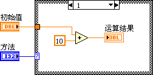
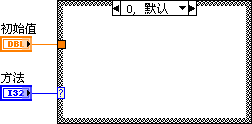

By moving the `Result` indicator terminal outside the Case Structure and wiring it from the tunnel, the compiler is simplified. The programmer explicitly defines what value is written for every case, eliminating the need for automatic default-value assignment code and improving performance.

### Enhancing Program Memory Efficiency Through Data Flow Structure

Consider the following program:

")

In the diagram, the left side shows the block diagram of the main VI, where an input array (`Array`) is wired in parallel to two nodes: the `My Search` subVI and the built-in **Sort 1D Array** function. The right side shows the block diagram of the `My Search` subVI.

There is a black dot on the **Sort 1D Array** function icon in the main VI, indicating a buffer allocation. This happens because the array wire branches and passes data to both `My Search` and `Sort 1D Array`. Since these operations could execute in parallel, LabVIEW must duplicate the array to ensure thread safety (preventing one operation from modifying data while the other reads it). Consequently, one node gets the original buffer, and the other gets a copy.

However, since `My Search` is read-only and does not modify the array, we can sequence the execution. If we force `My Search` to run first and then pass the array to `Sort 1D Array`, LabVIEW can reuse the original buffer for sorting in-place, eliminating the duplicate.

A minor adjustment to the program can optimize it. Below is the revised program:

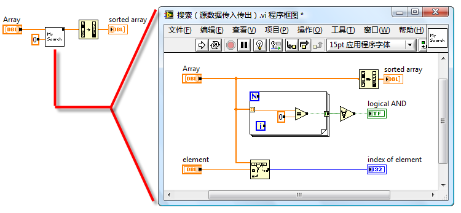

In the optimized program, the array first passes through the `My Search` subVI (which is configured with input and output array terminals to pass the reference through), and then proceeds to the **Sort 1D Array** function. Because `My Search` reuses the buffer, passing the array through it is extremely fast and allocates no memory. By the time the array reaches the **Sort 1D Array** function, it is the sole consumer of that wire segment. LabVIEW recognizes that the buffer can be safely modified in-place, and the black dot on the sort node disappears.

This pattern aligns with dataflow programming: data flows sequentially from left to right through each node. Not only does this make the code easier to read and debug, but it also allows the LabVIEW compiler to optimize buffer allocations more effectively, leading to faster execution.

While parallel execution takes advantage of multi-core CPUs, unnecessary branching on large datasets forces memory duplication. When dealing with large arrays but light computations, the overhead of memory copying can far outweigh any parallel processing gains. In such cases, a sequential, single-threaded dataflow sequence is actually faster and consumes much less memory.
