# Multithreading Programming

## Automatic Multithreading

LabVIEW inherently supports multithreading: if the code within a VI is capable of parallel execution, LabVIEW will allocate these operations across multiple execution threads to run simultaneously. Typically, running a VI involves LabVIEW creating at least two threads: one for the user interface, handling UI updates and user interactions with controls, and the other(s) for execution, managing all tasks beyond UI operations.

Consider a running simple VI, centered around a continuously active loop structure. In such cases, the thread executing the loop bears a significant load, while other threads remain largely idle. On a single-core CPU, this thread could monopolize nearly 100% of the CPU's processing time. The Task Manager snapshot below, taken from a dual-core CPU computer, illustrates that the program within this loop structure can only run on one thread at any given time, and since a thread operates on a single CPU core, the program can utilize at most about 50% of the computer's total CPU capacity.

It's crucial to understand that even though the loop structure in the program can only run on one thread at any given moment, it doesn't mean it remains permanently fixed to a specific thread. The system might occasionally switch it to another thread, but it will never run this code segment on multiple threads at the same time.

The following program features two parallel loop structures without data wires connecting them. LabVIEW automatically allocates these parallel code segments to separate threads. Moreover, operating systems typically schedule two heavy-duty threads to run on distinct CPU cores, allowing a dual-core CPU to be fully utilized.

This example showcases the ease of writing multithreaded programs in LabVIEW. Programmers should take full advantage of this feature, especially considering that contemporary computers may have dozens of CPU cores available. The general programming guideline is to arrange modules that can run in parallel side by side without forcing sequential execution through wiring or sequence structures. LabVIEW automatically assigns them to different threads for simultaneous execution, enhancing program speed and reducing runtime.

However, there are exceptions where multithreading could potentially decrease execution speed. These exceptions will be explored in greater detail in later sections.

### LabVIEW's Execution System

LabVIEW introduced support for multithreading with version 5.0. Prior to this release, all LabVIEW VIs operated on a single thread. Interestingly, for LabVIEW sub VIs or function nodes placed adjacently, they were "executed in parallel" even without being allocated to different threads by LabVIEW. LabVIEW would segment these operations and execute them sequentially, essentially creating its own multithreading scheduling system to perform multiple tasks in parallel within a single operating system thread.

This mechanism for scheduling and running VI code in LabVIEW is referred to as the execution system. In more recent versions, LabVIEW boasts six execution systems: User Interface, Standard, Instrument I/O, Data Acquisition, and two others labeled Other 1 and Other 2. An application's numerous sub VIs can be set to run in these different execution systems. Users can select a VI's execution system via the "Execution" page in the VI properties panel:

### The Relationship Between Execution Systems and Threads

With the advent of multithreading in LabVIEW, code within different execution systems is designated to run on separate threads. The User Interface Execution System operates on a single thread, serving as the program's main thread. Unlike the User Interface system, other execution systems are not the main thread and can spawn multiple threads to execute code.

Within the VI properties panel's "Execution" page, users can adjust both the VI's execution system and its priority. Priorities range from Background, Standard, Above Standard, High, to Real-Time, each ascending in priority. Additionally, there's a "Subroutine" priority, which is more of a unique setting rather than an actual priority level.

On computers with a single-core CPU, LabVIEW can initiate up to four threads for each priority level within each execution system, totaling over a hundred threads. The addition of each CPU core allows LabVIEW to increase this number by another hundred threads or more. However, it's rare for a single program to utilize all available execution systems and priority settings, so the actual number of threads used is typically fewer.

The creation, destruction, and switching of threads also incur certain system resource costs. Excessively many threads and frequent switching between them could inadvertently lower program efficiency. By default, without any modifications to a VI's "Execution" properties, all VIs in a program will use the Standard Execution System and Standard priority. For such programs, LabVIEW will create up to five threads: one for the User Interface and four under the Standard Execution System at Standard priority (doubling for a dual-core, and so on). Operating with five threads per CPU core generally does not significantly impact efficiency.

### The User Interface Execution System

In LabVIEW programs, all interface-related code executes under the User Interface Execution System. If a programmer sets a VI to a different execution system, but its front panel is opened, then operations like data updates on the panel still run under the User Interface Execution System. Additionally, tasks such as dynamically loading a VI into memory with the "Open VI Reference" function or using certain properties and method nodes in VI Scripting also operate under this system.

It's been highlighted that the User Interface Execution System is unique, possessing only one thread: the User Interface thread. This thread is created the moment LabVIEW launches, whereas threads for other execution systems are only created by LabVIEW when they are needed.

Since there's only one thread in the User Interface Execution System, setting a VI to run under this system means it operates in a single-threaded manner. In the diagram below featuring two parallel loops, if it were run under any other execution system, it would fully engage both cores of a dual-core CPU. However, changing the VI's execution system to the User Interface Execution System causes both loops to run on the same thread, leading to 100% utilization of one core while the other remains mostly idle.

Despite the VI being on a single thread, the two loops in the program still run in parallel. The values on the two display controls on the VI's front panel will increment in turn:

If certain modules within the VI are not thread-safe, setting the VI to operate within the User Interface Execution System ensures that the VI and its code only run on the single User Interface thread for safety.

### Other Execution Systems

"Same as Caller" is the default setting, indicating the VI adopts the execution system of the VI that invokes it. If the top-level VI also selects "Same as Caller", it effectively opts for the Standard Execution System. Thus, for top-level main VIs, the Standard Execution System is the default.

The Instrument I/O Execution System is specifically for sending commands to external instruments or reading data from them, critical operations that necessitate prompt execution. Consequently, threads within the Instrument I/O Execution System are prioritized higher than those in other systems.

The Data Acquisition Execution System caters to fast data acquisition, featuring threads with larger data stack areas.

The Other 1 and Other 2 Execution Systems don't have specific distinctions. They can be used if certain VIs need to run on independent threads.

For most applications, the User Interface Execution System and the Standard Execution System provide ample functionality.

### VI Priority Levels

VI priority settings encompass six levels: Background, Standard, Above Standard, High, Real-Time, and Subroutine. These levels are ordered from the lowest to highest priority. A higher priority level means the VI is more likely to preempt CPU resources. For instance, setting a computationally intensive VI to the highest "Real-Time" priority means the CPU will more frequently allocate time slices to this VI's thread at the expense of computational time for other threads. This can lead to interface refreshes becoming sluggish or unresponsive if another thread is responsible for UI updates.

The "Subroutine" setting significantly differs from the other priority levels. It's more than just a priority adjustment:
- VIs set to "Subroutine" lose their front panels, rendering them unsuitable for interface purposes or standalone execution.
- Debugging information is stripped from "Subroutine" VIs, making them undebaggable.
- Execution of a "Subroutine" VI temporarily switches the program to a single-threaded mode, preventing interruption by other threads until the "Subroutine" VI completes.

These adjustments ensure that "Subroutine" VIs are allocated the maximum CPU resources during their execution. Critical computations that are not overly time-consuming can benefit from being set to "Subroutine" for enhanced execution speed. An example would be a VI calculating the average of an input number array, where quick completion is crucial to avoid display delays. Such a VI is ideally suited for the "Subroutine" priority.

Considerations when setting VI priorities include:
- Increasing a VI's priority does not shorten the overall CPU time it consumes. A higher priority allows it to access CPU resources more quickly and often than other VIs, but the required CPU time remains the same.
- High-priority VIs do not necessarily run before those with lower priorities. Modern multithreaded operating systems operate on a preemptive scheduling basis. A higher thread priority simply indicates a higher chance of securing CPU time over lower-priority threads, not a guarantee of execution precedence.
- Use the "Subroutine" priority with caution, as it temporarily enforces single-threaded program execution, potentially reducing efficiency in many cases. If a VI performs operations beyond computation, like awaiting data from other devices, it should not be set to "Subroutine". On computers with multi-core CPUs, single-threaded programs often run less efficiently than their multithreaded counterparts, which should also be taken into account.

### Threads in Dynamically Linked Library Functions

This book's section on [Dynamically Linked Libraries](external_call_dll) introduces the various settings within the Call Library Function Node (CLN), including those related to multithreading. When a program makes extensive and frequent use of CLNs, it's crucial to ensure the thread settings of the CLNs align with those of the VI that invokes them.

I once developed a 3D animation demonstration program utilizing a multitude of CLNs to invoke OpenGL functions for rendering 3D animations.

Given that all OpenGL operations need to be executed within the same thread, I set all CLNs in the program to run on the User Interface (UI) thread. The thread options for the VIs remained at their default settings, leading to the program running exceedingly slow—updating only one frame per second while consuming 100% CPU usage. For animations to appear fluid, at least 25 frames per second are necessary.

Attempts to identify the inefficient VIs using LabVIEW's performance and memory analysis tools were futile. The tools indicated negligible CPU usage. Without a clear indication of where the program's most time-consuming operations were, optimizing the program became a daunting task. As a result, the development of the demonstration program was temporarily halted.

The breakthrough came later, inspired by insights from a colleague. I realized that the significant consumption of CPU resources, which hindered the animation's refresh rate, was due to the extensive CPU resources being consumed by thread switching. The program encapsulated each OpenGL interface function within an individual interface VI. These interface VIs were straightforward, with their block diagrams containing only a CLN node to call the respective OpenGL function. Each VI executed in the default execution thread, but the functions called by the CLNs were intended to run on the UI thread. Therefore, each execution of such an interface VI necessitated LabVIEW to switch threads twice: first from the execution thread to the UI thread to perform the function and then back to the execution thread.

Thread switching is inherently time-consuming. Refreshing a single frame required calling about two thousand OpenGL interface VIs, cumulatively taking close to one second. However, since the time lost to thread switching isn't captured as part of LabVIEW code execution time, LabVIEW's performance and memory analysis tools didn't account for this significant time consumption.

Having pinpointed the root cause, the pathway to a solution became clear. I set all VIs in the program that directly or indirectly called OpenGL interface functions to execute on the UI thread. This ensured all VIs and CLNs operated on the same thread, removing the need for thread switching when executing a CLN node. As a result, the optimized program could refresh 30 frames per second using only a fraction of the CPU resources.

This caution is also pertinent when calling Windows APIs in LabVIEW. I once faced an issue where error information from a Windows API call was lost. A specific Windows API function returned 0, signaling an error occurred. Attempts to obtain the error code and message through subsequent calls to GetLastErr and FormatMessage functions were futile. Despite the clear indication of an error from the previous function call, the GetLastErr function failed to retrieve any error code. What was the problem?

The issue stemmed from thread switching. Though it seemed the two Windows API functions were called sequentially in LabVIEW, different thread settings for the CLN nodes and the VI necessitated two thread switches between their calls. Many Windows API functions are not thread-safe, and error codes can be lost during thread switching. The resolution was akin to the previous scenario: ensuring all CLNs that called these functions and the VIs themselves were set to run on the UI thread fixed the problem.

Efficiency problems due to thread switching aren't just encountered with dynamically linked libraries; they also arise when using property and invoke nodes. Consider three common methods for setting a control's value: directly passing the value through data wires to the control's terminal, using the control's local variable, or setting the control's value property. In terms of execution speed, directly passing the value to the control's terminal is the quickest; using a local variable is slightly slower, approximately twice the duration of the first method; employing the value property drastically reduces efficiency, potentially taking an order of magnitude longer than the first two methods. This drop in efficiency is primarily because reading and writing property nodes involve operations that run on the UI thread and others on different threads, leading to a thread switch with each property node usage.

### LabVIEW's Support for Multi-core CPUs

Moore's Law, which predicted the doubling of CPU clock speeds approximately every eighteen months, has not held up in terms of frequency advancements. The CPUs in the various computers I've used over the years have maintained clock speeds within the 2GHz to 4GHz range. Currently, CPU manufacturers focus on enhancing overall performance by increasing the number of CPU cores. Multiple CPU cores can indeed boost program execution efficiency, but fully unlocking their potential requires software optimized for multi-core environments. The initial step towards multi-core optimization involves ensuring the software runs in a multithreaded manner. On multi-core systems, the operating system automatically assigns different threads of a program to various CPU cores.

Writing a multithreaded program in traditional text-based languages, such as C++, is not straightforward. Programmers must have a deep understanding of C++ programming basics, be familiar with the mechanics of Windows multithreading, know how to call Windows APIs, or navigate the architecture of MFC, among others. Debugging multithreaded programs in C++ is considered by many programmers to be particularly challenging.

The scenario is quite different when writing multithreaded programs in LabVIEW. LabVIEW is inherently a multithreaded programming language, freeing programmers from needing to grasp any multithreading-related concepts. By simply placing two code segments without sequential dependencies side by side on a VI's block diagram, LabVIEW automatically distributes these segments across different threads for parallel execution. On multi-core CPU systems, the operating system assigns individual CPU cores to these threads, effectively leveraging the parallel processing capabilities of multi-core CPUs. This way, LabVIEW programmers inadvertently create programs that are optimized for multi-core systems.

Occasionally, the operating system's strategy for CPU allocation may not be the most efficient. For example, consider a program comprising data acquisition, display, and analysis modules running in parallel. On a dual-core system, the OS might initially allocate one core to data acquisition and the other to display. Once data acquisition completes, the first core might switch to data processing—a relatively heavy task. If one core is dedicated to data processing while the other remains idle, this leads to an imbalanced load and suboptimal CPU utilization.

For highly efficiency-critical programs, LabVIEW's timed structures enable manual specification of CPU allocation.

Timed structures, including Timed Loop and Timed Sequence structures, are primarily used for executing specific code segments at precise intervals within a program. They also allow specifying which CPU core should execute the code within the structure. The input terminal represented by the black square with small protrusions on the Timed Sequence structure (symbolizing an integrated circuit module) is for CPU core specification:

CPU settings can be statically set in the Timed Sequence structure's input configuration panel:

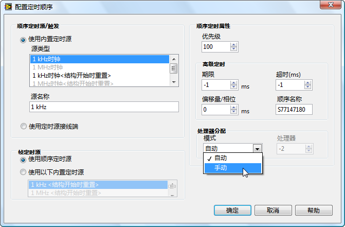

CPU cores can also be specified dynamically during program execution, as illustrated below:

Executing the program illustrated above, the two less time-consuming tasks share one CPU core, while the more demanding task occupies another core entirely. Task allocation across different CPU cores is balanced, significantly accelerating overall program execution:

### Parallel Loops

Previously, we discussed how two loop structures placed in parallel enable simultaneous execution on different CPU cores. However, there are situations where a program might feature a single loop structure with each iteration being independent and requiring substantial computational effort. Such loops, when executed on a single thread, tend to be less efficient. For example, consider the program shown below:

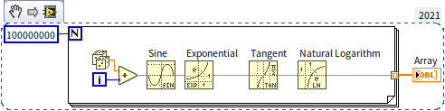

This program consists of a single loop performing extensive mathematical operations, heavily taxing CPU resources. When run, the system resource monitor shows it consuming 100% of one CPU core's resources:

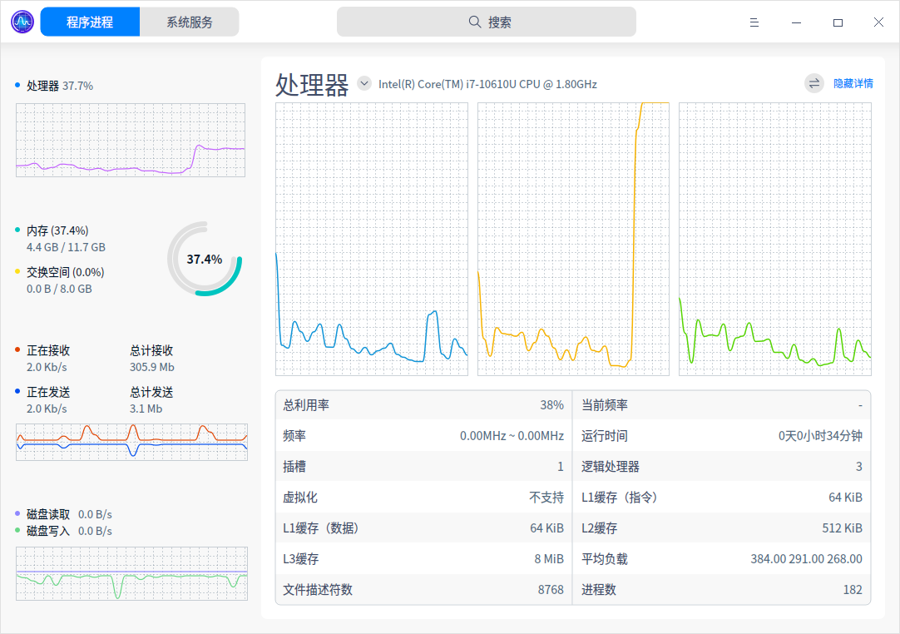

Although three CPU cores were allocated to the system running LabVIEW, only the second CPU core is fully utilized during this program's execution.

For loops like the one illustrated, converting them to parallel execution can improve efficiency. By right-clicking on the loop's frame and selecting "Configure Iteration Parallelism":

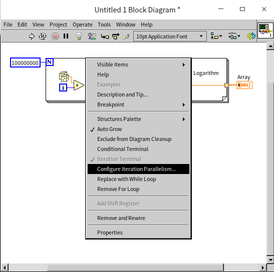

This action opens the configuration window for parallel loop execution:

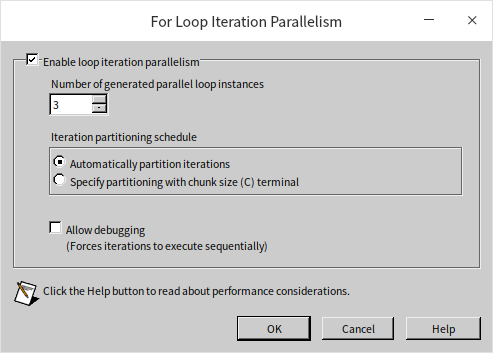

Here, "Enable loop iteration parallelism" can be selected to activate the loop's parallel execution. Additionally, you can specify the number of parallel threads for executing the loop's code. Typically, setting it to match the number of CPU cores, such as three in this case, is adequate. Increasing the number of parallel threads beyond this point doesn't necessarily quicken the program.

A for loop set for parallel execution will display a small square with the letter "P" in its top-left corner. This square can accept an integer, allowing the number of threads for the loop's parallel execution to be set dynamically within the program:

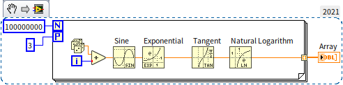

Upon running the enhanced program, all three CPU cores are engaged, significantly reducing the program's execution time to one-third of what it would be in a single-threaded scenario:

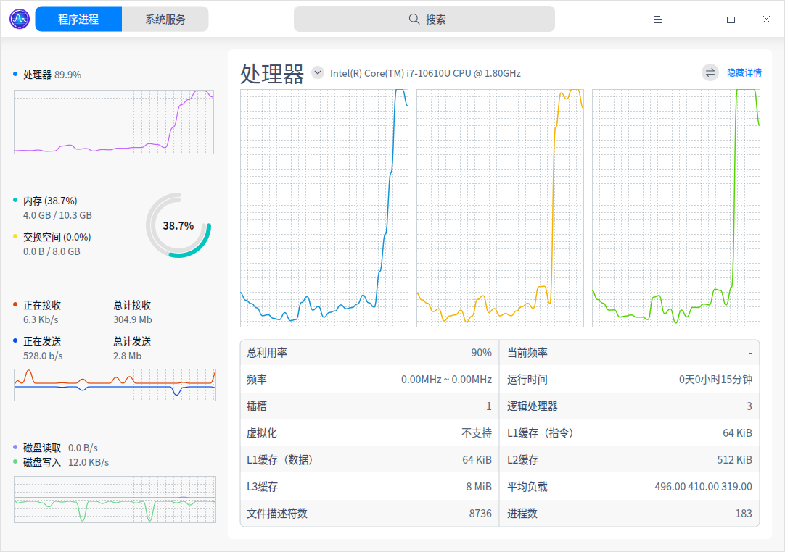

It's crucial to understand that not all loops are suitable for parallel execution. If each iteration of a loop relies on the outcome of its predecessor, they must be executed in sequence and cannot be parallelized. Take the loop in the following program as an example:

The loop shown includes a shift register, indicating dependency on the results of previous iterations. Such a loop structure cannot be run in parallel, and attempting to force parallel execution will trigger an error message:

## Inter-thread Communication and Synchronization

In many instances, threads within a program are not entirely independent of one another. They may need to exchange data, and in some applications, it's necessary for different threads to execute in a specific sequence. This requirement necessitates the use of LabVIEW's mechanisms for data communication and synchronization during development. Generally, when there's a need for communication or synchronization between threads, "queues" are a straightforward solution. This book has already extensively covered the use of [queues](pattern_pass_by_ref#queues), so further discussion here is not needed. While LabVIEW offers other methods for inter-thread communication and synchronization, these can often be replaced with queues. Therefore, queues should be considered as a primary option when designing programs. Below, we introduce some alternative methods for thread communication and synchronization that might make programs more streamlined and efficient for certain specific requirements.

### Channel Wires

Channel wires can be considered a simplified form of queues in many applications. They look like a standard data wire but are fundamentally different from all other data wires previously introduced. The usual data wires in LabVIEW represent a synchronous data flow: data cannot directly pass through structures; it must go through tunnels. When data passes through a tunnel, it must wait for other data on the same structure to enter or exit the structure together. Channel wires, on the other hand, represent an asynchronous data flow: they can conceptually jump in or out of structures, connecting with nodes inside other structures. Therefore, the program doesn't need to wait for other data to enter or exit the structure and can immediately process data on channel wires. This concept might sound abstract, so let's examine some examples.

#### Streaming

The figure below depicts a conventional data acquisition and display program consisting of two loops: the left loop simulates the data acquisition process using a delay coupled with random number generation; the right loop employs a waveform chart control for displaying the collected data:

In this setup, the "acquired" data is transmitted directly to the waveform chart control through a data wire. Because a data wire links the two loops, they cannot operate in parallel. When this program is executed, the initial 5 seconds are allocated to "acquisition", during which the waveform chart control does not refresh. The control updates only after the data acquisition phase concludes. We could refactor this program using the queue-based [producer-consumer model](pattern_pass_by_ref#considerations-for-implementing-the-producer-consumer-model) to facilitate concurrent data acquisition and display:

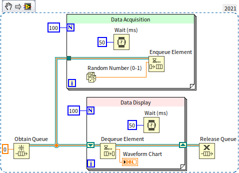

Though the program now executes in parallel, the block diagram has expanded significantly with numerous functions and nodes, increasing its complexity. Let's streamline the program by replacing queues with channel wires. By right-clicking the output terminal of the "Random Number" function and selecting "Write to Channel", LabVIEW prompts a "Select Channel Endpoint" dialog to choose the type of channel wire:

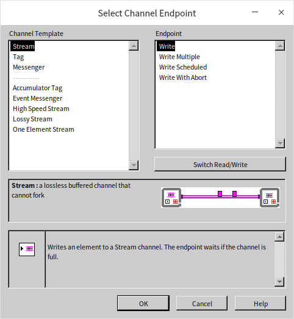

For this demonstration, the basic "Stream" type suffices. This channel wire type supports only single input and output, meaning it cannot fork into multiple paths. After selecting the channel wire type, a new sub VI appears at the random number function's output terminal. This sub VI, paired with the channel wire, creates a data buffer for the channel and writes data into it. Similarly, a "Read from Channel" sub VI must be established where the data is needed, pulling data for processing. Below is the program reimagined with channel wires:

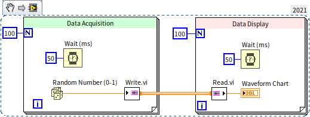

Running this revised program reveals it too can display acquisition results in real-time, yet its block diagram is significantly simpler than its queue-utilizing counterpart.

In the "Select Channel Endpoint" dialog, besides picking the channel type (channel template), there's also a choice among four different endpoint types. The above demo selected the basic single data read/write endpoint. Other options include: multiple data read/write (batch writing or reading data items as an array), scheduled read/write (data transactions at predetermined time points), and cancelable read/write (featuring a switch to abort the operation). The following figure demonstrates a program that handles multiple data transactions simultaneously:

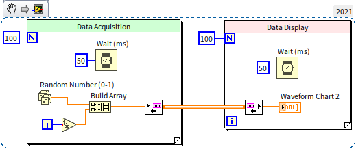

#### Messengers

Apart from the basic single-input and single-output channel wires, choosing the "Messenger" type allows for multiple inputs and outputs. Consider the following program:

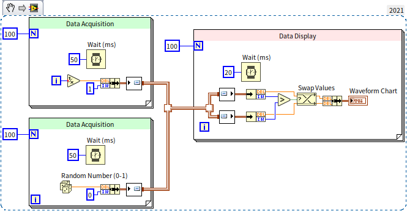

This program features two data acquisition loops, each collecting data from a separate channel. The data is then consolidated onto a single channel wire and subsequently read in a data display loop. Running this program demonstrates the simultaneous acquisition and display of data from both channels:

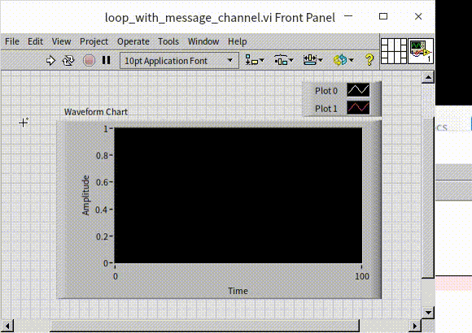

The "Messenger" type channel wire can also create a feedback loop, feeding the output of each iteration back as its input, as illustrated in the program below:

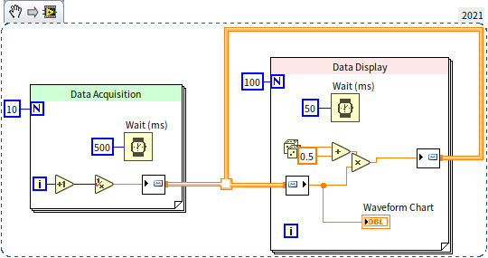

In the data display loop, data is processed and sent out through the channel wire, then used as input for the next processing step. This usage resembles the [feedback node](data_array#feedback-node) in loop structures, yet there's a significant visual difference: feedback nodes use traditional synchronous data wires, so the feedback is drawn inside the loop structure; channel wires represent asynchronous data flow, with their feedback loop drawn outside the loop structure.

#### Event Messengers

Another popular channel wire type is the event messenger. It closely mirrors the messenger channel wire, with the key difference being that data entering the event messenger channel wire triggers a user event. This allows data entering the channel wire to be received in the data processing loop using an event structure, making this channel wire type suitable if the program already utilizes event structures.

#### Other Types of Channel Wires

- **One Element Stream**: This has a buffer length of 1, allowing only one data item at a time. If the receiver has not retrieved the data, the sender must wait, akin to using a queue of length 1 for data transfer.
- **Lossy Stream**: This buffer discards older data. If it's full and new data is written, the buffer discards the oldest data.
- **Tag**: Essentially a length-1 Lossy Stream.
- **Accumulator Tag**: This is exclusive to numeric data with a buffer length of 1. When new data arrives while the buffer contains data, it adds the new and old data together, saving the sum.

#### Advantages and Disadvantages of Channel Wires

While channel wires offer functionalities that can also be achieved with queues, they often eliminate the need for queue operations, substantially simplifying the block diagram. However, channel wires also have clear disadvantages: their appearance is barely distinguishable from regular data wires, yet their behavior is completely different. Incorporating channel wires into the block diagram undoubtedly complicates program interpretation.