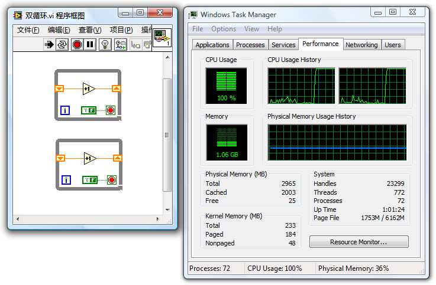
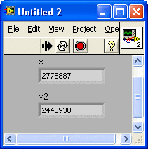
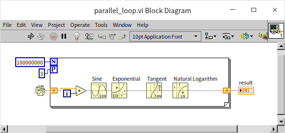
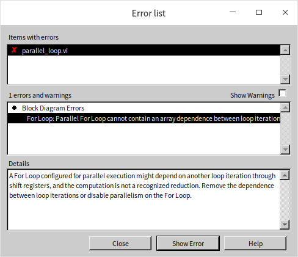
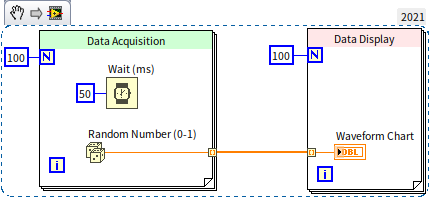
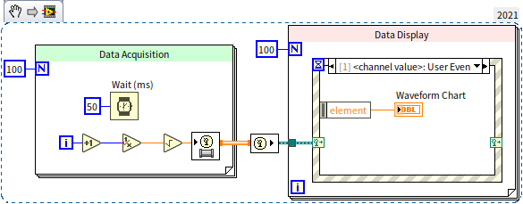

# 多线程编程

## 自动多线程

LabVIEW 是自动多线程的编程语言：只要 VI 的代码可以并行执行，LabVIEW 就会尽量将它们分配在多个执行线程内同时运行。一般情况下，运行一个 VI，LabVIEW 至少会为它开辟两个线程：一个是用户界面线程，用于处理界面刷新、用户对控件的操作等等；另外一个或多个是执行线程，负责 VI 除界面操作之外的其它工作。

下图是一个正在运行的简单 VI，它的程序的主体部分是一个持续运行的循环结构。在此情况下，这个执行循环的线程负担特别重，其它线程则基本空闲。在单核 CPU 计算机上，这个线程将会占用几乎 100% 的 CPU 时间。下图中的任务管理器是在一个双核 CPU 计算机上截取的。这个循环结构中的程序在某个时刻，只可能运行在这个线程上，而一个线程也只能在一个 CPU 内核上运行，因此，下图这个程序最多只能占用计算机大约 50% 的总 CPU 时间。

需要注意的是，上面程序中的循环结构虽然在每一个时刻只能运行在一个线程上，但这并不表示它会始终不变地就固定在某一个线程上运行。有时候，系统也可能会把它切换到其它线程上去运行，但是，无论怎样，系统不会在多个线程内同时运行这段代码。

下图的程序中包含了两个并行的循环结构，它们之间没有数据连线。对于这样的程序，LabVIEW 会自动把两段并行的代码分配到两个线程中去。并且，通常两个任务繁重的线程会被操作系统安排到不同的 CPU 内核上运行，这时即便是双核 CPU 也会被 100% 占用。

通过这个示例，就可以看出来，在 LabVIEW 上编写多线程程序非常方便。所以编程时应该充分利用这个优势，当前主流计算机可以拥有十几个甚至几十个 CPU 内核，不利用上就太可惜了。一般情况下，编写程序时应当遵循这样的原则：能够并行运行的模块就并排摆放，不要用连线、顺序框等方式强制它们依次执行。在并行执行时，LabVIEW 会自动地把它们安排到不同线程上同时运行，以提高程序的执行速度，节省程序的运行时间。

当然特殊的情况也是有的，即用多线程时，运行速度反而减慢。后续章节中，会详细讨论这些特殊情况。

### LabVIEW 的执行系统

LabVIEW
5.0 开始才支持多线程。在此版本之前，LabVIEW 的 VI 都是单线程运行的。其实，对于并排摆放的 LabVIEW 子 VI 或函数节点而言，即使 LabVIEW 不为它们分配不同的线程，它们也是“并行执行”的。LabVIEW 会把它们拆成片断，轮流执行。这就如同 LabVIEW 为自己设计了一套多线程调度系统，在操作系统的单个线程内并行执行多个任务。

LabVIEW 的这样一套把 VI 代码调度、运行起来的机制叫做执行系统。新版本的 LabIVEW 有六个执行系统，分别是：用户界面执行系统、标准执行系统、仪器 I/O 执行系统、数据采集执行系统、以及其它 1、其它 2 系统。一个应用程序中使用到的众多子 VI 是可以分别放在不同的执行系统里运行的。用户可以在 VI 属性面板上的“执行”页面，指定这个 VI 的执行系统：

### 执行系统与线程的关系

LabVIEW 在支持多线程以后，不同的执行系统中的代码就被划分在了不同的线程下运行。用户界面执行系统只有一个线程，并且是这个程序的主线程。其它的执行系统与用户界面执行系统不同，它们都不是主线程，而且还可以为一个执行系统开辟多个线程来执行代码。

在 VI 属性面板的“执行”页面上，用户除了可以设置 VI 的执行系统，还可以设置它的优先级。优先级分为后台、标准、高于标准、高、实时等五个档次，优先级依次提高。优先级内还有一项“子程序”，它是一个比较特殊的设置。实际上它并不是一个优先级。

在单核 CPU 的计算机上，LabVIEW 最多为每个执行系统下每个档次的优先级开启四条线程。如果是多核 CPU，么增加一个 CPU 内核，LabVIEW 能够开辟的线程数目也会增加一倍。不过，实际上一个程序在运行时，不会有那么多的执行系统和优先级设置。所以，平时并看不到那么多的线程。

线程的开辟、销毁、切换等也是需要消耗一定的系统资源的。如果线程开辟得太多，切换过于频繁，反而有可能导致程序效率下降。在默认情况下，若不对 VI 的“执行”属性做任何改动，则一个程序内所有的 VI 采用的都是标准执行系统和标准优先级。LabVIEW 最多将为你的程序开辟五条线程：一条用户界面线程，四条标准执行系统标准优先级下的线程（双核则是八条，依此类推）。五条线程并不会引起明显的效率损失。

### 用户界面执行系统

程序中所有与界面相关的代码都是放在用户界面执行系统下执行的。假如程序员为某个 VI 设置了其它的执行系统，这个 VI 的前面板被打开后，前面板上面的数据更新等操作也会被放在用户界面执行系统下运行。还有另外一些工作，比如利用“打开 VI 引用”函数动态地把一个 VI 加载到内存中，使用 VI
Scripting 中的一些属性、方法节点等，也都是在用户界面执行系统下运行的。

前文曾提到，用户界面执行系统是一个特殊的执行系统，它只有一个线程：用户界面线程。LabVIEW 一启动，这个线程就被创建出来了，而其他执行系统下的线程只有在被使用到时才会被 LabVIEW 所创建。

因为用户界面执行系统只有一个线程，所以，VI 一旦被设置为在用户界面执行系统下执行，就会变成单线程运行。下图所示的两个并行循环的程序，如果是运行在其它的执行系统下，双核 CPU 的两个核都会被占满。但是，如果我们把 VI 的执行系统改为用户界面执行系统，那么这两个循环就会运行在同一线程下。双核 CPU 其中一个核将被占用 100%，另一个则基本空闲。

尽管这个 VI 是单线程的，但是程序中的两个循环仍然是并行运行的。VI 前面板上的两个显示控件上的数据会交替增加：

    

如果 VI 中使用的一些模块不能保证多线程安全，就可以把 VI 设定在用户界面执行系统中运行。这样，VI 包括其中的代码就只能在单一的用户界面线程下运行，以确保安全。

### 其它几个执行系统

“与调用方相同”是默认选项，它表示这个 VI 沿用调用它的上层 VI 设置的执行系统。如果顶层 VI 也选择“与调用方相同”，那么就等于它选择了标准执行系统。因此，对于顶层的主 VI 来说，标准执行系统是默认情况下使用的执行系统。

仪器 I/O 执行系统专用于发送命令到外部仪器，或从仪器中读取数据。这是程序中较为重要的操作，需要及时运行。所以仪器 I/O 执行系统中的线程的优先级比其他执行系统中的线程要高一些。

数据采集执行系统用于快速数据采集。数据采集执行系统中的线程的数据堆栈区比较大。

其它 1、其它 2 执行系统没什么特别之处。如果你一定要让某些 VI 运行在独立的线程内，则可以使用这两个选项。

绝大多数情况下，用户使用界面执行系统、标准执行系统就已经足够了。

### VI 的优先级

VI 的优先级设置总共有六个级别：后台、标准、高于标准、高、实时、子程序。其中前五项是从低到高的五个优先级。优先级越高，越容易抢占到 CPU 资源。比如，你把某个负责运算的 VI 的优先级设为最高级“实时”，程序在运行时，CPU 就会更频繁地给这个 VI 所在线程分配时间片段，其代价是分配给其它线程的运算时间减少了。如果这个程序另有一个线程负责界面刷新，那么用户会发现，在把执行线程的优先级提高后，界面刷新会变得迟钝，甚至根本就没有响应。

优先级设置的最后一项是“子程序”，它与前五项的级别有很大的不同。它并不是一个单纯的优先级设置。若 VI 被设置为“子程序”优先级，VI 其它的一些属性也会被改变：

* 设置为“子程序”的 VI 的前面板会被移除。所以这样的 VI 不能用作界面，也不能单独执行。
* 设置为“子程序”的 VI 的调试信息也会被移除。这样的 VI 无法被调试。
* 当程序执行到被设置为“子程序”的 VI 的时候，程序会暂时变为单线程执行方式。即程序在“子程序”VI 执行完之前，不会被别的线程打断。

以上的三点保证了“子程序”VI 在执行时会得到最多的 CPU 资源。某些非常关键的运算，假如不是特别耗时的的话，就可以被设置为“子程序”以提高运行速度。比如，有这样一个 VI，它的输入是一个数值数组，输出是这组数据的平均值。这个运算在程序中需要被尽快地完成，以免拖延数据的显示。这个 VI 就是一个非常适合“子程序”优先级的 VI。

在设置 VI 优先级时，需要注意如下几点：

提高一个 VI 的优先级并不能缩短 VI 总体占用 CPU 的时间。提高了 VI 的优先级，意味着它可以比其它 VI 更快更多地抢到 CPU 的资源，但它所需要的 CPU 时间还是那么多。

高优先级的 VI 并不一定在低优先级 VI 之前执行。现在常用的多线程操作系统采用的都是抢占方式。线程优先级别高，只是意味着它抢到 CPU 的可能性比低级别线程的更大，而并非必然比低级别的线程先抢到 CPU。

使用“子程序”优先级时要格外注意，因为它会让程序暂时变成单线程方式执行，这在很多情况下反而会降低程序的效率。假如一个 VI 并非只是用来运算，它还需要等待其它设备传来的数据，这样的 VI 就绝对不能被设置为“子程序”的。在多核 CPU 计算机上，单线程运行的程序通常比多线程效率低，这也是需要考虑的。

### 动态连接库函数的线程

本书在[动态链接库](external_call_dll)一节中介绍了 CLN 节点中的各种设置，其中包括了对多线程的设置。如果程序中大量频繁地使用了 CLN 节点，那么还要考虑到 CLN 节点的线程设置与调用它的 VI 的线程设置相匹配。

笔者曾经编写过一个三维动画演示程序。在程序中使用了大量 CLN 节点来调用 OpenGL 的函数，以实现三维动画。

由于 OpenGL 的全部操作必需在同一线程内完成，于是在程序中把所有的 CLN 都设置为在界面线程运行的方式（即 UI 线程）。对 VI 的线程选项也没有修改，还是默认的选项。结果程序运行极慢，每秒钟只能刷新一帧图像，CPU 占用率已经达 100%。而作为动画，每秒至少 25 帧才能看着比较流畅。

当时曾试图用 LabVIEW 的性能和内存分析工具来查找效率低下的 VI，结果也未查找到。在性能和内存分析工具上显示的 CPU 占用时间极少。既然分析工具查找不到程序中最耗时的操作在哪里，对如何优化这个程序也就自然无从下手。于是，这个演示程序被搁置了一段时间。

后来，还是从同事提供的一些信息中得到了启发，才突然想明白了原因所在。程序耗用了大量的 CPU 资源，以至于动画刷新功能得不到足够的资源，是由于几乎全部的 CPU 资源都被消耗在线程切换中了。程序为每个 OpenGL 接口函数包装一个接口 VI。这些接口 VI 非常简单，程序框图就只有一个 CLN 节点，调用相应的 OpenGL 函数。每个 VI 都是在默认的执行线程中运行的，而 CLN 调用的函数却是在界面线程下运行的。所以，每执行一次这样的接口 VI，LabVIEW 都要进行两次线程的切换。先从执行线程切换到界面线程，执行完函数，再切换回执行线程。

线程切换是比较耗时的。演示程序刷新一帧要调用大约两千次 OpenGL 接口 VI，总耗时接近一秒。可是，由于线程切换所耗时间并非 LabVIEW 代码运行占用时间，所以 LabVIEW 的性能和内存分析工具没有统计这一时间消耗。

找到了症结所在，也就有了解决的方法。于是把程序中所有直接或间接调用了 OpenGL 接口函数的 VI 全部都设置为在 UI 线程下运行。这样，程序中所有的 VI 和 CLN 都运行在同一线程下，避免了程序运行至 CLN 节点时的线程切换。改进后的程序，每秒钟刷新 30 帧图像也只占用了很少一部分 CPU 资源。

在 LabVIEW 中调用 Windows API 时也需要注意这个问题。笔者曾经遇到过这样一个问题：调用 Windows API 时，API 返回的错误信息丢失了。在调用某一 Windows API 函数时，它的返回值为 0，表示有错误发生。这时再调用 GetLastErr 和 FormatMessage 函数试图得到错误代码和信息。但问题出现了：前一个调用的函数明明返回值为 0，但是随后调用的 GetLastErr 函数却无法查到错误代码，问题出在何处？

其实，这一错误也是由于线程切换造成的。看上去两个 Windows API 函数是紧挨在一起被 LabVIEW 调用的。但实际上，由于 CLN 节点线程设置与 VI 线程设置是不同的，LabVIEW 在调用它们之间还要做两次线程切换才行。Windows API 中很多函数是非多线程安全的，线程切换过程中错误代码会被丢掉。解决这个问题的办法依然是：把调用这三个函数的 CLN 和调用它们的 VI 全部设置为在界面线程下运行就可以了。

类似的线程切换导致效率低下的问题，不仅出现在调用动态链接库的情况下，还会出现在使用属性节点和方法节点时。比如，设置一个控件的值有三种常用方法。对于显示控件而言，可以直接通过数据连线，把值传递给控件的接线端；还可以把值传递给控件的局部变量；或者设置控件的值属性。从运行效率来说，直接把值传递给控件的接线端速度最快；使用局部变量速度稍慢，所耗时间大约是前一种方式的 2 倍；使用值属性效率显著变差，所耗时间有可能比前两种方式高一两个数量级。这主要是由于读写属性节点时，一部分工作要在界面线程运行，另一部分工作要在其它线程运行。这样一来，每次使用属性节点都会引起线程切换，

### LabVIEW 对多核 CPU 的支持

摩尔定律曾预言，CPU 的主频每隔一年半左右就会提高一倍。但是这个定律在主频这个数据上已经已经失效了。笔者多年来换过的几台电脑，它们的 CPU 主频始终在 2GHz 到 4GHz 左右。目前 CPU 厂商对于提升 CPU 整体性能的最主要手段是增加 CPU 的内核数量。多个 CPU 内核同时工作，固然可以提高程序运行效率。但是，只有针对多核系统做了优化的软件，才能充分发挥多核的威力。针对多核进行优化的第一步，是要求软件是多线程运行的。在多核计算机上，操作系统会自动把程序的不同线程分配到不同的 CPU 内核上去运行。

使用常用的文本语言，比如 C++ 编写一个多线程的程序并不是一项简单的工作。除了要非常熟悉 C++ 的基本编程方法，程序员还需要了解 Windows 多线程的运行机制，熟悉 Windows
API 的调用方法，或者 MFC 的架构等等。在 C++ 上调试多线程程序，更是被许多程序员视为噩梦。

但如果使用 LabVIEW 编写多线程程序，情况就大为不同了。LabVIEW 是自动多线程的编程语言。LabVIEW 程序员可以不了解任何与多线程相关的概念与知识。只要在 VI 的程序框图上，并排放上两段没有先后关系的代码，LabVIEW 就会自动把这两段代码分配在不同的线程中，并行运行。而在多核 CPU 的计算机上，操作系统会自动为这两个线程分配两个 CPU 内核。这样，就有效地利用了多核 CPU 可以并行运算的优势。LabVIEW 的程序员不知不觉中就完成了一段支持多核系统的程序。

有时候，操作系统的 CPU 分配策略可能并不是最高效的。比如下图所示程序，包括了数据采集、显示和分析三个模块。三个模块是并行执行的。假如电脑是双核的，有可能操作系统会分配 CPU 0 先做数据采集，CPU 1 先做数据显示，等数据采集做完了，CPU 0 又会去做数据处理。数据处理是个相对任务较为繁重的线程，而电脑一个 CPU 做数据处理时，另一个 CPU 却空闲在那里。这种负载不均衡就造成了程序对于整体系统的 CPU 利用率不高。

 

对于效率要求极为苛刻的程序，可以利用 LabVIEW 的定时结构，由程序员人工指定 CPU 的分配方案。

定时结构包括定时循环结构和定时顺序结构，他们主要用于在程序中精确地定时执行某段代码。不过，它们还有一个辅助功能，那就是指定结构内的代码运行在哪一个 CPU 内核上。下图中的定时顺序结构左边那个四边带小爪的黑方块（集成电路模块示意图）所代表的接线端就是用来指定哪一个 CPU 内核的：

CPU 的设置可以在时间顺序结构的输入配置面板中静态地设置；

也可以在程序运行时指定 CPU 内核，如下图所示：

运行上图中的程序，两个耗时较少的任务占用同一个 CPU 内核，耗时较多的任务单独占用一个 CPU 内核。不同 CPU 内核被分配到的任务比较均衡，大大加快了程序整体运行速度：

### 并行循环

上文介绍了可以把两个循环结构并行摆放，这样它们就可以同时在不同的 CPU 内核中同时运行。但有的时候，程序中可能只有一个循环结构，循环内部的每次迭代都是独立的，并且非常耗时的运算。这样的循环结构如果只在一个线程内执行，是效率比较低下的。比如下图中的程序：

上图中的程序只有一个循环，循环中做了大量的数学运算，比较耗费 CPU 资源。运行这个程序，可以在系统资源监视器中看到，它占用了一个 CPU 内核 100% 的资源：

笔者为运行 LabVIEW 的系统分配了三个 CPU 内核，但上面的程序在运行时，只有第二个 CPU 内核被完全占用了。

对于上面这样的循环结构，可以把它们设置称为并行运行。在循环结构的边框上点击鼠标右键，选择“Configure Iteration Parallelism”：

它会打开循环并行执行的配置窗口：

我们可以在这里选择“Enable loop iteration parallelism”来启动循环并行运行。我们还可以在这里设置在几条并行的线程中运行这个循环内的代码。一般来说，如果系统只有 3 个内核，设置三个就够用了，在增加并行线程的数量也不会让程序运行速度加快了。

设置了并行运行的 for 循环结构左上角会增加一个图案为字母“P”的小方块。这个小方块是可以接入一个整数的，用来在程序中设定并行运行循环的线程的数量：

运行上面的程序，会看到，它占用了全部的三个 CPU 内核，相应的程序运行时间缩短到了单线程运行时间的三分之一：

需要注意的是，不是所有的循环都可以被设置为并行运行。如果循环中，每一次迭代都要依赖上一次迭代运算产生的结果，那么它们就必须顺序执行，无法并行。比如下面这个程序中的循环：

上图中的循环结构内有一个移位寄存器，意味着它的每次迭代是依赖之前迭代运算的结果的。这个循环结构不能并行运行，如果强制设置为并行，VI会报错：

## 线程间的通讯与同步

在很多时候，一个程序不同的线程间并不是完全独立的。线程间可能需要交换数据。在有些应用中，不同线程还必须按照一定的顺序运行才可以。这就需要编程时使用 LabVIEW 提供的数据通讯与同步机制。一般来说，需要在不同线程之间进行通讯或同步的时候，只要考虑使用“队列”即可。本书在前文中已经多次介绍和演示[队列](pattern_pass_by_ref#队列)的使用了，这里也就不再赘述。LabVIEW 中也提供了其它一些进行线程间通讯与同步的方法，但是那些方法都可以使用队列来代替，在设计程序时可以首先考虑使用队列。接下来，我们介绍一下其它那些线程通讯与同步的方法。对于一些有特殊需求的程序，使用其它一些线程通讯与同步的方法可能会使得程序更简洁高效。

### 通道线（Channel Wires）

通道线在多数应用中可以被看做是简化了的队列。通道线的外观也是一根数据线，但它与我们之前介绍过的所有数据线都完全不同。LabVIEW 通常的数据线表示的都是同步数据流：数据不能直接穿越结构，它只能通多隧道来穿越结构。数据在通过隧道时，必须等待同一结构上其它隧道的数据一起进入或流出结构。通道线表示的是异步数据流：感觉上，它可以直接跳入或跳出结构，与其它结构中的节点相连。这样，程序就不再不需要等待其它进入或流出结构的数据，可以立刻对通道线上的数据进行处理。这样的解释可能比较抽象，下面我们看一些示例。

#### 串流

下图是一个典型的数据采集和显示的程序，它有两个循环：左面的循环使用延时是随机数生成来模拟数据采集的过程；右边的循环使用一个波形图表控件来显示采集到的数据：

这个程序直接把“采集”到的数据使用数据线传递给波形图表控件。由于两个循环之间有数据线串联，两个循环无法平行运行，如果运行这个程序，会发现，开始的 5 秒钟是“采集”过程，波形图表控件不会更新。直到数据采集过程完全结束，控件才会更新。我们可以使用基于队列的[生产者消费者模型](pattern_pass_by_ref#生产者消费者模型需要考虑的事项)来改造一下这个程序，让它能够在采集数据的同时显示采集的结果：

程序虽然变成了并行运行，但程序框图上增加了很多函数和节点，会增加阅读的难度。现在我们去掉队列，使用通道线改写一下同样的程序。首先，鼠标右键点击“随机数函数”的接线端，选择“通道写入方”，LabVIEW 会弹出一个“选择通道端点”对话框，询问需要创建哪一种通道线：

对于我们的这个演示程序，选择最基本的“串流”（Stream）类型即可，此种类型的通道线只支持但输入输出，也就是这种通道线不能分叉。选择好通道线的类型后，会发现随机数函数的接线端处多出了一个新的子 VI，这是通道线配套的子 VI，他负责为通道线创建一个数据缓冲区，并把数据写入缓冲区。相应的，在需要使用数据的地方，也要创建一个“通道读取方”子 VI，使用它取出数据进行处理。使用通道线改写的程序如下：

运行这个程序会发现，它也能够在采集数据的同时显示采集的结果，但它的程序框图比使用队列要简洁的多。

在上图的“选择通道端点”对话框上，出了可以选择通道的类型（通道模板），还可以选择四种不同的端点类型。上面的演示程序选择了最基本的单数据读写端点，除此之外，也可以选择：多数据读写（以数组的形式每次写入或读取多个数据），预约读写（在预先设定好的时间点读写数据）以及可取消的读写（附带一个开关用于取消本次读写）。比如下图是一个每次读写多个数据的演示程序：

#### 消息器

除了最简单的单输入输出的通道线，如果选择了“消息器”（Messenger）类型的通道线，就可以实现多输入多输出。比如下面的程序：

程序中，有两个数据采集循环，分别采集了两个通道的数据。然后这些数据被汇总到同一条通道线上，最后在数据显示循环中被读出。运行这个程序，可以看到两个通道的数据同时被采集和显示：

“消息器”（Messenger）类型的通道线也可以构成一个反馈节点，即把循环每次跌点的输出再当做输入，比如下面这个程序：

数据显示循环中，把数据处理了一下，使用通道线输出，然后又被当做下一次的输入来处理了。这种用法，看上去和循环结构的[反馈节点](data_array#反馈节点)非常类似，但它们有一个外观上的重要的区别：反馈节点使用的数据线依然是传统的同步数据线，所以反馈线是画在循环结构内部的；通道线表示的是异步数据流，它的反馈线画在了循环结构外部。

#### 事件消息器

另一种比较常用的通道线类型是事件消息器类型。它与消息器类型的通道线非常类似，区别在于进入事件消息器通道线的数据会触发一个用户事件。这样，在数据处理循环中就可以使用事件结构来接受进入到通道线中的数据，如果程序已经采用了事件结构，就可以考虑使用这种通道线。

#### 其它几种类型的通道线

* One Element Stream: 缓存长度为 1，每次只能有一个数据进入数据线，如果数据还未被接收端取出，发送端就只能等待。类似于使用长度为 1 的队列传送数据。
* Lossy Stream: 缓存会丢弃旧数据。如果缓存已满，发送端仍然写入数据，缓存就会把最旧的数据丢弃。
* Tag: 相当于长度为 1 的 Lossy Stream
* Accumulator Tag： 只能处理数值数据，缓存长度为 1。当缓存里有数据，发送端又发送来新数据的时候，缓存会把新旧两个数据相加，然后保存相加的结果。

#### 通道线的优缺点

虽然通道线能够实现的功能，也都可以使用队列来实现，但在很多情况下，使用通道线可以省去那些操作队列的函数，从而大大简化程序框图。通道线的缺点也是非常明显的，它的外观和普通数据线差别不大，但行为又完全不同。在程序框图中混入一些通道线，无疑会增加阅读程序的困难度。

