# Multithreading Programming

## Automatic Multithreading

LabVIEW inherently supports multithreading: if the code within a VI is capable of parallel execution, LabVIEW will automatically distribute these operations across multiple execution threads to run simultaneously. Typically, running a VI involves LabVIEW creating at least two threads: one for the user interface, handling UI updates and user interactions with controls, and the other(s) for execution, managing all tasks beyond UI operations.

Consider a simple VI running a single, continuous While Loop without any delays. In this case, the thread executing the loop is under heavy load, while other threads remain largely idle. On a single-core CPU, this execution thread would consume 100% of the CPU. The Task Manager screenshot below (from a dual-core system) shows that because this loop structure can only run on a single thread at any given time, it can utilize at most 50% of the total CPU capacity.

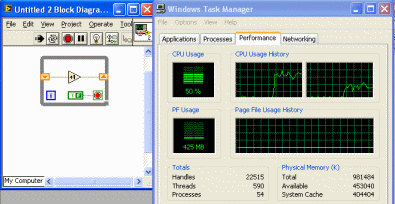

Although this single loop is limited to one thread at any given moment, the operating system may schedule it across different CPU cores over time. However, this single loop segment itself can never run on multiple cores simultaneously.

The program below features two parallel While Loops with no data dependencies (no connecting wires). LabVIEW automatically assigns these independent loops to separate execution threads. The operating system then schedules these two threads on distinct CPU cores, fully utilizing a dual-core processor.

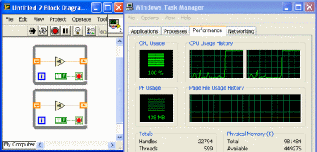

This illustrates the primary method for leveraging multi-core processors in LabVIEW: design independent tasks to run in parallel. A key guideline is to place parallelizable code blocks side-by-side on the Block Diagram, avoiding unnecessary sequential constraints like data wires or Flat Sequence Structures. LabVIEW automatically handles the scheduling, mapping these tasks to separate threads for concurrent execution to reduce overall run time.

While parallel execution takes advantage of multi-core CPUs, there are exceptions where introducing concurrency can actually decrease execution speed. These exceptions will be explored in greater detail in later sections.

### LabVIEW's Execution System

LabVIEW introduced support for multithreading with version 5.0. Prior to this release, all LabVIEW VIs operated on a single thread. Even back then, parallel loops and functions executed in a cooperative, multitasking fashion. LabVIEW achieved this by segmenting the Block Diagram code into small execution chunks (clumps) and executing them alternately, essentially cooperative scheduling on a single OS thread.

This mechanism is called the **Execution System**. Modern LabVIEW provides six distinct execution systems: **User Interface**, **Standard**, **Instrument I/O**, **Data Acquisition**, **Other 1**, and **Other 2**. You can configure individual VIs to run in specific execution systems. To set this, open **VI Properties (Ctrl+I)**, select the **Execution** category, and choose from the dropdown list:

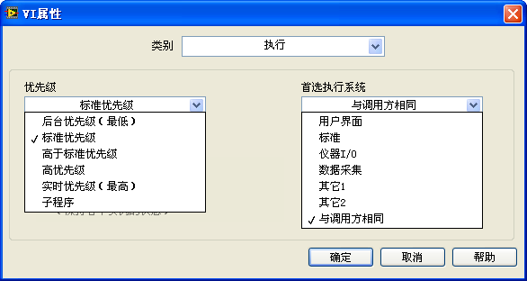

### The Relationship Between Execution Systems and Threads

With multithreading support, each execution system maps to a separate set of OS threads. The **User Interface Execution System** runs on a single, dedicated OS thread (the main UI thread). The other execution systems are pool-based and allocate multiple threads to execute VIs.

Under **VI Properties -> Execution**, you can also configure the VI's execution priority: **Background**, **Normal**, **Above Normal**, **High**, and **Time Critical**. In addition, there is a special **Subroutine** priority, which behaves differently from standard priority levels.

By default, on a single-core machine, LabVIEW creates a pool of up to 4 threads for each combination of execution system and priority level. Multi-core systems scale this limit proportionally. Since a typical application only uses a few execution systems and priority levels, the actual thread count is much lower than the theoretical maximum.

Managing and switching between too many threads introduces context-switching overhead. If thread counts are excessive, this overhead can degrade performance. By default, VIs use the **Standard** execution system at **Normal** priority. For simple applications, LabVIEW creates one UI thread and a small pool of worker threads (e.g., 4 threads on a single-core or quad-core, scaling up on systems with more cores) for the Standard system.

### The User Interface Execution System

In LabVIEW, all Front Panel UI interactions and updates run under the **User Interface Execution System**. Even if a VI is configured to run in a different execution system, operations like updating Front Panel indicators or responding to user clicks will trigger a switch to the UI thread. Additionally, VI Server operations like dynamically opening VI references (**Open VI Reference**) and using Property/Invoke Nodes also execute on the UI thread.

As previously mentioned, the User Interface Execution System is unique, possessing only one thread: the User Interface thread. This thread is created at the moment that LabVIEW launches, whereas threads for other execution systems are only created by LabVIEW as needed.

Because the UI Execution System has only one thread, VIs assigned to it execute in a single-threaded manner. For example, if a VI contains two parallel While Loops (as shown below), running it in the **Standard** execution system uses two cores. But if you configure the VI to run in the **User Interface** execution system, both loops share the single UI thread. This results in only one core being active, while the other remains idle.

Even on a single thread, the loops still execute concurrently through cooperative multitasking. The indicators on the Front Panel will alternate updates:

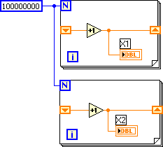
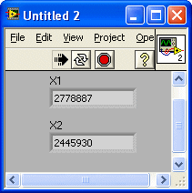

If you are integrating third-party DLLs or legacy code that is not thread-safe, running them on the **User Interface** execution system is a common safety measure to force single-threaded execution on the main thread.

### Other Execution Systems

The default setting for most VIs is **Same as Caller**, which means the subVI inherits the execution system of the VI that called it. If a top-level VI is set to **Same as Caller**, it defaults to the **Standard** execution system.

The **Instrument I/O** execution system is designed for communication with instruments. Its threads are configured to prevent priority inversion and ensure that I/O operations are handled promptly.

The **Data Acquisition (DAQ)** execution system is optimized for DAQ operations, providing threads with larger stack allocations.

The **Other 1** and **Other 2** systems do not have special internal priorities; they are simply extra thread pools that you can use to isolate specific tasks (such as background logging or computation) onto separate tasks.

For most applications, the User Interface Execution System and the Standard Execution System provide sufficient functionality.

### VI Priority Levels

VI priority settings encompass six levels: Background, Normal, Above Normal, High, Time Critical, and Subroutine. These levels are ordered from the lowest to highest priority. A higher priority gives the VI's thread precedence in the OS scheduler. For instance, setting a computationally intensive background VI to **Time Critical** priority can starve other threads of CPU cycles. This can make the user interface laggy or unresponsive, as the UI thread is starved of time slices.

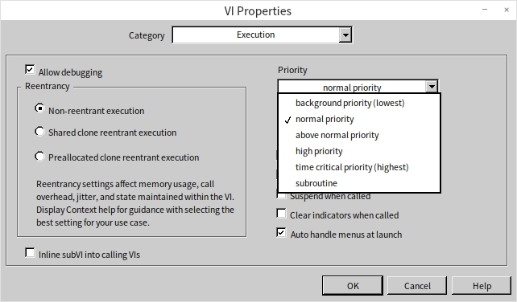

The **Subroutine** priority is a special setting that changes the compiler behavior and execution rules of the VI:
- The subVI's Front Panel and Block Diagram are optimized away at runtime (they cannot be displayed, and user interactions are not supported).
- All debugging overhead (execution highlighting, breakpoints, single-stepping) is disabled.
- It executes in-thread (directly on the calling VI's thread), eliminating thread-context switching overhead.

These optimizations ensure that subVIs set to **Subroutine** execute with minimal overhead. Math routines, array processing, or utility VIs that complete quickly are ideal candidates for Subroutine priority.

Considerations when setting VI priorities include:
- Increasing priority does not speed up the CPU; it only changes thread scheduling priority. The total clock cycles required for the calculation remain unchanged.
- A higher priority is not a strict execution sequencer. The operating system uses preemptive scheduling; thread priorities determine resource share, not deterministic execution order.
- Avoid setting VIs to Subroutine if they perform blocking I/O (like network or file access) or wait on user input. Since Subroutine VIs run in-thread on the caller's thread, any blocking operation will freeze that thread entirely, preventing other tasks from executing.

### Threads in Dynamically Linked Library Functions

This book's section on [Dynamically Linked Libraries](external_call_dll) introduces the various settings within the **Call Library Function Node (CLFN)**, including the thread selection option (Run in UI thread vs. Run in any thread). When calling DLL functions frequently, aligning the CLFN's thread setting with the calling VI's execution system is critical for performance.

I once developed a 3D animation demonstration program utilizing a multitude of CLFNs to invoke OpenGL functions for rendering 3D animations.

Since OpenGL operations must execute on the same thread to share context, I configured all CLFNs to **Run in UI thread**. However, the VIs invoking these nodes were left at their default execution settings. This discrepancy caused the program to run incredibly slowly—achieving only 1 frame per second (FPS) while pegging CPU usage at 100%. For animations to appear fluid, at least 25 frames per second are necessary.

Profiling the code with the **Profile VIs** tool showed almost no CPU time spent inside the VIs themselves. Because the tool didn't show where the bottleneck was, identifying the problem was extremely difficult, and development temporarily stalled.

I later realized that the performance bottleneck was caused by **thread-context switching** overhead. The program wrapped each OpenGL function in a wrapper subVI. These subVIs were very simple, containing just a single CLFN. The wrapper VIs were set to run in the default execution system (Standard thread pool), but the CLFNs inside them were configured to run on the UI thread. As a result, every single subVI call forced LabVIEW to switch execution from the caller's worker thread to the UI thread to run the DLL function, and then switch back to the worker thread when the function returned.

Thread switching is computationally expensive. Drawing a single frame required calling these wrapper subVIs over 2,000 times, wasting nearly a full second on thread context switching. Because this scheduling overhead is handled by the OS and the LabVIEW execution engine, it was not recorded as execution time inside the VIs, which is why the profiler showed negligible CPU usage.

The solution was straightforward: I configured all wrapper VIs and their callers to run in the **User Interface** execution system. Since the VIs and the CLFNs now shared the same UI thread, the engine no longer needed to switch threads when calling the DLL functions. The animation frame rate instantly jumped to 30 FPS, and CPU usage dropped to single digits.

This thread alignment is also critical when calling Windows APIs. In one project, I was calling a Windows API function that failed and returned `0`. To retrieve the error code, I immediately called `GetLastError` (and then `FormatMessage`). However, `GetLastError` kept returning `0` (no error), even though the previous call had clearly failed. The problem was thread switching. Because the two CLFNs were scheduled on different threads, the thread-context switch between the calls wiped out the thread-local error state stored by the OS. Setting both CLFNs and their containing VIs to run on the **UI Thread** resolved the issue.

This thread-switching overhead also explains why **Property Nodes** and **Invoke Nodes** are slow. Consider three ways to write data to a control: wiring directly to the control terminal, using a **Local Variable**, or writing to the **Value** property. Direct wiring is the fastest. Using a Local Variable is slightly slower but still fast. Writing to the **Value** property is often orders of magnitude slower. This massive slowdown happens because Property/Invoke Nodes must execute on the UI thread. If the VI is running in a different execution system, LabVIEW has to switch execution to the UI thread, perform the property write, and switch back to the worker thread. Minimizing Property Node writes inside fast loops is a core optimization practice.

### LabVIEW's Support for Multi-core CPUs

Moore's Law, which predicted the doubling of CPU clock speeds approximately every eighteen months, has not held up in terms of frequency advancements. The CPUs in the various computers I've used over the years have maintained clock speeds within the 2GHz to 4GHz range. Currently, CPU manufacturers focus on enhancing overall performance by increasing the number of CPU cores. Multiple CPU cores can indeed boost program execution efficiency, but fully unlocking their potential requires software optimized for multi-core environments. The initial step towards multi-core optimization involves ensuring the software runs in a multithreaded manner. On multi-core systems, the operating system automatically assigns different threads of a program to various CPU cores.

Writing a multithreaded program in traditional text-based languages, such as C++, is not straightforward. Programmers must have a deep understanding of C++ programming basics, be familiar with the mechanics of Windows multithreading, know how to call Windows APIs, or navigate the architecture of MFC, among others. Debugging multithreaded programs in C++ is considered by many programmers to be particularly challenging.

The scenario is quite different when writing multithreaded programs in LabVIEW. LabVIEW is inherently a multithreaded programming language, freeing programmers from needing to grasp any multithreading-related concepts. By simply placing two independent code blocks side-by-side on the Block Diagram, LabVIEW automatically distributes them to different threads. The OS then maps these threads to separate CPU cores, unlocking true hardware parallelism without the developer having to write a single line of synchronization or thread-management code. This way, LabVIEW programmers inadvertently create programs that are optimized for multi-core systems.

Occasionally, the operating system's strategy for CPU allocation may not be the most efficient. For example, consider a program comprising data acquisition, display, and analysis modules running in parallel. On a dual-core system, the OS might initially allocate one core to data acquisition and the other to display. Once data acquisition completes, the first core might switch to data processing—a relatively heavy task. If one core is dedicated to data processing while the other remains idle, this leads to an imbalanced load and suboptimal CPU utilization.

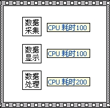
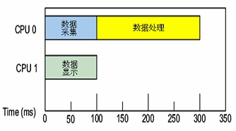

For performance-critical or deterministic applications, LabVIEW's timed structures allow you to manually bind tasks to specific CPU cores.

A **Timed Loop** or **Timed Sequence** structure lets you define a precise execution rate and specify the target CPU core. The input node on the left of these structures allows you to wire a CPU core index directly:

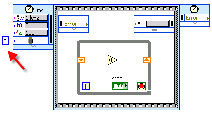

You can configure this statically in the structure's configuration dialog:

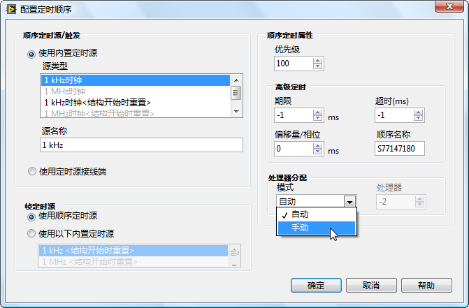

CPU cores can also be specified dynamically during program execution, as illustrated below:

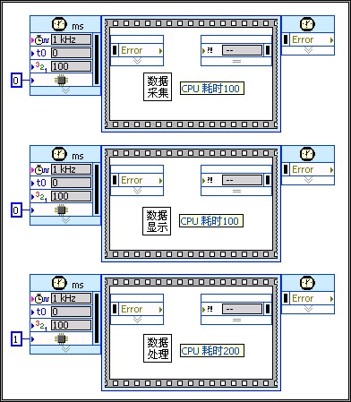

Running the program below, the two lightweight tasks are pinned to one core, while the heavy calculation task is pinned to another. This manual load balancing prevents the CPU-intensive task from starving the critical or time-sensitive tasks:

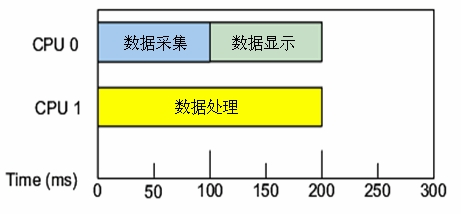

### Parallel For Loops

Usually, parallel execution in LabVIEW requires placing separate structures on the Block Diagram. However, if you have a single **For Loop** where each iteration is independent and performs heavy calculations, running them sequentially on a single thread underutilizes the CPU. For example:

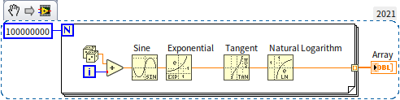

This program consists of a single loop performing extensive mathematical operations, heavily taxing CPU resources. When run, the system resource monitor shows it consuming 100% of one CPU core's resources:

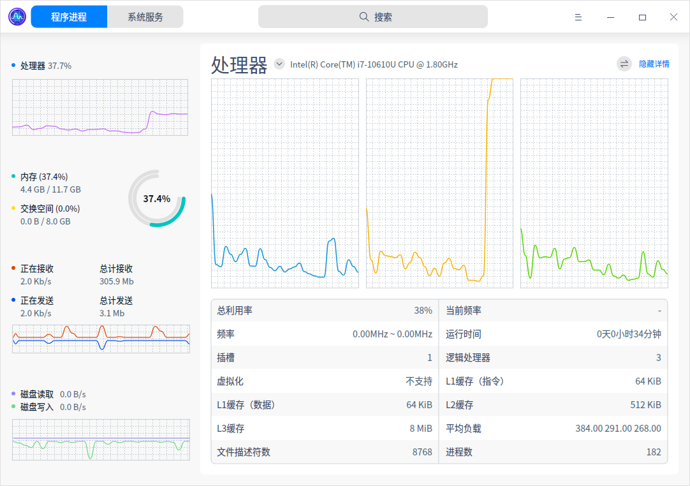

Although three CPU cores were allocated to the system running LabVIEW, only the second CPU core is fully utilized during this program's execution.

For loops like this, you can enable **For Loop Iteration Parallelism**. Right-click the For Loop border and select **Configure Iteration Parallelism...**:

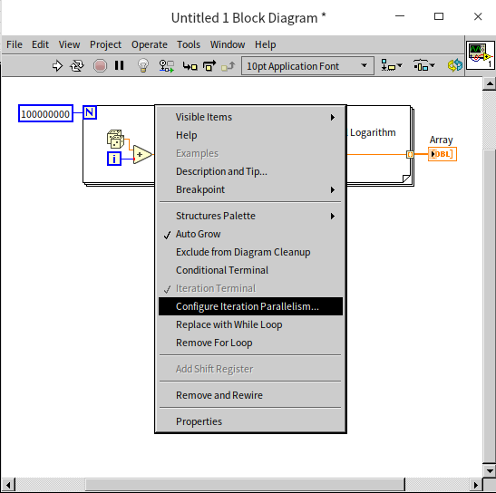

This action opens the configuration window for parallel loop execution:

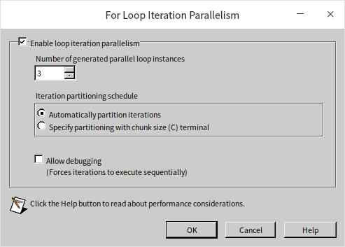

In this dialog, check **Enable loop iteration parallelism** and specify the number of parallel instances (threads). Typically, setting this to the number of available physical cores is optimal. Adding more instances than CPU cores will introduce scheduling overhead without any performance gains.

Once enabled, the For Loop displays a parallel terminal (marked with a **P**) at the top-left. You can wire a value to this terminal to change the number of parallel instances dynamically at runtime:

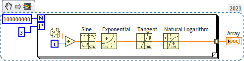

Running the parallelized loop distributes iterations across the three configured CPU cores, reducing the execution time to nearly a third of the sequential version:

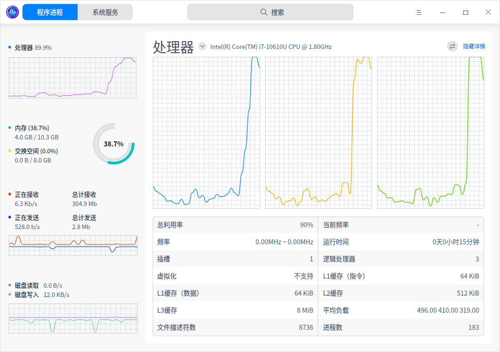

Note that not all loops can run in parallel. If an iteration depends on the results of a prior iteration (e.g., using **Shift Registers** or **Feedback Nodes**), the iterations must execute sequentially. For example:

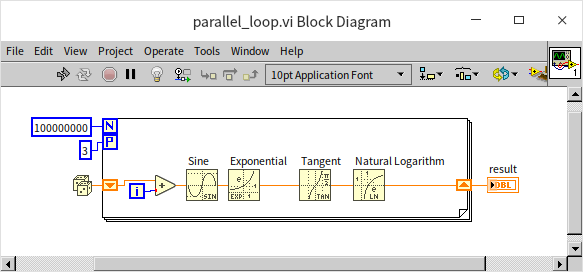

This loop has a Shift Register, which represents a data dependency between iterations. If you attempt to enable parallelism on this loop, LabVIEW will flag a compilation error:

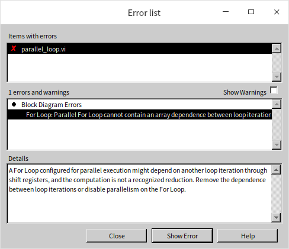

## Inter-thread Communication and Synchronization

Parallel loops often need to coordinate, synchronize execution, or pass data. While **Queues** are the standard mechanism for inter-loop communication in LabVIEW (as discussed in [Queues](pattern_pass_by_ref#queues)), LabVIEW offers other specialized synchronization tools. Below, we introduce alternative synchronization features that can simplify block diagrams or improve efficiency in specific scenarios.

### Channel Wires

**Channel Wires** act as asynchronous data links between parallel loops. Visually, they look like standard wires but behave very differently. Standard LabVIEW wires represent synchronous dataflow: data cannot bypass structures and must pass through tunnels, waiting for the loop or structure to complete. Channel Wires, in contrast, establish asynchronous communication, allowing data to flow continuously in and out of structures without waiting for them to finish. This enables direct, concurrent data streaming between loops.

#### Streaming

The figure below shows a basic data acquisition and display application. The left loop simulates data acquisition using a random number generator and a delay, while the right loop displays the data on a Waveform Chart:

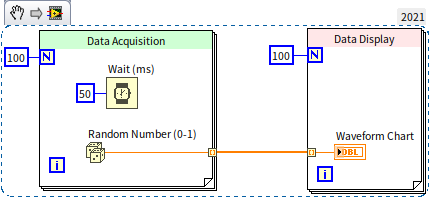

Because a standard data wire links the loops, the display loop cannot start until the acquisition loop completes its entire execution. Running this program will freeze the chart for 5 seconds during the acquisition phase; only when the loop terminates does the chart display all data at once. To execute them concurrently, we traditionally refactor this into a **Producer-Consumer** architecture using a queue:

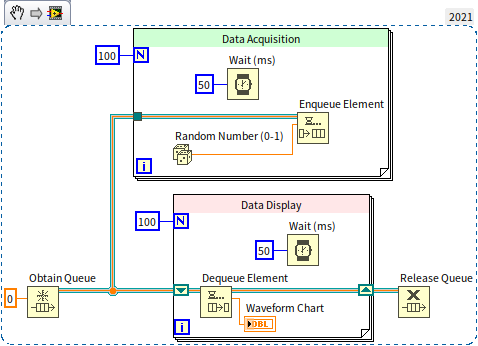

Although this achieves concurrency, the block diagram becomes cluttered with queue creation, destruction, and transfer functions. We can achieve the exact same behavior with much cleaner code using Channel Wires. Right-click the terminal or wire where you want to send data and select **Create -> Channel Writer**. LabVIEW will prompt you to choose the channel template:

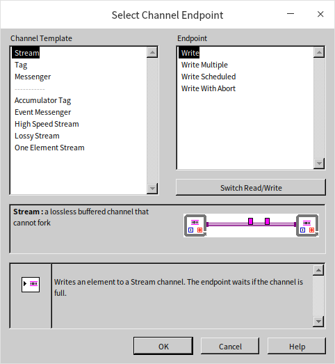

For simple streaming, select the **Stream** template. This creates a FIFO channel with a single writer and a single reader. When selected, LabVIEW places a Channel Writer endpoint on the diagram. You can then right-click the destination terminal to create a matching Channel Reader endpoint. The resulting code is incredibly clean:

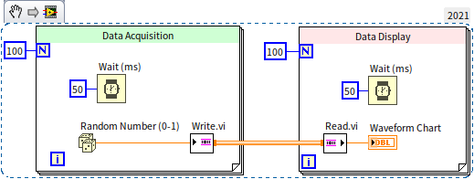

Running this revised program reveals it too can display acquisition results in real-time, yet its block diagram is significantly simpler than its queue-utilizing counterpart.

When setting up Channel Wires, you can also select the endpoint style. The basic style reads/writes single elements. Other styles include batch endpoints (reading/writing arrays of elements at once) and cancelable endpoints (which include abort terminals). Below is an example using batch endpoints:

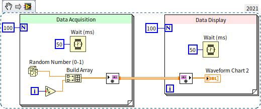

#### Messengers

While a **Stream** channel is strictly point-to-point, a **Messenger** channel supports multiple writers and readers, allowing many loops to write to the same channel. For example:

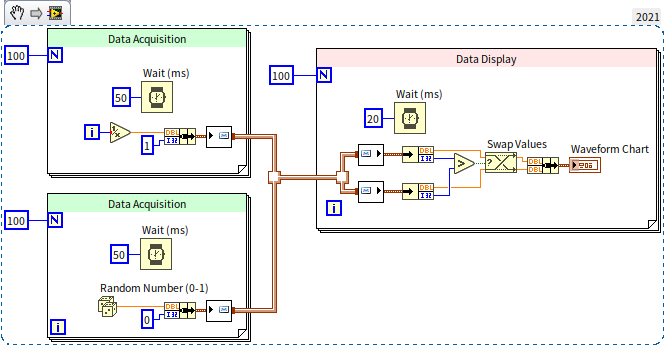

Running this program demonstrates the simultaneous acquisition and display of data from both channels:

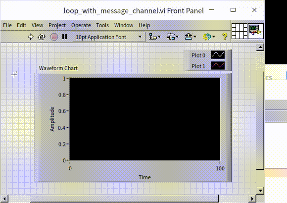

Messenger channels can also be used to feed data back to prior steps, creating an asynchronous feedback loop:

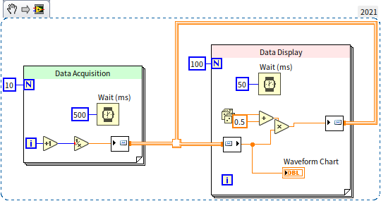

This behaves similarly to a **Feedback Node**, but since Channel Wires are asynchronous, the feedback path can loop outside the structure, connecting different nodes or loops without blocking.

#### Event Messengers

An **Event Messenger** is a specialized channel that automatically fires a **User Event** whenever data is written to it. This allows you to handle incoming channel data directly inside an **Event Structure**, making it a perfect fit for event-driven architectures.

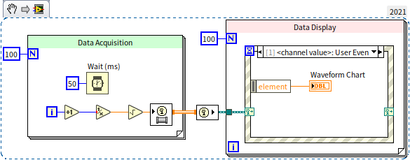

#### Other Types of Channel Wires

- **One Element Stream**: A point-to-point stream with a buffer size of 1. If the buffer is full, the writer blocks until the reader consumes the element (synchronous handshaking).
- **Lossy Stream**: A stream that discards the oldest data if the buffer fills up, preventing the writer from blocking.
- **Tag**: A lossy channel with a buffer size of 1. Readers always get the latest value written, similar to a local variable.
- **Accumulator Tag**: A numeric tag channel that adds incoming values to the existing value in the buffer rather than overwriting it.

#### Advantages and Disadvantages of Channel Wires

Channel Wires offer a clean, visual alternative to queues, eliminating the boiler-plate code of creating, passing, and destroying refnums. However, they also introduce challenges: because they look like standard wires but violate dataflow rules (flowing asynchronously in/out of structures), they can confuse developers who are not familiar with them. Understanding dataflow is the key to mastering LabVIEW, and Channel Wires require a shift in how you trace code execution.
