# Basic Algorithms and Data Structures

Niklaus Wirth, a Turing Award laureate and the creator of the Pascal programming language, famously stated: `Program = Algorithm + Data Structure`. Data structures determine how to organize data efficiently, while algorithms define the steps to solve a problem. Together, they form the core of any software program. Although this is a simplification, it captures the essence of software development. Consequently, algorithms and data structures are the most common topics in technical interviews.

Algorithms and data structures are equally fundamental to LabVIEW. However, because LabVIEW has historically been used to write test and measurement applications—which often rely on a few standard structures—their importance is sometimes overlooked. Yet, the choice of algorithms and data structures has a far greater impact on execution speed than the choice of programming language (e.g., LabVIEW vs. C). Mastering these fundamentals can significantly boost your application's performance. While developers sometimes complain about LabVIEW's execution speed, most inefficient programs simply have poorly optimized algorithms.

Since algorithms and data structures are vast fields that could easily fill a semester-long course, this section only covers the basic concepts and structures most relevant to LabVIEW development.


## Time Complexity

To evaluate the efficiency of a program, we use a metric called **algorithm complexity**, which is divided into **time complexity** and **space complexity**. Space complexity measures the memory required to execute an algorithm, while time complexity measures the computational workload relative to the input size, directly determining the execution speed.

Time complexity is expressed as a function using **Big O notation**, where $n$ represents the size of the input data:

- **$O(1)$ (Constant Time)**: The runtime remains constant regardless of the input size $n$.
- **$O(n)$ (Linear Time)**: The runtime grows proportionally with the input size $n$ (e.g., $c \times n$, where $c$ is a constant).
- **$O(n^2)$ (Quadratic Time)**, **$O(n^3)$ (Cubic Time)**, etc.: The runtime grows proportionally to the square, cube, or higher powers of the input size.

These are **polynomial-time complexities**, and algorithms within this range are generally practical for real-world software. However, if an algorithm's complexity grows exponentially (e.g., $O(2^n)$) or factorially (e.g., $O(n!)$), it quickly becomes unusable for large inputs. For instance, the naive Fibonacci recursion algorithm has a complexity of $O(2^n)$, which is too slow for inputs greater than 40 on modern computers. Finding the lowest possible complexity for a given problem is always a primary goal of algorithm design.


## Determining Prime Numbers

Let's analyze the time complexity of prime factorization. If a number $n$ is known to be the product of two prime numbers, how long does it take to find those primes?

Multiplying two numbers takes nearly constant time $O(1)$. However, factoring their product $n$ is much harder. In the worst case (when $n$ is the product of two identical primes), we must test potential factors up to $\sqrt{n}$. Thus, the time complexity of this trial division is $O(\sqrt{n})$.

Here is a simple program that factors the product of two primes:

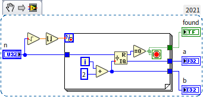

Even with optimizations (such as skipping even numbers), the complexity remains $O(\sqrt{n})$. While $O(\sqrt{n})$ sounds efficient, it becomes impractically slow for large inputs. If both prime factors are larger than $10^{10}$, a standard computer will take years to factor their product.

This asymmetry—where multiplication is easy but factorization is hard—is the foundation of modern cryptography, such as the RSA encryption algorithm. In RSA, a user generates a key by multiplying two massive primes. While anyone can encrypt a message using the public product, only the keyholder can decrypt it easily because decryption requires knowing the individual prime factors.

To use this method, we must first generate large primes. But how can we verify if a large random number is prime without trying to factor it? 

Fortunately, there are highly efficient primality tests. For example, Fermat's Primality Test uses Fermat's Little Theorem: if $p$ is prime and $a$ is not divisible by $p$, then $a^{p-1} \equiv 1 \pmod p$. If a number fails this condition for any base $a$, it is composite. To reduce false positives (known as Fermat pseudoprimes), we test multiple bases. For 64-bit unsigned integers (U64), testing the first five primes ($2, 3, 5, 7, 11$) is mathematically sufficient to guarantee primality.

To prevent arithmetic overflow when calculating $a^{p-1}$ for large numbers, we must use modular exponentiation rather than direct exponentiation.

We can write a program based on Fermat's Little Theorem. To compute $a^{p-1} \pmod p$, we use the modular exponentiation algorithm rather than direct exponentiation to avoid number overflow.

> [!NOTE]
> The Python code below implements modular exponentiation, which is commonly used in Fermat primality testing. Although sometimes referred to as Montgomery multiplication, Montgomery reduction is actually a lower-level hardware optimization for fast multiplication under a modulus, whereas the algorithm here is standard modular exponentiation.

```python
def mod_pow(base, exponent, modulus):
    result = 1
    base %= modulus
    while exponent > 0:
        if exponent % 2 == 1:
            result = (result * base) % modulus
        base = (base * base) % modulus
        exponent //= 2
    return result

def is_prime_fermat(n):
    if n < 2: 
        return False
    if n == 2 or n == 3: 
        return True
    # For robust production applications, the Miller-Rabin primality test is recommended.
    # The Fermat primality test shown here is a simplified demonstration.
    for a in [2, 3, 5, 7, 11]: 
        if mod_pow(a, n-1, n) != 1:
            return False
    return True
```

The corresponding LabVIEW implementation is shown below:

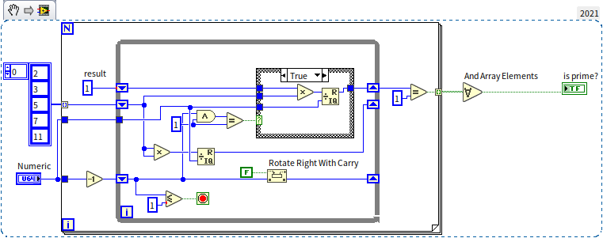

By testing sequential integers starting from $1,000,000,000$, this program instantly identifies the next prime number: $1,000,000,007$.


## Arrays

### Efficiency of Basic Operations

In [Arrays and Loops](data_array#array), we covered basic array operations. Here, we analyze their performance characteristics, which depend directly on how arrays are laid out in memory. 

An array stores elements of the same datatype in a contiguous block of memory:

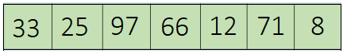

Because elements are contiguous and uniform in size, calculating the address of any element is a simple arithmetic operation: `address = start_address + index * element_size`. Consequently, accessing or modifying an array element by index has a time complexity of $O(1)$.

However, inserting or deleting elements is much slower. Since elements must remain contiguous, inserting an element in the middle requires shifting all subsequent elements to the right. Deleting an element requires shifting elements to the left. In the worst case (inserting at the beginning), every element must be moved, yielding a time complexity of $O(n)$.

Consider a program that constructs a 100,000-element array containing integers from 99,999 down to 0 in descending order.

A naive approach might insert the loop index at index 0 on each iteration, as shown in the top sequence structure below:

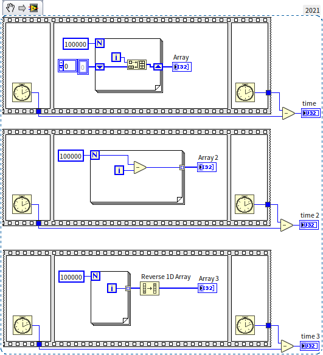

Because inserting at the beginning has a complexity of $O(n)$, doing this $n$ times results in a total complexity of $O(n^2)$. 

In LabVIEW, the most efficient way to build an array is by enabling auto-indexing on the output tunnel of a loop. The middle and bottom sequence structures show two optimal methods. On my computer, the execution times for `time`, `time 2`, and `time 3` were 450 ms, 1 ms, and 2 ms, respectively—demonstrating a massive performance difference.

:::info

Here's a thought for the readers: Inserting data at the array's start is evidently slow, but what about inserting at the end of the array? If the new element is the array's last, then moving other elements isn't necessary. Is that correct?

:::

Inserting or deleting data at the end of an array does not require shifting other elements, so its time complexity is $O(1)$—the same as indexing. Therefore, this is also a recommended and efficient operation, provided you avoid inserting or deleting elements at the beginning or middle of the array.

However, even though they share the same time complexity, appending/removing elements at the end of an array is still slower than pre-initializing an array and modifying elements by index. This is due to two reasons:
1. **Length Update Overhead**: Appending elements requires updating the array's size metadata, though this step takes negligible time.
2. **Dynamic Memory Allocation**: LabVIEW allocates memory with some headroom to allow the array to grow at the end. However, if you add too many elements, the contiguous memory block might run out of space (as subsequent addresses are occupied by other variables). In this case, LabVIEW must request a new, larger memory block from the OS and copy the entire array to the new location. This reallocation and copying process is very expensive. While it happens infrequently enough that the amortized time complexity is still $O(1)$, it is a potential performance bottleneck.

Therefore, the most efficient way to build a large array in LabVIEW is to pre-initialize it with a fixed size using the **Initialize Array** function, or use a loop's auto-indexing tunnel. Both methods allow LabVIEW to determine the required memory size upfront and allocate it in a single operation, avoiding repeated memory reallocation and copy overhead.


### Multidimensional Arrays

LabVIEW does not support "arrays of arrays" (nested arrays where each row has a different length) because array indexing relies on a fixed, predictable memory offset. Instead, we use multidimensional arrays, where every row must have the same length.

A 2D array represents data in rows and columns:

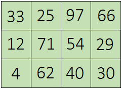

In memory, a 2D array is stored in a contiguous block row by row (row-major order). Because each row has exactly $m$ elements, finding the element at row $i$, column $j$ is fast: `address = start_address + (m * i + j) * element_size`.

For variable-length datatypes (like strings or clusters), LabVIEW stores an array of *pointers* (references) to the actual data. Since the pointers are uniform in size (typically 4 or 8 bytes), the array can still be indexed in $O(1)$ time, while the actual string data is allocated elsewhere in memory. See [Flattening Data to Strings](data_string#flattening-to-string) for details.


### Sorting

Sorting is a fundamental programming task. While LabVIEW provides built-in sorting functions, understanding the underlying algorithms helps you write custom, optimized routines.

Consider sorting a pile of apples by size:
- **Selection Sort**: Find the largest apple, place it first. Find the largest of the remaining, place it second, and so on.
- **Insertion Sort**: Take an apple and insert it into its correct position relative to the apples already sorted.
- **Bubble Sort**: Compare adjacent apples, swap them if they are in the wrong order, and repeat. After $n$ passes, the array is sorted.

Bubble Sort is popular for its simplicity. Here is a LabVIEW implementation:

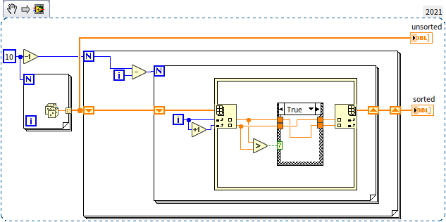

These three algorithms have a time complexity of $O(n^2)$ because they perform redundant comparisons. If you know $a > b$ and $b > c$, you do not need to compare $a$ and $c$.

**Quick Sort** avoids redundant comparisons. It selects a pivot element, divides the array into elements larger than the pivot and elements smaller, and then recursively sorts the sub-arrays. This reduces the time complexity to $O(n \log_2 n)$. LabVIEW's built-in sorting functions use Quick Sort.

Can we sort faster than $O(n \log_2 n)$? For comparison-based sorting, $O(n \log_2 n)$ is the theoretical limit. However, if we know the range of the elements, we can sort using index lookups instead of comparisons.

**Counting Sort** does this by creating a helper array where the index represents the value, and the elements count occurrences. The sorted array is reconstructed from these counts:

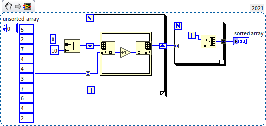

Counting Sort has a linear time complexity of $O(n)$. The program diagram contains no nested loops. Here is a performance comparison between LabVIEW's built-in Quick Sort and Counting Sort:

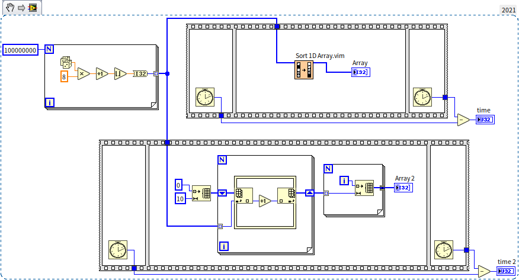

On a 100,000,000-element random integer array, the built-in sort took 17,156 ms, while Counting Sort took only 93 ms—a massive performance improvement.

Why doesn't LabVIEW use Counting Sort by default?
Counting Sort only works for integers within a relatively narrow range. If the range is extremely large, the helper array will exceed memory limits. To sort other data:
- **Radix Sort**: Sorts integers digit-by-digit (e.g., sort by units, then tens, then hundreds).
- **Key Mapping**: Map strings or complex data to integer keys before running Counting Sort.

Because comparison-based algorithms (like Quick Sort) are universal and work on any data type (numbers, strings, clusters) without modification, they are preferred for standard libraries. However, for specialized, performance-critical tasks, implementing a custom $O(n)$ sort is highly beneficial.


### Search Algorithms

Finding a specific element in an array is another common task. 
- **Linear Search**: For unsorted arrays, we must check elements one by one. The worst-case complexity is $O(n)$.
- **Binary Search**: For sorted arrays, we compare the target with the middle element. If the target is larger, we discard the left half; if smaller, we discard the right half. Repeating this halves the search space at each step, yielding a complexity of $O(\log_2 n)$.

LabVIEW's built-in `Search Sorted 1D Array.vim` is open-source, and you can open its block diagram to see how binary search is implemented.

If we index the data directly (e.g., searching for value 5 by looking up index 5), complexity drops to $O(1)$. This is the concept behind **Hash Tables**, which combine arrays and linked lists.


## Linked Lists

A linked list stores elements in nodes, where each node contains the data and a pointer (reference) to the next node:

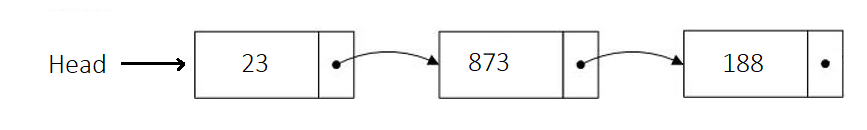

Implementing a generic linked list in LabVIEW is best done using object-oriented programming. We will detail how to [implement a doubly linked list](oop_use_cases#doubly-linked-list) after introducing [object-oriented programming](oop__).

Linked lists have opposite performance characteristics compared to arrays:
- **Random Access**: Arrays are $O(1)$; linked lists are $O(n)$ because we must traverse nodes from the beginning.
- **Insertion/Deletion**: Arrays are $O(n)$ (due to shifting elements); linked lists are $O(1)$ because we only update pointers.

Thus, arrays are best for static data requiring random access (e.g., signal measurement buffers), while linked lists are ideal for dynamic collections (e.g., a task scheduler where tasks are frequently added or removed). For small datasets, the performance difference is negligible, and you should use whatever structure is easiest to implement.


## Tree Structures

### Tree Control in LabVIEW

A tree is a data structure where each node can point to multiple child nodes, forming a hierarchical branch structure. While LabVIEW does not have a native generic tree datatype, it includes a **Tree Control** for UI display. We can use the properties and methods of this control to understand tree operations.

Unlike a standard listbox, a Tree Control represents parent-child relationships using indentation:

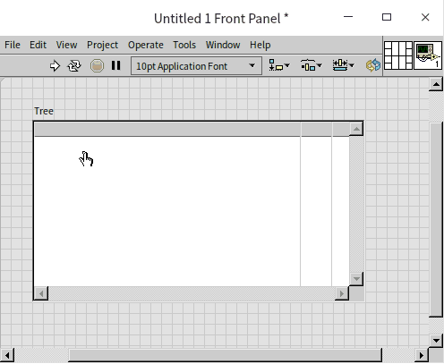


### Constructing a Sorted Binary Tree

A **Binary Tree** is a tree where each node has at most two children, referred to as the left child and right child.

A **Sorted Binary Tree** (or Binary Search Tree) enforces a specific order: for any node, all elements in its left subtree must be smaller than the node's value, and all elements in its right subtree must be larger.

Here is an example:

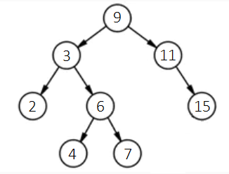

To insert a new value (e.g., 12) while maintaining this order:
1. Compare 12 with the root node (9). Since $12 > 9$, move to the right child (11).
2. Compare 12 with 11. Since $12 > 11$, move to the right child (15).
3. Compare 12 with 15. Since $12 < 15$, move to the left child.
4. Since 15 has no left child, insert 12 as its left child.

The insertion path is shown below:

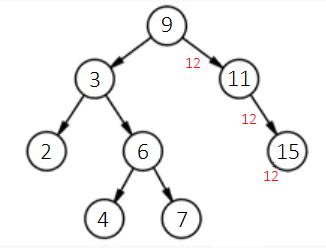

The resulting tree:

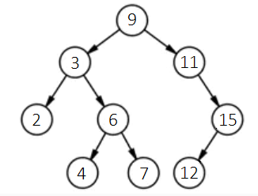

We can implement this in LabVIEW using the Tree Control. To do so, we build a helper VI `node_info.vi` to query a node's value and its left/right children. Because the Tree Control uses string tags rather than memory pointers, we prepended tags with L or R to distinguish left and right child nodes:

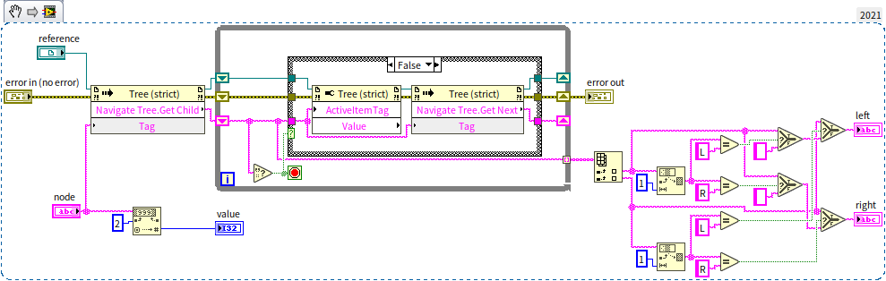

With `node_info.vi`, we can implement the insertion logic in `insert_node.vi`. This is a [recursive VI](pattern_reentrant_vi#recursive-algorithms):

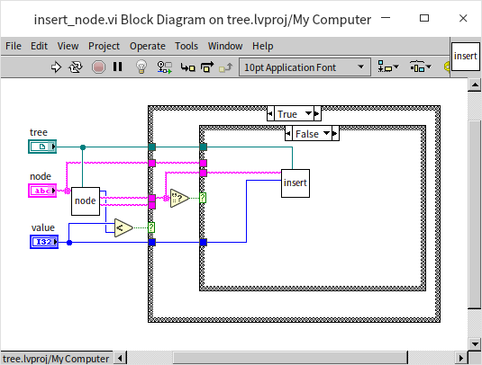
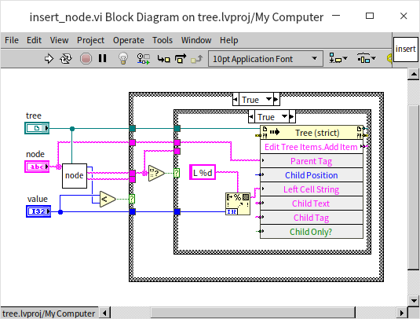

The main VI to construct a tree from an array `[9, 3, 2, 6, 4, 7, 11, 15, 12]` is shown below:

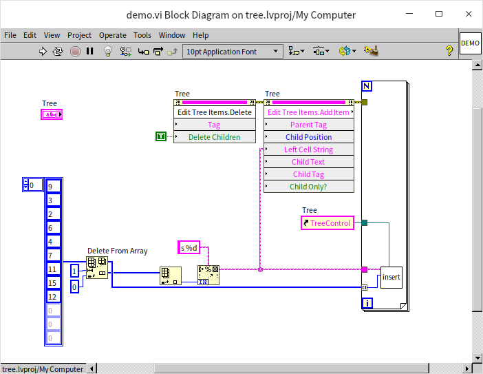

When run, the Tree Control displays the hierarchical layout:

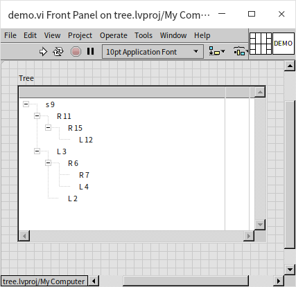

Binary search trees are highly efficient. Searching has a complexity of $O(\log_2 n)$. Inserting a node also takes $O(\log_2 n)$ time because we must search for its position, but we do not need to shift other elements (unlike sorted arrays). This makes binary search trees ideal for dynamic databases (e.g., student record lookups).


### Tree Traversal

Tree traversal is the process of visiting all nodes in a tree in a specific order.
- **Breadth-First Search (BFS)**: Visits all nodes at the current level before moving to the next.
- **Depth-First Search (DFS)**: Traverses down a branch as far as possible before backtracking. For binary trees, DFS has three orders:
  - *Pre-order*: Visit root, then left subtree, then right subtree.
  - *In-order*: Visit left subtree, then root, then right subtree. In a sorted binary tree, in-order traversal visits elements in ascending order.
  - *Post-order*: Visit left subtree, then right subtree, then root.

Here is the block diagram for an in-order traversal:

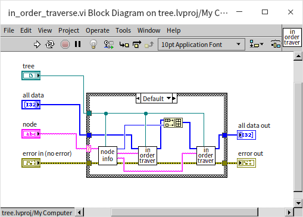

The main program calls this recursive traversal starting from the root node:

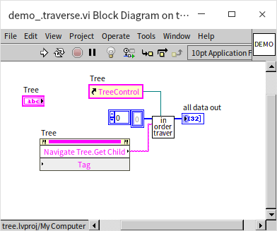

The output array is sorted in ascending order:

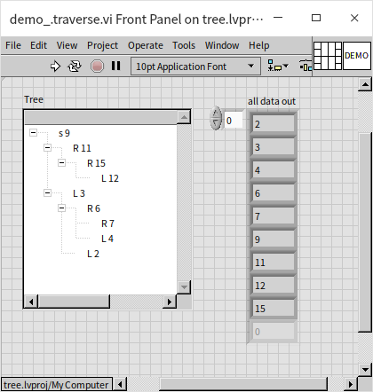

Tree traversal is a powerful technique. Many problems can be modeled as tree searches, such as pathfinding, maze solving, or mathematical puzzles. Let's look at a classic puzzle solved using tree traversal.


### The Three Jug Puzzle

Suppose you have three jugs with capacities of 8L, 5L, and 3L. The 8L jug is full of water, and the others are empty. How can you measure out exactly 4L of water in the fewest steps?

We can model all possible states of the jugs as nodes in a tree, with the root node being the initial state `[8, 0, 0]`. The child nodes represent states reachable by pouring water between jugs:

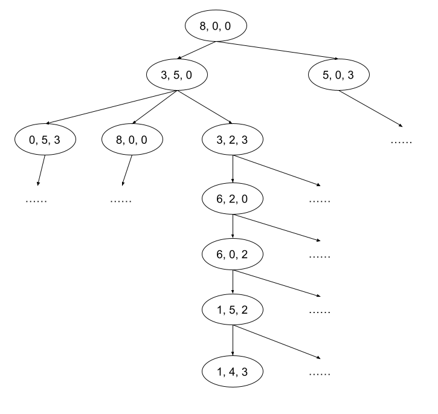

To find the solution with the fewest steps, we use Breadth-First Search (BFS) to traverse the tree level by level.

In LabVIEW, we represent the data as follows:
- Jug states: A 3-element integer array (e.g., `[3, 2, 3]`).
- Jug capacities: An array constant `[8, 5, 3]`.
- Pour directions: A cluster containing the source and target jug indices.
- Pouring logic: If the target jug can hold the water, pour it all; otherwise, fill it to capacity.
- Paths: A 2D array of states representing the step-by-step history from the root.
- Search queue: A 3D array storing all paths at the current search level.

We write `get_next_states.vi` to generate all valid states reachable from the current state:

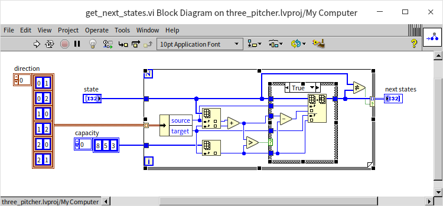

The core BFS logic is implemented in the recursive `BFS.vi`:

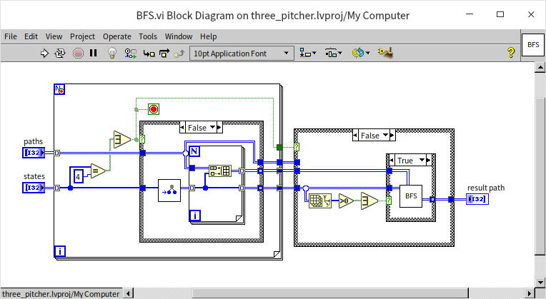

This VI checks the leaf node of each path for the target value (4L). If found, it returns the path; otherwise, it calls `get_next_states.vi` to expand the paths to the next level and recursively calls itself.

The main program initializes the search:

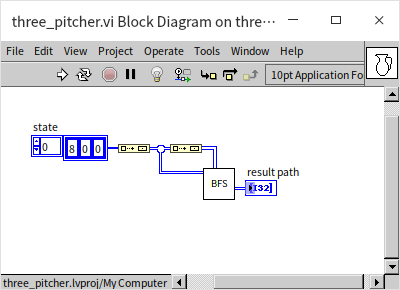

The program outputs the optimal sequence of steps:

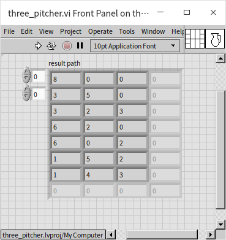

While this program works, it is inefficient because it allows states to repeat (e.g., pouring water back and forth between jugs). If no solution exists, the program will run forever in an infinite loop. We will address this in the next section.


### Notes on Using Tree Data Structures

The Tree Control is a UI element and should not be used as a data structure in performance-critical code due to its high overhead. For complex data models, implement trees using object-oriented classes (similar to a [linked list](oop_use_cases#doubly-linked-list)).

To maintain search efficiency, binary search trees must remain balanced. An unbalanced tree can degrade into a linked list, increasing search complexity from $O(\log_2 n)$ to $O(n)$. A **Red-Black Tree** is a self-balancing binary search tree that automatically adjusts itself to maintain $O(\log_2 n)$ efficiency without excessive overhead. LabVIEW uses Red-Black Trees internally to implement its set and map collections.


## Sets

A **Set** is a collection container that stores unique elements. The underlying implementation can vary, but LabVIEW uses Red-Black Trees to ensure that insertion and search operations run in $O(\log_2 n)$ time. Sets automatically filter out duplicate values and keep elements sorted.

Here is a basic example of using a Set:

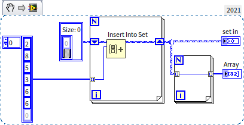

The input array contains the duplicate number 6. When passed through the Set, the duplicate is ignored, and the output is sorted:

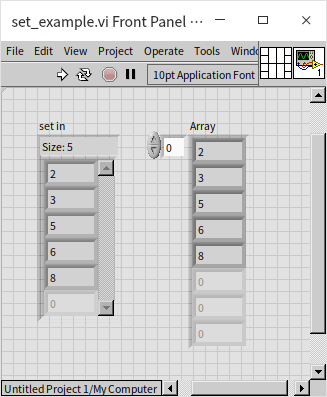

When passing a Set to a loop, you can use auto-indexing to retrieve elements in sorted order.

Sets are an efficient alternative to arrays when order does not matter and uniqueness is required. We can use a Set to fix the infinite loop and performance issues in our Three Jug Puzzle program by tracking visited states:

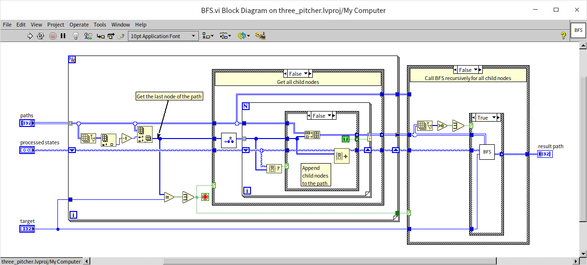

By checking if a newly generated state exists in the "visited" set before expanding it, we avoid redundant paths. This optimization makes the program significantly faster and guarantees it will terminate and return an empty path if the target state is unreachable.


## Maps {#map}

A **Map** (or Dictionary) is a container that stores key-value pairs. While Sets only store unique keys, Maps associate each key with a corresponding value. For example, in a database of student grades, the student ID is the key, and the grades cluster is the value.

Maps share the same Red-Black Tree backend as Sets, ensuring $O(\log_2 n)$ lookup speeds.

Maps are also useful for caching (memoization) to optimize slow functions. If a function is called repeatedly with the same arguments, we can store the arguments as the key and the output as the value in a Map. The next time the function is called, we can look up the result in the Map instead of recalculating it. We demonstrated this optimization in [Recursion with Caching](pattern_reentrant_vi#recursive-computation-with-caching).

Sets and Maps were introduced in LabVIEW 2019. Previously, developers used [Variant Attributes](oop_generic#utilizing-variants-as-sub-vi-parameter-types) to achieve similar lookup functionality. If you encounter older LabVIEW code using Variant Attributes for key-value storage, it is likely a legacy pattern from before native Maps were available.


## Queue and Stack

Queues (First-In, First-Out) and Stacks (Last-In, First-Out) are crucial data structures. We have already covered queues in [Pass by Reference - Queue](pattern_pass_by_ref#queues) and stacks in [State Machine](pattern_state_machine#designing-the-data-structure).

LabVIEW's queues use linked lists internally, so enqueueing and dequeueing are highly efficient $O(1)$ operations. If you only need to add and remove data from the ends of a collection and do not require random access, a queue is a faster and safer choice than an array.
