# Error Handling

Ensuring stability and reliability in the software we develop is crucial. While upcoming chapters focus on how to prevent runtime errors, even the most meticulous design can leave unforeseen bugs or latent issues. Under specific conditions, these issues can lead to program failures. Therefore, in addition to striving for bug-free code, we must implement proactive measures to mitigate the impact of failures and help developers locate and debug issues quickly. These measures form the core of a program's **error handling mechanism**.

In [Case Structure](structure_cond_seq#boolean-case-structure), we introduced how to wire an error cluster directly to the selector terminal of a Case Structure. LabVIEW automatically configures this as an **Error Case Structure** with distinct **Error** (red border) and **No Error** (green border) frames. This structure is used in almost all low-level subVIs in LabVIEW, highlighting the importance of mastering error handling.

Runtime errors are issues that occur while a program is running. An error handling mechanism serves two primary purposes:
1. **Early Detection and Reporting**: It captures errors as soon as they occur, documenting the location and conditions of the failure. This is invaluable for debugging and maintenance.
2. **Mitigating Secondary Failures**: It prevents errors from propagating unchecked, ensuring that a hardware or logic fault does not lead the program to produce incorrect results.

Consider a bad error handling scenario: a hardware testing application encounters an exception during data acquisition initialization. If the program ignores this error and continues running, it might display a "Test Passed" result for all subsequent devices. In reality, the hardware failed to read any signals, meaning defective products are being approved because the test system silently failed. Good error handling prevents such dangerous failures.

## Default Error Handling

In LabVIEW, if a node generates an error and its error output terminal is left unwired, LabVIEW's automatic error handling mechanism may display an error dialog box. This behavior halts the execution of the VI, highlights the problematic node or subVI, and prompts the user with error details:

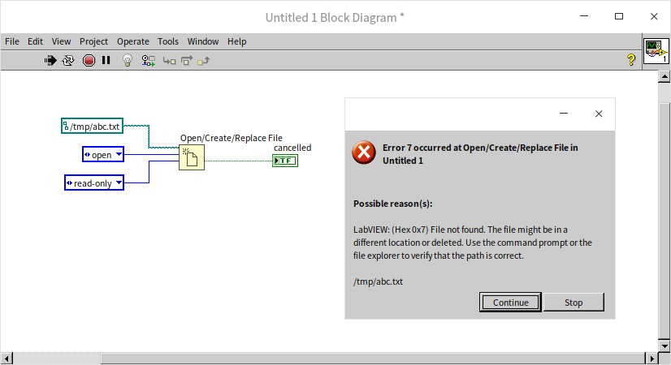

This dialog box offers two choices:
- **Continue**: LabVIEW ignores the error and continues running.
- **Stop**: Halted immediately, terminating execution.

While helpful during development, automatic error handling can be disruptive. For example, some minor errors can be ignored safely without prompting the user. In user-facing applications, constant pop-up dialogs degrade the user experience. You can disable this feature in the VI Properties dialog:

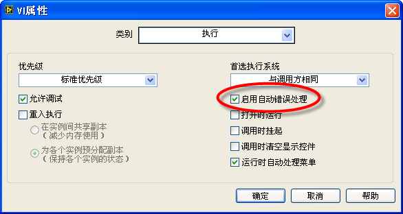

To disable LabVIEW's default error handling globally across all new VIs, open the [Options Dialog Box](basic_dev_environment#environment-options). In the **Block Diagram** page under **Error Handling**, uncheck the default error handling settings:

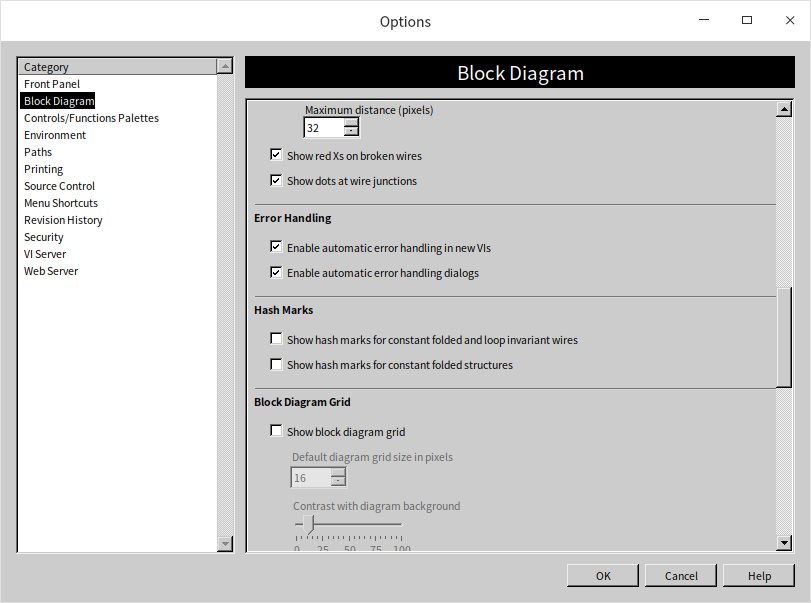

By customizing these settings, you can tailor the error handling behavior to fit your application's deployment needs.

## Error Clusters

LabVIEW uses a standard **Error Cluster** datatype for input and output terminals. An error cluster contains three fields:
- **status**: A Boolean indicating if an error occurred (True means an error is present).
- **code**: A 32-bit signed integer representing the specific error code.
- **source**: A string describing where the error occurred.

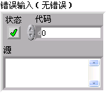

When a function or subVI encounters a problem during execution, it outputs the details in its error output cluster. For example:

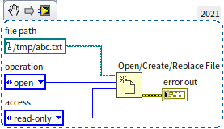

In this program, attempting to open a nonexistent file causes the `Open/Create/Replace File` function to output an error. To understand the error code, you can select **Help -> Explain Error** from the menu or right-click the error cluster control and select **Explain Error**. This opens a dialog box explaining the error code (in this case, code 7 indicating "File not found"):

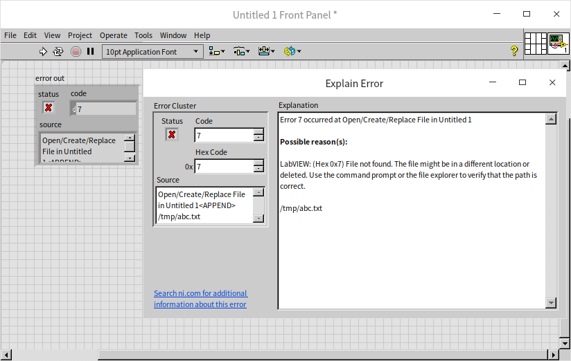

Errors can be categorized as **unpredictable errors (exceptions)** or **expected errors**, each requiring different handling strategies.

## Handling Unpredictable Errors

Unpredictable errors (or exceptions) are unexpected failures that the programmer did not foresee, such as hardware disconnecting, memory limits being reached, or corrupted files. These errors put the program into an undefined state, making further execution meaningless or dangerous.

A simple strategy for handling exceptions is to immediately stop further code execution, halt the program, and notify the user. You can achieve this by placing subsequent code inside a Case Structure wired to the error wire. The main logic goes into the "No Error" frame, while the "Error" frame simply passes the error through, bypassing execution:

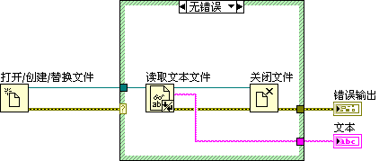

However, nesting every function in a Case Structure is impractical and clutters the block diagram. In larger programs, we delegate error checking to subVIs. Every standard subVI should inspect its **error in** terminal. If it receives an error, it skips its execution logic and immediately passes the error to its **error out** terminal. Downstream subVIs will do the same, allowing the error to propagate cleanly to the end of the program:

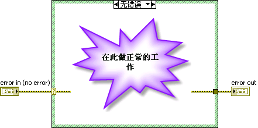
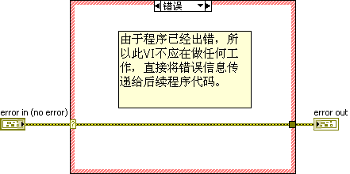

To simplify creating subVIs with this structure, select **File -> New...** from the menu and choose the **Sub-VI with Error Handling** template:

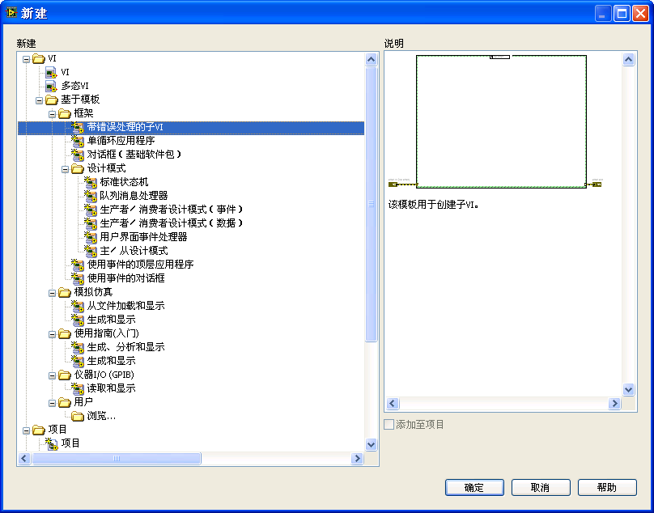

In practice, manually wrapping your code in an Error Case Structure is just as fast and allows for more customization.

If every function and subVI in a program already accepts error input and output wires, the main VI does not need an outer Case Structure. The error wire simply passes from node to node:

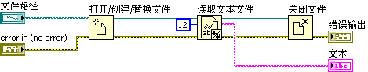

If an error occurs in the `Open/Create/Replace File` node, the `Read Text File` node will receive the error and skip its execution, passing the error to the `Close File` node.

### Code That Must Run Regardless of Errors

Some cleanup code must run even if preceding steps fail. For example, open references (such as file marks, network sockets, or hardware sessions) must be closed to prevent memory leaks or resource lockups.

In the example above, the `Close File` function must execute even if the `Read Text File` node fails. Standard cleanup functions in LabVIEW (like `Close File` or `Close Reference`) are designed to run their cleanup routines regardless of the value of their **error in** terminal. However, when designing custom VIs, you must ensure that resource cleanup logic executes regardless of the error state.

## Handling Expected Errors

Expected errors are anticipated failure states that are handled as part of the program's normal execution logic. For example:

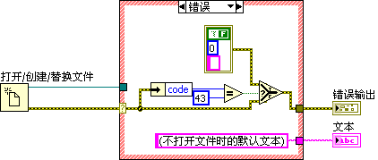

When this program runs, the `Open/Create/Replace File` dialog prompts the user to choose a file. If the user clicks **Cancel**, the function returns error code `43`.

Because canceling is a normal user decision, this error code should not trigger an exception or halt the application. We must handle this expected error code:

1. Check if the error code is `43`.
2. If it is `43`, clear the error using a Case Structure or helper VI, so the rest of the application is not affected.
3. If it is any other error code, propagate it as an exception.

In the example below, we check for error 43, skip file operations, and clear the error to keep the program running smoothly:

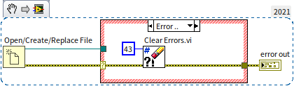

LabVIEW provides built-in utilities like **Clear Errors.vi** under `Programming -> Dialog & User Interface -> Error Handling` to clear specific errors.

## Implementing Custom Errors

You can define and return custom errors tailored to your application's logic.

To generate a custom error, use the **Error Code to Error Cluster** VI found in `Programming -> Dialog & User Interface`:

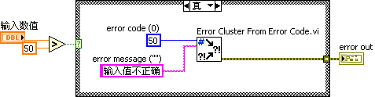

For the error code, you can use:
- An existing LabVIEW error code (such as `50` for "Value out of range").
- A custom code in the ranges reserved for users: `5000` to `9999`, and `-8999` to `-8000`.

To document and manage many custom error codes, you can define them in an XML-based text file. LabVIEW provides an error code editor to manage these files. Select **Tools -> Advanced -> Edit Error Codes...** to launch the editor:

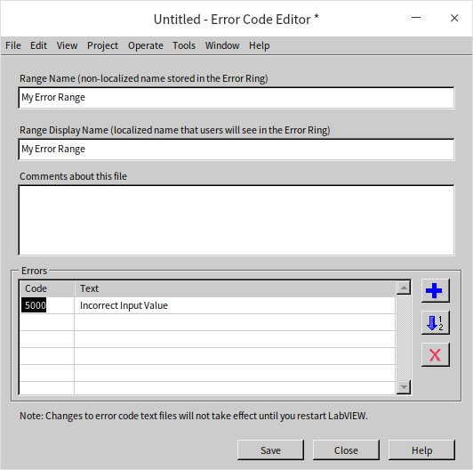

Define your custom codes and descriptions, then save the file. 

> [!WARNING]
> By default, LabVIEW suggests saving these files to the protected system directories `[LabVIEW]\user.lib\errors\` or `[LabVIEW]\resource\errors\`. On modern versions of Windows (Windows 10/11), writing to these folders requires administrator permissions. 
> If you encounter permission errors, save the file to your documents directory first, then copy it into the `user.lib\errors` directory using an administrator-elevated file explorer command, or save it to the public directory `C:\ProgramData\National Instruments\LabVIEW [Version]\errors\`.

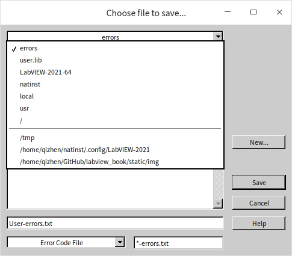

After restarting LabVIEW, your custom error codes will be integrated into the environment, and tools like **Explain Error** will resolve them automatically.

## Showcasing Error Messages

While you want to avoid pop-up dialogs during execution, you must inform users of unhandled exceptions when the program terminates.

LabVIEW provides two VIs for this: **Simple Error Handler.vi** and **General Error Handler.vi**. The Simple Error Handler is sufficient for most applications, offering basic dialog boxes. The General Error Handler offers advanced features, such as filtering specific errors or appending custom descriptions.

Wiring the **Simple Error Handler** at the end of your program ensures any unhandled error is displayed before exit:

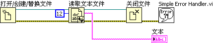

## Managing Error Messages During Debugging

To prevent pop-up dialogs from disrupting the user, error handlers are placed at the program's exit. However, during development, you want to see errors immediately when they occur.

You can resolve this conflict using the **Conditional Disable Structure**. This structure executes different code paths depending on project variables:

1. Define a project variable (e.g., `DEBUG`).
2. Set `DEBUG` to `True` during development and `False` for distribution.
3. Wrap your immediate error handler in a Conditional Disable Structure so it only executes when `DEBUG` is `True`:

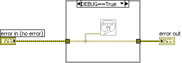

Before releasing the software, set `DEBUG` to `False` in your project settings to automatically disable all immediate error dialogs.

## Error Merging in Parallel Execution

When code blocks run in parallel, their error wires cannot be daisy-chained. Once all parallel threads complete, their errors must be combined and propagated. Use the **Merge Errors** function (`Programming -> Dialog & User Interface -> Merge Errors`) to combine multiple error wires:

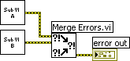

The **Merge Errors** function checks its inputs:
- If only one input has an error, it outputs that error.
- If no inputs have errors, it outputs no error.
- If multiple inputs have errors, it outputs the **first error encountered** (prioritizing the topmost terminal).

> [!IMPORTANT]
> Because **Merge Errors** prioritizes the topmost input and discards subsequent errors, you should wire the most critical or foundational error sources to the upper terminals.

In loops, error propagation requires careful design:

- **Bypassing Future Iterations**: If an error in one iteration makes subsequent iterations useless, use a **Shift Register** to pass the error. If a preceding step fails, the shift register passes the error to the next iteration, which skips execution:

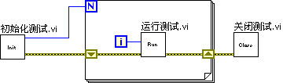

- **Continuing on Failures**: If an error in one step should not prevent other steps from running, do not use a shift register. Instead, use an auto-indexing tunnel to collect the errors from all iterations into an array, and then use **Merge Errors** outside the loop:

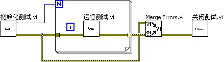

*Note: Ensure the error from `Initialize Test.vi` is also wired to the merge node, so initialization errors are not lost if the loop runs zero times.*

## Practice Exercise

- A user interface program lets users set the frequency of a signal generator. The instrument only supports two bands: $5\text{ Hz}$ to $50\text{ Hz}$, and $100\text{ Hz}$ to $1000\text{ Hz}$. If a user inputs a frequency outside these bands, the driver subVI returns an error. Design an error handling strategy that handles this gracefully: how would you inform the user of the error and guide them to correct the frequency setting without halting the application?
