# File I/O

## Understanding Binary and Text Files

In LabVIEW, the primary file reading and writing functions are located in the **Programming -> File I/O** palette:

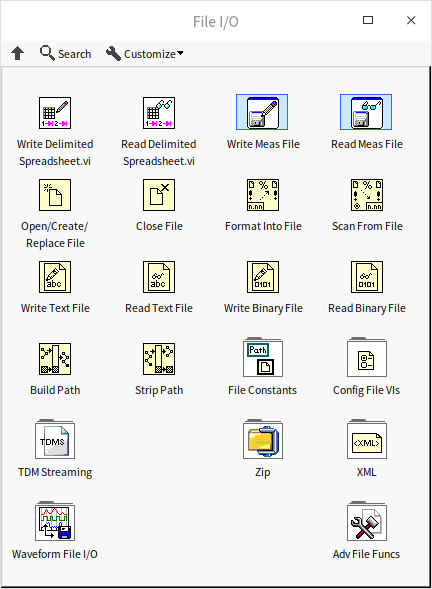

This palette offers functions for handling various file types, which are primarily categorized by how data is organized inside them. However, if we disregard formatting and focus only on the raw content, all files can be classified into two fundamental types: binary files and text files.

- **Binary Files**: Each byte of data is represented as an unsigned 8-bit integer (U8), ranging from 0 to 255. In these files, a byte does not necessarily represent a single number; it could represent a portion of a float, an image pixel, or a custom cluster. When opened in a text editor, binary files display as incomprehensible gibberish.
- **Text Files**: The bytes inside the file correspond to ASCII or UTF-8 binary values of human-readable characters, such as letters, numbers, punctuation, spaces, and line breaks. These files can be opened and read directly in any text editor.

Strictly speaking, text files are a subset of binary files in a broader sense since they are also stored as sequences of binary bits on disk. However, in practice, we draw a clear distinction between raw binary (non-text) files and text files.

Binary files write raw data directly from memory to the hard drive, minimizing storage size. Because they contain variable-length datatypes packed together, you must know the exact file layout to read them correctly. They can only be read and written using matching program logic. In contrast, text files store data as human-readable strings, making them easy to inspect and edit manually.

For example, consider the number `38749.928398387799`. In a binary file, it occupies exactly 8 bytes as a double-precision float (or 4 bytes as a single-precision float). In a text file, it requires at least 18 bytes (one byte per digit and character). Once you add delimiters (like commas or tabs) and metadata, text files often consume several times more space than binary files.

Because binary files are smaller, they are much faster to read and write. In addition, since computers store data in binary format in memory, writing to a binary file requires no data conversion. Storing the same data in a text file requires converting numbers to strings first, which adds significant CPU overhead and slows down file operations.

> [!TIP]
> Use binary files for performance and storage efficiency, and text files for readability and ease of sharing. If storage efficiency is your highest priority, you can compress files using LabVIEW's zip functions. Some file formats choose a hybrid approach, storing the raw signal data in binary and the metadata (such as channel names, timestamps, and operator names) in human-readable text.


### Reading and Writing Binary Files

Binary files can store any datatype, including arrays and clusters. However, because binary files do not contain datatype metadata, you must keep track of the exact datatypes and sequence in which data is written. When reading the file back, you must read the data using the exact same datatypes and order. If you receive a binary file from someone else without its format specification, it is almost impossible to decode the information.

Here is a typical block diagram for writing a binary file, which writes 10 integers in a loop:

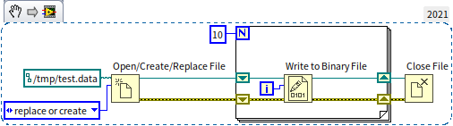

The program starts with the `Open/Create/Replace File` function. If no file path is wired, the function opens a file selection dialog box during execution. 

The function supports several operations via its **operation** parameter:
- **Open**: Opens an existing file. If the file does not exist, it returns an error.
- **Create**: Creates a new file. If the file already exists, it returns an error.
- **Replace**: Replaces an existing file, overwriting its contents.
- **Open or Create**: Opens the file if it exists, or creates a new one if it does not.
- **Replace or Create**: Overwrites the file if it exists, or creates a new one if it does not. (Used in our example).

You can also specify the **access** permissions: *read-only*, *write-only*, or *read/write*. Restricting access to *read-only* for files that should not be modified is a good practice to prevent accidental writes.

The function outputs a **File Refnum** (file handle) representing the opened file. This refnum is passed to subsequent read, write, and close operations.

The `Write Binary File` function takes whatever is wired to its **data** input and writes it to disk. Although the input terminal is a generic Variant, it accepts almost any datatype. In our loop, we write 10 integers (0 to 9) sequentially. The **byte order** parameter determines the endianness of the written data. For example, a 32-bit integer (I32) consists of 4 bytes. 
- **Little Endian**: Stores the least significant byte in the lowest memory address (common in modern x86/x64 CPUs).
- **Big Endian**: Stores the most significant byte in the lowest memory address (common in network protocols).

Either setting works; you must simply ensure that you use the same byte order for both reading and writing.

Finally, you must close the file refnum using `Close File`. To optimize disk access, file writes are buffered in memory. Closing the file flushes this buffer and ensures all data is written to disk.

If you attempt to open the resulting binary file in a text editor (like Notepad), you will see unreadable characters:

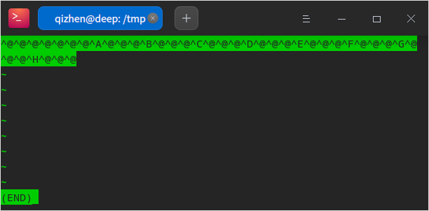

To retrieve the data, you must write a program to read it back:

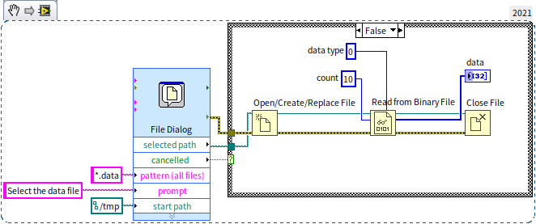

In this program, we use the **File Dialog** [Express VI](measurement_express_vi) to select the file. Express VIs open a configuration dialog when placed on the block diagram or double-clicked:

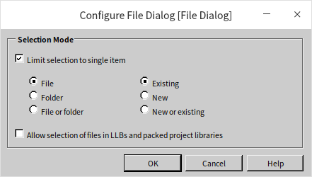

In the configuration dialog, we set it to select a single, existing file. We also configure the file pattern to filter for `.data` files, set the initial path to `/tmp`, and set the prompt message.

When the program runs, it opens a file browser:

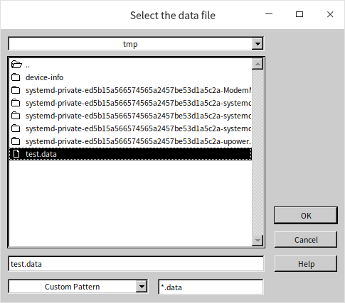

If the user clicks **Cancel** in the file browser, the program should bypass the subsequent read steps. The program checks the **cancelled** Boolean output of the Express VI and exits if it is True.

The `Read Binary File` function must be configured to read the correct datatype. Since binary files contain no type metadata, the type input on the read node must match the type used during writing. While we could use a loop to read elements one by one, `Read Binary File` allows you to specify a **count** to read multiple elements at once. Setting count to `10` reads 10 integers in a single operation. Setting it to `-1` reads all remaining data in the file.

Although this example only saves integers, you can write mixed datatypes sequentially (e.g., writing two integers, then three Booleans, and then a cluster). As long as you read them back using the same type sequence, the data will decode correctly.

:::info

Here’s a thought-provoking question: In the earlier binary file writing example, we wrote 10 integers consecutively. What if we altered the program to write an array of 10 integers in one action? Assuming the integer values themselves are identical, would the data written to the binary file by these two methods be the same?

:::


### Reading and Writing Text Files

LabVIEW reads and writes text files using `Write Text File` and `Read Text File`. The following program demonstrates writing a string to a temporary file:

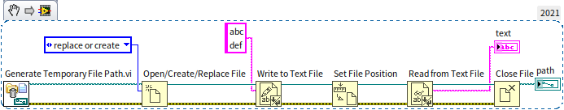

This program uses `Generate Temporary File Path.vi` to generate a unique temporary file path. This VI does not create the file; it simply returns a path inside the system's temporary directory. Using temporary paths is convenient because the operating system periodically cleans up this directory, preventing test files from cluttering disk space.

If you open the generated file, the content is readable:

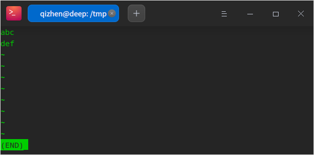

In the second half of the program, we read the data back. Because we did not close and reopen the file between writing and reading, we use the `Set File Position` function to reset the file pointer back to the beginning (`0`). Every read or write operation advances the file pointer by the size of the processed data. To reread written data, or to navigate to a specific byte offset in a large file, you must adjust the file pointer manually.

Text files are often structured as lines. The `Write Text File` function accepts both single strings and arrays of strings (where each element is written as a line). Similarly, `Read Text File` can output lines as an array of strings. Right-click the `Read Text File` function and select **Read Lines** to configure it to parse line breaks. Setting the count to `-1` reads all lines in the file:

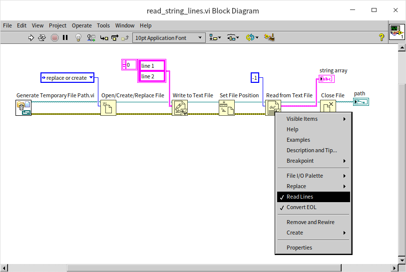

Alternatively, if you read the entire file as a single string, you can parse it into an array of lines using `Delimited String to 1D String Array.vi`. The program below is functionally equivalent to the one above:

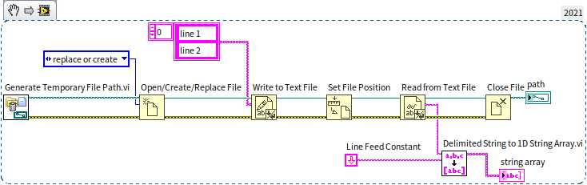

The `Write Text File` and `Read Text File` functions include a **Convert EOL** (End of Line) option in their right-click menus.
- **Windows**: Uses carriage return and line feed (`\r\n` / CR+LF).
- **macOS (Modern) / Linux**: Uses line feed (`\n` / LF).
- **macOS (Legacy, version 9 and earlier)**: Uses carriage return (`\r` / CR).

Most source code files and files downloaded from the web use Linux-style `\n` line breaks. If **Convert EOL** is enabled on Windows, LabVIEW automatically converts line breaks to `\r\n` during writes, and converts them back to `\n` during reads.


### Interchangeable Formats: Binary and Text Files

Since text files are specialized binary files, can we use binary functions to read and write them? For instance, what happens if you write a string using `Write Binary File`?

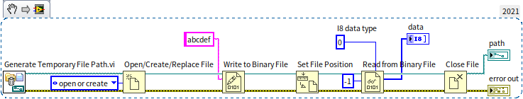

This program writes the string `"abcdef"` to a binary file. When opened in a text editor, the string is visible, but it is preceded by unreadable characters:

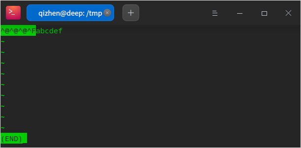

To see what was written, the program reads the file back as an array of U8 integers (where each element represents a single byte):

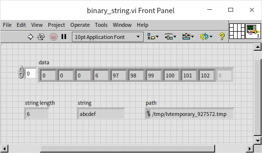

The output reveals that the file starts with four bytes representing the 32-bit integer `6` (the length of the string), followed by the ASCII bytes for `"abcdef"`. By default, the `Write Binary File` has the **Prepend array or string size** parameter set to True. This helps the `Read Binary File` function know how many bytes to read.

If you want to write a raw text file using binary functions, you must change this parameter to False. Alternatively, you can convert the string to a U8 array and write it:

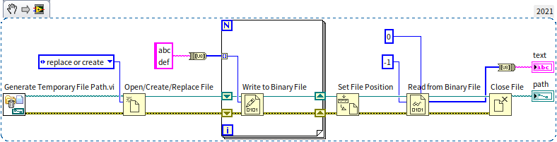

Similarly, you can use `Write Text File` to generate binary files. In [Strings](data_string), we discussed **flattening** data into a byte stream. Writing flattened data using `Write Text File` produces the exact same file structure as using `Write Binary File`. The two methods below are functionally equivalent:

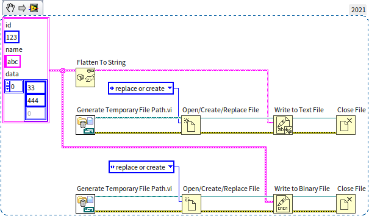


## Commonly Used File Formats in LabVIEW

While custom binary or text formats offer flexibility, they make data sharing difficult because external users must know your exact layout. To prevent this, developers use standardized file formats.

LabVIEW supports many standard formats on the File I/O palette, such as spreadsheet files, measurement files, configuration (INI) files, TDM/TDMS files, XML, and JSON. These follow the same open-read-write-close pattern, though some combine opening and closing inside the read/write nodes.


### Spreadsheet Files

Spreadsheet files are text files designed to store two-dimensional tabular data. Data points are separated by delimiters:
- **CSV (Comma-Separated Values)**: Uses commas (`,`) to separate columns, typically saving as `.csv`.
- **TSV (Tab-Separated Values)**: Uses tabs (`\t`) to separate columns, typically saving as `.tsv`.

These files are widely used to exchange data between LabVIEW and office applications like Microsoft Excel, Google Sheets, or WPS Office.

Writing a spreadsheet file in LabVIEW is simple:

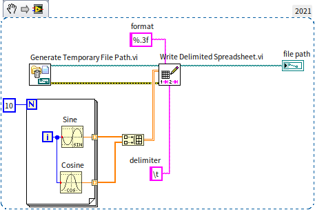

Regardless of the input array type, values are formatted as strings before being written. You can configure the formatting string (e.g., `%.3f`) to control precision. See [Strings](data_string) for details.

The resulting file looks like this:

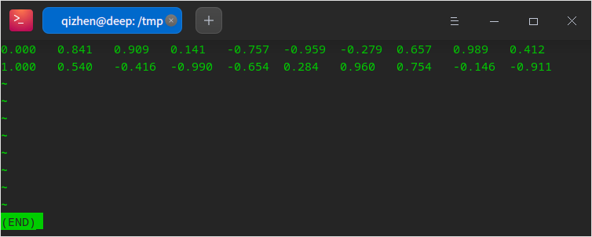

Consider a sample dataset `weight_height.csv` downloaded from the web:

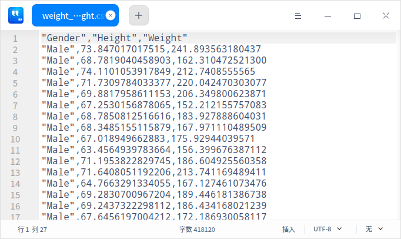

This file contains three columns: gender (string), height (float), and weight (float). We can read and parse this file using the following program:


`Read Spreadsheet File` is a [Polymorphic VI](oop_generic). By default, it supports reading Double (DBL), Integer (I64), or String arrays. Because our file contains mixed data (strings and numbers), reading it as DBL would discard the gender column. Therefore, we read the entire file as a String array, and then manually parse the height and weight columns into numbers.

Because this file uses commas, we must wire a comma (`,`) to the **delimiter** input (which defaults to tab).

The first row containing column headers is discarded, and the numeric columns are plotted on an XY Graph:


See [Graphical Data Display](data_graph) for more on plotting data.


### Configuration Files (INI)

Configuration files, commonly referred to as INI files, save program settings (such as window positions, user preferences, and lists of recently opened files) so the application can restore its state when restarted. In Windows, LabVIEW's settings are stored in `LabVIEW.ini` in the same directory as `LabVIEW.exe`.

INI files are plain text files divided into sections:

```ini
[LabVIEW]
IconEditor.TextFont="LabVIEW Application"
IconEditor.TextSize=00000009
```

- **Section**: Demarcated by brackets (e.g., `[LabVIEW]`). Section names must be unique within a file.
- **Key-Value Pair**: Located under sections (e.g., `IconEditor.TextFont="LabVIEW Application"`). Keys must be unique within a section. Values can be strings or numbers.
- **Comment**: Lines starting with a semicolon (`;`) are ignored.

```ini
[section_one]
key1=1
key2="some string"

[section_2]
key1=2.5
; This is a comment
;key_five=7.99
```

The INI VIs are polymorphic and support six basic datatypes: Boolean, DBL, I32, Path, String, and U32. Writing to a non-existent section or key automatically creates it. Reading a missing key returns a user-defined default value.

Here is a program that writes data to an INI file:

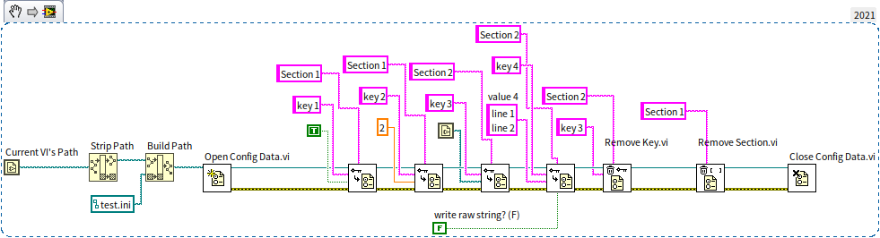

This program gets the current VI's directory, constructs a path for `test.ini`, and opens it using `Open Configuration Data.vi`. It writes several values, deletes a specific key and section using `Delete Key` and `Delete Section`, and then closes the file using `Close Configuration Data.vi`. 

Data is written to the physical disk only when the file is closed. `Write Key` updates values in memory; if you fail to close the refnum, your changes will be lost.

Running the program generates the following INI file:

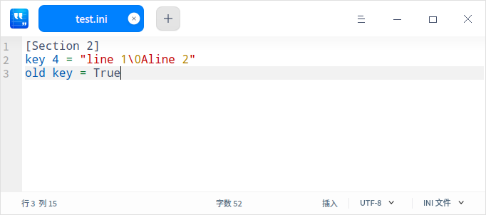

The carriage return in key 4's value is encoded as `\0A`. 

You cannot pass complex structures (like arrays or clusters) directly to `Write Key`. To store them, you must convert them to formatted strings. For example, `LabVIEW.ini` stores recent file paths as a single string separated by colons (`:`). You can flatten your data to a string before writing it to the INI file.

Reading from an INI file follows the same logic:

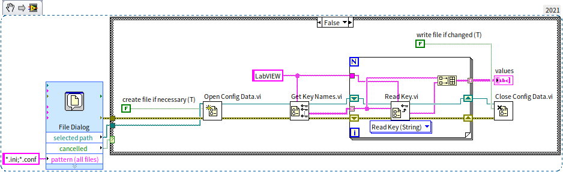

This program opens `LabVIEW.ini`, retrieves all key names under the `[LabVIEW]` section using `Get Key Names.vi`, and reads their values in a loop. Because we want to read all keys in a single loop, we read them as Strings (since all text data can be read as a string). The output displays the environment settings:

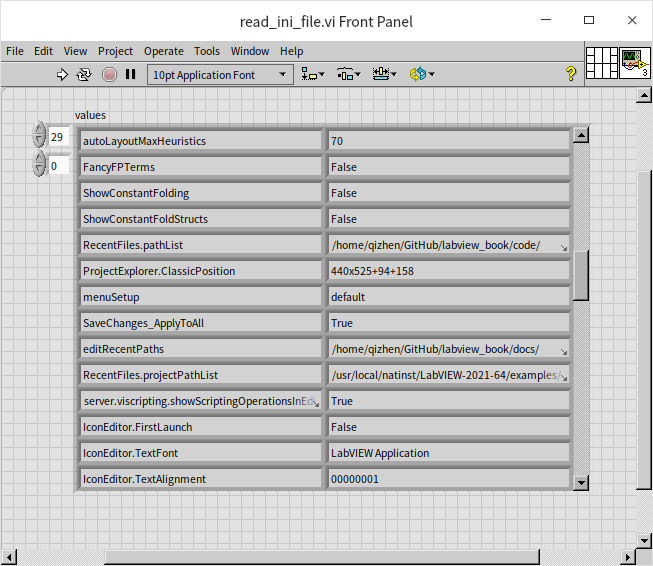

Because parsing text-based INI files is slow, they should only be used for small settings files, not for logging large measurement datasets.


### LabVIEW Measurement Files (.lvm)

LabVIEW Measurement Files (`.lvm`) are text-based ASCII files designed to store signal data. They are generated using the `Write Measurement File` Express VI:

For beginners, Express VIs simplify file operations. You do not need to manually handle opening, formatting, and closing VIs. You simply wire your signal data directly to the input terminal of the Express VI and configure settings (such as delimiter styles, headers, and file paths) in a pop-up dialog.

However, because `.lvm` files are text-based, they are very large and slow to write. They are only suitable for low-speed, short-duration logging.


### TDM and TDMS Files

To resolve the speed and size limitations of text files without losing descriptive metadata (such as units, channel names, and test conditions), National Instruments introduced the **TDMS (TDM Streaming)** format.

TDMS is a binary format that organizes data in a structured, database-like hierarchy: **File -> Group -> Channel**.

The TDMS APIs are located in the **Programming -> File I/O -> TDM Streaming** palette:
- **TDMS Open/Create**: Opens or creates a `.tdms` file.
- **TDMS Write**: Writes waveforms or numeric arrays. TDMS is highly optimized for streaming raw binary data to disk at high speeds, making it ideal for high-frequency logging.
- **TDMS Set Properties**: Allows you to attach custom metadata (e.g., `"Sensor ID"`, `"Calibration Date"`, `"Operator"`) directly to the file, group, or channel. This is impossible with raw binary files.
- **Excel Plugin**: NI provides an Excel plugin that allows users to open and inspect TDMS files directly in Excel, combining binary performance with visual convenience.

TDM is an older, Windows-specific predecessor that splits data into two files: a `.tdx` binary file for raw data and a `.tdm` XML file for metadata. TDMS has largely replaced TDM because it combines both elements into a single `.tdms` file, simplifying file management.

#### Typical Use Cases
1. **Industrial Monitoring**: Long-duration logging of temperature, pressure, and vibration from multiple machinery sensors, storing timestamps and machine IDs alongside the signals.
2. **Scientific Experiments**: Logging high-frequency particle or event data while storing calibration parameters and laboratory conditions in the file properties.
3. **Automotive Testing**: Recording real-time vehicle metrics (speed, engine temperature, torque) during road tests, allowing for easy post-test analysis.


### XML and JSON Files

XML (eXtensible Markup Language) and JSON (JavaScript Object Notation) are text-based formats widely used for structured data exchange and configuration files. Both are human-readable and represent hierarchical relationships using tags or key-value pairs.

#### XML

XML represents complex data hierarchies using nested tags.
- **Writing XML**: Use LabVIEW XML functions to construct elements, attributes, and text nodes. For example, you can write sensor readings wrapped in custom tags along with attributes like units and timestamps.
- **Reading XML**: LabVIEW includes parsers to read XML documents and extract specific values from tags.
- **Data Conversion**: The `Flatten to XML` function converts any LabVIEW datatype (clusters, arrays, etc.) directly into an XML string. `Unflatten from XML` restores the original datatype.

#### JSON

JSON is a lightweight, human-readable format based on key-value pairs, commonly used in web services and modern application configurations.
- **Writing JSON**: LabVIEW allows you to build JSON objects and arrays where keys are strings and values can be strings, numbers, arrays, or nested objects.
- **Reading JSON**: You can parse JSON strings and extract values associated with specific keys.
- **Data Conversion**: LabVIEW 2013 and later natively supports JSON via the `Flatten to JSON` and `Unflatten from JSON` functions. These functions allow you to easily serialize and deserialize clusters and arrays for web APIs or configuration storage.


### Waveform Files

Waveform files (`.wdt`) are binary files specifically designed to store LabVIEW Waveform datatypes. A waveform datatype contains a start time ($t0$), a sample interval ($dt$), and an array of signal values ($Y$). 

- **Data Acquisition**: When capturing signals using DAQmx, you can write the acquired waveforms directly to disk using Waveform File VIs.
- **Efficiency**: Because they use binary format, waveform files are compact and fast, making them suitable for long-term logging of high-frequency signals. However, they cannot be read in standard text editors. You must read them back into LabVIEW using the Waveform File VIs for graphing or signal processing.


## Practice Exercise

1. **Write to File**:
   - Create a new VI in LabVIEW.
   - Use the `Write Text File` function to write a series of numbers or a user-input string to a file.
   - Add a file path control to allow the user to specify the file path and name.
2. **Read from File**:
   - Use the `Read Text File` function to read the contents of the file you just created.
   - Display the read content on the front panel using a string indicator.
3. **Execution**:
   - Run the VI, write data to disk, and verify that the string indicator correctly displays the read text.
