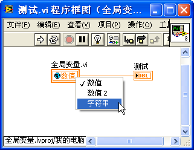
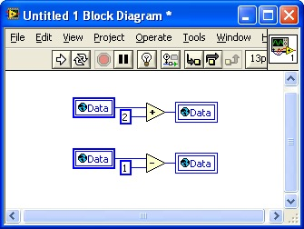
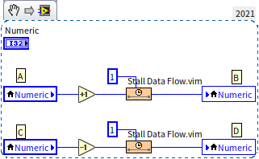
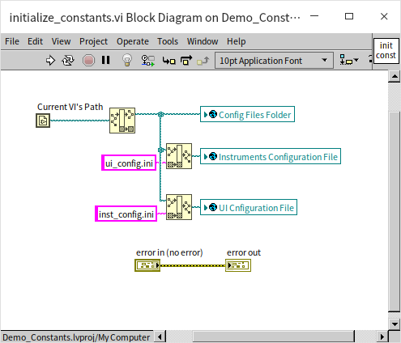
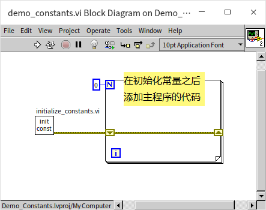
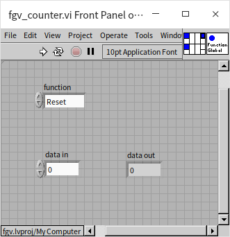
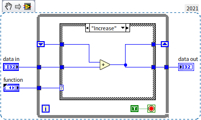
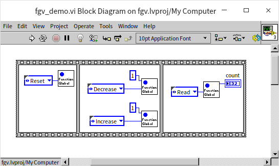
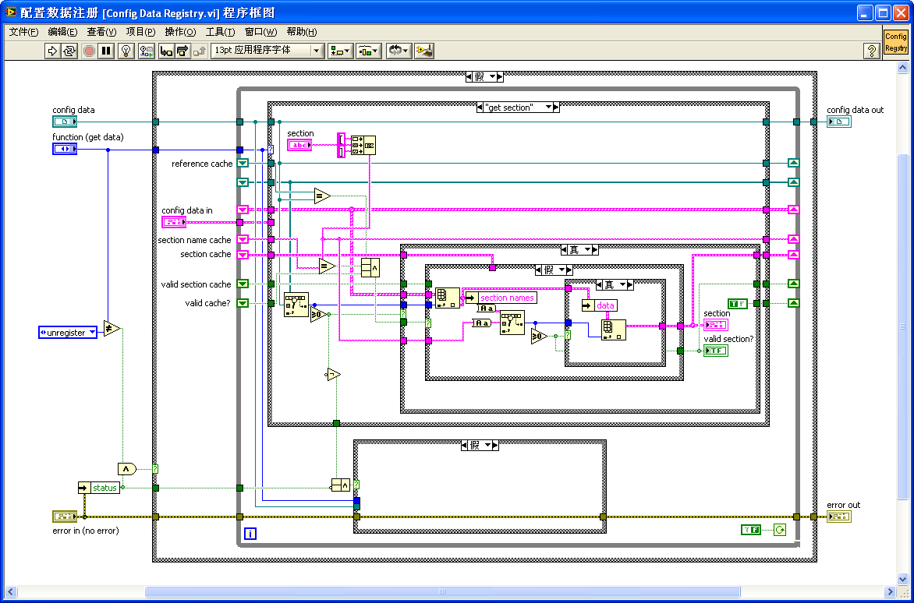

# 全局变量和功能全局变量

## 全局变量

全局变量与[局部变量](data_and_controls)类似，是一种可以让数据随时流入流出其间的对象。它与局部变量的区别在于，局部变量只能在其对应控件所在的 VI 中使用，而全局变量可以在一个程序中的任意 VI 上使用。使用全局变量时，数据被保存在某一固定的内存空间内，不随数据线流动，在需要读写数据的地方，直接对全局变量进行操作即可。

LabVIEW 的全局变量和局部变量是非常容易被滥用的功能，因为它们用起来很方便，可以随时随地读写数据。但是它们非常不安全，容易导致一些莫名其妙又难以调试的错误，同时它们还破坏了数据流顺序的逻辑关系，导致程序可读性和可维护性严重下降。所以我们应当尽量避免在程序中使用全局变量或局部变量。我们在[局部变量](data_and_controls#应用于多线程间的共享数据)一节讨论了适合使用局部变量的场景。对于全局变量，笔者建议仅仅把它用于常量定义，其它情况都应该避免使用。下面我们详细讨论一下全局变量的用法和问题。

### 创建全局变量
在 LabVIEW 的新建对话框中选择“全局变量”即可创建出一个空白的全局变量 VI。

或者在一个 VI 的程序框图上，选择函数选板的“编程 -\> 结构 -\> 全局变量”，也可以创建出一个空白的全局变量实例，双击这个全局变量实例，会打开一个空白的全局变量 VI。全局变量 VI 是一种特殊的 VI，它只有前面板，没有程序框图。在全局变量 VI 的前面板上可以放置多个控件，每个控件表示一个全局变量数据。由于一个全局变量 VI 可以存放多个全局变量数据，在编程时，可以将相关度较大的全局数据放都在一个全局变量 VI 中，以便于管理。

不论控件是控制型的还是显示型的，它所表示的全局变量都既可读也可写。在 VI 上任何需要使用这个全局变量数据的地方，把全局变量 VI 拖到程序框图上即可生成全局变量实例，然后对其进行读写。下图中内含小地球图标的矩形方块就是一个全局变量实例，在同一版本 LabVIEW 的程序框图上，全局变量与局部变量的外观是一致的，只有图标有所区别，一个是小地球，一个是小房子。

通过这个全局变量实例，程序可以读写全局变量中的数据。如果一个全局变量 VI 上有多份全局变量数据（多个控件），在这个全局变量 VI 对应的实例上点击鼠标左键，或在右键菜单的“选择项”中，可以把这个实例与全局变量中不同的数据相关联。

通常，在不会引起误解的情况下，我们会把全局变量 VI、全局变量数据、全局变量实例，都简称为全局变量。

### 数据竞争状态

竞争状态是指在多个线程中，由于同时访问同一资源所引发的程序结果的不确定的状况。比如下面这个程序，假设全局变量 Data 的值原本为 0，运行完下面这个 VI，Data 中的值是几呢？

从程序的逻辑上看，它先把 Data 加 2 再减 1，程序设计的意图是希望结果为 1。但实际上，运行 VI 后，Data 的值可能是 1，也有可能是 2，还可能是 -1。程序中的代码分为上下两个部分，两部分之间没有数据线相连。按照我们前面所介绍的 LabVIEW 的运行机制，这两部分的代码应当同时在不同的线程内运行。这里需要更确切地解释一下：所谓同时运行是一个宏观的说法，如果我们在宏观的时间范围内定义，时间差距小于 10 毫秒就算同时，那么可以说计算机是同时在时执行两个任务。但是，从微观的角度来看，比如在纳秒这个时间上观察，计算机可能就并不是真正的在“同时”执行两个任务了。有时候，不同线程的两段代码可能恰好是在两个 CPU 上同步在运行的；也有很多时候，计算机先运行完了一个线程的代码，立刻又运行了另一个线程内的代码，但时间间隔非常短，可能完成两个任务的时间差只有几个纳秒。人类对时间的感知是分辨率极低的，对于我们来说，计算机就是在同时执行两个任务了。

我们从微观的时间角度来考虑一下上图中的程序：程序没有指定上下两个部分的代码的执行次序，程序先执行哪一个任务是随机的。若程序先执行完上半部分的全部代码，再执行下半部分代码，则 Data 最终的值是 1。若程序先执行上半部分的读全局变量，再加 2；然后切换到另一线程，执行下半部分的读全局变量，再减 1；接着执行上半部分的写全局变量；最后执行下半部分的写全局变量。Data 最终的值就是 -1。所以，这个程序的运行结果是不确定的，也就是说，出现了竞争状态。

局部变量同样会引起竞争状态，比如下图中的程序：

这个程序中添加了两个延时子 VI“Stall Data Flow.vim”，它们会让程序延时一毫秒。这个延时是为了提高竞争状态出现的概率，以方便我们解释问题。在程序同样假设局部变量 Numeric 的初始值是 0。

* 如果程序执行的顺序是，先在 A 处取出数据 0，加 1，再在 B 处写入数据，这时局部变量数值为 1，再从 C 处取出数据，还是 1，减 1,在 D 处写入结果。最终局部变量的结果是 0。
* 如果程序先在 A 处取出数据 0，加 1，然后从 C 处取出数据，这时局部变量中的数据仍然是 0，之后在 B 处写入数据 1，之后再把从 C 处读取的 0 减 1，在 D 处写入结果。最终局部变量的结果是 -1。
* 如果程序先在 A 处取出数据 0，加 1，然后从 C 处取出数据，然后减 1，在 D 处写入结果 -1，之后在 B 处写入数据 1，这样程序的最终局部变量的结果是 +1。

我们肯定不会希望自己的项目里有这种结果不确定的代码出现。相比之下，全局变量比局部变量更糟糕，因为局部变量只在一个 VI 内有效，我们如果认真检查一个 VI，也许还可以排查出有竞争状态的代码。但全局变量在所有的 VI 内都可以被读写，排查问题的难度就被大大增加了。尤其是在有多人合作的大型项目中，我们可能很难确保一个全局变量有没有被别人在其它某个 VI 里改动了。

除了可能出现的竞争状态，全局变量会降低代码的可读性，因为代码上的全局变量，不能直观地反映出它的数据来源。数据线和数据流动方向是理解 LabVIEW 代码时重要的提示信息。此外，VI 每次读取全局变量数据，LabVIEW 都要为读到的数据复制一个新的副本，这导致它的运行效率也比较低。鉴于这么多的缺点，我们应该尽量避免使用全局变量。

### 使用信号量避免数据竞争状态

既然提到了数据竞争状态，我们顺便介绍一种基础的避免数据竞争状态出现的方法：使用信号量（Semaphore）来保护临界区（Critical Section）。临界区是指一段访问共用资源的程序片段，而这些共用资源又是无法同时被多个线程访问的。比如计数器，计时器，数据文件，打印机，测量仪器，数据采集设备硬件等都是这样的资源，如果它们同时被多个线程读写，很可能就会引起数据混乱。上文示例中引起竞争状态的全局变量和局部变量的读写代码就应该是临界区。

使用信号量是一种非常底层的方法，通常在编写 LabVIEW 程序时都不需要使用到这么底层的方法。因为很多常用的 LabVIEW 功能它们本身已经实现了对临界区的保护，不需要编程者再额外费心考虑这些问题。比如，本书后面会介绍到的功能全局变量，[元素同址操作结构](/pattern_pass_by_ref#数据引用节点)等，它们自身就带有临界区保护功能。在那些功能的内部最底层，也都是利用了类似的信号量机制来保护数据的。下面我们利用这个机会，来了解一下，它们在底层是如何预防数据竞争的。

信号量(Semaphore)，有时也被称为信号灯，它是一种用来保证两段代码（或两个 VI）不会在不同线程内同时被调用的机制。具体方法是：在进入一段代码段之前，线程必须拿到信号量，也可以说锁住一个信号量。一个信号量被锁住，其它的线程就无法拿到或锁住它了。一个线程必须拿到信号量之后才能继续执行后续的代码，临界区代码执行结束，线程释放或者说解锁信号量；如果信号量已被其它线程拿走了，当前线程就无法再拿到它了，这时只能等待，直到其它线程解释放了信号量，才可能拿到它。也就是说，在任一时刻，只有一个线程（拿到信号量的线程）可以读写它，没有其它线程来竞争，也就不会有数据的竞争状态了。

LabVIEW 中操作信号量的 VI 在函数选板“编程 -> 同步 -> 信号量”上，图标就是个信号灯。我们使用信号量，把上图中使用局部变量引起竞争状态的代码改进一下：

程序首先要为需要保护的数据或资源创建一个信号量，程序中可以创建多个信号量分别保护不同的资源。示例中只有一个局部变量需要保护，所以调用“Obtain Semaphore Reference.vi”创建一个信号量就可以了。接下来有两个线程（两段并行的代码）分别都对这个局部变量进行了处理，我们需要在这两段代码中做相同的改进：在进入代码前，先调用“Acquire Semaphore.vi”去锁住信号量，然后执行正常的代码对局部变量数据做处理，更新局部变量数据后，再调用“Release Semaphore.vi”解锁信号量。对于已经锁住的信号量，“Acquire Semaphore.vi”会等待，直到其它线程解锁后再锁住线程。主程序在结束前还要记得调用“Release Semaphore Reference.vi”释放掉创建的信号量。这样，程序中的两段读写局部变量的代码（两个临界区）就被信号量保护起来了，它们绝对不会被同时运行，所以也就不会产生竞争状态。现在再运行这个程序，控件 Numeric 中的结果始终会是 0，不论是先运行加法还是先运行减法。

这里想请读者思考一个问题：我们使用信号量保护了自己的数据，使得它们不会进入竞争状态。那么，谁来保护这个信号量呢？如果两个线程（运行在两个 CPU 上），在同一时钟周期里去锁同一个信号量，是不是就出现竞争状态了？

### 常量定义

笔者唯一能想到的比较适合使用全局变量的应用，是在小型项目中，把它当做常量来使用。所谓常量，就是在程序运行过程中不会改变的数据。常量只是在程序运行过程中不会改变，并不表示永远不变，所以直接把数据硬编码在程序中，是不利于程序维护的。比如，我们编写了一个生成报表的程序，其中段落的字号是“10”，于是，在程序的各个 VI，不同的地方都使用了“10”这个数据。然后某一天，客户突然改了要求，要使用 11 号字体，于是我们就必须把程序中每个 10 都找出来，替换成 11。这样既很麻烦，又容易遗漏一些数据，也容易改错一些数据。改进的方法就是设置一个名为“字号”的常量，它的值是 10。在程序中所有需要设置字号的地方，都不能直接使用数字 10，而是必须使用“字号”常量来设置字号。当客户要求把字号改为 11 时，只要改变“字号”常量的值就可以了，程序任何其它地方都不需要改动。

文本编程语言中，常量应用的非常普遍。比如 C 语言常常使用宏定义常量； C++、Java 等使用关键字 Const 定义常量。LabVIEW 中没有专门的常量定义方法。如果程序所需的常量不多，可以直接使用子 VI 返回一个数据作为常量。比如上文中的例子，可以定义一个名为“字号.vi”的 VI，它有一个输出参数，就是字号的数据。如果项目中需要的常量比较多，每个常量都配一个 VI 会比较麻烦，而且会搞不清楚哪些 VI 是用作常量的。这时，可以考虑一个比较简单的实现常量的方法，就是使用全局变量。

我们可以约定好，程序中任何地方都只能读取全局变量的值，不能改变任何全局变量的值。一个全局变量如果没有在程序里被设置过，那么它的值，就是全局变量 VI 上，那些数据[控件的默认值](data_and_controls#控件的默认值)。或者更复杂一些，有些常量的值会依赖于系统环境或依赖于另一些常量的值，那么，就在程序最开始的时候，设置一个子 VI 专门用于初始化所有的全局变量，之后在程序的任何地方就都不能再改变这些全局变量了。有了这样的约定，我们就可以确定在程序中，没一个全局变量的值都是不可变的，就可以避免前面提到的全局变量的缺点。

下面是一个使用全局变量作为常量定义的示例。当程序需要使用全局变量时，规模肯定已经大到至少会包含数个 VI 了，所以为程序设置一个[项目](ramp_up_complex_vis#项目)是必要的。下图是这个演示程序的项目：

“Constants.vi”是一个全局变量 VI，这上面定义了被作为常量使用的全局变量。这些常量代表了几个文件路径：

这些控件已经有了默认值，可以直接在程序中被当做常量来使用了。可是有时候，常量的值需要在每次程序启动时才能确定下来。在演示程序中，“initialize_constants.vi”用于在程序启动时给所有常量设置一个值：

它根据当前 VI 的路径设置了几个常量的值。在这个 VI 中，有一个 error in 和一个 error out 控件，它们仅用于[控制程序的流程](structure_cond_seq#无形胜有形的最高境界)，不传递实际数据。在实际程序中，首先调用这个初始化 VI 给所有常量设置所需的数据，之后程序中就只可以读取这些常量全局变量：

把全局变量当做常量，还是不够安全：全局变量本身毕竟没有限制读写的功能，如果项目组来了个不知内情的新人，偷摸在某个底层 VI 中修改了全局变量的值，还是会给程序维护带来极大的麻烦。所以，在大型程序中，如果需要使用到常量，最好还是为所有的常量创建一个 [类](oop_class)，使用[类的属性](oop_class#属性-数据)保存常量数据，利用类的[方法的访问权限设置](oop_class_pro_con#访问权限)来控制对常量的读写。关于类的概念和使用，本书将在 [面向对象编程](oop__) 一章做详细讲解。

## 功能全局变量

利用循环结构中移位寄存器的特性，也可以保存全局数据。使用这种方式保存全局数据的子 VI 叫做功能全局变量。功能全局变量的基本结构模式都是类似的：它是一个[非可重入](pattern_reentrant_vi)的 VI，程序主体是一个只迭代一次的[循环条件结构](pattern_state_machine#循环条件结构)；有一个用于选择某种操作的输入控件；若干用于输入和输出数据的控件。功能全局变量不但可以保存数据，同时也提供了相关的访问这些数据的方法，也就是对这些数据的操作，这也是它被称为“功能全局变量”的原因：不但有全局变量，还有“功能”。

### 创建功能全局变量

功能全局变量是 LabVIEW 中一种重要的对数据和方法进行封装的手段。封装是指把高度相关的一组数据和方法组织在一起，形成一个相对独立的模块。这里说的封装，与[面向对象中的封装](oop_basic#封装数据抽象)是一回事，只是封装的手段不一样。在功能全局变量中，数据被存放在移位寄存器中，它所有的功能也就是封装的方法是直接通过这个功能全局变量 VI 调用的。我们下面通过一个实例来解释功能全局变量是如何实现和工作的。假设我们需要实现一个“计数器”，这个计数器有四个功能，让计数清零、增加一定的计数、减少一定的计数和读取当前计数值。

下图是我们为这个功能全局变量演示程序创建的项目：

“fgv_counter.vi”是实现了功能全局变量的 VI，它的前面板如下所示：

所有功能全局变量都会有一个控件用于指定调用哪一项功能（也常常被称作 Action，操作），它最适合使用[枚举类型](data_custome_control#枚举)控件来实现。在这个示例程序中，我们用“function”控件来指定调用的功能，它有四个枚举项：Reset（计数清零），Increase（增加计数），Decrease（减少计数），Read（读取当前的计数）。功能全局变量还会有若干控件用于数据的输入输出，不同的功能可能会需要一些不同的数据。在我们的示例中，只需要一个输入数据“data in”，用于指定增加或减少的数量，和一个输出数据“data out”，用于返回当前的计数。

功能全局变量中使用循环结构只是为了利用它的移位寄存器，因此这个循环每次调用只会迭代一次。移位寄存器并不连接任何初始化数据，因此，每次调用这个功能全局变量时，它读出上一次调用时存入移位寄存器的数据，并把这一次 VI 执行结束时的数据存入移位寄存器。这样，就可以在程序的全程保存、处理或使用移位寄存器中的数据了。功能全局变量 VI 绝对不可以被设置为可重入，否则在程序不同之处得到的移位寄存器中的数据就不是同一份了。

下面四张图分别是这个功能全局变量处理不同功能的程序框图：

  

  

程序功能比较简单，“Reset”时，把数值 0 存入移位寄存器；“Increase”和“Decrease”把移位寄存器中的数值加或减去输入的数据，结果存数移位寄存器；“Read”则读取移位寄存器中的数据输出。

对于仅运行一次的循环，可以使用[反馈节点](data_array#反馈节点)来代替循环结构和它的移位寄存器。反馈节点的本质也还是移位寄存器，但是它可以省略一个循环结构，让程序框图看上去更干净一点。下图是使用反馈节点编写出的一个完全等效于上例的功能全局变量：

设计功能全局变量时还可以加入出错处理的连线，以便于在使用时确定功能全局变量的调用顺序。

### 功能全局变量的优缺点

与全局变量相比，功能全局变量有两个主要的优点。

首先，功能全局变量可以防止竞争状态出现。因为功能全局变量的 VI 是[非可重入](pattern_reentrant_vi)的，所以把它作为子 VI 时，绝对不可能出现两个功能全局变量 VI 同时执行的情况。即便是被同时调用，每次也只会有一个功能全局变量子 VI 去读取移位寄存器中的数据，然后处理数据，把结果写回到移位寄存器之后，退出这个子 VI，其它子 VI 才能开始运行。绝对不会出现一个子 VI 读取了移位寄存器，还没处理完数据，另一个线程中的子 VI 又来读取同一移位寄存器的情况。

比如下图中的程序，运行的结果必然是 count = 0：

即便程序中的加一和减一两个子 VI 调用可以在不同线程中，其程序运行结果也必然是一个确定值。但是，需要注意的是，解决了竞争状态不等于全局变量的使用顺序可以乱写。解决竞争状态意味着程序不会出现不确定的运行结果，但错误的顺序仍然可能导致错误的结果。比如，在本例中，加减法的顺序是可以随意放置的，它们不影响程序最终的结果，但清零操作的顺序不能混乱。先做加法，还是先清零肯定会导致不同的程序运行结果。

功能全局变量的另一优点是，功能全局变量限制了使用者对数据的操作。功能全局变量中的数据可以看作是被功能全局变量 VI 私有的，它只能被全局变量本身所使用。项目中其它 VI 只能调用功能全局变量提供出来的方法去操作数据。这种对访问模块中的数据所做的限制大大提高数据的安全性。尤其在很多时候，模块的编写者和这个模块的使用者很可能不是同一个程序员，使用者不见得完全了解如何操作模块中的数据才安全。因此，对模块中数据进行必要的限制，防止模块使用者对模块数据的滥用，是非常必要的。

比如上文使用的功能全局变量示例，使用者在在调用它的时候，是无法直接给计数器设定一个任意值的，使用者只能对计数器清零或加减。甚至，在某些情况下也可以不提供读取数据的功能，让这个全局数据与模块使用者完全屏蔽。模块使用者只能利用全局变量提供的方法查看数据处理后的结果。这样全局数据被很好地隔离开来，避免了被不当改动的风险。

另外，如果全局数据的数据量比较大（比如一个长数组），那么可以利用功能全局变量的这一特点，每次只把所需的全局数据中的某一部分写入或读出。这样就避免了大块数据的拷贝，提高了程序效率。鉴于上述两个忧点，在需要使用全局变量的时候应当首先考虑使用功能全局变量。

功能全局变量相对于普通全局变量最主要的缺点就是需要额外的编写一段代码，创建起来稍费事些。

### 功能全局变量的应用

功能全局变量比全局变量的历史还悠久，它在 LabVIEW 2.0 中就存在了，而全局变量是 LabVIEW 3.0 中添加的功能。功能全局变量虽然名字里有个“全局变量”，但它的应用远远超出了全局变量这一范畴。在 LabVIEW 还没有 LvClass，没有事件结构的时代，功能全局变量是最有效的对数据和方法进行封装以及限制访问权限的手段。历史上功能全局变量还有过很多别名，比如：LV2 Global（LabVIEW 2 全局变量，因为它是在 LabVIEW 2.0 中诞生的）, Action Engine（操作引擎）, VIGlobals（VI 全局变量）等等。当年，它和状态机一起成了软件工程在 LabVIEW 中应用的两大法宝，一度受到众多 LabVIEW 程序员的极力推崇，很多 LabVIEW 自带的程序模块也都基于功能全局变量。

一个典型的应用：在旧版本 LabVIEW 中读写配置文件（INI 文件）的模块就是采用这种模式编写的。在 LabVIEW 8.6 或之前的版本中，打开“\[LabVIEW\]\\vi.lib\\Utility\\config.llb\\Config
Data
Registry.vi”，可以看到，这个 VI 是“配置文件 VI”的一个底层模块。函数选板“编程 -\> 文件 I/O-\> 配置文件 VI”中都是为 INI 文件（配置文件）提供接口的 VI。但是，打开这些 VI 的程序框图，就会发现，它们只是做了一些接口的包装工作。这些 VI 最终都调用“Config Data Registry.vi”完成相应的功能。而“Config Data Registry.vi”则采用功能全局变量模式，提供了对 INI 文件添加删除键值等的操作：

功能全局变量经常被应用在一下场景中：

* 保护临界区。临界区是指一段访问共用资源的程序片段，而这些共用资源又是无法同时被多个线程访问的。比如计数器，计时器，数据文件，打印机，测量仪器，数据采集设备硬件等都是这样的资源，它们同时被多个线程的程序访问时很可能引起数据混乱。利用功能全局变量的非可重入特性，可以有效保证每次只有一个线程的程序可以访问这些资源。换句话说，使用功能全局变量，编程者就不需要自己去调用信号量保护数据了。
* 封装可重用的功能模块。功能全局变量非常适合把相关的数据和方法都封装在一起，同时限制了模块外程序对模块内数据的访问。做到了高内聚低耦合，也就是说，模块内代码功能明确高度相关；对外部依赖又很低。这样的模块非常适合在不同的应用程序中被重复利用。

功能全局变量虽然有很多优点，但如果要把它作为更大的功能模块来使用，也同样存在很多不足。由于它和状态机都是基于循环条件结构的，因此，前文提到的状态机的缺点，功能全局变量也同样存在。比如，每次只能显示一个分支中的代码，不利于程序阅读等。

在使用功能全局变量模式编写的模块中，几乎所有的功能和数据接口都是在这个功能全局变量 VI 中完成的。如果模块的功能较为复杂，这个 VI 的连线也会十分复杂。即便采用子 VI，也无法简化很多。比如上图中这个功能全局变量就非常复杂了，想弄清楚它的工作原理恐怕还得仔细阅读和研究一段时间。

模块功能复杂，往往接口的数据也多。把众多的接口数据放在一个 VI 上提供给用户，用户很可能被这个 VI 上的数据搞得晕头转向，不知该如何使用。正因如此，LabVIEW 才没有直接把“Config Data Registry.vi”暴露给用户去使用，而是对它的结构再封装一层，每个 VI 只负责读或写某一两个给用户使用的接口数据。这样就大大方便了用户的使用。

把所有的结构数据都放置在一个 VI 上也会给维护带来问题。比如，模块需要增加或改动某个功能，可能又得给它添加新的参数，甚至不得不改变 VI 连线板的模式。

上面提到的这些缺点，在 [LvClass](oop_class) 中都得到了改善，并且 LvClass 还支持继承，多态等特性。所以在开发大型程序时，如果需要数据权限控制，封装等，应该首先考虑基于 LvClass 的面向对象的编程。上面提到的这个配置文件读写模块在新版本 LabVIEW 中也被使用 LvClass 进行了改写。

当然，使用 LvClass 会需要多创建很多额外的 VI，因此，对于数据和功能非常简单的模块（比如计数器这种），使用功能全局变量依然是个不错的选择。

## 练习

* 上文中，作为示例实现的计数器，有个缺点：在一个应用程序中，只能使用一个计数器。因为计数的数据是全局的，再应用程序任何地方访问计数器，得到的都是同一个计数数据。考虑如何使用功能全局变量编写一个升级版的计数器，使得在一个应用程序中可以使用多个这种计数器。不同的计数器分别计数，不会相互干扰。新计数器也只需要实现四个基本操作：“清零”、“加一”、“减一”和“读数据”。
